# P1：【录屏】内网生存之道-腹黑-漏洞银行大咖面对面63期 - 漏洞银行BUGBANK - BV1Tt411f7fp

Yeah。

Yeah。为知识而存，因技术而生，小伙伴们晚上好，欢迎参加第63期漏洞银行安全技术直播大咖面对面，我是主持人秋秋。本期大咖大家不会陌生，他是com group057的发起人。

是白帽100个安全攻防实验室的负责人，更是WMP战队队长。没错啦，他就是腹黑。今晚我们有幸请到腹黑大咖为我们进行主题为内网生存之道的技术直播分享。相信小伙伴们已经期待已久。在富黑大咖演讲结束后。

我们还会有10到15分钟的互动问答环节。大家如果有什么想问的想聊的，到时都可以来找大咖交流哦。问答结束后，腹黑将会选择一名幸运观众赠送书籍mata point渗透测试魔鬼幸运练营。好了，那话不多说。

下面就有请腹黑大咖来揭开内网渗透的技术面杀吧。hello大家好，我是黑。介绍就不介绍了。我们讲今天的一个课程，它是那个内网生存之我教其实就是一些内网渗透中的一些技巧了。

然后难度的话定为三个星期我定两个星我怕姐打们定了个三个星期属入门级别的。然后咱们的话主要从四个方面来讲，一个是就内网前期的就拿进行一转发。

然后进行提前一些操作然当我们进入服务器之后进行一些信息收集并进行一个横向的一个移动。当我们都弄完了之做都做好了。接下们做实就是一个痕迹的一个清理了。后就我们所谓的收尾工程。

后这样话就整个内网渗透就结束了。然后一般实际的话其内网渗透是非常耗时间的那可能是几个月甚至长达几年都是有可能的。😊。

我们一起来看一下。首先的话说内网转发，当然我们前提是已经拿到不需要了一些东西了。我们这里列出了很多工具，然后都都是一些常见的像LLCX，然后EW，然后这个是这个是EW的一个升级版。

还有S5这个PY脚本是用的蛮方便的。然后就就运行就好了。一般来说，linux都自带thon环境嘛，也会比较舒服。然后还有NCNC的话是有linux版的，也有windows版的，用起来也是蛮舒服的。

都能用。然后其他的也是一样。我们看一下。ULcx。它用起来的话是比较简单的。像我们看一下，其实就两如果说做一个内网端口转发的话，其实它就两条命令。

首先把我们主机的3389端口转发到1个EPS的3333或444都行。这个端口随便你定反正都可以的。然后我们再去先听本期的这个3333端口，然后再把它转发给这个4444这样子。

那么这样子就可以做到一个端口转发。如果说我们在本机操作的话，那我们直接就放比如说我们要连接一个它的远程桌面，那我们直接就就是127。0。0。1。然后4444端口这样子也是比较方便的。

然后这是个本机的一个端口转发，为什么要这样子做呢？我们看它是把3389端口转发到了1个21端口，或者说个80端口这样子，这种一些常用的一些端口。为什么这样子呢？因为你在内网渗透的时候。

其实很多时候会有一些防火墙什么的。比如说你就很有可能这个3389端口，它是已经被办掉了。就你根本无法从这做一个入口去出去。那怎么办？但我还想连接远程桌面怎么办？那你只能把这个端口转发到其他地方。

通过这个端口去连接它。但我们知道2一端口啊，80端口这种端口一般来说的话是有一个放行策略的那么我只要把它转发上去，那是不是防火墙就默认给我放行了呢？那这样子的话，其实我们就可以连接进3389了。

然后还像NC反弹也是一样，它也比较简单。这个咱们可以等我演示一下。它直接在我们EPA上执行去坚定这个4444端口，然后再在我们的本机直接去把这个CMD给弹过去，通过tenet模式把CMD直接反弹过去。

这样子就可以了。咱们可以演示一下，其实这个比较简单。

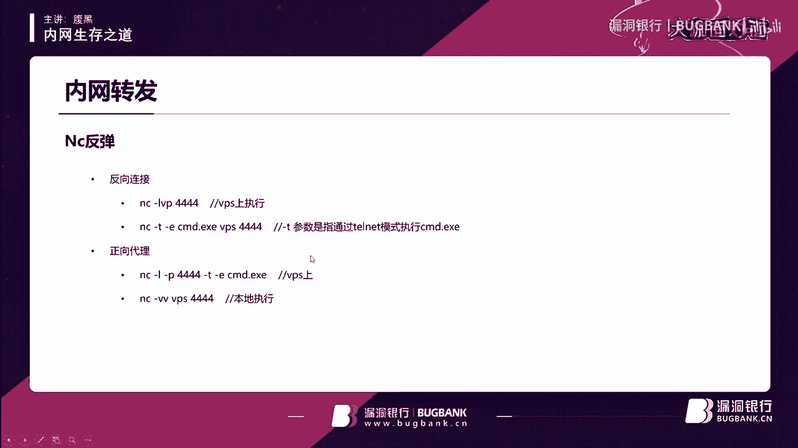

我看一下。A。嗯，哦大家看到这个文件夹，其实我已经推到get hub上去了，大家到时候可以直接在get hub上面就可以搜到这个它名字就叫phoneest tools。可以直接搜到的。

然后这些工具也全部都会在里面。

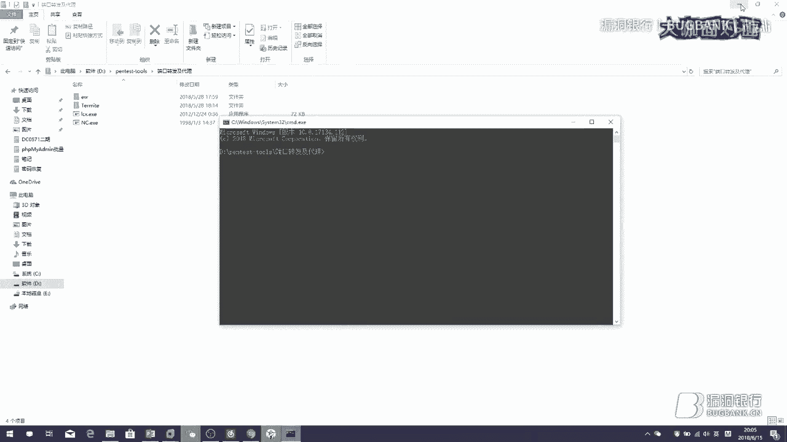

得要，咱们先在这边监听一下这个4444端口。

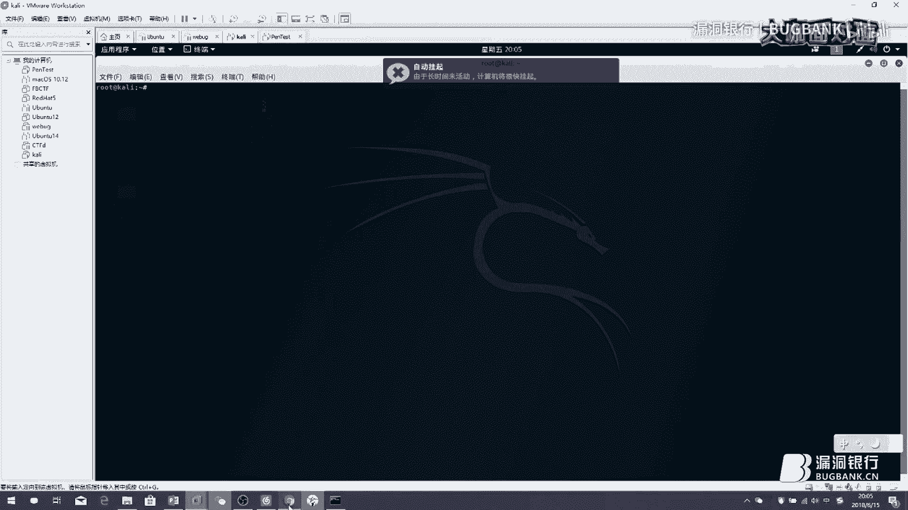

那们直接扣掉。

那这样他已经在监听状态了，然后我们再在本机执行把它给打过去。哦，对我们要先知他IIP是10吧，好像是这台。

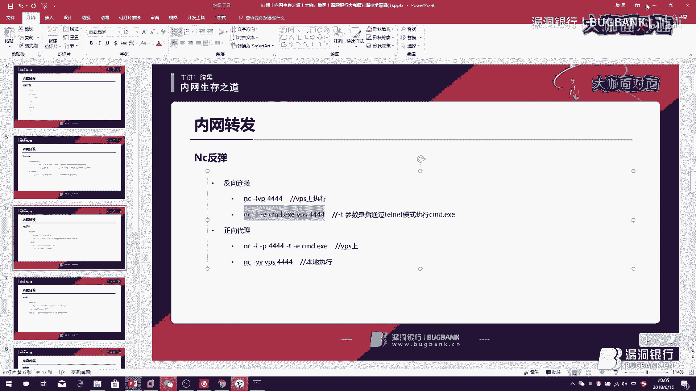

押下。IP打错了。那这样应该就会弹过去。IP错啦。不应该吧，难道他IP是一，我们看一下他IP啊。嗯，是10。好像已经弹过去了。1。11。哦，4444单好像被用了。

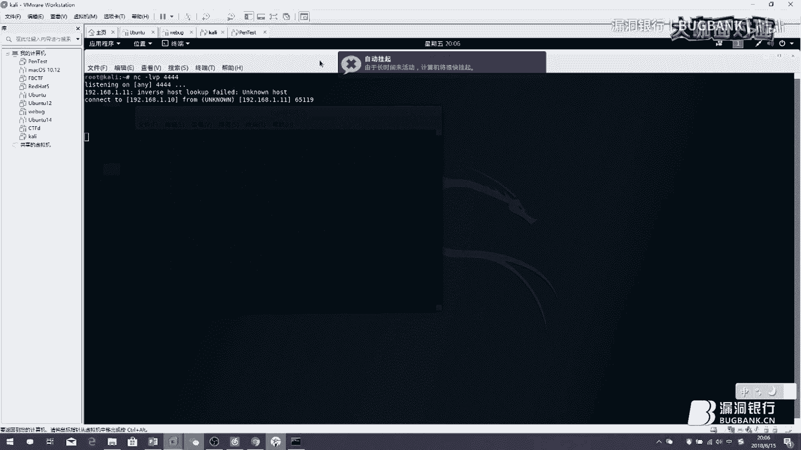

呃，没有，我们看一下。😔，出现了个什么情况呢？NC然后把弹到1。10去。然后这边IP的确是1。10。我们再澄听一下，这边再谈一次试试。哦，有了有了哎，那刚刚为什么翻车了？我们重新来了一遍又可以了。

我们看一下，然后这样就弹过来了。然后这样就可以了。所以这种是比较常见的，应该是属于咱们刚刚好像翻车了，但但时是一样的命令，他第一次就翻车了，这个也是比较尴尬。就有时候我们在内网时候，有时候如果没有谈罐。

你可以多持几两次试一下，也是比较方便的。然后还有个反向代理，反向代理的话，我们发现这是在UPS上执行的那如果你的UPS是个linux的一个机器的话，那么你就会发现它其实没有CM地点1个1个C这个文件。

那就是说其实你要去装一下这个要把这个要有这个，然后还有一个可运行那个 windows的那个一个容器。然后s克斯的话其实都工艺比较多，这些都是用s克代理的。像EW，还有这个他升级版，然后还有S5点PYI。

啊，这些也是用的比较方便的，咱们一起看一下。像这个的话是也是比较方便的。它有一个说明文档，或是把它列出来了。咱们可以看一起看一下这个东西。

他应该是在最下面是有一个说明文档的。

其实也是比较推荐使用这个，因为它功能是比较强的，可以做跳板。就我们看看它有什么功能，它功能是很强的。其实。

多平台支持，然后跳板及互联正向转让代理，然后内置需要，其实这些都很方便。

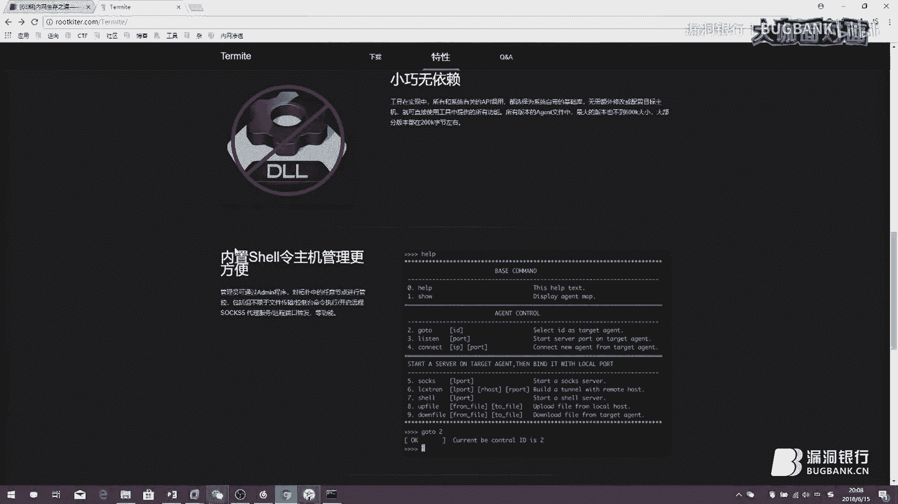

它用起来也很方便，它分为一个服务端跟一个客户端。然后这些的话执行起来，其实命令也都我们直接现用，现查现用就可以了。其实很简单的。这些东西，然后他也提供了一些视频的支持，就有视频。

然后直接看着视频去学就可以了。这里就不细讲。然后的话我们讲这个的话其实也很简单直接执行就好了。我们看一下。嗯，我记得我们这上面有。好像没有。我们把它copy过去。呃，放在放在端口转发里了吧，应该。哦。

这里没有，那最好像我我没有放进来。那咱们这个可能也演示不了，我没有放进去。啊，S5点PY的话，其实他就是个python脚本。然后的话你可以配合这个软件一起使用。

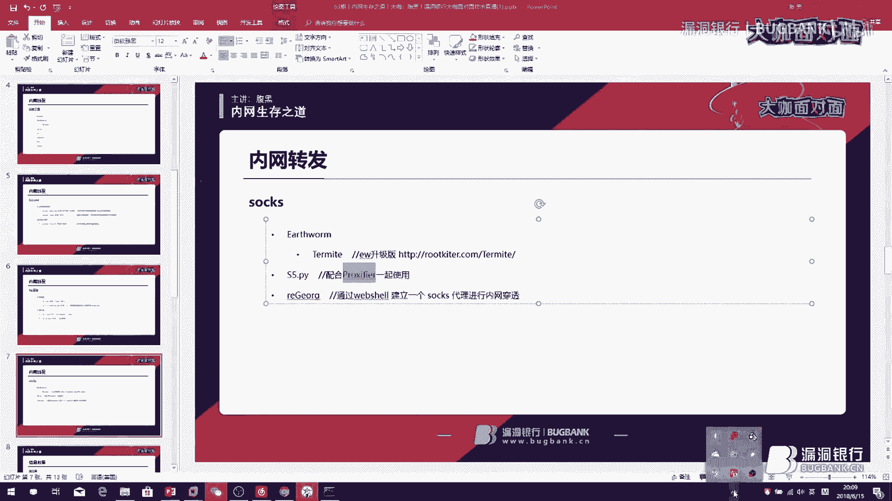

我们看一下。嗯，就这个。咱们可以在这里面就设置什么呢？设置它的。代理服务器，然后还可以设置一个代理的一个规则，就是放行谁不放行谁这样子的。好，现他已经在代理了，然后现提示错误。

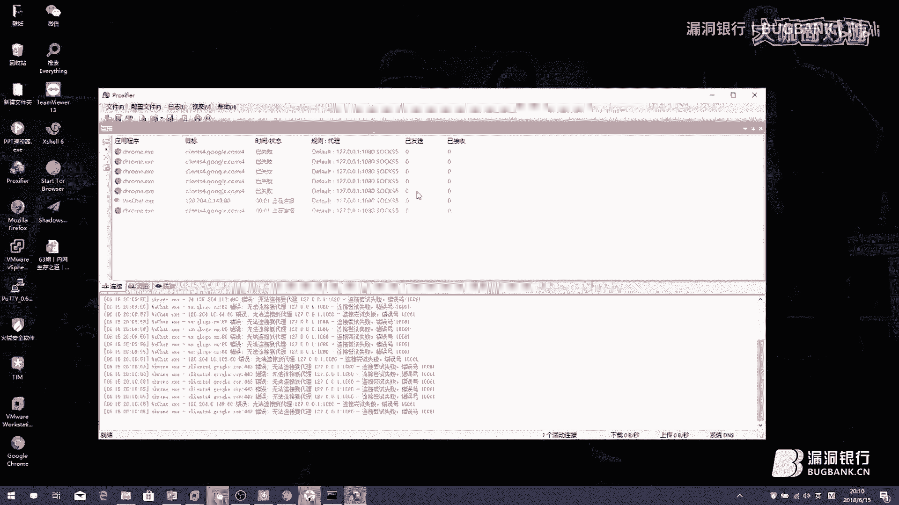

我们把它关掉，等我可能会影响到我们的网。其他功能的话也是比较简单的，就在里面可以设置一个什么呢？就咱们可以在里面设置你想让它放行的一些一些APP一些软件。然后以及不放行的一些软件。

然后使用这个的话就可以设置就是哪些协议去通过它哪些APP去通过它。就如果说你直接默认全部放行的话，会出一些问题。就当然我现在刚刚设全部放行。如果说你在正常渗的时候，你使用全部放行的话。

就很多没用的包那里过。那这样子的话可能说到时候这个on脚本承受不住，它就会直接崩溃掉。就经常会遇见这种问我们在做一个扫描的时候可能线程非常的大者说你同时扫描很多东西，那么就很有可能说这个脚本会崩掉。

你就要重启啊这样子就比较麻烦。就要重新启动这个脚本。然后像这个的话，它是通过一个去建立。其实它这个的话可能相对不是特别稳定它是个效果比这两个要差一些。但它用起也很方便。它支持的话，它都是支持的。

就是说它其实可用性是很广的。然后的话咱们内网转发转发过去了，然后接下来是什么呢？就是咱们通过内网转发已经可以直接进入这台服务器了。那么我们今天主要以windows为主，进入这台服务器之后。

那么要干什么呢？如果是windows服务器的话，那其实我们首先要做的就是一个域的一个渗透吧。域渗透的话，我们肯定就要查看一下当前域的一些东西。比如说你查看一些域的用户，然后当前域计算机列表啊。

各个有几个域，然后在哪个分组，然后域管啊预控啊，这些都要看一下。然后其实这是一个框架。在查看这些东西的时候呢，其实咱们有些东西是有些小技巧的，什么呢？就是你在查这个域的时候，它会有很多组吧。

域里面肯定是有组的。然后这些组的话，其实他一般都是有命名规则的话，比如比如说他某个组他什么技术部啊，运维部啊这样子的，其实咱们就可以针对性的去那些去针对某个组，咱不要说入侵啊，这个不太好。

就针对性的去收集某个组的一些信息去。比如说一个运维组。咱们知道其实一般运维他们权限是很大的。他们拥有很多服务器的账号啊、密码啊这种东西。那么如果说你去针对运维组做一些测试。

如果说拿下运维组摸起来机器的话，其实会有很大的收获，还比如说其他一些东西秘书啊，秘书，像这种一些管理组或者说一些能接触到某些东西，这些这些东西到就具体情况具体看，不一定说什么有运维组这种东西。

但咱们可以具体看就这些组他们权限比较大，他们能涉及到一些比较私密的东西。比如说账号密码啊，是吧，这种东西。那这对我们后期的一个渗透其实非常有用的。然后像玉的话，还可以尝试一些玉的提全啊这种东西。

玉山道齐里面东西很多。然后的话。咱们预渗透期为什么收集信息吧，也是然后收集信息的话，其实不只是一个预渗透。咱们还有其他很多东西，比如说你可以收集一个windows的密码。

mysq里面保那个数据库里面保存的密码，然后还有浏览器保存的密码，浏览器的历史记录，远程桌面的历史记录，然后查找一些文件，键盘记录，中间人等等等。咱们一个个讲。

为什么需要我们要去查看一个windows的密码呢？那我们知道在内网中，其实他是有很多机器的，一个管理员需要管理这么多机器。那么他不没有这么大多的心金思吧，那他肯定是有密码，要么是有规律的。

要么就是说他他密码设了其实很复杂，随机生成，那他也会保存在某个地方吧，他不可能记录这么多密码吧。那他肯定会保存起来。那我们去查看windows密码的时候，那么就是有几种可能，你可能会发现他的密码规律。

像我们去做渗透一个内网渗透的时候，我们发现最多这样子的一些密码是怎样子的。比如说password123啊，password艾123啊，或者说什么呢？

这家公司的一个简写艾12312345艾123456这样子的比较多，特别是一个什么呢？公司名字艾123这种真的见过太多太多了。很多他的默认密码都是这个。然后到了最后就是我们已经掌握他密码规则了。

直接拿这个一波就直接全进去了。还有就什么呢？就他们我们拿到windows密码之后，其实我们还要干什么，就查比如说他可能是个手机号，他可能是个管理员的手机号。

其实那就变相说其实我们还是我们差了一步就说我们应该去收集下管理员的信息。他有可能密码，他可能是管理员的姓名也有可能或者他生日什么的，就还是做个信息收集可能个社会工程学东西。

就咱们需要针对这个人去收集些信息。他的手机号他的生日啊他的喜好啊种等东西收集过来组成一个字典这样子的话其实效率是很高的，就更容易进去。

还就是mysrcle的密码这些密码肯定我们刚刚就讲了密码是有习惯的那买s密码这个密码保准另外码有可能就是说winds服务器的密码也是这个这样子。就都有可能的。

咱们就可以通过这些货的密码去试去一个个尝试包破。然后还有浏览器保存的密码，它登录的一些就是内网的一些OA系统啊，或者其他一些管理后台啊什么的。如果说他有设置一个保存密码的话，咱们是可以把这密码拿下来的。

那么就可以通过这个密码去做一些分析，就咱也是样可以掌握它的一些密码规律。其实咱们去获取这么多密码都是为了什么呢？就是获取它的一些规律，各种密码的规律以及常用的密码，还有各个常用的用户名。

然后拿最后我们再拿这用户名跟密码去登录去。其实这样子成功率很高。然后的话还有一些浏览器历史记录，很有可能一些它内网的一些后台啊一些东西我们会忽略掉。我们可能在做一个资产收集的时候，我们没有收集进来。

但是其实它会有它在它历史记录里面可能已经访问过，甚至说它已经保持了密码。我们直接进去之后登录了就可以。然后可能这是一个web点，其实我们登进去之后，可能你你想就是拿权限了呀。

那咱们肯定就通过web1一把锁去拿权限。然后还有查找文件，我们刚刚讲了windows密码很多，它有可能存在某个地方。那我们就需要查找一些特定的文件。

比如说他password这种点TST啊这种东西去找找到他一些密码本，或者说除了这还可以找什么呢？配置文件。比如说你网站的配置文件confi文件，这里面肯定是有他数据库账号密码的吧。

那我们前面拿拿数据库时候可能拿不到。但你通过查找一个配置文件，你就可以拿他数据库的账号密码，那这样是不就很有帮助的呢？查找文件其实很重要的。我记得以前我们做一个项目，就是什么呢？我们当时弄了很久。

其实没有弄进去。后来因为那个 two新报了一个漏洞，就我们通过这个进去了命令执行。后来发现桌面上有个有个东西啊，很神奇。他叫点X我们一打开之后，所有人都震惊了。因为它里面有什么呢？

他的服务器IP账号密码50多台内网的可能没有50多台，反正就我记得挺多的，整个内网都在就整个内网的都在那里面。因为他们是他其实就好像是那个管理员权限比较高，所有密码全在他那边，就他们整个内网所有机器。

不管是物理机虚拟机账号密码全在他那边就整个每次的这个已经结束了呀。对于我们来讲这个我们整个内网拿下来就差不多了呀。然后还有什么呢？一个键盘的一个记录，就我们去监听它的一个键盘。就当你在内网做一些事。

事情的时候，你去监听他键盘，那么他输了账号密码是不是全传到你这边来了呢？那这样子其实也是个比较有帮助。如果说他前面没有保存密码什么的，然后这样子，但是呢我们有想知道他密码或者知道其他些敏感信息。

那咱们都可以通过一个键盘的记录来实现。还有的话就是中间人攻击也是一样的。就前像前面他就输一些密码或者输其他什么东西的时候，咱们通过中间人攻具去截持它。其实像以前那个好像是。

远程桌面也是可以进行一个中间的人攻击的。我记得是。让咱们演示一下，这上面说一些东西。

比如说一个windows密码，其实最简单，咱们使用一个咪mi cards就可以了。

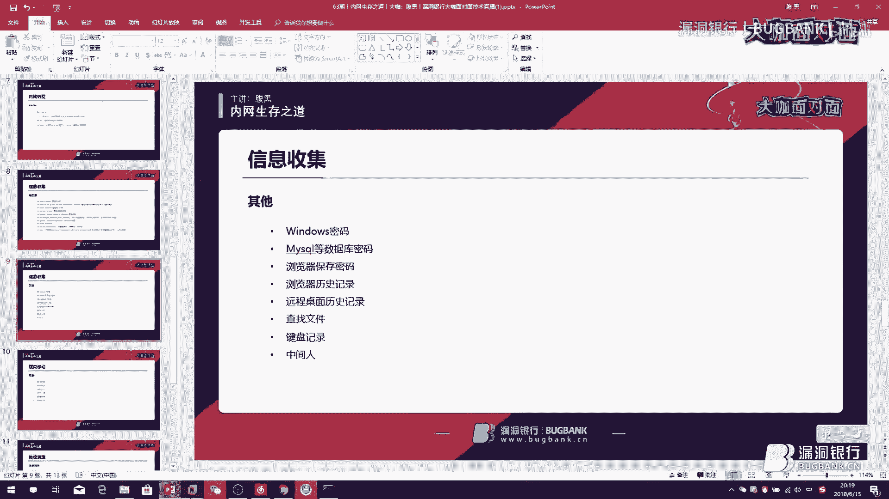

咱们用虚拟器来吧，等我本机密码给你们看着就很尴尬了诶。

咱们使用一个虚拟机。哦，我刚刚看你直播间有人提问。啊，咱们看一下。啊，因为卡s的话，他有个前提要求啊，它是需要一个管理员权限的，他需要以管理员身份运行，但是它功能很强大，其实不只不仅仅是读密码这么一项。

它功能是非常的庞大的。然后这边我要懒哎。我记得我有保持他的命令来着，没有吗？那咱们一起打一下吧。这就很尴尬了。咱们一起打一下他的命令，一起演示一下。首先我们就要开启一个模式。片。😔，应该是这个哦。

这里我记得好像是有两个点。这样就开起来。然后接下来咱们就读它密码。嗯。L， O T， O and。好，那这样子咱们就读到他密码，我们一起看一下。这样子就在当前在机子的一个密码就是100这样子。

那么这样就被读出来了。这样其实有的时候我们可能就是这样子就可以通过去读密码，可以收集到很多。其实这里只有一个账号。当你在真实的时候，其实可能一台机上有很多个那个很多个账号吧。

那这些账号密码你就可以全部通过这种方式读出来。但不一定然咱们其实不一定在正面上面在上面也是可以的。然后咱们一起也是下键盘记录也可以。

我们先看下这这是IP啊。IP11。11。他们启动MSF。啊，这是刚刚谈过结束掉。这才是1。10。可能有点慢，咱们等一下，我看下直播间刚刚的提问。

内网渗透如何穿透防火墙？防火墙话，咱们咱们刚刚讲到就是说什么，它可能会限制某些端口吧，咱们就通过一些端口的一些复用啊这样子。是比如比如说他1个80端口一般来说不会去防的吧，会放行的吧。

那么咱们就通过1个80端口，这样子就把它映射到80端口去。键盘记录怎么做且不会键盘记录，我们现在正准备会演示的。没声音了。

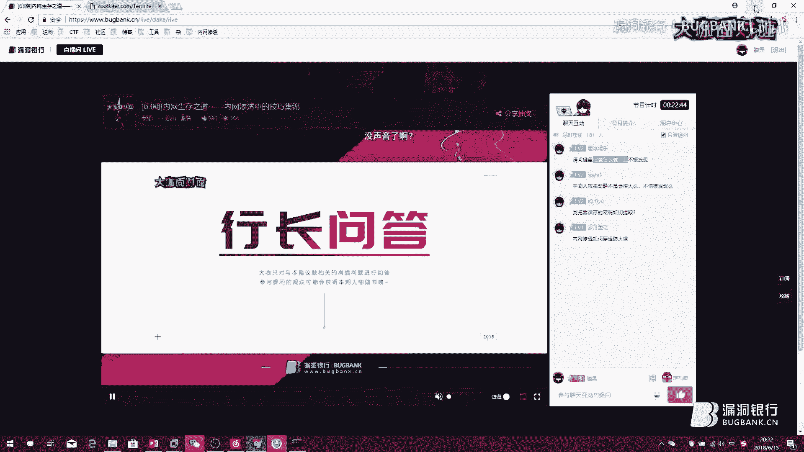

好，咱们MSF已经启动了。我们一起看。我们先选择一个模块，刚刚咱们在次其实是没有打过补丁的。咱们在内网渗透中，其实最常用的也就是那些像17010啊，08067啊，这些是很常用的。

咱们自己直接使用17010。哎，卡了。咱们设置一个配load的，然后。哎，168168。1。11。1几来着。1。11。然后咱们再测试这台机子，其实这个应该大家都会去，我就不说了，没什么好说的。

只是为了演示下其他的东西而已。怎么放大了。😔，首先我们它是MSF是内置了min咪卡一个模块的时候，咱们只要load一下就好了。然后这样这样子它就可以加载出个咪密卡一个模块。

我们要不要看一下它有些什么命令。在这里。然后各个命令他这里都写了，就咱们先像这样子就可以了，然后他就加载出来了。你后然它加密了怎么办？咱们。那就这样。使用另外一个命令，那他就解。

这边就有了他解密之后的一个密码就都在这里了。像这样就用起来比较方便，说你也不需要进他的3389去干点什么东西啊。实像在们在这里还可以进行一个截图的一个操作，把它图片截下来。那么咱们一起看一下。

他可以把图片截下来，然后看他桌面有些什么东西去推测，这样子也是比较方便的。然后的话就一个键盘记录，咱们也演示一下怎么进行一个键盘的一个记录。

咱们先挂载过去。嗯。哦，咱们找一个。😔，ち。好了，算了。然后启动一个它的键盘记录，然后这个时候它就会在监听状态。那么咱们这边的话，比如说我们视频打开一个文档输点东西。比如说我们随便说点什么。

然后这样子我们在这边。把这个直接把它down误出来了，就能看见你刚刚说的东西。那么如果这边他说的这个账号密码的话，那是不是就也被我们记录下来呢？这样子的话就可以获取他的一些账号密码一些信息。

当然咱们结束后可以把它stop掉。这就是一个键盘的一个记录，也是比较常用的。所你可以通过这个当通过MSF这样子，我们要先住一个进程，把它变成一个永驻的，永驻在后台，要不然的话比较尴尬。

然后也可以通过其他一些工具，一些就是你直接清它的一个服务器，然后去给它安装一些东西，安装后门啊，安装一个键盘记录啊，也是一样的，去把它装上去。都是可以的。但安装的话，有时候可能会被发现。

直接使用MSO可能安全一点。但看你怎么搞这个东西。然后的话这就刚我们说了一个密码啊，键盘记录中间人也是一样。中间的的话，其用嗯用卡里也是可以实现的。然后刚刚有人问到，我看有人问到一个保存的密码。

这个图话其实是有专门的工具可以导出来的，到时候我一起打包发上去吧。然后呢，咱们做完一个信息收集之后，其实什么就然后就进行一些移动了吧。其实移动的时候就很简单。

其实我们如果说一切尽能在我们信息收集的前提下的话，其实我们就。已经省去了很多功夫了。咱们直接通过信息收集到的东西，直接去波爆破，就密码爆破，就可以拿下一大半的服务器这些东西就可以拿下很多了。

已经因为它毕竟它是有规律的嘛，像我还有像他规律的话，我们刚讲比如说某说写S123或者说它主题的IP后两位后三位都有可能或者其他的一些某个东西，然后加上1个IP这样的这样比较好记嘛，它肯定是有规律的。

不可能是。说它是密码毫无规律，如果说是毫无规律可循随机生成的一个密码，那么这种密码那管理员也记不住，他一般也会保存起来。那咱们还是要通过查找文件的方法去把它找出来。你你不可能说一个人脑子这么厉害。

他能记住这么多乱七八糟的密码，这是不可能的，他肯定也会把它存起来的。当然说他存档我们就不知道，那他真的他手一个个写在本子上，那这个咱们也没办法，那这种就没辙了。😊，好，咱们在横向移动的时候，其他干嘛呢？

一个端口的扫描，其实就你要确定一些资产。比如说它哪些是web服务器啊，哪些是什么服务器，咱们要知道你扫一些常见的一些端口，像8080807001然后330614333389445139这种的。

为什么扫这些呢？我们是有目的的扫，我们不可能说所有端口都去扫它我们扫808080它其实可是web服务器吧。然后77001我们知道它有个反区列化漏洞，这个是可以利用的。内网中很多其实它是没有打补丁。很多。

为什么呢？这台机子他都不知道什么时候有可能是说什么，他已经换过好几次运维了。然后这个运维过来一看，他想想搞又不敢搞。因为这台机子可能已经很久了。那他会想，那我万一给他打个补丁，打坏了怎么办？

那这个这到时候过来我背了，那他干脆就不打，就这样一直是个遗传问题，这这就是个历史遗留问题，一直遗留下去，所有人都不敢动他。😊，他到导了最后就漏洞越来越多越来越多，这就内网中最常见的一个问题就是这样子。

大家都不敢动，万一一动了坏了怎么办？因为这个东西不是他们开发的，不是他们搞的，不是他们配的。那么他们如果说稍微改了一下，那改坏了呢，就都不敢改。还有就是什么呢？就有些可能内网中装了360啊。

装了一些其他沙卵啊这样子。那么其实也一般来说内网你可能说没有连到外网去，那么它根本病毒库无法及时的更新，其实也没有什么太大作用。说咱们去扫描端口，扫描一些常见的，像808080701。

然后445445的话，我们知道有很多SMB的一些漏洞。然，1433这样子的话，它是一个微软的一个那个MScicle，然后3306是mycircle，这在就是一些circle服务器了，数据库的一些服务器。

然后还有像3389，那就证明它就可以远程登录人，咱们就可以直接爆破试一下。然后就做到命令执行，它其实还会有很多一些漏洞。

就像spl two啊 logic啊这种各种java反序列化啊这种东西都会出现各种命令的一个执行。然后就这样子的话，其实对我们后期是比较有帮助的。他甚至说会在内网中出现一个什么出现一种什么情况呢？

在外网会比较好，它权限会做控制。在内网中的话，其实很多时候会出现种就是说。比如说他一个数据库，它就是SA权限，它myscle的，或者说myscle是入社权限这样他权限给了很高很高。

所以他自己搭起也方便嘛。然后权限给的很高，这导致了一系列的问题就会导致。然后像sco之路在内网也是很常见的，内网中很多系统他们会是自己开发的。然后或者说是一些老旧的一些系统。

CMS这种东西都会存在一些比较常见的一些漏洞，塞处也是比较好找的。然后文件上传也是一样，然后就通过一些简单的一些料过是比较好比较方便的。然后密码包括刚刚咱们讲，还有就是各类的CVE各种提全漏洞。

咱们都可以试一下。其实在这里的话其实如果说不怕搞是授权一个渗透测试的话，咱们可以使用s这种一类扫描器去扫描服务器专门去扫，可以扫出这种CVE啊什么都是可以扫出来的。但是如果说是一个非授权的。

你你在做一些某些坏事的时候，咱们这么讲，那么你去扫其实会造成很大的动静。那这种时候就其实就不推荐了。因为你去当你去开动一个扫描器的时候，它会发送很多的包出去。那么这时动静会很大很容易就会被发现。

然后端口扫描的话，其实大家肯定第个想会去使用N map。其实在实战中候，你会发现N map的效率其实不如一些使用C语言开发的一些工具。比如说那个遇见。它有一个专门的扫描端口的一款工具。

它的扫描效率就会比nm要快很多。在实战中这也是实战中发现的。然后咱们这些。当你横向移动移动完了，就是说你该做的事情也做了，你把整个内网给拿了差不多了。所以咱们要做的就是你要然后接下来就是留后门吧。

你各种后门你可以留一下，就想留的。当只能留看你啊，我这里咱们就不讲这个东西，也比较那个不太好。留完后门之后，咱们要做的就是一些痕迹的一些清理吧，就该把你来过的东西都清掉，来的神不知鬼不觉。

这里列出一些常见，其实不止这些其应该是有很多很多的。这里列了一些常见的也有专门的清理痕迹的一些工具。然后我其实也打包了。

到时候会也也已经发上去全部在ub上后那些有意思有意向的同学可以去现在去ge搜一下就可以就可以搜到了。然后先用一些系统的日志啊，像然应用程序的日志啊，FTP啊、3W啊这种等等的一些东西。

像如果说你是使用3W进来的那其实肯定会有3W日志的吧。然后你在内网中刚刚咱们讲过就还有一些爆破。那爆破的话，在系统日志里面或者这种东西肯定会有存在一个登录的一个日志的。其实咱们这种肯定都要把它删掉。

就不能不要留下这些东西，到时候给管理员发现。这个是肯定要做的一步。就各类日志的一个清理。像这个如果说因为经常要做嘛，可以就大家可以编写一个脚本，就批量去清，这样会比较方便，先给它清掉。这样子的话。

在以后做测试的时候，你就可以搞完一台清一下，丢个脚本到时候清一下就好就比较方便。然后其实他们可以整理一下整个思路。咱们内网升到成个思那这样子的呢。就首先我在外网，我通过某台机子，我可能进来了。

进入了你的内网。然后这个时候我肯定想了就是拿下这台服务器吧。那我那么就需要通过一系列的一些操作。比如那拿下之后，肯定他刚刚有同学讲到防火墙问题嘛，然我可能3389你就是连不上的。你没办法连。

那么咱们就需要一些通过一些端口的转发，这样子把它转发过来，比如说转发到1个R1端口22端口这样子。然后通过这个端口去连接它。然后连接上了一个它内网之后，咱们再可以通过一些。然后进行进一步的操作。

或者说你实不用连你通过一些代理跟我刚刚刚刚讲的，比如说S5啊，像EW啊这种东西都是可以的。然后通过这些代理职业代理及内网，然后进行这一层操作。然后其实一般来说不会只有一层内容，它可以有工作区啊。

业务区啊这种东西。咱们就通过一层层代理其实就啊。所以说其实那个。刚刚讲到有个东西，像这个就比较方便，因为它是可以支撑多层代理，用起来会比较舒服。像S5的话。

其实好我们一般就只能一层这样子像它的话就可以多层的跳板机这样来回跳签命令内置需要这种就用起来会比较方便。然后的话后就剩一些信息的一个收集。咱们跳进内网之后就做信息收集了。然后就收集各种其实就是密码。

说白了就是收集密码，就是最有用的。然后剩下就是一些乱七八糟的一些信息，这样就可以各种去翻下它的文件里面存在一些什么东西。比如说一些文档，文档里面其实还有可能出现什么东西默认密码，其实说白还是回到了密码。

就咱们要收集这用东西，就密码，然后还有一些工号工号啊这种东西，工号学号。这种东西是我们要收集的，然后手机号就跟管理员有关的一系列东西。其实我们都需要收集它。那收集完这些东西之后。

那就进进一步我们收集它干嘛，就登录嘛，为了那去爆破啊，去登录啊什么都行，然后咱们继续这样子。然后的话扫描也是一样，这个其实是同时进行的。然后进行一个扫描，然后看内网中到底有哪些机子，有哪些是。

有哪些东西，哪些资产有可能会忽略一些东西。所以咱们经应该扫描是比较方便比较好的。扫描完之后的话，当然咱们是就规定某几个端口扫描，不要全部去扫你扫所有端口，一个是来说是效率慢，一个是动静很大。

也很有可能就会被管理员发现，这样子咱们就针对某几个端口有针对性的去扫描。然后扫描完之后，那就针对性的去进行一些一些漏的一些这种E叉P啊这种东西去使用它般都比较好。然后内网中的话。

如果说遇到windows机器啊，它也会有一些东西，各种一些提前漏洞啊什么，咱们可以去看下之其实整理了很多，它有一个专门的一个那个库嘛。哦，不在这里啊，咱们这里也是准备了一些很多东西。都有放在里面。

但知道是 two啊，像还有其些东西它都放里面了。东西很多，然后咱们看一下windows的。啊，不是这个。他是。这个一个这么一个项目。

它这个项目里面的话是保存了windows的所有的一些提全的一些脚本东西一些东西，各种共17010啊，08067啊，这些他然后09050啊，且比较常用的，它这里面其实它都是有的。

然后就可以咱们可以直直接使用这个进行一些提全。然后像当我这个这里面不只是windows的，它还有。linux什么都有。当然这个东西的话，其实不是我一个人收集的，是我从各种地方收集过来。

有些是别的一些小伙伴收集的，然后把直接拿过来用了。然后这里还放了一个那个脑图，一个等于是一个什么脑图样的。

这里面讲到了一些秘密卡的一些使用，然后还有一些横向移动啊这种东西都有讲到哎全部放里面去了哦，对，还有个p shop。其实咱们在进行一个windows的一个渗透测试的时候，power泡笑是比较有用的。

但然因为这期这节课咱们定位了其实定位的是一个入门，所以咱们也没有讲泡效。如果如果说下次有机会的话，可以讲一下泡泡笑一些边一些使用。这个是在windows里面是用的比较大的，一般来说都会使用它。

因为它功能比较强大。咱们看这里其实讲的都是咆哮。然后还就是一些分分析一些数据，各种日志啊什么这种东西去清该清的清，该干啥的干啥弄掉。

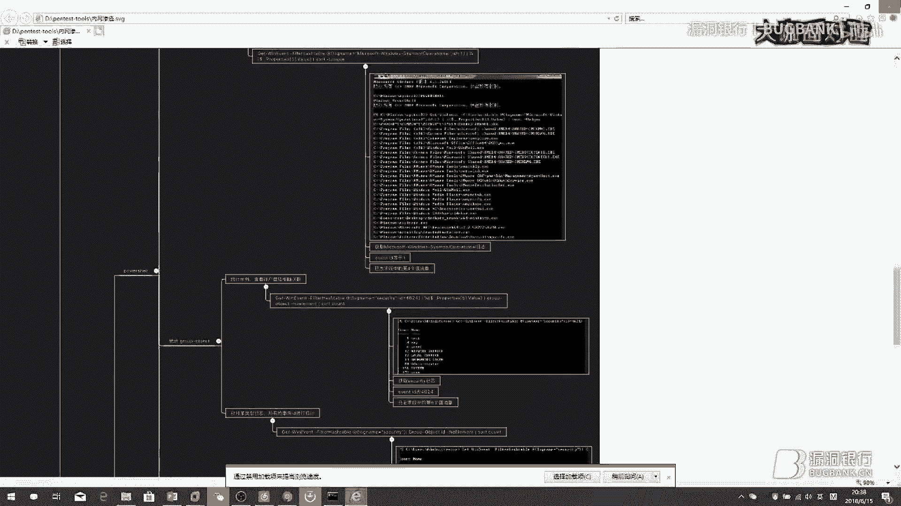

这里面得都有讲到。然后还有刚刚我们说了一个预渗透的，其实也放在里，那各种命令应该也咱们也放里面了。在这里面，这也是从边疆收集过来的。预渗透的各种命令也都在这里也都写进去啊，就命令挺多。其实。

这就是常用的一些命令预渗透的时候啊，咱们看这里还有一个获取windows VPN的密码，wifi密码这种东西也是比较常用的。其实归根结底还是获取一个密码。然后这是咱们刚刚讲那个运件也都在这里面了。

然后其实的话。

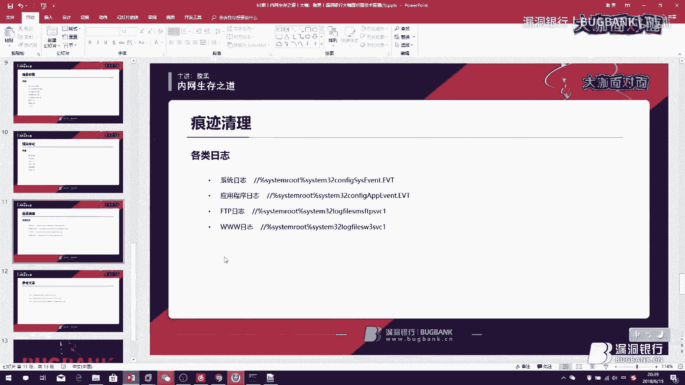

咱们把内网渗透归结于几个字是什么呢？就四个字信息收集，一切的基础都来源于信息收集。当你信息收集完之后，其实就事半功倍了。你就可以通过一个信息收集，其实可以拿下内网可能说一大半的将近一半的机子。

或者说更多这样子，然后剩下就通过各种一些漏洞啊去进行一些尝试。大家说也会有做的比较好的一些内网。咱们这里先不谈那些东西的话，在之后再讲，我们可以。然后这节课其实就大概就这些。

然后这是一些参参考的一些文章。像这个是我们战队的一个小伙伴写的，然后是关于一个端各种端口转发的，然后感兴趣可以看一下，然后这个是一些。日志清理的，然后还有一个内网的一些信息收集啊，都在里面。

我大概就这样的，在这 hubb链接，我这边发出来，有人在问。

大现在是嗯提问环节可以有问题提问。

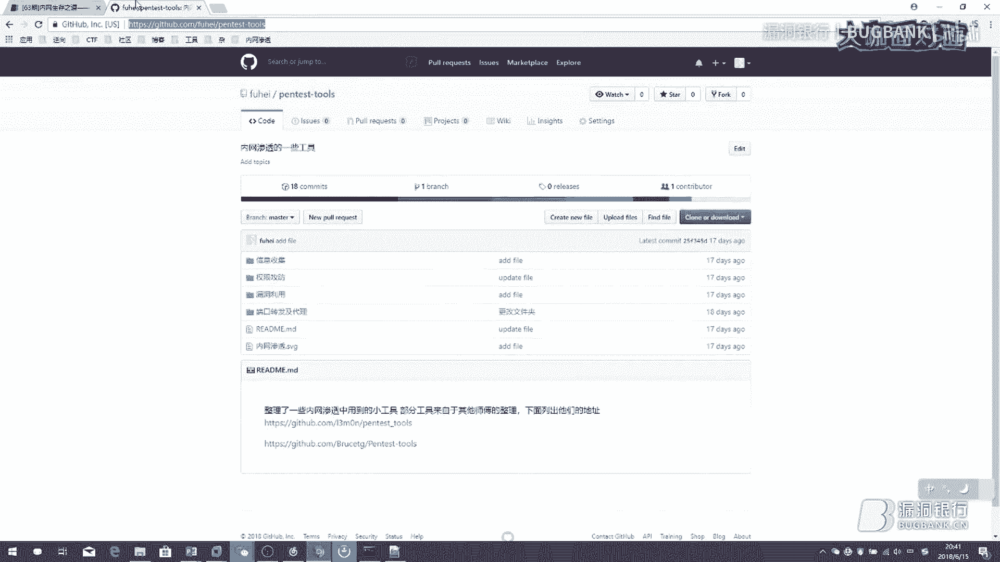

这个我也会一直更新的，就有东西的话，我都会有东西我都会跟上去。在这个上面。360的话，刚刚咱们其实讲到在内网中有很多时候，它是就是个扯淡的存在。因为内网中有很多情况下，它是不连接外网的。

那么它是根本没法得到更新。或者说就是说我们做一些免杀这样子的类似的把机环境，互联网上这个可以自己搭自己搭个内网环境来搞。但是这种比较坑，你也可以就自己找一些比较有意思的内网环境去弄。

然后也可以参加一些内网的渗透的一些比赛，像有个那个SW就是那个内网的一个比赛。企业版有控制端。内网杀软要怎么解决？免杀的话其实有很多方法，像MSL免杀杀也有方法也是比较多的。

我记得那个新选博客之前也是更新过，大家可以去关注一下互联网上现场把机为什拿到EPS发现没有内网又很。发现没有横向渗透的方法，EPS上没有内网，那你要横向渗哦，我没太理解这个东西啊。对对对。

这个讲的很简单，我没太理解刚刚说那个东西，就是说他说EPS拿到了EPS但是没有内网怎么横向移动。那么它没有内网，那你怎么移动？有有点懵啊，内网全是工作组。全是工作组的话。

其实一般是windows主机偏多的吧。windows主机的话就比较好嘞，就比较好弄了呀。哦，在那刚刚那个地址已经发，你可以查看下历史记录可以看到的哦，没有内网IP是吧？等于说它只有一个外网IP了。

键盘其实刚刚咱们演示过中间中间人攻击的话，其实你可以定向的去对某一台机子这样的，其实那个动静不会特别大哦，对，咪咪子它是需要一个管理员权限的，这个是比较尴尬的。这个东西是这样子的。

你一看早像这样都知持啊，有些版本好像有问题，会我记。之前遇到过03好像有问题，然后win也有一些小问题。我记得我这边win之前有些问题，内网渗透的使用17010核以成功。

但是实际环境参照网上各种总是不成功。那你这17010不成功的话，你在实际环境中是不是因为IP的问题。因为你在内网的形一个网段的。那么在实际环境中，这个你自己的那个IP你最好是在PS上搭建这个东西。

比如说你在PS上装一个那个MSF然后直接去搞这样子会比较好。装有360进行一个键盘记录。那么咱们实这样子的话，就不能直接使用那个就咱们刚刚说MSF里面自带那个东西了。因这样子可能会爆啊什么会会爆。

就需要做一些简单的一些杀。当杀不在讨论范围内啊，我这个讲的就比较东西比较多了，使用被360干掉，这个也是一样，也是一个免免杀的问题。

或者说你直接咱们如果说从1700进实是有一个权限直接把它干掉也是没关系。好像上有个守护进程吧，比较麻烦。我们在渗透经常这个问题就比较头疼的。所以一般来说是避开它就避开这个来机子。

然后等到我们拿到一些密码的时候，我们再重新回来登它，就翻一般都是能登进去的，特别就是说比这样子就一个网段的，比如说你是我们举个例子啊，他172。30这样子这个段里面比如说1。11跟1。121。13。

那么这三个IP是连着的。那么一般来说他这个是同一个管理员的那它密码很有可能就全部都是一样的，或者就规律是一模样的。这种就直接进去了。哦，对对对，网上那些工会基本上都是一删全部都删掉而致的话。

如果说你要想一条一条删，就是有就像把你的那些日志给删掉的话，这样其实是你需要自己写一些脚本的。比如说你可以删掉特定时间内，就你去进行入侵的那段时间内的一个日志，把它删掉就好了。对的，内网中的话。

一个是信息收集，一个就快速定位自己想要的人和机器。然后咱们刚刚讲了，就怎么定位这个机器呢？就通过一个咱们在预渗透的时候，其实是咱们在预渗透的时候，其实它是会有很多的一些组的吧。然后通过这些组。

就比如说运维组啊这样子的去找这种时候，它一般都会比较。就容易定位到我们想要东西。因为运维组里面肯定会有账号密码的嘛，这种东西就比较容易定位到了。当然要看你说你想拿什么东西啊。如果说你是个黑客，想拿文件。

那就不是运维组了，是吧？内网渗透中如何绕开蜜罐，那就要看是哪一种蜜罐了。因为这个对对对对对，实战中提高这只是一次梳理。其实。绕开密罐的话，这其实你要看它是什么密罐。蜜罐是分好几种的嘛。

然后有些蜜罐也会有一些小bug这样子，这种其实要看你具体的你在渗透的时候，其实你如果说一些简单的蜜罐其实你是可以发现的。但发现的方法不一定会一样。我记得之前我们在打一个比赛的时候。

就是我刚刚说那个SW那个内网渗透那个比赛时候，他那个蜜罐是这样子的呢，它就是。他是python写的，然后直接通过一些特定的字符，他就可以让那个python报错，你知道吧？然后就一下就直接绕过去了。

判断自己属于些蜜罐。但如果是一些高交货的蜜罐的话，其实你是不好判断的。就如果是高交货货的话，是比较头疼的。到时候因为你看到所有东西其实都是真的，就看到东西都有。windows内网服务器利用LSX。

然后反射出去外网VPS。的 map进行映设，然后我在本机连接进去3389后登录。看到背景了。😔，哎，那你这个不是已经登进去了吗？一直卡着。这种情况倒是没遇到过，你可以试一下。

就是说你换一个连接的3389的一个工具，其实这种工具有蛮多的，你不可以不使用系统自带点没有关系。这样你居然是能进去的，那么证明你那个就是说什么呢？你这个一个映射肯定是映射成功了。

已经就说不存在说是映射的问题。啊，这个脚本的话，其实我在这个项目里好像也是有的。大家可以去项目里面看一下。有一台命令执行，这台机子没有办法出内网。第二不是入手权限。第三，这台这不是可提全的机器。

就没有办法去进行一些提权吗。如果说你提全提不了，然后也没有相应的权限去写一个需ll的话。然后这种时候其实咱们能做的事情是什么呢？就更多的是通过这台机去收集些东西。那么你读的文。

其实你应该是有一些读的权限的吧。既然你是能够命令执行，肯定还是有些相应的读的权限。最起码来说，你可能在你的web目录下面只有读的权限的。那么咱们这时候其实可能更多偏向收集一些东西。像像我的话。

我可能会更多去收集下confi目录啊，这种东就confi文件。然后去收集它的一些数据库的一些配置。然后这样子，其实因为这个我们咱没有办法用现成一些E叉P去提全的话，其实这个已经已经条件卡死在这里了。

这个是没办法，就需要的话难度会比较高。然后咱们就只能是做通过去一些。收集。搜集出一些更多的东西。抓完密码之后是要端口转发，然后用MSFEP进行攻击。呃。端口转发是在这个前面的肯定。

咱们要你因为你能装密码证明，你就能跟他在一个网段一个断了吗？你能连上它了吗？比较有意义的实战经验分享。呃，实战经验的话，我在我博客其实之前在去年的时候吧，有更新过两篇关于内网渗透的。

当然我是我是说一直在更新状态，但是我已经很久没有更新它了。我如果说大家感兴趣的话，我可以最近尝试去更新一下。

然后发给你的客网址是什么？呃，loveLOVEI点ORG。那大家就关注一下腹黑的那个博客get？对对对，那个get我会把工具都分享在里面。然后博客的话呃我可能会考虑更新一下。嗯，好的。

那今天时间差不多了，然后腹黑解答非常多的问题。然后非常有耐心，相信大家都有学到很多。那我觉得后续如果还有什么问题想要提问的话呢，可以到群里面再接交流，然后也可以私下到时候找腹黑。

然后去继续探讨都没有问题。那感谢腹黑的解答，再次感谢嗯，下面我们进到今天最后一个环节，但是大家最现的环节就是我们的大咖赠书环节。嗯，今天呢腹黑大咖亲自挑选的一本书叫们渗透测试魔鬼训练营。嗯。

相信大家这本书会有很多帮助。那今天究竟谁会成为一个幸运儿呢？下面请腹黑大咖选择今天的幸运观众吧。大家黑发下言让我看见。😊。

大家现在可以冒泡，然后然后飞打开来挑一下。对，大家可以冒泡了。撸猫嘤嘤嘤这个嘤嘤嘤的过分了，嘤嘤怪打死，我发现这个是个修底线的环节，太过分了。😊，拉低中奖率。

那就这个好不好他OK那嗯恭喜今天嗯归林小伙伴获得了这本不黑大咖亲自挑选的嘛。他除了渗透测试魔鬼训练营。嗯，我们稍后会联系你来给我正确的寄件地址，然后会在下周安排把书寄给你。

那没有南到小伙伴现在也不要感觉啊我需要会难过，我们之后还有很多机会，大家再持续关注大咖的面，每周都会有送书大。嗯，那好，今天我们大咖们的演讲的内容已经都到此结束。

那也同时也感谢所有小伙伴今天来直播间一起来讨论参与观看直播。嗯最后打一波直播间的广告啊。大家如果想要来分享的话，也可以来找我报名。我们大咖的面这个直播间，欢迎所有有技术有势的白帽伙伴来展一展风采。😊。

那我们下周五8点再约到他们那边。那今天嗯辛苦付佩，我们今天直播到此结束。

I secret bit in visa。🎼The show of EGI was cool when I finally got so but about 10 years old but hey。

 it was something to do。 I'm living out in。🎼ATviss voice got just of through。

🎼I'm big boy because I made a million dollars in a on girls。 You don't want to be high like。

🎼you don't ever want to。🎼You。🎼You don't want to ride。🎼This never knowing who is like this。

 You don't want to be sing singing。🎼So。🎼愛そ。🎼The。🎼感So。🎼分手。Yeah。

