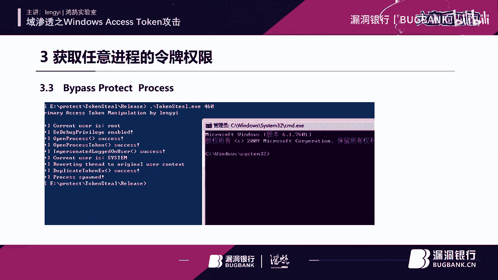

# P1：【录屏】域渗透之Windows Access Token攻击-大咖lengyi-漏洞银行大咖面对面第109期 - 漏洞银行BUGBANK - BV1jK41157W3

Yeah。

为知舌存因技术而生。各位小伙伴们，大家晚上好。欢迎参加第109期漏洞银行安全技术直播大咖面对面。我是今晚的主持人年念。今晚要给大家做技术分享的大咖，是来自洪湖实验室的冷意大咖。

他带来的议题是预渗透支windows access token攻击。主攻内网安全预渗透研究的他将从概念原理到实力内容深入讲解windows assess token攻击。那感兴趣的小伙伴们可要做好笔记。

认真听到最后哦。同时也欢迎各位小伙伴们登录直播间，在聊天区进行交流互动。听讲的过程中，如果有任何疑问的话，可以随时在聊天区提出待演讲完毕之后，大咖会在行长问答环节集中解答小伙伴们的疑问。

同时在问答结束之后，我们将会挑选出。一位幸运观众送出由冷意大咖亲自挑选的书籍，白帽子讲外部安全。那么下面就让我们有请冷意大咖开始今天的直播分享吧。嗯，大家好。首先非常荣幸来到我们的漏洞银行。

给大家做一期技术分享。嗯，因为我呢是第一次来到我们的漏洞银行。嗯，还是说先做一下自我介绍。本人呢是目前是一名大学在读的学生，啊，ID呢是冷逸。目前是洪湖实验室的一个成员呃，专注于内完群的学习。

下面呢是我的博客，还有这个get help的地址。如果说有想要交流的小伙伴们呢，可以互相交流一下。然后今天的话我给大家带来的议题是预渗透支。windows access token攻击。因为个人的话呢。

最近在研究这个内网安全。所以说呢感觉这一个windows在token呢在预渗透中作用还是蛮大的。所以说就进行了一个总结，希望说能对大家有所帮助。

今天的话呢主要是给大家分享4个点。嗯，第一个呢是介绍一下windows access token。第二个呢是。介绍一下我们后身投中经常使用的一种攻击方式，也就是令牌模拟。第三个呢就是。

看一下如何呢能够获取任意进程的一个exces talking权限。第四个就是如何呢使用这个excel talkingken进行一个by passs uAC。希望呢今天的内容呢能够让大家有所。

对大家有所帮助。好，我们呢来看一下今天的议题。首先呢就是什么是windows access talking。其实对于windows的东西呢，如果说有小伙伴想要学习windows相关的知识。

可以大家呢推荐去看一下微软的官方文档。这个下面呢也就是关于windows在 token的一个介绍。啊，是一连串的英文。这个呢也是我摘自微软官方的文档啊，是这么一些一些英文字符。

它的大体的意思呢就是说呃windows token，也就是中文名称的访问令牌。它呢是一个描述进程或者是现程安全上下文的一个对象啊，是这么一个东西。不同的用户登录到计算机之后。嗯。

都会产生一个对应的一个访问令牌。呃，如果说讲的通俗一点呢，你可以这样理解呃，当前的系统或者是进程或者是现程能访问到什么样的系统资源，完全取决于你当前进程拿着的是谁的令牌。比如说有些需要管理员令牌的资源。

你拿着普通用户的令牌，肯定是访问不到了啊。你暂时呢不要把它狭隘的理解为我们经常所述知的那个密码。因为密码呢是在所有的认证方式里面最简到粗暴的一种，但它呢并不是唯一。嗯。再关于我们的这个令牌呢。

一般的话呢都会在系统重启的时候被清除，否则呢就会一直主留在内存里面。而令牌呢也是分为两种，即一种是这个主令牌，也称为是授权令牌。一种呢是模拟令派。我们的授权令牌呢会在用户注销以后自动的转化为模拟令牌。

仍然可用啊，至于它一些更详细的知识呢，咱们就不过多说了。大家呢就简单的了解一下关于这个访问令牌的基础知识就可以了。刚才也说了，一般的访问令牌呢，它是分为两种，一种是我们的授权令牌，也就是我们的主令牌。

这种令牌的产生方式呢一般是通过本地登录或者是远程的RDP登录产生的。然后另一种呢是模拟令牌。这种令牌呢通常是。用于这一个非交互式登录。比如说这个net useWMI或者是VRM。这么一些操作时啊。

使用这个模拟令用派。不同的登录方式呢，它的这个在windows中的类型也是不一样的。比如说啊我们常用的一些交互式登录。嗯，你这个RDP登录，它的在windows中对应的这个类型是一个10。

如果说是PSEXEC，它的对应方式呢是1个2。而网络登录中，你的WMI和VRM它在windows中对应的类型是一个3。这里呢也算是给大家做一些简单的这个什么简单的一个小的一个扩展。嗯。

那么我们的访问令牌是由什么组成的呢？它是由下面这些东西进行组成，分别是啊用户账户的安全标识符，也就是SID。呃，用户所说组的SID。用于标识当前登录绘画的登录的SID。用户或用户组所拥有的权限列表。

所有者的SID主用户组的SID。访问令牌的来源啊，访问令牌是主要令牌还是模拟令牌啊，以及一些其他的信息，用它们呢组成了我们的访问令牌。那么这里呢再给大家去稍微的去扩展一下。

就是说可能有些人呢不知道什么是SID。嗯，SID呢。他的中文名字呢是这一个。叫做安全标识符啊。他是在我们每一次去创建一个用户或者是一个组的时候，系统呢会分配给用户或者是一个组一个。呃。

一个唯一的SID当你重新安装系统后呢，也会得到一个唯一的SID。啊，它呢不会随着你用户的删除而分配到其他的用户使用啊，它呢是由计算机名或者是那个当前时间以及一些信息呢来保证了它的唯一性。

像下面这里呢就是一个。SID信息啊，这么长的一串，我们在windows下面呢可以使用这个hoMI杠user命令，得到一个当前用户的SID这里呢是关于SID的一个介绍。呃。

那么我们知道了windows access token的一个组成，还有内容。那么我们来看一下，就是它的一个产生过程。首先呢我们用户呢一般都是使用一个凭据去登录我们的windows操作系统。

也就是我们常用的用户名，还有密码。然后去登录的时候呢，就会创建一个season。然后在s创建完之后，windows会返回给我们用户。

我们用户的SID和用户啊用户所在组的1个SID那么会由我们windows本地的1个LSA去创建一个访问令派。那么这个时候windows会告诉你啊，你的这一个凭据返回登录成功，然后登录你的season。

然后呢。就会获得到你的这个taken啊或者什么。然后你就可以用你的taken去创建进程或者是县程。那么你的线程和进程呢也会去啊得到你这个taken的一些权限。是这里呢是我们访问令牌的产生过程。

为了方便大家理解，我在这里呢稍微给大家画了一个图。嗯。大体上就是这样。我们的用户去登录到我们的操作器系统，然后我们本地进行一个账户和密码的一个检查。然后呢，再判断啊是否是管理员组。

然后分配给对应的一个tken。啊，这里是一个我们访问令拍的一个产生过程。啊，那么我们刚才也说了，令盘呢拥有对应的权限。那么我们只要能够模拟令盘呢，就能够获得到对应的权限。而我们在后渗透中呢。

也经常会利用这种攻击方式呢来得到一些相应的权限。我们来看一下。首先呢就是我们的CS啊一款后渗透神器，也是用的比较多，里面呢是集成了一个。嗯，令盘模拟功能我们来看一下，这里给大家操作一下。

它的用法呢是使用这个steill talkingken，后面跟你想要去模拟的进程名来模拟这个进程的一个令牌。因为我们刚才所说就是知道嗯进程呢会默认去继承一个tken权限。

那么我们就可以利用这个一个方法去模拟一个进程的一个令牌，然后来得到对应的一个权限。然后呢，给大家演示一下它的一个。操作过程。

呃，我在本地的话呢开一台虚拟机，然后给大家演示一下CS的这个。CS的这一个令牌窃取。

嗯，想必大家呢都已经用上了我们的这个CS4。0了。那么我呢也是使用这1个CS4。0来给大家做一个操作演示。

想必CS的用法，大家肯定按一般的话都是会使用的，就是生成一个攻击载合嘛。

嗯，然后因为这里的话呢，我只是单纯的给大家演示一下，就不再去考虑免杀的问题了，就直接去反弹回一个啊反还回一个事儿回来。

然后我们的CS呢就得到一个绘画，得到一个绘画。那么我们来看一下使用CS如何去做一个什么做一个令牌窃取。哦，我们呢可以使用使用这个插件啊，来查看我们当前的一个权限。

因为刚才说了是使用嗯这个进程去获取一个tken。

那么我们呢就需要先去获得它的一个进程列表。其实CS呢也是很智能的啊，它这里呢在进程列表这里已经提供了一个still talking的一个功能啊，你可以等会儿可以自己去试一下。

啊，这里呢就。一种。已经刷新出来了刷新出来了。那么说的话呢，我们一般的话呢是需要去什么？是需要去窃取一个settem权限的一个tlkken的。啊，就是在后面这里有一个用户，因为我们。

去获得一个令牌的目的呢，就是去得到一个权限。我们当前已经有了一定的权限了，肯定是要往更高的权限上去走。那么我们就可以去选择一个这种高权限的一个进程，然后选择这个still talking啊，然后尝试去。

获得啊，不过这里呢它是失败了失败了，因为你不一定能够去窃取一个任意进程的一个令牌。这里呢我等会儿再给大家说。嗯，这里呢就是我们这个CS去窃取令牌的一个方法。嗯，希望大家呢能够。掌握。

那么说完了CS之后呢，嗯作为。

作为我们的这一个。后渗透的啊后渗透的两大神器之一，我们的MSF也是肯定有对应的功能。我们呢再来用MSF来看一下怎么来窃取一个令牌。

呃，MSF呢是内置了一个模块啊，内置了一个模块。这个模块呢本身呢它是一个独立的一个程序，因为它呢比较好用，所以说呢嗯MSF将它呢给集成了进来，方便呢我们去使用。我们呢来看一下。

首先呢我们来生成一个载合，使用MF。关于MSF的它的这一个自动补齐的话呢，你们可以去。可以去参考这个。之前亮哥他去写了一篇教程，可以实现它的自动补齐。然后我们开启MF开启一个监听。

嗯，此时我们的MSF也是得到了一个绘画，得到一个绘画。那么说如果说想要使用MS4做一个。啊，方便大家去看，我把这个代码调大一些。啊，方便大家去这个观看。嗯，如果说你想用MSF去做一个令牌窃取。

我们需要先跟这一个season做一个交互。然后使用我们的这一个。啊，使用我们的这一个。令盘窃取了一个模块。然后呢，我们可以使用这一个list talkingken杠U。

可以列出来我们当前可以去模拟的一个模块。啊，这里已经把所有可以去罗列的这一个。嗯，taken已经罗列出来了，那可以看一下当前的一个呃当前一个权限，当前是一个普通用户的权限。那么我们是用这个。

这个模块的一个tken切取功能，我们呢来模拟一下。嗯，这里显示成功，然后我再来看一下。哦，我们现在呢已经变成了一个C term权限。C term权限。这里呢就是我们使用MSF的一个token窃取。

掏个窃指。那么说完了我们的这一个。啊，说说完了我们的这个MSF呢啊后面呢还有就是说这里呢还有一个抛花式脚本。啊，抛发社胶本呢它也是可以去进行一个令牌模拟。我们呢同样也来看一下。

我这里呢已经提前放到放到我的这个靶机里面去。嗯，然后呢我们导入这一个。导入这个模块。啊，导入这一个泡坏式脚本。然后呢，我们就可以使用它的一个里面的自带的一个功能，然后将所有的这一个令牌呢进行一个枚举。

然后并且输出到一个文件里面去。这里的话先。直接直接什么吧，直接这一个打印出来吧。嗯，这里的话呢就可以把我们所有的这一个令盘呢给我们进行一个枚举。嗯，并且呢。

并且呢把它的一个tken类型呢进行了一个输出啊输出。然后的话呢，它呢也是提供了一个令牌模拟的功能，令牌模拟的功能。然后我们也可以用它进行一个令牌模拟，我们可以来看一下。

他的话呢是提供了两种。第一种就是说嗯使用用户去进行一个。使用用户的这个令牌进行一个创建进程。啊，是下面这课语句。第二个呢就是说可以使用。就是利用一个进程的方式去启动一个进程。这里的话呢就。

就不再给大家进行一个演示了，就不再给大家一个进行一个演示了。因为的话呢跟都差不多都差不多。

咱们呢再往下看再往下看。呃，那么我们知道了，就是说它的一个可以进行模拟之后呢，我们就来看一下就是如何呢自己来进行一个。啊，自己进行一个。手动的一个令拍模拟，嗯。

想必大家也肯定都有这么一个去写工具的一个梦想。嗯，这里给大家罗列的这些函数呢，其实就是一个windows的API啊，是我们去写一些C加加程序的时候常用的一些东西，它呢就可以用来去做我们刚才的上述的操作。

嗯，这里给大家介绍一下每1个API的这个含义。嗯，第一个呢就是一个打开进程的一个函数。因为你想要去。模拟一个。进程你肯定呢需要去。打开一个进程。所以说这个函数呢就是提供了一个进程的打开。

关于它的一些详细的这一个参数呢，咱们就不再过多的去说了啊，因为这个。只能这么说吧，你懂的自然会懂。嗯，不懂的呢，听我现在去说的话也也学不明白，因为它就是一些。一些常见的这种数据类型。

然后第二个呢就是一个。open process talking它呢是打开这一个进程的令牌的一个函数。因为你想要去窃取一个进程的一个令牌，肯定要去打开它，然后再去打开它的一个令牌。

然后这就是它的一两个函数。然后再往下的话呢，是一个啊模拟登录用户访问令拍的一个函数，它呢就用来去模拟当前进程的一个访问令拍。然后模拟完之后呢。我们再使用下面这个函数去。

创建一个就是根据刚才已经有的这一个令盘呢去创建一个令牌。那么有有了这么一个创建令牌之后，我们就可以再用下面这个函数呢去使用已经有了这个令盘呢，再去开启一个进程。用这个c process。啊，是这样。

其实这些API的函数名呢都是一些啊这个英文的一些简称。啊，你英文单词呢也都是一些常见的计算机英语，相必大家呢都能看得懂啊，这就是我们用来去。模拟进行了一个流程。然后呢，我们来看一下，这里呢就有一个。啊。

就有一个domo，就是我在iread那一个网站上拿过来的。它呢就是说你可以看到在这里去打开了一个进程，然后。然后打开进程的令拍，然后去模拟一个令拍，然后呢再去利用令拍去打开一个进程。

这样呢它就可以去获得到这个3060进程的一个令牌，然后去启动C下盘C盘下面的这个设猎CMD这个程序。啊，这是一个domo是一个domo。然后呃我们也可以来看一下。嗯，我这里呢也是。啊。

也是写了一个这种C加加的一个程序。

然后我们可以尝试的去模拟一个进程的一个令拍。啊，我们可以看到这样呢它就通过这个令盘呢打开了1个CMD窗口。我们可以来看一下，它呢就获取了你模拟进程的那一个令牌的权限，变成一个stem权限啊，是这个样子。

那么说呢这就是一个很简单一个domo。那么并不是说所有的进程都是。

啊，都是可以被操作的。比如说我们的这个这个进程就不能被操作，我们可以来看一下。

哦，我们可以看到这里呢就窃取失败了，返回了一些错误嘛。啊没有像刚才那样成功的去窃取到这个进程的令牌。

那么说他为什么窃取不到呢？这就是我们需要去关心的一个点。啊，关心的一个点。呃，那么我们可以使用下面的一个方法呢去罗列出所有拥有这个st进行的一个。呃，进程了一个令牌啊，然后通过一些测试呢。

发现像这个下面这几个进程一样，他们的token呢都是没有办法进行获取的，也就是都是获取失败的。呃，那么为什么他们会获取失败呢？我们就来看一下啊，我这里呢使用了一款工具去查看了这几个。进行了属性。

发现呢他们都。有一个叫做。protect啊保护的一个机制。然后我们可以来看一下。

呃，这个机制的话呢，其实他是一直都有的，只不过呢在。

WI7上呢，它没有办法去看。然后我这里呢来到win10，给大家来看一下这个它的一个保护。

然后呢，我就使用这一个一个监控进程的一款工具，然后我们就可以用它呢来查看进程的属性啊，我们可以来看一下。然后我们找到我们刚才所说的那几个没有办法去模拟的进程，然后选中这个进程，我们可以右键查看它的属性。

然后你会发现它这里有一个protect，这里啊有一个保护属性，这里进行了一个设置。然后同样的啊，刚才的那几个都是一样，都是有这么一个有这么一个属性。然后它呢也是导致我们没有办法去进行模拟的一个原因。

没有办法去进行模拟的一一原因。

然后呢，我们。通过去查看啊查看这个。它的这个原因呢，然后在微软的官方文档上找到了这么一句话。呃，就是说这个进程呢是受到一个呃算是保护吧。如果说你想要去打开呢。

你就要去替换掉你open process里面的那一个函数里面的一个属性，然替换成这个属性就OK了。然后呢，我们。啊，我们就把它去替换掉啊，替换掉就行了。然后更改我刚才的那个代码，在里面呢去加一个判断啊。

如果说你。如果说你直接打开成功就打开成功。如果打开不成功呢，就使用这种方法进行一个。进行一个打开。啊，是这样，然后这里呢就相当于是绕过了我们的那一个。微软的一个进程保护。啊，我们再来看一下。

呃，比如说我刚才所说的那个受到保护的那一个进程。然后它的进程是1个296，然后我使用这一个更改更改后的这个。程序进行一个模拟。然后。成功模拟啊，没有任何问题。没有任何问题，这里就是一个。啊。

用来绕过什么的方法，绕过这一个进程的一个方法。

然后能够使得我们呢成功的去模拟一个。模拟一个进程的一个令拍权限。那么如果说你把你什么，你把你启动的这个程序由CMD换成一个刚才MSF的一个程序，那么你就会得到一个对应的权限的一个绘话。啊，是这个样子。

那么这样的话呢，肯定不是我们所想要的，我们肯定想要的是更加的方便和快捷。

我们这样的话呢，你每次可能还得去重新编译，然后去。嗯，是什么去替换里面的程序。那么我们就需要去。编写一款程序，它能自动的去便利便利所有的进程，查看哪个进程呢，具有这个sstem权限，然后去打开权限。

然后去接收我们的参数，然后去执行一个命令，以当前权限。那么这里呢我就写了一个叫做gat system的一个程序，也不能算是我写的吧。只是说前几天看到有人去写了这么一款工具，它呢是默认去。

它呢默认是去打开1个3D窗口，然后我在里面呢去加了一个匿名管道，用它呢去接收参数，并且回显一个结果是这个样子啊，我们来看一下。嗯，这里个也可以稍微给大家说一下，匿名管道还是。

它是很好用的啊，尤其是在windows中，它用来接收参数啊什么的，很好用。

哦，我们可以看一下当前的权限。当家权限，然后我们呢使用这个。使用这个get system啊，去执行一个命令。啊，我们可以看到这里已经。变成了这一个我们的这个stt。是是这个样子是这个样子。

然后这里呢就实现了我们的一个算是命令执行吧。嗯，比较方便大家去使用。

然后呢，我们再来到我们今天的最后一个环节，就是一个利用access talkingken呢进行一个白paUAC操作。嗯，这里的话呢就不再给大家去细讲了。嗯，这里的话。

有一个现成的一个脚本可以给大家说一下。嗯，这里呢也是一个国外的一个安全研究团队呢。去写好一个脚本。然后呢，你就可以把它拿过来啊，把它拿过来。然后别人呢是把刚才上面那个技术做成1个ESC文件。

然后它就可以实现1个UACip pass一个操作。然后也有是类似的文章，就是说这个tken是如何去进行ipadUAC的。嗯，应该是叫做token滥用啊，然后有兴趣的可以自己去查看一下。

咱们今天的话呢就不再。不再多说了不再多说了。然后再往下就是我的一些参考资料参考资料。嗯，我今天的话呢就先给大家分享那么多，嗯，希望对大家有所帮助。如果说有什么问题的话呢，可以提出来，大家一起交流一下。

那好，那我们就感谢冷艺大咖刚刚精彩的分享。那大家听完本期的直播内容，相信大家都学到了不少有关于windows access token攻击的技术了吧。那么话不多说，那接下来就是我们的行长问答环节。

我看小伙伴刚刚在认真听讲的过程中也提出了一些问题。那如果现在仍有疑问的话，也可以在聊天区继续提出来。刚刚有一位小伙伴一直想要提问，然后现在也欢迎你。踊跃的提出你的问题。

那么我们的冷逸大咖将会来给大家解答疑问。问题解答完毕之后呢，会有我们的听讲福利环节。大咖会根据聊天区的交流情况，选出一位幸运观众送出他挑选的书籍白帽子，讲外部安全。所以大家要多多抓紧机会提问啦。

那我们也请冷逸大咖打开直播间看一下观众的聊天页面，如果弹幕比较多的话，也可以勾选直播间右上角的只看提问来查看一下问题。那么冷逸大咖开始解答问题吧。嗯，好的好的。嗯。第一个这种这个M7叉SS这位老哥。

他提问的这个原理嗯，我比较负责任的说一句，我不知道。啊，因为我没有对CS，他还有MSF里面他的两个。token窃取进行一个进行一个研究。所以说我不是很清楚它的原理。啊。然后第二个的话。

这个主要应用于哪些攻击场景？哦，我个人的话呢建议你去看一下atTakeker矩阵。然后ot takeer矩阵里面的话，肯定比我说的更加详细一些啊，也就是。呃，在我PPT里面这个PPT里面的这个。

参考的第一个，它里面就是说的这一个token窃取的一个技术啊。然后第三个的话嗯。嗯，对，第三个的话，他是需要有一个管理员权限的，不然的话他是没有办法去窃取的。然后。后面的话这一个。这个委派安全等级啊。

这个我没有更深入的去去了解。如果说有需要的话，我也是很愿意后期去再去研究一下。然后talken窃取的话呢，呃我目前去尝试的话是暂时没有，因为我没有从03就开始去去试，然后在这个。

在win7还有Wwin10上去测试的话是没有问题的。呃，这个这个SSP的话，我暂时不不是很清楚啊，暂时不是很清楚。后面的这个脚本的话，呃，你可以去我的get help地址啊。

get help上已经已经上传上去了。如果有需要的话，可以去下载一下。嗯，好，那那个勾选问题的那儿已经呃解答完的话，可以把那个勾选去掉，然后看看小伙伴们提出的一些新的疑问。那大家刚刚问的脚本的话。

可以到搜索一下大咖的那个getHub。稍后我们会把资料都发在群里。嗯。然后农一及时解答了。嗯，好好好嗯嗯嗯。可以往上翻翻哦，我这个嗯好，他说对我们可以私下讨论一下关于这个。呃。

关于这个token这个token复用的事啊，我我们可以这个。这个什么可以私下讨论一下。啊，对你获得了管理员权限的话，其实。就算你去模拟了一个权限，你对于一些文件夹的话，也是没有办法去操作的。

这个的话呢我们可以去看一下三好学生师傅的博客。它里面呢有一篇文章，是对于这个权限呢有一个很好的去讲解读。然后它里面呢。也说了，就是如何去。再去操作，得到一个更高的权限，能够。能够去进行一个操作文件的啊。

希望这位叫小明的啊，小明的朋友呃，能对你有所有所帮助。好，现在是那个大咖解答。小伙伴们的疑问的环节。那大家在刚刚听大咖讲的过程中，有问题的话，现在可以提出来。嗯。

这个老哥说想搞明白这个tking和哈希的区别还有作用。呃，这个的话呢我觉得就像我刚才所说的那样，你。啊，你可以去那个什么，你可以去微软的官方云档去查一下。哦，也有也不是一两句能够说的清楚的。呃。

令牌模拟做个一般实际的运用，都是user权限啊，这个这个也没有办法。哦，我我不缺男朋友我不缺男朋友。小伙伴们还有没有什么问题？小伙伴们可以抓紧提问。嗯嗯，默师傅呃，我我你中间那两个星星的话。

我的确不是很清楚啊，我我课下跟你私聊吧，因为我应该是有你好友的，然后我私聊你，好吧。我应该是你应该是有一些敏感词，好像是发不上来。然后我课下我们两个私聊。嗯。然后如果大家。呃，大咖方便。

有自己的联系方式嘛？如果大咖大家想要大咖的联系方式的话，可以那个找一下我们运营。嗯，冷逸师傅冷逸大咖方便了。哦。就留你的QQ也可以。啊，如果说他们真的想找我去了解的话，我上面我的那个博客还是什么的。

都是有联系方式的。你们可以互相交流一下。好。

好，那我。切一个页面。就是上面有大咖的那个博客和他的一些。对，联系方式。如果大家有疑问想别的问题私下交流的话，也可以在这上面找到大咖。好像没有好像没有问题了，好像大家没有什么疑问了。

那我们今天的提问情况就先到这边了。那感谢我们冷逸大咖的耐心解答。那时间有限的话，大家如果后续还有问题的话，可以关注一下大咖的博客，或者是之后到我们的。

技术社群里继续交流。那么接下来就是我们的。福利赠书环节。我们冷逸大咖亲自给大家挑选了一本书，书名叫白帽子，讲外部安全，要送出给大家。那冷逸大咖可以稍微讲一下为什么想送这本书吗？嗯。

因为的话我个人的话是一开始在学的时候就读到这本书，嗯，后来发现读不懂。嗯，不过后来根据自己学习的逐渐深入，发现这本书是一本常读常信的书，不像不像市面上有些书写的比较浅薄。而这本书是一个值得人去深读的书。

所以说也就把这本书分享给大家，希望大家能够在这本书里面学到自己想要学的知识。嗯，嗯，好，那呃也非常感谢大咖分享这本书啊，嗯这份幸运的礼物呢，究竟要落到哪位观众的头上。

那我们有请冷艺大咖来选出今晚的幸运观众吧。大咖你可以在你想要赠书观众的ID边上。点击选为幸运，然后给我报一下他的ID名称，我们的运营小姐姐也记录一下。嗯，然后现在就是大家想要输的环节就会比较热情啊。嗯。

我选择这一位M7叉SS这位师傅吧。OK叫M7叉SS。嗯，好，对，已经选好了是吗？对对对，好好，fancy或者秋秋也帮我记录一下。嗯。

那我们恭喜这位直播间ID为M7叉SS的小伙伴将获得这一粉白帽子讲外部安全，需要你根据直播间的获奖提示，在相应的区域留下正确的收货信息，或者在直播之后私聊我，或者我们的运营小姐姐兑奖。

我们会尽快的把书给你寄出，希望你耐心等待。那么今天晚上到这儿。直播分享就要结束了。那再次感谢冷艺大咖的用心准备和精彩的演讲，希望本期的知持对大家都能学有所得有所启发。如果想回顾本期直播的话。

请大家关注我们下周四周四的时间发布录屏，也敬请关注官网的更新或者群里的录屏更新通知，今后也希望大家可以多多关注冷逸大咖，还有他的团队洪湖实验室。

那么最后感谢所有观众伙伴们的守候，还有对咖面的支持和喜爱。如果你也想像大咖一样来进行直播分享，欢迎来找我报名。大咖面对面是一个展示白毛风采和传播技术的舞台，不拘年龄、不畏资历，只要你有才华敢分享。

我们都欢迎。如果大家想进群交流的话，可以在页面的底部找到我们的群号。那么今晚。直播到这里就要结束了。嗯，非常感谢各位小伙伴们的积极参与大咖面对面，周五8点见，我们下次再约吧。那下面是听歌的时间。

小伙伴们也早点休息。那冷逸大咖也可以跟大家说声晚安。😊，嗯，啊，各位师傅晚啊，再见。好，大家也再见。那么我们最后再再次感谢一下冷艺大咖。嗯，那大家拜拜。😊，🎼随以。🎼谴着思。全。🎼在さ。🎼一じに。

🎼就在。🎼就。🎼心。🎼Yeah。

