# 课程 P1：域渗透之Windows Access Token攻击 🎯


在本节课中，我们将要学习Windows Access Token（访问令牌）的概念、原理及其在域渗透攻击中的应用。我们将从基础概念入手，逐步深入到令牌模拟、权限提升以及绕过UAC等实战技术。

## 概述：什么是Windows Access Token？ 🔑

Windows Access Token（访问令牌）是描述进程或线程安全上下文的对象。它决定了进程或线程能够访问哪些系统资源。不同的用户登录计算机后，都会生成一个对应的访问令牌。

访问令牌由以下部分组成：
*   用户账户的安全标识符（SID）
*   用户所属组的SID
*   标识当前登录会话的登录SID
*   用户或用户组所拥有的权限列表
*   所有者的SID
*   主用户组的SID
*   访问令牌的来源
*   令牌类型（主令牌或模拟令牌）

安全标识符（SID）是系统在创建用户或组时分配的唯一标识符。在Windows下，可以使用命令 `whoami /user` 查看当前用户的SID。

访问令牌的产生过程如下：用户使用凭据（用户名和密码）登录Windows系统，系统验证后创建会话（Session），并由本地安全机构（LSA）创建访问令牌。随后，用户进程或线程将继承此令牌的权限。


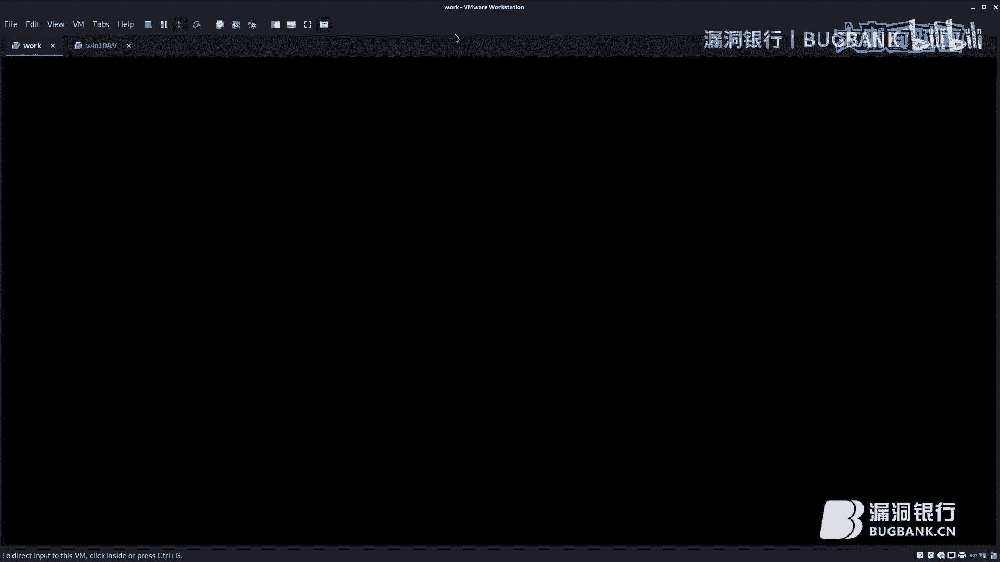


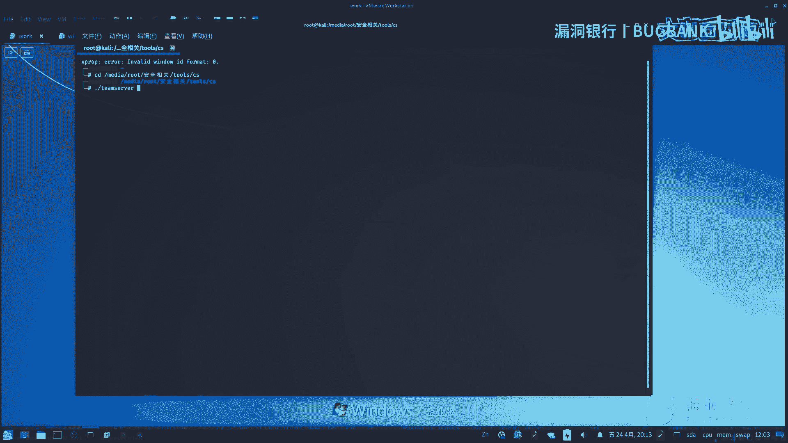


## 令牌模拟攻击实战 🛠️


上一节我们介绍了访问令牌的基础概念，本节中我们来看看如何在渗透测试中利用令牌模拟进行攻击。只要能够模拟高权限进程的令牌，就能获得对应的系统权限。

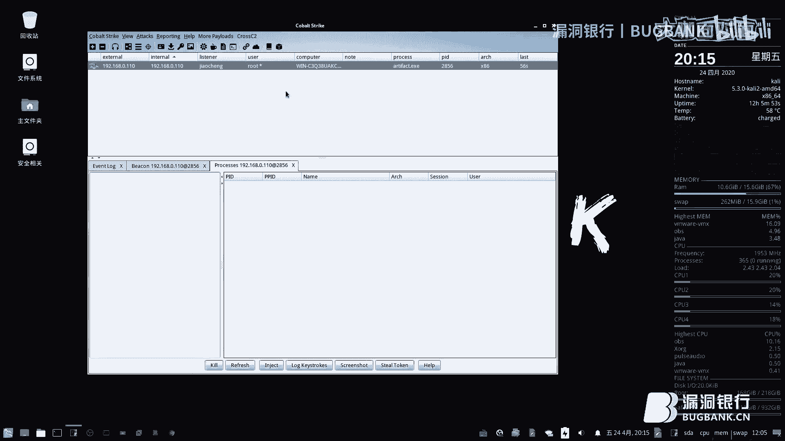

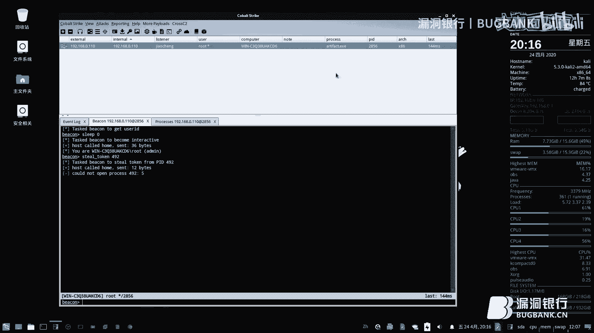

以下是几种常见的令牌模拟工具和方法。

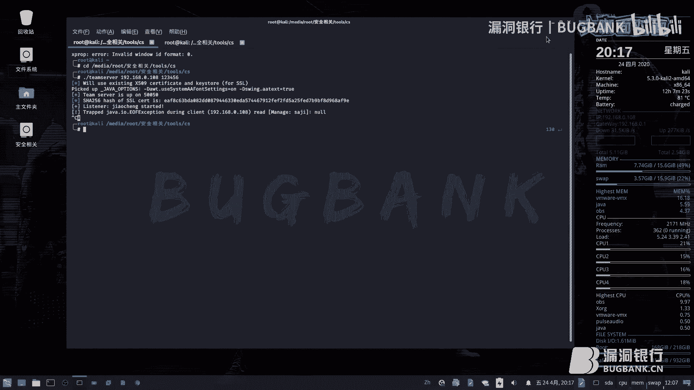


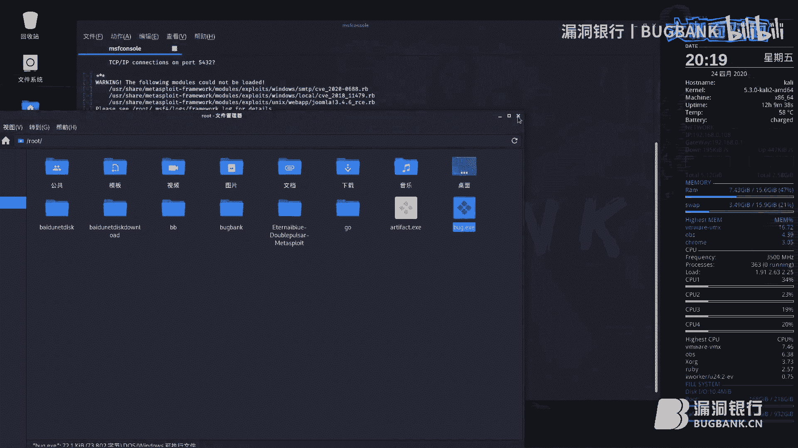

### 使用Cobalt Strike进行令牌窃取

Cobalt Strike（CS）是一款后渗透测试神器，集成了令牌模拟功能。其基本用法是使用 `steal_token` 命令，后接目标进程名来模拟该进程的令牌。


操作流程简述：
1.  获取一个反弹Shell会话。
2.  查看进程列表，寻找具有高权限（如SYSTEM）的进程。
3.  选择目标高权限进程，执行 `steal_token [PID]` 命令尝试窃取其令牌。
4.  成功后，当前会话将获得目标进程的权限。


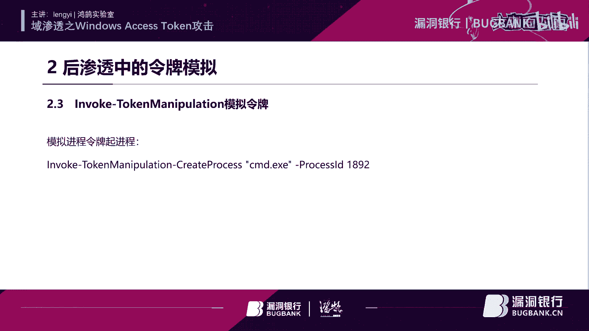


### 使用Metasploit Framework进行令牌窃取

Metasploit Framework（MSF）同样内置了令牌窃取模块。操作步骤如下：
1.  获取一个Meterpreter会话。
2.  与会话交互后，使用 `incognito` 模块。
3.  使用 `list_tokens -u` 命令列出可模拟的令牌。
4.  使用 `impersonate_token [令牌名]` 命令模拟目标令牌，从而提升权限。


### 使用PowerShell脚本进行令牌窃取


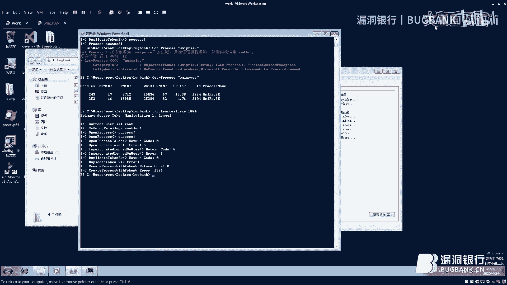

PowerShell脚本也提供了令牌枚举和模拟的功能。以下是基本操作：
1.  导入相关PowerShell模块。
2.  使用脚本枚举系统所有令牌及其类型。
3.  脚本通常提供两种模拟方式：一是使用用户令牌创建新进程，二是利用现有进程令牌启动新进程。

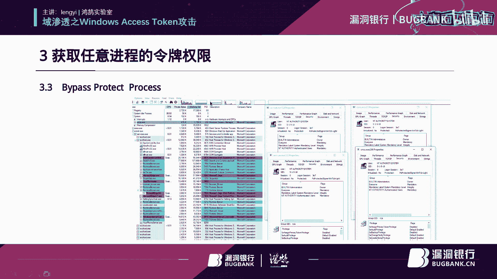

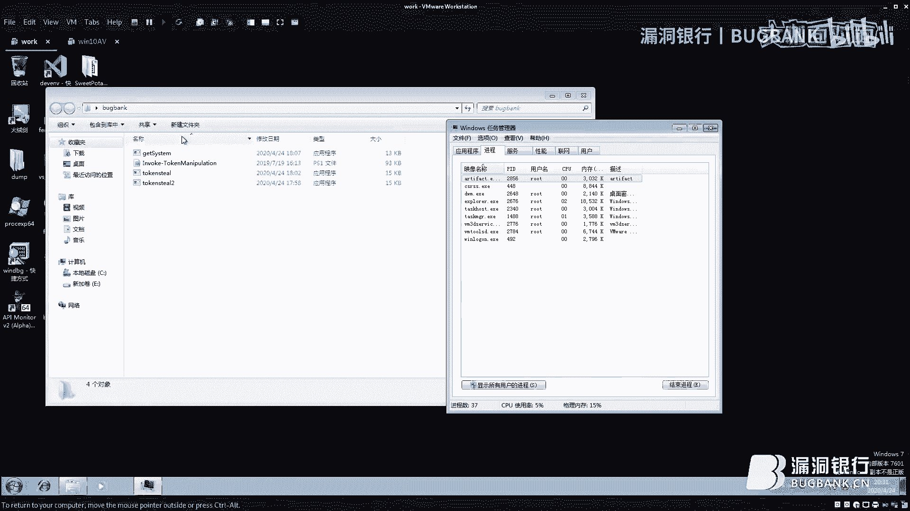


## 手动实现令牌模拟：原理与绕过 🧑‍💻


了解了工具的使用后，我们来看看如何手动编程实现令牌模拟，并绕过系统保护机制。

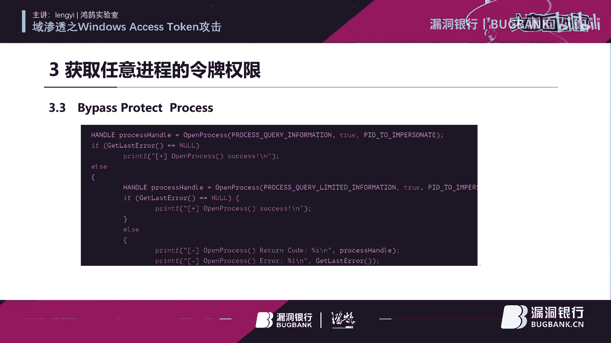

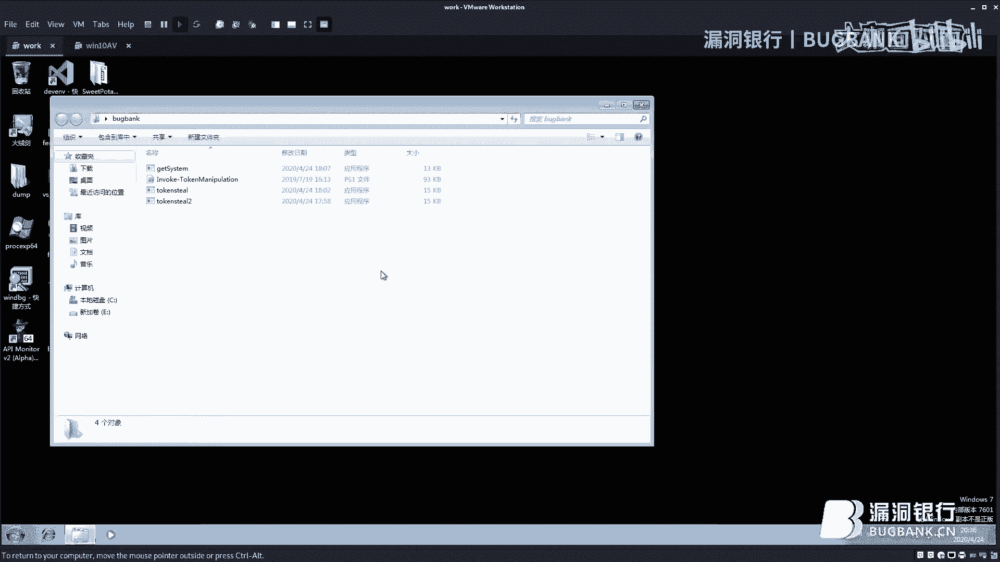


令牌模拟的核心是调用一系列Windows API函数，流程如下：
1.  **打开目标进程**：使用 `OpenProcess` 函数。
2.  **打开目标进程的令牌**：使用 `OpenProcessToken` 函数。
3.  **复制令牌**：使用 `DuplicateTokenEx` 函数复制令牌以进行模拟。
4.  **创建新进程**：使用 `CreateProcessWithTokenW` 函数，利用复制的令牌创建具有新权限的进程。


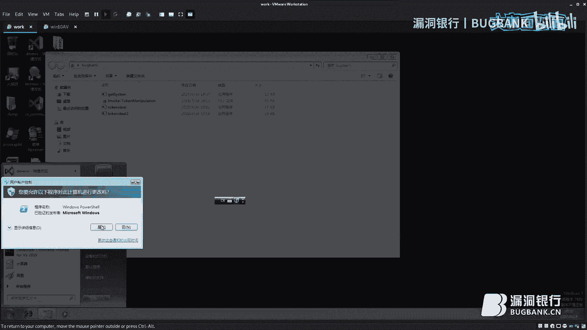

关键API函数调用示例（C++）：
```cpp
OpenProcess(PROCESS_QUERY_INFORMATION, FALSE, targetPID);
OpenProcessToken(hProcess, TOKEN_DUPLICATE | TOKEN_QUERY, &hToken);
DuplicateTokenEx(hToken, MAXIMUM_ALLOWED, NULL, SecurityImpersonation, TokenPrimary, &hDupToken);
CreateProcessWithTokenW(hDupToken, LOGON_WITH_PROFILE, L"C:\\Windows\\System32\\cmd.exe", NULL, 0, NULL, NULL, &si, &pi);
```


并非所有进程的令牌都可以被轻易窃取。某些受保护进程（如 `lsass.exe`）启用了“受保护进程”（Protected Process）机制，会阻止 `OpenProcess` 的常规调用。

**绕过方法**：在调用 `OpenProcess` 时，需要使用特定的访问权限标志 `PROCESS_QUERY_LIMITED_INFORMATION` 来替代 `PROCESS_QUERY_INFORMATION`，从而绕过保护机制。

基于此原理，可以编写自动化工具，例如 `Get-System` 工具。该工具会自动遍历进程，寻找具有SYSTEM权限的进程，窃取其令牌，并允许用户执行指定命令，实现权限提升。

## 利用Access Token绕过UAC ⚡


最后，我们简要了解如何利用Access Token技术绕过用户账户控制（UAC）。其核心思想是滥用令牌，以较高完整性级别启动进程，而无需触发UAC提示。


已有安全研究人员编写了现成的利用脚本（如`.ps1`或`.exe`文件），通过滥用令牌来静默提升权限，实现UAC绕过。对此技术细节感兴趣的学员可以查阅“Token滥用”相关的技术文章进行深入研究。

## 总结 📚


本节课我们一起学习了Windows Access Token攻击技术。我们从访问令牌的基本概念和组成讲起，了解了其在权限控制中的作用。随后，我们探讨了如何使用Cobalt Strike、Metasploit和PowerShell等工具进行令牌模拟攻击。接着，我们深入原理，学习了如何通过编程手动实现令牌窃取，并绕过系统的受保护进程机制。最后，我们简介了利用令牌绕过UAC的思路。掌握这些知识，有助于在内网渗透测试中更有效地进行横向移动和权限提升。