# 课程 P1：基于业务攻击场景的安全测试 🎯

在本节课中，我们将学习如何针对常见的业务逻辑漏洞进行安全测试。课程内容源自漏洞银行大咖小白分享的实战经验，涵盖了水平越权、本地验证绕过、任意密码重置等核心场景。我们将通过具体案例，理解这些漏洞的原理、发现方法及利用过程。

---

## 概述 📋

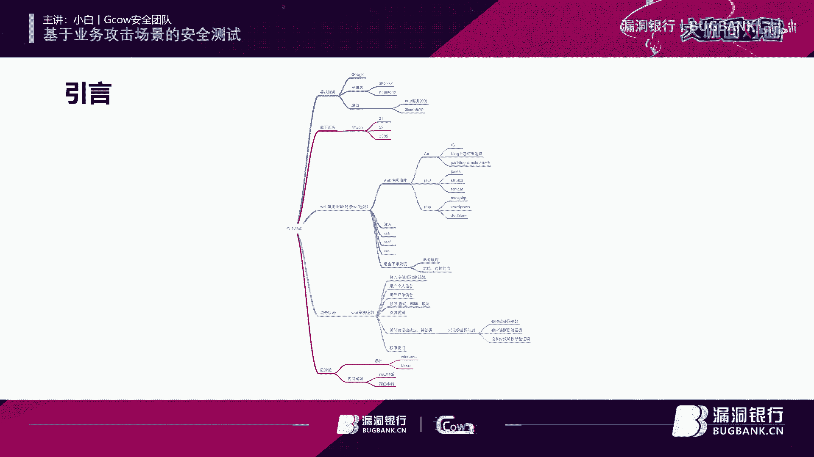

业务逻辑漏洞是传统扫描器（如WAF）难以检测的安全问题，常出现在登录、注册、支付、订单管理等核心功能中。本节课将系统性地介绍七类典型的业务逻辑漏洞，并通过真实案例演示其测试流程。

---

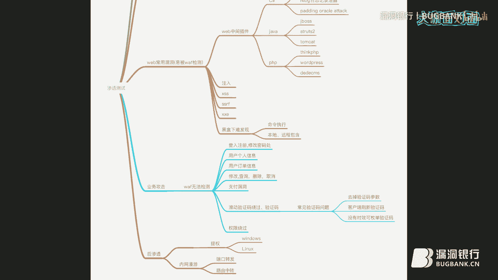

## 一、 漏洞挖掘分类 🗂️

在开始具体案例前，我们先对漏洞挖掘进行一个整体分类，这有助于我们明确测试重点。

我将漏洞挖掘分为两大块：
1.  **Web常见漏洞**：如SQL注入、XSS、上传漏洞、XXE等，这类漏洞通常可由自动化工具辅助发现。
2.  **业务逻辑漏洞**：这类漏洞黑盒测试容易发现，但WAF难以检测。它们常出现在：
    *   用户认证模块（登录、注册、修改密码）
    *   支付功能与客户端参数篡改
    *   订单管理（涉及用户权限的增、删、改、查操作）
    *   本地验证绕过、中间件日志泄露、验证码缺陷等

接下来，我们将聚焦于第二类——业务逻辑漏洞，逐一进行讲解。

---

## 二、 水平越权 📈

水平越权是指攻击者能够访问或操作与其权限平级的其他用户的资源。这是业务安全测试中最常见的问题之一。

### 案例一：微信公众号API订单越权

在漏洞挖掘时，我们不应只关注主站和子域名，许多第三方应用服务（如微信公众号、支付宝生活号）也承载着业务功能，可能成为漏洞来源。

**测试过程**：
1.  在微信“搜一搜”中搜索目标厂商关键词，进入其公众号。
2.  在公众号内找到订单查询等功能点，并抓取数据包（例如使用Burp Suite）。
3.  分析数据包，发现订单ID（如`orderId`）以明文数字形式传递，且未与当前用户的身份标识（如`openId`）进行绑定校验。
4.  尝试修改`orderId`的值为其他数字，重放请求。若能成功查询到其他用户的订单信息，则存在水平越权漏洞。

**核心点**：参数 `orderId` 未与用户会话绑定。
**测试技巧**：在测试越权时，可以尝试不带Cookie发送请求。如果依然能枚举出数据，则越权可能性极高。

### 案例二：用户个人信息越权修改

许多网站提供修改个人资料（如收货地址）的功能。如果权限控制不当，可能导致用户A修改用户B的信息。

**测试过程**：
1.  注册两个测试账号A和B。
2.  登录A账号，在“修改收货地址”处抓包，获取A账号的地址ID（例如 `id=1484`）。
3.  登录B账号，同样操作获取B账号的地址ID（例如 `id=1485`）。
4.  在A账号的请求数据包中，将`id`参数的值替换为B账号的ID（`1485`）。
5.  提交请求。如果返回成功（例如HTTP状态码200，或返回`{“code”:0}`），则说明用A账号成功修改了B账号的地址，存在水平越权。

**危害**：由于ID常为连续数字，攻击者可遍历ID，批量篡改全站用户的收货地址，危害极大。
**根源**：服务端未对“增删改查”操作进行严格的所属权校验。

---

## 三、 本地验证绕过 🔓

本地验证绕过是指客户端提交的数据，其验证逻辑仅在客户端（如JavaScript）完成，服务端未做二次校验，导致攻击者可通过修改返回包状态绕过验证。

### 案例：短信验证码绕过进行实名认证

**正常流程**：用户输入手机号 -> 获取短信验证码 -> 输入验证码 -> 提交认证。

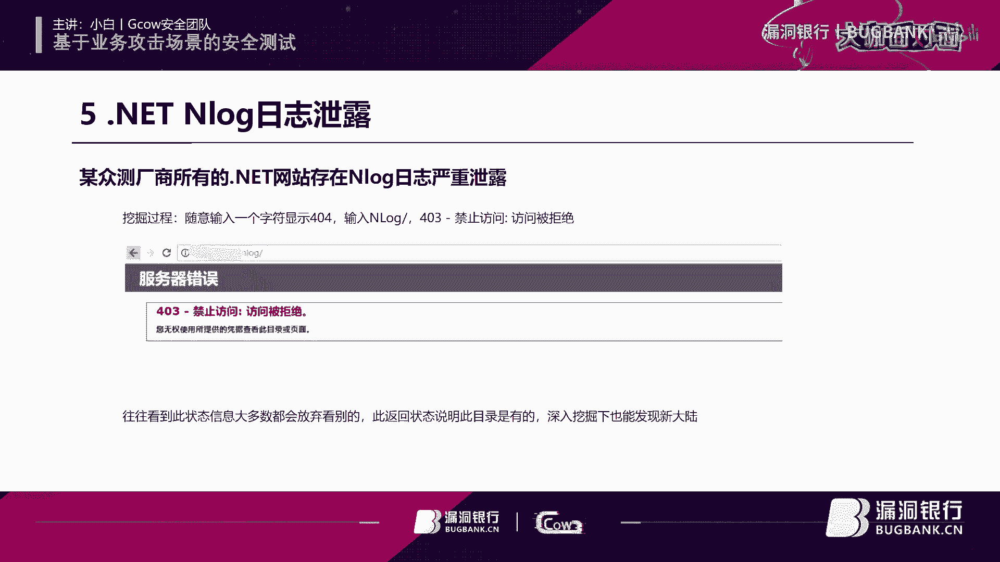

**绕过过程**：
1.  按正常流程操作，但在输入错误的验证码后提交，并抓取返回包。
2.  分析返回包，找到标识验证结果的状态字段（例如 `"status": false`）。
3.  将状态值修改为成功标识（例如 `"status": true`），然后转发数据包。
4.  服务端仅依据客户端上报的状态进行判断，从而绕过短信验证，进入下一步实名认证流程。

**核心点**：服务端完全信任客户端提交的验证结果，缺乏服务端独立校验。

---

## 四、 任意密码重置 🔑

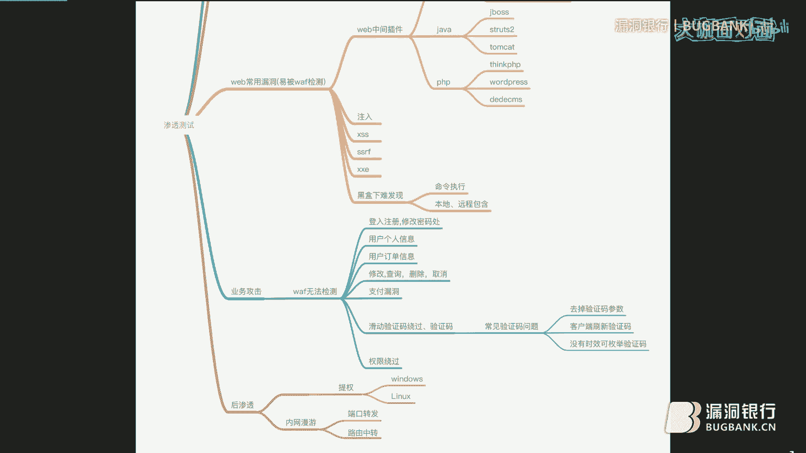

任意密码重置漏洞允许攻击者在不知道原密码的情况下，重置任意用户的密码。

### 案例：分步验证逻辑缺陷

**测试过程**：
1.  进入目标网站的密码重置页面，输入目标手机号（如136666），并随意输入一个错误的短信验证码。
2.  抓取提交验证码的数据包。将返回包中标识错误的状态（如 `"success": false`）修改为 `"success": true`，从而绕过第一步验证。
3.  进入第二步“设置新密码”页面，输入新密码并提交。抓取此步骤的数据包。
4.  观察数据包，发现其中仍然包含第一步的验证码参数（如 `vcode`）。**直接删除整个`vcode`参数及其值**。
5.  放行数据包。此时服务端可能只校验了密码格式，而因验证码参数缺失未做严格校验，导致密码重置成功。

**核心点**：第二步重置密码的请求，未能有效关联和校验第一步已通过的验证状态或凭证。

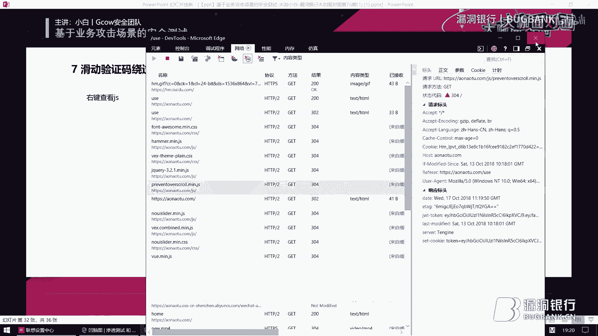

---

## 五、 XXE越权与信息泄露 💣

XXE（XML外部实体注入）漏洞可用于读取服务器文件、发起网络请求等。在某些接口中，可能结合未授权访问造成信息泄露。

### 案例：开源OA系统用户信息泄露

**测试过程**：
1.  发现目标OA系统存在一个Web Service测试页面，列出了多个`WSDL`接口。
2.  使用`SOAP UI`、`AWVS`或浏览器插件测试这些接口。发现其中一个名为 `Test` 的接口可以未授权调用。
3.  利用该接口发送构造的XML请求，通过XXE payload读取系统文件。
4.  进一步测试发现，通过遍历该接口的某个参数值（如用户ID），可以直接返回对应账号的敏感信息，包括用户名、手机号、甚至密码哈希。

**核心点**：`未授权访问` + `XXE漏洞` + `参数遍历`，导致核心系统用户信息全量泄露。

---

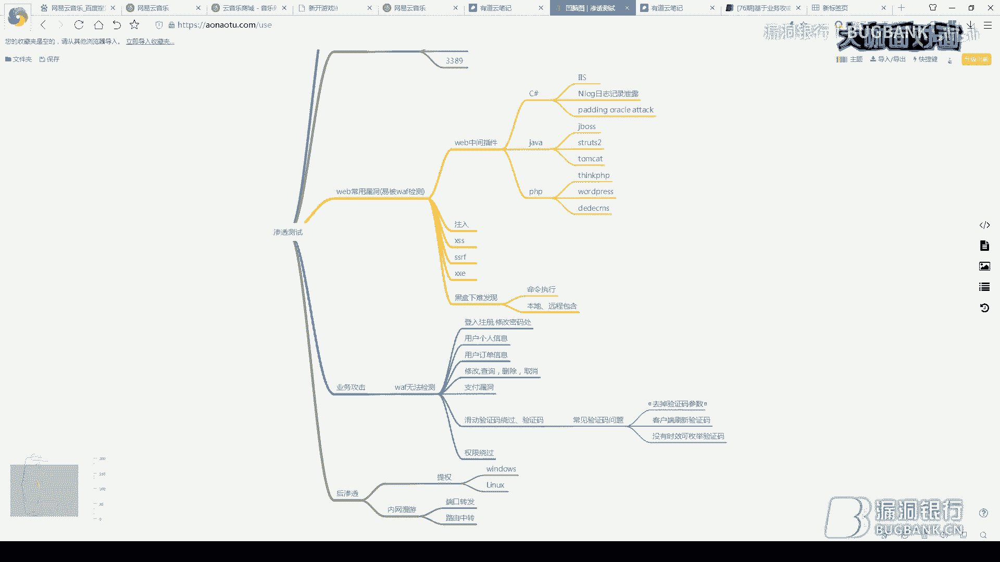

## 六、 .NET Log日志泄露 📄

在IIS服务器中，`Log` 目录可能存放着访问日志。如果配置不当，可能被直接访问，泄露敏感信息。

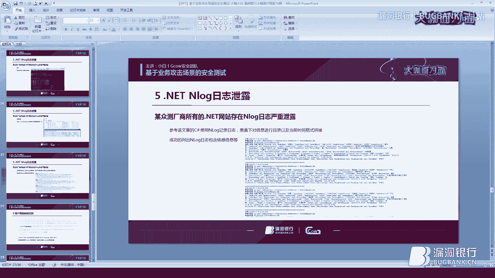

### 案例：目录拼接访问日志文件

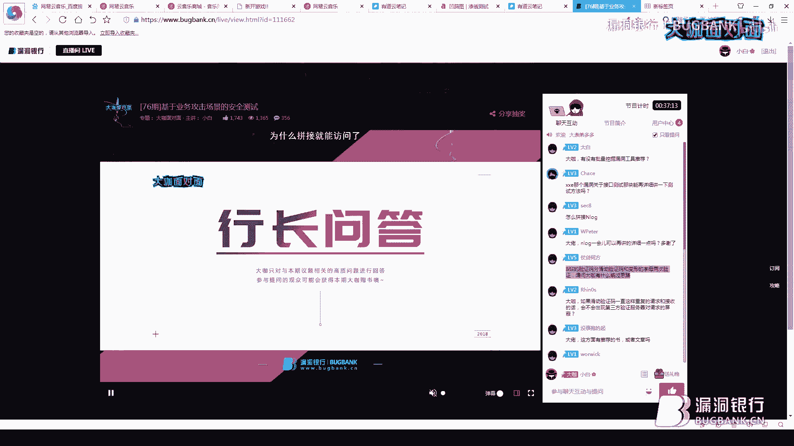

**测试过程**：
1.  访问目标`.NET`网站的一个不存在的路径，返回`404`。
2.  尝试访问 `/Log` 目录，返回`403`（禁止访问）。这提示该目录存在，但无列表权限。
3.  使用目录扫描工具（如DirBuster）扫描`/Log`目录，发现存在以日期命名的日志文件，但直接访问仍返回`403`。
4.  通过搜索和学习，得知IIS日志的默认命名格式可能为 `u_ex[年月日].log`（如 `u_ex160101.log`）。
5.  根据当前日期或网站建立时间，拼接日志文件名进行访问，例如：`http://target.com/Log/u_ex230101.log`。
6.  成功下载日志文件，其中可能包含管理后台访问路径、用户会话ID、甚至明文传输的账号密码等敏感信息。

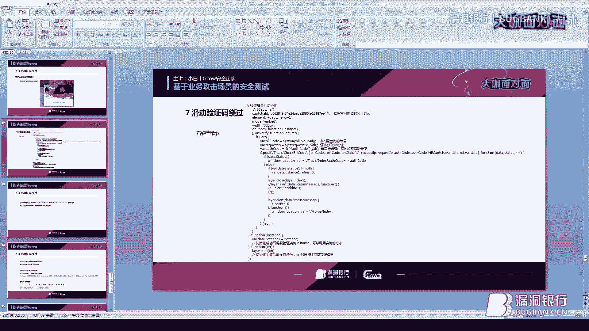

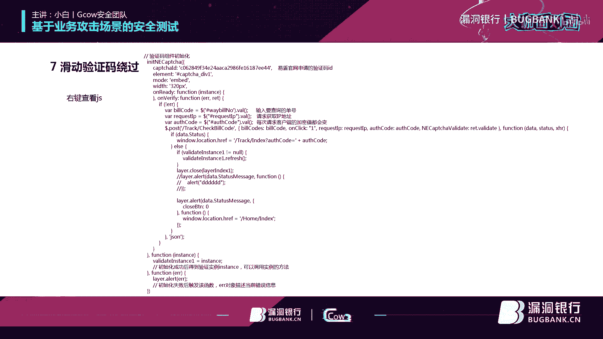

**核心点**：知晓日志默认存储路径和命名规则，通过`路径拼接`直接访问日志文件。

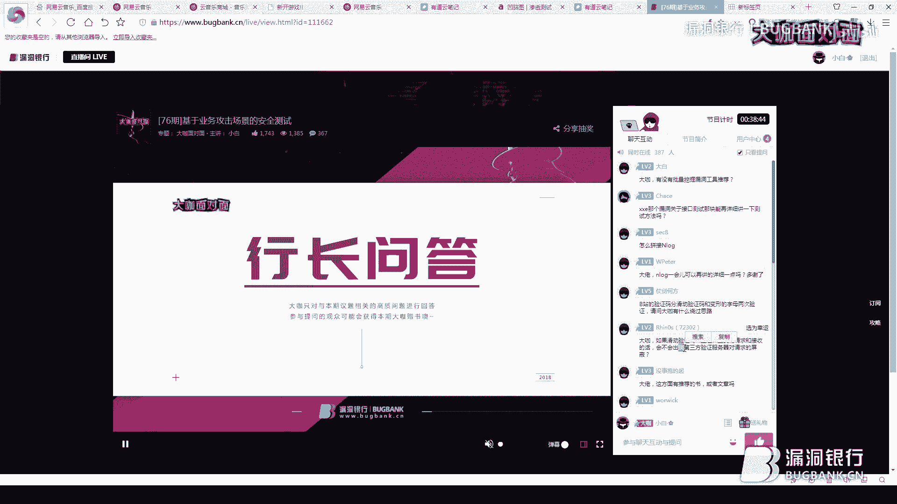

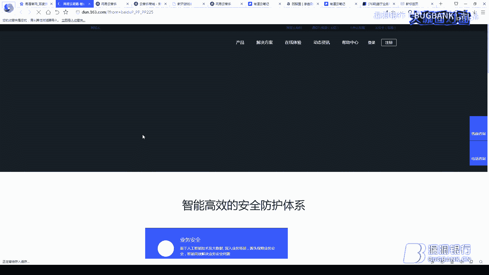

---

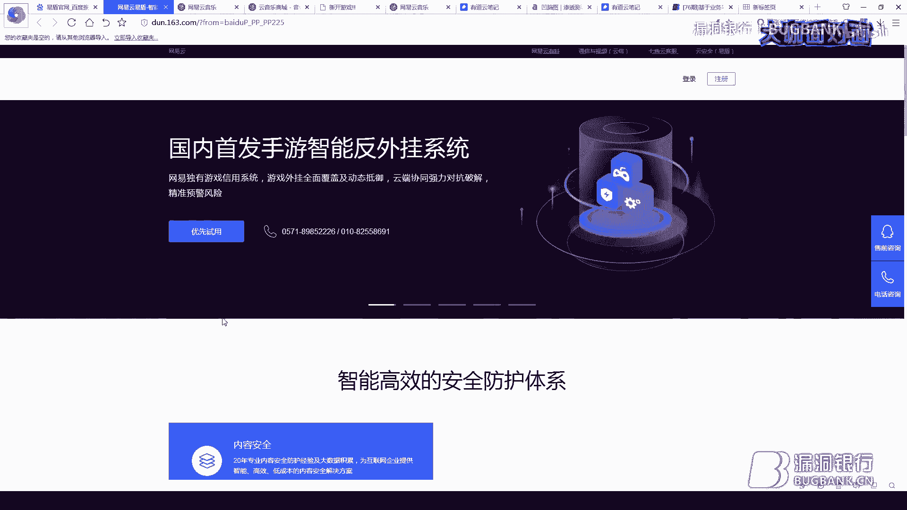

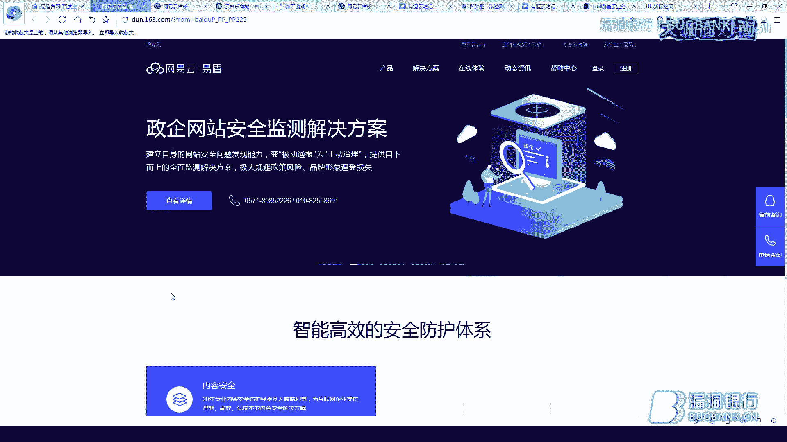

## 七、 客户端刷新验证码漏洞 🔄

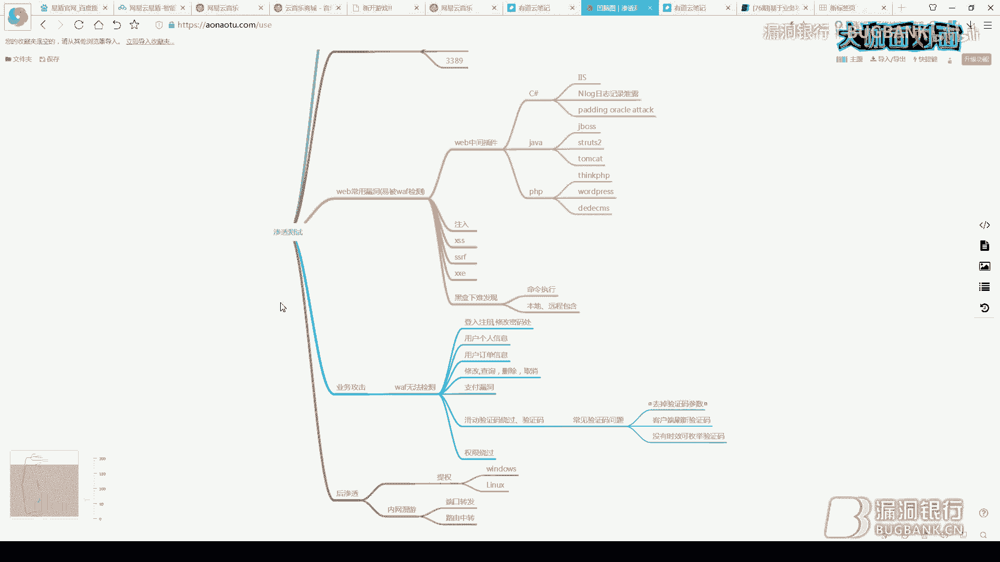

当验证码的刷新由客户端（前端）发起时，可能被利用进行重放攻击，绕过验证码限制。

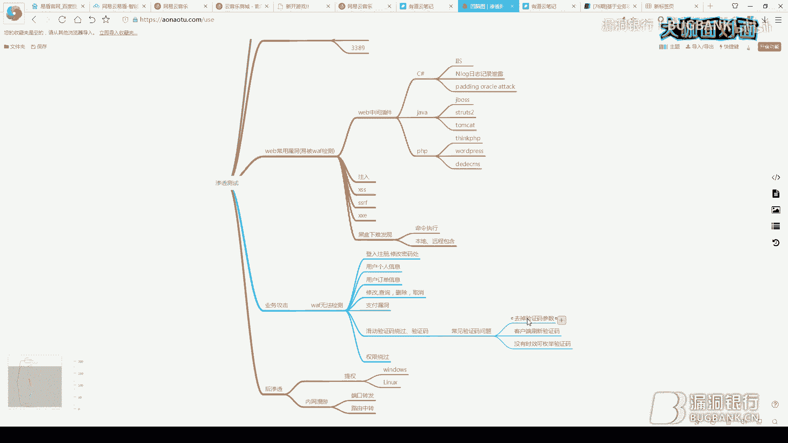

### 案例：验证码图片客户端刷新

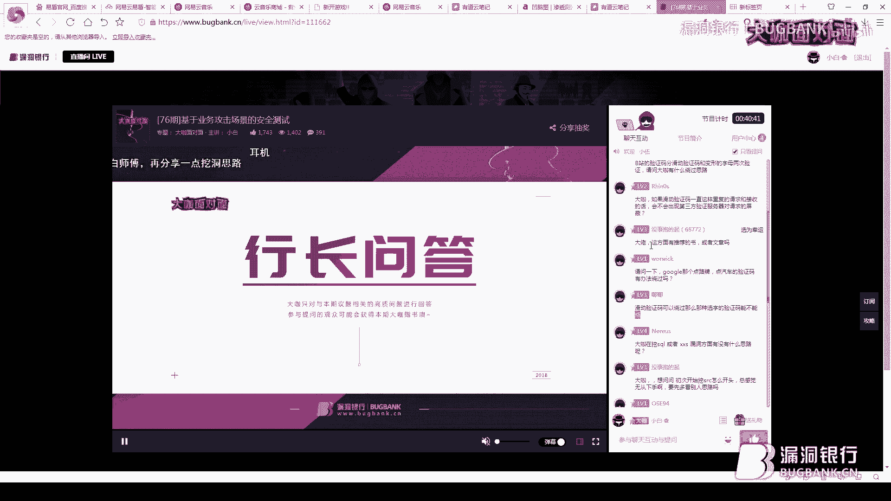

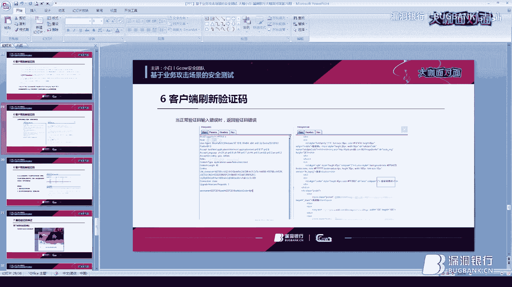

**漏洞原理**：
1.  查看登录页面HTML源码，发现验证码图片是通过 `` 标签请求的。
2.  每次需要新验证码时，由客户端JavaScript重新请求这个`src`。
3.  攻击者在一次成功的“用户名密码错误”请求后，使用代理工具（如Burp Suite）拦截后续请求。
4.  将后续请求中的验证码参数固定为之前已知正确的一次验证码，并**阻止浏览器向`/getCaptcha`发起新的请求**（即不让验证码刷新）。
5.  此时即可对用户名和密码进行暴力破解，因为验证码始终有效。

**常见验证码问题总结**：
*   **验证码未生效**：提交请求时直接删除验证码参数仍能通过。
*   **客户端刷新验证码**：如上所述，可固定验证码值进行重放攻击。
*   **验证码无次数/时间限制**：可无限次尝试验证码。

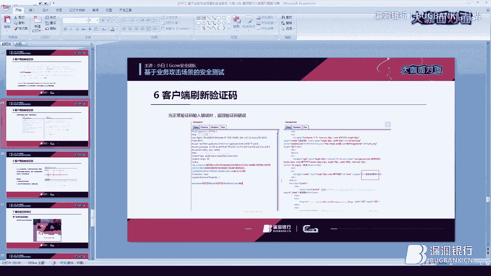

**修复建议**：验证码应在服务端生成、校验和强制刷新，并与会话绑定。同时，限制单位时间内用户名密码错误的尝试次数。

---

## 八、 滑动验证码绕过 🛡️➡️🎯

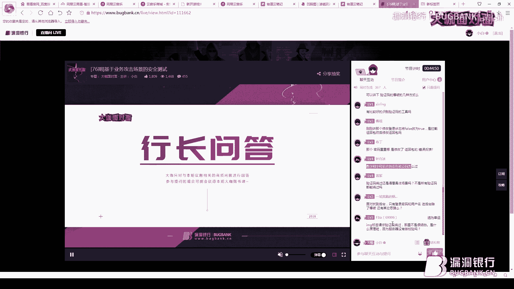

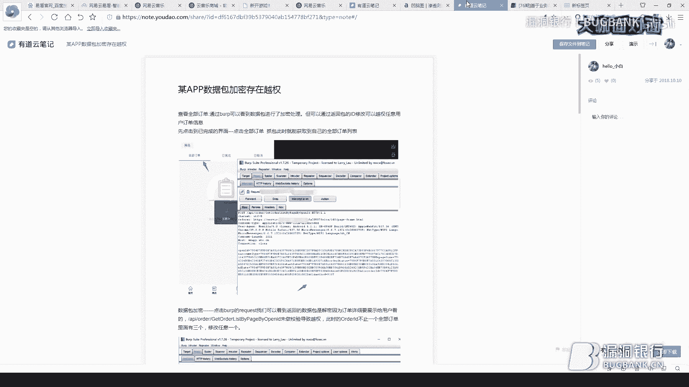

滑动验证码的验证逻辑如果在前端实现不当，可能被直接模拟验证后的请求而绕过。

### 案例：分析JS逻辑构造验证请求

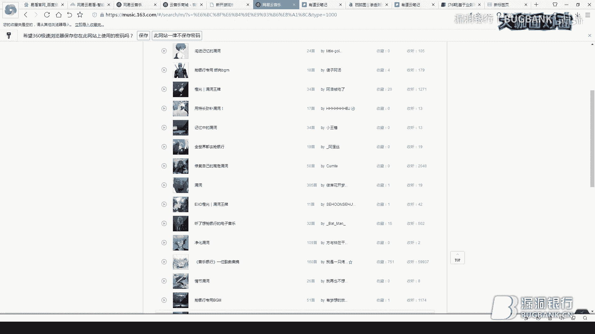

**测试过程**：
1.  打开浏览器开发者工具，进入“网络(Network)”和“源代码(Source)”标签页。
2.  触发滑动验证码，在源码中查找并分析相关的JavaScript文件。
3.  分析JS代码，理清验证流程。通常流程为：
    *   第一步：访问页面，获取一个动态的、一次性的令牌（如 `token` 或 `ac_token`）。
    *   第二步：用户完成滑动操作后，前端会带着这个令牌和滑动轨迹数据，请求一个验证接口（如 `/check`）。
    *   第三步：验证通过后，前端再携带令牌请求真正的业务接口。
4.  **关键发现**：如果第二步的验证请求和第三步的业务请求参数可以预测或构造，那么就可以跳过实际的滑动操作。
5.  **构造攻击**：
    *   使用 `cURL` 或脚本模拟第一步，获取初始令牌。
    *   直接构造一个向验证接口（`/check`）发送的请求，并模拟一个成功的响应。
    *   使用第一步获取的令牌，直接请求最终的业务接口，从而绕过滑动验证。

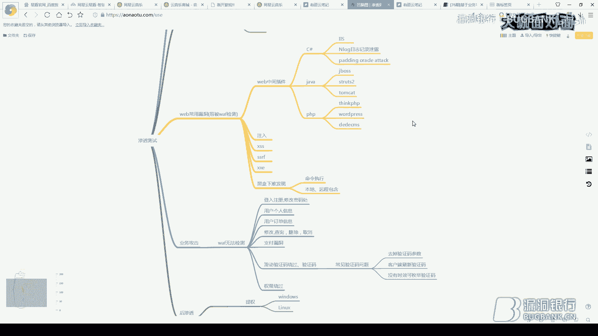

**核心点**：通过逆向分析前端验证逻辑，**模拟“验证成功”后的状态**，直接跳至最终请求步骤。漏洞根源在于服务端未能将“滑动验证”与“后续业务请求”在会话中进行强绑定和状态校验。

---

## 总结 🏁

本节课我们一起学习了基于业务攻击场景的安全测试方法。我们涵盖了七种主要类型：

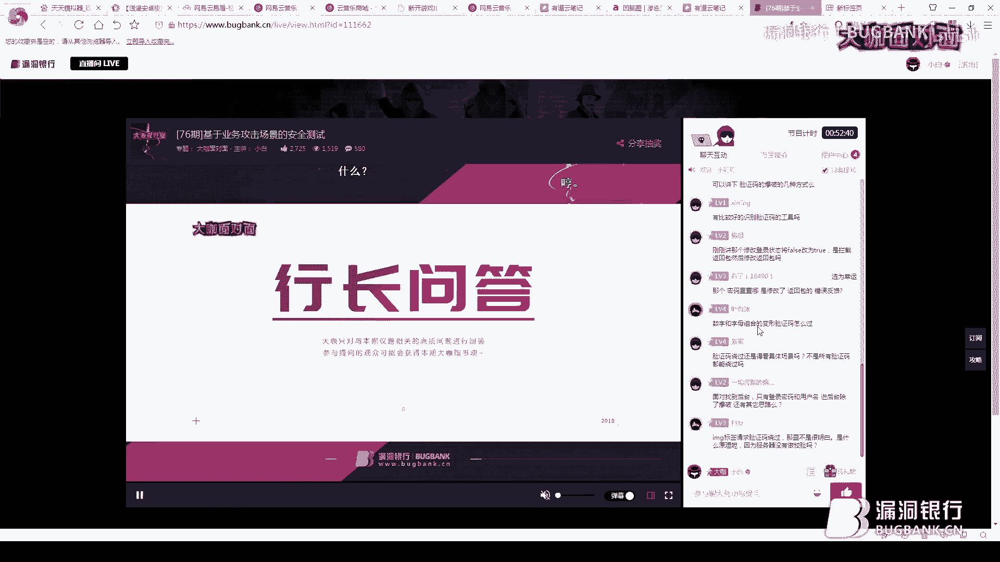

1.  **水平越权**：关注参数（如ID）是否与用户身份绑定。
2.  **本地验证绕过**：警惕客户端提交的验证结果，服务端必须独立校验。
3.  **任意密码重置**：检查多步流程中的状态校验是否严谨。
4.  **XXE越权与信息泄露**：关注未授权接口和XML解析功能。
5.  **日志信息泄露**：了解常见服务器组件的默认路径和命名规则。
6.  **客户端刷新验证码漏洞**：验证码的生成、校验和刷新必须在服务端完成。
7.  **滑动验证码绕过**：通过分析JS逻辑，尝试模拟验证成功后的请求。

业务逻辑漏洞的挖掘需要测试人员深入理解应用程序的工作流程，并思考“开发人员期望的流程”与“实际可操作的流程”之间是否存在差异。多动手测试，积累经验，是提升这方面能力的关键。