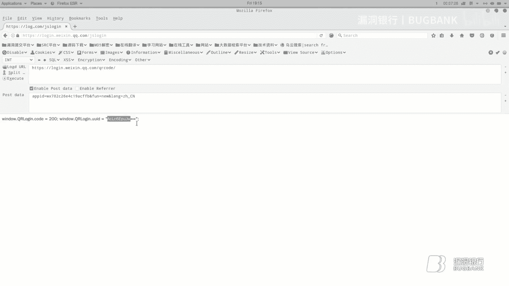
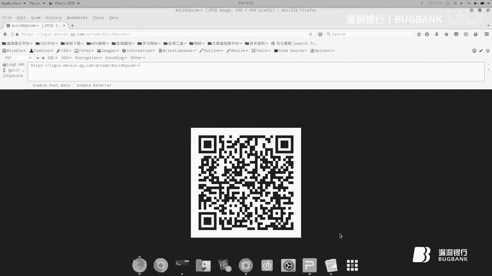
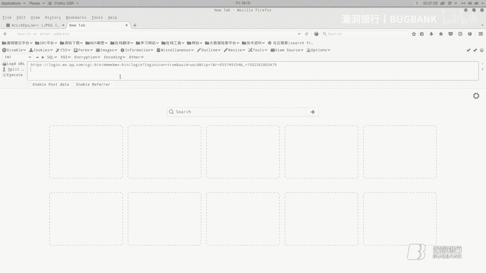
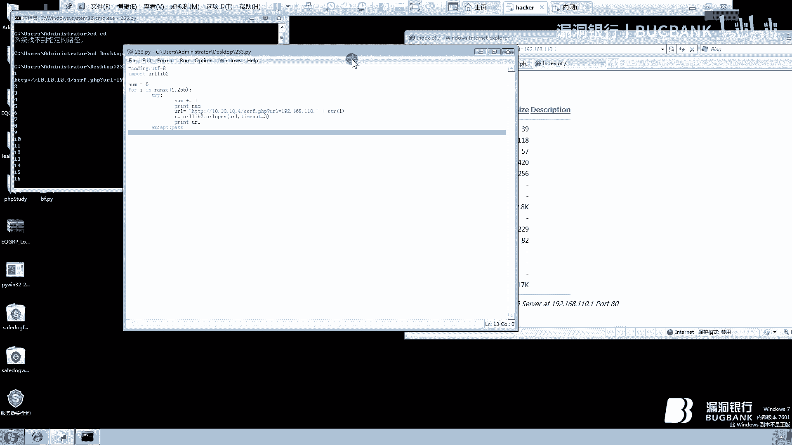
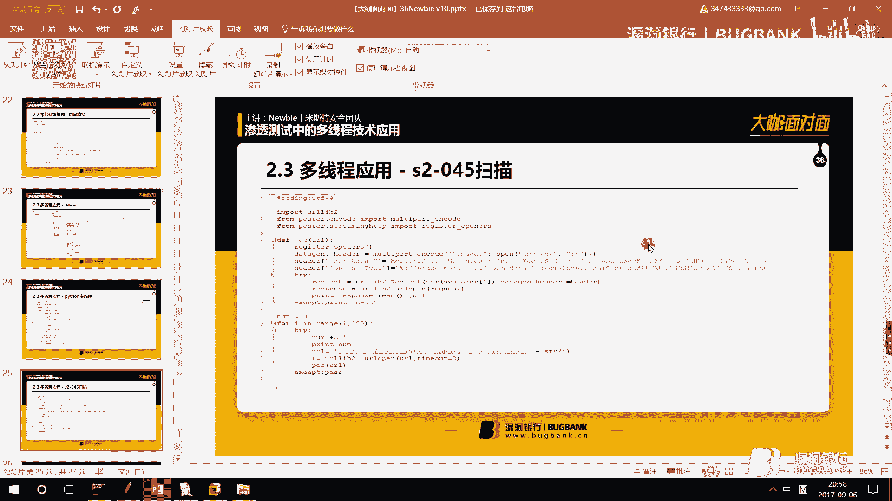
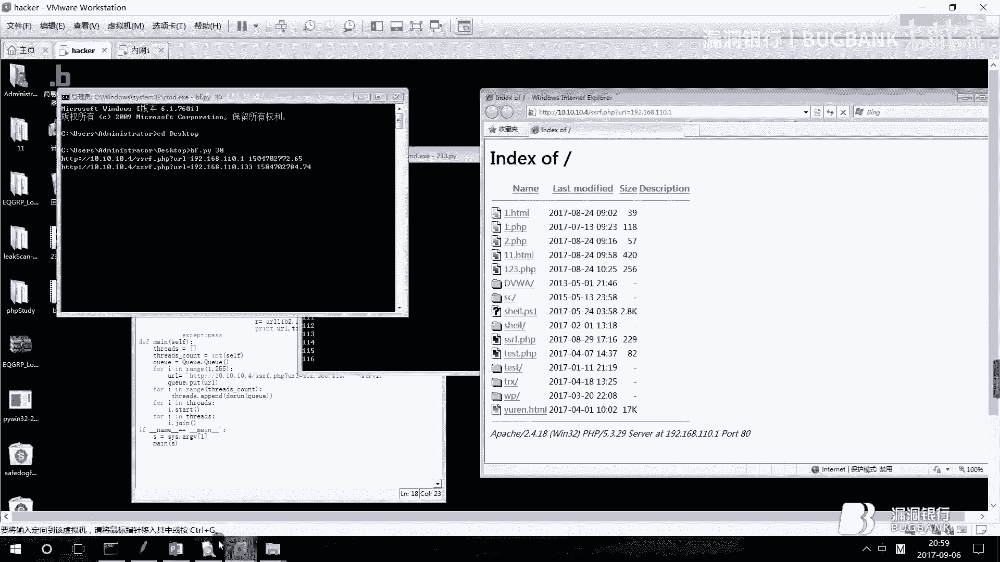

# P1：【录屏】多线程技术应用+QRLJacking——第36期Newbie+gh0stkey分享 - 漏洞银行BUGBANK - BV1cv41187xu

。Yeah。

hello，大家好，欢迎大家来漏洞银行大咖面对面，我是大咖高司 key。那今天这一课咱们来讲laing care加。那首先我们来看一下目录，123。首先我们进入第一个。目录哦，第一个目录下。

然后我们来看一下Q2L。那什么是KL加Q呢？K呀。QR它是二维码，L是loin对吧？那KLLjaking呢其实就是二维码登录嘛。那jacking。是什么？ja庭是结持，对吧？那这边就是。二维码劫持。

那劫持谁的二维码呢？那相信大家二维码登录一般都是在哪边啊？微信的网页端QQ的快捷登录方式，对吧？这些都会使用二维码登录。那这种登录它是有一个名字叫做SQL那它的中文意思就是安全快速响应登录。

那也就是说这边劫持的是劫持这个网页端的这个二维码，对吧？Okay。那我们来了解一下这个。Q2L加K它是什么呢？它是一种钓鱼手段，它是一种钓鱼手段。那首先攻击者他需要建立一个客户端。

对吧而这个客户端肯定是比如说微信网页端这样一个二维码绘画。然后他会把这个就是他这个客户端上的二维码复制到这个钓鱼网站。钓鱼网站，那攻击者将钓鱼网站发给受害者。如果受害者相信了，并且打开了。

那他就会用手机去扫描这个钓鱼网站上的二维码，对吧？那其实上这个钓鱼网站的二维码跟这个攻击者他自己打开的客户端其实是一个二维码。那也就是说。如果是害者他扫描了，那手机里的APP。

他就会把这个taken发送给这个。啊，目标服务完成一个认证过程。而这个发送过程实际上不是由钓鱼网站去完成的，是由谁啊？是由攻击者这个客户端上面的这个绘画去完成的那也就是说你在钓鱼网站去扫描了。

而其实它是在攻击者的客户端上去响应的去请求的。那最后攻击者作为客这个客户端二维码。作为发起客户端二维码的绘画的人，他就会获得这个受害者账号的一个控制权。那之后呢，服务就会开始在公益者的浏览器绘画中。

交换这个受害者的数据。那这时候。受害者的数据就会被攻击者直接给获取，对吧？那这边呢我们来看一下，通过以上它的这个原理。其实我们也啊建了一个demo，但这边就不演示了啊。啊，这边它有一个缺陷。

它的缺陷是它的局限性很大。工击者他需要实施在线钓鱼。而且它是一V一的实时钓育，那也就是它是单向钓育。并不是撒网式钓鱼。那这边我们针对它的缺陷，我们做出了一个新的啊钓鱼方式。

叫做nttting care neting。意思就是撒网撒网的Q聊家庭。那这边就是我们的这个。啊，原理模型如下。第一个。步骤就是攻击者。首先我们要构建一个网络钓鱼页面。

而这个钓鱼页面它是获取真实网页的一个二维码。第二个，攻击者将钓鱼网页发送给受害者。第3个，受害者使用特定目标移动。APP这对吧？就首先让APP去扫描这个二维码。之后，攻击者在后台获得受害者的认证链接。

攻击者打开认证链接后，控制受害者的微信权限。因为在这边我们是使用。啊，微信这个网页端来做一个实操的那这是我们这样一个原理。啊，大家了解一下。好，那在做这个网页时候，我们遇到了一些挫折。为什么呢？

因为我们之前啊团队是开发过这个微信机器人的，所以说我们第一时间想到这个呃微信的微信机器人的一个模块叫做WXPY。那这个模块。啊，在我们在使用这个模块的时候，就遇到了一个挫折，什么挫折？

就是在我们写第一条命令的时候。哎，他就有问题了，为什么？因为它第一条命令它是使用的bot函数，那这个函数呢执行完。必须得执行完之后才能执行下一条代码。那也就是说，如果你不执行这你不执行这条代码不执行完。

那么你下一条代码就不会运行。那这时候呢我们啊使用的是python web的一个fask框架。但是这这个框架肯定是在这个函数下面写的。那所以说你这个函数不运行，我框架也没办法执行。

那这个钓鱼业面也没办法形成。那怎么办呢？我们只有自己去分析这个微信二维码快速登录的一个外部协议了。那他的协议首先我们了解一下，首先我们肯定是要获取他这个二维码嘛，对吧？

要把它这个二维码复制到我们这个呃钓鱼网页的钓鱼网页上。所说这个UID是一个很很重要的东西。这个什什么是UUID呢？你们自己打开这个微信的网页段，对吧？我们来打开看一下。我们打开网页端。右键选三元素。

那其实你是以看到它这个二维码呢，它有1个MM杠SRC对吧？那他这个。哦，在这里或者在这里SRRC这边，那它这个链接它后面有个Q2QRcode，然后斜杠。然后有一段代码，那这段代码其实就是UID啊。

那这个UID也是啊组就是构构成这个二维码的一个。核心部分。所以说这边我们需要一个接口去获取。那这个接口我们也找到了，是这个接口。UID获取结果。是这个。那它其实是一个pose请求的。那这边我们来看一下。

那他请求正文如下，随时便。复制过来，使用habar去模拟一下后色星求去访问。好，我们把这个获取过来的这个UID。选用文档来记录一下。好，这是获取UID的一个接口。我们再看。或这个二维码获取的一个接口。

二维码获取接口呢，其实我们可以使用原网页的原理。原网页原理。来看对吧？它是这样一构成的。那么我们就把前面的照搬。搬过来。然后跟UUID结合一下就O。

OK那这是二维码接口。

这二维码对吧？好，那二维码我们已经有了，我们再来看一下。我们既然要获取它的权限，那么是不是就要继续分析。那分析什么呢？证明我们需要一个监听接口，监听结果如下，它的格式也是需要这个UID的。新建一个页面。

把U个ID。给复制过来。然后我们去请求去请求之后。这边它会一个一直连接，因为它要一直监听。好，这边一旦我们扫一下，它就会变了。我使用手机上二维码，手机上的微信来扫一下。

好，扫完之后。它会有一个window点code201，然后后面有一大串东西。那这个这个其实就是啊d尾协议一个图片，对吧？就是一个你的微信头像。好，那这边我手机上会有一个网页版微信登录确认。

完保护器登录确认。那这边。啊。我先。点个确认。哦，我点了确认之后，我们。再次访问这个链接，你会发现它会变成这样。对吧它会变成这样，那我们先不管它是干嘛用的，我们先来继续往下看。那他反回结果如下，对吧？

不像，然后我们来看一下，那监听结果返馈结果最多的那部分就是头像，也就刚刚我们那个data为协议的。但真的只是头像而已吗？那有些人像信大家已经注意到这个window点code了，对吧？那这个是code。

它返回的这个是数字，对吧？什么201200400，那它分别是干嘛的呢？扫描成功，就是说我们手机上扫描成功。他会返回201。那我们在这个终端上点个确认，它要返回200。那如果这个二维码过期。

它会返回400。那我们扫描成功之后，它除了返回这个window点code，它还会返回一个头像的一个呃。d鬼协议的一个链接，对吧？那还有第二个，如果你在这个微信上点了一个确认，它会返回一个链接。

它返回一个链接，那这个链接是用户凭证链接。那只要我们点开这个链接，就可以直接进入这个用户的微信外部界面。只要我们点入这个链接，就可以直接进入微信的外部界面。那我们来你看我们只要访问这个链接。好。

我现在就直接进入了被害者的这个微信账号，对吧？直接进入我的被害者的微信账号。那可以看到我也可以给这个文件助手发一个信息。他就变。对吧。那，可以看到是这样的一个东西。那这个是一个整体的一个过程。

那我们要写成代码，其实是还是挺复杂的啊还是挺复杂的。因为我要去啊模拟微信的呃微信登录的一个界面，对吧？还要去。做这样一个后台接收。

那其实这边呢使用这个flask框架去做一个python的一个web webb界面。那我们来看一下这个。我写的这篇文章。我们这个代码实现是这样的。首先啊它会有一个主页路由路由。

当用户访问这个index的时候，它会。调用这个UUID的接口，然后将其渲染到这个模板中。那就是如下代码。然后我们获取后端传过来UID，并且使用image标签去调用。

二维码的接口获取二维码接口在客户端上进行显示。紧接着我们轮群二维码扫描的API就接口，并且判断各种情况尽可能实现的跟微信一样。那这。前端的一个文询代码。是这样的。大家可以看到这边是使用啊。这样写的。

然后我们再来看一下二维码扫描的路由。二维码扫描路由是这样的。可以看到这边是UID对吧？然后我们这边请求了这样一个东西。那这个呢其实就是我们刚刚那个监听接口。

那前端使用AJHR来请求后端将返回的结果转化为javaql表达式。当全局的code为408的时候，说明没说明没有扫描，继续递归。当全局扫描啊这个code为400的时候，说明二维码过期了。

然后这时候我们会重新去获取这个界面的二维码。当我们为201的时候就返回成功了。然后我们再将其头像渲染到这个index界面中，然后我们继续继续递归。调用当前函数。当全局code的为200的时候。

说明我们已经这个被害者已经在这个APP应用上。点击确认了。那这时候我们返回的这个链接传入到后端，紧接着我们直接跳转到。跳到这个链接，让用户认为你是真正的登录了这个微信，而我们后台又得到了这个微信。

就是微信这个凭证，用户凭证链接。那这时候我们在后台。这边我是存入到这个。呃，result点TRRT中我程入这边，我在后台哎，我一接收到，然后我直接点开我就可以控制这个。啊，受害者的这个微信权限。

那简这就是一个简单的原理。

简单原理啊，就到这边，谢谢大家观看。

大家好，我是来自米安全团队的牛变。今天给大家带来是上市中的多远程技术应用。

呃，今天总体内容可以分为多远程批发漏洞和多远程的实习应用。在多远程变发路当中。要了解什么是多元层并发漏中。然后通过三个小案例来学习段炼成编发log洞的发现及利用。在多远程新应用中。

首先我们将了解什么是SSRF。便通过本地环境深入利用SSIF漏洞。最后，通过SISRF体现多眼圈的一个优点。呃，下面我要讲的是多线程并发漏洞。呃，首先什么是多线程并发？呃，我们先了解一下病法。正常请求。

用户A在一个网站上提款发送了提款请求，后台显示了一条提款请求呃，审核了，然后顺利的提交款。然后变换请求用户A在一个网站提款，同步发生了多个提换请求，后台显示了多条替换请求。审核了。

然后提呃级别了一个 money点。然后是断程。多线程不等于多进程，一个进程包含一个到多个县城，每个县城可同时完成不同的工作，称为多县程。呃，例如我们打游戏的时候。左手QW1样，然后右手控制鼠标。呃。

我们把人看作一个进程的话。呃，两只手就是两个线程，然后咱同时完成的工作。然后是多眼线的优点。成序的运运营速度加快。然后在生活中，我们很多地方也使用了老动远程。呃，例如下载。

当我们使用迅雷下载多个文件的时候，会发现它是同时进行的。然后这一会大大减少我们的一个下载的时间。就假设我们下两个文件，文件A和文件B。文件A下载到了10%，然后文件B。呃，不可能是0%。

就是会大于10或者是小于10%。它两个是。呃，同时进行下载。这个是一个典型的东元成的一个应用。嗯，对症别发。说了这么多废话啊，我们来接问正题，我们该如何吧？首先我们要知道易发点在哪。

有一提款、支付、退款、兑换等数据交互的点。就是所有和数据交互的点都有可能会存在多远程变发漏网。嗯，什么类型的网站？购物、金融、旅游等等。测试工具嗯。

我们这里是用到了阿巴西组织开发的一个基于java的压力测试工具。用一对软件做压力测试，它最初被设计用于外围应用测试，但后来扩展到其他测试领域。我们在这里也。让他进行外面测试。流程包析啊，我们看左图。

这是一个正常处理的一个流程图。首先是用户提款，然后输入相应的金额。然后判断是否大于等于提款数，然后生成一个提款单。后台扣除用户相应的金额，最后是替款完成。哦，左图为正常处理流程，看着并没有什么问题。

但是如果一个用户同时发送两次或多次提换请求。扣除用户金额时，扣除了每一次请请求的金额。如果用户。账号里只有100块，同时提款了两次，也就是扣除了200块。其实他的金额应该是-10。嗯。

接下来我们通过三个案例更深入去了解多远程变发漏洞，然后及其利用。首先我们看第一个案例。第一张图。呃，可以看出是在对换商品时。同时，并发请有两次。我们的总积分是1000。对外一样商品所需的积分是800。

所以我们应当是只能兑换一件，但是两次并发请求。数据库如果被及时闭合，然后我们的。积分变成了呃-650。我们接下来看202。阿里尔维乌云05年的呃一处漏洞。首先看第一张图。录用奖金为1922元。

并发申请了两次1900元的一个呃，申请提提现。能够看电影呢。我们次日就收到了两次1900元的一个付款。然后我们回头再看一下，漏洞奖金，变成了-1878元。嗯，下面我们看爱丽3。

案例三将告诉大家如何去测试并利用多远程并发漏洞。首先，漏洞发生在申请提现处。某输体验的金额然，我们提交抓报。这时候不要放抱。然后打开我们的工具，我本地操作一下。借款。我们继续往下看。首先是U击测试计划。

然后创建线人组。这边跟着操作一下。先生组创建。然后这里有几个参数。呃，首先是线成数，就是一个。请求线生那一个数量。然后是间隔时间。然后是是置位零是并方，就比如说两个线程的话。这样就是同时并发呃两个县程。

循环次数，如果设为二的话，二的话，然后就是两个线乘数。也就是请求44次，并发请求两次。这是个一。嗯，我们继续往下看。这里之前说过了。呃，接下来我们需要创建1个AATP请求。在仙人组右击，然后添加。

可以提出请求。首先是。服务器名称，然后或者是IP，然后后面是一个端口号，默认是80。然后是协议默认AGDB然后传入的一个方法。都可以选get pos，然后是都有我这里是一个编码。

这里面是一个呃请求的一个路径。然后下面是一些请求的参数。那我们往下看。啊，因为我当时呃申请体验是在个人中心，也就是后台需要登录。所以我们这里需要创建一个会议管理器。然后先成组添加。配置原件。

然后AP库位管理线。在这里呃设置好相相对应的cookie。用那个呃谷歌浏览器就。很简单就可以看。让我们继续往下。需要添一个监视器，线程组，然后添加监听器。我这里使用呃查看结果数。

我们看这一点。呃，这时候我们点击嗯启动就可以了。结果数可以看到我们这请求了多次。嗯，但是并没有成功。呃，然后他申请提现后吧，然后他是有一个取消本次提现一个操作。那我在这里。进行抓包。

然后在这里使用多点程并发。然后右图为就是成功户的一个截图。这样我们就成功取道了12345个。呃，本来我们的金额是500。那我们这里。变更了5次成功。也是成功取到2500。呃。

下面要讲的是多远程的一个实际应用。通过SSRF来展现段成的优点，首先是SSIF的一个认识。33F。服务端请求伪造是一种由攻击者构造形成由服务端发起行的一个安全漏洞。

如果对用户提供的URL和反馈信息没有过滤的话，就可能会造成SSRF攻击。关键攻击目标为访问正常用户无法访问的内部系统。嗯，你们看这里有两张图，首先是正常流程。用户访问一张图片。然后图片返回给用户。

第二张。用户请求服务器服务端服务器去请求图片，然后图片返回给用户。在这里，如果服务器的请求地址未做限制，则可能会产生SSIF漏洞。🤧。嗯，我们可以做什么？哦，对内网进行修探。

比如服务器所在内网其他主机开放端口等等。然后是对服务器所在内网主机指纹进行识别。然后对服务器所在内网主机进行攻击，比如利用命令执行、客Q注入等等。然后是一发点就是图片获取文件下载。等等等等。

这里是一个常见的格式，前面是我们的1个URL，然后这里是一个。存在漏洞一个文件，然后这是一个参后面是参数。这个后面往往是跟着一个呃图片的一个地址或者是。文件哪一个地址？啊我们通过本地打野环境。

然后复现一下。SSRF漏洞。首先我这准备了两台虚拟机，然后加一个是我本地的一个。环境。迪骇客。我后系统是winIN7。网卡模式条件IP10。10。10。6星机2呃。

模拟内网一系统winI7网卡模式net。IP是192。168。110。128。环境我这里使用PVR里搭建的一个web呃外b服务。物理机物理机使用叉MTP搭件的外包服务漏洞文件。

然后我在跟目录放了一个是SSRF点PCP。🤧IP10。10。10。4。嗯，我们先看一下SISRF点PHP这个文件吧。首先就是通过get方式传呃传递UIL函数。然后我们这里创建col的资源。

下面是设设置项应的选项，然后这里是这一个请留一个URL。然后请求获取的URL，并且获取内容。我最后打印出获取到的一个内容。

嗯，那现在我们开始。来来呃。喜欢看骇客者手机。P地址。是呃，10。1010。7。内一。好好的。5100133。呃，我们现在是骇客这台主机是可呃骇客和内网一这台主机是同呃都可以访问到我这个物理机的。

内网一也可以访问到骇客，但是骇客站的主机是访问不到内网一的。我们的目的就是让骇客站的主机通过我们本地的一个呃外部环境，然后。达到防内网也的这么一个目的吧。因为它属呃属于内网。这就像当一个外网的一个用户。

我们可以看到我P音内网10。10。10点。很是可以通的。我们这边另外一。10点。有一点。你就可以看了。然后还有一个战的主义去用力点。7。这也是可以的，但是。这台黑和智斗耳机拼内网也是不通的。平行。对。

我们这里是呃访问不了呢。然后。我们。我们等你的一个呃。1001004，这是我本呃物理接大电的一个外部服务。然后访问跟目录的1个SSRF点PP文件。需要传递之前看过那个文件，然后传递UL参组。

我们可以假设是AADDP。去体提。3W点百度点com。啊，这就是百度一个网站一个内容。这个打印出来了。其实是让是让。这台主机10。4G的主机去访问百度。然后从而获取中的内容。看我们这里首先可能在测试时。

我们并不知道内网的1个IP地址。然后我们大概都知道，通用的一般是19801680，这个比较多。我这里是所以我们要进行一个呃秀探。然后我这里通过一个。你断下去。嗯，我是通过拍摄。这个简单的一个小胶本。

首先我们循环1到254。然后这里是一个。一海洋参数。然后这是一个地址，后面一直在循环枚举这个。呃，IP地址一一个。C段吧，也就是。就是测1110010段的所有地址。

那我们通过URL left two的一个UIL open方法。去请求这个地址。哦天猫go实时超市时间。如果是大于三秒的话，我们就会。去请求下一条，放弃这一条，就认为它是一个这里如果成功的话。

又会输出当前的1个UL就是存在的呃一个存在地址。等你跑一下试一下。60。410对。这样就可以对内网进行一个修带。三年之外。嗯，可以看到。这样就说明。它的内网是存在10。10。1这台主机的。哦。

但是刚才我们看IP这个是10。133。来访一下这个地址。啊，这是我那个物理机的光系，因为我物理机是用了呃是。两个网卡。一个是192段的这一个，然后是10段的，也是用了一个。所以这两个。

两个地址都可以访问到。还在跑。啊，我就这样就达到一个对内网的一个进行呃一个修态吧。

我们继续往下看。呃，我这里将通过两个方式来实现多远程的一个目的。首先是我们前面介绍了一款工具。我们先删掉。首先添加。添加一个线身组，然后现人组右键右击添加。AJP球，然后再使用呃。

我们这里不使用个使用不到枯位管理器，我这里不添加了。监听器查看结果数。然后我们一些设置，现在帧数的话，我这得设为5吧。然后间隔时间设为0，也就是病房。循环次数一次，也就是5个线程。同时。变发。54。

然后APP就服务器名称或IP我这里用这个呃本地SSIF这个文件来做一个演示吧。地址我们就10。10。10。4，然后中口号默认80。协议默认AJ片。方法get，然后这里是编码默认就好。

然后一个路线路线呢是。P着片。这里设置参数参数这里我是URL。然后值是嗯192。168。110点。133。嗯，这样就好了，我们点。不错。冇。我们看结果数。我这里。5条请求。1-线程组1-1-2。

然后呃1-1-1到1-5。我们看一下时间。都是56。40。同时请求。然后我们看一下阿布写的一个一个日志吧。雄问。嗯。时间。失灵。😔，这5条。呃，可以看到。这5条都是呃同一个时间发过来的，也就是并发。

很明显。这样又实现了一个锻炼钱一个目的。接下来我。

使用python，然后实现一个断程，我这里用到的是。呃，three和queen有两个模块。首先我们看这些代码。然后这里是一个。数组，然后下面是一个线征数定义的。然后这。你通过困的一个铺的方式。

然后把这个UL传递。下面我们来直呃再看读人这个类这个类。看一下独润类里面的个润函数。首先我们取出传递过来的URL。然后我们下面去请求呃，使用URLl to的一个方式。呃。

这个模块的U要open方法去请求这个地址。然后这是生试时间。啊，如果成功如如果这成功就行，然后我们就输出当前那1个URL和一个时间。

我补一下。

打开这台手机，啊这是刚才一个单线整开在跑。执行一下。即个件。然后先设置线程数。30。啊，这是我们再看一下一个日志。哦，太开了。这里已经跑出这个13339页了，单眼城是现在还没。快好多。

🤧日志。看这条。我们设置限制为30。41。然后好像还有38，这对，这都是。这一个断性一个效果。很明显要比单叶城要快很多。嗯，我们接下来继续往下看，我们通过SSIF除了是对内网的一个修探。

然后我们还可以针对一些漏洞进行一些扫描利用。然后我这里是也是使用python给你的一个呃s two的1个045命令执行一个扫描。这里方法跟之前是一样的，然后这里是1个POC的类。嗯POC函数。🤧。

在这里如果这个地址启示成功的话，我我会把1个UL参参数传递到这个。这个BUC这个函数里面，然后去利用这个HRP。测试有没有存在这个漏洞，很简单。打开看一下。我们继续往下看。做一成应用。嗯。

我继续通过一个案例来展现多运性的一个应用吧。首先看。这张图吧。这是某SRC平台之间存在的一个月权漏洞。我们通过python加以利用。首先漏洞的位置是那个在上传图片以后提交漏洞的时候。

然后上传图片是发现是有规律的。对。这是一个前面是日期，然后后面是一个上传时间的一个格式。让我们生成这样一个式，然后放到AA点TST这个文本中。然后通过request get的一个方式去请求这个URL。

然后判断它的一个返回的一个状态码。如果为200的话，我就输出当前的1个URL，也就是存在这张图片的1个UUL。嗯，这业这个方法跟之前用的是一样。然后这里是一个呃首先也是用的。sreing和控制一个模块。

啊，这一个也是一个数族。啊，下面还有个显示数，然我是也是通过SY。将这个限成数来自定义。前面跟之前是一样的。

Yeah。