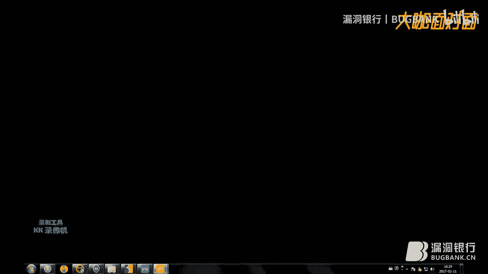
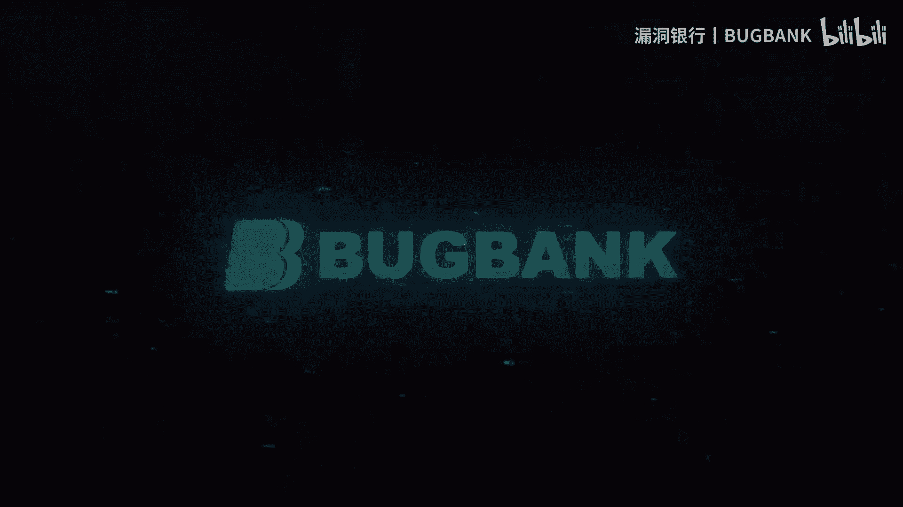

# P1：【录屏】安全狗上传bypass和webshell免杀——大咖ian分享 - 漏洞银行BUGBANK - BV1BV411q7ja

Yeah。

あ。那么大家好，我是那个class实验室的一个核心成员，还有09的成员。那我们今天要讲的就是安全狗上传bypa，还有we share杀。我们首先看一下一个HTV协议，这是一个post的数据包。呃。

你先看第一行post upload点P这一个上传的页面，就是跳转到哪个一个上上传的PHP页面。然后这个host是本地的一个地址。然后第三行count就是一个字节的一个长度。

然后我们再看一下第四行这个catch这块cach这个是用于一个指定所有缓存机制，在整个请求，还有响应链接中必于服从的一个指令。

然后下行accept这个有这个什么test hTM，还有application XHTM加XML这这乱七八糟一大堆的这行就是告诉服务器当前客户端可以接收的文档的类型。

然后接下来这行这行就是一个本地的一个地址，17。0。0。1。然后这个upgrade就是一个HTVP转到HTPS的一个东西，这块就不用进行过多的了解了。

然后这个useruser它中文名是用户代理简称UV它是一个特殊的字符串头，使服务器能够识别客户使用的操作系统的版本，还有CPU类型，还有浏览器的版本，浏览器的渲染引擎，还有览浏览器的语言浏览器插件等等。

然后接下来这个countent type content type这个是用于定义网络文件的类型，还有网页的编码，决定文件的接收方式，将以什么样的形式，还有那个什么样的编码去读取文件。

然后接下这个refer就是一个本地的一个上传的一个地址，然后accept enco它就是一个浏览器发发给服务器，生明浏览器支持的编码类型。然后accept language这块就是一个语言的类型。

然后coer这是我们一个本地的环境下的一个安全狗的一个coooker。然后我们看一下，这是一个完整的HTEB协议。我们上传一个那个名字为凯给12点PHP，然后内容为1个PHPin的一个代码，这是做。

那个抓取了一个那个pos的包。然后我们今天就是说一下思路，思路就是第一种是第一大种是扰乱编码。第二大种是替换大小写，第大种是文件的上传。然后第一大种又分为三小种，第一种是增减空格。

第二种是一个对conent dis，还有con type name file name from date这些进行一个修改。然后第三种就是HTT参数污染。然后呢，我们。来看一下，这是一个。哎呀。

我们先把那个IP代理到本地。然后。进行一个上传。那我们先把文件名改成那个IN点PHP。然后内容就改成写成1个THPin放。然后再把它发送到那个repeer这一块。我们正常的提交的话，它会进行一个拦截。

我可以看一下，这是一个本地的安全狗的一个环境。然后我们先说一下。呃，第一种方法第一种方法它是。进行一个count dis，还有form date name file name这块。

重点是form date这块加上一个波浪号。我们可以看加form date这块加个报单号。我们名件为I1点PHP。然后它是可以提示上传成功的。我们可以看一下upload这块已经有了一个文件了。

然后我们再把数据包还原回去。还像回去我们再看一下。第二种。第二种是通过替换大小写，还是con dis这一块。我们把con dis这块C改成小写的Cformd这块F改成大写的F。

还有con的 tap这块C改成一个小写的C。那我们可以试一下，首先把这个C改成一个小写的C。我们认为IN2的PHP。嗯，它是可以生传成功了，我们再把数据还原回去。换回去把防地这块F改成一个大写的F。

它也是可以生成成功的。我们再把这个countant type这块C改成一个小写的C。哎，等一下。呃，方。dF改成一个大写的F，那么文件名为改成N3点PHP。啊，然后再数据还原回去。

把这个counttype这块C改成小写的C文件名为IN4的PHP。它也是可以生成成功的那我们再把数据还原回去。关就接下来我们讲的就是。通过增减空格。

增减空格是count dis from data这块增加后减少一个空格。我们来试一试，先增加一个空格。那我们文件名改成IN5点PHP。它是可以上传成功，我们再减少一个空格。改成IN6点PHP。

它也是可以上传过，我们再把数据还原回去。接下来就是在form date这块增加或减少一个空格，那还是增加一个空格，改成N7点PHP。它是上成成功了，我们再减少一个空格，换成M8的空PHP。

它也是可以上成工，我们把数据包还原回去。接下来是在com tap这块减少一个空格，这块只能减少啊，不不能增加，我改成IN9点KHP。它也是可以上传成功，我们再把数据包还原回去。

然后接下来这种方法是form date这块替换一下form F后面增增增加个加号，还有D后面增加个加号。我们在F后面增加个加号就是。改成IN10点PHP。它是可以上传成功。

我们把同理我们可以在D后面增加一个加号。改成IN11点PHP。它也是可以上传功货，我们把数据还原回去。然后接下来是一个双文件上传。双文件上传就是我们可以看一下这个数据包就是。

先上传一个那个偏正常的P这文件，然后第二个上传1个PH文件，它是可以上传成功的。但是截止到今天为止，今天是2月11号，这个漏洞已经修复了就不行了。我这个文章是2月3号那天写的。

然后我们再看一下这个第六容吧。那个吧替换还是替换form dateform date就是把直接把form date直接替换掉。替换成一个星号，我们改成按12点PP。它也是可以上传成功了。

我们再把数据还原回去。然后接下来一种方法，我这上面没有写，就是把fill name这块两个引号就是文件名两个引号去掉，然后后面加个分号，能改成IN13。BHP。它也是可以上传成功的那么其实讲这么多。

其实就很简单啊，它重点就是主要是这一块的内容，它经过各种替换啊，各种你能想到的方法，还有想到的方法进行替换，来避免绕过安全狗的一个限制。然后我们还有一种方法就是。

就是在counttruter type这块增加上N个任意的字母，也是可以达到绕过效果。但是我还没有测试成功过。然后第接下来还有一种方法就是通过编码绕过，就比如说那个把那个。这个文件名后面可以加个后缀呀。

各种编码进行绕呀。呃，但是暂时没有成功过。然后我们接下来要讲的是一个web shop面纱。webshop面杀的思路就是不不出现eva access system等安全狗拦截的关键字。

然后因为我PHP学的也不是很好吧，那我们所以。这个就粗略的讲一下啊，思路就粗略的讲一下，来看一下内容。我们今天要讲的到是1个HPf content函数。这函数就是一个。就是读取一个远程读取的一个。

远程读取的一个文件。就是这时候我百度的一个这个它的定义，你们可以看一下。然后我们这个函数就是。代码就是这个这个。我们可以替换一下。然后如果是用get请求的话，就是把这个post换成request。

那我们解释一下这个IN的话，就是你的一个你可以认为是一个你的密码。然后这个远程打开一个链接，就是这个这个链接就是肯你是那个网上的任意一个地址，你不一定非要是127。0。0。1。

也可以是别的网站的一个地址。只要它的网站目录下有个TXT文件，并且这个TXT文件里面的内容可以是呃它的可以是以va以VAI或者stem或者asse都可以。那我们在那个我们这个本地目录下创建一个文件。

IN点TXT。然后内容是sister吗？那我们这个上传一下卡。把这个上传名就改成shallPHP。嗯，它是上传成功了，我们来看一下啊。哦，我们有了这个之后就是直接能执行命令啊。N点N等于或MI。

然后它会直接给你返馈一个系统命令。我们看到是sstem权限，我们再来执行一个别的命令。Ne user。他都会一个执行一个命令。然后这是这是一种方法，是应用这个函数。然后还有一种方法就是一个ser函数。

但是有些比如说那个360的话，它可能会拦截。但是安全狗这个目前没有连拦截。我们改成是要1点PHP。看它是可以上传成功的。然后这个的话，那我们就是如果换成exel的话，就一个普通的一句话。

post1个e的话，一句话它就会拦截。所以当我们改成sem的话，它就不会进行一个拦截。我们可以看一下。这个是直接执行系统命令的。所以讲来讲去就是。讲了这么多，其实总结一下。

它就是通过各种不同的姿势来进行一个达到一个绕过的效果，就一些常人无法想到的一个姿势。然后所以我们最后再说一下，我们就是科拉实验室，还有领组安全。这两个，然后我们的官网是col lab的RG。

还有0杠S写的RG。然后最后截止到最后，谢谢。

