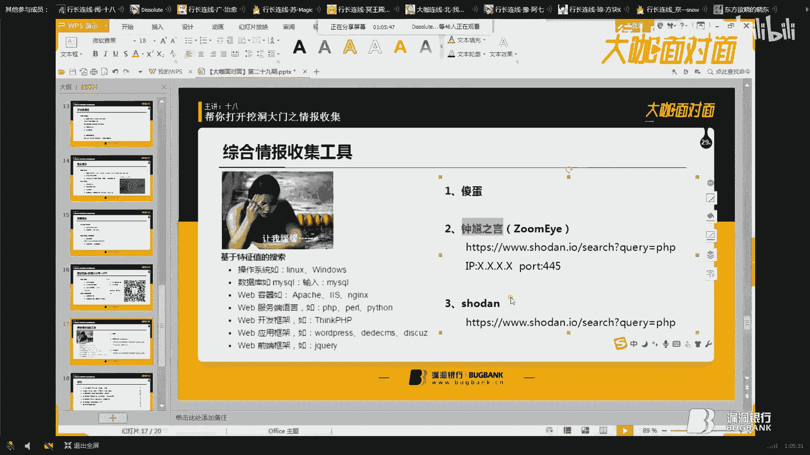
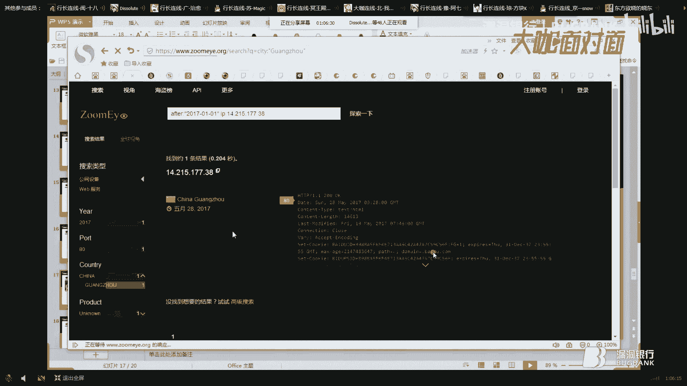

# 课程P1：帮你打开挖洞大门之情报收集 🕵️♂️

在本节课中，我们将学习渗透测试中至关重要的一步：情报收集。我们将探讨为什么需要信息收集、具体收集哪些内容、以及如何有效地进行收集。掌握这些技能，能帮助你更深入地理解目标，从而发现更有价值的漏洞。

## 为什么要做信息收集？🤔

上一节我们介绍了课程概述，本节中我们来看看进行信息收集的根本原因。许多安全从业者常抱怨漏洞越来越难挖掘，无论是在SRC（安全应急响应中心）还是授权测试中。这通常是因为测试方法过于单一。

例如，观察乌云镜像等漏洞平台的历史记录，会发现许多高危漏洞并非出现在目标主站，而是存在于其**子域名**、旁站或特定**端口服务**中。如果不进行全面的信息收集，这些攻击面很容易被忽略。

此外，大型站点的后台管理入口往往隐藏得很深，可能位于不常见的子域名下，或通过非常规端口访问。仅对主站进行常规扫描很难发现这些路径。

真正能直接获取权限的漏洞（如SQL注入、文件上传）在主站上已非常罕见。信息收集就如同游戏中的“猥琐发育，别浪”，它让你充分了解目标，为后续的深度测试打下坚实基础。

## 信息收集包含哪些内容？📋

了解了“为什么”之后，我们来看看“做什么”。情报收集涵盖多个方面，以下是核心内容列表：

*   **Whois信息**：查询域名的注册人、联系方式、DNS服务器等。
*   **IP信息**：包括旁站、C段、真实IP、端口、服务及中间件。
*   **子域名信息**：目标的所有子域名。
*   **目录信息**：网站的敏感目录、文件及使用的CMS（内容管理系统）。
*   **备案信息**：企业相关资料、DNS解析记录、历史漏洞。
*   **信息泄露**：如GitHub源码泄露、SVN泄露、配置文件泄露等。
*   **其他入口**：微信公众号、移动APP等。

其中，前四项是常见关注点，后几项同样重要却常被忽视。

## 如何收集信息？🔧


接下来，我们进入核心环节，学习各项内容的具体操作方法。


### 1. 收集Whois信息

Whois信息能帮助我们了解目标的基本情况，甚至为社工（社会工程学）提供线索。

**操作方法**：
*   使用在线Whois查询网站。
*   在Kali Linux中使用 `whois` 命令：`whois example.com`
*   关注点：注册人姓名、手机号、邮箱、QQ号等。这些信息可能用于后续的社工攻击。

### 2. 收集IP信息

IP信息是信息收集的重中之重，它直接关联到目标的网络资产。

**关注点与操作方法**：

*   **旁站**：与目标网站在同一IP上的其他网站。可使用K8等工具或在线平台查询。
    *   **意义**：主站防护严密时，旁站可能成为薄弱点。
*   **C段**：与目标IP在同一C类网络地址段的其他服务器。例如，`192.168.1.1` 和 `192.168.1.100` 属于同一C段。
    *   **意义**：在内网渗透中，拿下一台C段服务器可能有助于横向移动。
*   **真实IP**：绕过CDN（内容分发网络）找到服务器的原始IP。
    *   **判断CDN**：使用 `ping` 命令或多地ping工具（如 `www.itdog.cn`），若返回多个不同IP，则很可能使用了CDN。
    *   **绕过CDN方法**：查询子域名解析、查询历史DNS记录、使用国外DNS解析、利用网站泄露信息（如phpinfo）等。
*   **端口信息**：探测目标开放了哪些端口及其运行的服务。
    *   **意义**：这是发现漏洞的关键途径。例如，可能存在未授权访问、弱口令或存在已知漏洞的服务版本。
    *   **常用工具**：Nmap。一个实用的命令示例如下：
        ```bash
        nmap -sV -O -Pn --script=vuln <目标IP> -oN C:\result.txt
        ```
        *   `-sV`: 探测服务版本。
        *   `-O`: 探测操作系统。
        *   `-Pn`: 跳过主机发现（不ping），用于对付禁ping的目标。
        *   `--script=vuln`: 使用漏洞检测脚本。
*   **服务与中间件**：识别运行在端口上的具体服务（如Apache, Nginx, Tomcat）及其版本。
    *   **意义**：根据版本号搜索公开漏洞（Exploit），尝试利用。例如，一个旧版本的Tomcat管理后台可能存在默认口令。

### 3. 收集子域名信息

子域名是扩大攻击面的主要方式。

**常用方法**：
*   **字典爆破**：使用工具如Layer子域名挖掘机，通过内置或自定义字典进行猜测。
*   **爬虫提取**：使用Burp Suite的爬虫功能。将目标站点添加到Scope（作用域），使用爬虫爬取，可以从请求和响应中提取出相关的子域名链接。
*   **利用漏洞**：如DNS域传送漏洞，配置不当的DNS服务器可能泄露所有子域名记录。在Kali中可使用 `dig` 命令测试：`dig axfr @<dns-server> <domain>`。

### 4. 收集目录信息

寻找网站的隐藏目录和文件。

**常用方法**：
*   **字典爆破**：使用DirBuster、御剑等工具，通过状态码（200, 302, 403, 404）判断目录/文件是否存在。
*   **爬虫提取**：同子域名收集，利用Burp爬虫发现链接。
*   **分析 `robots.txt` 文件**：该文件通常会列出不希望被爬取的敏感目录，这反而为我们提供了重要线索。
*   **CMS识别**：通过特定文件、目录或HTTP头信息识别网站使用的CMS（如WordPress, Discuz!）。识别后，可针对性搜索该CMS的历史漏洞或进行白盒审计。

### 5. 其他信息收集



*   **备案信息与企业资料**：通过 `www.qichacha.com` 等网站查询企业信息，获取联系人、邮箱等，可能用于社工。
*   **历史漏洞**：在乌云镜像、CNVD等平台搜索目标企业名称，寻找可能未修复的旧漏洞。
*   **信息泄露**：
    *   **GitHub源码泄露**：在GitHub搜索目标公司名、项目名，可能发现泄露的源码、配置文件和密钥。
    *   **SVN/Git泄露**：网站目录下可能存在 `.svn` 或 `.git` 文件夹，导致源码泄露。
    *   **备份文件泄露**：如 `www.zip`, `database.sql` 等。
    *   **Rsync未授权访问**：端口873上的Rsync服务若配置不当，可未授权访问并下载文件。使用命令 `rsync <目标IP>::` 列出模块。
*   **微信公众号/APP**：当Web端无从下手时，可以测试这些入口。抓包方法与Web类似，需在手机设置代理并安装Burp的CA证书以抓取HTTPS流量。



## 综合信息收集工具 🧰

除了手动和专项工具，还有一些自动化程度较高的综合工具。


以下是几款推荐工具：
*   **傻蛋 (`Shad0w`)**：国产自动化扫描器，输入域名或IP即可进行多项信息收集和漏洞扫描。
*   **钟馗之眼 (`ZoomEye`)**：网络空间搜索引擎，可搜索特定组件、服务、端口等资产。
*   **Shodan**：著名的物联网设备搜索引擎，功能类似钟馗之眼，侧重于服务器、摄像头等设备。

这些工具能快速梳理目标资产，但深度测试仍需结合手动分析。

## 总结 📝

本节课中我们一起学习了渗透测试中情报收集的完整框架。我们首先探讨了信息收集对于发现高质量漏洞的必要性。接着，我们详细列出了需要收集的各类信息，包括Whois、IP、子域名、目录等。最后，我们学习了每一项的具体操作方法、常用工具和命令。

信息收集的方式多种多样，其深度和广度直接决定了后续漏洞挖掘的成果。仅仅使用扫描器对主站进行浅层扫描，很难发现具有深度的漏洞。真正有技术含量的漏洞挖掘，往往建立在扎实、全面的信息收集工作之上。记住，“树业有专攻”，在安全领域，细致和耐心是成功的关键。


---
*注：本教程根据漏洞银行第29期大咖“十八”的分享内容整理而成，旨在为初学者提供清晰的学习路径。实际操作中请遵守法律法规，仅在授权范围内进行测试。*