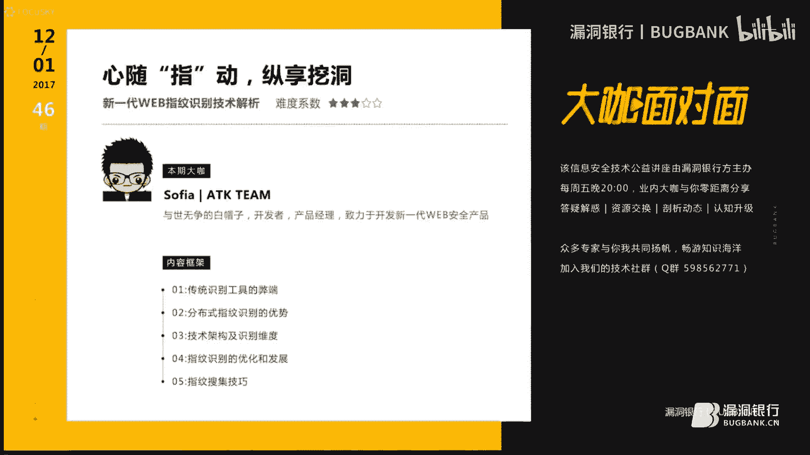
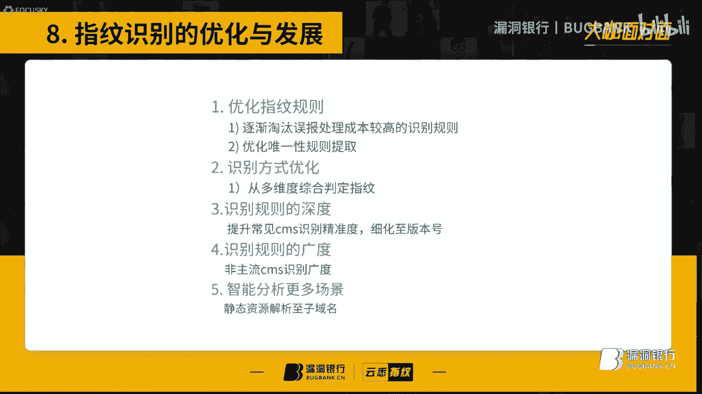
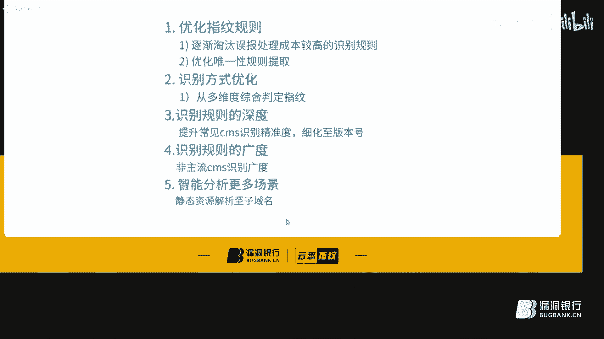
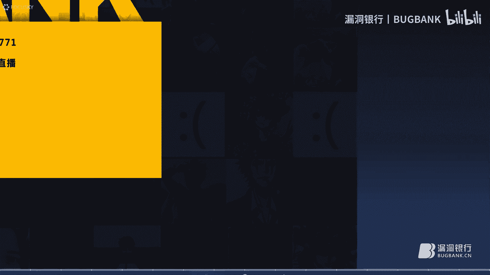
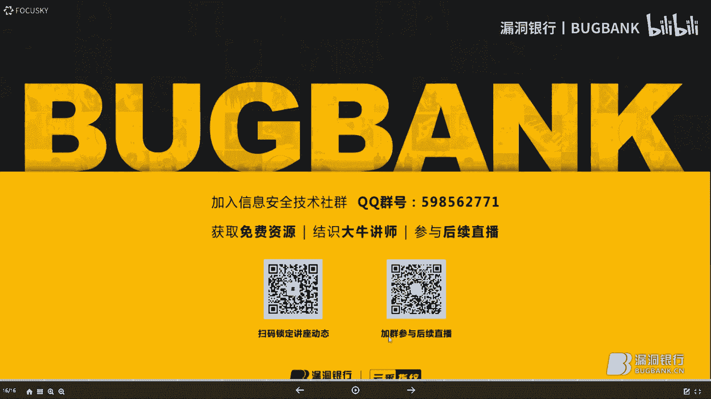
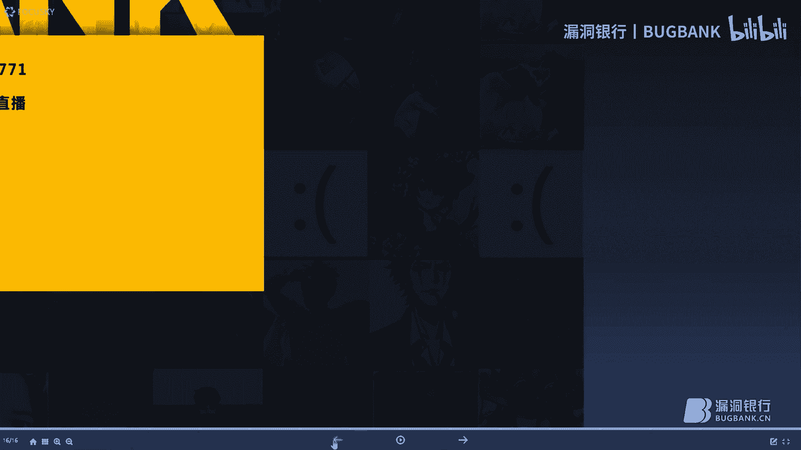

# P1：【录屏】心随“指”动，纵享挖洞-新一代WEB指纹识别远征之路——大咖Sofia分享 - 漏洞银行BUGBANK - BV1uZ4y1A73E

。Yeah。为为知识而存，因技而生。小伙伴们，大家晚上好，欢迎参加漏洞银行信息安全技术讲座大咖面对面。今晚是咖密的第46期，我是主持人年念。

今晚我们请到了ATK team的核心成员sofi大咖带来主题为心随指动纵想挖洞，新一代外b指纹识别远征之路的讲座。那本期直播分成三个环节，首先是sofiia的主题演讲。

接着行长问答环节是给大家答疑解惑的时间，最后是大咖赠书环节会选出一位最认真听讲的观众送出大咖精心挑选的一本社会工程安全体系中的人性漏洞。😊，另外，大咖影讲期间也给大家准备了一些云栖的平台邀请码。

机会多多，福利多多，不要错过。好，那下面就让我们欢迎大咖sofiia开始今晚的讲座吧。😊，啊。嗯，好的。嗯，首先呢非常嗯非常高兴能够受骆豆银行的邀请。

能够在这里今晚给大家带来我们的呃那个指纹识别的这么一个议题。呃，那么在开始之前呢，我想大概了解一下大家对于指纹识别呃，对于那些曾经做过指纹识别这么一个模块，或者说没有做过的，大家都比较关心的哪一。

如果说你做过的，那么你在在这个开发的过程当中遇到的瓶颈问题，或者说呃自己有没有考虑到，或者说解决不了的问题，大家都可以呃现在反馈一下。然后我在后面的影响当中呢，会给大家的重点的话去讲一下这块。

因为后面的话前端部分啊是相对来说比较构燥的。就是说。我大概来说。呃，少讲一些那些呃大家都懂的东西，尽量讲一下大家都比较关注的一些地方，好吧。嗯，大家有什么问题大概在。呃，因为比较有点延迟啊。

大概我等个10秒钟左右吧，20秒钟左右吧。如果说大家没有问题的话，我就开始下面了。呃，嗯下面的一个分享啊。大家有什么问题吗？对，今天的延迟可能会有点严重。嗯那然你可以继续了。嗯。

大家可能才听到开场白的部分嗯。我靠，这延迟起码得有个5分钟。啊，既然大家没有什么太大的问题的话。那么我下面的话就开始啊我按部就班的一个一个分享了，好吧。大家都没有什么问题是吧？好，那就开始好吧。

那你8你68。好。呃，下面的话就。给大家简单分享一下这个新一代外指纹识别的远程之路。呃，之所以叫远征，起名叫远征之呢。因为。

基于我们目前的一些成果和我们后面的一些发展方向的话，我们后面还是有相当多的一份工作的话，是还需要继续去努力的。所以说相对来说的话，呃，这个我指纹识别这个一句话呃和发展的话。

后面也是个任重道远的一个一个一个过程吧。呃，那么。首先呢给大家自我介绍一下，那么我的ID呢是so菲亚，大家应该。很少听过这个ID啊，因为会因为。以前做安全的时候也算是一事无折吧。

基本上没有在任何平台活跃过。然后目前的话主要是做云系的产品经营与开发，同时呢也是。呃，一个白帽子，虽然说目前已经很少的做这一块了。那么下面的话是我们云戏平台的地址，3W点0C点CN。

大家有兴趣的话可以去。体验一下我们最新的功能。那么下面的话是一个个人的博客啊，大家有兴趣的话可以看一下。呃，那么下面的话就继续开始我们那个个一。呃，首先呢。既然讲到我们这个。嗯。

分布式外b指纹识别啊是基于在线的。那么我们就要提到我们传统的一些呃web指纹识别的一些工具。嗯，我们传统的一个一些那个个人识别工具啊，主要是有这么几块问题。首先第一点呢。

这些传统的一些或者说网站扫描或者指纹识别，或者说查询网站信息。うん。这些工具大部分都出于呃白帽子或者开发者的个人爱好。所以说。他是没有一个完整的呃或者完善的一个更新机制。呃，纯粹是注意个人兴趣所开发。

那么出于这个呃。这个个人工具更新优化问题的。那么它既然没有一个很完善的更新流程，那么我们就需要自己去完善这个工具。那么我们去完善的工具呢，很可能有一工具下来，那么可能需要去优化它的字典，优化它的规子。

或者说搜集呃各方面的一个接口。呃，那么这个工具的话，我们可能大部分时间去想要这个工用这个工具之前，那么可能前期得投入大量的精力去搜集这个规则。呃，那么第三点呢就是说。呃，这就是核心的。

就是说你你下载的一些工具，那么大多数可能来源于论坛或者其他渠道。呃，那么你很难确保这个软件没有后门。即是说。你觉得你有能力去分析他这个后门，但是说你需要。呃，花大量的时间与精力去分析。呃。

举个最简单的例子吧，就是说。呃，在座的各位有没有谁能够百分之百的认为我下在这个我的工具包里面，没有一个是有没有一个有后门。我敢说，没有大多数人都没有这个这个把握。包括之前我们所。

了解到这个b suite这个工具的话，也是存在门一版门，也是存在后门的。所以说目前的后门这个在安全界这个工具。存在的信节还是相对来说比较普遍的啊。所以说这种情况下。很难避免。其实说你觉得你这个。

即使他又后门，只是相只是瞬间触发了一下。那么那么。这就触发了一下，很可能你的呃比较重要的资料了，可能就被偷走了。当然这些都只是个例子啊。呃。那么继续。那么说到那个在线的指纹识别的话。

我们目前的架构啊主要是分布式识分布式的指纹识别。那么分布式指纹识别的话，首先从技术架构层面的话，他们有以下的三个优点，但然是脱离指纹柜子的这个负盖量。呃，来考虑的。首先第一点呃。

他一定程度的能够解决W主单问题。因为是分布式，我们所有的请求都可以均分到每台分布式集群的节点上面去请求。啊，但是他也能只能说。一定程度的去阻的。因为不同的wa它的拦截阈值是不同的。呃。

有可能有的比如wif呃可以支持一分钟1000次星球，有的waf可能11分钟60次星球，它就是拦截掉。所以说多能使它的一个架口不一定能够百分之百的解决waf拦截问题。但是说只能说一定程度的说。

一定程度能够减缓这个问题的发生概率。呃，那么第二点呢呃就是说既然说它是分布式，那么它一定是可以实现均为覆载的，而且它是具有代背功能。也就是说任何一台机器宕机了，或者说网络出现问题。

它是不影响整个系统的正常运行的。那么第三点的话就是说。呃嗯它是能够提升整个系统的一个计算能力和和整体的并发能力。而且这个并发是在能够减缓呃wi夫拦截的问题的前提下。呃，目前的话我们大概能支持一1秒钟。

大概能发起00条请求吧。呃，大概是这么一个数据。嗯，那么下面的话给大家。看一下。我们目前的一些呃一些数据吧。呃，我看到有部分那个同学说，今晚的整个视别和挖洞有哪些联系？呃，那么说到这一点的话。

就是说我们挖洞。那么前期最重要的是一点是什么呢？从前期最重要的一点是呃，钱报搜集。那么情报搜集包括哪些方面呢？第一是我们的呃域名资产。对吧比如说这个域名是所所有人他的什么什么IP。这个用的什么应用。

这个应用是什么呃什么CMS开发的，还有什么版本，这个版本会不会会不会有什么漏洞？对吧这些都是我们渗透前期所必备的一些呃情报数据。那么指纹识别在这一块的话也是相对来说比较重要的。

也就是说这个网站我渗透了一天两天都没有任何头绪，也许你会用指纹识别发现一下。仅仅是一个开源程序所开发的，而且这个开源程序在网上有爆发了很多漏洞。那么这个时候我们就可以。对吧呃。

很轻易的去找到那些呃利用点。呃，直接可以get税啊，或者说呃拉到权限。嗯。这一点的话就是请解答大家这个为什么要呃分享这个指纹识别，为什么把它看的那么重要？

这就是我们前那个情况搜集前期啊必须要做的一个工作。呃，那么继续我们的一节啊，那么下面呢给大家看一组数据。这个数据的话是我们目前所有的数据。呃，汇总起来了。呃，汇总起来的话。

就是说这些是我们在所有数据中出现频率最高的一些呃CMS，其中最高的是wordpress呃。那个芝末ABCMS大家可以简单看一下，这些也基本上我们是比较常见的一些CMS。

而且在各大漏洞平台也经常能看到这些漏这些CMS的漏洞身影。所以说呃这点这些的话也是相对来说比较重要的一些信息。啊，针对第一个为什么是wordpress最多呢？可能说目前我们用户大多数都是白帽子。

而且大多数白帽子都有个人模坑。所以说很多跟那个。呃，很多人啊就先开始测自己博客，或者测他人博客。这就是为什么是wordpress第一的。呃，一个原因啊，当然另一方面。

word prince它的使终占有率也是比较高的。呃，那么下面下面那个进由正题给大家分享一下我们的技术架构。嗯，这个技术架构的话也算是我们呃我们的指纹识别一个。核心技术流吧。呃。

给大家先给大家介绍一下啊。呃，首先呢呃。获取用户的输入。比如说用户输为网址，对吧？然后我们呢主控端接收到这个网址，当然这中间忽略了一个环节，就是应用层的环节。呃，当然最终都是传输到这个主控灯。

主工单接收到网址之后呢，它会首先从款存库里面去读取我们的规则。啊，目们些目前呢我们的规则的话是进行去切调。取道规则之后，我们会呃进行给它初始化。初始化主要包含四个方面。

那么首先呢是初始化规则并分类指内存。这里分类啊是分为几种。呃，几种规则类型，比如说是手柄首首页UIU的内容。呃，某个U压类的或者说某个文件的MD5。呃，或者说碰在某个UIU是不存在，这个的话是分类。

然后整合合并请求。整理合并。并请求规则。那么主要呢就是说。这些所有的规则它都是由每一个某每一个请求所构成的。但是很可能。2个CMS指纹，它所请求的UIU是相同的。这时候的话我们没必要去请求两次去识别它。

这时候我们就只需要进行一次请求去判断出它的相应内容，或者说基成他。他的MD5，那么就直接可以判断出。它是这个第1个CMS还是第2个CMS所以一个星球就可以完成多个CMS的识别。

这点的话也是呃整个识别效率优化的一个。相对比较重要的一个点。呃，那么第二点的话就是初始化探测。初化探测的话，它的主要目的啊是解决豁面所遇到的一些误保场景。

那么第一点就是说我们要判断出它是否存在是否能不能打开。如果不能打开，那么你还剩下来几件再请求，就没必要再请求了，纯粹是浪费资源，而且是比较浪费时间了。那么还有一点呢。

就是说记录不存在页面和wa拦截特征的。挖妇蓝解液的特征。就是说很可能你这个不存在的页面，它是个200，它并不是404转的码。而后面请求后面分发到节点的时候请求。

那么你没办法识别它到底是存在的页面还是不存在页面。所以这时候我们要把所以不存在页面的特征和wa蓝极的特征一并给它提交到分布式那个节点上面去。这样的话，后面所有节点在请求的时候。

就一个就有一个对照点来判断这个小是合理的还是不合理的。呃，那么下面呢就是说这些规则我分好类了，也合并也合并了请求。那么就需要把这些所有的请求发送到这个集群的各个节点。呃。

这个各界段的话是通过一个相应队列服务器来维持它的一个通信以及数据传输。呃，那么最终我们整理整合过的一些规则，就是在右边，大家可以看一下。呃。可能看不清楚啊。稍等一下，我看有没有更新。哦。

这里给大家看下这个。呃，这丽给大家看一下啊。比如说支持1个URL，那么。那么这里。会判断出它这个哑牙响应，如果是这个MD5，那么就是我的po3。8。如果说是这个MD，那么它就是我的pro3。0。

那么这个的话这个一条就是。合并过的一条规则。那么每台机器啊，这上面每台机器，那么会平均。分分配这个2000呃3000多个请求吧。那么每台机器去独立的去请求这个结果，并且对比主工单传过去的不存的页面特征。

wa部特征。那么。就会进行单独的运算。比如说第一台第一台请求的是robos点天，第二台是fe点chm。那么每台机器请求不一样的结果。那么最终呢每台机器返回不一样的结果。

就如说第一台机器请求结果的foralse，比如说这个规则不成立，第二条不成立，第三条不成立。那么只是第四条或者第五条，那么它都成立，那么全部返回给主控端。呃，那么这几个节点他。呃。

不单单是但是你的请求那么简单。呃，比如说我们首先第一点，他肯定要对着三盏肉务进去就。然后就是刚才所说的拦截页，通过主工端看见的值做判断，就这里不存在页面，它的值与这里所请求的值所对比，不果是一样的。

那么它就是不存的页面。返回统一的东西，对吧？这里的话就可以判断出，但不管它响应是200还是什么东西，它就是不正常页面。呃，那么第三点的话就是说判断出那些无法预料的场景。也就是说我反我响应200。

而且它这个不存在特征，还和主工单传过去特征不一样。那么这个的话就是在我们的预料之外。这些对于这些意料之外的东西啊，我们后面会详谈。呃，我们会做一个系统化的给的一个过滤。尽可能把它误化率啊呃极大的降低。

呃，那么下面的话就是说每台机每台机器处理的结果。那么如果说它是成立的。带回这么一个结果，IDlemb和它。它的规则名称。那。第四点呢就是说。汇集这些结果。给你对特殊值特回特殊返回值啊做处理。

比如说连连续超时，我连续收到。哦。10次各个节点传过来，连续都是10次，都是超时。那么这个的话就是不需要再继续请求了，他网站已经崩了，或者说这时候已经有wifi拦截给你纠弃到这个请求了。

对吧那么这种求证的时候你继续再请求是没有意义的，这时候就立即给他断掉，断掉请求到这里就结束了，全面获取到哪些就是哪些了。啊，那么最后呢把这个结果汇集返回给用户的电脑。呃，最后呢把这个。获取到这个结果。

放你放入我们的混凝物。发入缓存功能最重要的目的啊是第一，为了优化我们后期的一个识别精准率。另一方面的话识别。提升我们的识别效率。比如说记录这个用这个域米查了多长时间？呃，或者说这个玉米为什么没有查出来。

它查出来的指纹是不是对的，是不是存在误报。这个的话都是我们需要后期基于这些数据去分析处理的。呃，说到这里啊，可能大家可能觉得有点枯燥了。给大家简单演示一下这个数据的发送和。和处理吧，给大家简单看一下。

呃。稍等啊。那这几台机器就是我们分布式机的其中的9台机器。那么我们可以看到每台机器都在处理请求，我们可以简单看几条。这时要说明我们有人在正在用我们的呃游些指纹。

比如说这里receive receive task。那么resive taskask那么taskCC的返回结果 force说明这条。说明某一条那个规则，他处理的结果是放式，所以不成立。直到某一条成立了。

他才会发回给主工的。比如说我们找一下看有没有成功的例子。那么您是。临时给大家查一个好了。呃，临是给他查一下。给他直观的看一下最终效果吧。比如说。在那不了。😔，呃。没buuff。那么我现在更新。

那么这个各个节点将会开始他们的任务。我这里真的请求。啊，这里各个节点已经收到收到请求了。比说我们这里这里看到他们就5。这说明正在请求MD5的。样规则。前面有整个UI1。看有没有出结果？我已经说解过了。

我的play306。可以啊。啊，在这里看到没有？这台机器它处理结果的返回的是我的pro3。0。那么这个时候的话，我们会呃如果呢把这几果汇集，然后传输到前单句。这样的话就是直观的一个大概的流程。呃。

针对这一块啊，大家有什么不明白不明白的地方。大家可以提一下，虽然说虽然说有点延迟，但是后面讲的话会。后面统一了统一给大家那个一个解答吧。那么这个的话就基本的呃数据演示。那么进做下一个辩合你。

这个环节的话就是说我们刚才讲了这些数据流和它的一个技术架构。那么最终我们要。还原到他到底请求的是什么东西，为什么要判断出他就是这个CMS。那么这几点啊大家应该都是呃之前有过一定了解的。呃。

也是大家可能都做过的这些东西。那么在这里啊。呃，再给大家讲一遍。呃，也算是给大家呃温和一下，或者说有些地方大家可能没考虑到，呃，大家可以。稍微了解一下。那么首先第一点。最常见的一个服务器漏了没有关系啊。

我我每台服务器发出的请求，你都可以从日志里面可以看到，这个无所谓了。呃，首先啊那个首页特征就是说识别你首页源码里面有没有某个关键词，这是最简单的。比如说首页里面有没有这么一个关键词，如果有。

它就是大案CMS。啊，这个大家很容易理解，但是这里会容易出现入报的一个点，就是我们的关键词选取。之所以这个规则会会为被我们所采用，是因为它有一个tyle属性。

sstaryle display now这个的话是很少出现在首页里面的。呃，一般呃如果说他有个AP线，如果说他借次领导的话。有可能他是被黑猫惯了，有可能他就是一个。呃，那个版权吧。

事实证明这个就是打开系统的一个版权。在这里最容易出现的一个误化，就是首页首页里面。很可能某个人发表了一篇文章，这些文章里面就说到了这个关键词，那么这就会导致误报。这很简单一个道理啊。

那么第二个的话就是通过put之的兼构的协议去判断出它的服务器。夫妻版本。他的服习类型。那么我们知道服务器一般它都可以伪造自己的一个服务器信息。比如说呃eng，它可以伪造账RS。

那么如果说我们通过一些非常见的一些协议的话，就可以。呃，基本上可以判断出他是不是一个。真实的一个呃缝析类型。比如说我们通过put血液判断出它响应是405note not，很可能它就是eng。

他这个版本范围。那么第三点的话就是说。黑的特征就是一个请求压要判断出他所返回的响应黑的词里面。有没有这么一些特征，也是比较简单的。呃，那么我们可以从以下几个地方。

ACookie eggs powered by simple eggs copyright said cookies。这些都是简单易懂的，有没有没有什么可以讲的地方。

这地方呃相对来说它的一个精准力还算可以。呃，比如说搜个ge，那么它就是个gebo。那么。是第四点呢，就是说。最我们最常见的一个特征就是判断URR响应里面面有没有特定的关键词。

就是请求这个U1看看响应里面有没有呃这个。呃，那个account manager如果是他就是K。这些规子啊虽然讲起来很简单，但是有很。如果说你想把自己的指纹识别做到。非常精准呃，非常完善的话。

那么这些指纹规则优化都是一些细节。都是一些非常关键的点。如果说这里你优化的不好，那么后后期很可能该识别的也没识别到。没有涉及到的你物包一堆。对吧这些都是很常见的一些场景。

那么第五点的话就是特定图片的UIUM6值。仅求这个UIL判断出它这个M6值，如果是它就是配接的命，这个很简单。现在市面上网上很多流传的。呃，规则大部分都是这些。没有什么太大问题，但是说。呃。

网上所流程的那些很可能。是不能用的。具体为什么不能用呢？很能MD我值是不对的。呃，那么到数候第二个是404页面，就是说不存在页面，我们也可以把它作为一个特征依据。

比如说不存在页面里面出现了not fun了think，那么它很可能它就是think。一般啊一般。呃，这里面很少会产生误报，因为这些404页面基本上都是开发商或者CMS开发厂商。所有遗留下来的。

如果说我后期改了。我为什么要？或者改了，我不可能把一个其他CMS改成这个CMS。对吧我我如果说把它改成自己的名字，你自己名字也不是1个CMS名称呀，对吧？那么最后一点呢就摇压状态码。

这一点的话后期啊基本上。这个规则基本后期可淘汰掉了。欧包就非常高，而且处理成本非常高。就是判断出这个压要小于1800，但是。刚才所提到的就是说可能很可能不存在页面，它也返回阿0，很常见。很常见。

我给你看一下，给大家看一下简单例子啊。就这个吧。这应该可以看到了，我现就这个地址传到响应了。我相信做过我相信做过扫描器的。呃，做过网站包破的应该都会遇到过这种情况。这个logo点加F。

800但实际上它确实不存在的。这个。偷头一档，很简单，没有什么问题。啊，那么下面啊。嗯，那么下面的话就是说既然基于这么多规则，那么我们必须有一个。呃，那个采纳的优先顺序什么样的规则。

我们是可以采用什么样的规则，我们是尽量避免去用它，而且它用了之后后面会出现大量的问题。首先第一点，MD5值收取我们是我们优先所考虑的一点。呃，电言所承在的物报啊，主要就是来源于我们会我们用了那些。

通用插件的图片MD5或者说JSMD5。因为这些。去UIU在各栏CMS里面都会出现。这样的话会打658。这样的话就是1要11关键词。判看如果这个请求里面有没有特定支符。这个的话相对来说嗯成本比较低。

而且比较容易采集这些规则。嗯，那么最重要的一点就是说我们这个。看断多UUUIU里面的特征，我们选用什么样的特征？比如说这个这个接锁打开了，有这么多代码，我到底选哪一个地方作为我们的特征比较合适。

那么后面的话我给大家讲一下。最后一个就是首页政策，这个投报率啊是。啊，到时候第二个是UR状态码，这个不存在页面。呃，和这个所页面它会返回200。首先政则的话，它也是很可能他。首页里面发布了一篇文章。

文章里面就有这个关键词，很常见的。比如说。我去搜一个查一个程序员的博。程序员里面很可能他就提到了这个CMS。那么你这个规则正好就是。呃，他文章里所提到的这么一段段话，那么这样就会导致欧报。

这种情况我们尽可能去避免使用这种规则。所然说这种规则有个最大的特点，就是说节省资源，一个请求。就可以搞定，就是说请求一下首页，我可以识别出各种关键词。啊，最大的优点呢就是快。呃，最大的缺点呢就用于无保。

那么第二点呢就是规则的唯一性。比如说我。不管是我的指什么，我这个URL dis我必须具有唯一性。除非你是判断判断他的M9值，大家判断MD5值啊，它也是不靠谱的。有可能你这EIU它是个通用的插件。对吧。

比如说这个semsreadmi点 taxi，如果说里面包含不0的1。0，它就是某某某规则。那么这个情况的话肯定是不可取的。因为呃各种瑞单里瑞d里面也可能都有万涉。那么第二个就是说判断出他这个验证码地址。

他这个地址看上去来说呃是不是太常见。再说。很可能其他网站查也有这个规则，那这个压压很正常的。而且那个装电码也不一定对呀。如果说刚才那个我讲，他进戚这个地址，他也是200。呃，那么。这个经营务嗯我不住。

这就是首页职责了。看那首页里面有这个东西，它就是某某CS。这个的话就是之前所说的，我把可能我可能这个特征不在文章里面写的。我其他网站里面GGS建一个we部root也很正常。

对吧这个规则是直接在我们指纹库里面的，后来的话发现给他提取出来不要他。呃，那么第四点就是之前所说的一个通用插件，在所有CMS大部分CMSCMS里面都会有。比如说举个例子啊。

这就是d皮时间选择器的一个场景。如果说判断这GS里面有d皮，那么它就是嘛？啊可能大多数网站里面它都有这么一个场景。那么就会打打着报。给他举个相对来说比较合理的规则，比如说。

请觉这个戒子里面通过戒子面一放式，如果他就是。巨好用CMS。这规则看上去不是太严谨。但是因为function式可能不存在页面，他也返回这个原要not found，对吧？但是这个人来说的话。嗯。

相对比较呃。破例吧就是说它这个句号用MG4大小是比较很罕见的。这就是为什么采用它的原因。因为有个CMS大家最好用。那时候我差点不太敢相信，竟然还有个。怎么才叫这个名？句号用。看到吗？真的的最好用。

那么那个下面呢。在这里啊给大家再讲一点，就是说。我去判断，如果说某一个网站的GS。这个地址我是可信的。那么我们不要判断出它这个UA1是不是200，我们可以。呃，换一种方式判断出这个阶词里面有方这个词。

因为大部分如果说它是个正向阶S，大部分它都有方这个字态，对吧？所以这个这个规则的它的精准度就比装载码判断来说的话就精准多了。呃，那么下面第三一点呢，就是关键词的精准性。呃，这一点的话大家也比较容易理解。

就是。选取你的。特征规则是什么？所以我们尽可能选一个与CMS名行相关的关键词，比如这里的句号用。tyle对吧？那么尽可能就选择非常贵的一些走站。那么。比如说啊我们首页如果出现这个关键词。

如果说把这个进过号问号杠杠这个注是不去掉，那么它就是个常规字务台。我在我在某个地方我定义这个东西很正常呀。对吧也许说。呃，我定一个。t难み。变量名就叫APP，我名字就叫CCS也很正常。对吧。

但是我这里采用的它的规则是前面加个注释符，因为它很可能是一个版权。加个注视符，再加个APP在等于thisMS，它很可能隐藏在网页源码里面，它就作为一个版权所存在的。那么。111111里面的话。

我们尽可能如果说里面有版权，我们尽可能不要用发公式，对吧？比如说这里面有它的官网地址，或者说他U21里面有它的本身呃CMS的名称。比如说这个开ed里面，这节词里面有这个它官方的网址。

那么他这个可信度的确能高了。我相信大家都。比较好理解这些这一点。啊，那们下面啊下面呢给大家讲一下奇他的场景。嗯，这也是我们在做指纹识别中。啊，花了大量精力去解决的一个问题。

这个问题呢也是我们指纹做指纹识别中呃最常见的一个问题，也是我们需要核心去解决的问题。就是诬报。那么导致污报的话，会分很多种场景。比如说前面所说的不存单页面返为200，就是一种。就是一种五保场景。

那么啊那么分类型一个月讲。啊，大家比较容易理解的地方，我就稍微提一点。那么第一点呢，就是说。不存在页面就跳转页面，它分为多种跳转。301302。嗯，mate标签里面的调转而f调转对吧？或者解释调转。

直接跳转我们还要分场景，你这个跳转。如果说是301301，我们要不要跟？如果说他是这一次跳转，它是不是一个中转业，还是说他网页的正常跳转，对吧？这些我们都需要去识别它。第二个。

就是之前讲过分层页面和200这个。都能理解，不讲了。第三个全部页面返还给你。并且返回你11精的内容。呃，就是说这个很简单，我请求这个地址SCDCDGS我网页我网页里面返回200，并且我。

他应的范围是这个U也不存在not的法律。如果这个UIL里的请求关键词。呃，识别关键词就是STCMS，那么你这个就会导导致欧报。因为你响应里面确实有这个关键词，但是你这个响应并不对。

你这个是一个非常贵的效应。那么第四点就是前面所说的一个跳转或者中转拦一拦截页，这是大概一个云锁吧，云锁的一个拦截页。那么你频率如果过高，它会返回一个。呃，杰是校长。

并且跳转到一个带参数的带Y和参数的一个地址。那么这时候啊他会给你给你的一个cookie，加上一个值。这个时候我们需要渲染这个JS。把它cookie值带上，那么我们直接获取到它目标页源码。这样的话。

我们的目标页源码并不是这个解色，而是它的真实的一个地址。这是也是我们需要解住的一个地方。当然这也是我们解决wa拦截的一个呃一个渠道。但是覆盖面并不是很广，因为并不是所有的wa都会给你这么一个页面。

有的可能直接求集掉你的请求。呃，那么第五点就是不存的页面200。这一点没有问题，但是他给你返回固定内容，就是说你打开什么样的网页，复制那页面，他都给你返回首页内容。如果说他就是一个诚序博客。

他任何页面都可以返回首页，首页里面还有一大堆代码。呃，代码的代码对吧？那么这这些代码里面很可能就有我的关键词，这样的话也会导致误报打气特别严重。那么第六点呢，就是。不同的后缀，它返回不一样的播速。

给大家解演示几个例子。这种情况的话是。呃，给大家看一下上面一个任意页面发回固定内容。这些表演都是我们在处理污报过程当中所遇到的一些问题。拿出来给大家看一下。这个。这场景我相信如果做过这纹识别的话。

应该会遇到这些东西。比如说这类随便这个其实200。8点钟。所有不存在页面都给你返回这么一个东西。但有的文站它是直接个返回一个。呃，固定内容。随便说。返返回阿里零。I日等这个东西。所有页面都这样。

那么还有呢？而且是不懂合这给你反不一样的东西。Yeah。所以说这种这种情况下，我们前面所说到的初始工端初始化不存在页面的特征就没法用了。因为不存能在不同的。不存的页面，它很贵样的东西。

你怎么去判断没有一个对比标准。根本没办法去对比了。比如说GS。摆回这个东西。呃，无法访问交的可那个超市，那么的范围JSCSS。随便说啊。不说。所有页面都给你发现这东西。他这个解释。嗯。没有闭盒。这定书。

或者全部CSS你看它全部返回这个东西。啊，不单单是CSS和JS之间，或者或者很多图片。哦，和GS或者3他的。返回呀都乱七八糟，你没办法预测它不存的页面是什么样的东西。而且还有很多不同部路下面的东西。

它范围不一样的。比如说有的。有的网站他艾特名下面。再返回40403，肯定没有权限。呃，其他的不存在页面，它返回给你乱七八糟的也是200。就是没那那一。那么下面呢就是说呃前面所提到的。响应是200。

但是他。是一个中转业中转跳转。和前面所提到的是一样的，给大家看一下。看到没有？它响应它其实是反回，它并不是302或者302跳整哪个T，而是通过个GS调转。我们要给大家看直接的返回源码。

那么这一页面返回首页内容，我来看一下。随便输啊随便输。这又回到首页了。对吧。这些乱七八糟的场景就是会导致我们无报。的一些因素。那么第七点就是刚才所提到不同目录下面，保护员的错。呃，综合以上这些几点。

我们会发现问题的所在主要就在于。不同网站它出现的问题我们没办法控制，而且没办法预测它会。呃，什么样的东西会导致误报？那么。基于这些误报，我们有什么解决方法吧？呃，首先第一点就是前面所提到的。

虽然说这些奇葩场景有，而且很多，但是它。嗯，占占不了百分占不了那个所有正常网站的一半。比如说大部分网站它都是正常的。在奇葩网站里面。呃。以上上面所提到的场景实占比比较多的，但是大部文站它都是正常的。

所以说他就是说不同的页面，它基本上特征都一样的，这种场景是特别多的。所以说不责页面特征都一样的，管它404还是200，我只要在初始化探测一下，它不存在页面特征。后面分布的几点处理的时候。

对比一下这个特征。如果是它就是个不存在页面。如果不是，那么这个页面很可能就是正常的。对吧。那么第二点呢，就是初始化的时候，尽可能确认它网站到底是什么样的结构，是不知道不知道ERL是不是。

载回的东西都不一样。那么第三点的话，我们就。需要对这些场景进行处理。其实上面应该还有一点啊，第一个放在第一第一位。其实第一点就能解决大部分问题了。就是基于。就成页面的探测。那么这里的第一点。

首先你请求有1个URL，你得首先你得判断它响应是不是对的。你不能1个404页面，你你也去判断出它里面有没有呃相应值。那么首先我们要判断他他这个状态码是不是逾期了200或者304。

还有点不管是我们做扫描器，或者说呃这个识别304这个。返回特征码也是。作的依据也比较比较重要，也是容易被忽略的。它主要是表征着你服务器响应没有发展变化。呃，是一种节省国际资源的一种。啊，一种好吃吧。

那么第二点的话就是看断它文件的后缀。比如说刚才所呃所演示的你GS。返回你一堆东西，CSS也返回一堆东西，你打开图片也返回一堆东西，但是你可以前期预判一下你请求的货缀和你所响应的货缀，它类型是不是匹配。

你请求的CS它CSS你返回到底是不是CSS你请你GS再返回是不是这样的。你请求图片，它返回的设备的图片，还是还是说他返回的一个是HDL。对吧这些东西我们都是很容易去给它过滤掉的。那么第三层呢，如果说他。

前面这几种我都没法预料到它是什么样一种，它那个不这个就压响应，它到底是真实的还是。还是一个。呃，乱七八糟页面。对吧那时候我们就可以通过一个做一个错误错误模型。通过模块去识别它是不是呃一个中南页。

这里的话我们可以通过大量的一些特征记做简单的识别。比如说它里面有没有安全狗页面啊，或者云所谓的拦截呃页面的一些。代码呀对吧？这里的话我直接给他过掉。那么最后一层的话，如果说。经过以上四层对吧？

加上第一个wa呃，加上第一个初始化探测，总共是四层过滤。如果说这几层全部都是。没法预测这页面到底返回来是不是预期的呃，是不是一个正常正常页面。那么这一层的话。

我们可以嗯通过基学习模型去判断出它这个响应它底属于什么性质呢？它是一个中转页，还是拦截页，还说它是一个提示，对吧？这些都是可以通过我们大量的呃作业样本去训练呃，来达到这个效果。那么最后一点呢。

就是说结合以上12345包含第一点啊。啊，55层的过滤基本上可以实现95%的以上的无0场景。呃，目前为止啊，我们呃我们目前直播水平啊基本上没有发现什么误报。即使是那些误报，也是信有可原的，而且是。

无法避脸的一些的一些一些场景。当然说也有一些我不啊。当然如果说有些无报，你觉得它是无报，但是我们没有发现，那么大家可以提出来。直接打扰你好吧。Yes。那么。稍等一下，我看一下大。有什么反馈？对呀。

现在我们数据我们的一个样本是已经读不到了，已经呃运用到了英人工智能。当然对于指纹识别这一块啊，在人工智能这一块应用啊并不是很多，主要是我们后期可以用来。呃，由人工智能呢去自动化提取指纹。

这个的话是活期的话也是一个方向。好，我们继续啊继续我们第八点就是我们智纹识别的优化与发展方向。呃。这这一点的话是基于以上前面所讲的一些总结吧。呃，那么第一点的话，我们需要去优化这种规则，这是毋庸置疑的。

我们都西要去做的。那么怎么去优化？那么第一点我们去。淘汰掉处理成本特别高的一些规则。啊，举个例子。我们去去掉那些。识别手页内容，但是无保率特别高的那些特点。比如说VI web rootot等于多少。

那些无保率最高了。那么第二点就是微信呃优化微信规则的体恤。就说你要确保你这个ER要。它是很少在其他CMS里面出现的，但是我们没法百分之百确定。但是我们。呃，从我们呃IRT从业者或者说互联网白帽子从业者。

我们有对技术有一种天生的敏感性，能知道这URR是不是在其他CMS也是容易出现的。这点我们是可以人工的去。嗯，判断出来的。呃，那么第二点啊就是识别方式。呃，我目前呃可能大多数候都是基于个娱乐URL。

就看看它是不是匹配。如果匹配，它就是。呃，这个CMS呃，当然这样这种情况，就综合前面所讲的几块都是容易产生误报的。呃，所以说我们后面的一些方向就是说我们需要通过多维度的去判断。

不能单判断这个GS里面这个GS响应是不是我们预期的，还要判断出其他的一些资源文件。比如说图片，因为这一点我们考虑到有些CMS它是基于其他CMS二次开发的。比如说很多C它都是基于thinkPAP所开发的。

而是开发的包装包装，它就是自己的东西了，对吧？虽然说我们可以识别出它是C个CPA，但是我们也需要进一步它是什么厂商。做二次开发的。因为很可能他二次开发的他就有漏洞。

也是呃值得我们后期呃渗透的时候啊需要去。呃，利用了一个。这个知识点。呃，那么第四点就是我们识别的广度。嗯，啊，第三点讲落了啊。第三点就是。我们识别准包含两个方向。

第一个我们是针对常见的CMS前面所列举的20条。那么这些场地呢我们一定要能够识别到。如果说哪个识别不到了，或者说你哪个哪个常见的CMS都识别不到，你就不要去考虑那些其他的CMS它去识别了，没有意义。

对吧？常见的东西都识别不到，你该做什么指纹识别呢？呃，那么常见的这纹识别常见的规则我们也可以识别到。那么我们也需要细化出这些常见的呃CMS它的版本号是多少。那么版本号在我们的渗图的时候也是相当重要的。

因为不同版本它的一个漏洞情况，或者说。呃，它的横多段出现的一些频率啊，或者说所以的概率都是不同的。呃这一点对我们渗透的说候呃也是相对重要。那么第四点就是非主流的CMS识别。

当然这需要基于在我们常见的CMS都能够识别特别精准的情况下，我们才去拓展那些非常呃非常见的呃非主流的都是那么10年前开发了的一些CMS。虽然说那些CMS很少有人在要。但是很多时候我们生存的时候啊。

会发现这些CMS确实是很老的。但是我们不能说它因为老，我们就不识别了。就是说这些啊也是我们需要考虑的一。一部分。呃，第五点就是我们需要智能分析出更多场景。呃，这点给大家举个简单例子啊。

之前的网站地址记不得了，就是别些网站它打开了。他所有的。不同目录它是用不同的耳G域面去加载的。这样的话它是出于嗯负载均衡这块去考虑的。就是说这种啊。不同目录它是用不同的呃。不懂的词面去承载的这种方式啊。

我们也需要自动去识别它。比如说我们取有厘面节下面的一个文件特征的时候，我们就要自动去调用它。

二级域民啊去识别。

呃，后面几点可能稍微讲快一点啊。嗯，比较容易理解，首先我嘛不用技术知识或者power的 by这些要。都不靠谱，因为人工因为这些东西站长修改的成本相对较低。因为大部分站长他都知道怎么改。

就有这是他都知道怎么改，他我的bu，百度一下什么都出来了，对吧？不懂代码他也会改。所以说我们尽量不要选用这些特征。第二点，不要用动态页面的特征，比如说搜索页或者登录页。

你觉得这个搜索搜索页什么呃这些CMS这个CMS搜不能网呢，它都有这个页面都这样的。但是你不能用这个后台登录易做特点，不要用动态。至说我们现总按这个。这个观众提问等一下再回答啊。从动能的页面里面。

从里面找CSS或者GS从它的静态文件里面，静态文件里面去找特这。然后就不要用。通用图片就和前面所讲的通用插件是一个道理。所有大部网站都会可能会存在的1个U21就不要用它这个。很好理解。

那么下面的话就是说。呃，自动化指纹提取的话，我们后面的话可能。呃，就是前面所提的肯定需要多维度的去。识别它是什么CMS。比如说我们需要通过1个GS或者CS的。

目前目前我们自动化其实是通过1个GS和以及个进的图片去综合判断出它是不是CMS。对吧？我们这也不是不够精准，因为我们确后面啊确实需要有呃人工智能去分析所有的URL是不是通用的，对吧？

我们精准的去找到自动化，找到那些。呃，很偏门的一R要去识别他。这个的话可能就是后期呃人工智能在指纹识别中自动化指纹提系中一个大的方向。呃，综上所述啊呃我们做指纹识别，我们是用心的。啊，到这里基本上完了。

嗯，然后。🤧嗯。最后给大家送一波邀请码吧。大家准备好。

那么嗯。这个二维码的话是。大概只有。20个吧。20个嗯，先到先得，大家可以扫一下。然后今天的演讲的话基本上到这里。后面的话之内嗯。这个在场的观众所反馈的一些问一些问题做解答吧。啊。

今天的分享就先到这里嗯。嗯，感谢so菲的精彩演讲。那听完讲座，大家应该已经知道新一代web指纹识别的奇妙之处。😊，那听讲过程当中有什么疑问呢？大家都可以提出大咖会给予相应的解答。那大家赶紧准备好问题。

下面就开始行长问答环节吧。稍等一下啊。首先啊。嗯，这个。嗯。这个这位这位同学的问题是，如么式架构是否会导致重复型工作的问题以去识别。时间的延长。那么首先这个重复性工作的问题是什么意思呢？

那你么首先第二点，识别时间的延长是不会导致的。因为呃我们并发的话，比如说一台机器。一代机器同时识别一个镜球，那么十代机器。我就瞬间可以识别出10个。10个鸳鸯对吧？

并且我们分布是一般是通过丝网地址连接的，所以说这个带宽不用考虑，而且我们的消息队列传输的速度是足够足够快的。因为从另一个方面讲，我们这些。呃，消息队列传输的速度相对来说这个网站所响应的速度是微不足道的。

因为我们我们通过获得的数据分析，可以发现大部分网站。呃，它识别时间。主要影响识别效率，主要在于它网站的响应响应效率。如果它响应速足够快，我瞬间可以识别完。对吧。开源web指纹识别工具what web。

嗯呃首先啊网上确实有很多开源开源的这些word识别工具。但是。基本上大部分都是国外所开发的，而且它所识别的大部分都是国外的一些框架型的CMS。呃，也包括一些权端框架呀。

呃中间件呀、服务器类接啊主要是这些。那么它主要的特点呢就是说。呃，覆盖面话可能说。可没有问题。但是说后面如果说更新更新换代的问题。还有就是说。

他对于呃那些非常规的CMS就如说某个某个厂商他推出了一款CMS。他可能更新的不够及时。但是我们后面的话会有自动化自动化去提取最新的CMS这么一个功能。所以说。呃，作为我们所开发的CMS的整纹视别呢。

最大的一个优点就是更新效率。还有就是说。我们。还有很多指纹识别啊，都都是需要去人工干预，去人工去呃查找这个网站。它的一个特征是什么？啊，这就是对于上个问题的一个解答。啊。

还有一点就是说这些开源的指纹识别工具。那么第一点你需要去配置。第二点的话。你用的可能不方便。而且我们平台的话算是一个可视续的平台，而且还是可以提供API接口。所后面的话。呃。

随着大家对我们平台的贡献与支持啊，呃我们的一方面我们识别效率会有一定提升。另外一方面的话会有更多福利的话。呃，为面向呃普通用户。大家扫完了嘛，扫完就关了啊。😊。

大家应该都大家应该都呃抢到邀请码了吧。哎，因为我们今天是这样，因为延迟会相对来说比较高一点，所以大家现在才到那个扫码的环节啊啊，那行，我已经。

那个在页面上面显示一段时间。嗯，没有没有问题，不着急。然后呃下面可能会有小伙伴进行提问。

唉，稍等一下。这是天。

大家有小伙伴有小伙伴问，让你推荐一下web指纹识别工具。我推荐web主要视频工具这。咱俩说吗？这不。这不云汐吗？你毋庸置疑呀。大家对我们平台或者说呃啊对我们的产品的话有什么想法或者想吐槽的地方。

都是随时欢迎的。呃，一方面的话也是为了优化我们的产品能够。呃，识别效率更高。一方面的话也是能够也希望能够服务于呃。在座的各位的白帽子能够在渗透测试前期的情报搜集过程当中啊，能够节省大家的一些时间与精力。

对，而且大家直接与产品经理进行沟通，也会呃让产品更加满足于大家的需求。呃，用户滥用等一下。等一下啊。呃，这个滥用的话应该是不会存在的。因为大家查指纹都是为了去识别网站它是什么做的，或者说为了深度嘛。呃。

一方面我们呃在频均上面的话，对普通用户都是有一定限制的。呃，所以说而且对后面期股都是有严格带名单限制的。所以说。呃，耐容这一块问题应该都不会存在的。啊，所以说随着我们后期产品的开发呃与优化，我们都对。

呃，权限和这个。呃，各自的权限用户权限。都是有严格的控制。我们我们会尽可能的去为那些真正需要啊这个功能的人去提供服务。呃，服务端指纹是吧？

服务端指纹在前面所提到的第一点的话是通过非常硬的一些协议开析判断出它的效应。另块的话。除此之外的话，基本上就判断出他的响应拍的图里面的信息。呃，另外的话就是。呃，去重TCP层。

就比如说例如MM这类的去扫描出它的DCP响应。从底层呢去判断出他这个。呃，服务器到底有什么什么类型？哎，大家还有什么问题吗？呃，大家对于。呃，大家对于自身的功能使用功能使用与力这块其相关东西的可以提啊。

呵。已经结束了是吧，审没有审没有邀请码了是吧？对，应该是已经行邀对邀星码已经被抢完了。然后大家现在都在是我没有抢到。😊，嗯，大家对于我们一些产品这个功能的话。呃，后期发展方向有什么意见。

或者说功能上面的话。都是可以提的。因为我们毕竟是以用户为中心。大家需要用什么，我们才会去做什么。嗯，呃，我觉得今晚的提问时间也差不多了，然后大家看你可以留一下你的QQ号。

大家如果有什么关于产品方面的问题啊，也可以跟你一些建议啊什么的，都可以跟你进行后续的交流。😊，嗯，我我QQ我QQ一般人加不上，我我QQ也是邮箱，稍等一下啊。可以留一个联系方式就可以了啊。

搜索这个邮箱也可以，有的时候搜邮箱也搜不到，把QQ用QQ手机。手机QQ搜索可以搜索的。或者说呃我们官方群也是可以联系的。在抽奖页面都是可以看到的。🎼好，那大家可以联系大咖的邮箱。

然后进行产品的反馈以及问题的探讨。那今天的提问时间就差不多了。大咖今天是待病给大家讲课非常辛苦。所以感谢sofia的耐心解答。那到这里，本期关于新一代web指纹识别远征注路的大咖面对面要和大家说再见啦。

希望大家能有所收获，感谢大咖的认真准备，也感谢小伙伴们的积极参与，最后小小的提一点，大家有没有发现今晚的直播间地址有点不太一样了呢。😊，嗯，我们咖面的直播地址现在已经固定下来了。

大家可以将地址添加到收藏夹，准时来看直播啦。那今天的看面就到此结束了，大咖面对面周五8点见，下周五晚同一时间，我们不见不散吧。

Yeah。

Yeah。