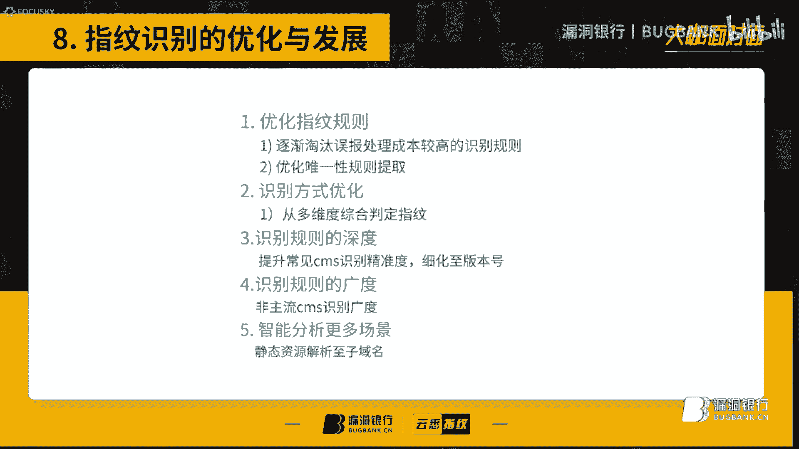
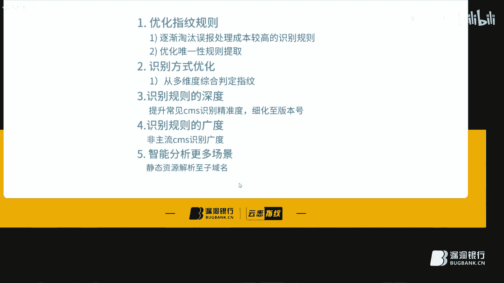
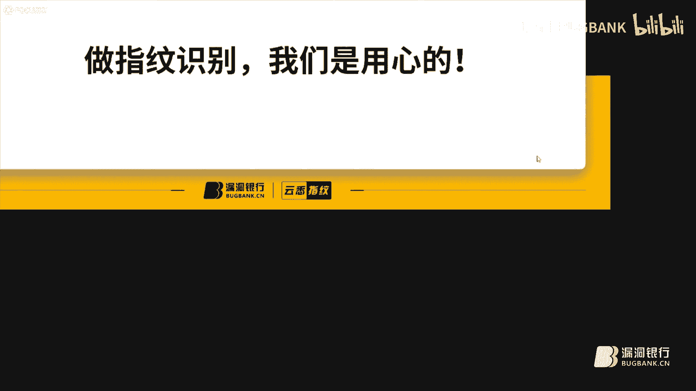
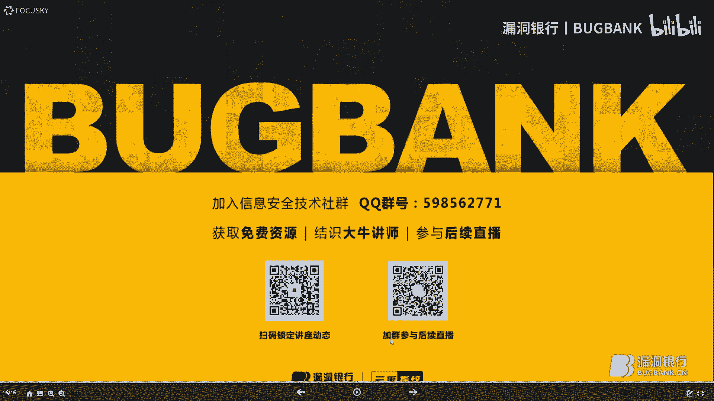

# 课程 P1：新一代WEB指纹识别远征之路 🚀

在本节课中，我们将学习新一代WEB指纹识别的核心概念、技术架构、常见规则以及如何解决识别过程中的误报问题。课程内容基于Sofia在漏洞银行技术讲座中的分享，旨在帮助初学者理解指纹识别在渗透测试情报搜集阶段的重要性及其实现原理。

---

## 概述 📋

WEB指纹识别是渗透测试前期情报搜集的关键环节。通过识别目标网站所使用的技术栈（如CMS、中间件、框架等），安全人员可以快速定位潜在的攻击面。传统的指纹识别工具存在更新慢、规则维护难、安全性存疑等问题。本节课将介绍一种基于分布式架构的新一代在线指纹识别方案，探讨其技术优势、核心流程以及如何优化规则以降低误报率。

---

## 一、 传统工具的挑战与分布式架构的优势

在深入新技术之前，我们首先需要了解传统WEB指纹识别工具面临的普遍问题。

传统工具主要存在以下三点不足：
1.  **缺乏持续更新机制**：多为个人兴趣开发，规则字典更新和维护依赖开发者个人精力。
2.  **使用前准备成本高**：用户需要自行搜集、优化规则和接口，投入大量前期时间。
3.  **安全性难以保障**：从非官方渠道获取的工具可能包含后门，存在安全风险。

为了解决这些问题，新一代方案采用了分布式指纹识别架构。该架构具有以下三个核心优点：
1.  **一定程度缓解WAF拦截**：请求被均分到集群中的多个节点发起，降低了单个IP的请求频率，从而减缓被WAF拦截的概率。公式表示为：`总请求量 = 节点1请求量 + 节点2请求量 + ... + 节点n请求量`。
2.  **负载均衡与高可用**：系统具备负载均衡和容灾备份能力，单点故障不影响整体服务。
3.  **强大的并发处理能力**：分布式计算提升了系统的整体并发性能，目前系统支持每秒约1000次请求。

---

## 二、 技术架构与核心流程

上一节我们介绍了分布式架构的优势，本节中我们来看看这套系统的具体技术架构和数据流转过程。

整个指纹识别流程可以概括为以下几个步骤：

以下是核心流程的步骤分解：
1.  **用户输入与主控端接收**：用户提交目标网址，请求到达主控端。
2.  **规则初始化与分类**：主控端从缓存库读取指纹规则，并进行初始化处理。初始化包含：
    *   **规则分类**：将规则按类型分类，如首页关键词、特定URL内容、文件MD5、URL状态码等。
    *   **请求合并**：合并不同CMS规则中相同的URL请求，避免重复访问，提升效率。例如，两个CMS都依赖 `/robots.txt` 文件，系统只请求一次该URL，用其响应结果匹配两条规则。
3.  **初始化探测**：主控端对目标进行初步探测，目的有二：
    *   判断网站是否能正常访问。
    *   记录“不存在页面”（如随机生成的404页面）的特征和WAF拦截页特征，作为基准值下发给后续节点。
4.  **任务分发**：主控端将合并、分类后的规则请求，通过消息队列服务器分发给分布式集群中的各个节点。
5.  **节点处理与结果判断**：每个节点独立执行分配到的请求任务，并执行以下判断：
    *   执行HTTP请求。
    *   将响应内容与主控端下发的“不存在页面”特征对比，判断当前页面是否有效。
    *   判断响应是否为预期外的场景（如中转页、拦截页）。
    *   若规则匹配成功，则返回规则ID和CMS名称。
6.  **结果汇聚与处理**：主控端汇聚所有节点返回的结果。
    *   对特殊返回值（如连续超时）进行处理，及时终止无意义的后续请求。
7.  **结果返回与缓存**：将最终识别结果返回给用户，并存入缓存库。缓存用于后续优化识别精准率和效率。

---

## 三、 常见的指纹规则类型

了解了整体架构后，我们来看看构成指纹识别基础的规则有哪些常见类型。这些规则决定了我们如何判断一个网站的身份。

以下是七种常见的指纹规则：
1.  **首页关键词**：检查网站首页HTML源码中是否包含特定关键词。例如，源码中存在 `<meta name="generator" content="WordPress"/>`。
    *   **优点**：简单、快速，一个请求可匹配多条规则。
    *   **缺点**：误报率高（如博文内容恰好包含该关键词）。
2.  **服务器协议指纹**：通过非标准协议（如 `PROPFIND`）探测，根据服务器响应判断其类型和版本范围。例如，响应 `405 Method Not Allowed` 可能暗示是Nginx。
3.  **Header特征**：检查HTTP响应头中的特定字段，如 `X-Powered-By`、`Cookie` 中的关键字等。
4.  **特定URL内容**：请求一个特定URL（如 `/admin/login.js`），检查响应内容中是否包含关键词。
5.  **特定文件MD5**：请求一个静态文件（如图片、JS、CSS），计算其MD5值并与已知指纹库比对。代码示例：`if md5(response.content) == “a1b2c3d4”: return “CMS_A”`。
6.  **404页面特征**：利用网站自定义的404错误页面中的文本信息作为特征。
7.  **URL状态码**：检查访问特定URL返回的HTTP状态码（如200、403）。此规则误报率极高，正逐渐被淘汰。

---

## 四、 规则优化与误报处理

仅仅收集规则是不够的，低质量的规则会导致大量误报。本节我们将探讨如何选取优质规则，并处理识别过程中遇到的各种“奇葩”场景，这是降低误报率的关键。

### 4.1 规则选取的优先级与原则

选取规则时，应遵循以下优先级和原则：

以下是规则选取的要点：
*   **优先采用**：文件MD5值、特定URL中的**唯一性高**的关键词。
*   **谨慎使用**：首页关键词规则（易误报）、URL状态码规则（极不可靠）。
*   **确保唯一性**：规则所使用的URL路径应尽可能独特，避免是通用插件或文件。例如，`/static/js/common.js` 就比 `/admin/unique_cms.js` 的通用性高得多。
*   **关键词精准性**：选取与CMS强相关的关键词，并尽可能选择出现在版权信息、官方链接等不易被修改的位置。例如，在JS注释中的 `// Powered by BestCMS` 比一个普通的变量名 `var app = “BestCMS”;` 更可靠。

### 4.2 导致误报的常见场景

在实际识别中，会遇到各种非标准响应，导致规则误匹配：

以下是几种典型的误报场景：
1.  **不存在页面返回200**：访问一个随机不存在的URL，服务器却返回HTTP 200状态码，且内容可能是首页、固定提示页或WAF拦截页。
2.  **页面跳转**：通过301/302重定向、HTML Meta标签或JavaScript进行跳转，而非返回真实内容。
3.  **不同后缀返回不同内容**：对于不存在的路径，`.html`、`.js`、`.css` 等不同后缀的请求可能返回完全不同的错误内容。
4.  **任意页面返回固定内容**：无论请求什么路径，服务器都返回相同的内容（如首页）。
5.  **不同目录使用不同域名（负载均衡）**：网站静态资源可能托管在另一个二级域名下。

### 4.3 误报的解决方案：多层过滤

面对复杂场景，需要通过多层过滤机制来保证识别准确性：

以下是五层过滤机制：
1.  **初始化探测层**：在分发任务前，主控端探测并记录目标站点的“不存在页面”基准特征。
2.  **状态码与内容类型校验层**：节点请求时，首先校验HTTP状态码是否为预期（如200，304）。同时，检查响应头的 `Content-Type` 是否与请求的文件后缀匹配（例如，请求 `.js` 却返回 `text/html`）。
3.  **特征匹配过滤层**：将响应内容与已知的WAF拦截页、中转页特征库进行匹配，直接过滤掉这些非目标页面。
4.  **错误模型判断层**：对于前几层无法判断的响应，使用预定义的错误模型进行模式匹配。
5.  **机器学习模型层（发展方向）**：利用大量样本训练AI模型，智能判断响应页面是否为有效内容、拦截页或错误页。结合以上五层过滤，可有效将误报率控制在极低水平。

---

## 五、 优化方向与发展展望

最后，我们来总结一下WEB指纹识别技术未来的优化与发展方向。

未来的工作将围绕以下几点展开：
1.  **规则持续优化**：淘汰高误报、高处理成本的规则（如首页泛关键词），精炼高唯一性的规则。
2.  **识别方式多维化**：不仅依赖单一URL或文件，而是结合多个静态资源（如JS、CSS、图片）进行综合判断，尤其对于二次开发的CMS。
3.  **识别广度与深度拓展**：
    *   **广度**：在保证常见CMS（如WordPress、Discuz）识别率的基础上，覆盖更多非主流、老旧CMS。
    *   **深度**：细化识别CMS的具体版本号，这对漏洞利用至关重要。
4.  **场景智能分析**：自动识别并适应复杂的网站架构，如负载均衡下的多域名资源加载。
5.  **自动化指纹提取**：利用人工智能技术，自动化分析网站特征并生成指纹规则，实现指纹库的自动更新和扩充。

---

## 总结 🎯

本节课我们一起学习了新一代WEB指纹识别的完整知识体系。我们从传统工具的不足出发，介绍了分布式架构如何解决并发、WAF拦截和高可用性问题。随后，我们深入探讨了技术架构的核心流程、常见的指纹规则类型，并重点讲解了如何通过优化规则选取和建立多层过滤机制来应对各种复杂场景，从而大幅降低误报率。最后，我们展望了该技术在规则优化、多维识别和自动化提取等方面的发展方向。掌握这些知识，将帮助你在渗透测试的情报搜集阶段更加高效和精准。