# P1：【录屏】打开横向渗透大门-大咖joe-漏洞银行大咖面对面第88期 - 漏洞银行BUGBANK - BV1Lb411b72X

嗯，为知识而成，因技术而生。小宝晚上好，欢迎参加第88期漏洞银行安全技术直播。大咖面对面，我是主持人秋秋。😊。

那今晚即将分享的是来自民间安全技术团队actectch的大咖joy他将带来的议题是打开横向渗透大门，相信会为大家在电网渗透和APT测试中提供帮助，并且大咖还会拓展分享无限局域网相关内容。感兴趣小伙伴。

务必要听到最后哦。那欢迎各位关众伙伴们登录直播间，在聊天区讨论或进行互动。😊，这位大咖演讲完毕后，还会有行长问答和福利环节，呃，可以直接向大咖提问。那提问还有机会获得大咖亲亲自挑选的证书。

rootki引遁攻击技术及其防范。好，那事不宜迟，下面我们就请这位大咖开始今天的分享吧。😊，嗯，大家好，我是艾提西亚团队的热。今天为大家带来的是联网渗透里面的一个字集。打开横向渗透的分享。

在APT攻击越来越猖狂的时候，我们经常忽视内网的安全，从而导致内网的防御力几乎为0。这是为什么最近有很多服有多很多服务器的数据都被泄露了。今天我将带你们从一个攻击者的视角来理解内蒙里面的那些脆弱点。

首先这个是我今天要演讲的目录，可以看到有4个，一个是信息收集。还有内网结构磁态。还有一个预控制，也就是预控制器。

还有第四个是酒货，我们也称之为是后渗透。

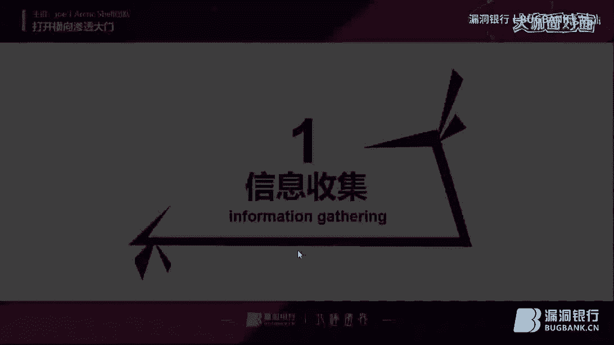

第6收方。我们最常见的信息手动有端口，还有个系统。这是操作系统是什么版本，linux还是windows？还有个DNS通过自身的IP或者其他信息信息确定预控。还有一个GPP也就是主策略。

我们常用的工具有npe，这个你们肯定不陌生。还有一个是export杠DB，也就是loong利数据库。这个就是exper杠DB的一个界面，我们可以在上面看到有许多更新的一个漏洞。

比如说这是一个doss攻击。然后这是一个坐子的平质，这是漏洞的一个。一个大概。这是发表的热气。我们点看。嗯。如果是在如果是软件漏洞的话，我们可以在这里下载到有要漏洞的1个APP。

然后这边是1个POC的下载。然后他还有一个是离线版的，也就是s point。

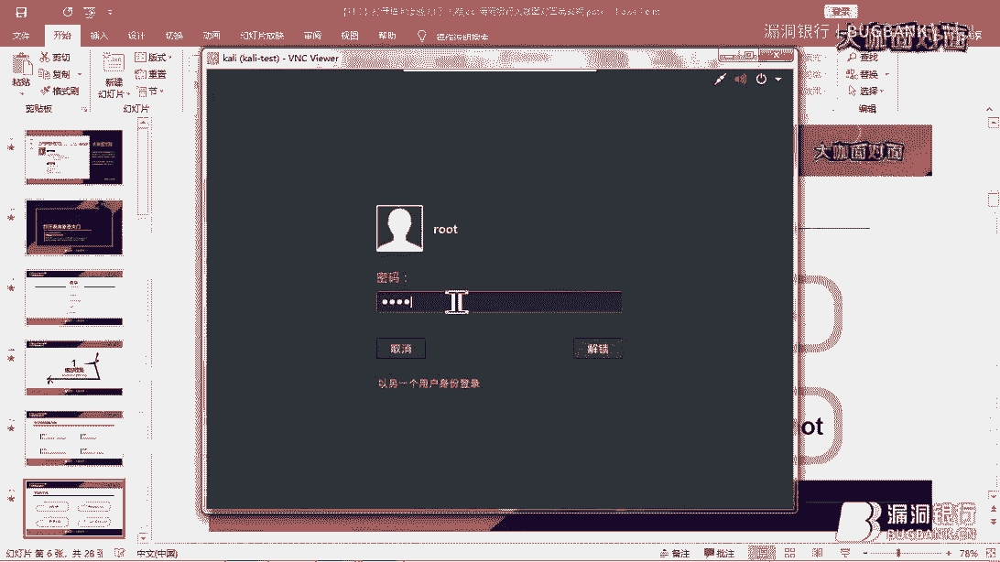

一个这就是s point。我他的主要用法是。就put后面带一些参数，比如说windows。然后1个SNP服。哎，windows windows拿错了。WMDOWS对。然后就可以发，只后这果含有漏洞的话。

它就会在这里标出来。这是光景制。不过目前我们还不需要用到这个。

我们先讲一下npe的常用写命令，npe杠SB后面是带1个IP地址。这个命令的只有。是用用来探测一下端口上面开放的服务版本信息。更偏。一般是用来逃逃脱。防火墙的扫描。

因为有一些防火墙开启了之后会进用拼扫描，所以我们可以用这个参鼠来进用拼扫描来去绕过一些防火墙。n克192。668。2。0-24，这个24是一个直网元板。一个左元码的二进式有。有8个1。

也就是也就是说24它是有3个25，还有1个0。然后这个是is club。我们可以利用这个参数来排除一些IP地址。比如说第1个IP地址，还有最后1个第1个IP地址，我们一般留给网关。那杠OU92。Q68。

2。X这。刚刚一般是用来扫描一下目标的一个系统信息。这只要给你们演示一下。

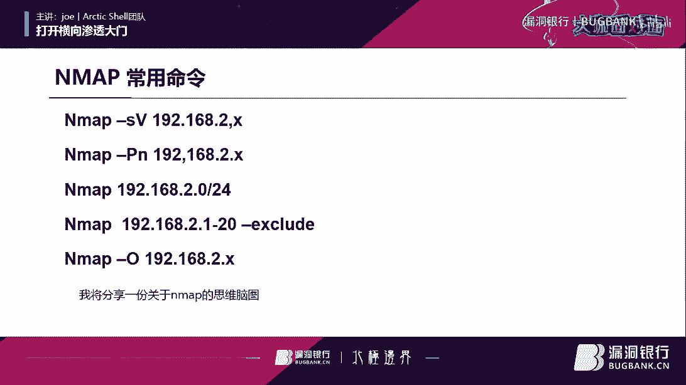

10点10。33。扫一下本扫一下本机的IP地址。

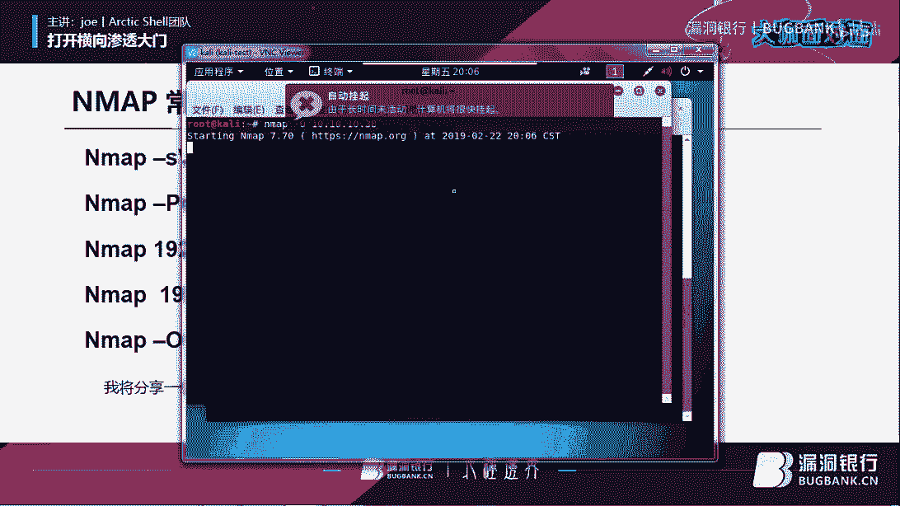

我们可以我们可以看我们可以在这里看到我们的操作系统是一个unux。他开放了1个4444端口，还有个88080，还有1个80端口。然后我们试一下note杠S。6有0。点10。10点38。开。这是种种。

那我们可以看看到它已经在后面扫出了一些端口线运行的服务。比如说这个是apppoch。他运行的版本是2。4。38。然后其他的你们可以自己去实践一下，这周不要多讲。这里我们分享一幅关于大哥的思维导图。

这里有一些n的语法，还有一些参数。还有自由世干什包盾。这里我要跟你们讲讲一下的是这个杠T。杠T0可以是恒慢的一个扫描用于。逃避IDS和防火枪。TE双4比T0快递点，但是也是一个很慢的速度。

用于逃避防火墙的追查。杠T2文眼降低速度或就是当你的带宽有一些低的时候，它你可以用T2来。降低一下你的网速。所以这个形项不不是很常用。第三，也就是不过这。

T示快速扫描就在一个npe的一个图形化中会出现了会出现了一个很常用的参数，但是它需要在很好的纹路环境下进行扫描。T有疯狂的这种闪描方式会牺牲准确度来提升闪描速度。然后这是我们刚才讲到的一些。Com。

Go as。还有个杠钩。这两个这两个参数是用一个是用来对操作系统进行检测。还有一个是用来猜测操作系统。因为有时候那是无法识别物R准确识别的时候，它会从最接近的数字中大胆的猜测它的目标系统。还有1个杠D。

杠D是1个IP汽配。我们可以用IND，还有一个分号，后面是要欺骗的IP的数量，这里是11个，这是要用11个IP地址去呃测试。还有还有你可以自己去制定义中心要多号隔开。

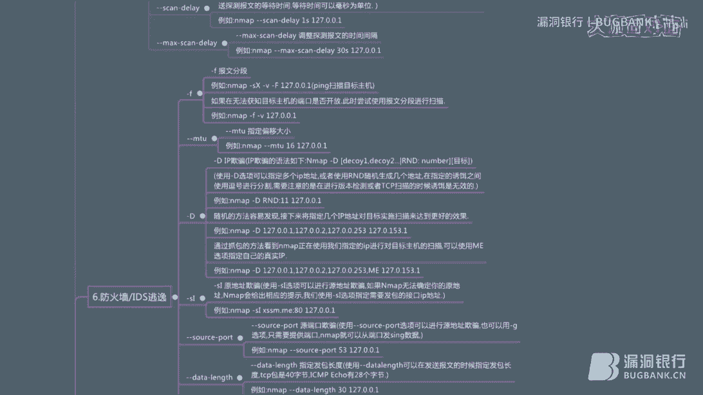

然后关于那克，我们就先说到这里。然后这里是一些常用的端口运行服务。比如说21FTP我们通常是用了传输文件呃，1个SH相是你们也一定不陌生，可以在很多群看到。总是有一些人在问一些端口爆破的字点什么。

还有1个SNTP邮政服务协议。点S还有个TFTP820是1个web，也就是我们经常上网用的一个端口。110pro3，我们这次主要的一个目标之一。还有一个事实上HTTBS协议。

45也就是永恒智能所使用的那个漏洞。还有一些数据库，比如说1433XSQ。还有个3306MQ，还有个3389。然后这里是有一个一些很多的漏洞，但是。

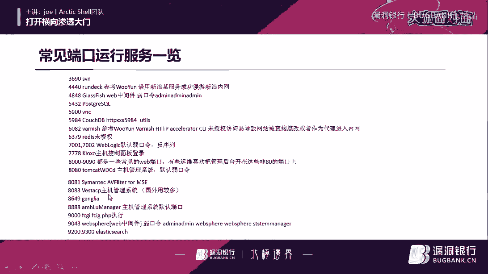

因为我们是不参见的，所以就先略过。如果有需要，可以等我把这个PPT上传的时候，你们再去看一下。

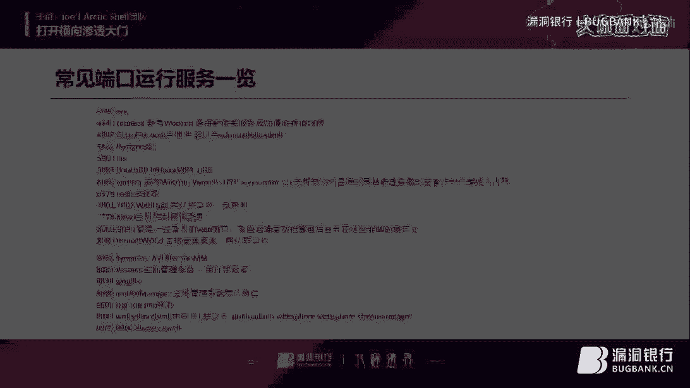

呃，托普斯的。在对网中可了解您的目标是能战胜他的唯一方式。

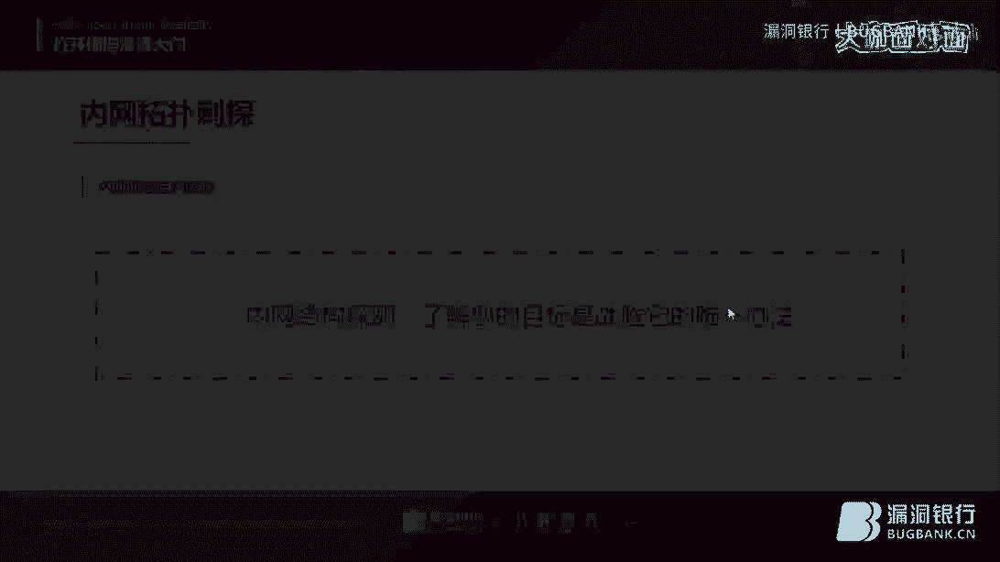

这是这是我这这次准备的一个拓扑结构。哦，这个是失败屏。这就是我们本次要测试的一个目标，这是2003的一个服务器，这边是2008，也就是预控制器AD。然后这一台是我的电脑，这上台是里面只有一台是有的。

然后其他是然蓝白色的。所以我们首先会对一个处于巅站。也就是。非警市区的1个2003邮件服务器进行一个测试。在编辑中内网可以可以连可可以去访问一下。D影载中的服务器的一个内容，但是DN载中的。

的服务器却不能去访问内网，但它可以访问外网。也是我这边可能是跟A那边离的比较远，然后网速太慢，所以有时候会比较卡。

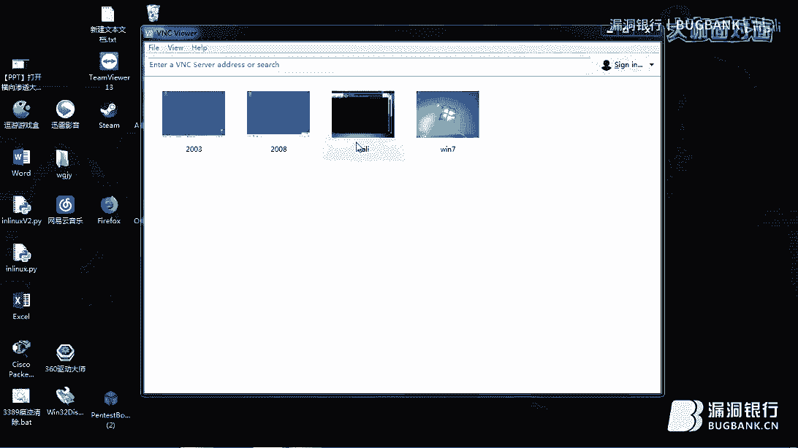

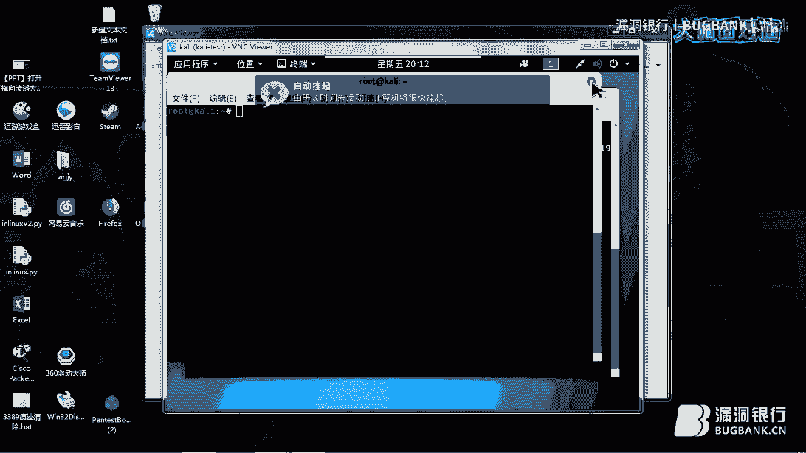

这是我提前去扫好的一个朋票，为了不会浪费你们的时间，所以我今天就扫了。可以看到。这边是1个IP地址，这边是开放的一个端口端口的协议。是TCP还是UDP，这边是开放的服务。可以看到，这里是开放1个110。

也是P3用来收收邮件的。对应的就是1个SNTP协议。我们可以看到后面它是开放着一些。一一些容器服务SL6。由于我们刚因为我们刚才是用信息收集后，发现它是1个2003的一个操作系统。

所以它是不会存在有任何内存保护机制的。也就是说我们可以直接。去采用一个缓冲区一出漏洞去尝试一下能不能把它攻破。没错。我用4。命令去查看一下有有没有灯。但前短时有没有一个录洞 s l。

我们发现这里存在的一个一个漏洞。一般来说，他的。这是我从s point上面copy下来的一个。I pig。这此我们可以理解他的一个漏洞工作。我们可以看到。他要发送的它的艺术点是在他输入密码的时候。

这是这个是一个简单的sockcus连接。说实话。然后这边就是我们的payload的构造。呃，这叉41是一个大写，在内存中是一个大写A。但是转化成会会宾室。但是他的符号。怎么说？就是它的SK是A。

但是它实际在内存中是差41。然后这边是要用465。4654个用字符去填满它的一个区域，好让好让他。溢出。一直后的4个G一直后的4个精准字结合没试。IPIP的位置。

所以我们可以在这里填充一下这盘ESP让它跳转到我们笑口的地方。这个EP就是。可以直接把可以直接把当前的一个工作状态跳到1个ESP上，然后正常去执行我们的需要口。但是在2007以后，就是有个第一批保护。

我们将不能在数据页里面执行需要口。这个S7就是我删掉的一个笑一个笑口。这里有们把它补上。因为那个口是别的，所以在这里我们也不不需要。这边是尝试。如果说我们能成功的。利用这个logo，它会返回完成。

然后让我们去连接444端口，如果是无法连接的话，它会让我们。让我们检查一下环境，是否能连接到P3服务。然后在这里我们尝试一下漏洞利用。在系。为什么公司都要设置一个独立的邮件服务器呢？

因为那些公里免费的服的邮件服务器是有些是很不安全的。嗯，俗话说的好，免费就等于裸奔吧，是不是？然后我们看一下又设置什么东西。这里需要的是一个目标的1个IP地址。那我们从刚才的一个端口看出来。

它的1个IP地址是10。10。10。33。现在我们设置一下它的1个IP地址。Ahost1。点三0。因为我们有时候可以比较懒一点，然后MSSF又会自动帮我们选择一下配合的。所以我们有时候只用设置一个。

目标的IP壁址就行，然后phone输入。It point。梗Z在后台运行。Vice。This is原。对，小，我这边呃能是有。去看一下。这一个这里的一个bug可能是。无法连接。

也就是可能这边的网络出了差错。呃，有有点卡，伤勿躁。嗯，IP历址没变，让我们看看它的服务有没有被关掉。た。Pos。Service。它的pro3是1个S。可以看到这边其实是已经启动了。

所以我们给它重启一下。重启一个po上服务。

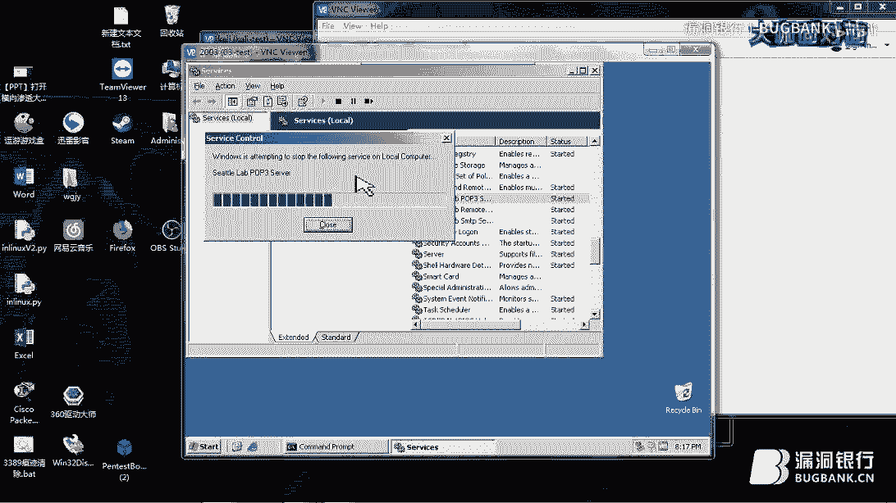

嗯，佢点啊。有。よ。可不开始。好埋。有点慢。为了不浪费大家时间，我先给你们讲一下1个OS大模型。OSM型是一个早期的。对是设计和描述计算机网络通讯的一个基本框架，它一共有7成。

但是现在它已经基本被TCP杠IP所代替。这里我们讲一下物理层顾名思义，它就是用来传输一个数据的。01010，我们称之为比特流。数据链路层。他只他主要是。对于物理层的传输的一个流进行一个包装。

检测它的传输属性是否有错。若果有错的话，它就会去选车重发。我们的解换机也是工作在数据链路层，网络层控制一个字网的运行，如逻辑例子，还有一个分组传输路由器选择的一个最小单位。我们的IP就是工作在这一层。

还有个传书层。传输层就是定义一些传输数据的协议，还有端口，传输协议同时也进行流量控制，就是根据接收方接收的数据快慢程度适当的。规定一些发送速率。解决传输效率，还有能力的问题就是。如果你发送的过快。

然后这边没有管的话，目标是接受不了，而且。他就会会造这就会造成一个就DDOS的攻击。汇划成。负责在网络中的两节连建立一个维持和终止通讯。也就是说他是他是负责两个文标中两个文标中的一个协。嗯。

可以可以说是。那个两来史就是两方两个大国开战的时候。一个是呃就是一个国王派，一个使徒到另一个。国国家去谈判，我们可以这样去理解。表示成就是去另一个系统的应用层发送的信息，可以被另一个应用层所读取。

我们可以把它当成是一个防疫光。应用层应用层就是负责文件传输，还有一个文件管理电子邮件的一个信息处理。交换机从刚才的top中，我们可以看到，我们是用了两台交换机蓄拟吉林。所有的机能就是设备和设备去连件。

是就交换机吉动的时候，他用的是双绞线，不能用直不能用直通线。然后在这里我。由于食瑞房因，所以我在这里简单的阐述一下关于交往肌肉的肌肉两种攻击方式，还有一个解决方法。一个是mch泛围空制。

绝望机在接收到数据包时候，会记录下match壁址。如果PC不存在的话，那么绝换机会在一段时间后自动丢弃。如果我们在绝望机的max缩新时间内停满它的matax跳幕，那么我们可以阻止正常的数据包进。

进行进入到一个。目标机里面也就是说。特被阻止当做广播包的形式发送出来。然后这时候我们就可以用一个流。周报软件去做到一些。是广播出来的明文密码。解决方法是设置每个就端口限制的主机数量。

当一个端口学习的match数量超过这个限制的数量。所有问题会直接将它的match地址给丢弃。还有个是ARP机片。我们用LP起骗的时候可以使。邮局不同的IP经行传输局域网的网络是不是根据1个IP经行传输。

而是根据match例。

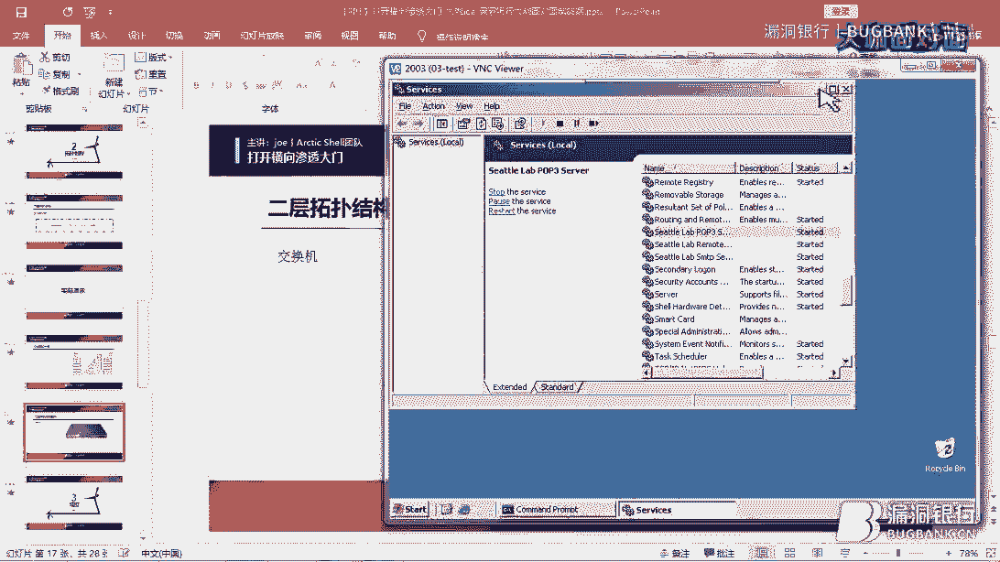

所以有所以我们可以伪造成一个假的ves去骗骗这个。将继说。我们是网关，所以我们就会接收到一些来自网关的一些其他信息。然后我们再尝试重新。Thisput。哦，可能说这边的问题。我重我重启一下。

然后如何解决ARP欺骗的，其实一个很简单的方围，就是把IP地址，还有一个max地址给绑定起来。那我们尝试重新攻击。呃，看看忘记那个。6的。路径。我们继续搜索设试。还小秒。Use是EPwin pop3。

我们设置一下IP地址。嗯，感谢。室内室内室内上上。要我们直接控直接控气。看这次我们攻击成功，刚才可能是因为端口占用的问题。我们可以在这里看到一个很清楚的juESP也就是我们所有用到的一个。

那这是这条命令的一个地址，它是1个5F4A35，还有1个8F。可以看到它的一个操作系统是这样子去拆测。让我们获得一个邮件的服服务器呃是。新兵我们可以在里面添加。你就添加一个我们自己的账户。123。

Of boys。来。Use it。月3。123杠AT。那我们从内容置。哦，密码太简单了，所以我们重新设置一下。就。我们就随便找一个。但音呢 could be。文再采访一去。

看来看来今天这台2003是不给我不给我面子，想要找个场子。我们先看一下它的一个权限，声音提全ge sister。我们直接提取。然后们咱们先把这台。既然添加不了一个用户，我们就可以把它当成我们的贴板机。

门是ro哎 you退ro。Gs。10。1。33。点10。33没是个这硬码。他已经他已经成功的把。路要添加到我们的路由表中。其在我们可以访用14。4。4。0点。10。10。10。0-24的一个网段。

但由于我们是直接在内网里面，所以下次不需要。我们因为我们不是远程的一个攻击。我们把它切到后台，DHK只要有一点关。嗯。P。要不输度设0设。没有看到刚才我们收到的一个机子，主要有1个26，还有27。

一个字33，也就是我们刚才所攻破的一个。服服务器。这里我们重新去扫描一下它的一个。呃，操作系统因为这里面小屏确实是看不到。DB奶粉。够。有0点有6。嗯，开始还我去。稍等一下。我去排查一所。可能是使用的。

有时候之间会出一些故障。所以环境你你们一定要好好的去检查一下。我们看到他的IP已经改了，刚才是1个26。

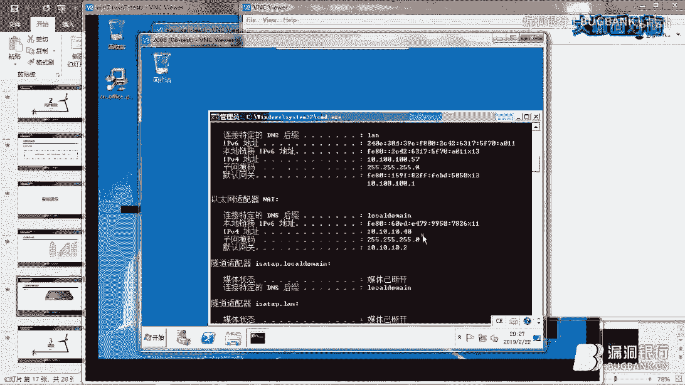

也已经没清了事实。所以我们再重新扫描一下。不觉得对。10。10。10。44。不打错打错了一个。写个。它已经在缓慢的扫描中有661。可以看到它的一个操作系统是2002008s。一个啊。然后准备好了。

我们再看一下它的1个IP地址。它是1个27。录你偏下稳光。可以看到是通的。咱们听一下那个开。野葱，然后我们尝试在凯ry中拼一下。是在27，也就是window7。10。10。10。27。现在已经通。

那么记在我们获取了它的邮件服务器后，我们就可以通过查看在服务器里面的备份邮件来选来获取一些信息，然后构造一个钓鱼邮件去评访它。这次我们选择的是一个恶梦公式。别是。CB杠2018。杠08002。

这个利用是其集成了它的。上一代也就是恶魔公司11882。我们新开一个窗口。我们先进入一个一个服务。winindows andS。哎是对。这T4。我们设置一下我们本机的一个ho。点10。10。38。

然后设置一下他的服务。在你输入这些命令的时候，你可以打出几个字母，然后按t它就会帮你自动补充。如果说你打一个字母的话，按t它没有反应，你可以多按几个，然后它就会出现一些相似的呃单词。嗯。

发现我们还设置一个是。设ice的一个服务一个地址，这边是一个。那我们要我们先设置一下它这个服务器的一个地址。Sick。S2B。post然后 on tap它就已经帮我们自动补全好了。10点10点10点。

38。那我们开始运行，监听一下服务。Socus everywhere。我不懂。重新退出一下。可因为端口占用的问题。那么先进入到那个利用的一个目录。我们先采看一下。RTF系列。我是卡住。这面已经说过了。

我做一遍一直往这边。有的时候玩比较开点，也是很合逻很合逻辑，也是很正常的一个。

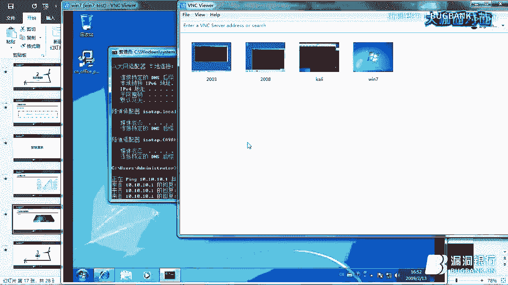

就因为没钱嘛，是不是？然，我们进入到这个目录下。我也重新的进入那四个模块。Windows。应该7。嗯。一个A4个。好的吧，怎么又卡住了？对。

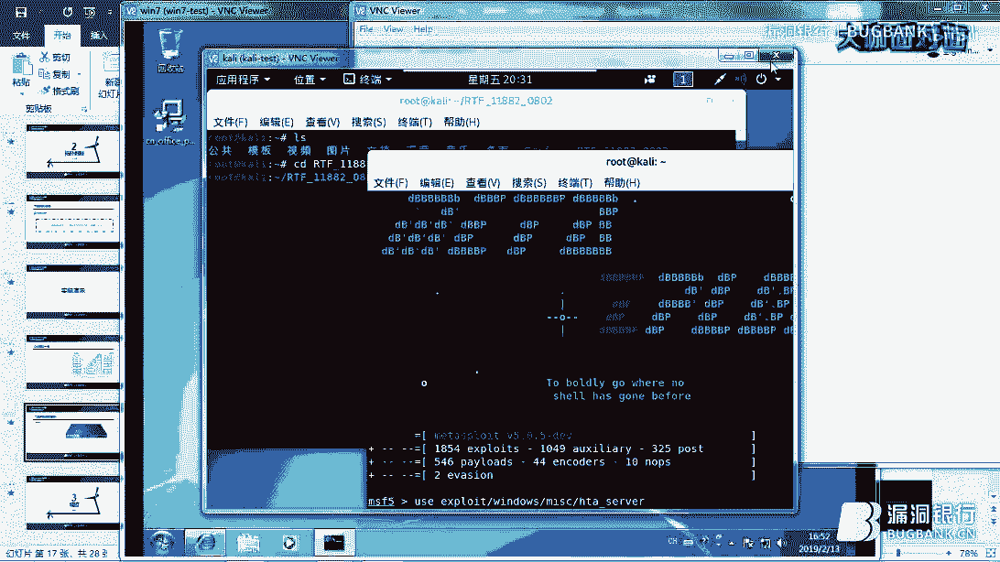

今天电脑有点不给我面子哦。啊，现在好了。就后我们就打入刚才的那两条命令。sicker。Yeah host。10。10。10。呃，我们先查看一下IP地址没有变。没有变，非常好，先清一下。电。38。

然后再设置一个服务器的1个IP地址。S始啊 course。我们是先去看一下一个设置。应该是我打错了。This the house。10。60。上班。开始运行。可以看到我们这一个生层的1个UR一个链接。

我们把它复制一下。我们在新的一个终端运行一个。漏动利用。Pas。Okay啊。杠西。指定一个系一个系统服务STA。刚刚输出一个文档。们是老子钓鱼。点丢戏。我们已经可以我我们输输LS可以看到它已经在生命。

生成了一个钓鱼文档，我们把它移入到我们的apppo文件夹中。说省一下。诶。哇，哦，看错了。ども？在这里我们的育儿生村的一个文档。我们把它移动进去。它的路径是1个BA2。然后有3个W。

HTNL我把它复制进来。要么去上面去下载一个。对。钓鱼。点丢游戏。我们把它打开一下。然后我们慢慢的等一个下。送上门了。嗯，还是卡住。稍等一下。钓鱼得丢。它下载完后打开位可能是有点慢，所以我们耐心等一下。

来这里有个先音说一下预控，预控就是。预控制器。为什么要设置这个预控之期呢？在一个起起稳。企业中，如果你不设置预控制器，因为每天有很多就是有多多少少，也有些人手，还有一些新人加过来。

所以如果你不设置这个预控的话，你会装系统会装的很麻烦。那就会当场当场崩溃，然后在边抱头痛哭。你有要感慨，为什么你的人生就跟这些bug一样。所样设置预控预控制器会让我们的工作变得非常简单。

这里有没有去打开的那个文档？我我们可以看到我们的。😊，ASF已经返回了一个笑。这样子，因为我们是入侵不了DN加区域的。不是。因为我们在电影展示的时候无法访问一个内网。

所以我们可以使用钓鱼的方式进入一个迷工。调鱼员工，然后我们进入他的一个办公区，这样我们就可以直接去返问他的服务服务器。同样我们添加一个后门。P。persist。远。我们先进入再一个回话。

哇 persist。U是它开机启动会自动重连。杠按设置一下它重新的个时间，我们选择为10秒。还有个杠P，也就是端口，我们就默认了4414。还杠啊设置一下他的IP地址。10010点10038。可以看到。

我们已经成功的把一个后门。安装在安装在它的一个window7上，然后它下面已经开始在连接了。但是这个有一个弊端，就是它很容易被杀毒人进去查杀。我们我先推到后台。前面我们讲到一个预控制。

然后现在我们讲一下。预工之中的一个sspro文件。

这文件是你在建立预控的时候，它会自道帮你创建的一个文件夹，上面放有一些主策略GP还有。启动等的信息。

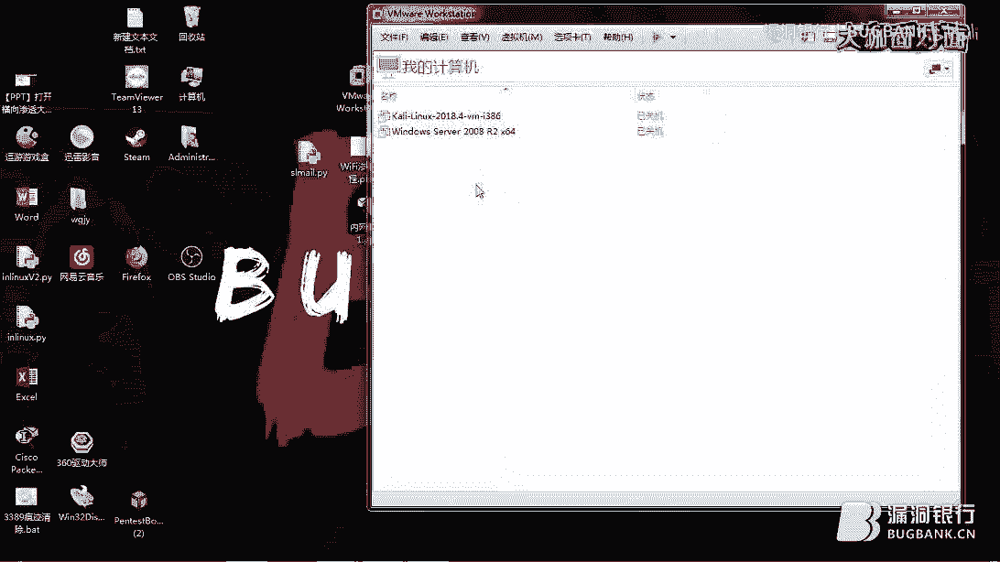

脚门开一下机。咱们开咱们开心的时候不要慌张。可能可能只在破电脑四是有点老旧。找个机会把你换了。

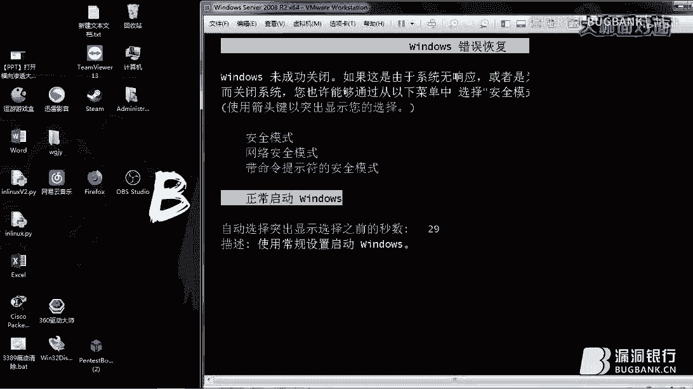

虽然可能桌美是有点浑弱。但是这并不妨妨碍我们。这另为法尔们伟大的德意智科技，它是世界第一的。啊，算。好行好。我们先收集先收集一下我们是在哪个域。那又是。Demi。呃，可以发现我们是存在一个。怎么说呢？

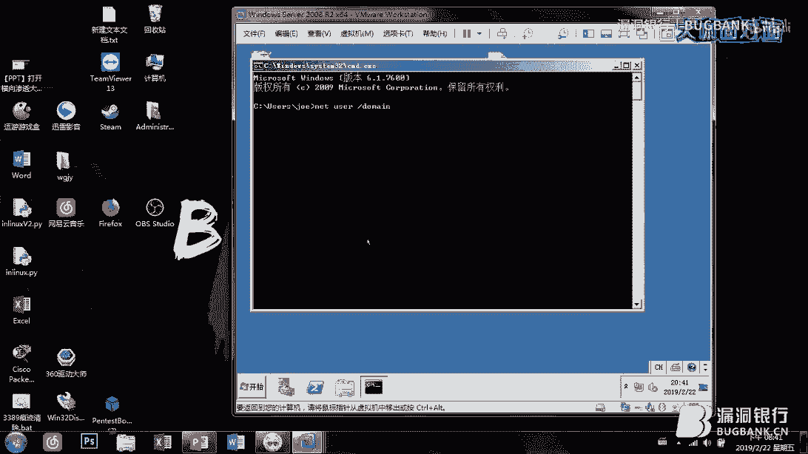

咱们看来是一对乱吧。我们去拼一下。我们可以得到一个域名，然后我们填一下这个域名就可以。得到一个预控制器的1个IP地址。他的他的。IP历史4。2。194。所以如果他开了1个45，你面可以尝试用一个。

有个智能去打他。然后得到。得到一个域名收。我们直接返回它的s文件夹。它的一个用户数据一般是储存在这个places。然后这是他是他的一个用户ID，我们打开第一个优质。不就是主持率。

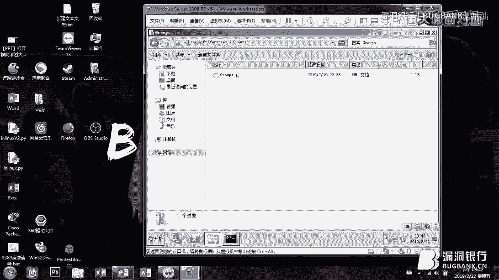

门编辑打开。可以发现他的用户是一个ad me管理员账号。然后它是一个sus，pa。它用的是1个AS杠256的一个动态加密。虽然说他已经有了加密，但是微软在NS0上有把它的一个me钥发出来。

所以我们可以利用它的一个me钥去。解密。稍等一下。然后这这两个是我已已经去写好的两个脚本。我也给待下这器开启。

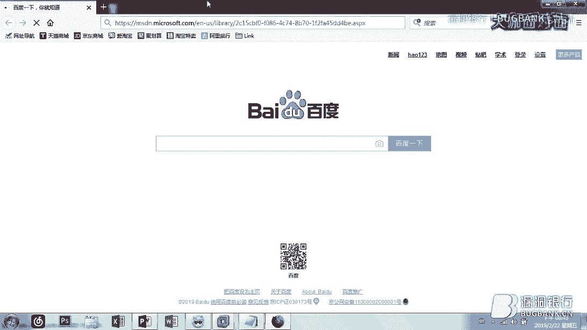

我们进去。人是比较可对。主就的是AES的一个密钥。在这里。我们也可以利用一个泡泡需要的解面帮助我们进行几个解密。这是我机的一个命防止我一个比较笨的头脑忘记。可下屏。这是一个我更改后的结本。

我们可以在这里直接利用这个行数进行一个解屏。这是我之前复制进去的一个。一个用加加密过的一个密码。然我们直接运运行这个脚本。

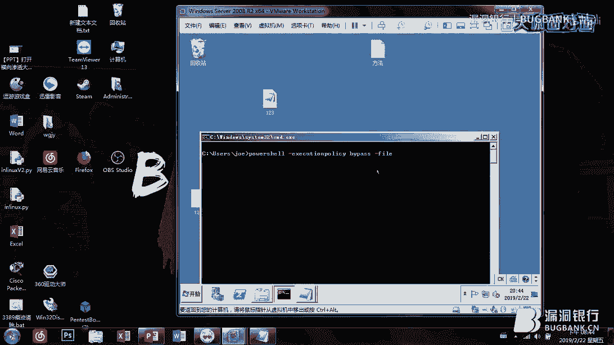

我一看是我们已经直接把它的密码解密出来，是一个test1234。所以sspo就先到此，我们还可以在他的其他。文记者中发现一些。比较有对别有可能确实有利的一些信息。比如说这个接本进讲。

但是目前我只做了1个APPP的一个更改。然后是一个后渗透的模块。没し。这绝货就是没有新一波的时候，他的这个最高权限，然后获取到最高权限。隐藏取性，也就是说给他加一个后门。好的。咁大家嘅睇。

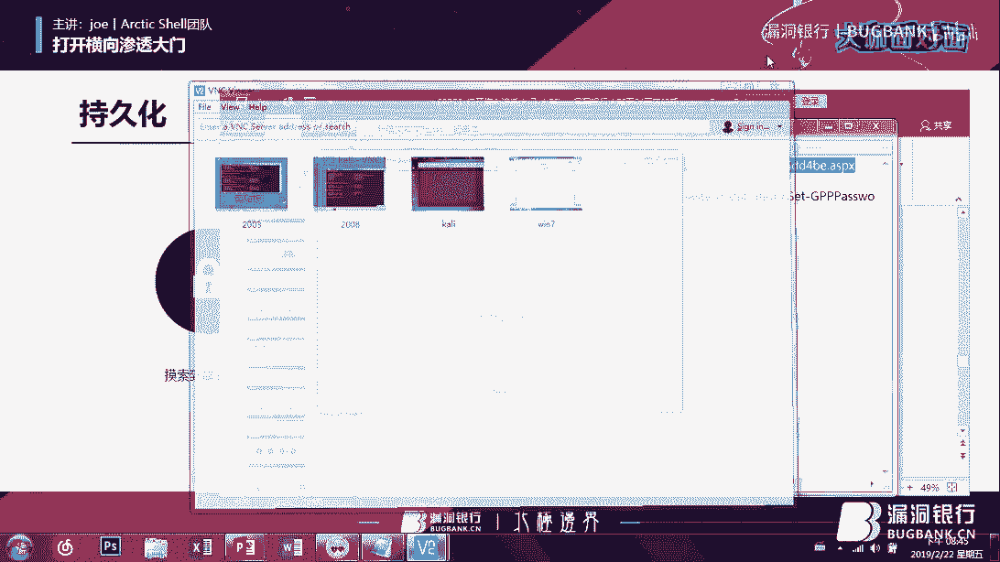

先随便找一台机子试一下。

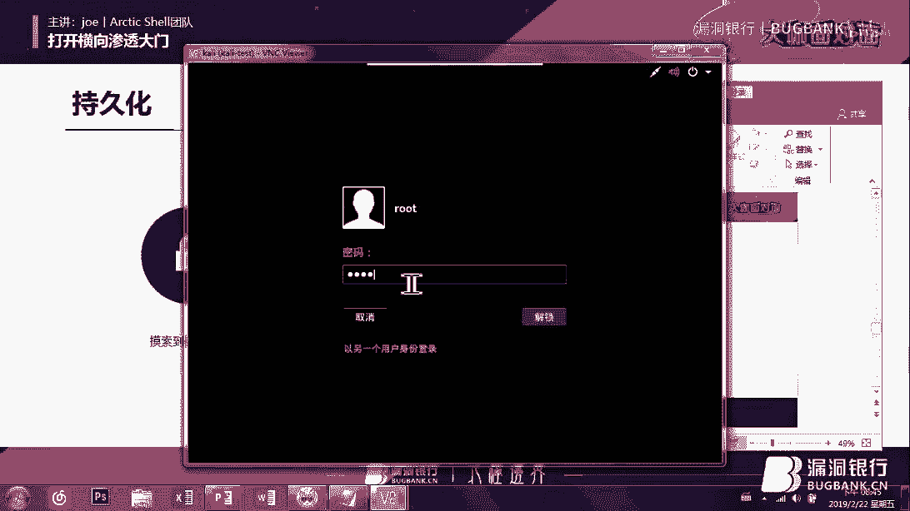

是讼事实查看部当琴的挥霍。

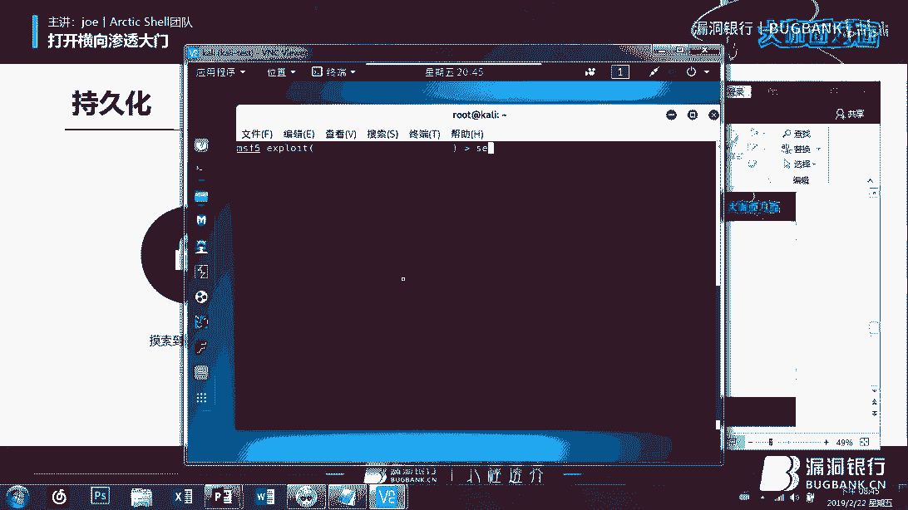

我们就随便的进入一个绘画。没有个。9块这一个。预气。完还是断。Dump篷。嗯，原是就哈斯顿。对，然后我们获取到他一个哈西。嗯。尴尬。好的，我我们要设置密量。Okay，'s just。よしく。那么就。

来我们就先试一下。入讯2008。SNB。预控制的或者是。对。Yes。为什么用这个也为什么要用这个利用呢？因为只有它是一个自动化的过程。而且它可以也就说是一个全版本通用，从ind朵2003。

有一个windows1都可以用。我们先设置一下它的1个IP地址。是不是。是吧。诶。端口又占用。所以每次遇到这种情况的时候，我们应该要先去地线查看一下。为为什么说是横向渗透呢？

因为横向渗透就是对其他目标的机子一个渗透，属于内网渗透的一个机机。那是我们有说过了一个纵向渗透，也就说提拳。Yes。诶。Okay you。

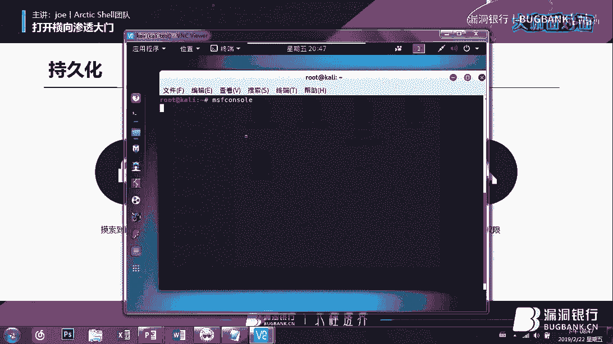

嗯，前面说说我做一个网络安，我我做一个网络安全者。那个时候程序出了bug也是很正常的吧。这是一个提前的方面，我回去往上搜的。这是一个检测工具，有没有一个本地的提取？比如说AS08杠。

或者是X14或者是1个XS17，也是与合伙的一个A。然后这边是一个利用。后视透模款，我们可以用power shellll去访谈一个hell。用用这个的。为什么用这个呢？因为它主要是不用1个UAC的性质。

可以绕过。还有个passion访弹下，你可你们可以在那个大码里边去。直接去使用这一句话，杠隙是直接运行import circles。OS然后这边是建立一个非常。普通的一个连接，然后可能1个IP地址。

然后后面是端口。然后这也是访谈它的一个下回了。

Acount的。嗯。Think。

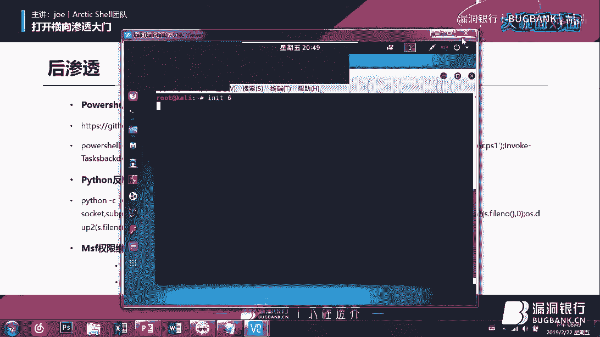

我里面歇了，好像需要半布丁。作为一名老司机，我是不会轻易的翻车。

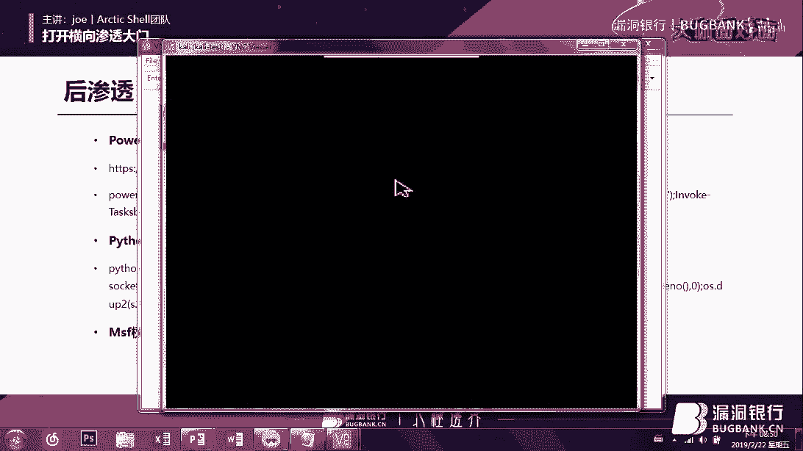

我是就算我速傅开到120码，我也不可能放车。出了意外。对。嗯，好的。对不す。同时看。一本人说，第一次运行是比较久一点。这里一个提示是我们没有连接1个NSF的数据库。所以要有连接或者是不要连接都可以。

看你们每个人的意见。然后我们重新的说用一下。Windows S B。嗯，应该是。我们设置我们设置一下它的1个IP地址。谢谢。我是不会轻易的果断。我的。哦。不ice。我记特机自种全释道这个。

如果不在同一个网段内，我们是无法输入新另一个网段，除非没有路由器。前面一并前面一片红，后面一并绿。看来我的NSF还是很健康的。我们先安装一个后。国际光例。诶い。哦，好了。可。

可以看到我们现月已经添加了一个后本进去。嗯，再获取一下他的哈西。嗯。很好的应该是运行吧。可以看到我们这里已经有它的一个哈西。一个是。郭磊位的账号，还有一个是来来宾账号。我复我们复制一下中大号锡纸。

然后这时候我们就会利用pas the house。来进行一个攻击。比如说。越是K。需要原地。主额屋。然呗。你就刚刚拆的。嗯，同一个路径。这是名字不远。SNP。是直接使用一个模块。我们查看一下配置。

刚讲还是要开个45端库，所以我们接。上来就设置1个10点10点。10点40。然后设置一个。用户名。嗯。这那这个。等 me。He啲。就系。呃我我问。将解口。But didn。有啲 a加 x s t 啊。

屌啊。咱们来把我们刚才获取到的一个哈希纸给输入进去。个。然后他就会开始跑。嗯。可是。我 do你 sister。Impossible。S。对。老师就复责一句。Sick。微行先看一下刚才设置的时候。S。哦。

Ass。S。哇这么不给我面子的吗？O会。😔，然后除了在ISF里面使用一个passter。对1个SMB上的一个模块，我们还可以使用一个。他喜呼自己。0ESE。那们先看一下它的一个使用方法，概预。

为什我没有设置到域名。我重新复试一下这段哈。制，然后你这边看一下。杠杆user。等于。哦，也是这样子。Yes。等于。因为ISTRATT过。啊，的确有点尴尬。再说。不说谢谢。我们继续展示一下其他的。

Look。对，先加载一个小工具，它可以让我们在它的内存在目标中的一个内存中提取到一个铭文的密码。Dear。Yes。我们是我们是如我们如何防止。在windows2012后面。

windows的一个密码是不会在内存中去存储的。所以我们。或者是你还可以打上一个补丁。来来防止一个密码的泄露。关于提成，我们还可以用一个另块讲报。我们先输入US。では。们先使用一下这个模块。

然后列出一下有哪些令派。Okay。等于。嬉し。可以发现这里有有40个令牌，我们冒充。我们复制一下这个管里面的一个账号。复制一下。咱们就开始冒充。S o a。8。Talk。

可以看到我这里我们已经成功的冒充了一个要，也就是adit它的一个权限对一个令牌。咱们输我们输入。嗯。你可以可以看到我们现在已经是一个管理员的。一个权限。那我们先总结一下。嗯。我们这我们最开始是。

在一个微网中搜到了他的一个邮件的服务器邮邮件服务器。我们发现它上面有一个藏藏有蓬程区艺术攻击的一个。软件，然后我们对它进行尝试攻击后，发现攻击成功。这时我们这时候我们就会从它的服务器上面去获取一些邮件。

然后进住内往后，然后我们去。用信息收集发现他的一个员工。那我们就利用刚才在邮邮件里面的一个信息，伪造了一个是DOC文档。然后发给那个。嗯，公司资源我们成功的获取到一个。在办公区里面的一台一台员工机。

然后我们把它添写到一个路由表中。Not。我们就可以访问1个10。10。10。33的一个网段。可以访问完端后，我们发现它是属于一个。谢谢。行ね。都会。数标打我打错了。Let use。李我。你系。

你会发现它属于个域里面的，它域里面有dmigas，还有一个。要实多。这是有这4个用户。说我们刚才是。我是在它的一个sspro共享经议中找出了一个admi一的一个。加密的一个密码。所以我们。

直接就去把它用一个函数把它解密后，我们获得了它的一个铭文密码，直接登录它的预程号。登录之后，我们就在御控上面安装了一个后门。我们设置的它是呢是会自动零床位的攻击端。然后我们。咱们用一个实另一个笑。

就是假冒写一下他的令牌是我们变成了一个。格里宾的一个权限。然后总结到这里，我们的一个关于预控的一个内容渗透就经差不多结束。接下来我们讲一下一个无限局域网。2015年中。

京东是因为它里面开放了一个无线机域网，而导致内网被入侵。所以我们可以看到坐在wiwifi里面。因为家庭内容的脆弱是有一个脆心是有多弱。当然这己一样的方式，我们可以用一个wifi万能钥匙。

这个密码才能去去破解一个。wifi wP。当WPA删出来时候，我们。虽然说攻击成本会加高，但是也不。到时还是可以去离线抓包去破解的。在确定行后，我们可以去网上搜索到它的一个web路径，然后直接去访问。

对于现在加密码说它是一个热口令越来越少。最近没有人说是微信去用一个手机账号。或者是说直在今年的12345678。那我们进入到一个后台后，我们也是可以去修改路由器的一个配置等信息。

使自己有一个比如说上帝的视角。然后这是两篇比较简精彩的文章。在内网中，我们因为我们是直接处在一个物理物理位置的，所以在。这时我们可以使用一些硬件进行更新。比如说angGR大佬的1个ESP866的改造。

我可利用它说一个对于有有一个固件，还有一个是断网一个固件。我们可以在那个对固件上面创建一个假的一个热点，然后利用。攻击固件去攻击那个真的路由器，使它断网，然后连接到我们的假热点进行一个钓鱼。

在信息高速化发展的时代。黑客的逐渐变得越来越低灵化，无囊化，爱出风头也越来越多。所以说在当前的一个内容和环境，受伤害的往往是家庭都很最严重。因为你总是不知道你旁边谁会没有一个熊孩子。

突然就把你的网给断了。所以在内网的在内网下被丢鱼的案例越来越多。因为在内网下你。因为A8是没有多少个人会去做1个ARP或者是1个DS7片的一个。设置。所以被攻击也是很很很简单的。虽然说你的。

电脑可能是打了一个补丁，但是如果你。然后去把IPD，还有个max绑定的话，依常还是可以受到1个ARP攻击的。所以们有必要维护我自己的一个内网核心。所以这次就到此结束，谢谢大家的一个观看。嗯，好的嗯，那。

感谢周育大咖的分享，讲的非常的细致，然后也非常完整，讲的非常棒。那我们下面进入到行长问答环节。大家如果有什么呃存在疑问的知识点，可以趁现在在聊天区里面发出。那大咖会选择高智能进行解答。

然后稍后的赠书福利呢，我们也会挑选提问比较好的小伙伴，所以大家抓紧机会开始提问吧。😊。

ssplay搜索到的一个漏洞，我们可以将就是splay后面是一些参数。所以如果你想搜索到一个更准确的漏洞，你的你对漏洞的一个描述应该要更细致一点。比如说是1个AS17，如果我们有一个漏洞代码的话。

我们可以直接输入里面去查看一下是否拥有这个漏洞。你平时的话可以是在家里面去搭建一个环境，用虚拟机。鱼石头还是没有的，因为因为我也是一个学生，所以。还没工作。本来需要就是。建力连结后，把把对方对方的一个。

需要进行一个你您接到您那里。service2service08是不通用的，因为08开启了一个。内存保护技术，比如说ASL啊，它一个低配。ASL2每次重启的时候，软件价格的几率是会不一样。

所以你可能看到的那个。z就是zEP这条指令是用不了的。就算是没有开启ASL啊，它开启的第一批，就算跳转到sha口内，他也是不会去执行的。可以可以去旅。就是你可以去用钓鱼的方式。

或者是一些点S7P骗别人下载的木板，或者是打开你的含有漏洞的一个文档。然后我们再把它的一个网段加入到路由表里面。我们这时候就可以访问他所在的一个网段。

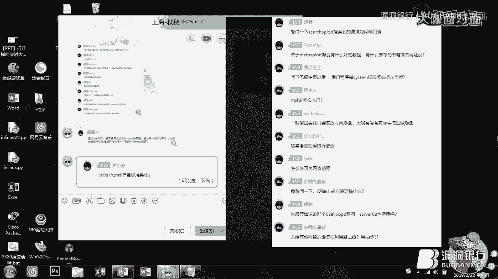

斗黄庆，我是在那个AGR大佬那里，如果有需要我可以叫他。把那个AIP还有那个。主机全部发送到一个我的网盘里面，然后发给你们。内网内网端口转发，就是为了应对防火墙的。因为有一些A7。

因为有些路由器做的一些。防火墙条纹它是不允许你，可能是不允许你访问某些特定端口。这多口音射软件有很多，比如说花生可。而些国外的一些软件也是可以用。利用这个索取密码的话，可以是直接上传到对方的服务器。

然后直接在西限D里面进行一个利用。嗯。还有人问有没有什么书可以推荐一下。肯定是吸引言从入门到入口。嗯。不多嘴了。😊，就是说你应该要选着你的目标去看一些书，而不是说问问一下看什么事什么的。因为现在都是在。

因为计算器技术它更新的速度其实是很快的，每一年每一年都有不同的东西。就跟苹果一样，没半年就会更新一次。所以我们可以在网上看一些新出来的一些文章，然后我们去分析，去自己去动手时间去做一下。嗯。

我以为你要说网络安全法就挺好的。我给你截一段现在最新的聊天区的内容，你看有没有想要回答的问题。然后小伙伴们还没有提提问呢，就退提跟进跟技术性相关的一些问题吧。如果不提的话。

就可能之后要另外到群里面交流了。不要错过跟大咖互动的机会。那个傻狍子，你是认真的吗？主要是想的对，如要是想写些配的货，也就是。可能是歇口，因为在NSF里面。因为NSF是没杀的嘛。

所以他也会被杀的软件烧的很严重。所以你如果想自己去开发一些配load的或者是ci口，你你可以去。嗯，就是去FB上面好像是有一个公开课，上面有一个ci口windows下的需口一个冰写。

当然你你需要一个戏员，还有一个会宾的一个基础。还还有人问你们真的会吃福建人吗？是的，有时候我们还会抓一个四川人来来吃一下，改善一下口味。😊，这么认真的吗？😊，吓死我了。😊。

那看大家已经开始有点闲聊的意思了，我们要不今天提问就先到这吧。可以啊对，大家如果后续如果还有问题的话，可以在群里面。找大咖交流啊什么都可以。那下面我们就来今晚最激动人心的。

不是不能说最激动人心的比较激动人心的这个赠书福利环节。那今天要送的这本书呢是大咖亲自挑选的root kit影遁攻击技术及其防范。那终ry可以说一下为什么要送这本书吗？

因为刚才讲的几乎都是关于一个windows，因为然后这本书它是针对一个linux的一个环境。😊，嗯。好的。那下面我们请周位大咖来选幸引观众吗？我要选一个幸运的小孩来吃。好的。

那大咖下面就要选一个幸运的小孩来吃了。然后大咖把你选中的新儿，一会儿选好之后，把他的ID嗯报一下。嗯，我这边给他设置成吸引观众的这个发一个通知给他。😊，那给以留下联系方式嗯。抽奖的吗？

原来是呃可以选自己吗，不可以选那。😊，你会有另外的那个纪念品的，你不要激动。😊，雨中人对吧？对。好的，我来找一下。雨中人。那恭喜这波雨中人成为今天会被大咖吃掉的幸运幸运伙伴。嗯，请你根据直播间的提示。

留下联系方式，我直播后直接找我秋秋来兑奖都可以。所以大家这次啊你说所以说银行那边会不会把可不可以把它包邮，然后做到我这边，我要去组一顿。😊，可以。😊，可以的那大咖这次没有送成功网络的选法，有点遗憾吗？

其实我最开始是想说那个女装的。想搜女装的啊，这女装大佬从入门到精通，对吗？对啊，可以可以，这本这个东西好电子版我是有的。😊，哇，真的假的，里面写的我好像有吓到过，然后里面还写的特别正经。😊。

然后如果有人想要的话，可以私聊我一下，我找好看。😊，好的，那今天的直播的。😊，整个内容大概就到这边结束啦，我们再次一起来感谢一下jo易大咖的用心准备和精彩的演讲。那希望本期内容对大家都能有所帮助。

非常感谢大咖的分享精神。如果你也想回顾本期直播的话，我们在下周五会发布录屏。大家可以关注一下官网的更新或群里通知。那今后大家也可以多多关注jo易大咖和北极嗯边界团队。😊，然后也可以多关注。

就带看他自己今后的一些动态呀发展或者其他的分享。那最后也感谢一下所有参所有参与直播的观众伙伴。如果你也想像带咖一样来直播分享的话，可以找我报名。大咖面对面是一个展示白毛风采的舞台，不具年龄不畏资立。

只要你有才华敢分享，都可以找我报名来登台展示。那想进群交流的话。😊。

就是可以点页面底部的加群链接，本直播间的地址固定，大家每周五都可以加入进来看直播。好，那今天直播要结束了，今天大家点赞都很很热情，点到4万赞了，为什么大家是不是看直播没事都能刷赞呀？

可可能是我请可能是我请来的演员。😊，哦，可以可以，那今晚直播我们就到此结束了，感谢大家参与，感谢大咖的分享。那大咖面对面，周五大点见，我们下周再约吧。那大咖周周宇这边可以断一下推流了，辛苦了。😊。

🎼I still't remember。🎼Love in the downtown。 You set me on fire when I'm by your side。

🎼Ting me higher before you don't if you go down。🎼Now you see you want to get away。

🎼What has sent me all the way， but can。🎼留给苦涩吐。🎼那我。🎼can born to get a fade into。🎼我只有。🎼Me babyby。🎼F。

🎼入いちゃ。🎼美丽。🎼会色彩。🎼Yes。