# 课程 P1：打开横向渗透大门 🚪

在本课程中，我们将从一个攻击者的视角，学习内网横向渗透的基本流程、核心技术和常用工具。课程内容涵盖信息收集、内网拓扑分析、域控制器攻击以及后渗透阶段，旨在帮助初学者理解内网安全的脆弱点。

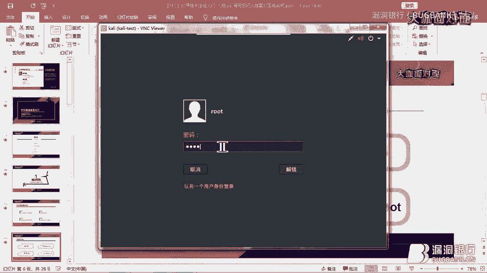

---

## 概述 📋

横向渗透是内网渗透的关键环节，指在攻陷一台内网主机后，以此为跳板，进一步攻击和渗透网络内部其他主机的过程。随着APT攻击日益频繁，内网安全常被忽视，导致防御薄弱。本课程将模拟一次完整的横向渗透攻击链。

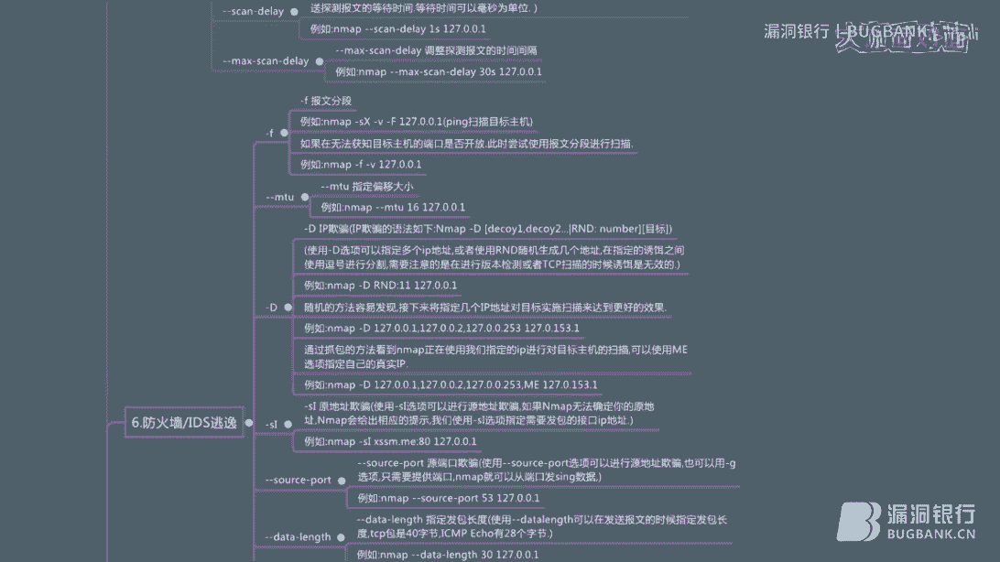

---

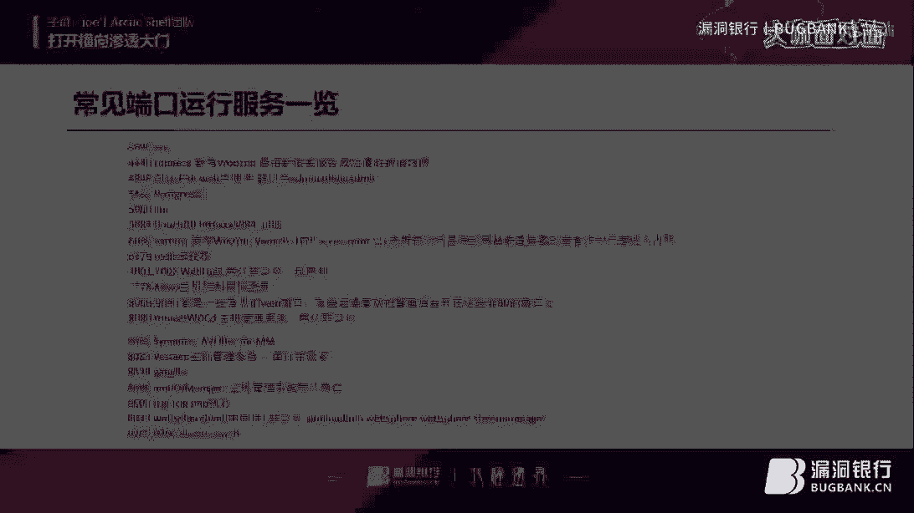

## 一、信息收集 🔍

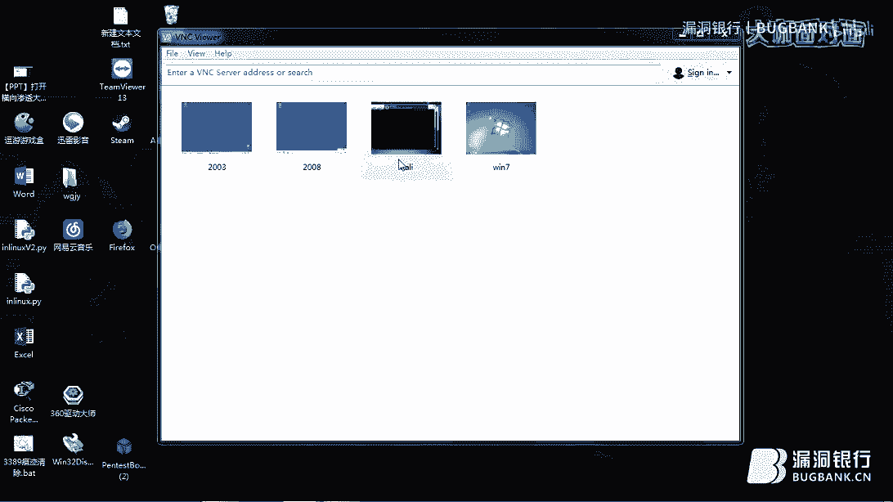

信息收集是渗透测试的第一步，目标是尽可能多地获取目标网络的信息，为后续攻击做准备。常见的信息包括开放端口、操作系统版本、域名和组策略等。

以下是常用的信息收集工具和命令：

*   **Nmap**：最著名的网络扫描工具。
    *   `nmap -sV <IP地址>`：探测目标IP开放端口的服务及版本信息。
    *   `-Pn`：跳过主机发现（Ping扫描），用于绕过某些防火墙策略。
    *   `nmap 192.168.2.0/24`：扫描整个C段（192.168.2.1 到 192.168.2.254）网络。
    *   `--exclude`：排除某些IP地址不进行扫描。
    *   `-O`：猜测目标主机的操作系统。
*   **Searchsploit / Exploit-DB**：漏洞数据库，用于搜索公开的漏洞利用代码（Exploit）和概念验证代码（POC）。
*   **SPLOIT**：一个漏洞扫描工具，可以离线使用。基本用法为 `sploit <参数>`，例如 `sploit windows smb` 可用于扫描Windows SMB服务漏洞。

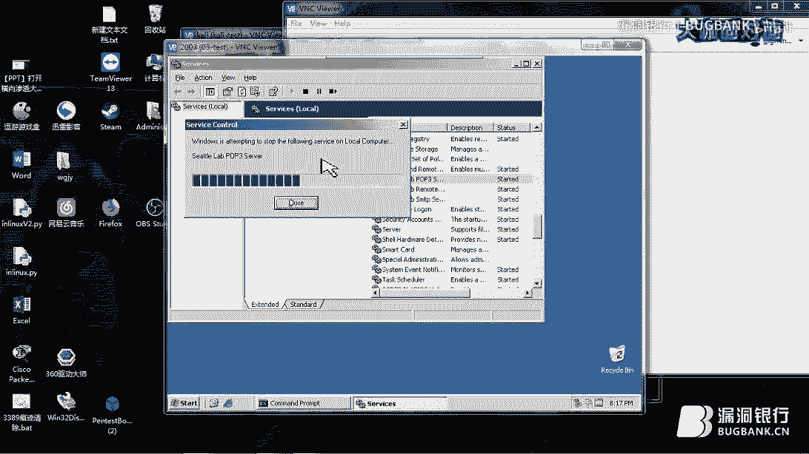

上一节我们介绍了信息收集的基本概念，本节中我们来看看如何分析网络结构。

---

## 二、内网拓扑分析 🗺️

了解目标网络的结构是制定有效攻击策略的基础。在横向渗透中，我们通常需要区分不同安全区域，例如DMZ（隔离区）和内网。

本次演示的拓扑结构如下：
*   **攻击者机器**：用于发起攻击的计算机。
*   **DMZ区服务器**（如邮件服务器）：通常可被外网访问，但访问内网资源受限。
*   **内网办公区主机**：员工日常使用的计算机。
*   **域控制器（AD）**：内网的核心，管理所有域内用户和计算机。

攻击思路是：首先攻击暴露在DMZ区的服务器（如存在漏洞的邮件服务器），获取其控制权后，将其作为跳板，进一步渗透至内网办公区，最终目标直指域控制器。

在理清网络结构后，下一步就是尝试获取第一台主机的控制权。

---

## 三、获取初始控制权（以邮件服务器为例）🎯

我们假设通过信息收集发现一台位于DMZ区的Windows Server 2003邮件服务器，开放了POP3服务（端口110）。由于旧系统缺乏内存保护机制，我们可以尝试缓冲区溢出攻击。

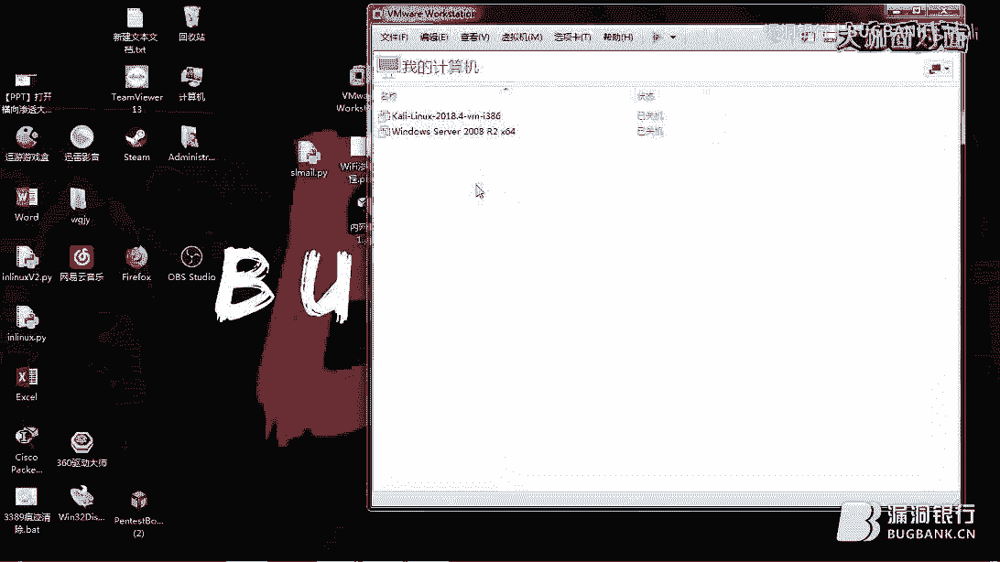

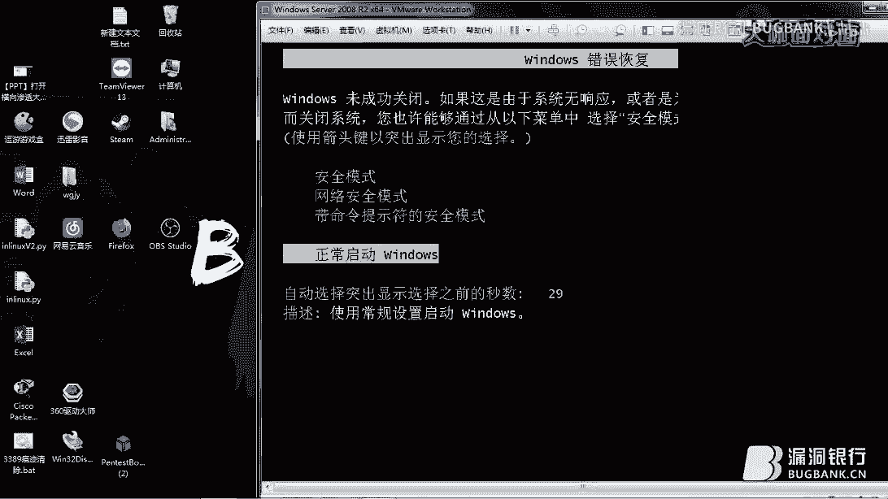

攻击过程如下：
1.  **漏洞发现**：使用Searchsploit搜索POP3相关漏洞，例如 `searchsploit pop3`。
2.  **漏洞分析**：选择一个合适的漏洞利用代码（Exploit），分析其工作原理。通常Exploit会构造特定的数据包（Payload）发送给目标服务，触发溢出并执行我们预设的Shellcode，从而建立反向连接。
3.  **利用漏洞**：使用Metasploit Framework（MSF）这类集成化工具进行攻击。
    *   启动MSF：`msfconsole`
    *   搜索并选择漏洞模块：`search pop3`，然后 `use exploit/windows/pop3/<漏洞模块名>`
    *   设置参数：`set RHOSTS <目标IP>`
    *   执行攻击：`exploit`
4.  **建立后门**：攻击成功后，会获得一个Meterpreter会话。可以在此会话中添加用户或直接提取系统权限（如 `getsystem`）。

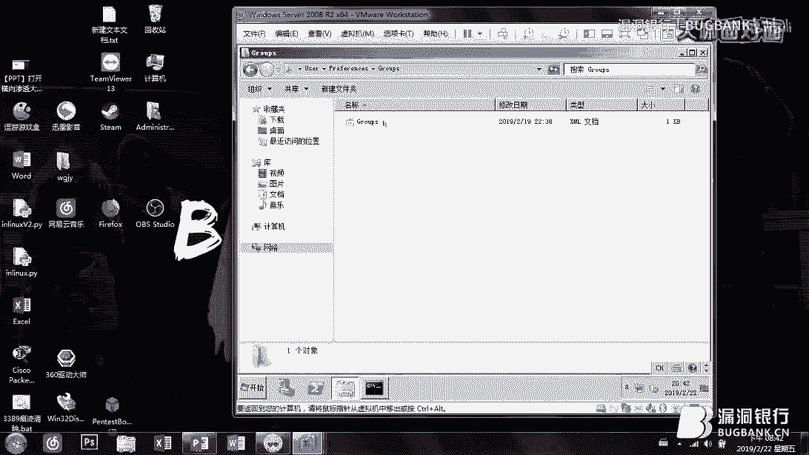

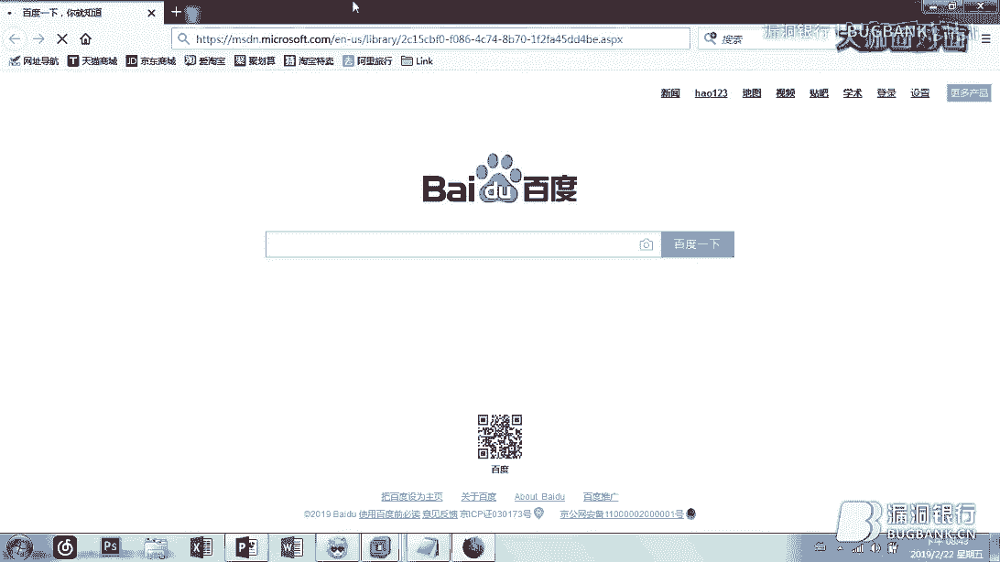

成功控制DMZ区服务器后，我们便拥有了一个进入内网的“桥头堡”。

---

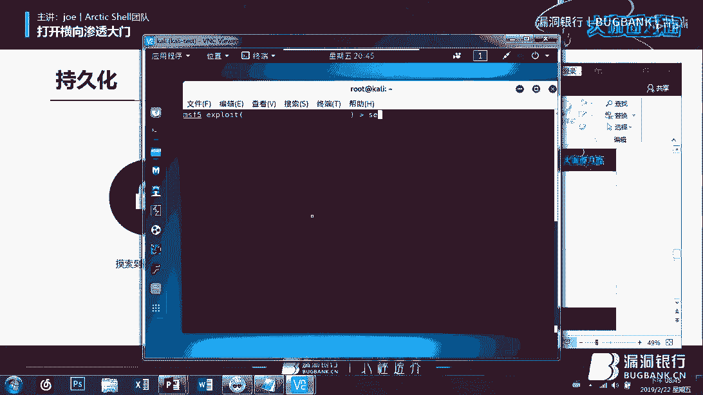

## 四、横向移动与域渗透 🏹

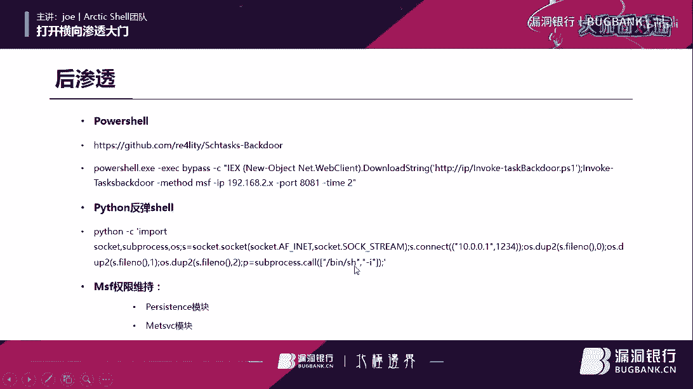

获得初始立足点后，真正的横向渗透开始。目标是访问内网其他网段并最终控制域控制器。

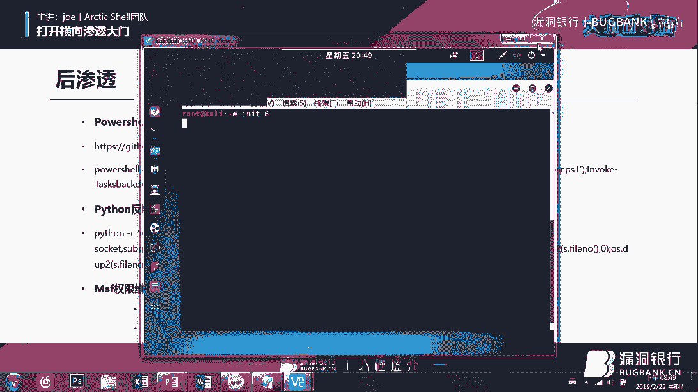

### 1. 路由与信息收集
*   在已控制的服务器上添加路由，使攻击机能够访问内网其他网段。在Meterpreter中可以使用 `run autoroute -s <内网网段>` 命令。
*   利用已控制的服务器作为代理，扫描内网其他主机（`db_nmap`）。
*   从邮件服务器中窃取邮件，分析内容，用于构造针对内网员工的钓鱼攻击。

### 2. 钓鱼攻击获取内网主机权限
*   针对内网员工，可以构造恶意Office文档（如利用CVE-2018-0802等漏洞）。
*   在攻击机搭建伪造的服务器，生成恶意文档链接。
*   通过钓鱼邮件诱导员工点击，从而在其计算机上执行Payload，获得另一台内网主机的控制权。

### 3. 攻击域控制器（AD）
域控制器是内网的“大脑”，存储着所有域用户的账户密码哈希。攻击方式多样：
*   **GPP（组策略首选项）漏洞**：早期域策略中可能包含加密的密码，但加密密钥已公开，可轻易解密获取明文密码。密码文件通常位于域控制器的 `SYSVOL` 共享目录中。
*   **Pass The Hash（哈希传递）**：在无法破解密码明文时，可以直接使用用户密码的哈希值（NTLM Hash）进行身份验证，横向移动到其他主机，包括域控制器。MSF中有 `exploit/windows/smb/psexec` 模块支持此攻击。
*   **令牌窃取**：在已获取高权限的会话中，可以窃取其他用户的登录令牌进行冒充。在Meterpreter中使用 `incognito` 或 `steal_token` 命令。
*   **Mimikatz**：一款强大的密码提取工具，可以从内存中提取明文密码、哈希、PIN码等。命令如 `sekurlsa::logonpasswords`。

---

## 五、后渗透与权限维持 🛡️

在完全控制目标后，需要巩固成果，维持访问权限，并清理痕迹。
*   **权限维持**：安装持久化后门，如Meterpreter的 `persistence` 模块，可设置开机自启、定时回连。
*   **信息收集**：导出密码哈希（`hashdump`）、收集敏感文档、探测网络共享等。
*   **权限提升**：如果当前权限不足，需进行本地提权，可利用系统未修补的本地漏洞（如MS17-010）。

---

## 六、拓展：无线局域网（WLAN）安全 ⚠️

内网安全不仅限于有线网络。不安全的无线网络也是重要的入侵入口。
*   **WPA/WPA2破解**：通过抓取握手包进行离线暴力破解。
*   **弱口令**：许多家庭或企业路由器使用默认或简单密码。
*   **物理设备攻击**：如使用改装过的ESP8266等设备，创建恶意热点进行中间人攻击或断网攻击，诱导用户连接。

---

## 总结 📝

在本节课中，我们一起学习了横向渗透的完整流程：
1.  **信息收集**：使用Nmap、Searchsploit等工具探测目标。
2.  **获取初始立足点**：通过对外服务的漏洞（如POP3）攻陷第一台主机。
3.  **内网拓扑探测**：分析网络结构，明确攻击路径。
4.  **横向移动**：利用钓鱼、漏洞利用、Pass The Hash、令牌窃取等技术，在内网中逐步扩大控制范围。
5.  **攻击核心目标**：重点攻击域控制器，利用GPP漏洞、Mimikatz等工具获取域控权限。
6.  **后渗透与权限维持**：安装后门，收集数据，巩固访问。

整个攻击链环环相扣，揭示了内网中因配置不当、补丁缺失、安全意识薄弱而存在的诸多风险。防御者需要从网络隔离、强密码策略、及时更新补丁、监控异常流量等多方面构建纵深防御体系。