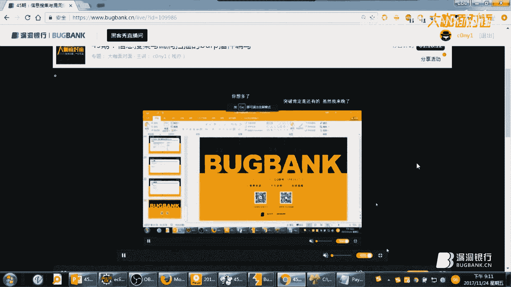

# P1：【录屏】提升挖洞效率的大杀器-信息搜集与漏洞扫描的burp插件编写——大咖c0ny1 - 漏洞银行BUGBANK - BV1eA411N7wR

为知识而存，应记事而生，小伙伴大家晚上好，欢迎参加漏洞银行信息安全技术讲座，大咖面对面，今晚是咖面的第45期，我是主持人念念，今晚嘉宾我们请到了大咖才艺，带来主题为提升挖洞效率的大杀器。

信息搜集与漏洞扫描的bug插件编写的讲座，提高挖洞效率，一个bug就够了，那本期直播分成三个环节，首先是才艺的主题演讲，接着行长问答环节是给大家答疑解惑的时间，最后是大咖赠书环节。

会选出一位最认真听讲的观众，送出大咖精心挑选的一本黑客攻防技术宝典，web实战篇的第二版，好好听讲，没准就被幸运砸中哦，话不多说，下面就有请大咖才艺开始今晚的讲座吧，各位漏洞银行的小伙伴们。

大家周五晚上好，我是财力啊，一个喜欢拖着1664边进行漏洞挖掘的小菜，主要专注于呃漏洞挖掘漏洞，利用漏洞修复和漏洞复现，喜欢一件和漏洞有关的一些事物对吧。

那么我这次给大家带来的那个议题是，笛声挖洞效率的大杀器啊，信息搜集与漏洞扫描的UPP的一个插件的编写，在开始我们一敌之间了，好我先说明一下哈，我有点口音对吧，有点羞涩，所以呢各位老司机朋友啊。

可以尽情吐槽，但是拒绝调戏好吧，那么开始我们啊下面的分享，本次分享的话呢啊主要是有六个方面，首先呢先讲一下那个编写的意义，然后呢再弹一下ABI，最后呢开始开发之前的一些准备，对吧啊。

然后呢就会重点说一下两个例子，这两个例子呢是我们这次这次分享的一个重点，然后最后呢再给大家说一下拓展，好我们先来说一下为什么要编写插件吧，啊我们做一件事总归要找到意义对吧。

啊当下呢Buff秀作为那个web安全响当当的神器啊，在那个代码审计啊，漏洞挖掘啊，渗透测试各个方面得到了广泛的应用对吧，但是啊我们啊真正用到它的八的功能，可能只有20%。

它真正强大之处远远不止于现在这种功能，就是说如果说呢你目前在漏洞挖掘的时候对吧，遇到瓶颈了啊，不能更加高效，不能更高危，那么我觉得是时候试着去学写一下插件，解读一下bug的啊。

封印看一下你是不是能突破这个瓶颈，能不能啊，在漏洞挖掘上更加高效，更加高危呢，当然了啊肯定要有一些呃理论的知识去铺垫，对吧，嗯由于我们时间关系啊，这里呢我们就不再深入的去说一下。

一些ABI的一些相关的知识，所以呢大家可以啊线下去去查阅一下啊，这里我放了一下官方的一些，ABI的一些链接啊，嗯当然啦英文不好的同学的话呢，可以看一下中文的文档，这里有ABI的上下篇啊。

是之前啊乌云上的大神写的，看了之后呢，你就能对每一个接口有一个清晰的认识啊，下面这边啊API的那个分类与归纳呢，啊是把把一些API做了一个分类，然后进行一个归纳，让我们知道啊各个ABI之间的一些关系。

对吧啊，这样的话呢在插件的编写当中，你就知道啊，你的插件需要实现什么样的API，实现什么样的功能，行啊，我们在开发之前呢，我们先来啊说一下开发插件的一个思路，我不知道在座的各位小伙伴啊。

之前是否开发过插件啊啊在在开发插件之前，我们肯定要思考呃，我们插件要实现什么样的内容对吧，需要什么的数据如何去处理，如何写四对吧，最后呢在这两步之后，我们再来确定一下，确定呀啊要实现哪些接口就拿啊。

提前做一个剧透吧，就是我们这次要编写的插件，是信息搜集的一个小插件，对吧好，那功能就是信息搜集了对吧，那我们需要什么的数据呢，我们需要的是啊留过bug当中的响应的数据包，对不对。

我们获取到这个响应的数据包了之后，如何处理呢，自然是需要去用正则对啊，响应的数据报告当中提取我们需要的一些信息，对不对，然后呢如何显示啊，自然是要在啊BARBU的那个标签页那里，新增一个标签页。

然后呢用啊表格的形式显示出来啊，那解决完以上以上两步了之后呢，我们就要开始决定我们需要实现哪些接口，比如说获取数据，我们获取的是响应数据包的数据，那么我们就可以实现一个啊HTTP的监听器，这个接口。

然后如何处理，这个是我们核心的代码，就是写逻辑处理的代码，对不对，如何显示，刚才我们说了啊，我们这个插件是要显示一个啊飘间对吧，那肯定要是实现一个i tab的接口对吧，所以呢把这三部啊梳理完了之后呢。

我们就可以开始啊插件的编写，好由于我们本次主要以动手为主啊，所以呢我们现在开始准备开发之前的一些准备，啊啊啊就是我们选择的语言是JAV，当然刚才有小伙伴已经提出来了，说为什么不用不用Python啊。

Python作为我们web安全啊最强大的语言对吧，为什么不使用我们最擅长的语言呢，啊这里我告诉一下大家为什么啊，由于啊8P5它本身就是用加法来写的，所以加法它是一种强类型语言。

而Python它是一种弱类型语言，所以呢如果说你用Python来写的话呢，可能会遇到什么样的问题呢，经常报错，而且这个错误有可能你都不知道，为什么他会报错，使用加法可能就不会出现这些莫名其妙的问题。

第二个问题是啊，加使用加法的话呢，运行速度很快，使用Python就要慢一些了对吧，最最重要的还是如果说你使用java的话，它有提示的，你要实现什么样的接口，这个接口有什么类啊，需要什么样的类型对吧。

它都有提示，这样的话呢，呃我们啊编写插件相对来说要容易一点啊，大家可能都学过Python，但有的小朋友啊，有的小伙伴可能没有学过加法对吧，无伤大雅，我也是这样，我在没有写插件之前。

只是知道加法这代码是什么意思，但是没有写过，但是我刚学一个月，就现在基本都能用了对吧，所以呢各位小伙伴肯定也可以，很好的利用加法来开发插件，那我们用的那个IDE是eclipse好。

现在我们先来把基础的框架代码先写一下，我先把是简写的代码给删掉好吧，好我先给大家先写一下啊，一个插件的框架，我们学校新的东西都是hello world是吧，然后呢我们需要把一个包导进来。

哎哟这里我已经导出来了，就我先把它删掉，我先给大家，做一个小小的演示吧，方便没有学过学过插件编写的小伙伴，大概是熟悉一下吧，这时候我们把这个包写好了之后，这个这个包的名字必须为bug。

然后呢我们需要到web shoit的这个里面，把我们要的一些ABI文件，也是也就是接口文件对吧，先导出来导到这里啊，啊当然我这已经导出来了，我就不导出了好吧，各位小伙伴下去可以自己导出。

然后呢我跑到那个目录啊，刚才我打到这了，好，我全部选中，把它拖到8show里面，把它拖到eclipse里面，然后呢，我们实现一个入口类，这个入口类啊，必须要实现，然后呢入口类必须要实现一个，一个接口。

然后呢我们先实现一下这个接口的方法好吧，这个类必须为啊bug external对吧，而且必须要实现这样的一个接口，这个是8U啊规定的，如果说你不按照它的规定的话，自然就无法调用了对吧，写错了啊。

然后呢我们啊为了后面的方便呢，我们先把回调对象声明一下啊，这样的话方便我们后面调用，然后呢我们还要声明一个辅助类，辅助类是一个小工具箱啊，到时候呢我们会经常用到它，去做一些各种类型的转换，还有。

还有各种各样的操作，然后呢为了后面的调试输出，所以呢我们必须要声明一个，声明一个输出流，这里报错是因为没有那个rain的，没有引入包，这回我们开始来负责啊，回调对象把传进来的回调对象复制一下。

然后呢我们的辅助对象，如果回调对象来获取到辅助对象，然后呢再声明我们的啊对，再给我们的那个输出流入，负号值，啊我们在口碑获取，获取我们的输出源，也就是我们的这个地方，也就是我们的output对吧。

也就是输出到哪里了，然后自动刷新，OK然后我们先先让输出先输出一个，先输入一个字符串了，hello对吧，Bug b，再给我们的这个插件命个名吧，好这回我们啊一个框架的代码就已经写好了。

然后我们先来编译一下宝宝，Hello，点jr，这回我们在，我们把我们的那个external的这个面板弹出来，为了后面方便去浏览了，然后我把这个勾取掉啊，我先把之前加载的一些插件给干掉，加载好我们的插件。

hello啊，刚才我们是hello it好，是不是在我们的output这里显示了我们的hello bug，bug对吧，好我们的框架代码是否已经写完了对吧，这时候，我们再来思考一个问题啊。

在我们的第一个例子之前，我们先来思考一个问题啊，为何别人总是比你挖到更多更高危的漏洞呢，我相信呃，在座的大部分小伙伴，可能都会去思考这样的一个问题对吧，为什么别人总比你挖到更多更高位的漏洞。

实际上啊嗯信息搜集是，渗透测试当中的第一步，对不对，同时也是很重要很重要的一步啊，很多啊很高危的一些漏洞啊，其实都是基于耐心的，细心的全面的信息搜集，当然啊这个已经是老生常谈了对吧。

但是我们都知道这样的道理，但是还是没有耐心去做，归根到底就是一个懒字嗯，我之前也是这样的，我之前有一个学长啊，我通过跟他交流吧，发现我俩的技术实际上是啊差别不大对吧。

但是啊在对同一个系统的进行漏洞挖掘的时候，我就发现他总能给我挖掘到更高危的漏洞，这让我苦闷不已啊，而且啊他是有女朋友的啊，啊周六周呃，周天对吧，人家就关上电脑，就陪女朋友去逛街了对吧。

然后呢啊周一到周五回来再进行漏洞挖掘啊，我呢我是这样，我是没女票吗，那我肯定是周一到周天对吧，哇哇哇哇哇，但是啊后面发现啊，他就算是周末周天没有挖，但是丝毫不影响人家比我挖到更高位。

我就一直在思考这是什么样的原因呢，后来我实在是忍不住了，就约他出来吃顿饭对吧，那毒贩估计也就120块大洋碗，就问他说学长啊，咱俩嗯我感觉也差不多啊，为什么你总比我挖挖的漏洞更更深呢，你说你不要告诉我。

你有女朋友啊，然后学长就说了四个字啊，信息搜集啊，也就是说我的120块大洋买了这四个字，信息搜集啊，不过现在想想啊啊这个信息搜集确实很重要，嗯我相信大部分大部分的同学都觉得啊，信息搜集有点浪费时间对吧。

我想上来我就直接漏洞挖掘，直接直奔目标，但是我们来思考一下，这样很不好，他而且啊大部分人啊收集啊，那个信息搜集是有三个缺陷啊，我给大家列了三个缺陷，第一个缺陷，文件类型实际上很多啊。

但是我们只局限于HTML页面对吧，信息不仅仅存在于HTML页面，它有可能还保存在cs s的备注那个注释里面，JS里面JASON这样的数据文件格式里面对吧，但是我们一般都是在HTML页面上。

第二个信息类型，信息类型收集不全，这里我列了部分啊，不可能全部列出来，要不然就满屏了啊，QQ啊，邮箱对吧，电话等等，有的有的小伙伴可能就收集QQ邮箱啊，然后子域名完了，有的呢QQ邮箱啊，再来一个呃。

如果说有报错，显示物理路径啊，再收集一下，玩了对吧，没有制作一个列表，就是一个比较完善的列表，把各种啊漏洞啊，把各种信息类型全部归纳好，然后呢一遍一遍的去找对应的去找对吧，收集不全。

然后呢第三个就是页面太多了，一个系统可能就有2~30个页面，多的话可能要达到到达上百个页面对吧，难道我们要一个页面一个页面去访问吗，去收集吗，这个自然不科学，而且也达不到，啊既然问题都知道了对吧。

那怎么去解决这样的一个问题呢，嗯那第一个啊只局限于HTML页面对吧，这个问题好解决啊对吧，我们可以写一个插件啊，坚定我们的bug的那个每一个数据包，这些数据包里面呢可能就包含有什么包含着HTML。

CSSS啊，JS啊，JSON啊，甚至图片的数据都有对吧，他留过他的那些数据非常的丰富，我们要从这些里面啊挖掘到我们的信息，然后呢信息类型的话不全这个问题呢，那我们是不是可以把每一种信息类型对吧。

我们全全部都写好一个正则对吧，等信息啊流过的时候呢，我们就让插件一一的去匹配，一个页面不旺，一个页面不漏啊，去提取啊，是否就可以去解决呢，啊页面众多，无法依据收集这个问题的话。

现在bug show里面其实已经集成了爬虫对吧，我们只要把，web系统当中大部分的页面啊，去做一个了解去浏览一下，然后呢用爬虫去自动化去拔取，对吧啊，基本能解决这个问题行。

那我们已经知道如何去解决这样的一个问题了，那我们来思考一下我们这个插件如何去写呢，如何去设计呢，这里呢我给大家理啊，理清了一个流程啊，就是首先啊这边是我们的代理模块和代理套，套件和拔虫套件对吧。

然后呢他会先发送一个请求数据包，然后发送到服务器，服务器会响应，对不对，这回呢我们插件啊，我们插件监听到这个数据包的错了啊，然后呢第三步就用正则去检测好，我们检测检测完了之后呢。

如果说有我们需要的一些信息，第四步显示到界面，对不对，显示到界面了之后，再让这个响应宝返回到各自的套件当中，这是我们整体的流程，再来看一下内部的流程好吧，内部的流程的话呢，就是我们注册一个签订器。

然后去签订代理和爬虫，这两个套件的一些信息啊，就说然后呢再用正则去匹配啊，当然我们这个例子啊，我们给大家举了一个例子，是我精简过的一个代码，所以呢我们不会去匹配过多的信息，只匹配三种信息。

QQ电话和邮箱啊啊后面对应的正则哦，已经写在这了，然后呢他就会去正则匹配对吧，是否存在信息四显示到界面，如果无法匹配对吧，继续坚定下一个信息嗯，不断的循环是这样的，啊界面的话呢嗯大概给大家截了个图啊。

我们最后插件生成的界面是这个样子啊，就是有一个标签啊，一个表格表格第一列就是信息的类型表格，第二列信息的内容，表格的第三列啊，就是这个信息是在哪个页面获取的，同时还来个右键菜单呢，就是可以轻工。

可以去虫，可以保存啊，当然保存你想拿这些信息去干嘛啊对吧，这个我相信每一个小伙伴都有自己的想法对吧，你去做一个社会工程学字典呢对吧，各种各样的都行，这个不在我们的讨论范围，真的很好玩，然后啊。

我们已经把把刚才的一些思路给捋清了啊，所以现在试着去写一下好吧，给大家做一个小小的演示好，这是我们的框架代码啊，我们拷贝一份，然后来写我们今天的第一个插件，Get it for，怎么有了呀，我看一下啊。

哦我我先把它删掉，应该是我之前没删干净啊，彻底删除一下啊，从头给大家啊写一遍好吧，搞对，唉呀搞错了啊，这里终于明白，Get in f，没选好了，然后呢，我们只要在这个框架代码当中，写好我们的代码就行了。

好那我们先把我们啊插件的名字改为get info，info没选，把我们输出的语句也改一下吗，行我们现在照着我们的PPT捋捋，好的那一个啊，首先呢我们先获取这两个套件的啊，发发出去的请求的响应响应包。

对不对，所以呢我们这回要实现一个接口，实现什么样的接口呢，实现一个HTTP的监听器，也叫AHTTP的listen这样的一个接口，实现这样的接口了之后，我们需要实现这些的这个接口的方法，有一个方法哦。

哦我在说这个方法之前，我们先，注册一下这个监听器，你不注册的话是没有啊，那个up是不会去调用我们这个插件的，这个是我们监听器的必须要实现的一个方法，这个是这个数据是由哪一个工具传过来的。

这个数据包是是不是请求数据包呢，然后呢这个参数是请求响应数据对象，所以我们看一下好，第一步是要获取一个响应数据包，对不对，那我们来个by的类型接收一下这个响应的数据。

我们从我们的对象当中获取response，这个数据包，也就是我们的响应数据包，获取到这个响应数据报道之后，我们应该怎么样呢，应该用正则去匹配对吧，啊当然能啊，为了节省大家时间了。

这里我那个正则就不自己写了啊，我事先帮大家写好了，所以我只要，拷贝一下，把正则声明好啊啊，先说一下这个我们的这个正则，正则的就是我这边设三维数组啊，这个数组第一列，就是这个正则要匹配的信息类型。

比如说这是QQ对不对，QQ对应的正常，这是邮箱，这是电话对吧，大家可以去匹配，可以写更多的政策啊，现在我们来写一下，正则已经拿到了对吧，哦对了，我们还要先过滤一下这个数据包。

啊啊我不能所有的套件流过的数据包都要，我们要的是什么，我们要的是看一下，要的是代理对吧，要的是代理和爬虫，所以呢我们先先判断一下，首先啊这个工具必须是啊，代理代理的那个flag是工具的flag。

是那个四或者是拔虫，对不对，等于八爬虫是FX8，这个东西去哪查呢，他一定爱问打，大家下去可以试试，然后同时我们要的是什么，我们要的请求包，我们不需要关注，我们要的是响应包，所以呢这个信息，响应包。

所以用PC，把这搞不起，啊我有点强迫症了好吧，我承认，把这个写好了之后，我们获取到一些响应数据包了之后，看一下怎么做，郑州开始疲惫了，对吧啊，我们正则是一个数组嘛对吧，所以呢必须要便利啊。

不能直接拿出来，嗯正则看，电力，好变绿了之后，这回我们就先，类型取出来吧，先把类型取出来，类型的下标是什么，类型的类型是第一个QQ嘛，对吧好，我们再把匹配正则吧，正则正则是重则，下标是100。

好我们取出来了之后，这回我们开始嗯开始去匹配，匹配之前呢，我们先编译一下这一个正则表达式，应该是company，然后呢把我们的正则放进来，同时呢我要求啊，我要求的是匹配的时候呢，大小写不区分大小写。

匹配完啊，编译完了之后就可以开始匹配了，然后开始匹配，然后匹配的信息是什么呢，匹配的是我们的响应数据包对吧，从这个响应数据包当中提取数据，看一下这个报错应该是没有引入包，这里错是因为类型不对啊。

我们这个还不能是嗯by的类型啊，我们string类型啊，但是我们这里返回的是spider it，所以呢我们要用刚才我们写啊，刚才我们上面啊已经声明了啊，辅助类好，辅助对象，辅助对象。

然后来进行这个数据的格式的转换，好了没有错了对吧好，匹配完了之后对吧，我们开始什么，我们开始把这个结果显示嘛，对不对，把这个结果显示啊，不玩，用个while把它遍历出来，可能匹配可能会匹配。

有多个结果吗，Nit i，啊然后用我们的输出流只会用到我们的输出流，把它显示出来，我的第一个类型显示的是类型啊，然后呢后面对应的信息，对吧，显示信息好了，啊核心的代码简略的写完了，这是特别的精。

简过之后的代码好吗，比较好理解啊，我先来编一下啊，GA卡，行我们先拿我在本机搭建的一个，一个小靶机啊，这个好，我先先给大家介绍一下，我在本本机搭建的一个小板机的那个，首先啊这个页面它会显示的是一个电话。

对不对，我们打开源码cs s里面有什么有QQ对吧，备注的QQ，然后关掉JS里面有什么JS里面有的是邮箱啊，好吧，这三个星期它隐藏在了三个文件当中对吧，我们看一下我们的插件能不能去发现它好吧。

我先来抓包啊，好这这三个已经进来了对吧，你先看啊，这些文件，这回我们把那个我们的插件加载一下，先把我们的第一个例子给关闭了，把我们的插件引进来好了，它已经显示了，看一下我们鉴定的那个接口注册了没有。

注册好了，然后啊这位大家注意啊，一下，如果说匹配上信息了之后，它会在这里显示出来啊，我这边刷新一下好吧，好了，他是不是显示电话了，对吧啊，可能有的小伙伴有问问，不是还有QQ吗，还有一个邮箱嘛，对吧。

呃这个可能可能啊，可能应该是啊，我有历史记录啊，我把一些数据清空掉，因为JS和CSS浏览器会默认下载下来，第二次去请求的话，他不会，他不会再请求这个JS和CSS的数据，我把它清空掉了啊。

这里我也清空一下啊，好了，这回是不是拿到了啊，电话对吧，QQ邮箱对吧，拿到了啊，好我们拿到了这个数据了之后，下面的一步是什么，是肯定要显示在我们的界面了吧，对吧嗯，显示在这总归是不太好的。

我们肯定要显示在这像套件这样的一个界面，对不对，当然了，显示不是我们讨论的关键了，所以呢我事先给大家写好了如何显示对吧，来给大家解释一下吧，这个还是我们的正则对吧，界面是这个是我们实现哈，我们的菜单啊。

菜单显示的响应的事件，然后这个是我们要在界面上显示一个表格，表格里面显示数据嘛对吧，这个呢是让我们的我们自定义的界面，使用的是8P的风格就显示出来，不然界面会很突兀啊，这个是我们刚才写的核心代码啊。

然后呢这个是我们标签页的名称，这个是标签页啊的自定义的控件，然后呢这个是我们表格的模型，然后呢这一个是，信息的实体类啊，把这些写好了之后呢，我们就可以在这里不用再用输入流输出了。

而是显示到我们的那个8P的界面上，我们的自定义标签里面啊，之后呢这个代码会分发给大家，大家可以去看一下具体是如何显示到界面上的，好吧，我们只讲一些比较核心的一些代码，这里可以给大家编译一下。

然后看一下效果吧，我覆盖掉之前编译的那个插件的jr，好更新加载就行了，重新加载，是不是显示了一个标签是吧，然后这回我重新把数据清空一下好吧，搞错了，然后刷新了，它就已经显示在这了对吧。

然后呢你可以清空掉去重，因为有两个重复的嘛，当然你可以导出来啊，导成一个TXT对吧，这些都是可以的，所以后面的话呢我后面用了这样的一个插件啊，在做那个渗透测试的时候，我只要把这个插件挂在后面啊。

让它在后台运行的对吧，然后呢我就去访问我们要渗透的网站对吧，嗯了解一下大家大概的那种呃，那个网站的呃功能，然后呢最后再用爬虫去爬取一下这些信息，就默默的保存下来了，不用我一个一个的复制对吧。

这样的话我本身也比较懒对吧，嗯所以信息搜集这一块我们可以用插件来解决，然后啊第二个思考，我们再来思考一下一个问题，就是漏洞啊离你有多远对吧，可能很多小伙伴对吧，嗯一段时间啊挖了很多漏洞啊。

但是但是过了一段时间呢，总是挖掘不到更更高危的漏洞了，甚至挖不到漏洞了，对吧啊，实际上啊你去挖一个系统的时候，或者刷SRC吧，啊你没挖到，实际上不代表漏洞不存在，不代表漏洞离我们很远对吧。

往往它可能是只是和我们差一层膜的距离，这个膜是什么呢，这个膜可能是一个绕过，也可能是一个精妙的佩洛啊，总之啊你把这层膜破了，也许你就可以发现漏洞了，所以呢我们啊拿一个漏洞来举一个例子啊。

我们啊拿LFI漏洞来做一个举例吧，啊LFI漏洞是那个本地文件包含漏洞啊，这个漏洞我相信大家做过代码审计的同学，一听就懂，好吧啊，这里这边的代码就存在LFI漏洞啊，是一个PHP代码啊。

标红的这个代码呢就是存在漏洞的代码对吧，他没有对我们传进来的那一个啊，dollar fy参数进行过滤，对不对，导致我们的dollar f，传递任意的那个文件的路径，它都能包含。

结果我们啊传入了一个特殊的路径，也就是C盘，windows下的WINDOINI这样的一个文件直接就包含了，所以呢我们的浏览器显示的是WINDOI，NI这样的一个文件的内容，啊刚才是那个漏洞啊。

啊但是啊我们的8P有一个，我们8P有一个功能叫扫描功能，也就是SCAA这个套件啊，它实际上是可以去扫一个常规的FI漏洞的，但是它无法检测什么，无法检测一些需要绕过啊，一些需要截断之后的LLIFI漏洞啊。

我们右边呢这个代码实际上是可以啊，8P是可以减这组有LIFI漏洞的，但是啊左边这个就检测不出来了啊，红的地方是他们代码的区别的地方，也就是啊，强行在dollar fy参数后面加了一个点。

TSD的后缀对吧，就是强制包含点TXT后缀的文件，做了这个做事之后，bug就少不住漏洞了，原因是什么原因，那自然是把树的那个佩洛啊，不够灵活和强大对吧，他没有绕过的一些没有截断的一些配乐。

导致我们无法扫扫除漏洞，你用8P啊去扫描，也许别人也在用对吧，自然久而久之就没有漏洞了嘛对吧，所以呢我们应该如何去解决呢，刚才我们找到的原因是什么，我们找到的原因是，巴西的佩洛啊不够强大对吧。

所以呢我们现在尝试着去写一个能增强up to的，FI漏洞扫描的一个插件，看一下能不能增强一下它的这个扫描的功能呢，这里啊我给大家列了个表格啊，啊这里有八个配乐啊，分别分为linux windows上的。

然后呢有绝对路径和相对路径，同时呢又分了一个呃，存在零零阶段的佩洛和不存在零零阶段的佩洛，最后最后一行的话呢是那个最后一列啊，是啊漏洞的关键字，也就是LINUX的话，它包含这个pass文件的话。

会有一个root的这样的关键字，windows是FS，也就是说漏洞关键字有什么作用呢，也就是说在我们把佩洛发送到服务器的时候，服务器会响应这一个请求，返回的那个响应数据包当中。

如果说它包含了漏洞的关键字，是不是就可以判断啊，是存在漏洞的呢对吧，行，那我们再来梳理一下整个整体的流程啊，首先是SKINNER对吧啊，他肯定要做一个主动扫描啊，肯定要发送一个啊扫描的数据包。

然后呢插件获取到这个数据包，插入之前，我们设计好的那些带有阶段嗯的佩洛对吧，然后呢再把这个数据包封装，然后呢再发送给服务器，那服务器响应我们的插件，开始获取这个响应的啊响应包，然后去分析啊。

检查这个结果是否存在，是否存在那个漏洞，关键字呢如果存在啊，我们返回第六步，我们就会返回一个啊报告给scanner，scanner就会显示在界面上嘛对吧，这么低的话。

大家可能有点嗯无法想象出那一个界面对吧，我们先来看一下界面啊，它最后扫描的结果就会显示在，显示在scanner的那个漏洞报告界面，会显示一个漏洞报告，这边是报告对吧。

这边是触发那个漏洞的佩洛和关键字对吧，所以呢这样的一个漏洞我们该如何去，呃编写呢，好我们重新把这一个，框架代码复制一下，然后呢来写一个增强的插件好吧，天呐，好吧，估计又是刚才又是没删干净了。

我再把它删掉一下，L f i s t o，好先设一下名称好吧，L l f i，在我们看一下我们设设计的那个流程啊，先获取scanner的一个数据包，然后呢第二步插插入我们要的PAYLO。

行我们我们先先获取，我们先注册一个，自然要注册一个扫描的那个接口，对吧，天呢check对吧，然后呢实现它的方法，我先把它注册一下啊，以免后面忘记了，底下四天了，好给大家介绍一下这个接口的三个方法。

第一个方法啊被动扫描，第二个方法主动扫描，第三个方法就是说扫同一个UIL的时候，如果说存在漏洞的话，它就会调用这个方法去判断了啊，我们扫出来的这个漏洞，之前是不是和之前扫出来的漏洞有重复。

如果有重复的话呢，不再显示这个漏洞报告没有重复就显示，当然根据我们这个漏洞啊，挖掘的方法，我们应该实现的是主动扫描，所以我们先先插入啊，先获取一个数据包，金色的我们先插入PO啊。

获取数据包的时候就开始插入，应该是make it，我直接拷过来吧，bug啊，去创建一个请求对吧，这个请教的传入的参数是一个PAYLO，当然我们现在还没有把佩洛引进来的吧，还是老样子，为了节省大家的时间。

我事先写好了佩洛，啊这个是PYL的内容，然后呢后面是PYL对应的关键字漏洞关键字，PYL的内容漏洞关键字啊，然后呢值得注意的一点是，我们的这个啊零零阶段的这个配乐，首先啊我们不能直接在这啊。

不能直接在这就有个200%，这不能不能这样做啊，原因是加法会觉得我们这个00%，它实际上不是URL编码的200%，它是一个是静类型的零零对吧，这样自然就不对，所以呢我们先要把这个字符串的那个零零。

转换成16进制，获得一个硬的类型，然后呢再把这个int类型转换成一个差类型，最后呢再拼接到我们的payload后面对吧，这样的话呢我们的呃阶段的配乐就生成好了，好的这回我们要取那个佩洛嘛对吧。

所以我们佩洛还是一个数组，所以我们还是要去要循环一遍，就是便利，可落，好文，我们的PYL是下标为几呢，是一而不是四零吗，是零，我们把这个配乐插入了之后呢，我们就得到一个什么。

得到一个插入杯落的那一个请求数据包，先生中的一个请求数据包，然后呢，把这个我们获取到这个请求数据包的时候，然后呢我们是不是开始把它发送到服务器上呢，这回我们再调用我们的回调对象，把这个数据包发送出去嗯。

make一个REJESS的，发送出去需要一个什么，需要一个HTTP的一个服务的信息，我要get啊服务的信息呀，然后呢，再把我们刚才插入PO的这个请求的数据包传入，发送出去，发送出去了之后呢。

我们获取到什么，我们获取到服务器返回的一个数据，请求响应啊的一个信息对象对吧，但是我们关心的是返回的呃，就是我们关心的是我们关心的是啊响应啊，响应信息，而不是请求信息对吧。

所以呢我们要从这个对象当中获取响应的信息，然后呢check吧，意思，嗯然后呢响应的信息get response，好获取到响应的信息，获取到相应的信息之后呢，我们该怎么办呢。

我们这时候就开始用漏洞关键字去检查，这个响应的信息当中，是否存在那个嗯存在漏洞关键字对吧，所以呢，我们这回又要用到辅助对象当中的一个方法，Intex，这里呢传入的是我们需要搜索的数据。

这里呢是要找找的关键字，那我们肯定要是早早的是我们漏洞关键字咯，A o b，然后呢这要区分大小写吗，不区分，然后是重头，搜索到结尾对吧，那就check，好我们搜索了之后，它会返回一个int类型。

这个in的类型是这样的啊，如果说你匹配到了对吧，我返回的是匹配到的关键字的位置，如果说你没有匹配上，我返回的是一，所以呢就很简单了，我们只要去判断一下，这个如果说不等于一的话，是不是就匹配上了嘛。

啊然后呢我们就用输出流，打印一个字符串吧，告诉我们啊，漏洞发现了啊，坏的，嗯LIFI啊，否则，没有，Not f，然后做的明显点，我加个大号好了，核心的已经写好了，这回我们再来试一下好吧，我们把这个。

lif scanner的插件的核心代码就行了，L l l i f i x，Canon g，这回我们，再来加载进来吧，看一下我们注册了那个扫描的鉴定员，和扫描的接口名已经注册了，把清空掉啊。

在我们再来测试一下，我们的这个插件是否有效呢，还是打开我们本地搭建的一个小bug好，啊这个小法鸡是这样的，当第一个点菲律宾是不存在绕过的，第二个是需要绕过才能触发的，我们先来测试一下。

第一个不需要绕过的，好我们先抓包，fn text点TXT好，就包含这个文件了嘛，我们已经抓到包了，啊啊这回我们用那个扫描一下，这回应该是可以发现漏洞的，因为它不存在绕过嘛对吧。

所以呢就很自然肯定会发现漏洞，啊这是我们的upshot scanner，已经发现漏洞了对吧，我们来看一下它，它发送的PAYO是CC盘下面的那个windows点WINDOI，然后就触发漏洞了啊。

它的漏洞关键只是这个，好我们再来看一下我们的插件，刚才输出了没有啊，我看一下，LAFI好，我们这里发现啊，输出了两个fil lif i it是因为什么，是因为我们的两个PO已经触发了这个漏洞。

是一个是绕过的，一个是非绕过的，也就是好，也就是这一个这两个对吧，这回我们再来试一下一个需要绕过的啊，这回8P就，啊二点，菲律宾这回bug修可能就，扫描不出来，你看可以看见这个文件。

它强制加了一个点TXT对吧，所以呢这时候我们该如何去利用呢，我们就需要去继续零零阶段，对不对，怎么跑出这些来了，年龄阶段，啊这回它才能正确地包含这样的一个呃，我建in intex等it it it。

我们先看一下抓到数据包了没有，二点PHP啊，这回我们再来扫一下，我们我们扫一个这个吧，这个二点PCP，二点p hp，然后扫描一下，这回我们看一下还有没有漏洞，没有了，对不对，只发现了两个啊，没发现吧。

好我们再来看一下我们的插件啊，哦当然刚才我没有清空好吧，我重新清空一下，我们来看一下我们插件的输出，我这边缩小一点，给这边挡住一下显示的位置，我们重新扫描一下这个二点，Can again，来看一下。

OK我已经看见了，大家看见了吗，就是find点fl lf i对吧，所以第二次需要绕过的时候呢，8U没有扫出来，但是我们的插件就可以扫出来了啊，核心代码已经演示完毕对吧。

但是我们想的是要在这个界面上显示出报告，对吧，而不是显示在这个output这里，这样不好看，嗯所以还是老样子啊，我事先写好了代码，然后给大家大概的浏览一下，这个还是PYL啊，然后呢我重新封装了一下。

匹配漏洞关键字的那个函数嗯，因为我们要显示的是一个一个报告，对不对，所以呢我在这里重新啊，去实现了这一个漏洞报告的这样的一个接口，这里是实现漏洞报告的，比如说啊漏洞的一些URLL。

漏洞的名称等级细节对吧，和漏洞相关的一些请求响应信息，还有一些HT啊，和漏洞相关的HTTP服务的信息对吧，等我们把这个类实现了之后呢，我们就直接在啊，当我们发现漏洞的时候，我们就把高亮的位置找出来对啊。

把高亮的位置找出来，然后呢啊再生成一个嗯漏洞报告，这时候呢我们就开始生成啊，如果说啊这个大于零一意思就是说匹配到了啊，漏洞关键字，所以呢我们就啊，在漏洞报告的列表当中添加一个漏洞报告啊。

这个漏洞报告的名称叫什么呢，LFI漏洞对吧，等级是高危啊，关键字是这个对吧，对应的啊HTTP响应请求信息，IHTTP服务的信息，把他这些参数填写好，然后呢我们就把这个报告返回给8P。

这样的话它就能成功的显示了，嗯之后呢还是把代码发给大家，具体的显示流程，大家可以去下去看一下这个代码，我们还是来编译，我把之前编译好的覆盖掉，我在这边重新加载啊，把它先弹出来，重新加载。

这回我在扫描这个地方，在，四K1下，好扫描完了，这回发现漏洞了对吧，是不是LFK呢已经发现了对吧，我们来看一下它触发漏洞的一些请求数据包，是不是我们写的这个年龄阶段的一个PO呢对吧。

它已经高亮的显示在了我们的数据包里面，然后我们的漏洞关键字对吧，我们匹配的是这样的一个漏洞，关键字FS也是高亮的显示在这了，所以这个漏洞报告我们已成功的返回，好这个例子我们就先讲到这。

嗯这两个例子讲完了之后啊，实际上大家可以发现了，核心代码也就几行代码对吧，也是我嗯，为了为了简单的给大家说明一下，最核心的一些机制之外，所以呢得意精简了一下，嗯自然的话他肯定会存在一些缺陷对吧。

首先第一个插件呢的缺陷是什么，目前我们只能收集电话邮箱QQ，对不对，那下一步，我们能不能在界面实现一个配置的面板呢，然后呢就可以自定义要收集的信息，比如说我要收集物物理路径。

就说如果报错显示物理路径的话，也给我收集起来，我自己写一个正则，然后放进去设置好插件就自动帮我去收集，是不是可以去实现一下，所以呢，大家试着在我代码的基础之上去实现一下。

同时啊我们这个get information这样的一个插件，实际上有一个小小的硬伤啊，这里我先不说破好吧，自然有新的小伙伴，感兴趣的小伙伴，自己去编译了，和使用了我们这样的一个插件之后。

就会发现啊自己想办法去解决一下，如果说没有好的办法对吧，我们可以互相去沟通啊，当然我是在这边是找到了一种解决方式，如果说你有更好的，我们可以去下面一起交流嘛对吧，然后呢第二个是LFSCANNA对吧。

这样的一个插件啊，如果说换一种环境，而不是绕过了，是当服务器的权限控制的很严的时候，还你没有权限去读取那个password，这样和运点INI这样的一个文件对吧，那这个时候呢如果用刚才我们的那些披露。

自然又无法发泄了对吧，但是他代表着漏洞不存在吗，这个显然不可能对吧，同样的代码，如果说放在一个啊，权限控制的很严的一个服务器上，可能我们的我们写好刚才的插件之后，还是没有发现对吧。

这时候我们又需要去思考，如何去突破这一层膜了，对不对，如何去做一个小小的改变是吧，所以呢大家下去去思考一下这两个问题，好啊，最后的话是一个小小的总结啊，嗯在挖漏洞，如果不能高效，不能更高危。

遇到瓶颈的时候啊，我给大家实际上是，今晚是想给大家两个方向的思考，嗯第一是你思考一下自己信息搜集是否有缺陷，是否耐心了，是否全面了，对不对，好漏洞挖掘实际上就是就像解一道数学题嘛。

啊信息搜集的越权已知信息，已知条件是不是就越多，那你解除答案的可能性是不是就越大，对不对，第二个方向是啊，漏洞挖掘的细节做的微创新，经典的漏洞都挖掘手法，大家基本都会对吧啊注入啊什么的，XSS啊对吧。

这些经典的佩洛对吧，这些大家都会，而且大部分工具也都这么设计，对不对啊，那能不能在经典的挖掘手法的基础之上对吧，我们能根据不同的场景，然后呢加以小小的改变，小小的转型是吧。

是不是或许啊或许就有大大的惊喜啊，这是两点，所以呢我我的建议是，大家可以尝试着把以上两个挖洞的一个想法，然后呢使用到我们的burp插件的设计中来，这样的话也许你的8P将是一个可怕的，漏洞挖掘的大杀神器。

嗯十十二月份也快到了对吧，大家尝试着去啊，往这方面去尝试一下，看一下有没有小小的突破对吧，如果说有突破呢，啊给我点个赞对吧，如果说没有突破。

那就当我没说过这句话吧，那么我今晚的分享就到此结束了啊，感谢各位的聆听。

好那感谢翻译的精彩演讲，听完讲座，你应该已经知道信息搜集和漏洞扫描的bug。

插件该怎么写了吧，过程中还有什么问题可以提出。

大咖会给他给他解答，大家赶紧准备好问题，然后下面就开始我们的航程问答环节吧。

看一下。

现在有提问了吗，打开你可以看一下，对可以看一下提问区，有小伙伴问bug运行其他插件会不会占内存，会，自然你要运行一个插件对吧，他肯定会啊多出来一个线程嘛对吧，这个肯定是会占内存的。

所以呢如果说你编写了一个啊，占内存比较大的插件，你就要去思考如何如何去改进一些逻辑代码，使它占用的内存更少啊，关于bug有没有更，有没有比较好的开源插件的堆积推荐是吧，这个的话肯定是有的。

然后呢其实现在很多bug修的，你可以看一下UPP的这样，它有一个它有一个插件的商店，对不对，你可以尝试着去下载一下这些插件，比如说这个插件可以增强的是主动的扫描，对不对，还有呢啊如果说你想把呃。

如果说你觉得想把那个SQL注入，对不对，就把cile map和POPUIT联动起来啊，这时候呢你也可以使用一下，我们，可以使用一下我们的一个插件啊。

应该是我们国家的大神写的一个circle web for，8P啊，有这样一个插件，同时如果说你还想去增强一下，比如说CSRF啊等漏洞的扫描功能，实际上它还有一个应该还有一个CSRF的。

是scanner对吧，这里啊你可以去尝试一下各种类型的漏洞，都可以去尝试一下Python加法，ruby写bug修插件的哪种语言更高效，这个毫无疑问就是加法了对吧，这个也是刚才我们选选择加法的一个原因啊。

我有一个写好的Python脚本，怎样才能添加进bug的运行呢，这里啊我的小伙伴那个，首先啊，你要设置什么，你如果说要，如果说你要写的是Python的一个插件的话。

你就要在在Python环境这里选择一个JPYTHON，也就是Python Python的那个加法的实现版，选择好配好路径啊，然后呢就很常规了对吧，然后在这里添加一下，然后选择这里是不是有三种语言呢。

Python对不对，然后你就开始选择你写好的那个，Python的脚本就好了，Python可用于爬虫，如果是加法插件，在批处理时，能比Python高吗，啊其实吧我觉得可以即使啊加法也是有加法。

也是可以写爬虫的啊，Python写爬虫啊，单单说是写爬虫的话呢，它的效率确实很高啊，但是啊但是但是呢如果说我们写插件的话，因为Python最终还是会把Python的代码转换成java的代码。

然后呢再去运行，所以呢你要是插件的时候用Python来写的话，嗯这个我不能保证比加法怪好吧，pop shoit返回包中出现乱码问题怎么解决啊，你说的应该是中文的乱码问题对吧。

这个问题可能是在bug里面比较经常遇到啊，也是pop shoit的一个被经常被嫌弃的一个地方，对吧，我也是刚编写那个加法的代码对吧，所以呢啊我只能告诉你一点，是对于这个的处理方法。

所以呢我这里都都声明为bug的类型，对不对，实际上也是有，有一方面是为了去啊去避免这个乱码的问题，当然有没有更好的方法呢，呃这个估计要请教一下啊，开发加法这方面的开发人员了对吧。

这个是我目前没有更好的办法对吧，这是我临时用的一个小办小办法，有没有端口扫描的bug插件呢，有嗯实际上bug你可以这么想，NMAP大家都用过，对不对，那么我们是不是可以这样子想的。

bug可以通过插件啊联动circle map，那自然也可以联动n map来扫描，对不对啊，如果说你非要啊，纯纯粹用java语言来写一个端口啊，扫描实际上也是可以的啊。

但是我推荐你还是把它和n map联动起来吧，神器加神器，这样的话可能就有1+1大于二的效果，对不对，自己写的插件会不会留下明显的特征呃，容易被容易被识别出特定的人呢，你要是怕这样的话。

你可以在构建一些数据包的时候对吧，可以做一些处理嘛，对不对，你要是怕的话，实际上我觉得这个问题嗯不用这么担心，你要是怕的话，可以自己啊做一些改变嘛对吧，可以用在JSP上吗。

啊这个哈哈这个这个id我怎么好熟啊，呵呵行吧，我懂了这个JSP是吧，JSP我没试过，一般是在PHP上去做这个啊，包含漏洞的，插件除了信息少呃，信息搜集和早漏洞能否用于EXP，可以可以用EXD啊。

实际上啊，你你可以可以写一个漏洞利用的一个插件，对不对，当漏洞被发现了之后，然后呢你用EXP去进行利用，对不对，但是目前的话我们主要是利用啊bug发现漏洞，一般加载的是一个pose就行了啊，EXB的话。

一般我们在发现漏洞之后，我们会单独拿出来啊，去进行更新的一步的利用嘛对吧，当然了，如果说你就想啊，就想把它打造成一款啊可以发现漏洞，有可利用漏洞的神器，你也是可以写的，完全没有问题。

保修有没有好的使用教程的网站啊，实际上官网是最好的一个教主晚餐对吧，嗯但是考虑到大家呃英语的水平我不知道啊，我我本身的水平是不太好对吧，如果大家水平好的话，还是建议去官网看一下吧，官网他设了一个博客。

大家可以去看一下，如果说啊嗯你的那个英语水平不是太好，可以去网上搜索一下啊，现在bug的那个视频已经很泛滥了对吧，随处可见啊，我推荐的话，我推荐一下一个比较好的教程，我给你推荐一下吧。

就是就是之前网上有一个大神啊，他自己编写了一个，自己编写了一个文档，这个文档很这个文档特别好，我经常在啊，就是这个这个文档，遇到一些bug的一些问题，我都是把它当成文档去去咋干的。

当然你也可以去网上下载一下，就是8P的实战指南对吧，比那些视频我觉得更好一点，更加全面啊，能推荐一下更好的学习渗透吗，这位小伙伴问的问题比较比较大对吧，突然让我一时语塞呀，那个学习渗透的话。

实际上每个人都有自己的方法，对不对，但是我我能给你的建议可能是我觉得比较好的，比较符合我的对吧，我比较喜欢原理，也就是说学习渗透实际上就是啊积累一个漏洞，挖掘漏洞，利用对吧的一个过程对吧，呃我觉得的话。

我觉得是你去学习一下一些最基础的漏洞，也就是OWASP的那个top10，这这些漏洞对吧，你把这些基础类型的漏洞，把那些靶机下载下来，然后呢尝试用8P去利用好它，对不对啊，把它利用成功了。

然后呢看一下能不能深入的去理解一下，他的这样的一个啊原理呢，也就是说在代码层面去理解一下，这个漏洞的原理对吧，你把这一步做好了之后呢，然后呢再尝试着去实战，可以去嗯一些SRC1刷一刷。

一些比较嗯常规的一些漏洞啊，这样的话对你的话可能有一些比较好的，激励的作用，请问一下，特定的工具的效率高还是插件的效率高，在两者功能相似的情况下，这个我得想一下哈，特定的工具的效率高还是插件的效率高。

嗯我觉得啊那就说一下我的看法啊，啊我觉得这个没有定论了，特定的工具它它的好处可能就是比较纯粹对吧，比较专注，插件的话呢，嗯可能是要在基于pop shoit的一些呃，功能的基础上进行拓展对吧。

至于你要比较一下这这两个工具啊，它的效率哪一种比较高，我觉得呃这个意义不是很大，当然你可以去测试一下吧，我还是觉得如果说呃像比如说啊，你要做一个扫描功能的对吧，你做一个端口扫描的。

像刚才上一位小伙伴对吧，比如说他是n map对吧，然后呢你再用加法去实现一个实现一个n map，然后集成到bug里面，我相信啊n map它本身用的就是C语言嘛对吧，然后8P的话用的是加法语言啊。

自然C语言跑的就更高了对吧，所以呢我们为什么不想着把这两者联合起来呢，用一个插件把这两个工具啊给联动起来对吧，这样的话呢啊效率更加高，那我们今晚的评论时间也差不多，那感谢才艺的耐心解答。

下面就是激动人心的福利环节，大咖赠书，那不知道今晚有谁能幸运的获得这本，黑客攻防技术宝典的web实战片，那下面就有请谭艺，选出今晚最幸运的那位小伙伴们，那我看一下，我觉得，卡住了，卡住了吗，对啊。

卡出来这样吧，我我送给刚才那个，那个刚才问我就是啊，能推荐一下怎样有更好的学习那个渗透的呃，那位小伙伴吧，他可能最需要的是一个好的教程对吧，也许这本书对他来说是最好的教程，对不对啊。

我们只是把一些书送给最适合的人了，所以就是这个，好，那恭喜这位LUNE的小伙伴，获得这本黑客攻防技术宝典，web实战篇译本，那需要你在相应的去留下正确的生活信息，我们会尽快将书籍写出。

那到这里，本期大咖面对面又要和大家说再见啦，佳能有所收获，那感谢认真准备，也感谢小伙伴们积极参与，明天杭州大，我们漏洞银行也会派出小分赶往现场，那去参加活动的小伙伴可以去找QQ表姐面基。

那今天的咖面到这里就结束啦，下周五晚同一时间漏洞一趟直播间，我们不见不散吧，大家辛苦啦。

嗯年年辛苦了。

