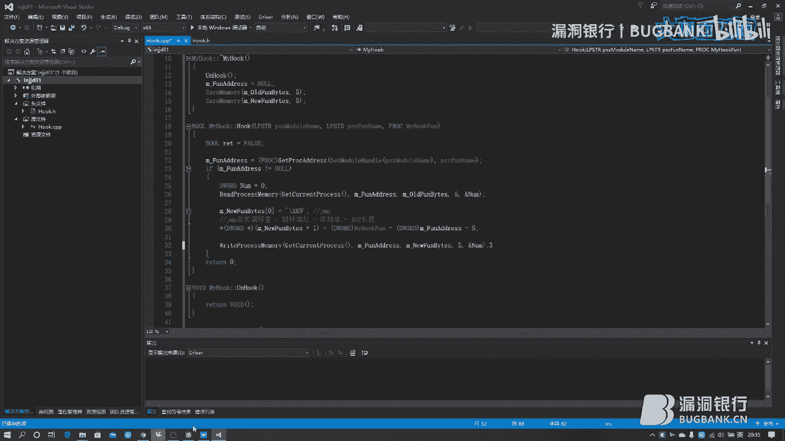

# P1：【录屏】揭秘Hook技术-大咖Rkvir-漏洞银行大咖面对面第108期 - 漏洞银行BUGBANK - BV1x64y1u7Jo

为知舌而存因技术而生。各位观众小伙伴们，大家晚上好。欢迎参加第108期漏洞银行安全技术直播大咖面对面。我是今晚的主持人年念。今天晚上要给大家做技术分享的大咖是来自MS08067安全团队的re大咖。

他带来的议题是逆向分析之花，揭秘 hookook技术。从事安全行业多年擅长二进制安全领域研究的他，今天晚上要给大家揭秘 hook克技术，这朵逆向之花。本期议题难度系数四颗星，感兴趣的小伙伴可要做好笔记。

听到最后哦。同时欢迎各位小伙伴登录直播间，在聊天区进行交流互动。听讲的过程中，如果有任何疑问的话，可以随时在聊天区提出，在演讲完毕之后，大咖会在行长问答环节，集中解答小伙伴们的。疑问。

同时呢今晚们的听讲福利也将在问答环节结束之后，由我们的大咖挑选一位幸运观众送出，是由大咖亲自挑选的书籍内网安全攻防渗透测试实战指南。那么下面就让我们有请revi大咖开始今天的技术分享吧。嗯，好。

那我就开始了啊。然后呢我们先来看一下这个我们今天的一个主题啊，就是逆向分析师花先密 hook克技术啊。然后其实呢逆向分析师花这个技术呢这个这个这个说法呢是这个李生远啊来提出来的。他是一韩国人啊。

可能大家呢有看过他这本书啊，他写了一本书叫逆向工程核心原理啊，就是这个书皮上有一个羽毛那本书啊，这这本书可能就是大家可能在这个刚开始学逆向的时候呢，就是都看过这本书啊。因为这个东西其实比较有名啊。

就比如说我们刚开始学逆向，可能大家都看过几本书，比如说加密解密啊，还有什么这个呃逆向工程核心指南，还有这个安天的那本这个逆向工程权威指南啊，这可能都是大家比较看的比较多的啊。呃。

这本书呢就里面就称之这个 hook克技术呢，就是逆向分析师花啊。然后呢它呢其实呢是一种呃怎么说呢？在这个如果你对这个windows编程呢非常熟悉的话，你可能觉得这东西其实不难啊。

但是如果你这个对这个逆向这个编编程技术不是很熟，你只会逆向的话，那你可能觉得这个 hook技术其实还是有一定难度的。并且呢这个 hook的方式有很多种啊，我们先来看一下我们的这个今天的一个目录啊。

首先呢我们先讲一下这个hook的一个概述啊，然后呢干嘛呢？然后搞一下我们这个依赖 hook啊，就是1个32位下的一个依赖 hook啊，不是64位下，64位相对复杂。

然后呢我们再来看一个这个我们依赖 hookook的一个类的实现啊，就是我们使用C加加来实现这个依赖 hook啊。所以说呢我们实现一个class啊。😊，接下来呢最后呢就是呃对这个这一步他们俩是合一起的。

然后最后呢我们来实现一个这个我们的户ook的一个实例，就是用我们刚才编写的那个户ook类啊，然后进行一个实际上的一个这个户口。呃，那么我们首先来看一下啊，就是我们hoook的一个概述啊。

就是说啊是看这个什么东西啊，这就是海盗那个钩子啊，对不对？就是海盗首蛇了，然后套一钩子啊，这就是钩子。我们hoook呢在中文里面也叫钩子啊。然后呢先给大家看一下啊，就是常见的钩子都有什么啊。

比如说我们这个windows消息钩IT钩钩啊虚表钩子，然后还有SEH钩子啊，然后还这个钩子啊，还有这个S钩有RP这MST这些钩子呢有这个应用环的，还有这我们这个驱动驱动就是我们这个P呢其实分几个环啊。

就是我们正常来说呢就是什么呢？就是环一环二环和三环不？后来我们操作系统的个我们把这个就是CPU厂商呢就把一环和二环给扔了啊，扔完之后剩两环一个三环个环三环呢就是我们的应用环环就我们驱动环。

那么这些互呢有的是在这个应用环，有的是在驱动环，比如说我们这个我们这个I呢其实呢就是属于我们应用的种还有虚表呢其实也是然后像这个我们的这个这个SSDTSRP这种他们都是个驱动。这么一个 hook啊。

然后还有的 hook呢，它是同时存在于这个我们的这个R0和R3的两环都有啊。比如说我们的依赖啊，它无论是你的在这个驱动环还是应用环都可以使用依赖 hook啊，从这个32位和64位呢也都能使用依赖啊。

所以但是我觉得是一个最基础也最简单的一个东西。所以我们今天晚上拿1个32位的个依赖作为一个简单的实例啊，就是大家了解一下技术啊，其他的 hook呢其实原理啊原理都不太一样。

但是它的这个实现的效果都是一样的，就是他们都是为了劫持而存在的。呃我们正常情况下呢，就是使用的比较多的呢就是这个我们的依赖。然后在这个驱动面呢，我们做的最多的呢是这个SSSDTT和RP。

其他的呢相对少一。但然也也也常见。比如说这个我们在这个，其实我们这些都有这个一些使用啊。这里面比较诡异的呢就是我们的这个虚表，这些东西呢需。😊，对家的一个虚函数啊稍微有一些了解啊。

那么我们其他的呢呃可能是对各各各各种东西都有一些要求啊。比如说IT hook呢，你就需要对PE结构有一些了解。你这个SH呢，你就要需要对这个异常有一些了解啊。然后那个SSDT呢。

它其实操作系统的一个描述符表啊，这个东西呢它是你要你需要能调试内核啊，能调试内核，你才才能找到这个表，然后你知道怎么克这个东西啊，你要找不到这个东西呢，你就不知道怎么了对不对？

你像RP什么东西RP驱动的一个派遣函数，你你要你要去 hook派遣啊，首先你要知道这个驱动是怎么写的，对不对？所以说呢我我这个这个就说明什么呢？就是说明啊我们这个。😊，呃，逆向啊它其实不只是只是逆向啊。

大家需要还需要对一些开发有一些了解啊。我们今天呢其实就是写代码啊，我们不进行这个一个这个逆向的分析，我们进行一个逆向的一个开发啊。然后呢，我们来看一下啊，首先我们依赖户口是一个什么原理啊？

首先我们正常这个1个ESE的一个程序啊，我们要调用这个一个函数的时候，它其实是什么呢？它其实啊是调用的一个这个呃第DR动态链接库的一个导出函数啊。比如说我们这个找1个API啊。

我们这个API可能在它的一个系统的一个导出函。系统的动态连接库里。比如说我们最常见的动态链接库，包括什么呢？包括我们的32，包括我们的us32啊，这些呢都是非常常常用常见的这个动态连接库啊。

然后你使用一个API呢其实是什么呢？就是这个动态链接库，它的一个导出表啊导出表什么这个是个P结构的我不多说了，你懂就听懂听懂的话。

你就去补一下P后呢我们正常情况下呢就直接去这个动态链库里找地址把这个函数地址找到然后就使用了，对不？那么我们这个ook呢就不一样了。那么它这第一种正常情况呢。

它使用的是一种这个 address种情况直接把这个函数地址进行了一个call啊，找到这个函动态连库导出地址之后，我们直接call这个地址。😊，那么如果我们是一个这个hook啊。

那么 hookook之后呢，其实是这样的，你首先是还是1个ESC执行程序啊，但是你不是直接去这个动态链接库这个执行这个代码了，就是他不能使用这个靠地址这种方式来来执行了。他是这个去找找这个地址。

但是找地址之后呢，有一个问题啊，就是户ook函数啊对这个他的一个动态链接库这个函数啊进行了一定操作啊，把他这个守地址这个5个字节也给改了。然后呢。

这个ESE呢就因为因为他这个从这个动态链库这个函数里跳转了，跳转这个跳转到这个我们的 hook函数上去了。ESE呢就直接去找户口函数了。那么这个时候呢如果这个 hookook函数执行完想执行原流程。

他再去把这个 hookook改回去啊，再执行这个动态链接库的一个导数函数啊，否则呢他就是直接执行完自己的流程，就把这个动态链接库的这个函数给抛了啊。呃，这个呢就是一个这个 hookook口的一个原理。

其实就是什么呢？就是把原来他要执行的一个这个流程啊，然后给劫持到自己这面上来啊，然后用自己的这个流程替代原有流程啊，这么一个过程。接下来呢是我们的一个呃对啊，还有这儿啊。

这个呢就是我们要改的一个动态连库这个函数啊，它函数的一个5个字节，就是改成这个的函数啊。然后呢我们再来了解一下，就是个这种有5个方式进行。首先呢第一种方式呢就是这种方式。

这种方式呢需要5个字节我们来看一下，首先呢第一个图啊，第一个图是我们正常的一个这个函数的一个地址，你看它前面是什么呢？比如说木BP木BPSP啊，你看这是什么东西操作一个对不对？保持保存一个这个环境啊。

就把上一级函数个环境给保存下来啊。那么这个呢就是一个正常的一个这个函数的头啊，那么我们再下来看一下，我们修改之后的一个函是什么东西呢？首先我们是变成了一个2678地址随便写的。

然后呢我们这个应编码是什么东西是E9这个E9是什？9其实呢就是这。😊，我们的1个OP code啊，然后它后边是一个地址，这12345678啊，然后这个在硬编码里呢，就是C3892812啊。

然后这个这个东西呢就是我们的这个硬编码。然后其实呢我们要修改的就是这个硬编码啊。我们看啊我们前面这个正常情况下啊，它是8BFF5588BEC啊，然后他把它修改成了19C3啊892812这种模式。

那么它呢实现了一个跳转，就是使用这个进行无条件跳转转一个地址上那么这种情况下呢，其实我们要干点什么呢？

就是说我们这个呢其实呢就是要找到这个函数这个地址就是这个000BCCB0这个地址啊然后把它这个5个字也给修改一下啊，修改成我们自己的这个OPcode。那么我们一会儿呢就是写的时候啊。

其实呢就是做这么一个事啊，就是把它修改成它然后呢我们执行流程呢，就是其实这样比如说你先找到这个地址把它掉啊，就把它地址给改成我们想要的。然后呢我们在执行这个它的这个执行我们自函数的时候呢。

我们如果是不需要执行原来的这个函数那么我们就便执行执行完之后我们一返回就完了。如果。😊，还需要执行它原来的流程啊，那你们就你就需要呢把这个这个地址啊重新改回他这个他这个应编码啊，就是这样的一个形式啊。

然后改完另外改完把改回去之后呢，你就可以再调用它原来的这个地址，然后执行它的流程。执行完之后呢，你再把这个你的这个编码再改回去啊，这个就是一个这个我们如果需要执行原流程的一个 hookook的一个流程。

然后呢我们ja这个后边这个地址呢，其实它不是一个地址，它是一个偏移量啊。然后我们看一下它的计算的一个方法。ju后这个偏移量呢，就是目标的地址，减上原地址啊，再减去信息的一个长度啊。😊。

首先我们目标地址是什么？是12345678，对不对？是这个地址，这就是目标地址啊。那么我们套公式把12345678放在这儿啊，那么原地址是什么呢？原地址就是我们的00啊0BC啊000BCCB0啊。

就是这个地址。然后呢这个原地址我们也找到了那么GCC的一个长度是什么呢？GCC通常就是G开头的这些这个汇编里的一个跳转指令那么我们这个GMP呢你看啊GMP2345678在硬硬边里占占几个就是它的一个长度啊。

它占了这个5个字节啊，19C3892812对不对？它一共是5个字节啊，所以说呢G的长度是5。那么它的一个这个偏移量计算方法呢，就12345678减去这个000BCC的B0后再减去5，就是它一个偏移量。

然后把这个偏移写在这啊就可以了。😊，啊，这个呢就是一个这个我们这个偏音量的一个计算方式啊。接下来呢我们再看一下啊，除了我们这个第一种这个站牌dress的方式呢之外。

我们还有什么其他方式可以进行一下我们的这个呃进行一个我们的一个 hookook啊。然后呢这个是什么呢？这个是一个pushreturn的这么一个方法啊，这这种方法呢这个就是什么呢？

就是一个呃利用这个return的一个这个特性的一个方法啊，我们先来了解一下return这个汇编指令啊这个汇编指令是怎么样执行的呢。首先呢你要如果是执行return呢，它其实先进行了它是进行了两条操作。

第一条操作呢叫pushIP啊，就是把这个站的一个站顶啊，弹弹出啊，弹出到什么呢？弹出到EIP里啊，然后作为返回地址，然后干嘛呢？然后EIP跳转到这个返回地址这个位置上。

这个呢是return的一个这个过程。那么你如果先push啊，把这个地址压到站里，然后呢执行这个return呢实际上就相当于你把这个呃那个地址压到站里，然后把站站这个地址呢这弹出到这个EIP上啊。

然后他用EIP跳转到这个位置上啊，实际上就是经过这么一个原理啊跳转过去了。然后呢，我们下一步啊是我们的这个第三种方式啊，就是木EAX啊。这个木EES呢其实后边呢接的是什么呢？就是我们的一个啊地址啊。

就是木EAS address啊，然后把就是把我address放到EAS里啊。然后然后呢通过跳EAS其实juES和ad没有任何区别啊。它和第一第一条呢走的是一种流程啊。

然后第四种呢就是我们的一个这个call hook啊， call hook函数啊，这个呢其实类似于什么呢？类似于我们这个IT的一个 hookook的方式啊，就是说什么呢？其实他改的是函数地址啊。

那这种呢我们就先不说啊，我们这个今天主题不是这个东西啊。第四第五种呢也是啊第五种呢其实是一个热补定啊，这热补定方式呢，其实就是我们直接进行一个这个对它的一个硬变码的修改啊。

然后这个呢其实就是5种这个依赖户的方式。我们日常用的呢其实就就是前三种啊，前三种是用的比较多的啊。就是看你看他的这个函数的一个情况啊，情况是怎么样的，你就用哪一种啊，但是啊这些都是32位下的啊。

64位下啊，它这个头里没有这5个这个自己要给你跳啊，所以说呢你要用其他方式进行 hookook。呃，那么我们这个看完这个5肿互方式呢，我们就来实际上执行一下我们的这个 hookook类啊。

那么我们使用的工具是这个viss studio2015啊。

然后呢，我们点文件啊，新建新建一个项目啊。呃，我们选择这个V47加加模板下的这个win32，然后选择win32控制台程序啊。这里呢我们名字呢可以随便写一个啊，比如说这个ING啊，然后DL什么一啊。

这随便啊。然后这个这个东西呢就其实呢就是你的一个模块名啊，生成之后就是你的模块的名字啊，然后我们点确定。然后在在这个界面上呢，我们点下一步，然后到这个界面呢，我们看应用程序类型呢，其实有4种啊。

第一种是这个windows应用程序，第二种控制台，第三种第R第四种静态库啊。那我们这个动态链第二呢其实就是我们的动态连接库啊。然后这个我们要使用的就是这个首以我们选这个动态链接库。然后呢。

它其实呢是可以给你生成一个带有这个。带有一些这个代码的这个程序的，但是我们不需要它生成代码。因为因为那样呢我们看着比较恶心啊，所以说呢我们直接选择一个空空项目啊，点击空项之猫它空项目之后呢。

我们点完成啊。然后这种情况下呢，我们先来干嘛呢？我们先这个创建一个原文件啊，我们比如说我们新建项啊，新建什么呢？新建一个啊。😊，比如说新建一个魅点CPP啊，就是我们一个主程序。呃，我们不用卖点CPP啊。

我们删删删掉啊，删除啊。然后我们添加一个这个我们先写类啊，先写一个我们的一个类啊，就是我们一个ho类。我们hoook类呢这个类呢需要有一个头文件，有需要有1个CPP文件啊。那么我们这个头文件呢。

我们就叫做这个hoook啊。hoook点H啊，然后我们添加啊，然后我们再添加一个这个原文件。原文件呢也叫这个。hoook啊 hookook点CP啊添加。然后呢。

我们在这个点CPP里面把我们的这个原文件包含一下啊，就是我们使用这个inludelude。😊，然后把hoook点H包含住啊。然后这种情况下呢。

我们先来先来这个呃把这个我们的一个类的一个图文件给实现一下啊。那么首先呢我们既然实现我们既然是走这个hook啊，我们可能会调用一些这个windows里的东西。

那么我们先把这个呃windows点H给包含一下啊。啊，包含winwindows点H呢，我们就开始实现我们的类啊。我们这个类呢就是首先我们是一个class啊。然后我把名字呢改成一个这个。嗯。

改成一个my hook好了。啊，myho类啊，然后我的ho类啊，然后这样呢它生成了一个这个默认的这么一个这个东西啊。然后我们把这个东西它删一删啊。我们这公有的里面呢。

我们首先啊需要有一个这个同名的这么一个这个构造函数啊，这构构造函数。这个生灵的一个构造函数。然后呢，我们在下面呢，我们还需要来一个生稀构函数啊。这东西啊是这个我们的一个go函数。

下面呢是我们的一个C构函数。然后我们点双击啊，然后干嘛呢？右键啊，快速操作与重构啊，创建一个声明与定义啊。然后这个东西呢就是在这个点CPP里啊创建出来了。两个都是啊，我们看一下啊。

在点CPP里就已经有它的一个实现了啊。然后呢，我们有一个构造函数和吸系构函数之后呢，我们还需要一些函数来进行一个我们的hook啊。我们这个hook的流程呢。

首先呢我们需要一个这个肯定需要一个hook函数啊。😊，然后呢，第二个呢，还需要一个什么呢？还需要一个这个卸载的 hookook的一个卸载函数啊。第三个呢是需要一个这个我们重新重新 hook的一个函数啊。

哦，他们是一个什么功能呢？首先你 hook一函数是把流程截过来啊，然后呢，你要你一有 hookook就必须有卸载 hookook啊。因为你要你如果要执行原流程的时候呢。

你要把这个 hookook给卸载掉啊，然让它执行原流程，不然呢你就会被无限截持到自己的函数里啊，这样就成死循环了。然后第三个呢就是什么呢？就是你把它原流程执行完之后呢，你要把这个钩子重新挂回去啊。

这样呢你才能在下次啊又劫持过来。不然呢它你执行完一次钩子之后呢，它就下次就不会再再被勾过来了啊。😊，然后呢，我们来实践一下这三个函数啊。首先第一个函数啊，我们这个是一个这个我们首先用一个布尔类型啊。

返回这个te和boss啊。然后我们来一个叫做这个。啊，叫一个。买户口了。呃，就叫一个 hook口吧。这叫一个 hook。然后呢，这个 hookook呢我们需要参数啊，参数是什么呢？

首先我们我们截持一个这个函数呢，我们需要三个东西啊。首先我们需要一个这个模块名啊，然后在模块里呢，我们要找到这个函数呢，我们还需要一个函数名。函数名的话呢，我们还要还需要截这两个东西我们都有了。

我们就找到这个函数了。那么我们是不是要劫持它，对不对？我们看一下这个啊，我们这要找到这个地址之后呢，我们要把它前5个这个给修改掉，对不对？修改成我们自己的函数啊，那么这个地址上就是我们自己的函数。

那么我们要首先呢我们要有有一个自己的函数，对不对？那么我们要给一个函数。

所以说呢我们第一个啊是这个我们的一个模块名啊。就是一个这个model name，然后呢，下面呢是一个函数名。函数名之后呢，我们需要第三个。第三个是什么呢？啊？这个雷有点问题啊，这个逗号不太对。这回对了。

然后呢，我们第三个呢就是我们自己的一个这个 hook函数啊。这个呢就我们就声明完了。然后呢，我们把它这个声明之后呢，我们创建一个定义啊，不是不是创创建一个这个对定义啊，然后我们一会儿去实现它。

我们先把它创建的CPP里啊。接下来呢是我们的一个这个 hook的一个卸载函数啊，卸载函数呢它不需要这个返回值，然后我们直接这个来一个word啊就可以了。然后我们直接一个on hook就完事儿了。

然后我们不需要参数，因为我们只是把它卸掉啊。第三个呢就是什么呢？就是我们重新挂钩的一个函数啊，这个函数呢我们也不需要这个呃不需要参数啊，它只要需要你重新把那钩挂上就行了。

所以我们来一个这个re hookook就行了。我们告诉他自己是不是户口成功就行了，然后就返回一个这个处或者fse。这样呢就是我们这个三个函数就声明完了。然后我们把这个东西呢创建一下定义啊。

接下来我们在这个私有的里面呢，我们创建这个三个三个这个变量啊，这三个变量呢有三是什么呢？首先第一个啊你需要你需要这个 hook克一个东西，对不对？那么你要还原它是不是要把它地址给记下来。

所以说呢你需要一个东西啊，把这个地址给记下来，就是函数的一个地址啊，就是我们这个000BCCB0啊，我们需要保存这个东西啊，我们需要用一个这个函呃变量把它记下来。

啊，这是一个变量。然后呢我们还需要什么呢？就是因为我们要 hook克5个字节，对不对？这5个字节。那么我们要用一个这个变量啊，保存这个原来的5个字节。因为我们要重新卸改的时候。

我们我们要把这5个字节还原回来啊。然后呢这个新的新的5个字节呢，我们也需要一个变变量来这个呃使用啊来这个保存啊，所以说呢我们还需要一个保存这个呃jump地址这个东西啊，我们还需要一个变量保存。

因此呢我们生明两个变量啊，第一个变量呢是一个贝塔啊，就是我们的老的这个5个字节啊，我们保存啊，那么就是这个old的贝啊。

然后呢，我们用5个啊5个字节来保存它。然后呢，第二个是新的这个samps address啊，我们也需要一个东西，就摆个分啊。那么这个东西是新的，那么我们就是这个new啊。Mu fan贝s。

然后也是5个字节啊。这样呢我们就声明这些东西呢就声明完了。那么接下来呢我们就要来实现一下我们的这个户克类了啊。呃，实现互客类呢，首先我们有这个构造函数和稀构函数啊。

这个我们先要这个把这个构造啊来实现一下。构造呢其实呢就是我们对一些资源呢进行一个初始化。我们这是有什么资源呢？就是这三个变量，对不对啊？那么这个这个函数地址这个变量呢，我们其实类似于指针那个东西。

我们把它指向到啊，就算初始化了。然后呢，我们后边还有两个东西啊，两个这个be啊，这两个bes呢，我们需要把它的内存刷一下啊，就是比如说什么呢？就是我们可以用这个我们的memory set啊。

也可以用什么呢？也可以用这个zero memory啊。啊，这两个这两个都可以啊，一个是酷函数，一个是API啊。然后我们使用这个zero memory啊。然后我们这个这这个东西呢，我们呃有有两个参数啊。

第一个参数呢就是你要这个清零的这么一个这个编量名啊，就是什么呢？就是我们这个M啊，然后这个new啊啊这是我们这个老的啊，这个old new old fan啊，然后呢他要刷成什么，要刷成零对不对？

那么我们要给他啊给出一个就是参数是什么呢？是他要刷几个字节啊，我们这要刷5个字节，因为我们声明的时候就5个字节啊，然后这是一个啊，那后我们复制一下啊。😊，然后我们把这个什么啊。

我们把这个新的这个也清了啊，这个new find贝我们也把它清成零啊，也5个字节啊。然后呢，我们这个三个资源呢，就给他这个清零完事了。然后呢，我们这个是一个这个构造函数啊，就是在构造的时候使用的。

那么我们在这个C构的时候呢，我们需要把我们初始化这些东西呢全部给它这个干掉啊，就是全都释放掉。那么首先我们在这个这个就是呃C构的时候呢，我们这个类结束了。其实呢就是我们这个hook结束了。

然后呢我们直接把这个使用一个这个un hookook啊，我们使用一个这个un hookook，把这个 hookook这给卸掉啊。然后这样我们卸掉了才能退出嘛，对不对？

然后呢我们把这个变量呢啊全都再重新这个初始化一遍啊，这个其实呢就是不是初始化了，到这儿呢，它就已经使用过了。所以说呢我们要把它清空啊，就保存让里面保存的东西都这个呃失效啊。

这样呢我们这个构造函数和C构函数呢就实行成功了。然后接下来呢我们就来实现我们的这个hook函数啊。😊，首先呢我们要给它一个返回值的一个定义啊，就是这个返回值呢，我们是一个波尔类型。

所以说呢我们先把它默认啊给它放成这个fose啊，就是失败的一个意思。然后呢，如果我们一会儿啊执行成功了啊，就是我们把它这个呃值改成t啊。

否则呢我们就直接返回一个return这个return1个IT就完事了。它IT就返回的意思啊，就是这么这么搞。然后呢，我们这个有了返回值之后呢，我们来这个。

然后我们来这个获取一下我们这个指定模块中函数的一个地址啊。然后我们这个地址呢，我们用这个我们的刚才声明那个fin address啊来保存一下啊，等这个获取地址呢。

使用一个这个get power address这么一个函数来获取一下啊。然后呢，它这个获取回来呢，它不是这个PLC类型的。所以说呢我们需要把它这个改一下类型啊。然后呢，它有几个参数啊。

首先第一个第一个参数呢是你要获取的一个模块的一个这个句柄。那么模块句柄呢，它需也需要用一个这个API获取一下，就是什么呢？gege这个model handlele啊。然后呢。

把我们这个参数里这个模块名啊给传进来。然后下一步呢是这个我们要传一个这个我们一个函数的名称啊。就是这个参数啊，第二个参数啊。然后我看这出现了一个错误啊，就是这个什么呢？

就是我们这个LPSTR类型和这个13这个不不不兼容啊。其实就是一个阿克一个一个unicode的一个问题啊。我们在这个项目里设置一下啊，我默认使用的是unicode字符机，unicode的字符机啊。

我们把它换成这个多字节的软了啊，确定啊，这样呢错误就没了啊。😊，然后呢，我们获取到函数地址之后呢，我们判断一下啊。判断一下这个这个这个返回这一个值啊，是不是等于到啊。如果等于到呢。

其实就是我们获取失败了，然后获取失败了，我们就可以干嘛呢？我们就可以可以可以把它直接这个干掉啊。那么这样我们判断一下它获取如果没失败的情况下啊，我们就干嘛呢？我们就保存5个字节啊。😊。

我们回来看一下PPT啊，你看这5个字节，我们需要把这个原来这个五字节保存回来啊，否则那一会儿我们就还原不回去了啊。那么我们现在要把它这个。哦，我们先要把它保存一下啊。

我们使用一下我们的这个read read process memory啊来进行一个这个读取啊，就是我们把这个函数的头5个5个字也给读出来。因为我们其实现在获取一下地址了，获取的什么东西啊。

获取的就是这个000BCC啊B0这个东西啊。那我们要去这儿啊，去这个地址上把它保存的这个头5个字也要给读取出来，我们就需要用1个API啊。那么这个API呢，它它需要一个这个。Red process。啊。

read process memory啊。RY。然后呢，它有几个参数啊，首先呢它第一个参数呢就是获取一下这个进程的进程啊，它你要给读取哪个进程啊，那么我们这个字儿呢读取的是自身的进程。

因为我们动态链接库是注入进去的啊那我们使用一个这个API就可以获取到我们自身的进程啊。嗯，就是这个API啊。然后呢，我们第二步呢就是说什么呢？就是我们这个函数的地址啊。

就是说我们要去这个地址上读取5个字节。那么我们首先要知道这个地址在哪儿。那么这个地址呢，我们刚才通过这个get PR address呢，就是已经把它给读取出来了。那么我们就把它放在这个参数上啊。

这个我就我们意思呢就是我们去这个地址上啊，来把这个读读过来啊。然后读读什么呢？读完之后呢，我们要这个放在哪呢？就是我们有一个地方要存放这5个字节，对不对？这个我们要读这个几个字节，对不对？

那么我们就是什么呢？就是一个ode啊，就是我们因为这个是啊原来的字节数啊，所以我们用这个ode find贝塔词来保存啊，然后读多长呢啊，读这个5个字节啊。读完这这最后一个参数呢，它是什么呢？

它是一个呃实际上啊你这个会读取出来多少字节啊，那么这个这个呢你就需要这个构造一个这个deor类型的一个变量。然后呢，这个变量呢，你随便起个名就行了。然后给他传一个人用进去。嗯。

这个呢其实呢就是把5个这5这这个函数地址上头5个字节啊读取出来，然后呢写到这个我们的这个呃变变量上面啊啊，我去这变量名写错了啊。old写成什么呢？多了个A呀。然后呢。

我们就完成了这个我们的一个读取的一个作用。然后呢，接下来呢我们要把这个新的这个五个字节给构造一下啊，就是什么呢？就是我们一个帐篷啊。ju什么呢？就是我们要ju到这个我们的一个地址上，这是5个字节。

那么我们现在呢要用我们这个呃new find啊来构造一下这5个字节。那么我们现在首先呢我们要把它这个第一个字节构造出来是什么呢？就是E9啊，因为我们这个E9呢应就是这个juap的一个硬编码。

这个东西是不变的啊，所以我们先把它写进去。然后剩下的地址呢，我们在这个另外这个来写进去啊。我们先把这个一9给搞进去啊。就是我们这个新的这5个字节啊。它的这个第0个元素啊，就是最开始那个元素啊。

等于什么呢？等于一下我们的E9。然后呢，这个呢第一个字尖就有了，它就是什么呢？就是一个ju篷的一个这个OP code，就是jump篷啊。然后接下来呢，我们要读取这个后边的一个地址了啊。

这个地址呢我们已经知道了啊，就是说我们知道怎么计算了啊。你看这儿有一个公式啊，占盘之后的变音变异量呢等于这个我们把它复制过来啊，然后我们看一下怎么算那个东西啊。

首先呢我们要把这个指这个这个因为它第零个元素已经有东西了嘛，我们就把我们要就要把它这个移移位啊，就是说从第二位开始啊。啊，要给它取值。然后是我们这个，然后加一啊。比是说我们从这个第一位开始啊。

等于这个我们这个啊返回值啊，deward。然后呢，我们是一个我们这个我我自己的一个户克函数啊，就是什么呢？我们看这个这个公式啊啊，对我复制过来啊。这个公式啊，首先第一个是目标地址。

就是我们自己的一个函数的一个地址啊。那么就是这个函数啊，这个函数是外边传过来的啊，我们自己户客之后的函数的一个流程的地址啊，那我们首先我们要把这个地址放在这儿。然后它呢要减去什么呢？

要减去一个这个原地址啊，那么我们呢还要这个。😊，把它转成这个deword，我们把这原地址转成deward啊，原地址呢就是我们这个get到这个地址，然后把它放在这儿。

最后呢我们要减去一个这个我们在GCC的一个长度。我们这个GCC呢就是一个5。然后这个呢就是一个这个我们一个完整的公式就完事了啊。那么我们这个东西呢，其实就是已经把我们这个ja之后。

这个呃ju那个站地址那块呢也构造完了啊。接下来呢我们要hoook它，对不对？那么我们hook呢其实就是把这个5个头5个字节让它写成这个1919ju addressdress这种形式啊。

那么我们就把这个东西啊，我们构造好这个东西写到这个函数地址上啊。那么我们这个怎么写呢？其实就是有与这个read这个preces memory啊相对应的一个这个API啊。

叫做这个w processces memory啊。首先啊它第一个呢也是获取一下进程啊，然后我们还用这个API啊。第二个呢是我们这个函数的地址。第三个呢就是我们要写的这个5个我们要写过去什么东西啊。

那么我们要写的是我们这个构造的这个呃站地址，然后写多长呢？写5个字节啊，然后最后呢你还要这个一个实际上写入的一个值啊。那么我们还把这个呃NUM给传进去传一个引用就行了。

这样呢我们就把这个5个字节呢给它这个写过去了啊，写过去之后呢，这个东西呢就已经完成了，就是我们已经把其实呢到这一步呢，我们就已经把这个这个硬编码呢给改了，就是从这个88FF55把这个8BEC啊。

已经改成我们这个jare这种形式了。那么我们接下来呢啊给它返回一个处就可以了啊。

我们返回的是RET。然后呢，我们在这儿啊，如果成功了之后，我们可以把它这个IT啊给设置成这个处。然后接下来呢，我们这个就是 hookook克啊，就已经完事了。那么我们接下来呢还有一个问题。

就是我们要卸了 hookook克，还有什么呢？我们还要这个呃重新挂上啊。然后我们把这个卸载户给写一下啊，其实卸载户是一件非常简单事。

卸载 hook呢就是我们现在不是把这个5个字节写成这个ja address的嘛？我们现在如果卸载户口就把ja address再改回去啊，所以说呢我们我们因为我们刚才已经保存了三个东西啊。

就我们函数地址已经保存了。原来的5个字节保存了，新的5个字节也保存了。我们户的过程呢，就是把新的5个字节覆盖掉原来的5个字节。那么我们卸载户可呢就是把老的5个字节覆盖新的5个字节啊。

所以说再调用一个这个we memory啊就完事了。😊，我们先来判这个先来这个判断一下啊。就是判断一下我们这个函数地址有没有值啊。如果函数地址没有值那说明你没有 hook克过啊。那么如果有值了呢。

就是我们就可以这个啊进行一个还原的这么一个操作啊。嗯，首先呢我们因为调用这个wepress memory啊，它最后一个参数是一个deword。所以说呢我们先要给它声明一个这个deword的这么一个值啊。

然后呢，我们把这个我们这个API复制过来就完了，我们就不用重新写了。接下来呢我们还是改一下啊，就是这个首先呢他要这个还是这个函数地址，但他写过去的呢是写这个老的5个字节，而且把5个老的5个字节写过去。

就覆盖原有的那个啊。然后这样呢就是一个卸载钩子。其实呢它的作用呢就是把这个我们这个呃战卜address还原成原来的样子。然后我们把这个因为不需要返回啊，我们把返回之一删就完了。然后重新挂钩呢。

重新挂钩其实也很简单啊，重新挂钩呢啊就是跟这个hoook一样的流程。但是呢它比hoook简单在哪呢？他不需要再去获取函数地址，也不也不需要再去获获取这个ja本后的这么一个偏移量这么一个东西啊。

所以说呢他直接这个把这东西写回去就完了。😊，呃，我们首先呢要给他一个返回值啊，一个布尔类型返回值啊，一啊。接下来呢我们要判断一下啊，还是跟刚才一样，判断一下这个我们有没有函数地址啊，函数地址如果为空呢。

我们就不需要进行一个这个重新发钩了啊。然后把这两句搞过来啊，就是我们这回写的是什么呢？我们这回要写的是新的啊，就是新的啊，因为我们要重新把它ho个回去啊，所以我们要把新的五个字节。

就是这五个这个呢其实相当于什么呢啊。😊，是等于这个我们的战portdress啊。所以我们把它这个写过去之后呢，就相当于我们又给他ho上了。然后我们来一个这个给他来一个返回值啊。

就是代表我们一经互ook成功了啊。然后这个一return就完事儿了。这个东西呢其实就是什么呢？就是我们这个。一个完整的一个户客类的一个实现啊。就是首先呢我们有一户克函数，有一卸载函数。

有一重新挂钩函数啊，这这几三个函数已实现啊，我们这事儿就整完了。接下来呢我们就是调用这个类啊，然后来进行一次这个我们真正意义上的一个这个互克啊，虽然很简单，但是它确实已经是一个真的 hook克了啊。啊。

我们新建一个我们的C加加程序啊。比如说我们这个我们要ho一个这个我们的这个create process啊，就是创建进程的这么一个东西啊。那么我们就是写一个这个呃，比如说叫什么，我们就写一个媚函数算了啊。

算了，不写媚函数。嗯，就写一个这个。Hook。Hook。Correct。啊。Prs。啊，大不了。然后点添加，嗯，这是我们一新程序啊。首先呢我们要干一件事儿。

就是把我们自己写的这个类啊包含进来include。后合点H。然后呢，我们开始写代码啊，就是我们我们要这个户口嘛，所以说呢我们看这儿啊。我们看这儿啊这个户ook口对不对？那么我们第前两个参数啊。

我们都是可以直接传进去的。我们要这个把第三个这个户口函数啊给这个写上啊。😊，然然后呢，我们在那个我我我我们再来我们再起来写一下这个 hook克函数啊，就是这个我们要 hook哪个函数呢？

我们先要去找一下这个函数原型啊，就是比如说我们要 hookook这个cate啊。😊，后W啊这种情况下呢，我们可以先写一个函数的一个原型在这。

然后我们点F12啊啊这样我们直接用这个然后F12我们进去啊就可以看到它这个函数的一个原型啊，你看这呢re啊，然后这是一个函数原型啊，然后我们从这个布尔类型，一直复制到这个尾巴这啊。

然后我们把它复制出来啊，这个呢就是我们我们要互个什么函数呢，我们要要我们就要把它所有的参数都接收到啊，所以说呢我们直接去它的库里复制它这个API呢其实是最简单的。

如果你互克的这个东西呢不是系统的API啊，然后呢你就可以这个去那个逆向一下，它的参数都有什么。然后呢，你来这个把它这个原型写在这啊。😊，然后我们这儿啊这个就是corred processW啊。

然后我们直接来一个这个my correct process w啊，然后我们把这个分号去掉干嘛呢？我们直接来这个写它的一个代码块啊，就是从从这个里面啊，这就是我们的互函数了。

然后我们从里面实现一下它这个函数啊。😊，首先呢我们还是要给他一个这个布尔类型的这么一个返回值啊。😊，然后我们先把它设置成这个forse。啊，设置完之后呢，我们要干嘛呢？我们要弹出一个框啊。

先来确定一下你要不要启动这个进程啊。我们来看一下啊，我们先来用这个东西啊，这个东西是我写的一个小程序啊。然后呢呃比如说我这个呃我这个D盘里啊，有一个程序叫什么呢？叫做这个MSC01啊，那么我我就什么呢？

我就在这个给他一个路径啊。😊，嗯，地盘下的这个。MC01程序啊，你看啊这个程序我点一下启动进程啊，它就起来了，并且弹出了1个AAAA的这么一个框啊。然后我们点确定，然后把这个东西关掉之后呢。

我们这个就正常了啊，就它就没了啊。那么我们如果啊把它 hook合之后呢，我们会先弹出一个框，说什么呢？说你是不是要启动这个进程，如果不是要启动进程，这个进程就起不来啊。

那么我们来这个就现在要实现一下这个弹窗这么一个功能。我们使用一个这个。😊，Yes， IG买sses box。然后呢，我们用这个啊。来这个判断一下啊。首先这个这个函数呢，其实就是弹出一个消息框。

它有4个参数。第一个参数呢是这个附窗口，然后我们直接给它传个到啊，就是没有附窗口啊。接下来呢传什么呢？传一个这个我们这个提示的一个内容，就是说我们是否启动这个进程。😊。

接下来呢第三个呢是我们的一个这个左上角这么一个提示的这么一个标题呀。那么就是我们直接写一提示就得了。这最后一个呢就是什么呢？就是你你那个弹窗上的一个这个确认还是什么啊？你看这个程序。

它点的就是一个确定这个框啊，那么我们这个max box呢就会弹出这么一个框啊，然后呢，我们是相当个是确定。那么我如果是这个想要写确定呢啊，我们这个最后呢就是个MMB啊，然后OK。😊，啊。

但是呢你现在要判断让他判断一下它是不是要启动这个进程，所以你就不用不能用MBOK啊。你看它这有这么多这个选择啊，那么这里面有一个叫MMMBy no啊，这个呢其实呢就是一个确认和这个取消的这么一个东西啊。

那么我们就是使用来使用这个MBy oyy no啊，然后呢我们判断啊它有一个返回值。如果它的返回值呢等于这个。😊，IDy啊。呃。啊，这也是一个红啊，是系统预设的一个红。如果等于I呢。

就是它选择了y否则呢我们再来一个这个，就是什么呢？就是它选择了这个否啊，就是选择了这个否。如果这个y啊就选择了y我们可以这个F2进去看都有什么你I么这些啊那么我们首先呢我们就要判断什么呢？

就判断它是不是选y。如果是它选y呢，我们就需要把它这个原来这个进程呢给它启动起来，否则呢我们就不启动啊。那我们先实现一下不启动的情况下啊，不启动非常简单啊，就是我们给再弹个窗对不对？告诉下我这个东西啊。

你被被被拦了啊，我没没起来啊，就行了。😊，第一个啊闹。第二个呢是一个这个我们的提示啊，就是启动的进程被拦掉了啊。第三个呢是我们这个标题啊，那我们就还写一个这个警告啊，提个提示吧提示。

然后第四个呢是我们的这个呃选择啊。那我们刚才是yes no我需要让他选择。现在我们直接MBOK啊，让点确认就好了，反正已经被拦掉了，你选选别的也没已经没什么用了啊。😊，然后呢。

我们现在呢我们实现完了这个我们选择拦截的情况下，就选择否的情况下。那么我再来选来实现一下，我们选择这个确认的情况下，就是这个进程我还要再启动起来啊。那么我们如果需要启动起来呢。

我们就要这个首先呢我们先要先要把这个hoook给这个呃干掉啊。那么我们这种情况下呢，我们需要干嘛呢？我们需要我们是个类嘛，我们先要声明一个类对象啊。😊，我们这个类叫做my hook啊。啊。

然后呢我们这个我们就写一个这个。算了，就这个吧，就是。啊，我我想想有没有什么简单的，就是这个西户口啊。😊，算了，这就M hook好了。就M hook啊，然后我们把它作为一个类对象。然后呢。

我们这个使用类对象来进行这个调用一个我们的这个类里面的一个函数啊，就是我们这个on hookook。就是我们先把这个hoook给卸掉啊。因为你如果不卸掉。

你你要再调用这个correate process啊，它还会再进入到我的这个 hook函数里再走到这。然后呢它一选y，然后又上去了啊，又拦截一遍啊，又又到这啊，这就无限死循环了。

如果你不不想让它无限死循环，你就稍先要把它这个 hook给给卸掉，让它不要再进到我这个函数里来了。如果你一直进我的函数，我这个东西就没什么意义了，对不对？那我们先就把它卸了，卸完之后呢，我们干嘛呢？

我们再来这个执行它原来的这个流程啊，就是调用它这个correate啊。😊，啊，卸载之后再调用这个函数呢，你就不会再跑到我的自己的这么一个一个这个。流程里来了啊，那么它的参数是什么呢？啊。

我们这个已经有它原型了，对不对？这个原型啊就是已经从这个库里掏出来的了啊。那么这个我们这个掏出来的东西呢，我们就直接把它这个挨挨个啊给它这个来一点啊，就是就是它的这其实这个参数我们都已经拦截回来了。

那么你直接把这个原样啊，就是相当于一个转发啊，你把它这个东西转发给你的一个这个啊原来的这个函数啊，就是原流程啊，那么就可以直接调用了。😊，然后我们这个就是稍微费点时间，把它这个参数挨个复制一遍啊。哎。

到哪了DW。这个呢就是已经把它的所有参数呢重新转发给他的一个原来的这么一个系统的API了啊。然后呢，我们在这个转发给系统API之后呢，我们还需要把它这个钩子重新给挂上啊。如果你这个不挂上的话呢。

你这个东西呢，你就没办法在这个呃下次呢你再调用这个函数的时候，你就没办法再进到我们自己的流程里，它就会直接走它的流程啊，这样就达到一个结持的目的了。

所以说呢我们还需要把这个啊 hookook啊重新再挂上啊，就是这个re hookook啊。😊，啊，这样呢就完成了这个我们一个结持的一个流程啊。首先啊他会执行我们自己的一个东西啊啊然后呢再去执行他自己啊。

然后呢再这个再把它重新挂钩啊，否则呢如果我们选否，不让它启动啊，那么我们就直接被个执行一个弹窗，把这个东西啊拦拦下来就完事了。因为我们执行完这个弹窗之后，我们没有再走原来的流程。

所以它这个原来这个东西呢并没有被启动啊，所以说呢这个就没有走到原流程上，这个就是似和否的一个区别啊，全是就让它启动啊，就执行原来的代码否选否啊，就不执行了啊，就完事了。😊。

这个呢就是我们的一个呃户 hookook的一个函数啊。呃，然后呢我们最后呢，我们如果这个搞搞定了啊，我们就直接干嘛呢？我们直接这个可以这个返回了啊，就给比如说给他这个返回一个什么呢？

返回一个这个return啊。😊，return一个这IT就可以了啊。然后在这儿啊在这儿啊，比如说在这儿啊，我们就可以给它这个设置一下这个IT等于什么等于这个数啊。然后在底下也可以给它设置一下IT等于数啊。

就不论它拦不来拦下来，我们直接返回一个帧啊就完事了啊。然后接下来呢，我们因为我们这是一个动态连接库啊。动态连接库。然后呢，我们这个动态连接库呢，我们首先我们要有一个动态连接库的一个这个主函数啊。

就相当于什么呢？相当于我们这个呃呃普通的控制台程序。我们比如说我们有一个这个魅函数，我们如果是这个win32程序呢，有一个win妹函数啊。然后呢，我们这个如果是驱动呢。

其实就是相当于我们这个驱动的这个dver entry啊。然后就是这些东西啊，那我们DRL呢也有一个DRL妹啊。😊，首先我们是一个波尔类型的啊，这东西呢你就不能改啊。你如果改了的话。

你这个东西你就加载不了了。😡，API entry啊，然后呢是这个DL啊。没。这这里需要注意一下啊，你DR的D是大写，ma的函数的M是大写啊，这个M是大写。你要不这么写的话，你这个东西注入之后。

它启动不起来啊。然后它有三个参数，一个一个handle啊，然后还有一个这个Dward。然后第三个呢是一个这个控指针啊。首先呢我们来写一个这个handle。😊，然后第二个呢是一个这个deor。

第三个呢是一个这个控制针。然后我们来实现一下它的一个代码块啊，就是用一个花框把它圈起来啊。然后呢，这个这里面呢，首先呢我们要写一个这个switch啊。其实这个s是什么意思呢？

就是判断一下我这个fo call啊这个参数啊，这个参数呢其实是什么呢？这个参数就代表着你这个动态电机库呢处于一个什么状态？比如说你这个case一下啊，case一个我们的这个。😊，嗯，DRL啊pri。啊。

这个啊就是他这个注入进去的时候啊，这种状况。然后还有什么呢？还有我们卸载的时候的一个状况啊，就是在case一个卸载时候的一个状况。然后我们现在就来做一下这件事儿啊，首先呢它这个注入的时候。

我们要干什么呢？我们就需要调用一下我们的这个呃实力化的这个一个类啊。然后干嘛呢？我们把这个hook啊来hoook一下。😊，调用一下我们的 hookook啊。

首先呢第一个参数呢就是你要你要 hookook的这个呃API呢，它属于哪个动态链接库，或者说呢你你自己分析的一个这个程序啊，你这个。😊，你你你你要你是哪个动态链接库里的，或者你整个你是自己程序里的。

你如果是自己程这个ESE里的，你就写一个这个模块是ESE就完了。比如说我们现在这个这个procescate process啊，它是在这个32里的一个这个导速函数啊，是以我们这写这个32点点R啊。

然后第二个参数呢就是你要 hookook的一个函数名啊，那么它是什么呢？create啊procesW。😊，然后呢，这是第二个参数。第三个参数呢，就是你要 hookook克之后啊。

你要直截持到哪个自己的流程上。那我们刚写的这个流程啊，所以说呢我们就用一下它的这个自，我们用这个啊流程就完事儿了啊。😊，然后呢，记得把它这个类型转一下，它的因为我们自己实现 hookook克的时候。

你看一下它的这个第三个参数是什么类型的。是PROC类型的。所以你第三个啊就把它长转一下就行了。然后这样呢，我们这个hook啊就已经啊写进去了啊，然后呢我们执行一个break啊就结束了。

那么我们在这个动台链接库卸载的时候呢，我们就调用一下这个卸载 hookook啊，因为我们不能留下一个东西啊，我们啊把这个 hookook卸载掉啊。😊，I'm hook。第儿。On hook。

然后执行完这个卸载户后呢，我们这整个流程就走完了啊。然后这个时候呢我们先设置一下啊，刚才我们设置了一下这个多字符的一个字符集，然后呢我们选一下什么呢？C加加啊，然后代码生成。

我们把这个动态这个多线程调试点啊，然后改成什么呢？改成这个我们的这个多线程调试MTD啊。😊，然后应用啊确认这时候呢我们点生成啊。上传完之后呢，我们右键啊在这个标签上，右键啊，然后什么呢？

打开文件所在文件夹啊，然后在这个文件夹里呢，我们点到上一集啊，上一级有个debug目录啊，这个目录下有一个这个啊，你看这个动态监库DL对不对？那么我们把它复制出来啊，然后到桌面上。😊。

我们粘贴到桌面上啊，然后我们这不是我们这个程序还开着呢嘛？正常情况要么我们点启动是不是这样啊，那么我们点这个确认啊，我们这儿有有一个这个代码注入器啊。

其实呢我们可以用自己写的这么一个代码注入器进行注入啊。比如说我这有一个程序啊，这东西呢它就可以这个对任意进程进行一个注入DR啊，然后可以显示模块，然后呢把它里面的这个模块给干掉啊。😊，比如说我们找一个。

啊，这种啊你看可以卸载模块啊，但是我们因为这个东西呢是自己写的比较麻烦，你下载不到啊。那你如果想要下载，你这有一个代叫代码注入器的这么一个东西啊，这东西就可以下载的啊。你去网上找一个就完了啊。

那用它注入这个动态连接库也是可以的。😊，然后呢，我们这有一个这个类似于小这个目标的一个东西啊，我们能把它拖出来，然后放到我们这个窗口上啊，你看它就找到我们这要所要的进程了。然后我们点注入D啊，然后呢。

我们在桌面上啊找到一个这个我们刚才写的动态链接库啊。然后你看它弹出来啊，这其实呢就是已经注入进去了啊啊，如果你不确定它注入明体注入进去啊，我们可以这个找一个可以查看它的一个应用程序啊，然后干什么呢？

然后你去这个查看一下它模块里有没有我们这个东西啊。😊。

显示模块啊，你看这这个模块里啊，哎好像是没有啊。😊，呃，我们找一下啊，我们先试一下吧，试一下，就知道有没有注入没注入进去了啊。我们点启动进程啊，哎这没出时间去，这是。然后。我们注意一下啊。

还是我刚才哪写错了。哎呀，看来是哪写错了这个。DR门。哎呀，怕是这个参数必须有固定的名字啊这个。重新生成一下看看啊。

可能是太浪了。

哎。愉快的改改bug时间，我决定放弃这个改bug啊，我这有一写好的。这就说明末浪啊。这有一写好的啊，我们来试一下。

你看啊这个东西弹弹这个弹出来就是什么呢？就是我们这个。呃，是否启动该进程啊？我们如果点是呢，它会正常弹出一个我们的一个消息框啊。如果我们点否呢，你看这个东西呢就启动进程已经被拦截啊，就没了啊。

这个呢就是一个这个呃我们 hook克的一个作用啊，我们点点我们点一下试一下，你看这个东西呢就是正常的这个东西呢，它就是不正常的。那么你能 hook克的东西呢有多少呢？

就是说你就看这个这个这个程序里用的什么东西啊，就比如说啊我们现在这个我们现在这个程序啊，那么我们先把这个东西关掉啊，然后干嘛呢？我们用一个叫做loadP的一个东西啊。😊，然后我们点一下这个东西。

我们来桌面上看一下这个东西啊。到到桌面上啊，然后我们来看一下我们那个什么啊，我们刚才这个create process这么一个东西啊。😊，这个啊我们点一下，我们看一下什么呢？看一下它的这个目录。

然后它有一个输出表，有一个导入表，我们看这个导入表啊，然后我们点开啊，那么它你看它一共导入了所有的这个动态连接库啊，比如说这些东西啊，你比如说你点1个坑32的DRL，它里面有什么呢？啊。

它导入了这么多东西啊，只要它里面能能用到的这个API啊，你都可以这个进行互克啊啊，你这些东西呢你都可以互克啊，没有没有问题啊。😊，但是呢它里面用没用，这个就不一定了。

如果你想知道他确定是用了哪个这个API他确定是没用哪个API你可以这个把这个东西呢，你直接拖到这个IDA里啊。哦，这个IDA在加载啊，加载的稍微慢一些。你看就是这种情况下，你就可以干嘛呢？

你比如说你在这这里面啊，这是这是它的一个这个导入函数嘛，你直接这个双击进去啊，然后你在它的名字上啊，可能加S交叉引用啊。你看这个它是不是使用这么东西啊，如果使用了，你就可以啊，你比如说这儿啊。

它确实使用了，你可以F5看它代码。看到伪代码啊，哎，我对我ID过期了，我忘了啊。然后呢，你这个这个的情况下呢，你就可以干嘛呢？你就可以直接这个啊确定它这个有调用啊。然后看分析一下它上面有几个push啊。

这这个情况下，它就是有几个push，有几个参数，你自己分析一下啊，有几个或者说呢你直接这个去系统里面找啊。比如说这不是瑞的这个创建创创建现程嘛，我们直接在这儿啊，写一下这个创建线程啊，这事儿啊。

比如说啊你看它是个API嘛。😊。

然后我们直接FF12啊。啊，你就能找到它原型啊，这就是它原型，然后你就可以把它 hook克掉了啊。

呃，这个就是今天的一个内容，非常感谢那个re大咖的精彩分享。听完本期的直播内容，相信大家都学到了不少有关 hook客的技术内容了吧。那话不多说，接下来就是我们的行长问答环节。

我看各位小伙伴都在听讲的过程中提出了许多的问题。如果现在还有疑问的话，也可以在聊天区提出，那我们的re大咖会来解答大家的疑问。那么在解答问题之后呢，会有一个赠书福利环节。

大咖会根据直播间的聊天交流情况选出一位幸运观众。所以大家抓紧机会提问。今天晚上的赠书是内网安全攻防渗透测试实战指南。那么现在我们能请re大咖打开直播间。😊。

可以看一下观众提出的疑问，然后现在开始解答问题吧。嗯，就这几个问题不是么？首先啊这个系统学习就是加加我那个群啊，可以跟我聊一下这个东西。然后呢。

这个钩子是在什么地方用的和这个镜像是不是很强我给大家举个例子啊，比如说你这个游戏保护，大家知不知道它其实呢就是搞了很多钩子啊，然后呢，比如说他把那个你系统描述户务表啊什么东西。

比如说这个open process这些东西啊，然后那个给你这个 hook掉了，克掉之后呢，你这个你这个你这个东西呢，你想再打开游戏进程啊，因为你这个open process被人家 hook克了嘛。

你就打不开进程了啊，然后进程这个东西呢，你就很尴尬。所以说呢你就不能在这个调试它了，他他可能就对用这种方式呢进行一些反调试啊，然后呢，你这种情况下呢，就把这个东西搞一下把它比如说把它互克还原啊什么的啊。

这些其实呢就是一个互个攻防嘛。但是现在呢可能这个游戏保护功能更强的，用什么。😊，之类的防护啊，那就很尴尬了啊，还有一些比如说你这个用于主动防御啊，它可能就是勾了很多东西啊，然后把这些东西呢勾完之后呢。

你就可以做一些这个简单的防御啊。比如说我这个东西起不起来啊，就像我刚才这个拦截这个进程啊，我是在应用层做的。但是你如果在驱动层做啊，你基本上就是所有的程序启动之前都得先经过你一手，你这启动就启动。

你让启不动就启不动啊，这是一个这个应用的一个位置啊，然后说检测和绕过，检测和绕过这东西多了去了。比如说RC检测还是什么各种检测，这检测绕过不太好说。就是说怎么说呢？其实还是都是分分析代码。

最简单绕过方式就是你给它返回一个这个npe啊，nope就是我们硬编码90啊，你就你就让这个东西整个函数都报废啊，然后他就没有检测了。但是他现在这些东西都很鸡贼，有可能是一个检测检查另一个检测啊。

就是说检测套检测套套了好几层检测，这就很尴尬了。😊，然后调用系统 windowsd API啊，这个赖 hook它是要调通调用系系统那个API的啊。然后呢你还有其他的方式啊。

比如说你用这个指针操作也没问题啊。然后还有什么呢？还有一些我们这个修改这个P啊这些呢都可以进行啊，各种方式很多啊。然后呢我们还有什么呢？就是W系列是不是会把这个同名的A系列给一起是这样的。

就是如果你用的是现在的这个操作，现在的新的一点的操作系统啊，无论你调用的是A还是W到系统底层之后都会调用W啊，因为什么呢？因为系统内核现在大部分用的是unicode编码的这么一个方式啊。

所以说呢它这个unicode呢就会调它ic都是这个W系列的，所以他肯定会调用最终就算你调用的是A系列，它到底层之后呢，也会把这个W系列再调用一遍。所以说进进内核的时候呢，都是W的然后呢这个ook源码。

这个这怎么怎么分享这个。😊，呃，方是方便分享吗？还是不方便，我我可以直接给这东西，反正没什么用啊。我我想知道啊，你可以呃你可以直接给我之后，我们都会整理发到我们的那个技术社群上。就是群里。

还有我们的那个盘云盘里。嗯，成，没问题啊。那就这就课后再说吧啊。嗯，对嗯，稍后给。然后呢，户ook常见的防御方法有几种啊，户ook常用的防御方法多多很多啊。这个比如说你这个你先你先下手啊。

别人就 hookook克不了，对不对？还还有什么呢？就是说比如嗯你说的是户ook是户克防御是不要别人户ook克，还是说你要你要用户克来防御别人，就比如说你可以这个户克一个系统的这个各种API啊，然后呢。

恶意代码呢，如果需要使用这些API呢，就会经过你这，这样呢，你这个东西呢，就是。就会就会怎么样呢？就会这个呃你就可以拦截这个恶意代码进行这件事啊。比如说那你这个东西啊进行一个这个呃什么呢？

就是比如病毒啊，想创建一个进程，你把这个cre给了啊，那病毒想想创建进程的时候，就会经过你一手啊，如果你判断这事是恶意的，你直接把它拦回去啊，那这个东西是不是他就起不来了。

这个呢是一个用 hook进行防御的方法，然后防御 hookook呢，其实你可以算一下自己的虾吸啊，就是说不让别人啊，就是比如说你这个代码进行一个虾息计算啊，那么算出了一个虾吸值啊，那么这个情况下。

如果别人改了给你的代码，它 hook克你了，然后你直接就是就是那什么呢？就是就是呃你的这个虾息值就会变啊，那这种情况下呢，你这个呢就是会被发现。😊，然后呢，我们这个还有这个get hub，我没有啊。

我我不喜欢写东西。然后呢这个怎么写VT调试器，但是你学VT啊，这个VT呢你首先需要学这个保护模式，然后就是系统的一个机制，就是从实模式到保护模式，然后呢再到什么呢？再到这个我们的驱动开发。

驱动开发之后呢，你就可以学这个这个window下你就可以学这个VVT怎么写啊，然后怎么写VT调试器啊，它就是其实就是虚拟化的一个东西嘛。😊，然后呢，最后写那个户ook类是依赖户。对。

那个是那个是32位的一个in赖 hook客啊，它是这个我我用的是这个一本书上的一个例子啊，叫做这个西血拉黑客编程揭秘啊。这本书啊，这本书上的一个例子啊，他他这本书写的挺好的，你们可以看一下。然后呢呃对。

这这个好的书籍就像我刚才说的这本，还有什么呢？还有比如加密解密啊，这个逆向工程核心原理啊，这个逆向工程权威指南啊，还有比如说我们的那个叫什么来着，叫那个老马师徒啊，老马师徒这本书也挺好的。

是系统系统关的一个逆向啊。然后怎么学逆向经历，这首先你学开发嘛，学完开发，你学系统编程，学完系统编程就学这个安全相关的一些东西。比如说漏洞挖掘啊之类的东西啊。然后。

jump rest5自节啊最后两个最后两个我告诉你看去去哪儿学习一下啊。如果你真的感兴趣的话，你可以去买一本那个呃加密解密第四版啊。第四版这个东西呢。

它上边就完完整的解释了这个各种 hook的一个方式啊。呃，已已经有一个户克了，但我不知道我也写了一个户克会怎么样啊。那么他这个东西呢就会这个呃就是你你们两个动态链接库，哪个先加载嘛。

哪个先加载哪个先被执行了，他就先克了嘛，完之后呢，你又你又给克了一手，那么就是说他这个后户这个人啊，他才会走到他会走到后边这个户的人这个地方啊，因为头5个字节啊，你首先第第一次被人修改了。

被一个人户克掉了。那么户掉第二个人又去，那么他又把这个给改了，那么他肯定会这个改到这个后边这个人的一个流程里去。但是他有一个问题，它保存的是前一个人户克的一个地址。那么这种时候呢。

他执行完这个户自己的户口函数呢，会把它还原成这个上一个人户的一个地址。那么上一个人这个呢就会执行。但是他们两个都有一个问题，就是他执行到上一个人户之后呢，由上一个户的人啊来还原到原来进程。

就是说一个先执行最后一个人的，然后往上执行啊，如果有多个户就一层一层往上走。这样呢就跟俄罗斯套娃一样啊。😊，嗯，好，就是如果勾选这边的问题看完了的话，可以把那个勾去掉。

然后看一下聊天区有没有小伙伴有新的疑问，大家也可以都提出来啊。现在我们的review大概还在。非常认真的给大家解答嗯。😊，得往往下拉。好像有一个问什么10那个小伙伴问了一个。什么问题？对。嗯，他概还在。

慢慢的滑book需要挂载进程ID吗？通过这个PID可以看到什么意思，我没太看懂什么叫挂载进程ID。小伙伴提问的话可以提问的具体一些。然后我们的大概也好回答一下。网络安全分析的系统工具有哪些啊？

现在还能看见我屏幕吗？啊，看得到啊，是这的，首先你看啊这个基础的工具啊，比如说这个020it啊，然后还有什么呢？

还有这个我们的这个onlybu onlyly onlylybug only其实是同一个东西啊。然后还有我们这个这个东西是CE啊，就是诈引擎。后呢还有我们的Ipro啊。

32位和64位版的这个叉96bug呢，它其实是一个很诡异的东西，它其实不是一个调试器，它是一个管理器啊管理两个东西一个叉这个不是叉32bug啊，通常情况下我们叫的叉86bug然后还有叉64bug。

就是这么两个东西，你点出来其实这个东西长得和这个onlybu很像啊。但是因为onbu多不更新了，所以我们现在用的都是这个东西啊，64位版本啊，现在这个东西是可能是最好用的。

还有我们这个一些比说这个东bu调内核用的。😊，啊，大概就是这么多东西啊，这些都是常用的。还有一些很诡异的工具，比如什么这个po tos啊这类东西啊，都很都都很多啊，那些东西是打CTF用的。呃，老马是啊。

对西加加黑客先密防范啊，这这本书啊。

大家还有没有什么疑问？Wu。今天。

提问情况先这样，好吧。那非常感谢我们review大咖的耐心解答。由于时间有限，大家如果后续还有什么别的疑问，可以到大咖的群里继续交流，也可以加入我们漏洞银行的官方技术社群进行交流。

那么接下来就是今天晚上的福利赠书环节。由review大咖亲自挑选的书籍内网安全攻防渗透测试实战指南将要送出。呃呃大咖可以说说为什么想要送这本书呀。😊，虽然我跟小伙伴说，这也是你们团队的人。

写的算是给团队的一个。呃，对，现是那个我们团的那个DM写的嘛。然后大家可以看一下啊，就是现在这个内网的书呢也比较少啊，对不对？这第一本书所以说想这个想学的话可以看一下啊这个东西。嗯嗯嗯，那好。

那那么就您这一份。大咖挑选的舒服。这份幸运的礼物要送到哪位观众小伙伴的头上呢？那我们有请。大卡来选出今天晚上的幸运观众吧。你可以在想要呃赠书的观众的ID边上点一个设文幸运，然后给我报一下他的昵称。

然后我们的运营小姐姐也帮忙记录一下。然后现在大家发弹幕比较多，嗯，你可以慢慢看。哦，实际是我点不到。你可以往上滑一下。😊，你看大家大家到证书的时候都会特别。😊，热情啊，什么。呃，我已经点到了好了。😊。

哎，好的好，是叫什么名字？呃，陌生少年。什么少年。呃，陌生少年。哦，陌生少年是吧？对对啊，好好好好好，那恭喜这位直播间ID为陌生少年的小伙伴将获得这本内网安全攻防渗透测试实战指南。

那小姐姐们看也给他标一个幸运帮忙记录一下。然后这位小伙伴可以根据直播间的获奖提示，在相应的区域留下你正确的收获信息，或者在直播后私聊我们兑奖。那同时呢。呃，今天晚上的直播到这里就要结束了。

那最后大咖还有没有什么想跟小伙伴们说的呀？呃，刚才之后我其实看到一个问题，我没看到啊，就是他说那个需要改两个参数什么参数，我就说一下啊，就首先这是？你在这个上点右键啊，右键你要改什么呢？

你如果需要编译的是我我搞的这份源码啊，那么你就要需要什么呢？第一啊，你要把这个多这个里面这个呃就是常规里面这个多字节啊，这个优ic库的字符机改成多字节字符集啊，这个这个代码是运行在多字多字节上的啊。

还有一个呢就是这个西和C加里面有一个这个代码生成啊，你需要把这个从MDD改成MTD啊，就是说你MDD呢这个东西你只能在自己的电脑上运行。你MTD呢，你这个你这个动态机库就可以在别人的电脑上运行了啊。

就这两点啊需要设置，其他都没有啊，直接运行就行了。😊。

嗯嗯，那好，那还有什么要回答的吗？有错过了遗漏的问题。遗漏的小伙伴应该就看到这个别的我也没看到。好好好行，那那小伙伴如果还有问题的话，可以到大咖群里问他一下，或者加一下大咖联系方式。

那么我们今天晚上的直播到这里就要结束了。那再次感谢re大咖的用心准备和精彩的演讲，希望本期支持内容，大家都能学有所得，有所启发。如果想回顾本期直播。我们将在下周五的时间发布录屏，敬请关注官网的更新。

还有群里的录屏更新通知。那么今后也希望大家多多关注我们的re大咖，还有他的MS08067安全团队，最后感谢所有观众伙伴们的守候，还有对于开面的支持和喜爱。如果你也想像大咖一样直播分享。欢迎找我报。😊。

大咖面对面是一个展示白毛风采和技术的舞台，不畏年龄，不具资历，只要你有才华敢分享，我们都欢迎。如果想进群交流的话，可以在页面的底部找到群号。本直播间地址固定，大家可以收藏到浏览器。

那么今天晚上的直播就到这里结束啦。那感谢各位小伙伴们的积极参与，大咖面对面，周五8点见，我们下次再约吧。那下面会是听歌时间，小伙伴们也早点休息，啊，让我们大咖也早点休息，好好过个周末。

那大咖可以跟观众小伙伴说再见了。大家晚安啊，然后我就撤了啊，有兴趣的可以加我们的群啊。好，大家再见嗯。😊，嗯，好好，那再次感谢我们的review大咖。😊。

🎼かさんで。🎼那妈马甲。🎼Now。🎼那一个。🎼輝きたくて。🎼谁哭？🎼気づけはオポ。🎼伟大。🎼ラい。

