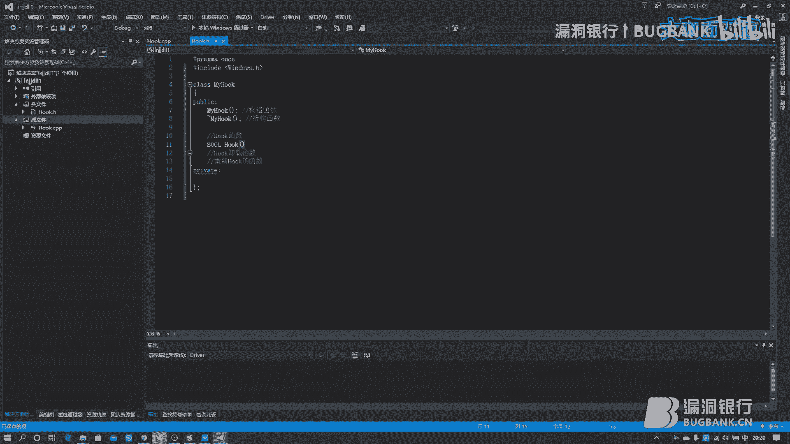
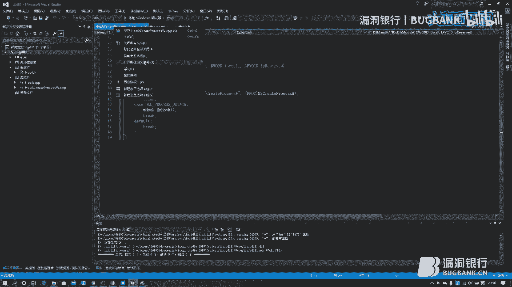
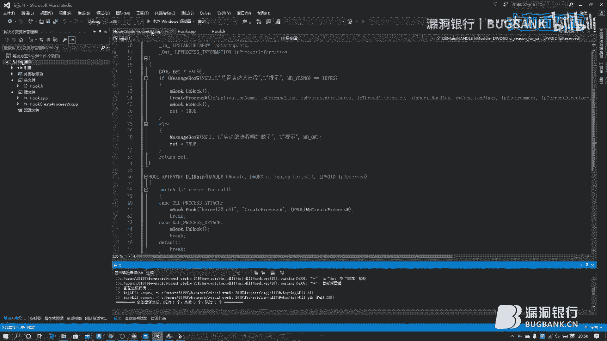
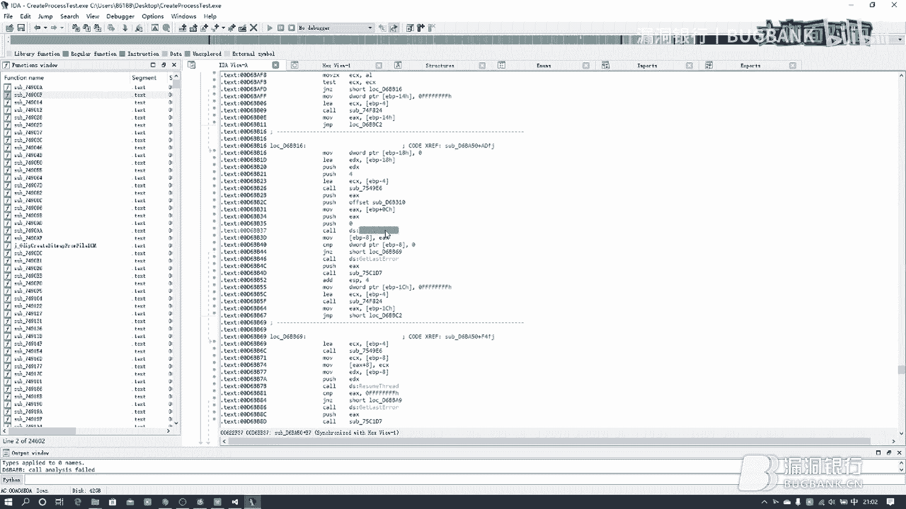
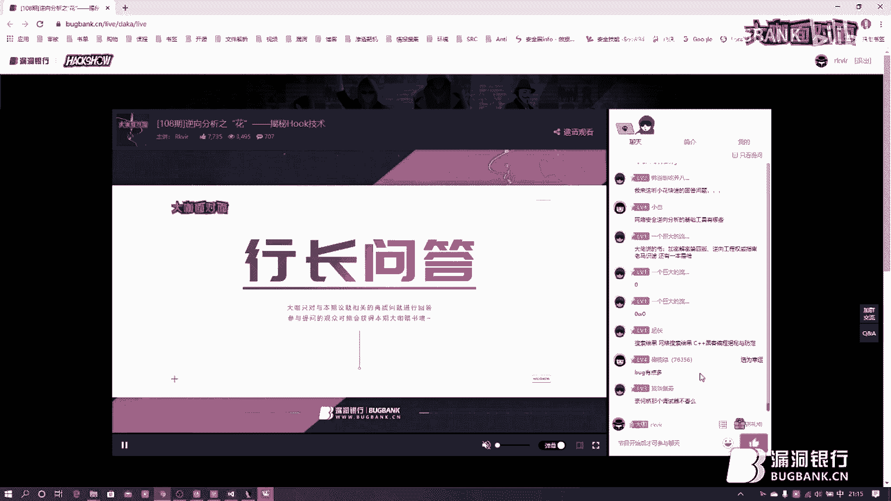
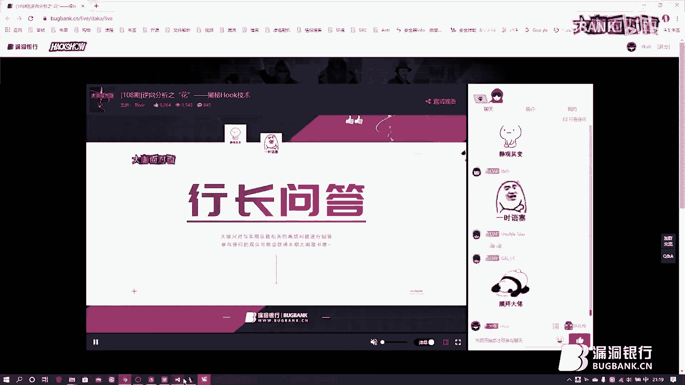
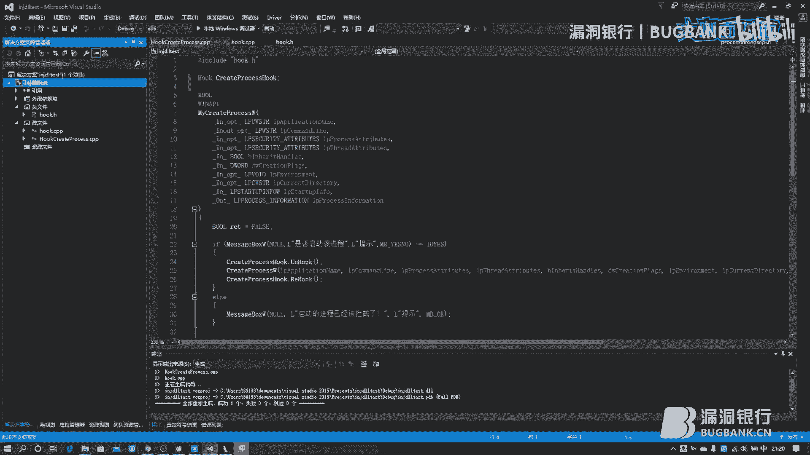
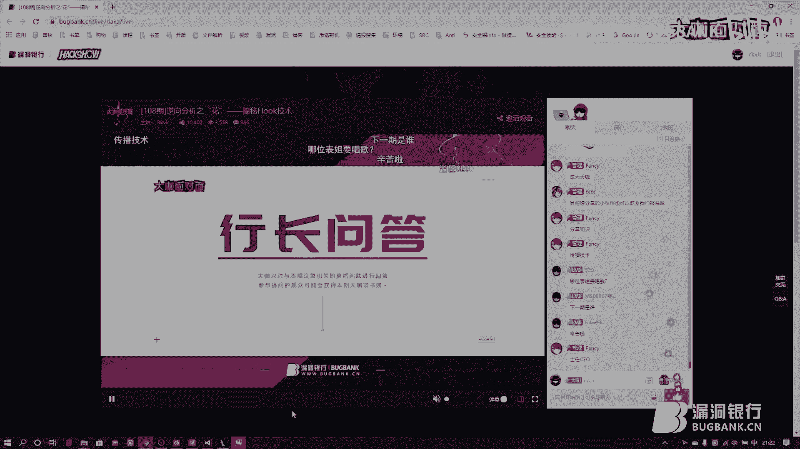

# 逆向分析之花：揭秘Hook技术 🪝

## 课程概述

在本节课中，我们将要学习逆向工程中的一项核心技术——Hook（钩子）技术。Hook技术被誉为“逆向分析之花”，它允许我们拦截并修改程序的正常执行流程，在安全研究、软件调试、行为监控等领域有着广泛的应用。本节课我们将从Hook的基本概念讲起，重点剖析IAT Hook的原理，并使用C++动手实现一个简单的Hook类，最后通过一个拦截进程创建的实例来演示其应用。

---

## Hook技术概述

Hook，中文常译为“钩子”，其核心思想是在程序执行路径上设置一个“钩子”，从而能够拦截、监视或修改特定的事件或函数调用。这就像海盗用钩子钩住目标一样，将程序的执行流程“钩”到我们自定义的代码中。

上一节我们介绍了Hook的基本概念，本节中我们来看看Hook技术有哪些常见的类型。

以下是几种常见的Hook技术分类：
*   **应用层（Ring 3）Hook**：
    *   **Windows消息钩子**：拦截Windows系统的消息传递。
    *   **IAT Hook**：通过修改导入地址表来拦截API调用。
    *   **虚表（VTable）钩子**：通过修改C++对象的虚函数表来拦截方法调用。
    *   **SEH钩子**：通过修改结构化异常处理链来拦截异常。
*   **内核层（Ring 0）Hook**：
    *   **SSDT Hook**：拦截系统服务描述符表中的系统调用。
    *   **IRP Hook**：拦截驱动程序的派遣函数。
*   **跨层Hook**：某些Hook技术（如Inline Hook）在应用层和内核层均可使用。

IAT Hook是其中较为基础且通用的一种，它不依赖于特定的编程语言特性（如虚函数），主要与PE（可执行文件）结构相关，因此在32位和64位环境下都能使用。本节课我们将以32位环境下的IAT Hook为例进行讲解。

---

## IAT Hook 原理详解

理解了Hook的分类后，我们聚焦到本节课的核心——IAT Hook。要理解IAT Hook，首先需要了解一个正常程序是如何调用API函数的。


### 正常的API调用流程

一个EXE程序在调用函数（例如系统API）时，通常并不是自己实现该函数，而是去调用动态链接库（DLL，如 `kernel32.dll`, `user32.dll`）中的导出函数。程序通过其PE结构中的导入地址表来查找这些函数的实际内存地址，然后通过 `call [函数地址]` 的方式执行。

**正常调用流程公式**：
```
程序 (EXE) -> 查询IAT获得API地址 -> call [API地址] -> 执行DLL中的函数代码
```

### Hook后的API调用流程



IAT Hook的目标就是劫持这个调用过程。其原理是修改目标函数在内存中的起始几个字节的指令，使其跳转到我们自定义的Hook函数中。


**Hook后调用流程公式**：
```
程序 (EXE) -> 查询IAT获得API地址 -> call [API地址] -> 执行被修改的指令（跳转） -> 执行我们的Hook函数
```


具体来说，我们通常将目标函数开头的5个字节替换为一条无条件跳转指令 `jmp`。这条指令的机器码是 `0xE9`，后面跟着一个4字节的相对偏移量。计算这个偏移量的公式如下：


**偏移量计算公式**：
```
偏移量 = 目标地址（我们的Hook函数地址） - 原地址（被Hook的函数地址） - 5
```

这里的“5”就是 `jmp` 指令本身（`0xE9` + 4字节偏移量）的长度。

当程序执行到被Hook的函数时，首先遇到的就是这条 `jmp` 指令，于是CPU就会跳转到我们的Hook函数中执行。在我们的Hook函数执行完毕后，我们可以选择：
1.  **不执行原函数**：直接返回，完全替代原函数的功能。
2.  **执行原函数**：先将修改的5个字节恢复为原指令，然后调用原函数，执行完毕后再将钩子挂回去，以备下次拦截。

---

## 实现一个C++ Hook类 🛠️

理论已经清晰，现在让我们进入实践环节。我们将使用C++来实现一个通用的IAT Hook类，这个类封装了挂钩、卸载和重新挂钩的逻辑。

首先，我们在Visual Studio中创建一个空的DLL项目，并添加 `Hook.h` 和 `Hook.cpp` 文件。

### 类的设计与声明

我们的 `MyHook` 类需要以下核心功能：
*   `Hook`: 执行挂钩操作。
*   `UnHook`: 卸载钩子，恢复原函数。
*   `ReHook`: 重新挂上钩子。


此外，我们还需要一些私有成员变量来保存关键信息：
*   `m_pFuncAddr`: 保存目标函数的原始地址。
*   `m_OldBytes[5]`: 保存目标函数原始的5个字节。
*   `m_NewBytes[5]`: 保存我们构造的包含 `jmp` 指令的5个字节。

以下是 `Hook.h` 中的类声明核心代码：

```cpp
class MyHook
{
public:
    MyHook();
    ~MyHook();

    // 挂钩函数
    BOOL Hook(LPCSTR szModuleName, LPCSTR szFuncName, PROC pfnHookFunc);
    // 卸载钩子
    void UnHook();
    // 重新挂钩
    BOOL ReHook();

private:
    PROC m_pFuncAddr;          // 目标函数地址
    BYTE m_OldBytes[5];        // 原函数头5字节
    BYTE m_NewBytes[5];        // 新构造的jmp指令（5字节）
};
```

### 核心函数实现

接下来，我们在 `Hook.cpp` 中实现这些函数。

**1. 构造函数与析构函数**
构造函数负责初始化成员变量，析构函数确保在对象销毁时自动卸载钩子。

```cpp
MyHook::MyHook()
{
    ZeroMemory(m_OldBytes, 5);
    ZeroMemory(m_NewBytes, 5);
    m_pFuncAddr = NULL;
}

MyHook::~MyHook()
{
    UnHook(); // 自动清理
}
```

**2. Hook 函数**
这是最核心的函数，它完成了查找函数地址、备份原字节、构造跳转指令并写入内存的过程。

```cpp
BOOL MyHook::Hook(LPCSTR szModuleName, LPCSTR szFuncName, PROC pfnHookFunc)
{
    BOOL bRet = FALSE;
    // 1. 获取目标函数地址
    m_pFuncAddr = (PROC)GetProcAddress(GetModuleHandleA(szModuleName), szFuncName);
    if (m_pFuncAddr == NULL) return bRet;

    // 2. 保存原函数头5字节
    DWORD dwOldProtect;
    VirtualProtect(m_pFuncAddr, 5, PAGE_EXECUTE_READWRITE, &dwOldProtect);
    memcpy(m_OldBytes, m_pFuncAddr, 5);

    // 3. 构造跳转指令 m_NewBytes
    // 3.1 第一个字节是 jmp 的操作码 0xE9
    m_NewBytes[0] = 0xE9;
    // 3.2 计算偏移量：目标地址 - 原地址 - 5
    DWORD dwOffset = (DWORD)pfnHookFunc - (DWORD)m_pFuncAddr - 5;
    // 3.3 将偏移量写入后4个字节（注意小端序）
    memcpy(&m_NewBytes[1], &dwOffset, 4);

    // 4. 将跳转指令写入目标函数头部
    memcpy(m_pFuncAddr, m_NewBytes, 5);
    VirtualProtect(m_pFuncAddr, 5, dwOldProtect, &dwOldProtect);

    bRet = TRUE;
    return bRet;
}
```

**3. UnHook 与 ReHook 函数**
这两个函数相对简单，本质上是将保存的字节数组写回目标函数地址。

```cpp
void MyHook::UnHook()
{
    if (m_pFuncAddr != NULL)
    {
        DWORD dwOldProtect;
        VirtualProtect(m_pFuncAddr, 5, PAGE_EXECUTE_READWRITE, &dwOldProtect);
        memcpy(m_pFuncAddr, m_OldBytes, 5); // 恢复原字节
        VirtualProtect(m_pFuncAddr, 5, dwOldProtect, &dwOldProtect);
    }
}

BOOL MyHook::ReHook()
{
    BOOL bRet = FALSE;
    if (m_pFuncAddr != NULL)
    {
        DWORD dwOldProtect;
        VirtualProtect(m_pFuncAddr, 5, PAGE_EXECUTE_READWRITE, &dwOldProtect);
        memcpy(m_pFuncAddr, m_NewBytes, 5); // 重新写入跳转指令
        VirtualProtect(m_pFuncAddr, 5, dwOldProtect, &dwOldProtect);
        bRet = TRUE;
    }
    return bRet;
}
```

---




## Hook实战：拦截进程创建 🚫


我们已经拥有了一个强大的Hook类，现在让我们用它来做点有趣的事情：拦截一个程序创建进程的请求。




### 编写Hook处理函数

我们的目标是Hook `CreateProcessW` 这个API。首先，我们需要根据其原型编写我们自己的处理函数。

```cpp
// 自定义的Hook函数，参数与原函数一致
BOOL WINAPI MyCreateProcessW(
    LPCWSTR lpApplicationName,
    LPWSTR lpCommandLine,
    LPSECURITY_ATTRIBUTES lpProcessAttributes,
    LPSECURITY_ATTRIBUTES lpThreadAttributes,
    BOOL bInheritHandles,
    DWORD dwCreationFlags,
    LPVOID lpEnvironment,
    LPCWSTR lpCurrentDirectory,
    LPSTARTUPINFOW lpStartupInfo,
    LPPROCESS_INFORMATION lpProcessInformation)
{
    // 1. 询问用户是否允许创建进程
    int nResult = MessageBoxW(NULL, L“是否允许启动该进程？”, L“提示”, MB_YESNO);
    
    if (nResult == IDYES)
    {
        // 用户允许，执行原函数
        // 2. 先卸载钩子，防止递归调用
        g_MyHook.UnHook(); // g_MyHook 是一个全局的 MyHook 对象
        
        // 3. 调用原始的函数
        BOOL bRet = CreateProcessW(lpApplicationName, lpCommandLine,
                                   lpProcessAttributes, lpThreadAttributes,
                                   bInheritHandles, dwCreationFlags,
                                   lpEnvironment, lpCurrentDirectory,
                                   lpStartupInfo, lpProcessInformation);
        // 4. 重新挂上钩子，以便拦截下一次调用
        g_MyHook.ReHook();
        return bRet;
    }
    else
    {
        // 用户拒绝，拦截此次调用
        MessageBoxW(NULL, L“进程启动已被拦截。”, L“警告”, MB_OK);
        return FALSE; // 返回FALSE表示创建失败
    }
}
```




### 在DLL入口点进行挂钩


最后，我们需要在DLL被加载时自动完成挂钩操作。这需要在DLL的主函数 `DllMain` 中实现。

```cpp
MyHook g_MyHook; // 全局Hook对象

BOOL APIENTRY DllMain(HMODULE hModule, DWORD ul_reason_for_call, LPVOID lpReserved)
{
    switch (ul_reason_for_call)
    {
    case DLL_PROCESS_ATTACH: // DLL被加载时
        // 挂钩 CreateProcessW
        g_MyHook.Hook(“kernel32.dll”, “CreateProcessW”, (PROC)MyCreateProcessW);
        break;
    case DLL_PROCESS_DETACH: // DLL被卸载时
        g_MyHook.UnHook(); // 清理钩子
        break;
    }
    return TRUE;
}
```

### 编译与注入

1.  **项目设置**：在Visual Studio项目属性中，将“字符集”设置为“使用多字节字符集”，将“运行库”设置为“多线程调试 (/MTd)”或“多线程 (/MT)”，以确保DLL的兼容性。
2.  **编译生成DLL**。
3.  **注入DLL**：使用专门的DLL注入工具（如远程线程注入工具）将我们编译好的DLL注入到目标进程中。

当DLL注入成功后，目标进程每次调用 `CreateProcessW` 时，都会先弹出我们的确认对话框。用户点击“是”则正常创建进程，点击“否”则创建进程的请求被拦截。

---




## 课程总结

本节课中我们一起学习了逆向工程中的关键技巧——Hook技术。

我们首先了解了Hook技术的概念和常见类型，然后深入剖析了IAT Hook的工作原理，即通过修改函数头部的指令来实现执行流的劫持。接着，我们亲自动手，使用C++实现了一个封装良好的 `MyHook` 类，它提供了挂钩、卸载和重新挂钩的完整功能。最后，我们通过一个拦截 `CreateProcessW` API的实战案例，演示了如何利用这个Hook类来监控和干预程序行为。





Hook技术是安全研究人员、软件开发者手中的一把利器。它既可以用于构建安全防护软件（如主动防御、行为监控），也可以用于软件调试、功能扩展（如游戏修改器），同时它也是恶意软件常用的隐藏和破坏手段。理解并掌握Hook技术，对于深入理解操作系统和软件安全至关重要。




> **注意**：本教程内容仅用于安全技术研究与学习。在实际应用中，请务必遵守相关法律法规，并获得明确的授权。