# P1：【录屏】机器学习概览——第28期徒手红黑树分享 - 漏洞银行BUGBANK - BV1a54y1a76J

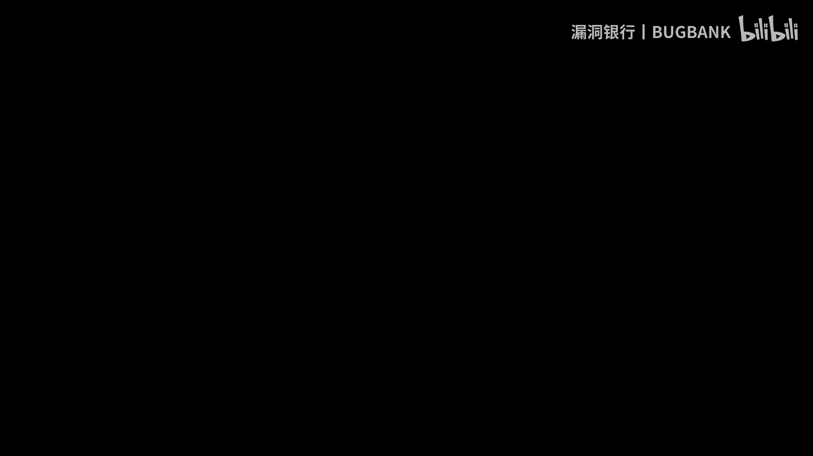

예。

。各位前辈大家好。呃，今天呢我是重新录制一下上次直播的课程。因为上次直播的时候，呃，因为我用那个麦克风太灵敏了，然后周围的噪声都给录进去了。所以说呃当时的录制效果不好。你们要是重新看的话会受到一些影响。

呃，所以呢今天就把上次的直播的内容再重新录制一遍。主要的内容我跟大家说一下，就是整个课程内容，我会在一开始的时候介介绍两个简单的记忆学习的算法，好让大家对这个记忆学习的。呃。

基续学习所要做的工作有一个感性的认知。之后，我会重点讲一下深度学习相关内容。因为因为现在深度学习也非常流行，非常火。呃，我会讲一些嗯讲三种吧，三种比较流行的呃神经网络结构。呃，CNRN和LSTM呃。

在讲完这些之后，我也会讲。再多讲一些强化学习内容。呃，因为强化学习内容其实也挺多的。然后我会在其中呃讲一些代码。呃，我发现大家都是对看这个代码比较感兴趣。大家在入门记忆学习的时候可能会比较困难。呃。

大家经常会被一些复杂的公式和深奥的理论所吓到。因为很多东西名字其实都是比较唬人的，它原理根本就没有那么复杂。比如说比如说记忆学习里面有一个有一个名字叫马尔可夫决策。马尔可夫什么东西。

关于马尔可夫东西特别多，你去你去百度搜一下马尔可夫就会有什么马尔可夫恋啊，马尔可夫模型，马尔可夫决策啊，还有什么马尔可夫不等式啊，马尔可夫厂之类的，大家都会觉得哇塞，这简直了，对吧？这到底是些什么东西。

而且你没点开以后就会发现里面理论都会非常复杂，给你一大堆公式。呃，这有些人我感觉他是故意这样想想让他的文章显得比较厉害一些。出书的时候也会有意把它变得。变得的比较复杂，多放一些公式和推导在上面。

会让别人觉得他写这本书很厉害，写这个文章非常厉害。其实其实原理根本就没有那么复杂，除非你是要深入的去抠它算法的每一个细节，抠它的推导过程，你才会用到那些公式。呃。

我们平常用的时候只要了解它的思想和方法就可以了。所以说大家一定不要因为这些东西所下的丧是对这个机续学习的兴趣。呃，后面后面到最后我会讲讲强化学习的时候，我会给大家介绍一下呃，马尔可夫那一系列。

比如说马尔可夫利亚马尔可夫模型，呃，什么引像马尔可夫这种东西。嗯，大家其实其实大多数人都是这么过来的。呃，当然有老师带的话会更好一些。因为我老师呃是搞图形学的，所以说在这方面，他只能泛泛的指引我一下。

我也是呃自己全部都是看书，一路自自学过来的。呃，我说的那些坑啊，就是呃就有很多坑我都是踩过来，一路走过来。所以说总结出了一些年练出了一些比较怎么说就是我我把东西理解了。

然后再把用一些容易理解的方式来告诉你们，呃，所以说我也是一个初学者，今天分享也是想让大家在学习继续学习的这条路上少走一些弯路。然后让大家进步的更有效率一些。因为大家也是。也是都是搞安全的嘛。

所以说可能对机学协议这一方面了解的不是很深。嗯，我就我就今天尽量讲的。呃，讲一些最简单的内容，然后呃复杂一点的或是比较流行一些东西。我用最简单最容易理解方式来告诉你们，就是做一个科科普。

当然公式我也会讲一些，让你感受一下这些公式是怎样推导出来的。嗯，其实这些好多东西在网上都能查到，对吧？大家入门了以后有兴趣可以自己查阅一下。嗯，之后。之后就。讲。这个关于机忆学习的一些内容。

关记忆学习的内容，其实记忆学习里面好多概念都是呃比较离散化的。然后记忆学习各个各个方向。也是。怎么说看起来是没有关系，其实又是有一些藕断丝连的感觉。比如说你去。你去什么书店啊或者图书馆。

你找一本比较大比较全的机忆学习的呃书的话，你会发现它各个章节之间的联系并不是很大。有那么两章三章之间是互相有联系的。然后你又看其他几张的时候，又发现你又接触了一个新的内容。

跟你之前看那些东西完全没有关系，对吧？但是它其实背后都有一些共用的理论基础。比方说你觉得第二章、第五章和第八章哎，感觉它的理论基础是一样。但是用的方法和思路不一样，就会衍衍生出三种不同的方法，这就是。

这就是关系到这个既学习的有一些学派之分，对吧？呃，像现在有什么贝尔斯学派啊之类的，啊，就不讲这些，就在前沿的时候我就。嗯，就是本来是想讲几个机忆学习的概念。然后在之前直播的时候，我发现呃，在光讲讲概念。

想讲透讲明白的话呃，比较啰嗦一些嗯。怎么说呢？当时当时我投票表决了一下，大大多数人都觉得这一部分可以挑过。那么我们就呃挑过一下。但是我会说一下这些概念呃，之后会用到哪些概念。

之后会用到一些函数拟合的函数拟合的知识，还有一些过拟合的基本概念。然后什么叫过拟合，为什么会过拟合这种东西，然后梯度限量法，这些大家都可以很简单的查到在网上有的是很多，你也可以去看一些。

那个文达有1个CS229D是资坦佛的一个公开课，那里面讲的就呃非常非常通俗易懂。然后用了一个房预测房价的例子，对吧？呃，黑以圈要是你不了解的话，可以先看一下那个课程，就是不用全看，就看那一节。

了解了解什么叫拟盒过拟盒，然后怎样呃计算Q度下降就可以了。嗯。然后还有一个是监督半监督和无监督的概念。呃，简单说一下说一下吧，反正这块也不是很复杂。有监督就是说你就继续学习。

继续学习其实就是构造一颗模型来去拟合。各种函数呃，各种拟合出各种你想要的函数的参数，大部分积极学习的呃。做的工作应用场景。背后要做的工作都是这一部分。然后但是你要去呃。

获取到就是说最后计算到你想要的参数，你你这个计算的方法是用一种什么样的方法去计算出来呢？就是说。就是会衍生出有监督无监督半监督这个问题。有监督的就是说你训练这个模型的时候，我会给你一个反馈。

就是说我有一个训练值。呃，比方说比方说现在做的最多的人脸识别吧。那你就是要给这个模型不断的输入人脸的数据，但人脸数据在输入的时候，每一个图片下面都会带一个标签，说这个人脸。

你你要比方说你要做一个人的名称的分类，就是说识别出哪个人，那你在输入数据的时候，每一个数据输入的这个照片的数据呃，下面都要带一个标签。说这一张图片是哪个哪个人哪个哪个人是训练的时候。然后有标签。

然后机器通过这个识别这个标签，不能说识别标签是吧？就是说通过计算这个图像值，然后运用某一些。某一些方法就是调整里面的参数，调整这个记忆学习模型里面的很多参数。然后这个参数得出一个结果来，然后。

与呃得出一个结果来，这个结果其实就是一个分类问题，你可以分类很多很多标签。然后它总有一个结果的标签和你这个。输入的时候带的那个标签所比较。然后要是有差的话，有差距的话或者不正确的话。

会把这个差距给它反馈给这个网络。然后它再重新调节其中的参数。呃，这种带标签的这种训量方法，就要有监督。那么还有一种当然是有既然是有有监督的，就有无监督的对吧？就是有没有标签，没有标签的话。

就是做无监督学习，呃，下面之后的就是下一章下下下下章我会讲到一个。一个比较呃基础又简单的记器学习方法叫kiing算法。然后它是一个无间度的一个学习。无间度的话，既然没有标签，它要它就要通过。

它就一定要通过某种特征来自动的分类。就是我不用标签了，不用标签，那么机器怎么知道怎么分类呢？它一定是有一种特征。呃，当然在kim里面就是以距离为特征，对吧？就是把你的某些数据，然后表示为距离。哎呦。

我看路上了。嗯，录着应该结我说一大段没录上。啊，就是以这个距离为特征来，就是说把你这些数据里面的很多呃很多有有用的一些参数，然后表现在二维空间或三维空间或四维空间都好，对吧？呃，那有两个参数。

当然就是三维空间，有三个参数就是四维空间，对吧？就用的四维空间，嗯呃。嗯，行了，嗯正讲什么。啊，讲这个有监督，无监督，无监督。呃，he means啊呃无监度就是这样，它你通过某种特征去让机器自动的训练。

然后自动进行分类归类。然后半监督半年度就是介于有监督和无监督之间的，它是怎么回事呢？呃，就嗯怎么说，它首先它有一种典型的方案，就是说从少量的就是。因因因为就是说你要是获取那种带标签的数据。

和样本本身代价都是比较高昂的。呃，然后传统的方式就是通过人工进行标注的这种方式，任务又非常艰巨。当然也有啊，李菲菲那个数据库。那个人脸数据库啊，不光是人脸数据库，它那个猫啊狗啊，那些小动物啊。

那些数据库都是通过招募全国各地的志愿者来给他进行人工标注。嗯，当然这种任务很庞大，没有通用性你。对吧你想把就说你要在上场过程中，你拿来一个数据，因为它没有标签怎么办呢？你人工人物一个一个标就太费时了。

所以说就有一种折中的方法。就是说呃就将少量的带标签的一些样本，就是构到一个初始模型，然后再将那些没再在模型里面选，选一些比较优的一些不不带标签的数据，然后对模型进行优化。就说你用少量带标签的数据。

构成这个模型，通过这种初始的模型来处理一些挑选过的无监督的数据。第二份是无监督，就不带标签的一些数据。这个数据训练出来以后，又构成了一些带标签的模型。

然后然后因为你的一开始要训练用到的不带标签数据是经过精行挑选的，所以说你就可以把这些数据融入之前的那些带标签的数据。这样的话你你就会将你带标签的数据库扩充的越来越大。然后在这种。扩充这些数据库之后。

我们再回来训练一下你的初始模型。我们训练好了以后，再用你的初始模型，对一些无标注的数据进行预测。再将这些预测结果之下，就是可信度比较高的样本，作为新再作为新的训练数据，然后扩充之前的训练集。

然后用这个新的训练集，对模型再进行重新训练，就是不断的这种这种这种循环反复什么扩充训练集的一个过程。对就是这是无监度的一个典型应用。当然它也也有一些变种。就是它最经典的方式是这样的。嗯。

之后会刚才讲到啊之后就讲一个最小二乘法。你在学习继续学习的初始的时候，会经常碰到这种方法。其实这种方法听起来好像比较复杂，跟数据有关。其实它是继续学习最简单最基础的一种。双法。这种方法就是说嗯。

怎么说呢？之前我刚才不是说呃去查查就要明白一下函数拟和的一个概念。其实它就是解决函数拟合的一个问题，就是呃比呢比一。这鼠标好灵敏。毕。呃，他又说怎么回事呢？这呃。因为机器学习大部分都是做一个。

拟合作工作。啊，比如说你你就是说这个就是一个很简单的回归问题啊，你有很多点。然后然后然后我要需要一条直线。一条直线来保证每一个点到这个直线的距离最小。这个我感觉高中时候初中时候就可以就已经学过吧。呃。

它的直线距离最小，这就是做一个回归，然后求它的回归曲线。因为在二次的。当然它这个最后二乘法，还有高维的啊，这我们就以最简单二维来说，二来说就是需要求出一个。2元1次方程组2元1次方程组来。

来表达一个最优的是。比方说你求出一个曲线是这样，你在求的过程中还有可能求出这样来。这样的话它每个点到它的距离可能就没有第一条直线大。当然怎么算它的呃大家还要明白一个概念，就是代价函数概念。

就是说我怎么来评价，我拟合出来的这一个方程。是最优的呢。就是说我在这个问题上就是说我们的距离是最短的，然后就要用到一个代价函数概念。代价函数就表达出它的在这个问题中就表达出呃。

就每一个点到你拟合曲线的这个之间的最短的一个距离。然后你要让代价函数最小，就说明你拟合的这个方程是越来越优的啊，当然当然对于二维的点来说就不用那么复杂了。因为直接就有一个公式就是最小二乘法。

第二种法这个公式就是就是这样的，我直接就把公式写上。呃，第二过程其实也没有必要看。呃，他是这个公式，他写的不太严谨，我感觉。就比如说有N个点吧，N个点的话应该是I从I等等一到到N，就说每一个点。

每一个点的XY的值相加，然后再求和就把每个点的和求出来。就是这这是一个求和的一个呃求和的一个符号，就是说你把前面就这个符号之前，你的所有的数I从一到N就求和一下。

就就跟那个写程序里面的一个循环后负号都一样，从一到N把它全加起来。然后N分之1啊，就是这个公式，这个公式就可以。把Y等X加B中的A给求出来，然后求出来A了以后，再呃利用它的一个平行值。

然后把B可以求出来，就是一个最简单的方法。它的最二层法。对，最好安装法的核心就是保证它的数据的偏偏差的平方和最小啊，就是那个在。哎，这个地方叫什叫什么纸？在数学里面。大二的时候会学到。叫叫叫什么？

也有两种求这个偏差，一个是带平方，一个不带平方，一个带根号，对吧？哎，具体叫什么名，我忘记了啊，反正就是使它其实就是使它带价函数最小。然后要是欧式距离，欧式距离这个名词也是唬人用的哈。

其实欧式距离是什么意思呢？就是说。😊，两个点之间的距离，二维的话就是。它直接两个点之间。的这个距点要三维的话，就是三维空间重的距离。因为三维的话。三维的话怎么画？应该是这样。对吧。

然后这个点和这个点就XYC有三个值，根上下X方加Y方加C方是吧？呃，C方X方S的差的平方加Y差的平方加最差的平方，就是它的呃在根三，就是求出它的这个在三维空间中的。距离。

然后欧质距离其实就是表示在高维空间中的最短距离啊，就这样。呃，在二审法讲完就。讲一个比较怎么说。K min和K加加之后会讲一个K min和K加加为什么挑这两个呢？一个是因为这个K min算法呃。

是他的思想在很多很多光在机器学习，在很多地方都会用到。然后呃因为他的就是用到他这种不断迭代求解的一个方法。一个思想。再一个就是K min和K加加。你在。呃，基本上找一本比较全的记忆学习的书里面。

你翻开目录都会比较显眼的。因为很多很多都是中文的嘛，只有两个英文的方法，一个是ki，一个KI而且都是带K的。大家会讲哇，这是这两个方法是不是之间有什么联系呢？其实没有什么联系。

而且这两个方法都是在不同领域区分开的。呃，呃，K meansK means和K安其实就是属于记忆学习的两大类。K means属于。再继续学习属于合方法和镜像机网络的那一类。然后K。KN啊。

错了KNKN就是KN就是基于一个统计学的方法，很简单，KN是最简单的一种方法。然后讲这个大家也比较好记一些嘛，不是KN加刚才。刚才一紧张，为什么生成KI压了呢？呃，这后是K啊，讲一下K方法。

就是简单的讲一下它的算法流程。就是说我有一大堆数据二维的哈，我要对它做一个分类，这就是一个无监督的一个典型的应用。就是说我其实无监督，它并不是说我就让机器胡乱的学，他要学，它总得有一个目标。

他总得有一个标杆吧，按照一个什么样的标准去学习去工作。那它其实就是按照这个距离的标准去来工作了。嗯，就是说我们你看要分类问题，还是按照距离分，我们一眼就可以看出，对吧？这也这是一类这是一类。

那么机器他一眼看不出来，对吧？那我们就要有一种方法，让他去在距离上对这个数据进行一个分类。平命的算法就是需要呃一个K值。K值是要人为确定，就说我要把整个数据分为几类，然后我就要之后，我就说需要人为的。

人为的怎么说？人为的确定。确定一个K值，还要确定K值点的位置。比如说我K等于二的情况下，就是这种情况。我们需要确定两个点，一个点是这个点，一个点是这个点，这两个点都需要人为的确定。呃。

所以说这个点划分的好不好，最终会很影响这个kim的一个准确率。呃，我们确认这两个点以后，算法就开始了，这开始这个算法是一个不断重复的过程，就不断迭代的一个过程。它是要求什么呢？

就是先把每个点与这两个这角种子点与这两个种子点的距离进行比较。那么比如说这个点是A点吧。它离红色点比较近，它就把自己划分划分为红色这一类呀。然后比如说这个点。这点呢它就是交B点嘛。

它就离这个蓝色点比较近，离红色点比较远。然后这个算法会将每一个点与两个种子点的距离都做一个比较。然后比较离哪个点比较近，它就认为是属于哪一类。然后我们第一次比较完成之后，我们就会把。

其中其中的数据划分为两类。呃，两类的时候我们会有有一个重要步骤，就是重新定位这个种字点。这种子典一开始是不是我们人工定义的嘛。然后我们会呃就下一步要重新就是选取这个点，重新选取这个点有很多种方式。

就是它的精髓就是这个选这个点啊，这个方式很多之后下面我会讲到其实最简单一种方法就是加强求和，对吧？我们把所有的点的F的时候加起来，然后不是加强求平均就是加乘加和乘平均就所有加起来以后除以它的点的数量。

然后求出一个平均值Y的地方也是这样。然后我们就会求出红点的这个新的种子点的位置，然后蓝点的新的种子点位置也会求出来。然后我们再从头运行一下这一步。就是再把每一个点和它的位置进行。进行一个比较。

然后再重新划分点，然后又重新划分出来两类，然后再重新定位这个位置，直到这个位置就是。就是固定不变了，就是说它的这个代价函数它收敛了，对吧？它这个位置它不动了，然后这个就是趋域稳定，说明我们的。

说明我们的算法就是结束了，我们就化为两列。然后当然还有K等于2，有K等于三的情况。K等于三的情况，我是从双找来一有个土啊。对，就是这样。嗯，一个一个K等于几，K等于几，当然K值是。人为划分了。

所以说这个方法就有缺点。也有两个缺点吧。呃，这是介绍一下，就是三种逼近虚心呃中心的方式啊，不是逼近中心方式，就是三种重新定位种子点的方式。刚才不是讲到最简单的是呃就是嘉禾，然后。就是求它的平音值，对吧？

然后其实还有三种方法。这三种方法我想啊呃这三种方法其实都是由这后面两种方法都是由第一种方法演变过来的。第一种方法，这公式有点小，不知道大家能不能看得清。就说刚下。有个兰姆达，是个兰姆达竖十人为定的。

一个球和是一到N啊，我就不写一到N是吧？K等于1到N。然后我们会有一个绝对值，因为兰姆da不一定是奇数还有偶数，所以说我们要加一个绝对值，然后。IK减去XGK。就是。怎么说呢？呃。因为K是在变的。

所以说。就等于其实就等于相当于把每一行或者是把每一列的值加起来。然后呃它的兰姆达次方再有一个就是它兰姆达斯方进行一个求和，然后再开根号。当然这种方法就是收敛比较慢嘛，所以说还有一些很很多演变的方法。

就是比方说这个直接是二次方，就第二公式就是第一个公式的兰姆达变成22次方以后，一个根号，或是直接就把这个兰姆达变成一直接就不用内步，它收敛会比较快一些。这个就是写它并趋近一个方式。呃。

它这个图表示什么意思呢？它是一个概率图。其实就是说比如说我们这些点。都是我们的数据点。我们有一个就是很规整的一个数据点，就是一排一排一排一排的。然后我们要是运用这个算法进行聚类的话。

它最有可能这个就是这个种字点，最有可能在哪一个点上出现。就是说蓝色地方就是说它最有可能出现的地方，红色的地方就是说最不可能出现的地方。比如说要是这个种子点在这出现，有的时候它会有非常快的。非常快的逼近。

然后他要是在这个地方出现，它有可能逼近比较慢，就1。1。1。1点往这过来，对吧？这个图也是这样，就是很快平行中心很快的平行中心。呃，所以说所以说这种这后越往后的方法是对第一种方法改进。你看第一种方法。

要是呃它要逼引这中心的话，一旦这个种子点选在这儿，它可能就不往中心走了，就是经常是。经常是徘徊在这个周围，因为他认为在这个十字周围就已经比较收敛了。

而之后比较好的方法就会呃改进的方法就会让他逼近中心的方法更快一些的。你看最好的方法，当然是第二种方法。第一种方法也就是说在这个的周围的时候。它的逼近中心速度还是比较慢的，因为已经变成绿色。

这个地方还是黄色。所以说它毕近中心的概率更高，然后速度更快。呃，讲了一也没一堆没用废话，有点浪费时间。呃，就是说K命算法它当然也有缺陷。呃，缺陷。要讲缺陷，而且啊对他那个K定算法，嗯为什么要讲这个算法？

他还有一个有很有名的思想是他这个迭代思想，他这种迭代思想在很多地方呃都有应用。呃，比如说比如说。比如说牛顿迭代法，牛顿迭代法就是一个求解方法，呃，和他的思想原理是一样的，就是不断的迭代去。

逼近你想要的那个值。关于牛顿迭代法，大家可以查一下。大家可以在网上查一下，也是一个非常。阜阳。非常巧妙的一种方法。它只能呃它是只能慢慢的近似于呃这个你想要的值。

但是可能它不一定会完全会得到就是最准确那个值。这个呃这种迭代思想呃，除了牛顿迭代法，还有一个是高数上用到的一个泰勒公式。态道公式，大家要是什么考研啊呃小高数人都会知道这个这个公式是非常牛逼的公式。

它最牛逼，处在于呃，万物皆合展开，就一切公式，经过泰勒公式的这个方法都可以把它展开为展开为一个统一的格式，就是。呃，不断往就是不断一个高速方的一个。加和的一个形式。

就说它是类就是临驾于一公式之上的一个公式。他的思想也是用了一个迭代的方法，就是说他是不断的那个2次方、3次方、4次方5加5次方加6次方。对它也是一个迭代思想。它他迭代是更往高的抽象的。

地方进行迭代来逼近来。怎么说？也是逼近那个菜导公式原本要表达那个公式。呃呃呃，大家有兴趣就可以查一下这个牛政节代法也有一个比较有趣的事情就是。之前有一个游戏，不知道，就很老一个游戏。

97年的一个游戏叫雷神之锤之后，这公司被威染收拾了。然后雷神之锤的那个创始人。创始人呃创始人也是写代码，他也写代码，他不是跟现在的这种创始人CEO样职务，只做一些管理层。

当时他们有公司要做这个游戏时候要写代码，然后用牛顿迭代法处解的时候。呃，会比较慢，因为当时的硬件硬件能力也是比较低。然后所以说他们需要一个巧妙的方法，就是改善一下画质嘛。因为你在同学中你要。呃。

比如说一些光线追踪算法，所有的这种模型的算法，当时是用一个投投射的方式，把三维空间的呃模型投到二维的屏幕上，你能看得到。然后你到移动的时候，它的那些二维空间的变化，就是通过三维空间的这些数据映射过来了。

大家做这个映射过程中就需要一些很多求解的。求解的问题就需要很多求解的一些一些过程。然后当时有一他那个CO在代码里面写了一个非常牛逼的一个代码，他就是直接写了一个固定的。固定的数值。固件的数值。

那个数值就是超明度数值，再通过它一个特定公式，就直接能求解，比牛顿迭代法要快将近10倍左右，然后到到当时就是为什么会做出画面那么好的游戏。为什么雷神之锤会就是雷神之锤三就是会特别风靡一时吧。

就是因为它的那个求解的方法特别快，对吧？就相当于把它当时的计算机能力提升了5倍左右？嗯，哎呀，说到了。呃，这呃，刚才说啥。呃啊说迭代啊不说迭代，说这个kiKmiss的一个算法的缺陷。它缺陷有两个缺点。

一个是呃你的这个K值需要人为事先给定，然后之后。还有一个就是说你的K值的位置也需要人为给定。因为这个K值这个问题，你要是人为进行操作的话，对于无监督学习来说，就是有点失去意义。你你给机器。

你本来无监督学习，就是想你给一堆数据扔给机器，让机器自己搞，我人为不干有，我也不给你加标签，你把搞出来结果就可告诉我就可以。但这样的话，Kmiss最经典的方式。

需要呃人为的要参与些K的个数的确定要人类就要说哎我要分为洗类，对吧？然后我们还要人为的确定这个距体中心确立的不好的话，还容易。出现一些过拟合的问题，他就会把一些很无关紧要的一些散点。

比如说什么二维图二维图是这样的，哎，我们的很多点在这里很多点在这里，它突然蹦出来一个点在这儿，你这个KK的位置确定不好的话，它很容易把这一个点，它就化为一类了。呃，或者是。有两类隔着比较近。

它的敏感度不高的话，它就会把这本来是隔着镜比较两类来化为一类。也就是说它并没有一个全局的同揽能力，它不可能统计所有的点。就说它不可能统计所有的点的情况，它要是有一个全局同转能力的话，它就不会发生。

我刚他说的是么两种情况。就是说呃就说隔着比较近的两类化为乙类，或者是一个单独的几个点，零碎点化为一类。也就是说它的方法和那个呃我们传统的代亚函数的。缺陷是一样的，也它会陷入一些局部的自由解。

当然二维数据我们人眼一看就能看出来。因为我们我们人眼可以看到所有点会所以说有有一个观察到全局的一个能力呃。嗯，之后就是有一个他的改进的算法叫ki加乡算法。他的方法就是把前面两个。

方法的呃前面那两个缺点都给客服，一个是我是随机随机选一个点。当然当然它也有它的改进方法，最典型的方法是我随机选一个点。

当然有很多方法可以通过数据中的一些计算来来不是随机选一个点去通过计算来选一个你的第一个种子点，它的它也不需要确立KK值。因为他是怎么出来的呢？他是我要把这看一下。操。它是一开始是指我们就以这个图来说吧。

它不需要一个KK值，它的K值是自动生成的，就是不断扩大不断扩大。然后直到它有一个判别函数，判别函数判别你这个K值够多了，而且你K的位置不是你每个种字点的位置已经比较收敛了。

那么它这个判别函数就会认为你的整个K means三压算法就是。就是稳定了，它是怎么回事？他一开始先选一个点，随啊不就选一也也有随机的方法，也有也有通过这些点进行统计出来，先一个点，选一个点之后呢。

他他是怎么划分两类来着？哦，我想想啊它呃选一个点，它也是统计每个点到它的距离啊。然后它的一个核心方法也是一个可替代的一个方法就是。再衍生出第二个种子点来，怎样判别？

它是根据Z点间那种方法是根据距离距离来判别。我后面有公式嘛哈。呃，没写红柿。微雄是他的第二个方法。呃，他最典型的那种方法是。呃，是基于概率的一种方法，就是说你的距离越远，它就越越有可能成为第二种子点。

你的距离隔它越近，就越不可能成为你的第二种子点。当选出第二个种子点来之后，又迭代上一次的过程，然后进行。借每个点进行统计，然后再用运用那个通过概率的方法来确定第三个种数点。

直到它的那个有最后有一个判别函数，觉得这个稳定了，然后就是。它就会自动的分类，就是克服了这个com的一个缺陷缺陷。当然还有一些改进的方法。比如说有一个方法叫模糊king，大家可以去查一下。

那个也也是比较有意思的一个方法。K miss。嗯，ki还有一个应用，就是呃在。在图像压缩的时候会有一个应用。原始图是图对，就是在图像压缩的时候有一个应用，就是在图像压缩的时候，呃。

有一种有损压缩数据的方法叫矢量量化。十恋电话就是。嗯，他就是像我们。的压缩方法思想一样，就是用一些字典。用一些字典来表示一些用运用字典，然后去表示一些重复的一些呃数据块。然后来达到一些压缩的。

压缩的方法，但是这个字典的设计呢就是。需要最初的时候是是需要用kimiss算法呃，做这个实量量化进行。对，进行对这个字典的设计，最后也发这个模糊也是呃也是在。再怎么说，在解决这个。

就是说这个字典的问题上，然后发展出来的。啊，K means是讲讲多长时间了？半一下是吧。呃，之后还有个KNKN更简单。也是一个。怎么说？嗯，就直接想他具体怎么回事吧，就是说我我现在有一大堆的数据，对吧？

我的数据也有标签，也有分类。我来了一个新的数据。怎么怎么办呢？就说我怎么对它进行划分分类，就是说我们把这些数据都投射到一个高维空间中。呃，要是你的数据，比方说只有两个特征呃，比方X和Y吧。

那我们就是二维空间，有三个特征，就是XYZ就投射到三维空间中。然后我们来的这一个数据，它肯定是类型，也是和格式也是和这些我们已有的是一样的。比如说二维空间，比如三维空间就有SYC吧。

然后我们就要也是要定一个K值，它这个K值是一个距离的一个阈值。在这个预值之内呢。怎么说？比如说我的这个一值是3，这个阈值是5，对吧？那么在三我们把阈值定为三的话，就是以我们新来这个点为中心。

然后我在欧式距离欧式距离为三的之内的点进行一个投票。那么像这个例子中，红色三角形就有两个蓝色方块就有一个，那么投票决定，新来的这个就是当然是属于红色三角形了。那么。那么我们当K值设为5的时候。

那么我们蓝色就有三个红色，有两个，我们投票决定现来的就是属于蓝色方块是一列。呃，所以说这个算法它也有很多改进。呃，它的K值就是对它的判定的结果的好坏有很大的影响。呃。

这两种方法就是介绍一些最典型的就是说它最基本的一个方法，它们呃要用的话根本就没有用这种最典的行方式，一般都是用它的改进方法，大部分用的时候就是用到它的一些思想。

而不是说把它作为一个单独的算法投入商上使用。哎，讲这么多。呃。好像还有一个一个地方没有讲到。自组织映射自组织映射。对这个地方。呃，就是说我就罗列了一下，当时就现想的一些拿了一本书比着来是来进行。对。

目前有已有比较流行记忆学习和方法分为这么几类，一个是多层感知机是一类。它就是神经网络的组先。我们下一章就会讲到感知机。然后就是之后就是数模型，数模型又有决特数啊，呃，回个数就列数啊，决测数就是很简单。

就是你就是画一个数就是一个判别数，你的满足某个条件就往哪个分支走。呃，线性模型具有Z二乘法是刚才讲的最最简单的多元线性回归。刚才讲的是2元11次的线性回归之后还有多元的、3元、4元、5元。

基本上就是一次。但是。因为越高四密，它就越容易出现过拟合的问题。所以说我们要做回归问题的时候，尽量把呃尽量把我们的参数变多。但是私密降低。这样对解决过拟合有好处之后还有正能化回归。

什么SVM也是属于呃也是属于线性模型吧。关于SVM大家也可以查一下，它也是在神经网络流行之前，它是最成熟的一个也是运用最广泛的一个技学习方法，它被大量运用在一个一些股票投资啊。

包括金融里面有什么高频交易量化交易啊，然后有一群专家去搞一些非常现在来说对已经非常完善的SVSSVM模型。呃，就以目前的时经网络的，就以目前的发展的状态来说。

在金融领域还不足以呃匹匹敌SVM当然以后是肯定会要超越的。但是因为几十年来积累了很多专家都在形容领域调试这个模型，所以说这个模型就是现在是非常成熟。呃，之后基于统一力学的分析方法，有马尔可复练。

之后就会讲到马尔可复练模拟测个方法也会讲波尔斯曼基就是呃把。把那个什么叫叫什么ho file网络加入模拟退火的思想，然后形成的就一个新的模型是由hton就目前既学习的penTON。元老。

之后我会讲点历史方向，历史方面的东西呃，深度呃深度哎。Loic和信度网络。是不是打错了，应该是DBN吧，这个地方应该写个DBN是深度信念网络。逻啊，当然逻辑回归也是啊，这应该讲了加一逗了。

忘加了有逻辑回归逻辑回归DBNDBN就是深度GBN有两种，一种是深度bo慢机网络dep。呃。bo曼network，bo曼怎么拼？就这个。

然后是还有deep believe network deepep believe network呃确定性退货，这个我不太了解。主成分量分析。呃，现在也有很多搞这个课题了，我们我们老师也有很多在搞。呃。

对。这些这动态规划这一类在强化学习就会用到包括呃驾驶迭代测迭代，然后Q learning。这些自由准则也会最后会讲也会讲在那个在那个什么，就最后一章校化学习的时候会讲到专家系统。

其实就是角色角色术的一个应用，也是但是也有一些改进。呃，试一讲讲什么是深度学习。什么是深度深度学习面上来讲，它这个深度呢，意思鼠标怎么没有意思这个深的意思就是说我的神经网络的层数比较深。

这个深度学习这个概念是还是这个继忆学习的那个元老叫亨，这个人非常牛逼，源于他个人努力是分不开的。当然源于他的基因和和他的教育教育水平。因为他的基因非常好，因为他的家族就非常牛逼。而且这个之后再讲。

后面再讲呃，深度。其习这概念是很坦能这些人在06年他研究刚才说了呃de believe那套深度信念网络，也有叫深度信任网络，也有叫深度知信网络的。呃，他在研究这个网络的时候提出。

提出这种贪心的逐层逐层训练的方法。的时候。呃，提出这个深刻学习的这个概念。呃，当然他发现也就深度学习。从那个时候发现他他这个。就是非常好用，就解决一些深层结构相关的优化难题的时候，会很好用。

也通俗来说很好用。呃，然后之后。之后这个深度学习在应用方面就是。这叫叫listson这个人，呃，有人说他他是这个CN的发明人，就选接声音网络发明人。其实不是他是和很多人一起提出CN的这个概念。

但是他的最。最。有价值的地方就是他把。他提出了BB算法，就反向传播算法。这个算法简单解释一下，就是说我们刚才不是说有监督和无监督学习吗？有监督学习的时候不是带标签嘛？那么我们这个模型。

比如说我我们这个模型就用一个黑箱来表示，我们这个模型输出的时候和我这个标签的标签这个数据。就是不一样怎么办？它会计算它们之间的差值，然后反馈给这个黑箱，然后在这黑箱中把这个参数进行调节。

这种调节的算法就是必须算法叫反向传播啊，什么叫反向传播？就是。到了输出的时候再传回来，从输出的一层一层往回传。然后来调节每一层的参数是要反向传播。啊啊，当然有反向传播，也有正向传播，对吧？

那那就再讲讲讲不完了又。呃，刚才讲到什么了？呃，这个laon这个人啊呃讲这些历史就往后面再讲。呃，后面讲历史的话。嗯啊，就是雷son这个人提出等人提出了CN并且发扬光大。就是他把BP算法用在CNN中。

而且确实好用，确实能work。喂。呃，讲点历史吧，要不要就讲点历史吧。呃，就讲这个人工神经网络。对呀，我当时写的是从历史发展开始说写人这个神经网络是深度学习这个概念的由来，对吧？

就是说神经网络的层数神呃，就是这个概念这个深度学习概念就这么来的。那么那么那么那么这个神经网络它是怎么来呢？就是关于神音网络。的研究是起源于。上个世纪的什么时候，就解放之前吧。

就是90年代到中国解放是49年50年就是这段时间。呃。从简来说吧，之前讲历史时候讲了很长时间，那么就从就是有一个叫hip的hip的。心理学家还是他应该是一个心理学家。对。他研究。

研究这个人类人脑的这个神经元的时候，发现这个人脑的活动是靠脑细胞的组合连接实现的。如果这个原神经元和目的神经元一块儿兴奋的时候。他们之间的。这个连接就会加强。

之后就是这个概念就是为之后的人工神经网络算法提供了一个基础。呃，再往后一点，就过了那么10年8年的时间，就有一个计算机科学家。现级科学家叫什么来着？对他提供了他提出一种三层的神经网络模型。

就是你要看我们感知机的时候，就是最常见的这种。两头大，中间小只有一个隐藏，这种三层的神经网络模型。人工实验网络模型。呃。然后。然后这种感知机模型当时就是越来越流行，就会发现他们解决很多问题的时候。

运用这个感知机模型非常好用，而效率也很高，准确率也很高。但是好景不长，好像就过两三年的时间，就是有一个人物智能学者，当时美国一个叫min miniiky。对，这个名很老记。Mii。最小的天空。

min你hi有这个人。这个人还还他还还有一个同伙，那个同伙是谁我忘记了，反正就那么两个人，他们就是对这个人工神经网络进行深入研究，而且是从数学方面进行研究。因为数因为是这个人就是他理论基础比较强。

通过数学的论证的话，因为数学是很严谨。只要数学论证通过了，说明他在这个。客观上是没有问题的，但是他们在数学。数学论证的时候，发现这种简单的声人工神音网络只能对线性问题进行求解，而对一些非线性问题。

就三层就没法。没法求解了。就比如说你要分类的时候，这一类。和这一类对吧？我们这种线性问题就是。就是就是怎么说，线性问题，就是这种1元也没有。呃，怎么说？2元1次其实是属于你就可以理解为2元1次的这种。

嗯那么非线性问题的话。就比如说我需要画个虎。是什的二次方程对吧？是是是非现象。像这种三段时间网络在数学上就被论证，它只能求解线性问题，不能求解非线性问题。这样的话它就很有局限性。当然。

人工实间网络没有那么脆弱，它也可以求解线性问题。当时他做的工作只做到了这一步，就说他发现要求解非线性问题的时候，要增加其中的。网络层数三层变成四层，四层变五层，这样隐含层数增多之后。

它就会这个模型会变得非常复杂。然后他在数学上就求不了了，对吧？三层四层五层他就求求求解不出来，其实其中的运算量也是非常大。🤧。然后当时理论理论基础就不能。就不能。

在数学上就不能证明多层的神音网络它是有意义的。因为数学上已经无法论证了，也是受限于当时的这个计算人工这个计算量的问题。觉得这个是个黑箱问题，就是呃论证不出来，就是高高就是。多层次的话是哎呀说的。

太繁琐了。呃，就是反正这个人就是说他他在沟层上多层的时候有问题之后因为他的这个学术地位很高，所以就影响到当时的呃。就很影响当时的神音网络的。一个人工视音网络的一个工作和发展之后，在这之后。

就几乎所有关于神经人工神影网络的研究都停止了资金的支持。而且就停止了很多基金的支持。当时科研就是到现在也是需要用科研基金嘛，基金基金来维持的。然后很多期刊啊。

还有呃很多地方就一看神英网络的论文就直接不给发。所以说很多人就。很多很多大牛吧也都放弃了这方面的工作。之后大约在19。8几年没到9几年，8几年的时候，就是有个叫hope file的这个人。

是一个生物学家，他是是个生物物理学家，他的爱好也是比较广泛，什么都看。看一下。生物理学家，他呃他根据前人的研究成果提出一种新型的神经网络模型。

当然这种网络模型就是以它的名字命名叫hope fair的神经网络。这网络挺复杂的，这个人叫后。ho。FI。一。没有。地。Hope failed。呃，这个就这是这个网络就是现代人工神音网络的一个鼻祖。呃。

几乎现在大部分的使用网络模型都是在这个网络上进行改进的。包括之后我会收到的bos斯曼机，也是黑黑ton这个人在他的这个网络上进行改进的嗯。呃，包括我现在很感兴趣一种网络叫混沌视音网络。呃。

大家也可以查一下，不过这方面质量非常少，只有一些论文可以看。他他也是在这个网络上进行改进嗯。之后之后在那个波尔斯曼西上讲一下，他做了鲍尔斯曼西是对他做了一些哪样什么样的改进。他其实是。他其实是。

一会把不好怎么。呃，直接减去跳到这个地方讲吧，因为已经讲到这个地方了。不知道对换机其实是怎么回事呢？嗯嗯。就说还是hen这个人。他坑狠这个人是他是也。长得很惨。

就我前两天前两天研究了一下这个机器学习大牛之间的一个关系。呃，我还画了一个图。这要话哎。录了吗？啊，在录。哦，我当时还特意研究了一下这个大牛关系图之后，大大牛之间的关系，然后总结出来一个图。

然后一眼就能看明白。呃，我们耳熟能详的很多名词，虽说他之间确实。确实这些名字之间确实是有关系的。当然这个亨ton这个人是可以说是鼻祖吧，他的家族非常非常强。他家族他爹也非常强，他爹他媳妇也非常强。😊。

嗯，他媳妇不，就是他他叔他爸爸的兄弟。和他姨那边的。哎呀，就说的比较通楚啊，他姨那边的基因都非常强，他爸爸的兄弟是一个英国很有名的。昆虫学家。啊，他爸是昆虫啊，大家可以研究一下。

这个在网上有很多他的家族是。当是就是他记性非常好，然后就往上推三代，推四代都是很有名的科学家。然，包括他妈也是。然后我刚才说的这个latonlaon这个人。

他现在在facebook看他和这athton也是有关系的，他关系是呃laon在。多伦多大学读这个博士研究生的时候是跟着他，然后之后还有一个人。怎么读？这个人可能大家不太了解。

但是他徒弟大家耳熟能详是这个bingo。 bingo因为写了一本书叫deep learning嘛，deep learning就是。去年去年在网上出，不能说出版，就网上已经出来了。

然后今年也有也有他的翻译版被誉为这个继学习的一个盛经，他的老师。是这个人乔丹乔丹当时想拜这黑炭为师，结果被人婉拒了，就不收他，不收他以后。但并不是说不收他他又不强了，他也是非常强的。

他他的那个交徒这个风格特别。呃呃就是他最在徒弟的时候，他又不管，就现在很多大牛也是啊，就是说你呃博导或硕导的时候，老师很多很强的老师，他根本就不管学生。嗯，你就见不到他面，他也不给你指点。

就让你埋头苦汗。所以他当时有一个小小沙皮，就是说感谢我的老师呃。😊，他怎么说的来？就是感谢他老师不管他，然后加强了他这个自我研究的能力。😊，嗯，之后他也有没有学生。他的协商。叫h口。

汉狗在youtube上有一个叫呃 neural network的网络课程非常好。在youtube上直接可以搜到。位上给大家看一下。您一搜就能搜到。他那个课程讲的。是那句话的叫什么来？由浅入深，对吧？有。

能找到他。而且课程质量也很高。就非常清楚。哦，这是黑ton哦，这你可以大家可以看这个课程，这个课程非常好，在口啊，它是把口上搬运过来。

heton有一个newnet workform learning课程。在在大家要是想看这个课程的话，可以在口上看。COURCOUSEI。库肉上。没呀。酷搜上搜。怎么回事？可以。牛奶火锅。

我是南你是多伦多大学的一个课程。对。这个就找着多伦多大学的。因为他其实现在还是呃一边搞学术，每周都会有回到东伦多大学授课。对就这个课程这个课程我没有看过，但据说非常巧。呃。

这这个人就非常想他课程肯定不会上那个课程我找不到了，我之后会把链接发给大家。呃，他对他有一个课程很好很好，完了以后。包括JN呃前两天有一个不是前两天，就是去年9月份的时候，大约这是几10个月之前。

去年9月现在是107月10号，去年9月份的时候提出有一个人提出了叫JN叫对抗神鹰。对抗性。好像就叫对抗性神经网络，中文怎么翻译，记不住。呃，他就是这个哥ello提出的他这个。说这网络就说多了。

他的那网络模型就是有两个网络模型。然后你要训练形容A网络的时候，B网络就不断对A网络进行干扰，就相当于。就相当于源源源源不断提供有干扰的数据，然后来训练A网络。呃。

反正这个大家在网上找就能找到说一时半会说不清楚。我感觉我表达表达能力不太强。呃，这个模型现在呃当然出了一个月在骑镇。呃，呃，对，大家是搞安全，搞安全的时候，大家可以关注一下这个网络。因为这个网络就在。

在新安全上。新安全上。有有和这个机器学习的交叉点，就是说信息安全和机器学交叉点，我目前想到一种和别人很多人讨论，其实也就两种，一种是利用机器学习的方法来替代信息安全中，我们人工需要解决。

人工需要处理的问题。比方说。比如说你当然新安全我只是略懂一点，当然没有各位各位大牛懂多。嗯呃，第一种方式就是说替代人工或是改进一些更好的过滤器，呃，大家什么抓包的时候，用什么V抓包是吧？

那么就是有这种专门过流量这种防火墙，这种防火墙就可以用继续学习方法，既然大量学习之后，他就知道哪些哪些流量该过哪些流量或不该过。但然你别有用心的训练，它就可以把你想要哪些数据给晒晒一晒。

比方说你想要某种某种你就不说了哈，就每个人对有每个人意图，你想要某种某种样数据，你就训练呃对。你就训练一种。呃，对你想要数据比较敏感的那些网络，然后他又会把那些数据给你筛选出来，这是第一种。呃。

说到这个就是这就说明没有一种网络模型是通用的啊，就说没有一种网络是模型，就不说网络模型，没有一种模型，它又是。通用的就说什么事能都能干，这就是继学期里面一个呃比较重要的常识。

也是我们人生活中的也是一个比较重要的常识，叫no free lunch之定理。就是字面上意思就是没有免费午餐。其实以我们的话来说，就是鱼与熊掌不可兼得。就说你你的这一个模型，对我给大家找一下。

他那个原话怎么说嘞？no free lunch电里它原话就是说。不存在能够在所有分类问题中性能均为最优的方法。就是说每一个模型它只对于你你训练的时候，它的目标。呃，做目标工作的时候，它的结果是最优的。

不做它目标工作的时候，结果就是他就会不会达到一个最优解。就比如说我们我们当时阿尔法够呃，做围棋应用的时候就有很多专家蹦出来说，哎呀，不行，人工智能呃就要怎么对人类有害啊，威胁人类啊。

还有一些话叫什么不怕阿尔法够赢，就把它故意输，对吧？这些东西一是想多了，二是可能大家都对这个机学期有些常识性的东西不太了解。因为阿尔法够它是专门训练做围棋下围棋的一些网络，它由三种网络组成。

有什么策略网络估质网络，对吧？还还有一个。呃，还有一种就是剪急视像网络，它是。提特商。呃，怎么说？呃，就说明它下危机非常厉害，就说明这个网络它的专业性很强，它不可能在其他应用因领域里面表现出很强能力。

也就说以目前的水平来说。呃，做这个强强人工智能实现是不可几乎不可能的。就是现在有一个两个概念就强人工智能和弱的人工智能。呃，这大家可以查一下强人工智能能力，就像我们想象那种什么终极者啊。

就是有较强思维能力。强人工智能其实在理论上来说就就是推翻伦敦 free lunch定理。就是说它的这种模型它可以在多个领域上均有最优的，能找到最优解的方式，这个是强人工智能。呃。

我们现在做人工智能就是弱人工智能嘛。就是说它只在某些特定领域上。呃，完成一些工作比较好。所以说我们担心都是徒劳的。说到了。刚才说了啥。我的天，我都不知道说到哪里啊。说到GN啊GAN有两种，第一种呃是。

呃，呃啊跟信息安全结合有两种。第二种就是直接是把。第一种是把。这个机忆学习思想运用到新安全中。第二种就是把心安全的思想运用到机忆学习中。就说我们搞安全的，你们不是有搞二进式的吗？二进式就是各种破解。

叫吧？叫胖。那可以在这个机忆学习里面也有。也可以去碰我们的机器学习模型。我们的神经网络模型。当然这种你们要胖的时候可能就是要要知道源代码的什么白盒测试，黑盒测试什么，就是你要知道源代码的时看代码。

代码哪里有漏洞，没有源代码的时候，你就反编译，什么反汇编还是反编译，然后理清它的逻辑关系，但是我们的这种思想运用到这个神经网络中是不行的。因为神经网络参数太多。

我们不可能去我们正向的去调它的参数都几乎调不过来。你还想去碰它的这些网络参数呃，从现实上来说是比较困难。所以说我们就要用一种呃新型方法就是。怎么说，就就像日本来侵略中国的时候，对吧？他日本那么小的国家。

他的兵他兵不多，对吧？他以自己的兵来打我们。他他的人太少了，他又会弄一些什么傀儡经像伪军之类，把我们中国人呃变成他们的人，然后来对抗我们中国人。那么这种方法也是这样，我们就是不用人工的去破解他的网络。

我们去训练一种网络。这种网络，我们我们通常训练网络实际上他们完成一些任务。比方说什么人脸识别啊，什么自动驾驶啊，那我们训练这种网络，就是为了只有一个目目的就是破解。或者是攻破我们现有的一些成熟的网络。

呃，这种思想和GN的思想比较贴近。GN它其实。刚出来的时候是想提升我们网络模型的准确率。呃，但是经过这么别有用心的。一个改变之后，我们就可以发现我刚才说的用网络是攻献网络的。思想完全可以用真的方法来做。

而且现在有人在做，而且还做的已经有一些成果了。就要是这个以后的发展怎么说？就比如说现在不是什么支付宝扫脸识别吗？那么刷脸的时候，我们要是破解了支付宝的这个呃网络模型。然后我们有一套自己的网络。

我们自己网络生成一些。很特定，别有用心的照片，对吧？然后刷脸时候只刷这个照片，哎，他又通过认为这是我的脸，对吧？就是其实就是用一个神经网络去。去破解或者是找到现有神用网络中一些不合理，一些冗余的地方。

嗯，就这样一些荣余的参数，一旦有荣余参数，它就肯定要有一些弱点。当然，荣余参数以目前的水平来说是不可避免的。因为。因为那个参数我们自己调都调不过来呢，对吧？

你不一定知道这个时间网络中哪个参数是呃代表哪些功能。呃，说到哪了，说说到。呃，说到应用的时候，当然这个既N做做这个胖子这个风险性也很大。比如说我们在街道上把一个车牌儿。不是车牌，就比方说什么左转右转。

禁止按喇叭这种标志，禁止泊车这种就是禁止停车这种标志给它换掉，就贴上张张纸，贴上一些别有运行性照片，或者是自动驾驶汽车。一看到这个标志，它本来以为要右转，结果左转，或本来看到左转的符号。嗯。

它有加速前前进了，就是对它的那些现有的声音网络进行造成一些干扰。哎，说起来太邪恶了。啊，大家不要做这种事情啊，记得做些研究就好了。呃，那个什么说到什么来着啊，说到这个这个。大体都说完了。对，这个啊对。

good fellow其实也是呃ban后的。这个叫博士研究生。啊，这样大家就不用再去。理清他们之间的关系。哪里？代录的是吧？不要录着给我停着就行。讲到讲到什么地方，讲到。啊，对。

刚才是讲到黑ton这个人。啊，就黑ton这个人。将这个呃模拟退呃就模拟退火算码运用到了hofi里面。他把啊刚才讲这个hofi这个网络，这网络其实引入了一个非常重要一个概念，叫能量函数的概念。

能量函数的话，我们。大体理解就可以理解为代价函数。当然它们代价函数是有一些。有些不一样的地方，但他有一个的，你就知道他网络里面也有一个评价方式，是用能量函数方式。

我们要怎么样求这个能量函数最小去用模拟退火的方法。因为刚才说到了拟合问题。比如说我们代函数是有二维的。那么这个是代函数值，这个是。A吧，不能用X，因为比如说外的AS加B的时候。它自变量它不可以是哎。

因为你的网络要改要调整的，是不是你的网络说上多了，就是说你的要对这个参数进行调整的时候，是要调整这个A的值，A是变化的，然后。通过A的值代入X中才得出代价函数的一个平定来。所以说我们的自变量应该是A。

那么代价函数有可能是这样，对吧？在地。这样。咦。啊，这样这样的时候，我们要用代价函数最好小。比如说我们初始值在这儿，那么解代价函数的方式，哎，最简单的看不文答那课程就是就是那个什么梯度向量法嘛。

梯度向量法就是西塔。等于呃我想它的导数先是一个协习率，是一个二法。阿尔法乘以。他导数犯G。这个地方比上G，但函数用G表示finG。比上斐西塔。嗯，对，乘一的学习率，这是他的往下走的一个步数。然后。

加上呃，然后他要它是一个负的，然后加上一个原来的G西塔。应该叫应该叫C塔G吧。应该叫C3G。然后这也不应该是一个等号，这呃应该写成C的这。应该是这种方式，这种方式就相当于我们程序里面那个等号。

程序里面的等号是负值嘛，它就是不断迭代这个CC20进行赋值，这样的话它就会不断的找找找找找找找哎，找到这个低谷，找到这个低谷以后再往上找这么一看，因为它这个地方它是带符号的。啊，导数这个地方是带符号的。

它这个时候导数是正，这个时候导数是负。所以说你要是走到这个地方的时候，本来是下降。我想啊。本来是下降。他啊他是我想想他是。对，本来是往右走下降走的。然后因为这个符号的改变变成往左走了。

最后还是会回归于这个最低的点。但是这种方法有一个缺陷，就是说它没有这个全局的同缆的这个眼光，他其他地方还有一个比它更低，他看不到，对吧？他运运行到这儿以后，他又回去了。

对吧啊这这也中间也衍生衍生出一些很多问题，就是嗯A的这个值的调整不能过大，也不能过小，就是学习率的调整。那么怎么来求解这个我们求解这这个最低地点？就是目前其实没有一个没有。

就目前来说就没有一个很好的最好的一个方法，就是一下就能求解出它最低点，而且百分之百准确无误求求出来。呃，以我们现在改进的方法能求出最低点。

只不过是我们增加找到这个最小最小点也叫最优值找找到这个最优值的概率，但是没有一个方法，能百分之百一下子就可以找得到。找这个Z由尺有两种方法，三种还两种。一种是模拟特算法，还有一种叫随机梯度三要素。

随以就3上传什么n啊，就是说。我们。我们找很多点同时进行梯度下降，对吧？我们在这找很多点，同时进行梯度下降。而呃当然这个点是随机上成，你的点越多越有概率找到。找到最优的那个值，因为同时做题就想想，哎。

这个想象想想到这儿，求最小值在这里，对吧？那么这个想象到这儿，哎，还是这个最小值。那么这个想想想象到这，嗯求出最小值比它更小。那么因为有多个点进行求解，所以说就更有概率找到。你的自优点。自优值。

那么除了这种方法之外，这种方法肯定是非常好计算量的。你本来只计算一个点项，我现在能要需要计算计算到成百上千个点，对吧？呃，比较非常。消耗计算能力。那么。还有一种方法就是退火方法，也叫模拟退火方法。

这种方法是呃怎么来的？就是运用这种。金属退火的一个思想。它也是一个解决这个全局部自由很有效的方法。他这个思想是怎么说呢？就是说他有可能会呃他并不是说我找到这个最优点。

而是找的过程中有可能会跳出这种局部最优最小值，就这叫陷入局部最优嘛，这叫全局最优，会跳出这个局部最小值。它是这思想是运用这个金属。模拟这个金属退火的过程。那金属物体退火的这个过程是怎样？

就是说我们把这个金属的物体先高温加热至融化，然后它这个金属。内部的这个离子就会处于高速运动的状态，然后它的这个金属内部就会就较高的内部能量。然后我们把它的温度降低，随着温度降低。

自由移动的离子就是这些离子自由运动的趋势也会减弱。然后当。温度相低到某个阈值的时候，它就是说就降低到它这个。降低到它这个凝结点的时候，只要温度相降的够慢，它就会形成一个叫物理学的名词叫低能钛金格。啊。

之后之后之后讲讲啊，想先轩讲这个就是形成一个低能的间隔，然后。然后它这个物体内部能量就和外呃环线中的这个能量打成一种外打成一种热平衡，然后它就不变了嘛。但是关键的是它在这个温度降低的时候，它这个。

离子它不是由高能态转型为低能态嘛，它运动的就理解为这个原子离子这种随机运动的这种趋势，它不断的变慢，速度变慢，然后运动的能量也是减弱。当然它不是一直都在减弱的，它有一定的几率。是变快。

比如说比如说比如说呃那就以经典物理学的方式。比如说我们越个离有色度微往式移动。V一吧，那么这是第一个例子。那么有一些第二第二例子。以速度V2移动，那么它撞向它的话，那它是不是速度就会变成根根热箱，而。

不是以能量的方法算的话，呃，呃它反正撞上它以后，它速度变快是吧？也就是说有一定概率。你的你的你的这个某个离子，它的这个速度会增加，就是能量会增加，而不是减弱。当然这只是某种趋势，某种暂时的现象。

那么我们就可以把这种方法啊这种思想运用到我们求这个代价函数的时候。也就是说比方说它运动到某一个线路局步最优的时候，它也有可能会出现一些意外情况情况。当然是我们人为事炼的啊，它就会。跳出这个局部都优点。

然后再进行下降，再进行下降退火。嗯。我怎么感觉。不强，稍等一下，我感觉我这个内存是不是不太够了。我看他录在地址是录在哪里？嗯。哦，B盘B盘。嗯。啊，B片还有有空间。啊，讲上啥嘞？啊，叫波尔斯曼机对吧？

波尔斯曼机呃，就这个推货原理讲完了以后说一下这个波尔斯曼基。波尔斯曼机为什么叫。为什么叫波尔斯曼基呢？波尔斯曼其实是一个物理学家啊，刚才哦刚才想的时候想到那个物理东西，这是他是他其实是一个物理学家哈。

嗯，那就大家又会问这个物理学家为什么搞计算机了呢？其实其实这个波尔斯曼跟鲍尔斯曼基并没有什么联系，要是非说有一点点联系的话，是因为波尔斯曼基里面呃呃当然波尔斯曼基具体的这个算法。

还有它的过程我就不给大家讲了，因为非常复杂。呃。😊，怎么说？因为因为他的那些。因为这不尔酸换机，你要你要去手动的去从头算，就是过一下这个过程的话，就会发现它能量函数变化，还有运行步骤都比较复杂。

要大家真有兴趣的话，可以呃自己查阅一下，我会大家也没有什么兴趣，因为很很麻烦，里面涉及到一大堆一大堆公式。呃呃，刚才讲了啊，刚才讲了布尔斯曼布尔斯曼呃，布尔斯曼这个人。😊。

鲍尔斯曼这个人他是啊说为什么叫鲍尔斯曼机呢？就是说这个波尔斯曼机他是用到了。😊，用到什么嘞？哦，对，用到以后波尔斯曼分布为它的初现函数。波尔斯曼分布其实。其实你看他又是一个非常唬人的名词。

不什么叫不分满分布呢？其实呃怎么讲？它其实呃最简单想法，大家应该知道高斯分布就是正态分布，正态分布换成边方。重点分布就是。就是这样的。是是一个统计学的一个公式啊，就是这样。很多地方都服从状态分布。

就是自然界中大部分的地方都可以都翻被状态分布。比如说嗯它状态分布里面有两个，一个是A，一个是。随场。对吧。呃，一个A。A是确定正在分布的这个中中心在哪？C大是决定他的这个胖瘦胖瘦胖瘦嗯。呃。

正在分布正在分布不讲拆，反正自然界大部分都符合正态分布。比如说我们这个。A发生改变，图表如在这。比如说。怎么说呢？啊，函是坐标主要在这儿吧。举个例子哈。举个例子。举个例子，比如说。高考的。人数。呃。

人数不能说人数，就是高考的人数吧，高考的分数人占在人数比。对吧呃，高考当然是考600分，也有考200分也有，对吧？当然600分200分人就少数，大部分人是考400分，对吧？

那么400来分中间的人是最多的。呃，包括呃对，就是这么意思，这就是正态分布。正态分布它并不是这么固定的一个分布，它是可以通过这两个参数进行调节的。然后这个这个这个布尔怎曼分布就是一个高维的。

可以理解为当然不觉就严谨上来说，它不是一个高维的呃，就可以大家可以理解理解为一个高维的正态分布，就说单维四维5维的这种状态分布。就是大家理解一下就好。要是想深入了解的话，我记在有一本。有一本儿。

有一本数理统计是一本蓝皮的，有上下两册，我忘记哪个出版社书，我也忘记谁写了，反正大家搜的话可以搜一搜。呃，搜这种书的话，最好是在那种通用图书馆去搜。因为这种书的话，你在当当网或者在什么京东上搜啊。

一般都不给卖。因为买的人太少了，他根本就不上架。你你也可以去呃亚马逊，国外的亚马逊搜，也可以搜得到。不要搜那个中中国域名啊，去什么美国域名，日本域名去搜那种。啊，说哪说说到。

说到这个这个这个这个布尔斯曼分布。对。为什么这么说，它是三维正在分布？因为它的每一个分量都是独立的，而且它每一个分量都是服从正正在分布。嗯。对。

这个分布模型是波尔斯曼这个人啊在研究好像研究一个气象问题的时候。是吗？反正好像是研究什么气体的时候呃，构想的一和分布西。然后波尔斯曼这个人他是个物理学校。

对他对他这个人也是是这我比较喜欢看那个科学史哈呃他他是介于。鉴于牛顿不是提出了他的经典历史嘛，然后之后8几年的时候，就什么波尔什么。poli利啊是这个人埃埃赞应开始是反对这个量子力学了。

就就会发现哎这个牛顿力学在经典应用上来说。没有问题，但是一旦到了微观世界比较小的物质上来说，就会啊，那不说量子的那大大家有学物理的也肯定都懂，对吧？呃。

这个它就是处于这个呃经验力学和量子力学过渡阶段的一个人，他是第一个。啊，他不是第一个吧，他是他其实一直相信这个世界是由原子构成。当时当时人们。其实当时人们以为最小的物质其实就是原子之后。

他还创建了一位一门统计力学的学科。嗯，因为在那个年代，虽然说大家都有原子这个概念，但是大家普遍都不相信原子论，而且在学术上这个波呃波尔三班也有一大批的。反对者就是常年攻击这个原子论。

然后也有直接对他进行本人的人身攻击了。呃，所以但是鲍尔德曼这个人就是孤军奋战，因为在学术上啊很少有人。不能说没有人有一个人站在他这边，就是有一个年轻的德国合雪洋。呃，都很影想，现在他这一边。

但是不道他妈。心绪高傲，看不上他，觉得支是他的这个德国人是个无名小妇，看不上眼。结果这个德国人这个德国人不不是别人，非常牛逼啊。一说大家都懂，就是量子的力学师父普朗克，这个德国人叫布朗克呃。

他就是属于那种。不是说天资特别聪明聪明，但是也也是这个学霸吧，跟爱因斯坦一样，恩因斯坦呃并不是说一个非常有悟性的人，只不过他智商高，而且工作努力而已。是吧？他普朗克跟恩因斯坦是一种人嗯。

跟普朗克也有也有一个趋势，大家可以哎，记绍普朗克和他夫机的故事。哎，这那可以查一下，我感觉时间不太多，说我操说很多废话，大家可以查一下，就是就是那个普朗克就是当时在各个学校演讲啊算了。

你自己大家找一下普朗克和他司机的一个故事啊。😊，呃呃，之后说啥来着，说什么。布尔斯曼啊说布尔斯曼啊，布尔斯曼就继续讲到这儿。呃，之后还有一个受限波尔斯曼7，也是对波尔斯曼7的一个改进。因为。

我就只讲一下他的思想，因为他要推倒的话特别麻烦。嗯。讲。神经哎呀，我怎么啊，有一个地方没有讲到。对，这个地方没有讲到这个神经网络。感知机。感谢。😊，哦，对。

当时讲的时候不是说三方卡日机只能解决线性问题吗？呃怎么叫能解决线性问题？比如说我们在哎呦画的这么直。这句话不知道了，呃我们在学什么离散数学的时候，我们哎也包括你们你们也搞硬件。

就是说语运算或运算什么二维语是吧？语就是。这样或就是这样，还有非运算是吧？非。与含有E或抑或什么符号？我不知道了，记不清，后面段语音段就是。怎么说呢？语运算就是呃跟他al不一样。

语音运算是个运算符跟建影生出一样，就说。你要不全为一，不你要不全为一的话，结果就只能是0。比如说一与0或零与0零与0或一与零与1都是结果都是0，只有一与一的时候，结果才是一。那么或去和他反货来了。

就是说你只要有一个。是两，应该换一下为啥，你只要有一个一，它输入结果就是一，那么就是连与连的时候，输入结果还是零是吧？呃零或连的时候，那是零或1一或0一或一的时候，输入结果就是一。那非的话。

它就是单目运算符，就是它只它只它只有一个参数。那么非非零就是一非一就是0。那么。一会呢。一会儿是怎么说？还有我像啊。抑或的意思是只要呃只有。只有相呃只有不同的时候，我才输出一相同的时候，我就输入0。

不零与0，这两个是相同的，我就输入00与一输一一与0输出一。E一就输出零是吧？这就是一火。那么这三呃前面这三种文话用。三层实验网络都可以解决，就是只有一个隐藏，一个输入一个输输这都可以解决。而且。而且。

很简单一个解决。大家在那个周志华那本希望书里面。哎，就就是有这个模型直接的参数，你你看一下它那个参数就直接可以做了。我上心有点饿了。就可以直接哎饿了点外卖。那算了，我讲完这个就直接。😊，啊，对。

遇到那个参数就可以直接把这个前三个问题求解。那么异或问题的话，其实就不能现行求解，是就是现行不和解的问题。呃，比如说比如说当输入一的时候，我就用这个来表示输入零的时候，就用这个表示。那么在二维的时候。

比方说00的时候，输入0，嗯画个圈，01输这个一吧，这也是一。那么01数一那画叉10数一画叉01竖0。他他就没有办法用一个单个的线。来把它进行一个分类，对吧？呃，那么就必须用两个线。

或者是这个线有所拐弯。就是这种二次的曲线，哎呀，这个线画的。有问题。因为在数学上。因为在数学上，一个X只只只能有一个Y值，一个Y值呃，不是一个。一个Y值可以有多少S值，但一个S值只能有一个Y值。

所以说应该这么画，我想怎么画哈。我操，二次的话就不能画了。对，因为这两个外置是一样的，我就不可以拐回来，对吧？所以说只能用两颗。两两个两个线来。来那啥。来进行分类，这样的话就需要用到更多层的神经员。

这就是当时那个那个那个叫什么mini提出的问题，对吧？就是说你在解决更复杂的问题的时候，你这个三层神音网络根本做不到。嗯，想啥来着？讲到这儿讲到一个激活函数。我这又是一个比较零碎的一个概念。

什么叫期货函数呢？期活函数。一般是用在神经网络的一个小阶段的结束的时候。就是一个函数函数数学上函数和跟你们写程序的时候用的函数一样，都是有输入和有输出常用的几种几乎函数有符号函数，符号函数怎样的？

我有一个输入。是吧。有一个输入有有一个输入，比方说输入到这儿时是负号函数就这样啊。是是这样的，就说我的数只要是负的，那我只接给个负一，我输入是个正的，只给一个正一这谢函数就把这个负号函数改进一下。

这个移上来了，我输入为负的时候我就不输出，我输出为0，输只有输入为正的时候，我才输出一。这个就比较符合人脑的。呃，就比较建议人脑神经元的这个输出的方法。因为人脑神经元就是对它不感兴趣些东西。

或者不到阈值的一些地方，它不输出。那么自然对机械函数有个演变，就是sigodeS型函数。sig mode是这样。诶。是。哦，画错了。不应该在那拐弯。现吗的是这样。是0。5，好像是对。

这个地方是哎呀画的不好，这个是0。5。然后当然它不会等于一，它只会无限趋近于一，对吧？呃，说scama的之后。对，下面有个图。哎，对，这有个图。是0。s连5一，它只会这样。

那除了s model的之后有一个t函数，t函数之后就是我们之后会讲R和STM两种网络模型。英文讲什么叫网络？网络就是神经网络的意思。神经网络其实就是大量的感知机。组成的一个网络叫神经网络。

当然它并不是纯感知器的。但我发展到现在为止，神经网络呃，除了感知器还有结活函数，还有其他一些处理的一些成分。嗯，呃就不说了。那个碳函数碳和是R里面用的碳函数比smma的更贴贴近于人脑的一个。人脑的啊。

为什么我为什么一直说接近于人脑的一个输出的方法？因为我们的这个这个感知机啊，它其实就是模仿了这个人脑的工作原理呢。人脑的神经元就是一个怎么先是一个神经细胞，对吧？它有很多束图，对。

竖图就很扁很多的这种还有一个突呃，竖图和轴图都叫突出，还有一个轴图很伸的很长，对吧？也有一个小细胞体啊，它有一个小粗处，就像伸出一个手一样，它接到下一个。神经细胞的数图上，然后进行传一些神经地质，对吧？

然后把信号传给他。当然一个数图可以接多个轴图，但一个轴图只能对应一个树图，这就是一个竖状模型，跟神经网络一样。但神音网络不一样，神音网络还有有这种的。到CN的最后是也有一个输出。

就一个上一层对应多个下一层的这种。当然也也是对它有一种改进哈。说啊说啊就说说一下这个他是天呃，他是就是说我们做这个神音网络，其实就是模拟。人脑的一个方法，但是我们又不能准确的模拟人脑怎么办呢？

就模拟人脑大规模的这种思想。人脑的神经元，很多很多很多一个神经元根本做不成什么事，只有神经元变了很多上千上亿亿个之后，它会有一种某种规律形成在里面。就像我们做人工神经网络一样，就是。我们。

做到这个使用网络这个细胞这个单元的数量很多的时候，它在这个训练过程中就会形成一种混沌的一种规律，就摸索成黑暗中摸索出一条规律来。这个规律是怎样，它参数怎样？这个参数代表什么？我们人很难搞清楚。

不能说绝对搞不清，有搞清楚了。对，要小规模的话，我们可以搞清楚。但规模一旦变大就是非常困难。想搞清楚每个参数代表啥意思，对你的输入有什么影响，对吗？我们就会用这种反向传播的方法来统一的控制。

用计算机统一的算一下这参数应该变为什么参数。啊，就是这种黑箱模型嘛。所以说很多。就以交大为首的好多老师都反对搞这个摄影网络。因为他们觉得是黑箱，里面里面摸不透，摸不着，对吧？就是不可论证，不可察觉。

不可摸索。当然它的效果非常好，所以说还是有很多人在好嗯。太和探啊对探号钛号的话这个模型。就更贴近于人脑模型。因为啥呢？人脑模型就是说它有一个阈值啊，就是说小于这个预阈值的时候啊，它不哎呦刚才那个话下。

就说你这个神间地址传的太少的时候，不够强烈的时候，它没反应，它不会往下一个场景行输出，然后。它的程度大到某一种程度的时候，它会发出强烈的反应。比如说我们一单位吧，呃一一个单位的信号跟100个单位的信号。

它的这个反应的。乘度肯定是比一个数量级的。但是第100个单位的信号跟1万个单位的信号。它的这个反应的差距可能就是很小很小，就是稍微多出些出一点而已。就像就像一个人的疼痛，它不可能是无限，对吧？

你嗯你可能觉得。摸你一下没什么感觉，给你割可以不能给割会就使劲掐你一下，你会觉得很疼。你相比于摸你一下和掐你一下，它的这个对比是很强烈的。那么掐你一下跟割割下一块肉那种感觉割下一块肉来固然很疼。

但真的割下一块肉来，可能就比使劲掐掐你一下多了那么两三个数量级，但摸你一下。和掐一下就可能感觉有10多个数向级的这种反差，对吧？那这个就是这么一回事。怎么回事啊？就是说就是说到了某种阈值的时候。

它的这个输入的即使更大，但是它的输出也并不强烈。这个图画不好，它是无限趋近于它不可能位移啊，这个是无限趋近于负予。都不知道我在说些什么。嗯。太合探合完了之后是relo。relore露和探克一样，呃。

只不过是re露做计划术也是比较老，探克应该是现在用的比它多。为什么说还有用relo的呢？我当时。我的毕业设计毕业设计。毕业设计里面。就论论文里面有比较了一下瑞路的。用reload的优点。

但就是我写这个程序的时候，大家还在用reload。但是现在好像大家都在用叹。呃，Re。不对，不是这样。那会是我删掉了，因为查重我怕查出来。对，re宙是在alexne里面引入的。

LLEnet里面引入了Lnet。换了按。对他用reload的话，怎么说，一个是求导更快，计算更简便。然后。是分散性模型。倾项就是反正计算量好像。很少，而且它求导的时候下降会非常快啊。

不容易产生所谓的梯速发散。梯速发散和。梯度爆炸是一个相反的概念。大家可以去查一下梯度分散和梯度爆炸。嗯。这留着吧，之后还会用不到。嗯，之后我的PD。太和对探和的公式在这，它是一个双双区正街行。

已经写出来了，除了讲CN。真的饿了。我我先吃点东西啊。虽然。前名叫卷积实用网络叫convolutional。New York男。简身C不是。不是那个什么CNBACCN叫什么美国广告公司是吧？不是那个哈。

嗯，虽然。我如何从何讲起呢？CN其实主要的工作就是两种，一个是剪积，一个是吃化，就不断做剪积吃化，剪积吃化，剪积吃化完事之后，一个前列接，一个计计函数，又输出来了啊，我这有个图。

想什么叫卷卷积呢？就比如说我们带一个图片，随便找一个图片吧。就是大家搞什么CKF的时候，就会遇到什么搞这个图片问题，图片本质是啥呢？它就是一个取胜来存存储。比方说比如说图片给大家找一个图标吧。

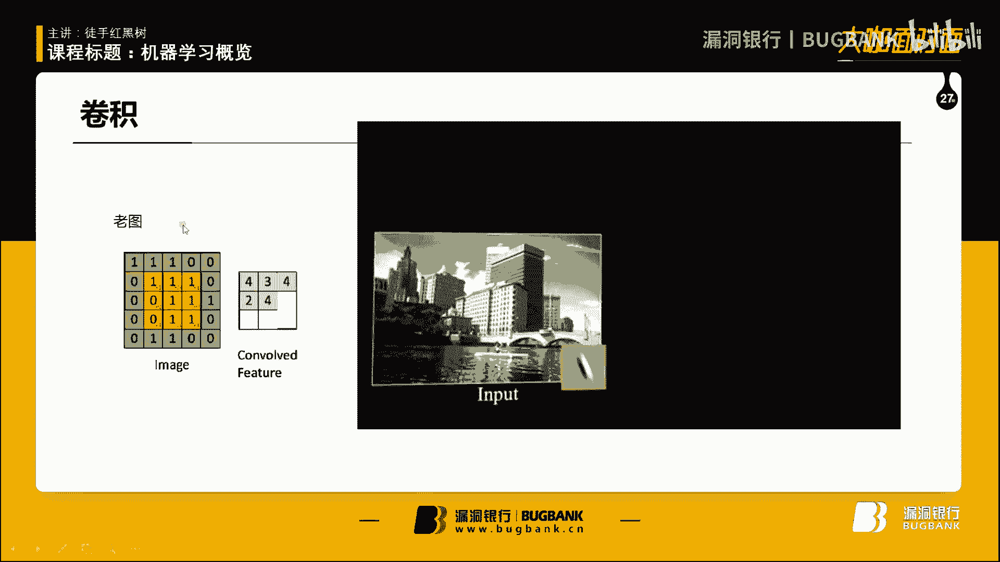

就转一个。对啊。这是记忆学鞋四大牛吗？然后。然后这这是老大。这是被拒的那个人的学生，这个是他的一个。博士研究生，这个是文档。记术是这个是图片来说，它是一个二维存储，对吧？因为有横坐标，有竖竖坐标。

其实它都不一定有二维存储，它只要定义上它的宽，然后再放在一个一维的数组也可以。但它每一个点上。就就相当于相当于我们写非程序的时候，int。呃a map，然后两。括号，然后里面写上你的长宽。

那么int的值是什么呢？现在值就是它的颜色，每一个点它就代表一种颜色。当然当然现在的图片有颜色的值和灰度值，对吧？那我们就简单的值表示它的颜色。颜色的话，现在什么16位深彩色，32位深彩色。

16位深颜色就是呃每表示一个颜色占用16位的空间，那么能表示数量就是二的16次方，对吧？就是多少万多少万种，2万多种是吧？32种，32位的话就是多少种。你看看我们就是简单的来说，我们只表示。

零和一就是黑白图片，不光是黑白图片，而且是只有黑白两种颜色。嗯，对，就是这种黑白图标而，没有灰灰度，就就相当于。当时玩那种红白机里面坦克世界，把它的颜色都去掉。那坦克就是白色表示，环境什么箱子啊。

这种黑黑色表示，对吧？啊，那这样的话我们只用一位就可以了。每一个举阵上的每一个矩阵点只用一位来表示。

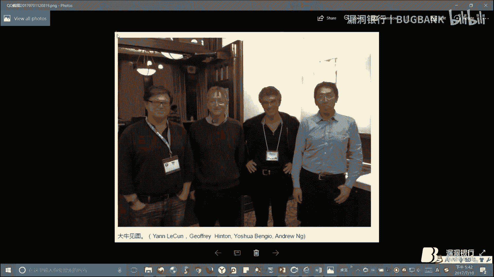

嗯，就是比如说这个图。呃，对什么叫选机呢？选机就是。剪机。我想减析。卷积首先得有一个东西叫卷机盒。呃，剪辑盒怎么说？

也叫剪辑盒，就叫开脑。剪辑盒其实也是一个矩阵，这原图像是一个矩阵嘛，剪积盒是一个矩阵，这个矩阵会在。就像这样在一个图像上不断的游走，这个矩线是我们定一的。然后一般用到是什么，不单是一个剪介盒。

一般用三个剪辑盒或5个剪积核。那么一个剪辑盒处完了，处理完了以后是一个更小的矩阵。那比方说你看这个。5的5乘5原图像33减一毫出来是3双3的结果。那每个说候它的这个结果对应关系就是呃卷积的不是原图像的。

尺寸减去卷积核的尺寸加一对吧？然后就得到原来的原就是得到一个结果的一个矩阵。所以说每做一次卷积，它矩阵就会变小，但是。你不只有一个剪辑盒，你有好几个剪辑盒，我看后面有吗？后面没有，有比方说有三个剪辑盒。

那么我每做一次剪辑，我们就会出来三个矩阵。那么就说你看它的这个。

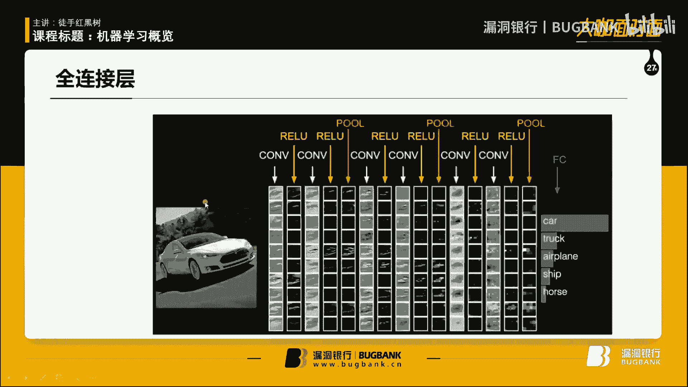

尺寸变小了，数量变多了，对吧？你的这个原数据原矩阵数量变多了，那么不断做卷积之后，我们就会形成。你看后面这个图。

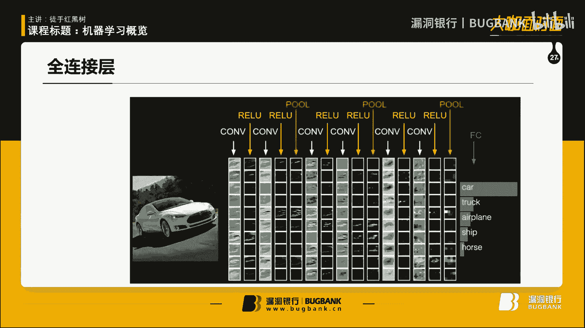

后面有图吗？哎呦，没有图了。啊，就会剪成一个非常大的，就画一下吧。😊，之后变成三个了吗？之后就会变成只有一个1乘1的一个小矩阵，但是你会变成有很多很多很多的矩阵。那我们就可以把它看成一个大的向量，对吧？

我们就可以把它看成一个大向量，对这个向量进行一个激活函数的处理之后，就会得到一个结果分类的结果。因为这然最典型的地方就是做分类嘛。😊，剪辑问题其实就是做它的抽象。就不讲了，之前。

关于为什么会有为选析这个方法怎么提出的，就是也是生物学，就是说没有没有这个生物神经学家，就没有现在的这个这个技学就是这个神经网络啊，就是这个生呃就也是一些生物学家在研究人脑人眼。是吗。

人眼那个血液细胞叫什么叫纺垂体是吧？嗯，对，纺锤体纺锤体它会接收。三种颜色加哎呦我跟现在相机一样啊，哎就纺水体的，它那个上网膜那个信号给了大脑皮层以后，大脑皮层怎么处理？我们看到的图像。

它其实就是运运用了一个剪辑的方式。然后沈用解量研究出来以后，我们这个计算搞计算机就把它这种方法搬过来啊，结果确实好用。而且。前两天有一个文章就是从科学的角度论证了这个卷积这种操作到底是。

蒙的就是蒙出来的，还是真的会把这个图像特征给提取的。嗯，然后那篇文章论述结果，就是这种剪辑的方式是真的会。把图像的高位数据给提到什么一维数据。你看你做一次一次的话，就会把它的轮廓其实就加强轮廓。

加上汤有轮廓。呃，然后减就是做一些数据的局部化，减少一些干扰干扰项，就不断的减少一些干扰项，把它高维的特征给剔取出来。就比如说。比如说这个地方。对吧这个颜色对比很明显。像这种边缘，它无论在任何时候。

它无论在卷积到了多少步啊，它这个边缘数据仍然会保存。那么像你看这是一些水波水波粼粼的这些地方。就是图然还会动啊，这个水波粼粼的地方，它颜色差距并不是很明显，可能几次选机之后，它就变成一种颜色了。

就说这个地方就没有什么特征了。嗯，做完剪也剪辑操作完了以后是磁化操作，实化操作是干嘛呢？剪辑是把它缩小，说话其实也是缩小它的尺寸。因为一个图一个图像你不进行缩小尺寸的话。啊，就不进行一些压缩的话。

你的一个照片，1080P的你的数据量和音乐30也是非常非常大，听舒啊。嗯，呃具体它的那个运算量有多大？哎，我老师之前给我发过一个做闭设的时候，有一个课件。给我发来呀。啊，算了，这之后就发给你们。

然后这个这个这个这个吃饭吃饭操作。就是。尺寸变变小，把它进行压缩，压缩怎么压缩呢？比如说这个是4乘4的，我们一个磁化的大小是2乘2的1个fielter过滤器，也叫就叫过滤器吧。fiel。

那么用到最多的是最大池化。就是说我这过滤器，它并不是像卷机一样一个一个走，而是走完这一个到下一个拼起来，而不是说剪接啊剪接里面。呃，它有很多参数哈，一个是选一盒大小圆。图像尺寸，大家还有它的这个步长。

这个是步长走一是吗？呃，之前那个直播的时候，大家就对这个代码很感兴趣，我就把我必设代码拿出来。

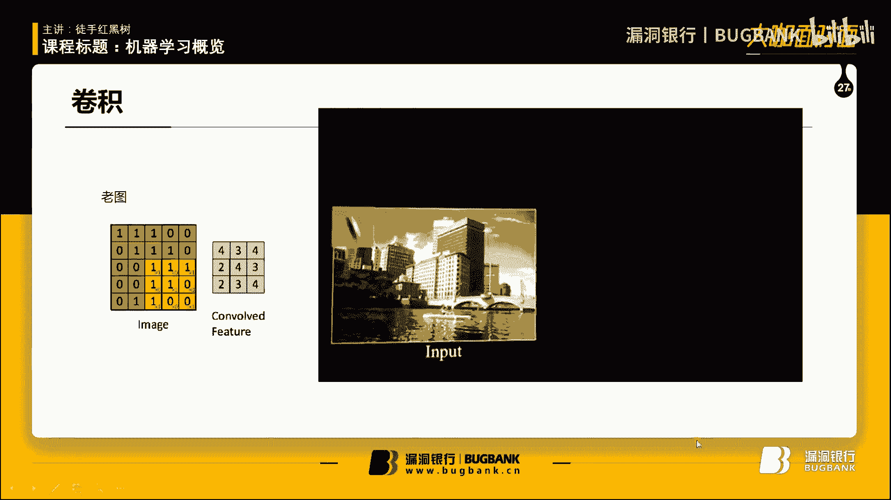

这个ten floor有点吗？给大家看一下啊，9tpro在定义的时候啊，我这里都有注示。你看是在这个地方，这个意思就是ten floor库里面用到。

newural network声音网络里面这个这个是一种CN的一个模型，它内部定义了，一个是你需要一个输入的。你挑一个数。就是输入一个数据，然后。你还要给他一个权重证，权重就是。怎么说。

就是一个选一盒吧，那么相当于一个简一盒，之前我们已经定义好了，选一盒是怎怎么样的，然后还带有一个步长。这里的是布长嘛，对吧？是布长。然后因为你的这个。你一开始输入的时候是二维的。

它可能再变成下一层输入的时候，再下一层输入的时候，它就不一定是二维，三维四维都有。所以说它是一个高维的数据。然后判ning就是怎样处理它的一个边界？其其实就是一个边，就是你卷辑到边界的一个处理而。呃。

边界处理现在大部分方式是以零为填充。因为比方说怎么说啊？因为你比方说步长为三的时候，你移动到倒数第二个，那么你再往下移动的时候，你可以选择不移动。但是那样的话，你最后一排的数据就会损失。那你往后移动呢。

怎么形象给大家说一下。就是你往后移动的话，又没有数据了。就比如说这个地方。比如说这个剪辑盒吧。

你。喂。封音。简易盒在移动的时候，比如说我不尝试2，那么我一开始在这儿，对吧？啊，不行，这还得再加一行，再加一辆行。那么第二次移动的时候，我是移动到这儿，对吧？不上位2的时候，那么第三次移动的时候。

我到底要不要往右移动呢？因为要是再往右移动的话，后面没有数据了，要不往右移动的话，这一行的数据就会损失。所以说我们现在用通用方法是填0填充0。因为发现嗯要要填充零的话，我们就会这样，对吧？呃。

不不呃哎呃，对，就是这样。对吧然后这里用零填充，我们会发现用零填充的话，其实对数据结果不会有影响的。而且还会告诉我。剪辑我已经经到边界了，我需要移动到下一行了，对吧？告诉剪辑。好。告诉联系号嗯。

这会讲什么来着？就过去了啊，刚刚才讲这个。他这个吃饭吃饭。222。啊，对，就是就是选。然后呃分分好块之后，就是选一个最大值话，就选一个最大值过来。就是把它变成一个大把它把它。把它变成一个世界了。

对吧然后有最大尺化，有最小实化，还有平均尺化。现在而且我最好的就是最大尺化就用最多也是最大尺化，最大尺化。所以说很多人在。学这个CNN的时候，有些地方讲的也不太明白。

就会不明白这个剪辑和吃画到底有什么区别啊，对吧？这样就知道有什么区别。嗯，你看一个点前置选选击神像网络，就是拿过来一个图像数据。它这个实像网络训练是要识别我这个图片里面是一个什么交通工具，哎呦。

这还是特斯拉什么交通工具工具，对吧？那么我们就是卷击。嗯。不好意思，接了电话。喂，你好。嗯，对。嗯。当时给你借了多。呃呃什么就是一个。一个卷积，一个是记数函数，一个卷积，一个机础函数re录一下卷积。

rel点击不是一个是剪击，一个rel，一个剪击一个re，最后是池化一下，减缩小一下数据，就是池化其实不是必要操作，而是在插在其中的减少它的这个运算量的。之后是一个全年阶层，全年阶层是怎样？

大家大家都是搞有很多搞什么外外部外部公房的，对吧？对税库也比较了解，税库里里面有一种。有什么左连接，右连接，对吧？还有这种叫什么笛卡。迪卡尔机迪卡尔连接，它那个这个全链接跟迪卡尔连接是一模一样的。呃。

就比如说这神经元，对吧？我们就是把每一个都连起来。什么叫把每一个神经圆都连起来？比如说这五输出三，那么每一个跟前面这个都有相连。第二个也跟他所有的都相连，或者是说那么我后面的每一个跟前面一个都相连。

也就是说我其中的每一个神经圆和下一层或者上一层神经圆都有连接的。路径这叫全连接。呃，当然前连接的时候，这里也是可以调整。前连接的时候，这里也是有全值W的对吧？你的你的这个权值多少也是可以调整。

我的天讲不完。RNLSTM。强好学习。

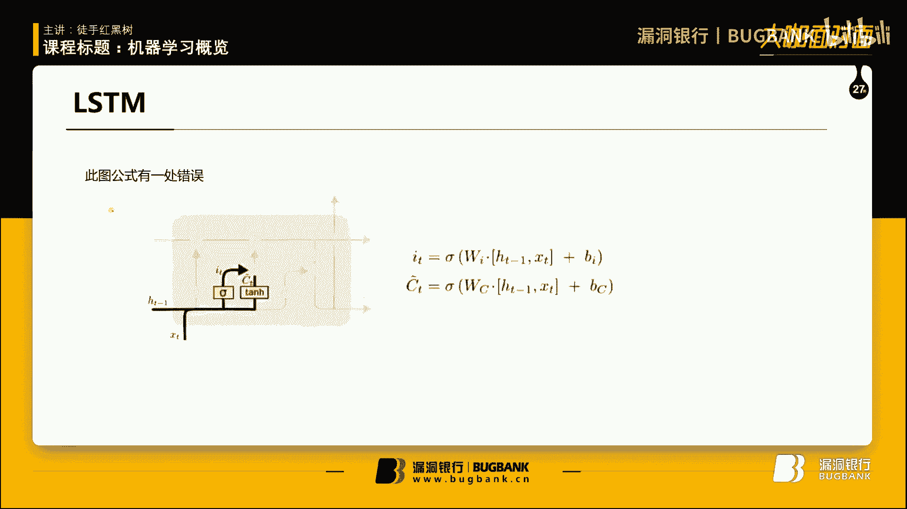

应该讲的快点吧，这是飞N飞N最简型的一方法。在大家想要了解更多的话，自己查一下。今天就是一个入门，带领领人大家就是感受一下，然后引起大家兴趣。呃，做一些科普。RN和CN的结构就完全不一样了。

RN是怎样的？就是说我的一个神经员是。它从这里就可以看出它是怎么分层的来。我。别呢。我们一个审验员是这，我一个输入对吧？给了这个审验员，审验员有一个输出，对吧？但他不光光是接受上一层的给他的输入。

他会把自己的输出再变为一个输入，而且还加一个全值。当然这个输入这个地方也都加全值了。每个地方其实都可以加前置，那么你不想要这前置，就把这前置设为一。那么意思当然这个前置没有，对吧？有总比没有强。

有权值总比没有强，有钱之后就相当于一个阀门，就相当于可以调节水管的水流量的一个按钮，对吧？嗯，RN的话把它展开，那么就按照时间的顺序替。按照序列的顺序来说，对你看它就把上方的输入。和。

就上一个时间的输入和上一层的输入都结合起来，做了一个输出输输出，不光只输出，而且还给了下一个这个跟那个什么挺像，跟那个马尔可夫练不是跟马尔克夫练跟那个马尔可夫模型很像。之后。

我讲强化学就会讲马尔可夫模型啊，这个RNRN在这种独特的网络结构，在处理有关系列的数据上一就很擅长。比如说。处理有关序列的数据。比如说你的音乐音乐数据就是跟你的时间序列相关，包括人类的语言模型。

像现在语音识别模型对吧？这语音识别怎么样。比如说。你说了一句话叫。今天。举个例子哈，我想想哈。嗯，你比如说你说了一句话叫。天空中乌云密布，那么今天天气是到来了这句话。可能那个语音识别系统没有听清。

它就需要去评估。你先说乌云密布是吧，的天空中。天空中，还有鼠标。然后我们要知道天气是什么，对吧？那么我们就。这个话可能你有噪音啊，或者你说不清楚啊，或者是方言啊之后机械。就你不能说我这结果不输出吧。

我要得到一个近似的结果。语音识别里面那么。说离音语音识别，我之前李开富，李开富那个语音识别是用那个。那个隐像马尔可夫啊之后我都会讲隐像马尔可夫和那个那个。啊，对，就是要判断一下这个地方。

地方应该是什么东西，对吧？那么RN是跟时间区列相关。我们。也就是说我们这层的输入的信息在不断的。传递过程中有可能会传递到最后。也就是说我们在判定天气时候所需要的信息，有可能是从最前面这个序练。

就是说不能说有可能我们可以人为的控制。把这个信息给它传递过来，对吧？我们听说过乌云密布，乌云密布这四个字，我们的模型就可以判断出今天天气是阴天。1。1。1。明天但是这种模型有个问题，就是说。

你看乌云密布这个词是在文章开头，要判定的地方是在文章上结果，信息传递过程中肯定会有损失，因为它不断加权不断加权。有可能你这个两个距离隔得长了之后，你这个信息就完全损失掉。

或是都已经小到像干扰信号一样小了，那么就会对我们结果产生不准确的影响，那解决这个问题怎么办呢？就是。这个LSTM模型LSTM。全称叫长短时。记忆。什么长短时长短时际网络long short time。

Memory， natural。应该是这样，反正那long shot肯定是有的，我记得很清楚，这个名字很奇怪，叫long shot什么网络。呃。这种结构呢它是引入了一个概念，叫门的概念。

就比如说我们把这一块抽出来，就这的门的概念。这个门嘛它并不是通它也是像这个地方这个地方一样，通过一个参数，一个权重来调节它的流量。呃，但是它的这个。地方也是像一个阀门一样，它是。

刚才那个地方只是做一个参数，参数其实可以增大或衰减你原先的信号，但不能做一像一个门一样，门是可以完全控制你的。输入和输出了对吧？你要不就关上屏，要不就开开门，对吧？呃，使用参数化可以设为零和一。

但是你在训练过程中。因为你的。训练公式的问题，几乎你不可能把一个结果呃把一个权重训练为00或者训练为一，这几乎是不可能的。这不是几乎是不可能，只能近似于零或1，但不可能达到零和1。

所以说就用了LSTM这种呃模型这种模型这个图是。这个图啊这这个图你要是找LSTMLSTM的话，网上全是这个图。这个图是从国外的一个某个讲师的博客上，去年有的。然后今年很多你要找什么。什么声音网络啊。

tflow处理吗，像LOSTM全部都用这个图。呃，当然它结构也是如图所画的，因为这个图是最简单最易懂的。好累呀。😔，讲呃，热门门。对，用用了这个门的这个概念。然后它是怎么运行的呢？

我们就后面我们就分布来看。就是我它也是是安安的一种改进。它它改进它首先引入一个概念叫C细胞的概念，这就是一个细胞体，其实就相当于一个神经元。因为这个神经元太复杂了，所以说叫一个细胞。它是先是什么呢？

先是有我有一个输入。ST是输入，然后这个地方是上一层的输出。HT减1T减1T是时间序列嘛，所以就说T减一是上一层，经过一个sms就刚才。给大家sigma的念sig mode的。

而且它的意思就是sigma的计函数。哦，2N是用2N是用什么来着？哦，RR是用t，这里面既用到sca mode，也用t号这个地方它是用最典型的地方是用sig mode。我不知道为什么。

这可能涉及到很适样的理论，数学理论，反正这个地方用到了是sode，然后sode只输出两种，只输出零或者一，对吧？离我线啊。呃，声帽的输出。我觉得这里应该是个符号函数吧。这个地方我感觉应该是。

它是个星号的哈，但我感觉是应该做了一个符号函数开的作用。因为它的输出是输出了一个。一个。小的二维的曲扇，因为。这个矩阵的大小是和它相关的，只有里面的值是只有零和一，然后代表哪将哪些将哪些信息进行屏蔽。

因为你在因为你看这个地方它呃电源圈的地方是运算符。比如说在这个地方，它就是将上一层的隐藏，C是隐藏，H是输出啊，你比方说看在这最后是这个输出，C是一个隐藏。哎，有个隐含数据，有个输出输出层。

这个跟那个马尔可夫模型，以前马尔可夫非常像。嗯嗯呃怎么啊说哪来？它是一个引线的一个输入数据，它是作为一个矩阵的乘法，矩阵的乘法。大家要是了解的话就了解，不了解的话，举证是吗？怎么说？有看有点麻烦啊。

大家回去自己查阅一下一下举任什嘛，比方说这是你有几站。我一个。跟它相等行数的那我要乘的话怎么呢？这一行乘以第一列，然后得到一个数。这一行乘以第二含乘，因为它只有一列嘛，所以说含含得到一个数。

也为这是一个矩阵乘以一个列向量。那么乘以一个横向量呢就会。你这个乘以列向量得到还是一列，乘以行线量还是得到一行，但一个矩阵乘一个矩阵就不一样，还得到一个矩阵。然后呃M乘N的矩阵再乘上一个。

N乘M乘N的矩阵，再乘上一个N乘以F的矩阵，得到的矩限大小是M乘以F，这是一个。公式现现在在手里面都会学得哈呃这个矩阵乘法大家就回去自己看一下，它就是做一个矩阵向上，因为呃用s mode。😊，把。

这个地方它是这个数据是融入了以后是简单的相加。相加以后，它矩阵的加法并不损失原先矩阵中的信息。也时它把这两个矩阵的信息都包含了。矩阵相加以后，通过一个s的函数得到一个结果矩阵，结果矩阵就是FT。呃。

我感觉结果矩阵它其实应该是只有一和0，但是用scama出来了以后，我不知道这里的具体的。具体里面应该还有一些细节，但出来的结果绝对是只有一和两。一和零就控制了。

它里面的信息是流入还是就某些信息是继续流出去呢，还是不流出去。呃，因为怎么说，它就不像利用一个欧米卡这种权重，权重是把它进行衰减，它是直接控制，你过还是不过，对吧？因为你举阵乘法的时候，比如说。

比方说这个是1234。那么乘以一列的时候是0101，像这种的这种列向量，这个矩证这一行乘以这一列的话，得到的结果是什么呢？得到的结果是2乘以0，就就直接是零了，2乘1是1，2乘1是2。

那么3乘以0直接没了，4乘1是4，最后结果是6，对吧？六只包含了二和4的信息，而把一和三的信息给屏蔽掉了。这就说明这就表现出了这个你要举认乘法时候，一个零是会把你的所有不想要的信息给你替掉。嗯。

有一的话是保留原来的信息。嗯啊几任先生完了以后。后面的就当成小小叶了，然后它也是经过一个这个地方有一个区别，就是。它是先是由欧米伽输出一个结果，一个怎么说，一个判定的一个结果吧，然后。运用了一个t号。

t号它保留了。保留了上面的这个输入的数据，然后保留了这个数据，来用sigma来决定你哪些信息可以在。往下一层流入，也就是说自己决定自己，也就说它的数据本身就决定了这一个层里面你你要。

你要把哪些数据进行流入下一步？这个公式也是很好理解啊，先是一个一个什么。对，还得加偏置，一个一个一个那个什么。这个哎呀这个词叫什么一个权重加一个偏置，很多地方都是用权重加偏置一个方法。

包括我自己写的那个神经网络里也是。

通用的方法。也是权也是权重加偏置。哎写在哪儿来着？啊，有一个权重，一个bios，一个偏置偏置一般是呃它的列它一般是一个列向量，呃，一一般是一个列向量，它的行数适合你的。需要增加的。就是需要其他行数啊。

就跟你的举证的最后一位是一样的。说啥啊，就这这是一种形式。之后。完事之后，我们的。数据就是。这些选择了一些进行通过，然后与这一层的输入性相加，JC就表示一个隐藏，隐藏又到了下一个隐藏。

隐藏就会把我们想要。怎么说？就是我们因为它这个隐藏的处理很少，只不过是选择哪些信息过不过，然后再把这一层的信息给加进去，这样的话就会我们刚才说那个。那个概念就是说呃在乌云密布，在天空中天空中雾云。

乌云密布，那么天气是什么？那么乌云密布这个词要是关键词的话，我们训练一个比较优秀的声音网络，它会把乌云密布这个词。进行一路畅通，对吧？就是在这一步时候会发现哎，比如说我这一步时候输入的是。

那么天气是嗯他可能觉得天气跟乌云密布这词有一些关系。对啊，它就会不见的衰减，一路成通把这个信息传递给你所需要的那一层。呃。当然这是隐藏传递，真正的信息是通过输输出层传递。

因为只有输出层才能作为下一层输入。隐藏只不过是表现了这一层的一个状态。嗯，其实输叔层怎么说？就这样吧。之后就是做了一个输出，输出层是把这一个隐藏的数据进行一个t函数，然后再进行一个c mode。

然后决定你哪些要。走哪些要留，然后作为一个输出和下一层的一个输入。呃，这个s mode其实它们每一个sign mode的参数都是不一样的。所以说呃在这个地方这个地方这个地方出来的这个结果也是不一样的。

所以说大家不用担心说，哎呀，是不是我每一个出来signma的s出来之后，结果都一样。这样的话我我们就会。决定出来数据之后是变成一个固定的一个形式了。啊，这是LFTM。ISFTM。

现在应该现在应该有中文的，我觉得应该有中文翻译过来的一些。介绍之前我3月份看的时候呃，全是英文的。现在应该有了，我感觉现在这个。这个反展这么快。强上学习讲讲一个模型吧，叫马可夫。模型叫马可夫决策过程。

这个是必须要讲的。因为强化学期就是运用它的一个思想。先找一个图。看还有内存吗。哦，天。先找一个图，找一个图在我的。之前那个应该有那图。哦我这也有好多图啊，小时候当时用这里面啊，用这个图。

马可夫决策过程非常简单。一眼就能理解它有两个主体，一个是你的agent，就代表你的智能体，就代表你的程序智能程序呃，还有你的环境。这个是怎样的？是你的程序，先是做了一个动作，给环境环境反回一个结果。

返回一个状态给你的智能体，而且还反馈了一个结果。比如说。就以刚才那个。那个例子，之前讲那个例子说你在大街上走着走着，你是一个A站的。你脑子一抽风。突然揍了别人一下，打了别人一下。

你那道个打这个动作是agent，打了别人，别人就是一个环境，环境之后会反馈给你一个state和一个rewardstate就是这个人表现的表情和他肢体动作非常愤怒，然后reward就是他又揍着你一下。

对吧？你会得到一个负面的反馈，负面反馈以后，你不断的得到一些负面反馈，你就这个agent他又会知道哪些。哪些反馈是不好，他又尽量的去做一些正反馈的东西，这就是通过这个呃马尔可夫角色来训练你的A症。嗯。

哎呀，这样我可以发给大家，自己看一下，也比较好理解。是什么和付杰分货场，然后。就想讲个马尔可夫恋和隐形马尔可夫。其实马尔可夫恋和隐形马尔可夫跟马尔可夫这个过程没什么。没什么关系吧，我感觉。嗯。用一个。

马尔虎夫店是怎么回事啊？马尔虎店找个。等于什么画不好。画图。页面大小。咦页面大家调。像素尺寸。变大一点。

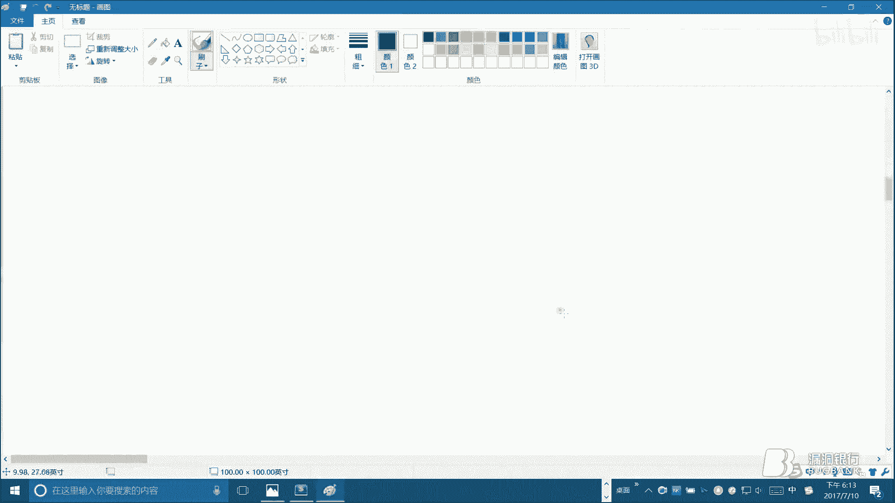

声很大呃，哎，全屏F11。哦，可以签名是吧？

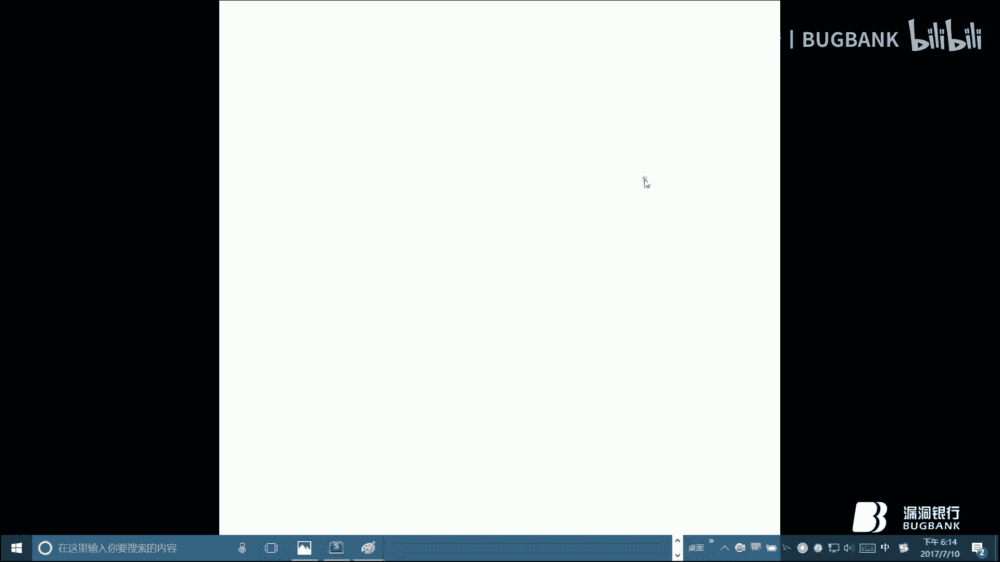

转一支B。

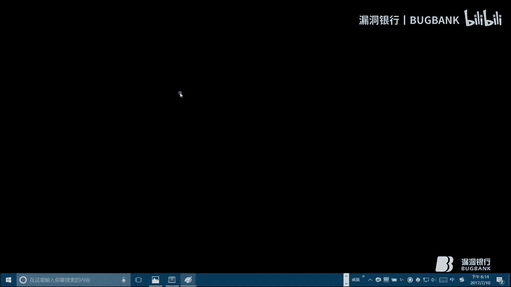

不知道什么意思。呃呃马尔科夫马尔可夫恋就是这么一回事，就是说。你的。举个例子啊。你的天气数据。你要预测一个天气，你有前你有大前天。前天。昨天。和今天的数学。你要预测明天。对吧通常来说。不像。通常呃。

我想他是把。学气步。他应该是。其实这个数据要平常来说的话，我们要预测明天的数据肯定是要得到前天和昨天呃和大呃大前天前天昨天和今天数据都进行一个汇总，然后对这个信息进行处理，得到了明天的数据。呃。

这个但是有一种改进方法就是说我只需要获得昨天的数据，我就可以决定。呃，我只知道今天数据就可以获取到又能知道明天的数据。呃，因为。在新阶论里面，因为你这个数据决定它对它有影响，这个数据对它有影响。

这个数据对它有影响。所以说这个数据它就包含了之前所有的历史数据。对吧，然后。只需要用昨天数据就可以决定今天的数据啊，对，之前这种。叫隐像马尔可夫，这种只需要昨天属于呃呃之前这种叫马尔可夫练。

也叫马可夫模型，然后只需要昨天的数据叫隐像马可夫，为什么呢？因为它不光是只需要昨天的数据。他还有直到明天、后天、大后天，这样的话。它的关键点。它就是相当于马可夫就相当于有很多输入，对吧？

每一个就需要有很多输入，但是隐线马可夫只需要有一个输入就可以了。所以说它在输。他在这个关键的判定的地方。马尔可夫技学校有很多输入给他很多输入给他。很多数据给他，包括这个数据他也得给他。

这个时候他也得给他，对吧？那么影像猫和孵化就把这些都给去掉。嗯。不好。这个去了去哎呀呀呀呀呀。啊，都会去掉。嗯，都会去掉的话。说什么来着？这啊对。使有时候影像嘛和复他思想其实很像那种。很像一种。

一个人啊，对对，一个人叫拉普拉斯，拉普拉斯这个人他也是活在牛顿那个年代的人，他非常非常崇卖牛顿。他有一句名言叫。给我给我宇宙现在的状态，我就能预测出明天明天的宇宙。是什么意思啊？就是说一个事情。

你把它的所有的运动状态你都给他，他就可以通过有限制的计算。就说我一定可以通过计算来计算算出以后会发生什么事。对吧就你今天不吃个饭，你明天一定饿，对吧？呃，这个是很简单的，它是说把所有的数据我都给计算掉。

然后就能预测出下一步会怎么做，下一步怎么做。这个跟这个马尔可夫的心想很像，跟马尔可夫决策模型也很像。呃，这个这个这个其中还有一个名字叫拉布拉斯1。拉布拉斯1就是像上帝一样。

这个智能体就是有无限的计算能力，它可以开。要是知道这个世界上所有的信息之后，他又会预测出整个宇宙之后所有的变化。这种概念大家非常好理解这种概念就是这种牛顿当时的经典经典理论的一个思想嘛？呃。

有这种能力计算能力的生物叫拉普us要。哎呀，说啥嘞呀，说说这个这个这个但当然这个肯定是不可行的。因为呃首先计算能力咱么不看，你首先在某些程度上，你是不可能获知，就是一个很小一个就给你一个木盒子。

你也不可能知道这个木盒子中所有的状态。因为。因为你知道了，因为你要想知道这个木盒的所有状态，就要知道它所有最小离子的状态，它最小离子状态无非总总的来说有两种，一是它的一是它的速度。速度矢量。

再一个是它的位置。但是根据那个海森堡测不准原理，就说你要知道它的质量，你就不可哎知道它的速度或者它动能，动能就包含了动速度，它有个速度方向和它的质量，你要知道它动能，你就不可能知道它位置。

你要知道它位置，你又不可能知道它的动能，为什么呢？因为在量子世界里面，它的每一个威力都是非常小的。你要是想测量它的话，那比如说我们就是想观察它去引入观察这个理念，就像那个什么行经饿的么。

你看一下它就死了，对吧？你到底看一下跟它死有什么关系呢？就是说我们在测量一个物体的，比方说。什么什么。呃，距离位置它的动能的时候，我们都需要观察，观察就会对这个微小的粒子造成干扰。因为你一旦对他将测量。

你比方说用什么测。用激光，你比方说用激光草，激光打在一个微小的粒子上，你可以知道它根据它的演射的激光演射方向，你可以知道它的位置。但是你这个激光绝对会对这个微小粒子的动能造成影响。就动量造成影响。

它动量一旦发生改变了，那么你就不知道它的它之后的。你只知道它位置，不知道它的动量，因为它的动量已经改变了。那你要是用一个波上很长的光。波长很因为因为波长越短，它的能量越大，波长很长，能量越小。

一个波长非常长的光。因为光要是想要。怎么说？光是一个玻有玻璃两向性嘛，光要是要哎呀我天。说是啊，说完吧，光要是想要知道一个物体的。就是想要通过光来测定的话，它必须要那物体的大小必须要小于光的波长。

但是量子太小了，比光的波长要小，所以说它就不可能用。电磁波来测定。这个电子的。量子的量子的量子的位置，而只能知道根据之后演射出来电磁波知道量子的动能啊，刚才说的拉普拉斯啊，对，拉普拉斯拉普拉斯对。

就是和这个拉普拉斯是一个思想，我只需要。通过上一层啊看一下，就比如说吧举个例子来说以前有一个很经典例子是掷掷骰的那个例子嘛，投骰子谷子只要骰子谷子。比如说我们手里有三个色子，这三个色子是不一样的啊。

一个是。六面的骰子，一个是四面色子。一个是八面色。咦画面闪的是不要弄俩。啊，算了，就写吧。这个是这个是4名审的。你。一。这是这面选的这是帮面选的。八面的筛子，那么我们六面筛子就123456。

那么四面体的话就是1234，只有4种结果。啊，那么半面色的就要12345678，对吧？那么我们要投骰子，我们先从三个色子里面选一个。选一个的话，我们每个选到每一个骰子都是随机的啊。

所以说它概率就3分之1。我们投一个数字，我们就从1345678里面选一个，然后不断重复上面过程。然后每次都是1345678中一个。那么我们得出来的序列，比如说是163。5273524吧。然后。

正说的叫可见装态链哦，对，刚才隐线马克可夫还不止没讲完啊，隐线马可夫它有一个输出。呃，这是一个这个叫在状态链。那么在隐像马可夫里面。你天马好不是这样啊，他是怎么回事？它就相当于有一个隐藏一样。你声音。

一层一层状态对吧？然后它还有一个输出层，输输层输出层。箭头。诶。哎，转过去。郭人吗？就用直线就是它收尾相连，对吧？他有一个输出他有一个输出他有一个输出。所以说我们只需要看到输出。

它其实有一个内涵的信息在里面流动。然后我们。你看每头每次一次筛子就是一个状态。每次一次一个状态每次一次一个状态。那么我们得到的这个序列呢，其实就是它的输出，这个地方是一。这个地方是6。嘿。对有。啊。

就是在这个位置上，我们这是它的输出课见状态链这叫。这个后面这个就叫呃下面那个就叫隐藏状态链。所以说隐藏状态链在我们这个骰色的地方，比如说我们这个骰子这个地方叫。骰子叫A吧，A4A6A8。

那么就是门隐藏状态链，就是对它的一个新。隐藏的一个信息，就说是一它有可能是。有可能是AA6A6给的。因为那么这个第二个是几？第二个是66的话，它肯定是A6黑的对吧？那么这个有可能是因为A4和A4和。啊。

有可能是A6和A8对吧？A6和A8，因为A4不可能给它。那么这个地方要是8的话，那么肯定是A8给的对吧？但是它有隐藏状态链，它不是说不确定，隐藏状态链是一个确定的。嗯，隐藏状态。长得有点痒了。

对一一一般来说，这个隐性马尔和夫里面其实隐线马尔和夫最关键就是指这个隐性的状态链呃隐性。因为可见的状态链和你这个隐形状态链之间有一个输出概率，这个概率就是叫怎么说呢？叫转换概率，其实叫存在转换概率。他。

嗯。其实关键这个隐形码可复的关键就在于它的这个隐存在转换概率。但是其实也就这么些东西，感觉怎么讲呢？它其实就是一种思想。但是这个显现的之间它是没有什么转换概率的。这个之间它肯定也是有隐性转换概率。

因为你从A6到A8A8到A9，当然在这个里面其实都是3分之1啊，都是3分之1啊。然后这个转换概率也是确定的。这就是一种模型，一种思想。然后它可以套用在现实世界中各个地方。比如说你赌博赌不是。你不赌博哈。

谁都不赌博。呃，比如说在赌博的时候，赌博机里面其实在改动一些。你的就是什么老虎机啊，改动这些东西的时候，其实它改动就是将这个转换概率进行发生一些转变。嗯。嗯，合符。其马尔可夫要解决的问题，怎么说呢？

就是说这是一个完整马尔可夫模型。但是他要解决问题的时候，一般是对于某些地方有缺失，这地方缺了一块儿，这个地方缺了一块或这个地方缺了一块，这个地方缺了一块，对吧？

我们要求这个地方应该最有可能是什么样的东西。所以说马尔可夫在马只要是。有三类吧，一种是知道你的。比如说这个问题里面去算，知道你的骰子里面有几种。然后我也知道每个骰子。每个色子是什么？

就是我的转换概率其实就已经确定了。那每个色都有几种，就是你的隐含状态的一个数量。那么。根据根据你的筛子的结果，就说我。我也把这个也确定了，可定让状态链确定了，你就要求它的隐含状态链。

就要求图出来是哪种色子。还有还有这是求。求这个隐含状态链之后，还有求把其他知道求这个转害概率的，还有知道。知道转换概率，知道隐含状态链，想知道这个呃可见状态链的结果的对吧？就是解决这三种问题。

那当然要深入研究的话，多了，我看你今天讲不完，几点开始讲，四点开始讲了，快3个小时了，上据3个小时说。看听。马可夫务过程啊。对，刚才讲马可夫过程其实应该把这个策略迭代和建设迭代一起讲了，我就不画图。

画的图太难受了。我这有图。特殊现代就是什么呢？嗯。就按我这个程序来说，因为我这个程序就以我这个程序为例子给大家讲，我这个程序是应该在服务器上，我本地没装这个tfl环境。

但是那个服务器我在校外网连不上我们校园网，所以说就够不到这个服务器。那只能给大家看一个截图了，这个这个程序是一个游戏。这个游戏是怎样呢？就是说我先定一个小方球，然后这球在这里面弹一弹下面有一个挡保。

其实弹球游戏嘛，就打专号游戏的一个简化版，它不打专号，他只弹你用这个这个墨板接它。当然这个模板是用神音网络来进行控制的。然后它会不断给他反馈。那么我用的方法也是马好复角色。

就是说我每一帧给神经网络一个反馈，每一帧一个反馈，每一帧就是一个state，每一帧的sit都会获得这个游戏游戏就是我的一个环境给我的一个反馈，你的得分就是他的反馈。因为你接到了以后就会得一分。

没有接到就会得负一分，对吧？嗯，刚说啥来着啊，说这个策略迭和价值迭代，就是我每一次走的时候。哦，说一个Q站件算法吧，就是呃因为这个是前提啊，呃用了一个Q站的算法。Q站算法怎么说呢？他是有。也叫QY哈。

是一个有一个Q值矩阵。Q值矩阵其实就代表了我当前决策。的哪要是走哪一步？就是我当前决策中每一个步骤的价驶。这是价值迭代里面只存它的价值。比如说像这个我初始化的时候。是这样，那么这里还有一个。

比如说我在目前这个状态的时候。我走我我做1个S1A2的选择。我在第一个状态是，我做一个A的选择，我会获得。唯一的reward，我要做其他选择的话，我只reward之后为0。所以说我在当前最好的选择是。

一这是把这就是叫策略迭代，呃，不是这叫价值迭代。我把每一步的价值，我都会用一个矩证给存起来，对吧？策略迭迭代是我把每一步最好的结果，它有可这个价值有可能不是一，有可能是三，这个地方是二，这个地方是5。

对吧？你你可以选择策略就是小五，选一个数最大，我只要5，当然这不是一个全局最优的方法。当然要是搞算法，什么动态规划的话，会知道这种方法绝对是不是最优的。你选大的永远不可能选呃全局最优。嗯。呃。

时后就有个下呃。这是下个迭代之后有策略迭代，就是说在这个地方我不想。我不写。数了，我也不写reward的，我只写我这一步的时候，我应该往哪步走。比如说我在这个模型里面，我只有两个策略。

三个策略往左走往右走或不动。那么我在这里就写个二是往右走，零就是不动，一是往左走，对吧？呃，这里就存它的。最好CU的策略。策略的这个是两种方法，策略迭代和价值迭代。这个大家看一下就了。

就说一些比较离散的事情什么蒙特卡罗算法，拉速维亚算法，就是这个的这个在粥上就是在粥上找的一个找的一句话，感觉描述的非常清晰。就是采量越多，你越他那里面是用的一个简找苹果的概念，就是我有一个放苹果。

那个苹果里面有100个，我想找一个。好的苹果大的苹果。那么用蒙卡洛的思想的话，其实就是说我每找一个苹果，我会把它和我手里的苹果比较一下。要是比它大，我就拿着。那拉斯维亚斯算法呢，就是说我有一个目标。

我只找到比我手掌大的苹果。那么我找找找。没有比我说长大苹果，我不要我只要那个比我手掌大的那个苹果，对吧？就说我。用这种算法的话，就是说我会得到近似最优解。而用完了4维A3斯算法的话，会只要那种最优解。

对吧？呃，包括阿尔法霍里面就用蒙特卡洛术，蒙特卡洛术是基于蒙特卡洛思想的一个搜索术。呃，用蒙特卡洛术搜索到最好方。因为在围棋应用里面，你本身就不可能穷进。穷尽所有的情况，对吧？呃，所以说。

所以说就要用这种蒙特卡罗嗦法。嗯，想想哈。情上学习。再加上程序。

程序发给他吧，t flow程序很简单，其实t flow本质上是一个一个。一个python，一个库，你只要导入就可以了，导入tt floor s它。天。对吧。呃，就是他。类似于CR加里面的重载运算符一样。

它把很多地方都重载了。所以说你用的话是直接调用它的f的。方法，然后它定义的时候也很简单，你定义后你要定击定义一层，定义一层。大家我这是实写的很多，大家回去看一看就行。讲的话，我感觉要讲代码的话。

其实也就是念注释而已，对吧？下面在这个上面，我是写了一个用拍 game写了一个那个小探曲主写之后，就是它的一个训运过程。应该可以一行一行看的话，它其实按顺序看也行，它fo。有一个特点啊。

就是说它程序并不是从头开始执行。他是从。这个地方我说了，它要从这个地方。呃呃呃，不是从他哪个地方？得从sder上执行，因为因为因为那个什么。因为tenflow它是设计的时候是运行在分布式服务器上的。

所以说因为分布式服务器，你就需要协调。你不能说你一个人机器拿先拿我程序，你先运行，它要把这个程序还有数据分块的拷贝到所有的机器上，然后在所有机器上统一化之后协调了以后再说哦，大家可以干了。

那么大家就一起干。那么这样的话就得有一个运行前的一个协调过程。就是这个是tflow里面引入了一个概念叫graph就图的概念。呃，怎么说，也就是说你定义这些东西啊，tflow只是把这个代码存写。

根本不会执行，只是playholder就相当于什么。就相当于定义一个变量，它只会给你定义好，根本就不会执行。就像于CII一样，它只会找它是会找到幂函数是吧？然后所有所调用哪个函数，再往最上面找。

从头找是吧？但它不萝不一样，它是在呃相当于它的幂函数之前，它会把所有的准备工作，在所有的分布式服务器全部做好，然后再统一进行工作，像这个地方，这就是一个坑。是今年3月份，它fl升级到1。0了以后。

很多函数全部都改了，包括它带一个初始化权新变量，就是改掉，这个是必须要有的。这是我说那个统一的过程，它之前叫什么叫global。也是叫叫苦肉。就gbal什么东西，我忘记了啊。

呃反正就是一个反正函数名改了那个错误非常难种，你根本根本找不出你的逻辑有什么问题来啊。也，是呃到1。0和0。8之间，有很多很多，可能大家可以在网上找一找，写程序的时候要引注意一点。有时候成序写错了。

并不是你错，而是你调用的方法错了，因为方法已经被改掉嗯。

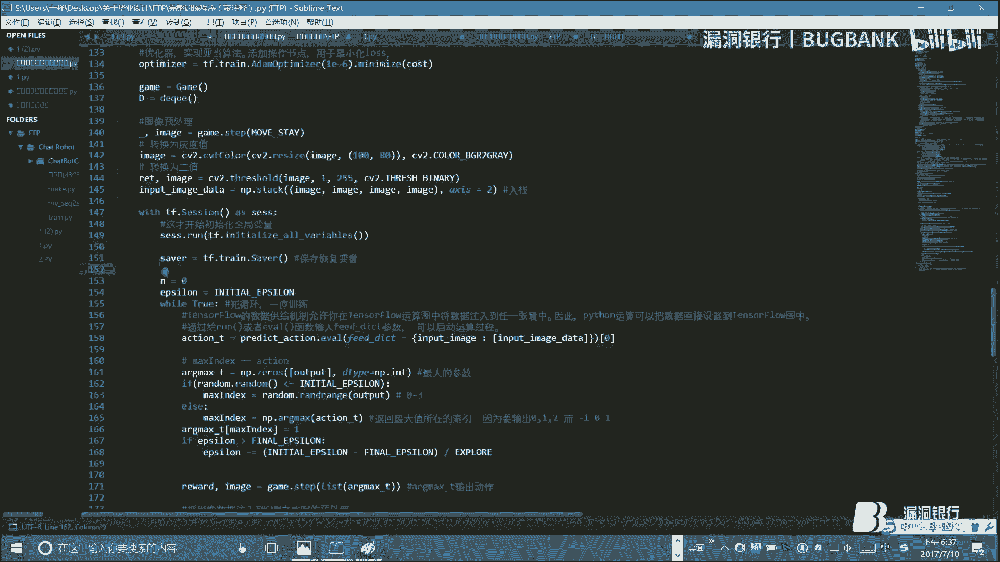

呃，没事，诚序也要考虑大家们。今天反微都有点累了。以前算了，最后就一个以前算了。对。行子吧，它是属于智能智能群算法一种。智能群算法是属于启发式算法，可以大家说一下什么叫启发式算法。因为你要看书的话。

我遇到很多名词会非常烦人。启发式算法其实就是说。在二项式的时间内，你能找到最优解的方法，这是一种方法。二项式时间内，其实你就可以理解为有限的时间，到底什么是有限呢，没法定义。反正只要你能忍受的时间。

就要有限的时间。包括你要去看什么计算机问题，什么千年醇问题啊，还有什么清洗年那7个问题啊，你面具有NP问题，NP问题就是。关于多项式时间内是否能求解的问题，就是说有限时间内这个问题是否和解。呃。

它的另外一个定义就是说我在多项式时间内。是否能找到最优解？这个解决这个问题，算法叫启葩式算法，包括。比如什么人物声音网络的算法计算是一种奇八的算法，还有。还有什么乙群算法？对，就是这种离子群算法，呃。

就这种群群体智能算法都算乙群算法，什么离子群算法，融凤性算法。还有什么进化算法，进化进进化算法就是。还有什么遗传算法？遗传算法是属于进化算法中一类，那个可以研究一下，挺有意思。

我觉得PPT上有的我就不用念了，太累了。大家看一下就好。以前看法要解决一个什么问题，其实就是要寻求最短路径的。解决自测产路像过程有问题，因为。在很很多求解问题的时候会用到你要求它的最短距离啊。

比方说你要什么它有一种新的求，为什么讲乙群算法呢？因为这个是最简单的一种群智能算法，它是什么思想呢？就是模拟蚂蚁寻食的过程。因为蚂蚁寻食是怎样的？蚂蚁寻食。它就是一种仿生算法。

蚂蚁寻食的时候会在路径上留下一种信息素，对吧？然后其他蚂蚁就跟着这种信息素，然后知道前面走过路，而且它会跟着这种信息素，找到回家的路，就回来的路，你会发现它拐弯走到树上，它还会拐弯弯下来。

它不会持了下来，它只会走过它之前走过的路。嗯。换一下吧。就是最简单的来说啊，画了三件图。要求最远路径对吧？就我们假设A点到B点。求对长路径。当然我们在经典地方有。有好多方法，什么呃学数结构的时候。

大家都知道有底杰斯特拉算法，还有克鲁斯哈尔算法。呃，迪杰斯特拉算法是怎么呢？你比方说有很多点，要求一下最短路径是吧？那么。不想啊。呃，迪斯他是找边，对吧？他是把第一个点或随便选一个点作为。作为一个群。

这个群里面目前只有一个点。那么这个群它把所有点至它最短的距离啊，那么这个和他和这个群离最近，那么这这个就形成一个群了。那么我们再把所有点和这个群进行比较。啊，当然比较要比较两次了，对吧？

这个点跟他比较两次，那么再找最近的数值最小那个点又把它加在一个群里面，对吧？就是不断的加点的一个过程。那么克克鲁斯卡尔跟他是相反是不断的加边的一个过程。大家三考原理我好像克鲁斯卡尔我有点记不住。

反正一个是加点，一个是往里加边。那么以形算法的话就是怎样呢？A到B点对吧？比如说我只有两条路线。当然具体情呃，就实际情况不可能只有这么简单，这么简单的话，根本就不用做。

它肯定是一个非常非常复杂复杂的过程。我就说一下这个思想，我现在有两只蚂蚁，一个是一蚂蚁，一只二蚂蚁。因为第二个路径比较远嘛，我们其实新生已经知道答案是一路径是最近的那为什么这个算法会找到。一是最近的。

就说这个蚂蚁走走走走走走走走走。磨T时间的时候，T的时候。它到B点了，那么T一的时候，A2好像还在这儿，对吧？T。那么他到闭点了以后再往回走。到T2，他已经回来了，对吧？那么他留下了双倍的新因素。

那么他走个地方都会有新因素留下嘛。那么BA2呃，不是第二个蚂，也可能到了B才到了这儿。那么第三个蚂蚁。就来了，因为A走完了，第三环也再接着走。又走到T3的时间内的时候，它倒了B，那么A2。

就回到了初始的A的不是第二码已就回到初始的这个位置。那么我们看信息速含量，A路径上的信息速度是最多三个单位。B路第二路径上是只有两个单位，那么我们就知道。即。一段时间之后，新素最少的那个。

亲数最少的那个。那条路径就是。这是最短的路径，对吧？嗯，那么要路径很多的话，我们会放出大量的蚂蚁，让它来回走。走了一小时之后回来以后，我们统计一下哪条路径上的因速最多，哎，那就是去。

去这个地点的最短路线。比方说它可能有这么多道路，这么多条路，这么多条路，你一开始走的时候，你并不知道选择哪条路，对吧？就用这种方法来学着走这种方法跟刚才说的那种。思想是相似的。

刚才说的那种叫什么求拳击最优解的时候。那个叫多点随机下降，也是一种群智能的方法。多少点一会开始求调到最低那个点，这有很多蚂蚁一块跑，总有一个蚂蚁是跑到最短那个点回来。

它既然一旦它跑到那它跑的是最短路径而回来的时候，那不断的往这个路上就派出新的蚂蚁，它的心速就是增加的是最快的，所以说就用这种方法来求。这张不下。然后面没有什么内内容了。那想到这儿吧，讲的比较散。

是大体把自学习的各方方面面都呃介绍了，应该把它方方面能涉及到大部分都介绍一遍。然后大家对呃记忆学习有一个广泛的感知就可以了。好，谢谢大家。

