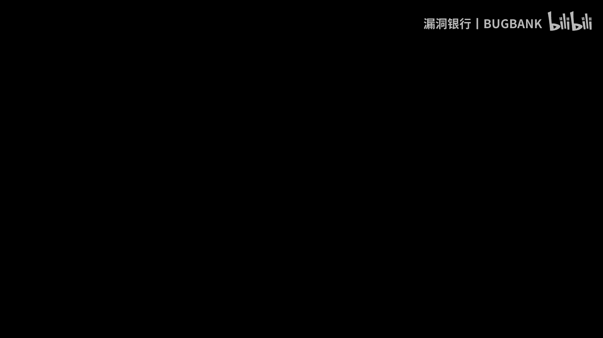
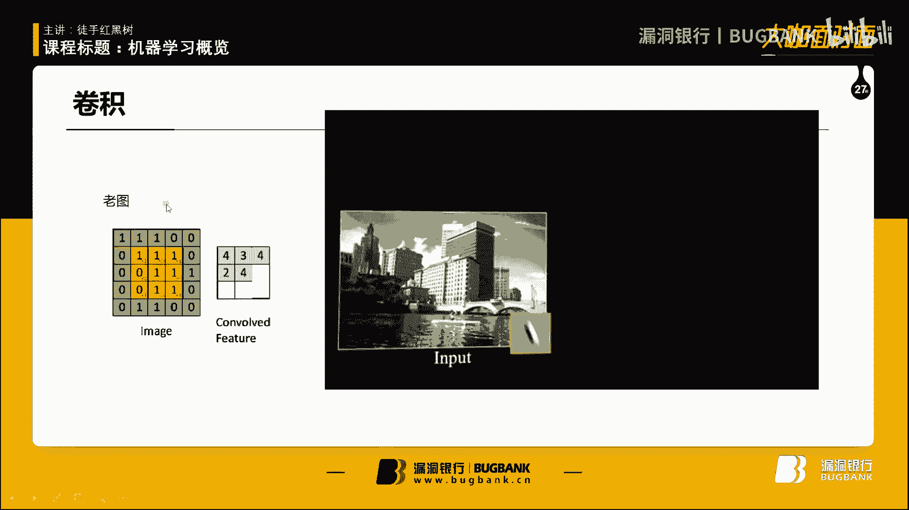
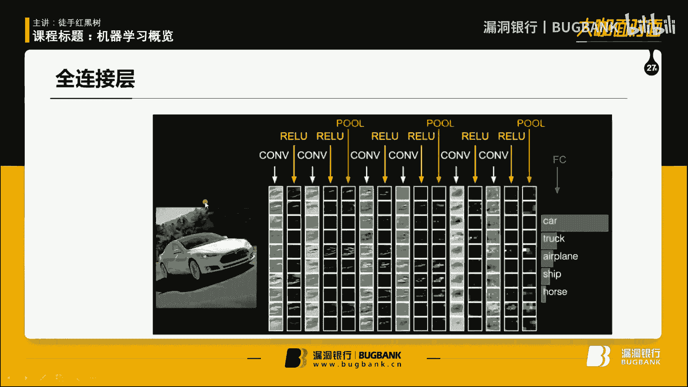
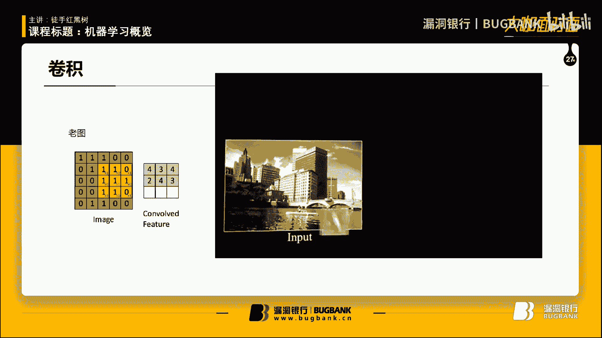
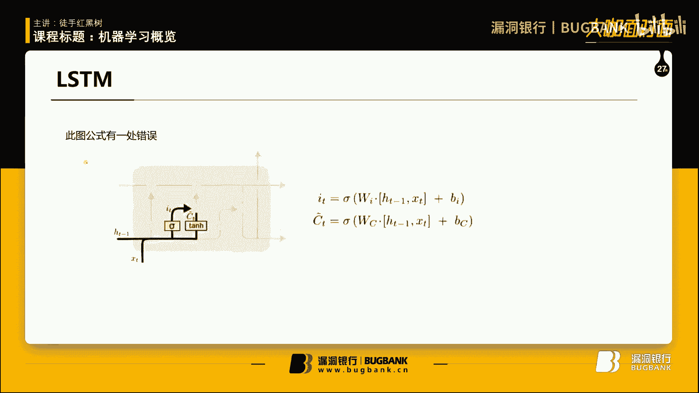
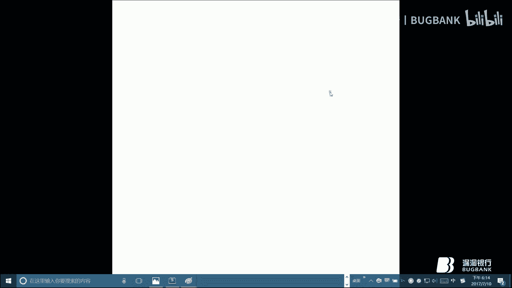
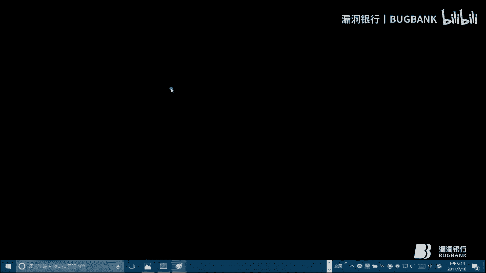
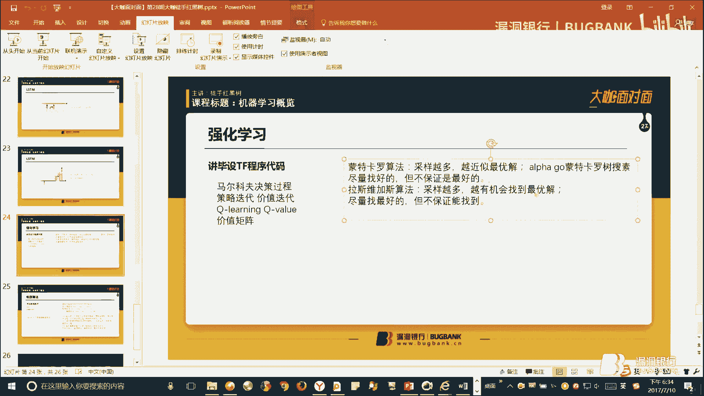

# 机器学习入门教程（第28期）🚀

## 概述

在本节课中，我们将要学习机器学习的基础概念、核心算法以及一些前沿应用。课程内容从最简单的算法入手，逐步深入到神经网络和强化学习，旨在帮助初学者建立对机器学习的整体认知，并理解其背后的基本思想。

---

## 课程内容

### 1. 机器学习简介与基本概念 🤖

上一节我们介绍了课程的整体安排，本节中我们来看看机器学习的一些基本概念。

机器学习的目标是构建模型来拟合各种函数，并计算出所需的参数。根据训练数据是否带有标签，机器学习可以分为监督学习、无监督学习和半监督学习。

以下是三种学习方式的简要说明：

*   **监督学习**：训练数据带有标签。模型通过计算输入数据，调整内部参数，使其输出结果与标签进行比较。若有差距，则将差距反馈给模型以调整参数。
*   **无监督学习**：训练数据没有标签。模型通过数据自身的某种特征（如距离）自动进行分类和归纳。
*   **半监督学习**：介于两者之间。通常先用少量带标签数据构建初始模型，再用该模型筛选无标签数据，将可信度高的预测结果作为新标签，扩充训练集，循环往复。

### 2. 基础算法：最小二乘法 📉

上一节我们了解了机器学习的基本分类，本节中我们来看看一个最基础、最简单的算法——最小二乘法。

最小二乘法主要用于解决函数拟合问题，例如线性回归。其核心思想是保证所有数据点到拟合曲线的偏差平方和最小，这个“偏差平方和”就是**代价函数**。在二维空间中，点到直线的距离可以用**欧式距离**（即两点间的直线距离）来衡量。

对于二维线性拟合 `y = ax + b`，最小二乘法的公式可以表示为求取参数 `a` 和 `b`，使得代价函数最小。其中，求 `a` 的公式（不严谨示意）涉及对数据点的坐标进行求和与平均计算：

`a = (Σ(x_i * y_i) - n * x̄ * ȳ) / (Σ(x_i^2) - n * x̄^2)`

求出 `a` 后，再利用平均值求出 `b`。

### 3. 聚类算法：K-Means 与 K-Means++ 🎯

上一节我们学习了用于回归的最小二乘法，本节中我们来看看用于无监督分类（聚类）的 K-Means 算法及其改进。

K-Means 算法需要人为指定聚类数量 `K` 和初始的 `K` 个中心点（种子点）。算法通过不断迭代来优化聚类结果。

以下是 K-Means 的基本步骤：

1.  **分配阶段**：计算每个数据点到各个种子点的距离，将其分配到距离最近的种子点所在的类。
2.  **更新阶段**：重新计算每个类的中心点（通常取该类所有点的坐标平均值）。
3.  **迭代**：重复步骤1和2，直到中心点位置不再变化或代价函数收敛。

K-Means 有两个主要缺点：需要人为指定 `K` 值；初始种子点的选择对结果影响很大，容易陷入局部最优解。

**K-Means++** 算法是对 K-Means 的改进，旨在克服上述缺点。它通过一种基于概率的方法来选择初始种子点，使得种子点彼此尽可能远离，从而减少了对初始值的依赖，并能让聚类数量 `K` 在一定程度上自适应。

### 4. 分类算法：K近邻（KNN）📍

上一节我们讨论了聚类算法，本节中我们来看一个简单直观的分类算法——K近邻算法。

KNN 是一种监督学习算法。当有一个新数据需要分类时，KNN 会找到在特征空间中离它最近的 `K` 个已知标签的数据点，然后通过“投票”机制（即看这 `K` 个点中哪种标签最多）来决定新数据的类别。

`K` 值的选择对结果影响很大。`K` 值太小容易受噪声点影响，`K` 值太大则可能包含太多其他类别的点。

### 5. 神经网络与深度学习 🧠

上一节我们介绍了一些传统机器学习算法，本节中我们将进入当前最热门的领域——神经网络与深度学习。

“深度”指的是神经网络的层数较多。神经网络的基本单元是**感知机**，它模仿生物神经元的工作方式：接收输入信号，进行加权求和，再通过一个**激活函数**决定是否输出及输出强度。

常用的激活函数包括：
*   **Sigmoid**: `σ(x) = 1 / (1 + e^{-x})`，输出在0到1之间。
*   **Tanh**: `tanh(x) = (e^{x} - e^{-x}) / (e^{x} + e^{-x})`，输出在-1到1之间。
*   **ReLU**: `ReLU(x) = max(0, x)`，计算简单，能缓解梯度消失问题。

简单的单层感知机只能解决线性可分问题（如与、或运算），无法解决非线性问题（如异或运算）。通过增加网络层数（即使用多层感知机）并配合反向传播算法，神经网络可以拟合复杂的非线性函数，这就是深度学习的基础。

反向传播算法是训练神经网络的关键。它通过计算网络输出与真实标签之间的误差，并将该误差从输出层向输入层反向传播，逐层调整网络中的权重参数，以最小化误差。

### 6. 卷积神经网络（CNN）🖼️

上一节我们介绍了基础的神经网络，本节中我们来看看在图像处理领域大放异彩的卷积神经网络。

CNN 主要包含两种核心操作：卷积和池化。

*   **卷积**：使用一个小的**卷积核**在输入图像上滑动，计算局部区域的加权和，从而提取图像特征（如边缘、纹理）。卷积操作后，特征图的尺寸会变小，但数量（通道数）会增加。
*   **池化**：对特征图进行下采样，进一步减少数据量并保留主要特征。最常用的是**最大池化**，即在局部区域中取最大值。

一个典型的 CNN 结构是多次“卷积-激活-池化”的堆叠，最后连接一个或多个全连接层，将提取到的高维特征映射到最终的分类结果上。

### 7. 循环神经网络（RNN）与 LSTM 🔄

上一节我们学习了处理空间数据的 CNN，本节中我们来看看擅长处理序列数据（如文本、语音、时间序列）的循环神经网络。

RNN 的独特之处在于，它的神经元不仅接收当前输入，还接收上一个时间步自己的输出，这使得网络具有“记忆”能力，能够处理前后依赖的序列信息。

然而，标准 RNN 存在**梯度消失或爆炸**的问题，难以学习长距离依赖关系。

**长短时记忆网络（LSTM）** 是 RNN 的改进版本。它通过引入“门”结构（输入门、遗忘门、输出门）和一个“细胞状态”，来有选择地记住或忘记信息，从而有效地捕捉长距离依赖。

### 8. 强化学习 🎮

上一节我们介绍了用于序列建模的 RNN，本节中我们来看看让机器通过与环境交互来学习的强化学习。

强化学习的核心框架是**马尔可夫决策过程**。其中包含智能体（Agent）和环境（Environment）。智能体根据当前状态（State）选择动作（Action），环境接收动作后转移到新的状态，并给智能体一个奖励（Reward）。智能体的目标是学习一个策略，使得长期获得的奖励总和最大。

**Q-learning** 是一种经典的强化学习算法。它维护一个 Q 表格，记录在每一个状态下采取每一个动作所能获得的长期价值。智能体通过不断探索和利用来更新 Q 表，最终学到最优策略。

### 9. 其他重要概念与算法 🌐

在机器学习的广阔天地中，还有一些重要的思想和算法值得了解。

*   **没有免费午餐定理**：没有一个模型能在所有问题上都表现最优。每个模型都有其适用场景，鱼与熊掌不可兼得。
*   **梯度下降与优化**：为了找到使代价函数最小的参数，最常用的方法是梯度下降法。其更新公式为：`θ_new = θ_old - α * ∇J(θ)`，其中 `α` 是学习率，`∇J(θ)` 是梯度。为了解决局部最优问题，发展出了随机梯度下降、模拟退火等优化方法。
*   **群体智能算法**：受自然界生物群体行为启发的优化算法，如**蚁群算法**。蚂蚁在觅食路径上释放信息素，后续蚂蚁更倾向于选择信息素浓度高的路径，最终整个蚁群会找到最短路径。这类算法常用于求解路径规划、调度等组合优化问题。

---

## 总结

本节课我们一起学习了机器学习的全景概览。我们从最基本的监督/无监督学习概念和最小二乘法出发，探讨了 K-Means、KNN 等经典算法。随后，我们深入到了神经网络的世界，了解了深度学习的基础、CNN 在图像识别中的原理、以及 RNN 和 LSTM 如何处理序列数据。最后，我们简要介绍了强化学习的基本框架和 Q-learning 思想，并提及了优化算法和群体智能等扩展内容。

希望本教程能帮助你破除对机器学习“复杂公式”的畏惧，认识到其核心思想的直观与巧妙。学习之路漫长，但理解基本概念后，查阅更深入的资料将会事半功倍。