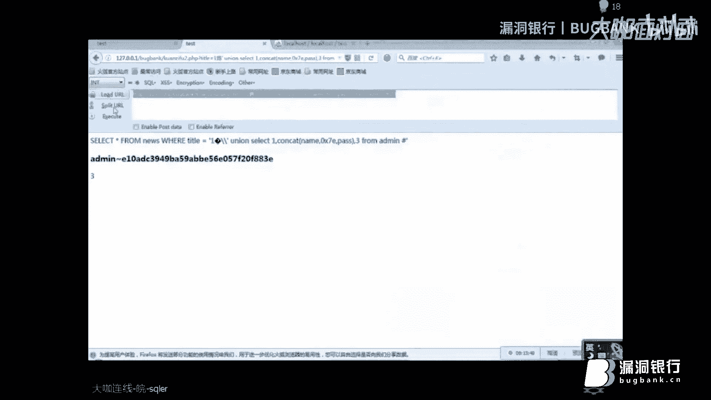
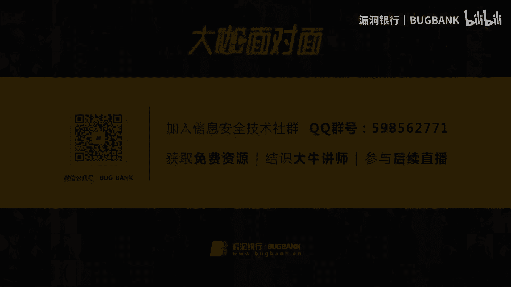

# P1：【录屏】浅析宽字节注入——大咖sqler分享 - 漏洞银行BUGBANK - BV1EX4y1K7jV

Yeah。

，今天给大家讲一下髋节步作。首先我们要知道什么是看视些。快速捷是由快捷注入源于程序员设怎么搜索连接错误时，错误配置为。放小一点吧，这样我能。是不是。编码为GPK这样编码会这样设置编码转换的时候。

引发注入漏洞。正常情况下，当GPC开启或使用slash函数过滤get或 post请求参数。黑客使用单引号，正常情况下，GPC开启或使用Slash函数过滤。单引号就会有。在前面加一个转移符，就是反斜杠。

我们来现实环境当，我们来试一下吧。可能可能这样我们用案例来讲，可能会比较直观一点。这样的话，我是不是我们的。当我们输入tle等于一的时候。

是不是我们就返回了这个我们数据库执行语句是了一个新from news where title等于1。按照。我们的以前的说法。我们加个单引号，是不是这里就会报错？但这里没报错，就是说。

我用在这个我这单引号前面他给我加了一个反斜杠。反斜杠在myscle里面是转移符的意思。所以说它会把你这个。一。单引号拿到数据库。这里面。去匹配它有没有有没有一单引号，如果有则返回没有，那就是就是没有。

因为它所以说在这儿我们可以看到它返回了一个空的值。然后接着我们接着往下看。但如果存在宽字节度物。我们输入百分号DF百分号27。在经过上面单引号转移时。他会。变成百分百DF。5C27%。5C是反斜杠。

之后在数据库查询，由于使用了GBK多字级的编码。即汉字编码范围内，两个字节会被编码为一个汉字。然后mysql服务器会对查询语句进行GPK。编码即百分号DF百分号5C转换的成一个汉字，成为一个这个字。

而单引号就逃逸了出来，从而导致注入漏洞。就4狗注入。我上午在群里面看到了有人。提到的这个宽字节注入，我们打开看一下。这里使用了DA其实我们使用DF是一样的，这个效果都是一样。好。

我们回到我们的案例里面来讲吧。他说的是加上百分号。在我们的前面加，比如说我们t的等于1分号DF。百分号。27号27，也就是我们的单引号。那这样的话。我们我们传入的是百分到DF。27%。

27%我们说了是单引号，单引号我们会经过Slash函数进行一个。转移。转移符是分号5C。对吧。这样的话，他带到数据库查询的时候，就变成了号DF号5C号27。我们这时候来运行一下。可以看到。

我们这已经报错了。对吧我们白色购已经报错了。然后。这里我们就使用un理句。因为我这个这这个后面的就不讲了，这手工之路就不讲。因为这有三列嘛，我们到数据库里呢123。用例是用例语句后面这个。

要跟前面的是保持一，就是前面的。语句我们往回翻一下6。哦，对，在这儿。我们要保持一致，我们6次的列是有三列，所以说我们后面也使用了1233个列。From at me。如果说列数不一样，是会报错的。

还有他就说你那个页数不就是不同。好，你可以在这里，我们可以看到返回了二和3。我们先看一下。是不是可以注注入成功啊？啊。我们接着往下看吧。GBK。编码是数据库的编码，我把这个字放大一点。

GPK编码是数据库的编码。跟前台的编码无关。这什么意思呢？在这里我们可以看到，我们就返回到我们的源代码里面看一下吧。那我这里还设置了为UTF-8。🎼对不对？但是。款子金。注入。

我们跟前台的编码是没有关系的，我们跟数据库的编码有关系。我们来看一下我们的数据库的编码。我这里是不是设置为GPK？这里也可以看到我们的。在我们这个t库下有一个admin表。

有一个我们的字段为name和pass，主要字段，还有UID。好，我们现在现在就来构造一下。因为它还有一个红眼三嘛，二用的是user，我就那我三这里就。小cont。练。Pass。

这里是不是可以看到and me还有后面密码？这里就出现了有个问题了。嗯。在这讲这问题之前，我们先到。本你去看一下。我们先来看一下吧。我们到PPP买的艾米。这时候我们来执行一下啊。当我们在。

因为我们就刚才的语句。是使这个心from。这里我又直接粘贴过去。对是我就把这个鱼给删掉吧。uni是那个usercon的 name pass。我们来执行一下。

root at local house后面跟上了这个。如果因为在现实我们做渗透当当中。你不可能就是说，如果说管理员账号是一个数字。然后密码没有经过MD5加密也是一串数字，我们是不是就分不清了？😡。

这这时候我们肯定要使用一个分隔符。我们来执行一下，这样的话。我们用两个单引号包含了一个符号。就我们随便使用了一个分隔符，以字符串的形式发过去，这样的话是不会返回？

就是说我们账号和密码中间有就有分隔符给它分隔开了。更便于我们阅读。呃，在这里。我们来我们也来试一下吧。可以看到这里报错了。让我们来看到这个思路语句。这两个单引号是不是不是被转移了？

这样的话他会以为单引号，然后这一个波浪线像这个单引号，他把这个拿到数据库查有没有这个字段。然后我们数据库肯定是没有这个字段的，所以说导致了报错。因为我们在传过去的时候。

我们加了这个单引号也被S拉函数给转页了。所以这里我们使用1个16性制。买色号是可以识别16级质的。我这里使用4波浪线的深6进制，就是0X7E，我们来执行一下。这样的话他会以一个字符串的形式它会传过去。

然后。我们会正常返回到我们前台，这里更方便我们阅读。这样的话。我们就是可以。在这里面成功的注出数据。就着我们PPT往下继续讲。我们来讲一下原理。原理就跟上面讲的第二条是一样的，我把发群里。

我们输入2DF和27%的时候。首先经过上面提到的单引号。转移成为了这个刚才我们跟你讲了。号5C是反斜杠，对不对？因为。其以说我们传过去的是这样，比么DF。但以后。他检测的带引号。直接用27%。

可能大家就是说看的有些模糊。我这就用一个就用一个单引号在这儿。Slash函数。遇到单引号。它会加一个过滤函数，也就是一个反斜杠。但是反斜杠。等于。百百分之。5C。但以后。等于。27%。

所以说这个号DF5C，27，我们组合了。最后组合了一下，就把这个组合成。百分号BF。百分号5C。百分号27。但是摆方DF。与5C可以组成一个汉字。就是这个汉字。这样的话我们。这有27%，也就是单引号。

单引号我们没有反斜线来过滤它了。这这个就相当于变成了一个。看字运，我就建建暂时叫他运吧。然后这个单引号是不是我们就没有对它进行转移了？这样的话我们带引号就能逃出过滤。转移不是转移，不是过滤。所以想。

在这里。其实我输入了百分号DF分号27。这是我们能看到的，我们看不到的。其实调到数据库查询是这样。一次完整请求是，其实这里还有一个百花5C。问题的话，那我切了第二个案例了。这个案例里面。

我们也再来看一下。我们现也是按照一般深度测试，我们也是先下个单以后，看他报不报错嘛。这里显然易见，我们肯定也是不不行。那么按照上上一节课的就是刚才讲的那一种，我们加一个百的DF。那是加油站引号试试。

你可以看到，虽然就讲这里就是讲FV转换的时候报错了。但是此这个7from news where IDD它该怎么执行，还是怎么执行，对不对？其实根本就本方DF根本就没带进去。

这里就跟我们第二个讲要讲讲的知识点是一样的。这里我们使用这个紧椎的词。我们先来看看效果吧。家紧但有哈。这可能是有点编码，有点问题。浏览器编码有问题。我现现在我们首先来看一下进牛的字。

它的UTF8别码是E98CA6。但这里我们并没用不到，我们关注的是它GBK的编码。它的GBK编码是百分号E5，百分号5C。而上面提到反斜杠。也就是这里我们提到了反应杠是不等于5C的。

所以说这5C是不是就。我。是我们要利用的东西，利用的就是这。如果我们将title设为景单引号。然后就会变成这样。爱看V。函数会对仅这个字给它转换为GPK编码。变成本报义务。再跑5C。5C。27%。

这也就是这样。这这个反斜线。对以我们就把这里就是来讲一下，虽然讲这个是一个我们看不到的字。看不到的是摆放义务。他那他是不是变成5C？百分号5C。这个单引号是27%。那是不是就跟我们这里讲的是一样的？

那这样的话，我们这个27%。默认。就按刚才来讲，我们就加一句普通加单引号。这里肯定就是说会被文网5C给转移。但在这里。5%，这一这有两个5%C。我们第一个反斜杠。对第二个转移符反斜杠进行了转移。

这样的话，我们单引号又成功的逃出来了。所以这里的话我们可以直接用你。Fromed me。这个。嗯，可，我稍微看一下。除了百分DF，这个你可以自己尝试的，等会等会儿啊，我先把先切到到上面去。

比如讲你就算不想用2%D呃DF，我先我先就用。我们在这里刚才就是讲到是不是除了DF，还有没有其他可用的，我们可以来试一下。我是白猫DA。你看这又是一个字。嗯。就算我数两个人毫不相干的SD。

你看这这就不行。比如想就DB吧。我们看一下行不行。就组成一个新的词，意思就是说在GPK编码里面。不管你前面。假如说就这是DF。DF这个你可以随便换，但是它只要能和后面的号5C就2%什么。

你的你的自定义的一个东西，然后5C，这只要能组成一个汉字。这样的话让。我们的这个5C不对这个单引号进行过滤就转移。这都是可以的。所以说。除了2GF。这更更多的我们自己尝可以自己去尝试一下。😊。

就没见过那个。さ。其实我们在数据库监测里面，其实已已经能看到了，是这个新from where aret等于这个。因为这百这个反斜杠叉15，它组成了一个无法显示的一个汉字。然后这个。反提杠。

把这个反应杠给吃掉了，这样单引号我们就能逃得出来。然后后面执行我们的用理语句。可以看到我们在这儿执行了一遍。他返回了。一行是不是？Title content。C。这样的话平均在一起形成了这个。

这样的话就因为兵码转换的问题，这个百因为这有个5C，5C是一个。转移服的意思。这个转移符把第二个转移符给转移了，这样导致我们的单引号又逃出来。从而我们又可以进行搜索注入了。也就是我们现在可以运行一下。

就像这样。嗯，今天课程就到这里，讲的就讲完了，谢谢谢谢谢谢。😊。

Yeah。