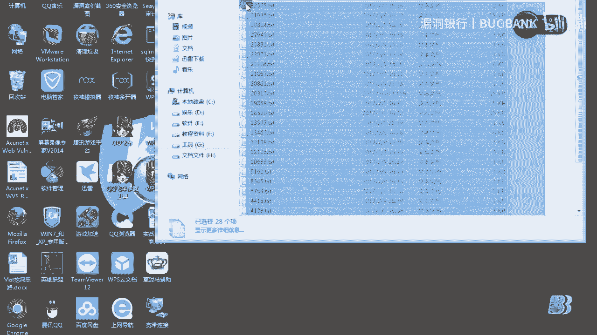

# P1：【录屏】浅谈SSRF漏洞——大咖Mat分享 - 漏洞银行BUGBANK - BV1T5411J78x

哎。啊，大家好，我是。行车安全的。我叫m，是一位小白，希望各位大流。能与各位大牛多多交流学习技触吧。好了，今天我们讲的是SSRF服务端请求位则攻击。首先来理解一下什么是SSR。

很多为应用程序中都提供了从其他服务器上获取数据的这么一个功能。使用用户指定的UL web应用程序，可以获取图片下载文件读取内容。如果这个功能被恶意使用的话，可以利用存在的。

未部应用这么一个缺陷作为代理攻击远程和本地的服务器。这种形式的攻击称为服务端请求伪造攻击。好，首先我这里是模拟的一个靶场。是一个。PHP写的CUL我们首先来看一下。先打开。WAMP。好了。

我们这里来访问一下。这里是个boss的数据UL。UL上可以填我们的。想进入的一个网址。比如说我们想访问一下。百度吧。我们来访问一下。好，这里可以看到成功的跳转到百度的这么一个首页界面。这里他会把。

把一个百度的首页文件保存到我们。

本地的。这么一个文档上我们来看一下。修改日期是。哦，我把我把它删除一下。

我们来重新访问一下。OK这里它生成了1个TXP的文档，我们打开来看一下。打开我们这里能看出是百度首页的这么一个源码。那么它的原理是什么呢？是通过我们这么一个脚本。去访问。百度这个网站。然后。

保存到本地的TXP文档，然后再输出这么网站的这么一个。页面来。这样呢我们就可以。能够达到一个下载方首页的源码文件的这么一个功能。那我们首先来再看一下。如何挖掘吧？可以利用该漏洞实现的攻击方式。

首先可以实现信息收集，可以对外网服务器所在的内网本地端口。扫描获取一些备案的信息。然后就是对内网we部应用进行指纹识别，通过访问默认的文件实现。我们怎么实现本地端口扫描了？我这里来做一下演示。

比如说我们本地是。12。127。0。0。1。我们来访问一下。好，这里可以看到是个WAMG的一个。文件。如果我们想访问，这里是默认的是。8名张口。是一样的，和我们这里显示的也是一样。

大家可以看一下是没区别的。一样的。不过。我想访问一个。其他。哺乳牛的端口吧，比如说99。好，可以看到这里返回的页面为空。不过我们想访问麦s克的端口的话，大家都知道是3306，对吧？

我们来访问一下OK这里它返回了一个mysl的这么一个。版本信息5。6。17。这后面的就是一些他其他的信息。那我我我们这里可以判断，比如说我再访问一个。其他的端口。北空对吧？那么这里可以说明什么？说明。

如果我们访问。这个存在的端口的话，它和返回的。内容是不为空的，如果不存在这个端口的话，它返回的内容就为空。我们就可以利用pyython这么一个去写一个脚本，对不对？判断。返回的信息如果为空。

说明此端口不存在。如果不为空，说明此端口存在。这样就能实现这么一个端口扫描的这么一个功能。好，这里是指纹识别。嗯一个大牛。对吧。他是访问这么一个。地址链接，然后去百度识图。百度给它识录下来了。

那么我们可以判断这里它这是用tca，对不对？那么我们就可以判断他的。程序是不是使用的是tmoca这么一套程序？就能。进行指纹识别吧。还可以。执行。并指令攻击内外网内部应用。

主要是使用get的参数就可以实现攻击。实现攻击的这里也有很多网上也有很多案例的，大家可以去看一下。还有就是。一出攻击在内网或者本地的应用程序一出。这里还可以做一个信息收集的这么一个功能。

利用fa系读取本地的文件内容等。好，我们这里来演示一下。比如我们想访问。就是这。N档上的这么一个文件吧。非常录下的文种。下的晕。对IN2。系嗯嗯。好，我们把可以看到这里显示的是。你看内容吧。

我们再来看一看本机的这么一个。是不是和本机一样的？视频下N点INI。好，在这里我们打开看一下。内容其实是跟这我们本地本地的文件是一样的。只不过他是一个换行嘛，一个没换行而已。

这样我们就可以实现读取本地的文件。对不对？下面来介绍一下以下的内容场景容易出现的这种漏洞，应用从用户指定的UL中获取图片，然后把它用一个随机文件名保存在硬盘上并展示给用户。第二个。

应用获取用户指定的UL数据文件或者HTML这么一个文档。这个函数就会跟服务器建立TCP的这么一个连接，传输原始的数据。第三个是应用根据用户提供的UL抓取用户本地啊，抓取用户的未部站点，并自动生成一个。

移动we站。刚才念错了，不好意思啊。是。应用提供测速功能，能够提供用户的UL访问目标站点，以获取在对应经纬度上的访问速度。然后我们再来看一下挖掘思路。

我们从上面可以看出SSRF是由于服务端获取其他服务器的相关信息功能中形成的。这里我们就可以。举例，在几种微部应用的。常见服务端中获取服务器信息的功能。第一个是分享，通过UL地址分享网页内容。

早期分享应用中，为了更好的提供用户体验，微部应用在分享功能中。通常会获取UAL地址网页内容的kittle标签或者。中每个标签中的contl文本作为显示，以提供更好的用户体验。这里有。人人网吧。这。

我们分享了一个功能，这是一个tttle，这是一个conturn的这么一个成本内容吧。如果我们输入这么一个。UL。他通过目标UIL地址通过获取了。车ttle标签和相关文本内容。而如果在此功能没有做。

过滤与限制的话，则存在SSRSF漏洞。根据这个功能。可以发现，很多互联网公司都有这么一个功能。这是我从百度的。申险过程中接触的。大家可以看一下。也可以从国内的漏洞体验平台上。

看见包括国内很多知名的公司、淘宝、百度心浪等，都曾发现功能上的SSRF漏洞问题。第二个就是转码服务，通过UL地址把原地址的网页内容调试到合适的手机屏幕里来。这里是因为什么？因为手机屏幕大小的关系。

如果直接浏览网页内容。可能会造成许多不方便的。因此，这些公司就提供了转码的功能，把内容通过相关的手段转为合适手机屏幕的浏览样式。因为这些公司都有自己的在线天猫服务。还有个就是在线翻译。

通过UL地址翻译这一文的内容。提用磁工的呢，国内的知名公司有百度有道的。第四个是图片加载与下载，通过UL地址加载或下载图片。图片加载远程图片的地址功能用到的地方很多，但大多数都比较隐秘。

比如有些公司中的加载资料图片上服务器用于展示。这里就会有人疑问，为什么加载图片，服务器上的图片也会有问题，直接使用那个标签不就好了吗？暂是。是这样。但是为了开发者有了更好的用户体验。

所以他会对这这些图片做一点微小的调整或者水印啊等等，这样就可能造成SSRS的这么一个问题。还有就是图片文章收藏的这么一个功能。这你。此处图片文章收藏的。就类似于功能一，我们这么这里。分享的一个功能。

分享功能中获取UL地址已及以及地址中的。dattle以及文本内容作为显示。目的还是为了提供更好的用户体验。而图片收藏就类似于。这里的功能是加载与下载。还有就是一个第六个就是未公开的API实现的。

以及其他调用UL的功能。此处类似的功能有360网站提供了评分。以及有些网站通过API获取远程地址。叉ML文件来加载内容。在这些功能除了翻译和转码为公共服务外，其他功能。都可能在。

一企业应用开发过程中遇到。第二个就是。UI关键词寻找这里是我收集的。一些。关键词吧。我们这里就可以利用。谷歌骇这些语法加上这些关键词去寻找SSRF的这么一个漏洞。通过验证。

我们还是可以找到这么1个SSRS漏洞。好，这里来讲一下SSRF漏洞验证。比如我们这有这么一个东西，对吧？排出法。121也可以直接右击图片，在新窗头打开图片。不过浏览器上的UL地址是这么一个地址。

说明不存在SSRSF漏洞。不也可以使用。优秀的对。这些抓包工具来判断是否是SSRSF。首先我们要知道SSIF是由服务端发起的请求。因此，在加载图片的时候，是由服务端发起的。

所以我们在本地浏览中请求是不应该存在图片的请求。在这个。图片中如果刷新页面。有如下请求。则可判断不是SSRSF。这里就是一个。按例的。我们来说一下为什么用排除法来判断SSRSF。比如我们有这么一个。

东西的。现在修复SSRF大部分都是分内网外网来做限制的。但我们这里暂不考虑利用此问题发出请求，攻击其他网站，从而隐蔽攻击者IP。访问此问题还就要做请求地址的白名单的。如果我们请求换成是。

这个的话没显示内容，我们判断这个点不存在SSRF。还是判断这个地址被过滤了。还是这个地址的图片文件根本就不存在。如果我们不知道。这么一个地址都。文件是否存存在的时候，判断出。不是哪个原因。

所以我们采用拆支宝。为什么用排气法？因为如果用用其他的方法是很繁琐的。这里也是我在网上找的一个吧。实力验证。通过我们简单的排除验证之后。我们就要验证看看此UL是否可以来请求对应的内网地址。

在此例子例子中，我们可以。我们要获取。内网存在的HTDP服务存在这么一个文件地址。才能验证是否是SSRS漏洞。找存在的如何找存在的HTET服务的内网地址。我们可以从某些漏洞平台或者历史漏洞中寻找。

漏洞的存在微博应用的内网地理，也可以通过二级运名暴力。破解这些。模糊猜测内网地址。

这里是一个女，比如我们。