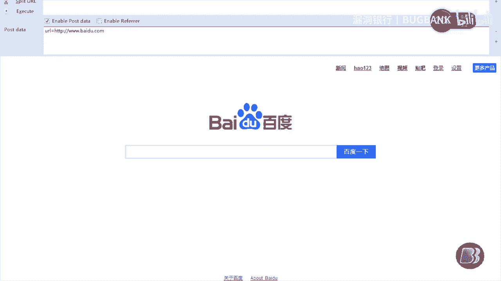
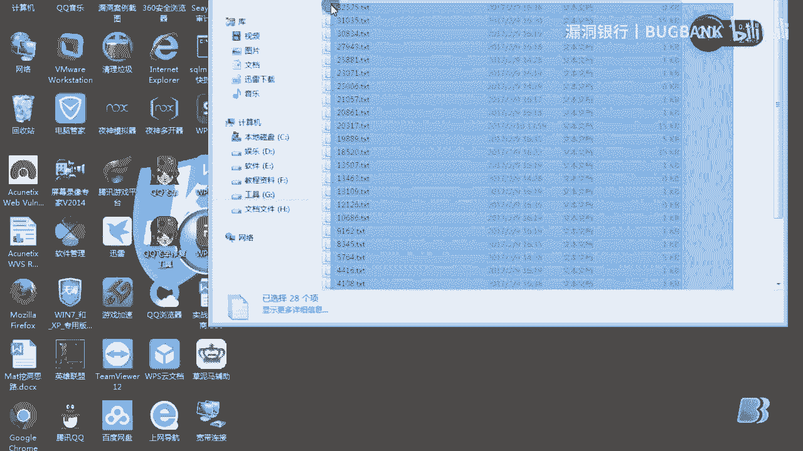
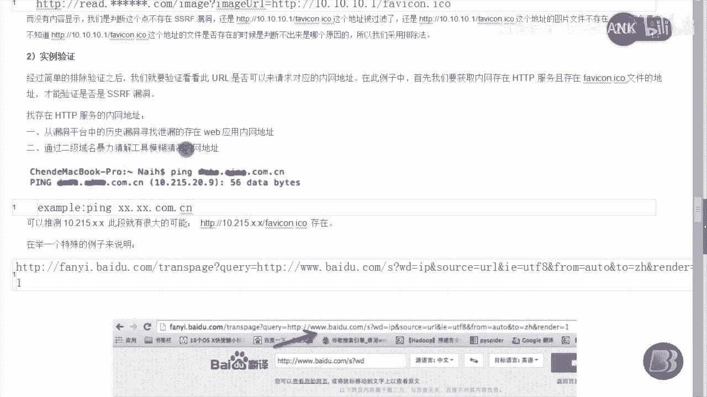

# 课程 P1：SSRF漏洞初探 🕵️♂️

在本节课中，我们将要学习**SSRF（服务端请求伪造）** 漏洞的基本概念、原理、攻击方式以及挖掘思路。通过本教程，初学者可以理解SSRF漏洞是如何产生的，以及如何识别和验证此类漏洞。

---

## 什么是SSRF？




很多Web应用程序都提供了从其他服务器上获取数据的功能。使用用户指定的URL，Web应用程序可以获取图片、下载文件或读取内容。如果这个功能被恶意使用，攻击者就可以利用存在的Web应用缺陷作为代理，攻击远程和本地的服务器。这种形式的攻击称为**服务端请求伪造攻击**。



---

## 漏洞原理演示

上一节我们介绍了SSRF的基本概念，本节中我们来看看一个具体的模拟案例。

这里是一个用PHP编写的CURL功能模拟靶场。首先，我们访问一个测试URL，该URL可以填写我们想请求的网址。例如，我们尝试访问百度。

```php
// 模拟的PHP CURL代码片段
$url = $_GET['url'];
$ch = curl_init($url);
curl_setopt($ch, CURLOPT_RETURNTRANSFER, true);
$response = curl_exec($ch);
curl_close($ch);
file_put_contents('baidu.txt', $response);
echo $response;
```

访问后，脚本会将百度的首页文件保存到本地的`baidu.txt`文档中。其原理是通过脚本访问目标网站，将响应内容保存到本地文件，然后输出页面。这样，攻击者就能下载目标网站的源码文件。

---

## 攻击方式与利用

理解了原理后，我们来看看攻击者可以利用SSRF漏洞实现哪些攻击。

以下是几种常见的攻击方式：

1.  **信息收集与端口扫描**
    攻击者可以对外网服务器所在的内网进行端口扫描，获取服务信息。例如，通过访问`127.0.0.1:3306`，可能返回MySQL的版本信息（如`5.6.17`），而访问不存在的端口（如`127.0.0.1:99`）则返回空。通过判断响应内容是否为空，可以编写脚本进行内网端口探测。

2.  **对内网Web应用进行指纹识别**
    通过访问内网应用的默认文件或特定路径，可以识别出运行的Web框架或应用程序。例如，访问特定的错误页面或标识文件，可以判断应用是否使用了ThinkPHP等框架。

3.  **执行命令与溢出攻击**
    在某些配置不当的情况下，利用类似`gopher://`等协议，可能对内网应用程序执行命令或触发溢出攻击。

4.  **读取本地文件**
    利用`file://`协议，攻击者可以读取服务器本地的文件内容。例如，访问`file:///C:/Windows/win.ini`可以读取Windows系统的配置文件。

---

## 常见的漏洞场景

从上面的攻击方式可以看出，SSRF漏洞常出现在服务端需要获取外部资源的功能中。

以下是几种容易产生SSRF漏洞的常见场景：

*   **分享功能**：通过URL地址分享网页内容时，应用会抓取目标URL的标题和内容进行展示。
*   **转码服务**：为适应手机屏幕，将网页内容转为适合移动端浏览的样式。
*   **在线翻译**：通过URL地址翻译指定网页的内容。
*   **图片加载与下载**：通过URL地址加载或下载远程图片，服务器可能对图片进行处理（如添加水印）。
*   **文章/图片收藏功能**：类似于分享功能，会获取URL的内容进行展示。
*   **未公开的API**：一些内部或未文档化的API，提供了调用远程URL的功能。

---

## 漏洞挖掘思路

上一节我们介绍了漏洞出现的场景，本节中我们来看看如何主动寻找SSRF漏洞。

挖掘SSRF漏洞，关键在于寻找那些需要用户提供URL参数，并由服务器发起对外请求的功能点。

我们可以通过以下方式进行寻找：

1.  **功能点分析**：在测试Web应用时，重点关注上述提到的“分享”、“转码”、“图片处理”等功能，检查其请求参数。
2.  **关键词搜索**：在源代码或网络请求中，搜索包含`url`、`link`、`src`、`path`等参数名。
3.  **使用搜索引擎语法**：可以利用如`inurl:`、`intext:`等语法，配合`url=`、`path=`、`link=`等关键词，寻找可能存在SSRF的站点。

---

## 漏洞验证方法

发现可疑点后，我们需要验证它是否确实是一个可利用的SSRF漏洞。

以下是验证SSRF漏洞的常用方法：

*   **排除法**：首先确认请求是否确实由服务端发起。例如，在浏览器中直接右击图片“在新窗口打开”，如果地址栏显示的是目标站点的直接URL，而非自己站点的代理URL，则可能不存在SSRF。
*   **使用抓包工具**：使用Burp Suite等工具拦截请求。如果刷新页面后，关于图片的请求是从客户端浏览器发出的，而不是从服务器端发出的，则可判断不是SSRF。
*   **探测内网服务**：尝试让应用访问已知的内网地址或端口（如`127.0.0.1:80`, `192.168.1.1:8080`）。如果能够成功获取到内网服务的响应，则证明存在SSRF漏洞。寻找内网地址可以通过历史漏洞信息、二级域名爆破或模糊猜测等方式。

---

## 总结



本节课中我们一起学习了SSRF（服务端请求伪造）漏洞。我们了解了它的基本定义和原理，即**服务器代替用户发起非预期的网络请求**。我们探讨了多种利用方式，包括信息收集、端口扫描、读取文件等，并分析了常见的漏洞场景和挖掘思路。最后，我们介绍了验证SSRF漏洞的几种实用方法。对于开发者而言，应对SSRF的关键在于对用户输入的URL进行严格的校验和过滤，例如设置白名单或禁用危险协议（如`file://`、`gopher://`）。