# 课程 P1：浅谈嵌入式浏览器安全 🖥️🔒

在本节课中，我们将要学习嵌入式浏览器的基本概念、安全风险以及如何从跨站脚本（XSS）漏洞入手，最终实现远程命令执行（RCE）。课程将通过分析两个实际案例（蚂蚁笔记和已健）来讲解完整的攻击链。


---


## 什么是嵌入式浏览器？🤔

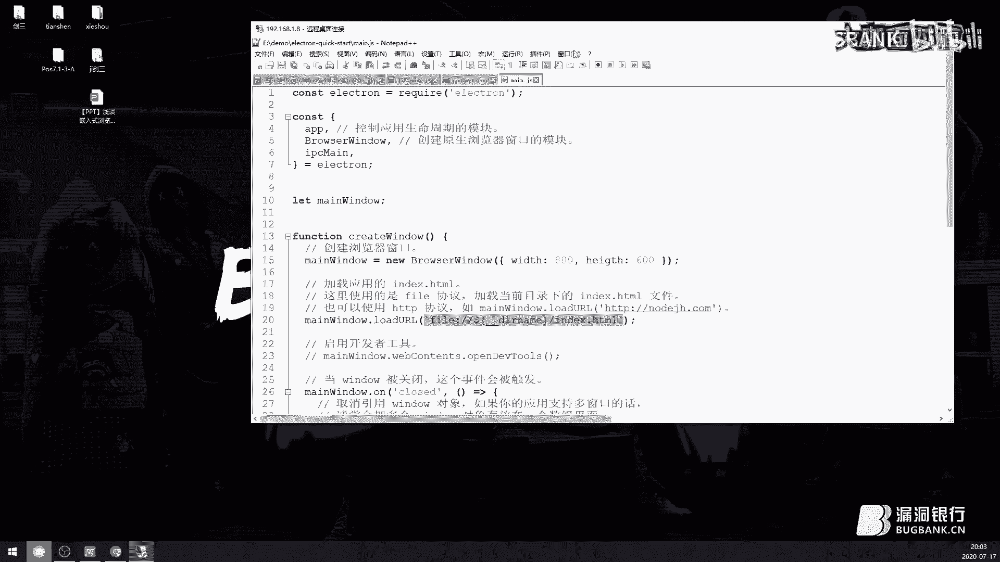

嵌入式浏览器是嵌入在客户端软件中的浏览器控件。通过浏览器控件的丰富接口，可以使浏览器与主程序进行丰富的交互。这意味着开发者可以使用 HTML、JavaScript 和 CSS 来开发客户端界面和功能，包括网络发包等操作。

市面上主流的嵌入式浏览器框架包括：
*   **CEF** (Chromium Embedded Framework)
*   **NW.js** 和 **Electron** (常简称为 EL 框架)
*   **Qt WebKit**
*   **MSHTML** (微软官方，但已逐渐被弃用)


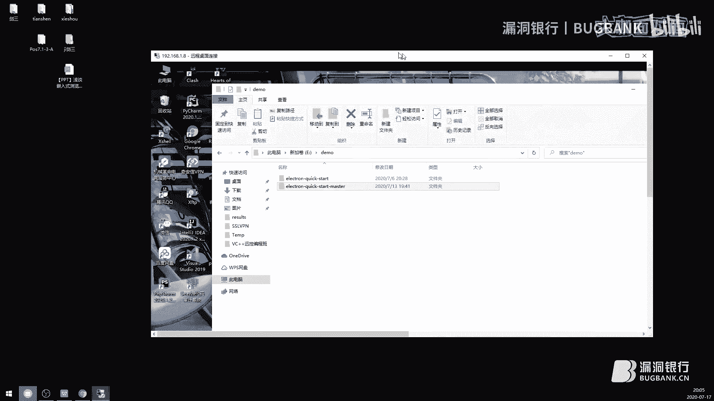


目前，CEF 和 Electron 框架占据主流，Qt WebKit 次之，MSHTML 已基本停用。


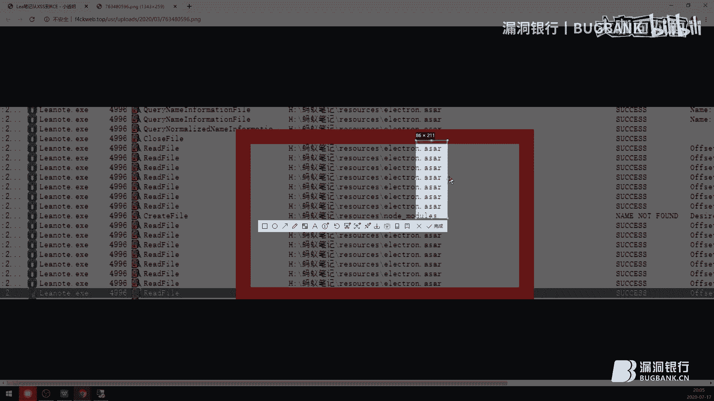


---


## 如何识别嵌入式浏览器框架？🔍

上一节我们介绍了嵌入式浏览器的概念，本节中我们来看看如何识别一个客户端软件使用了哪种框架。

以下是不同框架的显著特征：

**CEF 框架的特征：**
*   目录中包含 `libcef.dll` 文件。
*   存在以 `cef` 开头的 `.pak` 资源包文件。
*   例如：微信、网易云音乐、蓝信等客户端。

**Electron 框架的特征：**
*   目录中包含 `package.json` 配置文件。
*   资源通常打包在 `.asar` 文件中（本质是一个压缩包，可直接用压缩软件打开查看源码）。
*   程序可能由一个加载器加载资源，或将所有资源打包进单一可执行文件。

---

## Electron 框架快速入门与命令执行 ⚡

了解了框架识别方法后，我们来看看如何快速上手分析一个 Electron 应用。本节将以一个简单的 Demo 为例。

一个典型的 Electron 应用结构如下：

**`package.json` 配置文件示例：**
```json
{
  "name": "MyApp",
  "version": "1.0.0",
  "description": "简介",
  "main": "main.js"
}
```
其中，`main` 字段指定了入口文件，类似于 C++ 中的 `main` 函数。

**`main.js` 入口文件示例：**
```javascript
const { app, BrowserWindow } = require('electron')
function createWindow () {
  const win = new BrowserWindow({ width: 800, height: 600 })
  win.loadFile('index.html') // 加载首页
}
app.whenReady().then(createWindow)
```

**命令执行条件分析：**
Electron 应用能否执行系统命令，关键在于其是否允许加载 Node.js 的原生模块。
*   **允许加载 Node.js 模块**：可以直接调用 `child_process` 执行命令。
    ```javascript
    // 示例：弹出一个计算器
    require('child_process').exec('calc')
    ```
*   **不允许加载 Node.js 模块**：则需要寻找应用自身封装的、具有类似功能的 JavaScript 扩展函数。目前大多数 Electron 应用默认允许加载 Node.js 模块。

---

## 从 XSS 到 RCE 的攻击链条 ⛓️

上一节我们看到了在 Electron 中执行命令的方法，本节中我们来看看攻击者如何将前端的 XSS 漏洞转化为具有破坏力的远程命令执行。

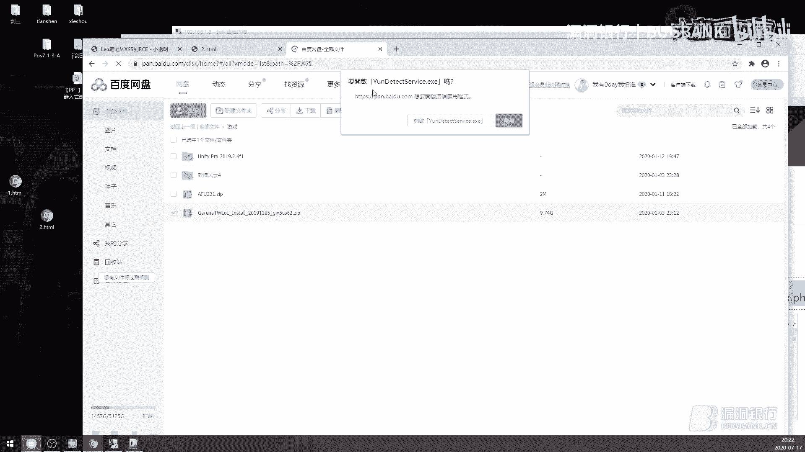


完整的攻击链条如下图所示：


以下是攻击步骤的详细分解：

**第一步：发现一个 XSS 漏洞**
*   首先需要找到一个跨站脚本漏洞。
*   关键点在于，这个 XSS 的输入是否**可控**？攻击者能否从远程（例如自己的服务器）控制最终注入的 JavaScript 代码？这是实现“远程”命令执行的前提。

**第二步：判断执行环境**
*   确认存在 XSS 后，需要判断该处 JavaScript 的执行环境。
*   **如果能调用 Node.js 模块**：那么攻击者可以直接在 XSS 中注入类似 `require('child_process').exec('恶意命令')` 的代码。
*   **如果不能调用 Node.js 模块**：则需要审计应用程序自己编写的 JavaScript 扩展，寻找可以下载或写入文件的功能函数。

**第三步：构建利用链**
*   如果无法直接执行命令，攻击者通常会尝试“下载并执行”的思路：
    1.  **下载文件**：寻找应用内可用于下载远程文件的函数（例如更新功能）。
    2.  **执行或持久化**：将恶意程序下载到用户主机，并设法运行它，或将其放入自启动目录。

**补充知识：浏览器特权域**
*   普通浏览器（如 Chrome）的 JavaScript（V8 引擎）出于安全考虑，禁止直接进行文件操作。
*   但国内很多二次开发的浏览器（如 360、QQ 浏览器）引入了“特权域”概念。在特定的、受信任的域名（特权域）下运行的 JavaScript，可以调用浏览器内核暴露的、功能更强的扩展 API（如文件操作）。
*   历史上很多浏览器 RCE 漏洞，都是先通过漏洞获得特权域下的 XSS，再利用特权域扩展 API 完成文件操作，最终实现 RCE。


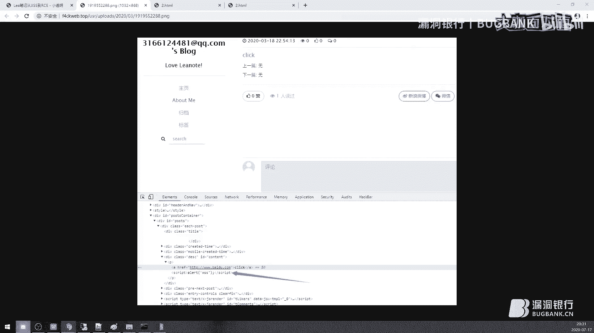

**另一种途径：逻辑漏洞与内存溢出**
*   除了上述 JavaScript 层面的利用，还可能存在逻辑漏洞或二进制层面的内存溢出漏洞，后者涉及更深层的二进制安全知识。

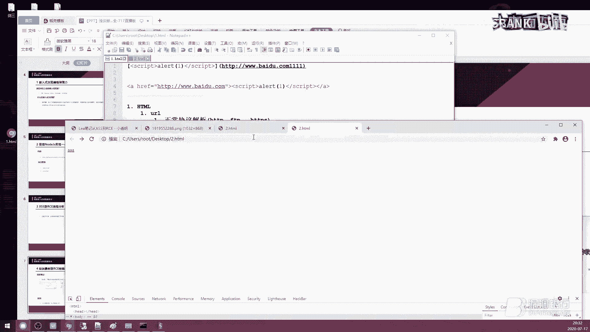


---

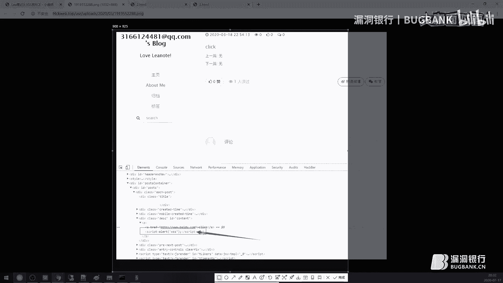

## 实战案例一：蚂蚁笔记 📓


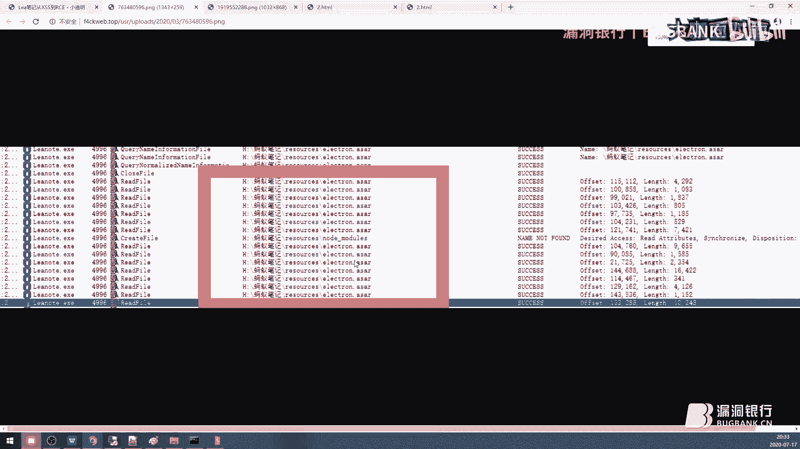

接下来，我们将理论应用于实践。首先分析“蚂蚁笔记”这个案例。

**漏洞起因：Markdown 解析导致 XSS**
*   蚂蚁笔记支持 Markdown 语法。当写入一个链接时，会被解析成 HTML 的 `<a>` 标签。
*   例如，`[点击](http://example.com)` 会被解析为 `<a href="http://example.com">点击</a>`。
*   攻击者可以在 `href` 属性值中插入 JavaScript 伪协议来注入代码：
    ```
    [点击](javascript:alert(1))
    // 解析为：<a href="javascript:alert(1)">点击</a>
    ```

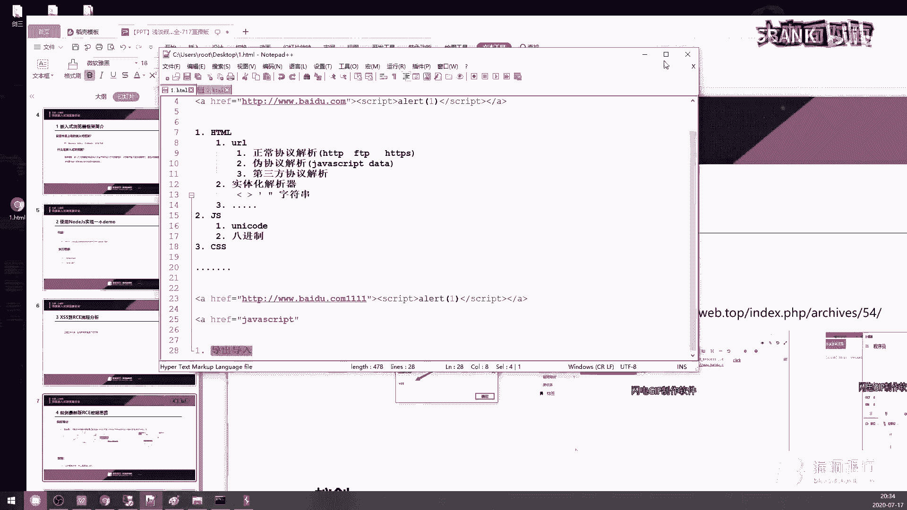

**利用链构建：**
1.  **确认框架**：通过分析软件目录，发现 `.asar` 文件，确认其为 Electron 应用，且支持 Node.js 模块。
2.  **利用 XSS**：在笔记中插入恶意 Markdown 链接，当用户查看笔记历史记录或通过 Web 端分享查看时，触发 XSS。
3.  **执行命令**：在 XSS 中注入调用 `child_process` 执行系统命令的代码（如弹出计算器）。
4.  **远程投递**：利用笔记软件的“导出/导入”或“分享给好友”功能，将包含恶意 Payload 的笔记传播给其他用户，实现远程攻击。


---

## 深入利用：HTML 解析与编码绕过 🛡️➡️⚔️

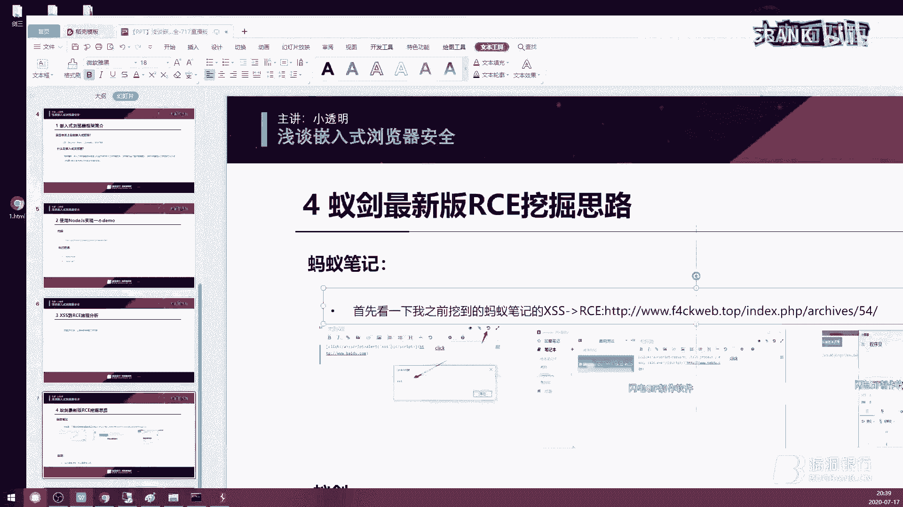

在蚂蚁笔记案例中，我们简单提到了利用方式。但在实际攻击中，网站往往存在过滤机制。本节我们深入探讨 HTML 解析原理和常见的编码绕过技巧。

**浏览器解析器模型：**
浏览器内核包含多个解析器：
*   HTML 解析器
*   JavaScript 解析器
*   CSS 解析器

其中，HTML 解析器又包含：
*   **URL 解析器**：处理 `href`、`src` 等属性中的地址。
    *   正常协议：`http://`, `ftp://`
    *   伪协议：`javascript:`, `data:`
    *   第三方协议：`baiduyun://` (会调用本地客户端)
*   **实体编码解析器**：将 `&lt;`、`&quot;` 等编码解码为 `<`、`"` 等字符。

**关键绕过技巧：**
1.  **利用字符串属性**：HTML 标签属性值（如 `href="这里的值"`）的内容本质上是**字符串**。因此，可以使用 HTML 实体编码来替换关键字符。
    *   例如，如果过滤了 `javascript` 这个词，可以将其编码为 `&#106;&#97;&#118;&#97;&#115;&#99;&#114;&#105;&#112;&#116;`。
2.  **多层编码组合**：在 `href` 属性中，可以对整个 `javascript:` 伪协议后的代码进行多重编码。
    *   顺序：先进行 JavaScript Unicode 编码，再进行 HTML 实体编码，最后进行 URL 编码。
    *   示例：`javascript:alert(1)` 可以编码为 `javascript:%26%23106%3B...` 等形式。
3.  **利用解析特性**：
    *   协议名 (`javascript:`) 和冒号之间可以插入换行符或制表符。
    *   属性与等号、等号与值之间可以插入空格。

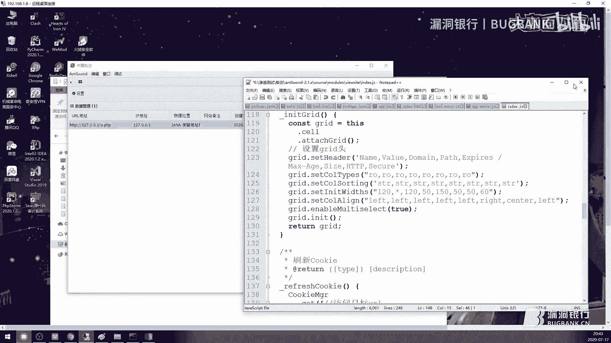


**注意限制**：尖括号(`<` `>`)、单/双引号(`‘` `“`)是 HTML 的**控制符**，用于界定标签和属性范围。一旦在属性值外部，就无法再用实体编码字符串的形式来绕过对其本身的过滤，因为控制符不能被字符串替代。

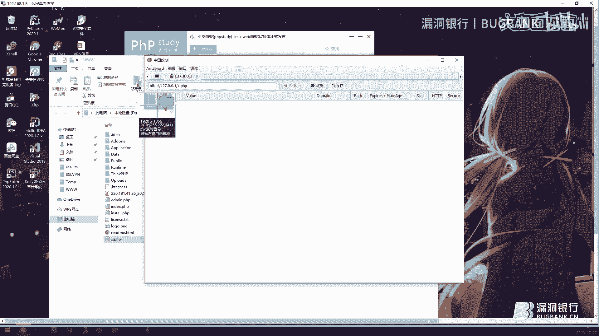

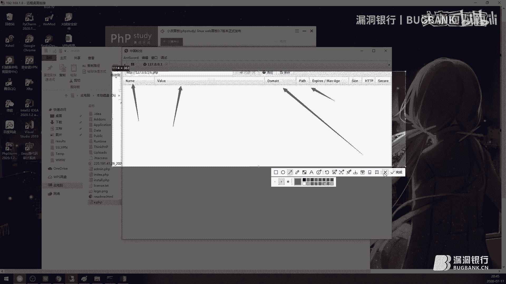

---

## 实战案例二：已健（一个 Web Shell 管理工具） 🛠️

现在，我们来看第二个更复杂的案例——“已健”。这个案例展示了如何在功能点中寻找漏洞。


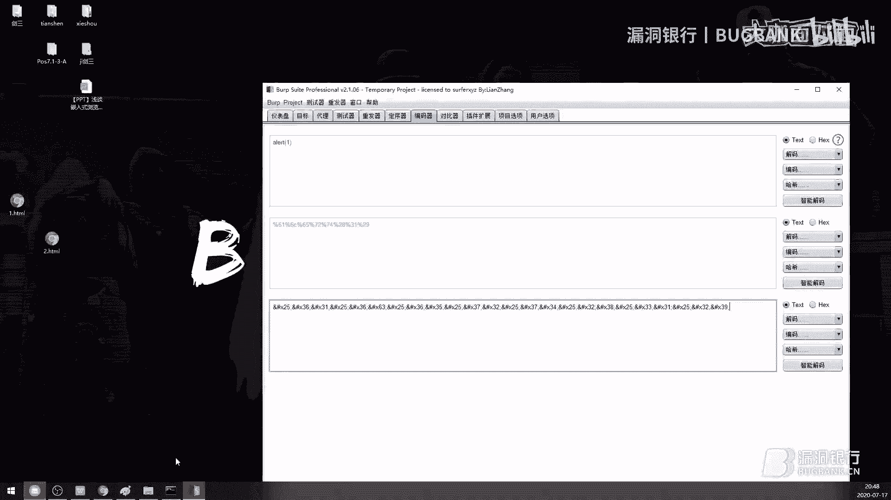

**目标分析：**
*   已健是一个 Web Shell 管理客户端，主要功能包括：虚拟终端、文件管理、数据库操作、浏览网站。
*   攻击思路：寻找与远程服务器交互且数据可被控制的功能点。


**代码审计过程：**
1.  **框架确认**：查看 `package.json`，找到入口文件 `main.js`。
2.  **关键配置**：在入口文件中，发现 `nodeIntegration: true` 配置，这意味着该应用**允许加载 Node.js 模块**，为 RCE 创造了条件。
3.  **寻找 XSS 点**：审计“浏览网站”功能模块的代码。发现一个处理 HTTP 响应头 `Set-Cookie` 的函数，该函数将 Cookie 的 `name`、`value`、`domain` 等字段直接拼接输出到页面，**没有经过任何过滤**。
4.  **漏洞验证**：
    *   攻击者控制一个服务器，并在 HTTP 响应头中设置恶意的 Cookie，例如：`Set-Cookie: name=`。
    *   当已健客户端访问该恶意服务器并接收响应时，恶意 Cookie 被解析并显示在界面中。
    *   由于没有过滤，`` 标签被正常渲染，其 `onerror` 事件触发，执行了嵌入的 Node.js 命令，成功弹出计算器。

**案例总结**：这个案例清晰地展示了“可控输入点（XSS） + Node.js 集成环境（RCE条件） = 远程命令执行”的攻击路径。


---

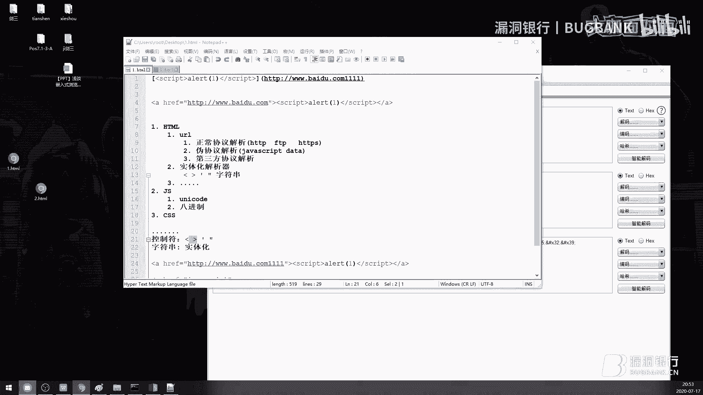


## 问答环节精华摘要 💬

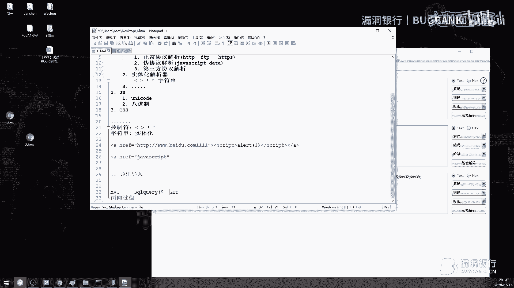

在本节课的最后，我们整理了直播中观众提出的部分问题及解答。


**Q：代码审计时，是不是只要有 GET 请求就可以判断是否存在 XSS？**
A：不是看 GET 或 POST 请求方式，而是看**数据是否来自你可控的源头**。例如，聊天软件中，对方发送的消息内容就是你可控的输入点。

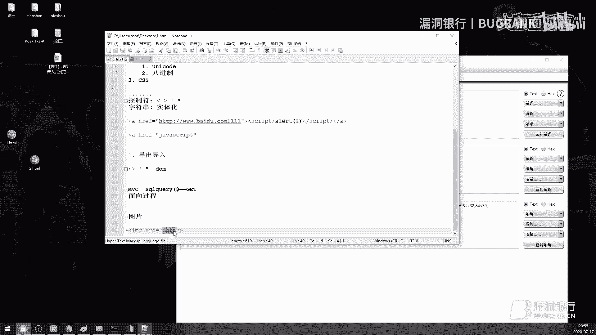

**Q：尖括号(`<` `>`)、引号被过滤了，还能用实体编码绕过吗？**
A：不能。实体编码只能在 HTML **属性值**（字符串环境）内使用。尖括号和引号是界定标签和属性范围的**控制符**，在属性值外部被过滤后，无法用编码字符串绕过。


**Q：如何快速在代码中寻找漏洞突破点？**
A：这取决于程序架构。如果是 MVC 框架，可以先寻找项目封装的底层通用函数（如数据库查询函数 `sql_query`），审计其输入过滤是否完备。这是一种高效的方法。

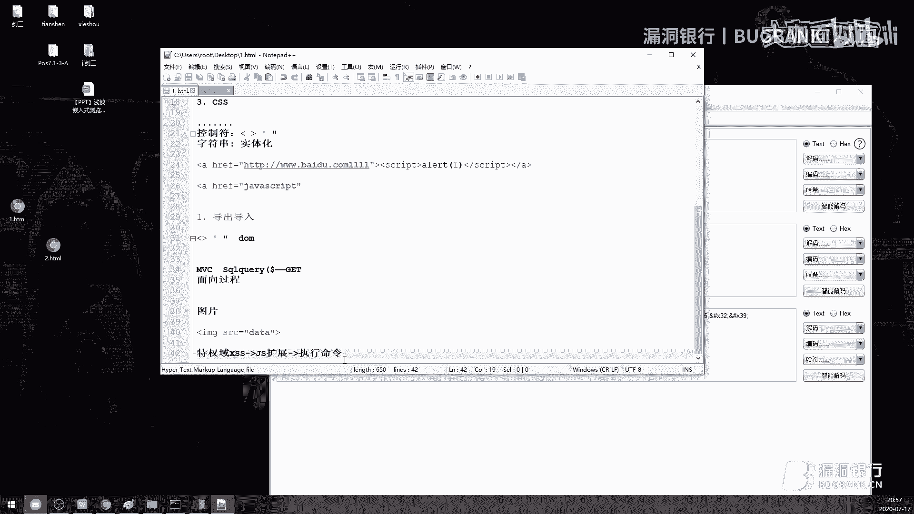


**Q：普通浏览器（如 Chrome）的 XSS 能直接执行 `child_process` 弹计算器吗？**
A：不能。普通浏览器的 JavaScript 引擎（V8）没有 `child_process` 模块，也无法加载它。浏览器环境下的 RCE 通常需要利用“特权域” XSS 结合浏览器扩展 API 才能实现。

**Q：如何判断该使用哪种编码进行绕过？**
A：主要依靠经验和对解析顺序的理解。多练习、多测试常见的编码组合（如 URL 编码、HTML 实体编码、JavaScript Unicode 编码），就能逐渐掌握。

---


## 总结 📚

本节课中我们一起学习了嵌入式浏览器安全的基础知识。我们从嵌入式浏览器的概念和框架识别入手，逐步深入到 Electron 框架的命令执行原理。然后，我们剖析了从前端 XSS 漏洞到远程命令执行（RCE）的完整攻击链条，并辅以“蚂蚁笔记”和“已健”两个实战案例加以说明。最后，我们还探讨了 HTML 解析与编码绕过的技巧，并回顾了关键的问答内容。


希望本课程能帮助你建立对嵌入式浏览器客户端安全的基本认识。记住，安全的核心在于理解原理，无论是攻击还是防御。