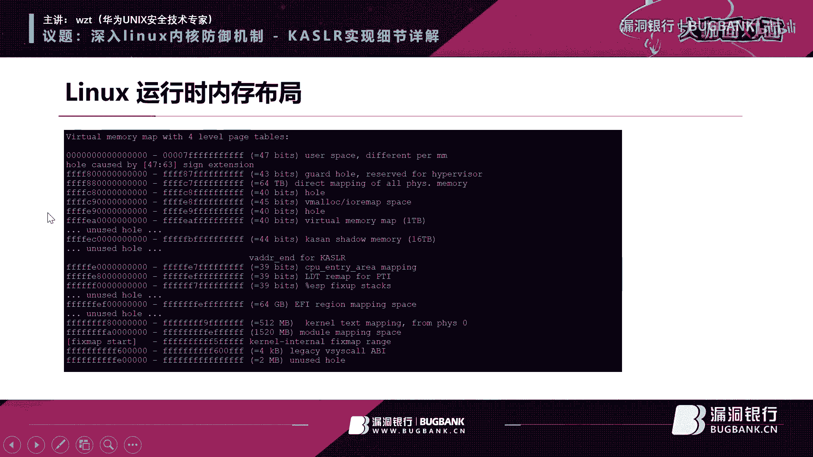
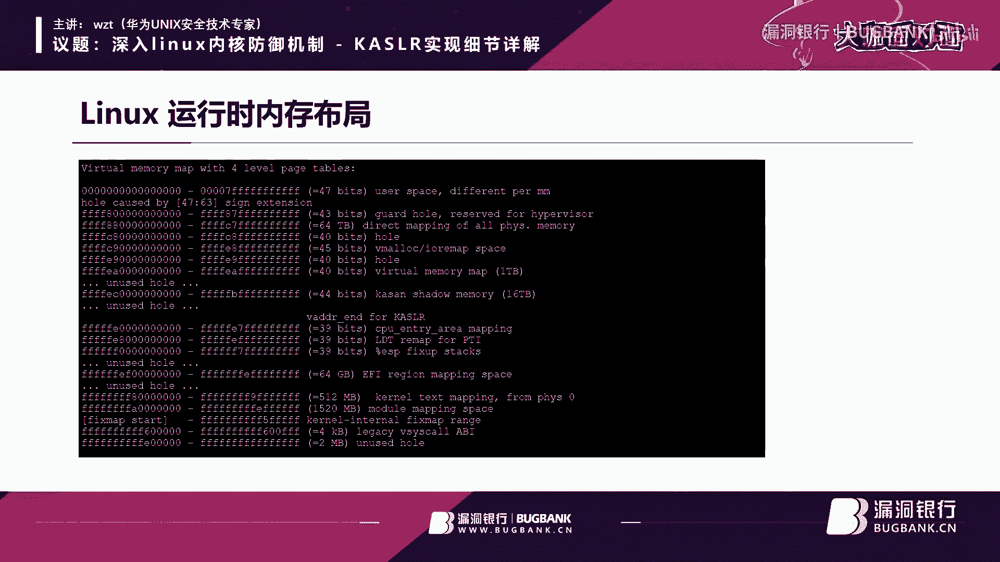
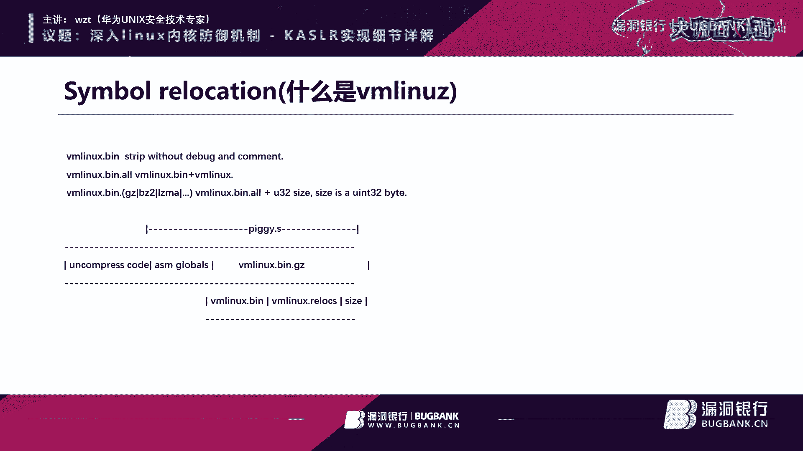
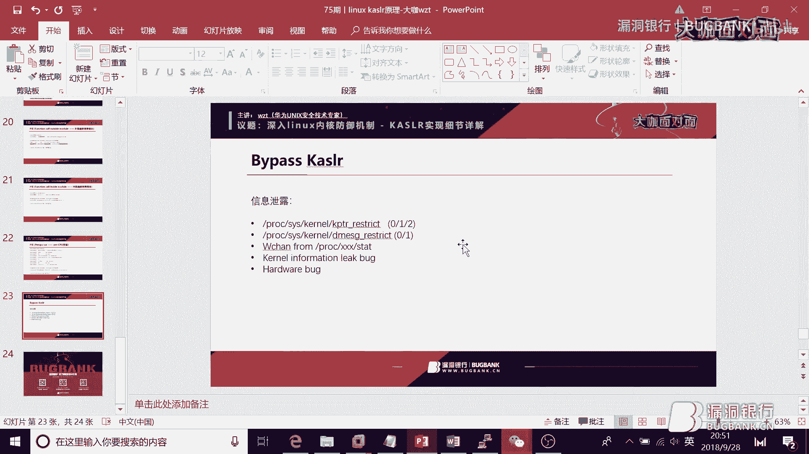
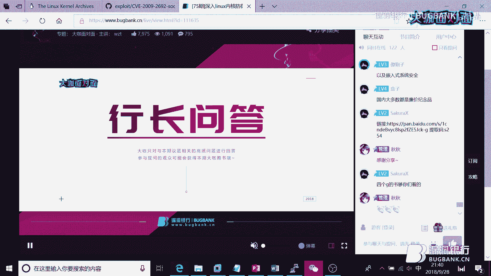
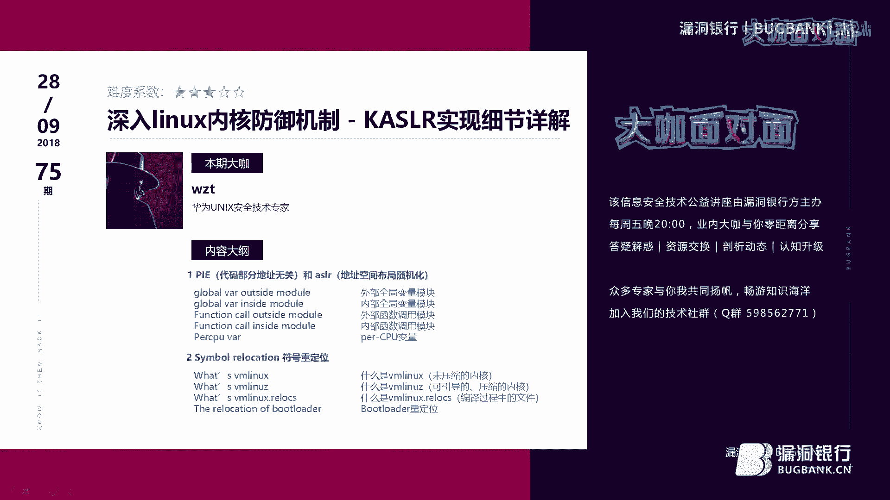
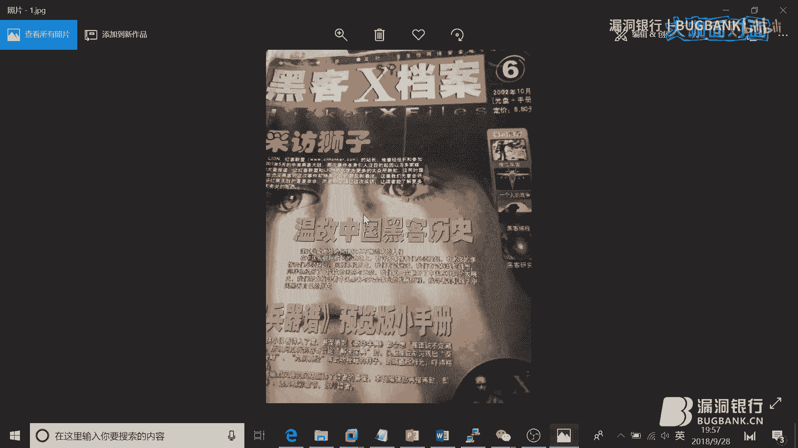
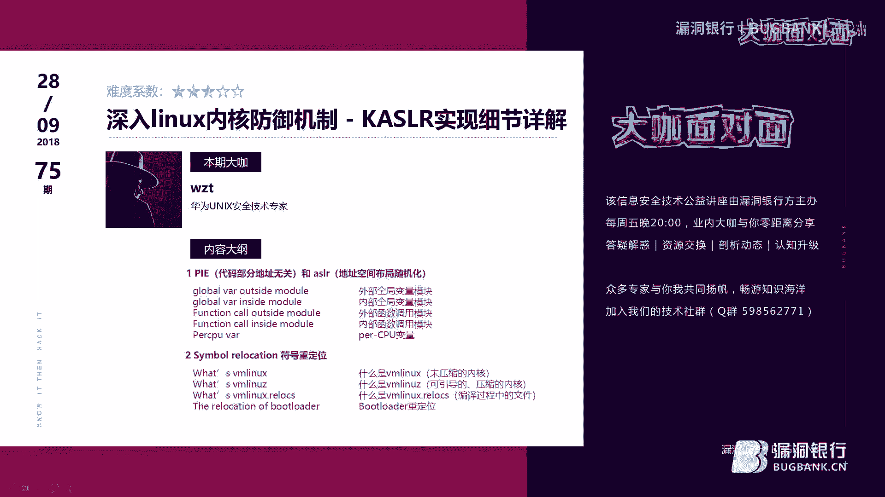

# P1：【录屏】深入linux内核防御机制_KASLR实现细节详解-大咖wzt-漏洞银行大咖面对面第75期 - 漏洞银行BUGBANK - BV1Ft411f7C8

(音效)。

为知识而存 因技术而生。

小朋友晚上好，欢迎参加第75期漏洞银行安全技术直播，大咖面的面，我是主持人秋秋，那今晚非常荣幸，我们请到了来自华为的大咖，他是华为UNIX安全技术专家，WZT。

他想为我们分享关于KASLR实现相关的技术内容，深入了解Linux内核防御机制，那拥有多年研究经验的他，今天也会让你听得痛快，那相信内容都会对安全爱好者有所比喻，直播注定精彩，记得看到最后哦，那老规矩。

听讲和互动结合才会是完整的直播，在大咖演讲结束之后，还会有行程问答环节，问答结束后，WZT大咖会选择一名幸运观众，赠予参与本次直播的纪念礼品一份，大家记得多多参与和互动哦，好。

那下面就把直播间交给大咖吧。

请大家开始分享，今天我是想给大家去分享一下这个，就是Linux里面有一个很重要的一个安全机制，这个叫KASLR就是内核地质随机化，因为这个保护机制呢，是最近大概今年才会火起来。

所以就是我想给大家去分享一下他的一些实现原理，我先自我介绍一下，我的这个ID叫WZT，其实我是08年，08年是本科毕业，然后到第一家公司是在迅雷工作，然后09年我就跳到那个阿里去了。

在阿里待了大概六七年，然后就现在是在华为工作，就是一直从02年到现在吧，主要是做一些Linux相关的一些安全研究，给自己定义成是一个UNIX程序员，基本上就是说在Linux下做一些编程开发。

包括一些内核开发，然后安全这块也其实在一直在做研究，我个人的一个主业是GitHub，GitHub下面叫Cloud SEC，我先做一个简短的宣传，就这个GitHub里面。

其实有一些我之前写的一些开源的一些软件，像这个BR Rootkit，这个东西就是是用那个Bash来写的一个Rootkit，这个是当时是我想想就KCON2015的时候，我好像我就出去讲过这个事情。

然后这个是一个就是简单的一个加码虚拟机，跑一些那个加码代码这个好像没什么问题，这个Exploit是我之前写的一些就是，就是内核的一些工具代码，这个是一个一个玩具吧。

就是一个跑在一个386下的一个操线内核，而剩下这些这个research里面它会有一些，就是我做的一些那个安全研究吧，就是做的一些关于内核方面的，这个大家有机会可以去看一下，就对于内核入门。

或者说想了解一些朋友，你可以去看一下，我然后我这个个人简介我就讲完了，这个待会你们有什么问题的话，就直接可以问我，这个KSR呢，其实就是内核地址随机化，那我今天在讲这个实现原理的时候呢，会涉及到两部分。

第一部分是讲第一个就是符号重定位，为什么要讲一个重定位的这种概念呢，就是你在随机化产生的时候，我会随机产生一个偏移的值，本来是说内核，它是固定加载在某一个地址上的，但是呢，我们为了做一些就是防御手段。

不会被那个黑客去猜到我们的内核，一些符号表地址，所以我们采取一些随机化的这边一个概念，就是在一个之前固定的一个地址之上呢，增加一个随机偏移，那这样你增加一个随机偏移之后，那你本身你内核在编译之后。

它所调用的一些函数或者说符号引用，它都需要做一些重定位，不然你在内核再重新引导的时候是跑不起来的，所以我们会讲一下这个重定位的一些原理，然后呢，我们会讲一下就叫PAE，这个是这个是小编翻译的。

就是他们这个翻译不太准确，这个应该叫做地址不公安化的一个代码，就是讲一下我GCC它的一个PAE，究竟是什么，它和那个就是ASR之间的一个关系，它又是什么，这是今天主要讲的内容，当然最后的话。

我会再讲一下就是如何去bypass一些这个，KSR的这个功能，我先讲一下八卦一下，就是这个KSR它的历史，首先呢，我们先看一下这个ASR，KSR这个ASR。

它指的是实际上是用户空间下的这个地址随机化功能，那么K就是kernel就是内核的一个地址随机化，就我们按这个时间顺序来看的话，从03年的时候，就第一个那个通的一个操作系统。

在实现这个ASR的一个操作系统，它就是OpenBSD，OpenBSD大家不知道有没有听过，就是它这个系统是目前为止最安全的一个操作系统，为什么叫讲它是最安全的操作系统呢。

因为它从诞生到现在大概有二三十年这种历史了，然后它被人发现出的漏洞只有两个，只有两个漏洞，就二三十年来它的被人发现漏洞只有两个，所以就是我们把它叫做一个最安全的一个操作系统。

这个并不只是指它就是说那个操作系统，那个安全功能有多少，而说这个它本身就是写这个代码的，这些内核开发者他本身就很注重安全性，他们把这个reo代码做了一个非常非常多的一个工作。

所以他这二三十年这个操作系统是出两个这种bug，两个漏洞，所以是这个是很牛逼的一个，当然就是说那个ASR的，其实最早这个在引用的时候，实际上是一个叫做PAX。

就是你可以看到是也是一个Linux的一个组织，它实际上是写了很多关于这个Linux的，或者说一些开源的一个内核安全补丁，那么这个社区包括之后Linux或者说Windows。

都会把它的一些那个想法去移植到他们那个操作系统里面，就包括那个大家有没有如果做内核工坊的话，可能会听过叫GI security，这个补丁呢，实际上有很大一部分补丁来自于这个PAX这个团队。

然后其实对于这个Linux呢，就是在2005年的时候就2。6这个版本，这个版本时候他才开始出现了一个那个ASR，其实是一个一个占地值的一个随机化这样功能，我当时接触最早的时候那个kernel是2。

4这个内核，2。4的内核，其实这个功能就是对于产生一个溢出，其实攻击来说其实是很就是很简单的一个攻击，但你这个就是2。6以后呢，他增加了一个ASR这种功能，就对于去猜测这个占的一个地值是稍微困难一点。

这是这是Linux是2005年时候加入这个ASR的功能，然后到了那个07年的时候呢，是就Windows这个Vista，还有这个Mac OS，那么这个这个时间呢。

就是微软他是在这个Vista这个版本里面把这个ASR，ASR这个功能给加强，当时我这个时候其实我是在上大学，然后当时这个随这个ASR出现的还有一个叫DP，这种就是数据段不可执行这种这种功能。

很多人就是我那时候我的前辈，那些人很多在网上都说我靠这个Windows的这个，这个漏洞，这个这种溢出的时代结束了还是怎么样，当时我居然就信了，然后当下的我就直接就就不研究Windows了。

我觉得没得玩了，然后就那那个大学开始就就继续就是深入去研究Linux，这这开个玩笑，当时当当然是被那些人忽悠了是吧，到09年的时候，这个NetBSD就BSD这个操作系统呢。

他们实际上都是从这个UNIX这种这种操作系统，那个产生一个分支，然后那个就是波克利那大学里面，他做了一个叫从UNIX分支出来一个叫做BSD这种系统，那BSD呢，其实又分成三大那个家族。

那个三大家族里面第一个就是，最比较出名的是NetBSD，OpenBSD还有FreeBSD，NetBSD是09年才把这个功能加上，而到那个0到这个11年的时候，就iOS4。3开始他会加这个ASR的功能。

就是那个iPhone系列开始卖的时候，他其实就已经有这些功能了，然后最关键的一点就是到这个2012年的时候，就Solaris这个操作系统，大家如果你们就是在那个做一些就是入侵。

或者说那个安全方面工作时候，其实你现在发现这个Solaris这个系统呢，其实已经非常非常少了，就之前在十几年前呢，他实际上是那个在那个服务器里面，他是很很很常见很常用的一套系统。

所以你看安全这块他2012年就是当狼唱那首歌的时候，他那个时候才把这个ASR给加上去，所以这个这个就是怎么讲，他这个安全性还是比较差的，然后说完这个ASR这个一个历史，那么就开始讲这个KSR。

就ASR就是用户态的一个地理刺激化，就是随着这个ASR包括这个DEP，包括那个比如说站保护里面有一些那个Stack，Stack那个case那种保护是吧，然后呢你就会发现这个在应用层这种攻击。

然后那个去去攻击成这个路透选线的时候，其实写这个攻击代码来说已经比较困难，而且那个时候其实这个大家对于这个安全意识也也有了一些，然后其实你在那些常见的一些应用程序里，比如说FD服务器啊啊。

APA起啊NX啊，包括SH里面你能发现的漏洞其实越来越少了，然后这个时候其实大家都把那个精力去投入到这个内核这块，然后突然发现就内核这一块，这个这个本身的安全功能第一个就非常少。

第二个实际上是说当内核那种漏洞呢，其实还是非常多的，因为之前这相当于用户空间内核里面进行那个探索，还是比较新的，当然这个这个这个现在这个这现在都已经18年了，那你放到那个时间前的话。

这个内核这块你去攻击一个内核这个一个漏洞，要比写一个就是用户空间这个这个代码要容易的很多，因为那个那个时候内核的，比如说内核它本身那个那个站的一个不可执行，包括DEP啊，现在的NX啊，包括就是SMAP。

也就是SMAP就是内核空间，它不允许访问用户代码等等些东西，它这些功能都没有，所以根本也不用到什么ROP啊，等等那些那些工具都是都是很简单的，然后这个，应用层它有那个地址随机化。

所以就会想到就是说如果对坑的这层做防护的话，也应该有要有一个地址随机化的这个功能，那么这个从这个07年上第一个就是实现这个QRS功能，还是还是Windows的Base端。

这个是实际上是从这个用户台这个ASR，他们是一起发布的，对于Windows来讲，然后呢就是12年的时候这个Mac 10。8这个系统，包括这个iOS6。

然后这里的时候他是把这个KSR这个地址随机化功能给加进去了，就苹果他们的一套系统，然后呢到了14年的时候就Linux这3。14这个内核里面，才去把这个就x86下这个KSR的功能给加进去。

那加这个功能的这些派出就是是Google团队，Google团队Google那个Chrome浏览器那些团队人，他们做不是做那个Google浏览器的纱箱吗，对吧，那为了加固这个箱。

实际上他们要把这个Kernel进行一步那个加固，所以就是他们去把这个地址随机内核的一个地址随化的功能，给加到这个内核里面去，这是x86版本，然后大概也就是一年之后吧，15年的时候那个就ARM下。

ARM下就包括就现在安卓这个手机，他才去把这些这个ARM下的一个ASR功能，包括其他一些体系，比如Linux里面有PPC啊或者等等一些体系，他都把这个ASR功能给实现掉，然后呢就是最近就是2017年。

然后NetBSD就是NetBSD才把这个地址，就是内核地址随机化这个功能给加上，这是去年刚刚做了一个事情，然后呢还有一个OpenBSD，OpenBSD他也实现了一个内核地址随机化。

但是他这个地址随机化呢，跟我们今天那个讲的这个Windows，Linux包括那些其他的一个操作系统，他使用这个随机化功能是不一样的，就是OpenBSD他这个做一个做法，我给大家讲一下就是内核。

他应该是有很多这个就是。o文件，就是可重新的文件，他这个就是通过连接器连接在一起对吧，然后形成一个完整的一个ERF，就是这种格式可执行的一个文件，这个OpenBSD他做了一个一个事情，就是在启动的时候。

他是随机的把一些。o这个文件呢，给你重新连接，这样的话你生成的那个可执行文件里面，他那些函数就是每次重新启动的时候，他那函数的相对位置都会变的，都都会改变的，所以这个是一个很很那个很新奇的一个做法。

而且是相对于我们现在待会要讲的这个，这个大众他实现的这个KSR的话，他要他要那个很难得多，然后这个就是我们现在讲的这个一个KSR的历史，好像历史的话我八卦了很多的话，这个一会有问题就那个再再问吧。

我们现在讲一下这个Linux的一个KSR，我今天给大家演示的是说这个版本是我，我重新去这样天气编译的一个内核版本，就是你看这个红色部分是4。18，这个内核也就是现在内核社区里面最新的一个操作系统。

内核是4。18，然后4。19是那个正在去开发的一个内核，然后呢，因为我们刚才讲是就是说，Linux在X26下是从3。14这个内核开始，才会有这个地址CPU这个功能，然后如果是就是现在在我们这个文件。

就是boot grab里面它有个配置配置选项，那在这里面你可以看到这一串数字，这个是一个压缩之后的Linux内核，这个待会我会讲，然后这里面是内核在启动时的一些参数，那今天下午在qq群里面。

还有同学问了一下就是怎么调试的那个Linux内核，有多种方法调试，其中有一个办法就是用KTB，KTB的话你会那需要你在启动的时候，像curl里面去传递一些参数，那其实就是这些参数。

然后后面有一个就是现在的那个4。18的内核，它是默认的情况下就会允许你使用这个KSR的功能，那你想关闭的话，它实际上也提供一个叫nokey这么一个参数，因为如果你不想使用这个地址需要功能。

那么在curl里面加上这个参数的话，那么就是它就不会有这个功能，我们看一下就是这个procmsr这个文件，我们通过去读取这个文件呢，是内核里面可以把它当前这个内存里面跑的一些符号地址给打印出来。

比如说我们Grip下一个dofoc这个函数，你可以看到这是它的一个当前系统下的一个地址，然后我再重启一下这个机器，重启一下我的一个虚拟机，我再次启动起来之后呢，我们再看一下内核地址。

同样是一个dofoc就是产生进程这个函数的时候，你看一下它的地址实际上是不一样的，不一样的出现在这个我画红色的部分，只有这一块是不一样的，为什么，因为Linux它在启动的时候，它这个是要以一个两兆。

两兆为一个对齐方式启动的，就是说你在地址随机化的时候，我们选取的那个地址呢，它不是任意的，虽然叫那个地址随机化，但这个随机的地址，包括这个地址的范围，它实际上是有规定的。

就是Linux里面它是必须是要以两兆为对齐字节，所以的话就是那现在在它当前的一个实现里面，就是它是从如果是以两兆为对齐的话，它大概只有就1024只有只有1024个地址。

这个就是说在相对于用户台下的一些那个随机化的时候，这个产生的这个随机偏移这个数量实在是太少了，就是1024，但是呢这个虽然说只有1024，那你你如果是像在那个用户台下的话，你可以通过一些暴力破解是吧。

去猜测它的一些地址，但是kernel里面它有个特殊的就是，你在利用这个漏洞时候猜错一个地址的话，那可能这个内核就直接crash掉了，所以crash掉之后呢，你再重新启动系统。

它的地址它的那个随机产生那个那个那个偏移值又变了，所以就是说在写那个内核一出代码的时候呢，其实是你想通过这种暴力破解这种猜测这个地址的话是比较困难的，是比较困难的。

所以说就是说虽然是只有1024这么一个范围，但是他那个1024个个数啊，就是偏移个数，那么他其实攻击起来还是还是相对比较困难。

我我现在讲一下就是Linux它的一个启动启动的一个大致流程，就是说这个内核地址随机化呢，实际上是说在你这个系统就就BIOS里面，那我这张图呢是是选取那个。

kernel里面他那个有一个Docker mission那个文档，文档里面他有一个关于这个x86下，他的一个内存的一个启动式的一个物理内存布局，注意他是那个物理内存布局。

我们知道就是说你你这个机器也在开机加电，它会有一个那个自检系统，就是BIOS这个系统，BIOS系统它会把你那个引导扇区里面那个那个内部，内部代码给提取出来加载出来。

然后呢他去到这个7C00这个这个地址上去跑，就关于这个怎么去写这个操作内核的话，就是在我的那个GitHub上是有一个你可以看一下WOS这个系统，它代码就只有几千行几千行的话就实现了一个。

一个多任务下的一个很小的一个操作内核，包括一个bootloader和一个一个内核主体，有有有有进程啊有内存管理，大家对这个如果对一个操作系统感兴趣的话，可以去看一下，因为只有不到那个一万行代码。

这个可以看一下，然后呢就是当这个引导扇区的代码加载这个7C00这个地址之后呢，他会把那个kernel的一个内核代码要再加载到内存里面，我们讲这个内核代码呢，它实际上是分成两部分。

就第一部分是这里叫叫做实模式下的一个内核代码，然后呢还有一个保护模式下的代码，因为我们知道就是说我们今天讲的体系x86是吧，x86的话我们知道用户空间和内核空间。

那么它实际上是在CPU的两个不同的一个模式里面，将就是在最早期微软那个DOS操作系统，DOS操作系统它只是一个实模式下的一个操作系统，对吧那保护模式，然后会就是根据CPU的一个段啊分页啊。

它会提供很多操作系统保护这种功能，然后呢这部分代码呢，这个实模式这部分代码呢会把一个，就是kernel的剩下的一些保护模式，那部分代码加载到这个地址里面，就是就是内存的物理存这个依照开始这个地址里面。

就这个里面就叫protect model kernel，就是保护模式下的这个代码，这个代码刚才我们讲就是我们在看这个。

这个起动内核起动参数里面，我们发现一个叫做Linux VMZ这样的一个文件。

它实际上是内核的一个压缩之后的一个文件，因为这个内核呢就是Linux内核，它在你编译完之后呢，这个内核体积是非常非常大的几百兆，所以它需要去压缩一下，比如说用什么Gz不算法呀等等一些那个算法。

给它压缩一下就减少它的体积，那么在那个在系统这个引导的时候，它这个protect model kernel里面，它有一部分叫做解压缩的一部分代码，它会去把这个内核代码呢，就压缩后的一个代码。

解压到临时内存的某一个地方，然后这个时候解压缩完呢，它显示一个elf这个文件格式，然后它要去解析这个elf文件格式，它现在要把那个kernel里面那个text段，包括那个data段就代码段和数据段。

那我现在要加载到物理内存的一个，一个70d点里面去正式的去运行，然后呢现在就是linux里面就是，它会把这部分夹之后那个text的这段段呢，它是放到这个物理内存的那个16兆。

16兆开始的一个物理内存地址上，所以我们讲这个随机化呢，实际上就是说它实际上是以这个16兆，这个这块为这个基础地址，然后在这个后面去不断的去那个以两兆，这个字节去对齐，可以产生一个刚才我们讲的。

1024个一个随机的一个数，然后这个时候算出它的一个，就是说随机化之后产生那个物理地址，那我们把那个刚才讲那个text段和data段，那部分代码加载到那个地址里面去，这就相当于一个地址虚化功能。

然后呢刚才我们在最开始讲，还有一个叫做符号重定位，就是你因为你在你的编译器在生成，这个kernel的时候，它里面对数据和代码和函数，也引用的都是一些固定地址，当你这个加载到不同那个内存的时候呢。

你需要利用一些那个重定位的一个技术，把它里面请求的，比如说函数你call一下那个函数是吧，那函数的offset呀，包括符号所在的地址呢，我们要去修正一下，就修正成它正确的值。

这个时候我们在跑那个内核第一段代码的时候，那么它才会正那个正确的去执行起来，所以这个就是一个kernel它的一个一个实现的一个两个关键步骤，第一个就是要选择一个合适的一块的一个物理内存。

来存放这个这个代码段和数据段，然后呢第二部分就是要做重定向，大家只要只要记住这两部分，那么这个其实就是ksr的两个那个两个精髓，然后我我再稍微介绍一下这个1820这个物理内存布局。

就是比如说我们现在这个物理内存对吧，我们物理内存呢，你你理解成这个它的那个物理地址呢，是是一个连续的一块地址，它的地址虽然是连续的，但是对于给操作系统它使用的这这种地址呢，是是其实是分段的。

也就是说一块物理内存呢，它有很多地方它是保留的，保留了你这个操作实际上是不能用的，比如说这个1820呢，这就是你这个BIOS在那个加电那个自建的时候呢，它实际上是会把去分析你这个物理内存。

然后呢就是操作系统，它把操作加载起来之后呢，操作系统可以去请求这个BIOS以后调用是吧，我们知道就以前学会汇变的时候，就是那个DOS或BIOS里面它有一个叫int调用对吧。

通过这个这种那个BIOS调用呢，你可以去获得这个你的物理内存的一个一个结构，然后那么当那个BIOS它那个参数里面有一个叫做1820，就0x1820，所以这个就是这个意思，通过这个这个参数呢。

获取就是你这块物理内存的一个一个布局，比如说我们在那个内核其实可以通过the message里面，你grip下这个1820，你可以看一下这个1820的它的一个地址范围，那么这个是我一个虚拟机嘛。

它的一个排列，你看第一个它是UZ保持是可行的，就是操作系统是可以利用这部内存，这块是reserve是保留，但是是就是不可以去用了，你的操作系统你的内核你是不能加载到这里面的。

然后呢还有一些ACPI等等一些这个这个代码，所以就说对于操作内核来讲，它能用的地方其实很少，那对于Linux来讲的话，刚才我们讲他是从这个16兆开始，他是随机的去选取了一块内存。

就把这个映像放到这块里面去，因为他会就是随机化呢，他是先获取这个1820的一个结构，他是在那个bootloader里面去获取这个结构，然后呢你获取的这个结构就是一个个内存段是吧，他有很多是可以用的。

比如说你看1234有4个段是可以用的，然后他利用一个那个随机数一个发生器，从这个4个段里面随机选选择出来一个段，比如说我现在选选择一个段，然后呢再从这个地址上去去那个不断的去去加载一些。

那个两兆位为对齐方式的那个地址值就可以了，那么这个是那个1820的一个一个结构，这个我带给大家讲一下，就是这个是Linux这个x86 64位下，他的一个运行时候的一个内存波局。

实际上这块是一个虚拟内存波局，刚才我们讲都是物理内存，那么现在是个虚拟内存，你可以看到这个地址你可以看得出来，从000到这个7ff，那么这块呢实际上是一个用户卡的地址，前面这块的包括我们先不用看。

我们可以看到这个地方，啊ff1800这个开始，不好意思在这啊就是ff800这个地方开始了，他是内核代码段的一个起始地址，我们讲的那个内KSR就内核地址随机化的功能呢，我们之前其实讲的都是对于说的。

他是内核代码段这块的一个起始地址，如果我们返回一下内核这个看一下他的符号的话，我们可以看到就test段他是从这个800开始，然后大概你在连接器给他连接的时候有512M的空间。

那么后面的空间是一些内核模块，他所占用的一个空间，那么这个是我们通常意义上讲的一个KSR的时间，但是实际上KSR他实际上是包含两部分，第一步是内核代码段的一个随机化，然后另外一部分呢。

实际上是叫做内存分辨器的一个地址随机化，那么其实是在这个部分，我们可以看到就是VMLock，包括VM Map等等这两块内存的，就是你内核这个test段，当他使用内存的时候是从这块去分配出来的。

那么分配出来后，这些地址我们可以看到都是固定的，那么在最新的这我忘记是哪个版本了，然后大概是4。1G以后，这个内核实际上把这个就是内核虚拟内存的一块的一个地址，这块地址也给随机化掉了。

所以这是一个最新的一个功能，那当然我们今天讲的只是说是一个代码段的一个偏移，那对于这个内核虚拟内存这块偏移呢，就iOS刚才我们看到就是iOS6，也就是我看看，12年的时候这个iOS6。

那么这个时候他实际上就已经做了那个内存这块，内核内存这块的一个随机化，所以看到就是因为iOS他毕竟是商业软件对吧。

那么那个4。3被攻破之后呢，他这个在安全上下了很大的一个功夫，所以就是他把一些内核地址化，所以这些东西在几年之前就已经领先这个Linux套系统他给做了。

我下面就讲一下这个符号重定位是吧，我觉得可能现在听到这的话，我觉得那个可能很多同学就可能听不下去了，或者是因为我今天做这个分享呢，其实你可能对这个内核知识，或者说编辑器的一些知识可能需要有一些了解。

那么这块的话我就尽量给大家去科普一下，然后那个后面的话有问题的话，那么你就那个在那个再提问吧，在讲那个符号重定位之前呢，我们就讲一下就科普一下什么是VM Linux，VM Linux呢。

他就是实际上是一个可执行的一个没有经过压缩的一个Linux内核，他是一个EFF这种格式，那么他这个在产生这个产生的过程呢，实际上是分成三步来产生的，我就简单介绍一下。

就第一步他说内核里面他有很多C文件对吧，那么编译成一个。o文件，那么。o文件呢，他会链接通过这个L6连接器生成一个。temp VM Linux 1这种文件，然后呢他做了一个事情就是用NM。

NM就是然后把这个二进制里面他所引用的一些符号，导入到一个临时文件叫做temp，叫key。osms1这个。o文件里面，为什么要做这个事情呢，就是Linux内核里面，他实际上是我们现在看到呢。

就是刚才我们在这里面就有这个文件，就proc下有一个这个key。osms这个文件，这个里面保存是内核符号表。

就现在curl里面都自带那些内核符号表，原因是因为在这个在产生这个临时的一个内核文件的时候呢。

他用NM先把所有的符号给导出来，导出来了之后呢，然后他再和之前那个文件进行链接，重新连接一下生成一个一个文件，然后呢再进行一个NM导出，所以他这个经过这个三步一个复杂的一个工序呢。

实际上是说要把内核里面那些符号给提取出来，这个是因为Linux他现在是比较开放，就是他curl里面一些那些地址啊，你作为路由器是可以看到的，是因为我们有这个符号表。

当然的话这个里面实际上是你可以通过那个curl里面配置选项，你可以把它去掉，在多数情况下我认为就是配置一个安全的一个Linux内核，你可以把这个东西去掉，因为这个东西不会影响你的那个内核的启动啊运行。

他只会说跟你做一些调试啊，程序开发可能会有帮助，但对于一个安全的内核来讲的话，你实际上是可以去掉的，然后我们再来看一下一个叫VM-Linux-C，就是刚才我们讲，呃，他是一个有压缩过之后的一个内核。

就是VM-Linux他压缩之后，然后他这整个的一个布局，我刚才看到就是这一块，这一块其实都叫做VM-Linux，就刚才我们讲内存在加载的时候。

就protect model kernel里面讲他是一个压缩的对吧，压缩的一个内核，那么包括没有压缩，就解压缩那部分代码，他都是放在这个VM-Linux-C这里面。

那么他的一个内存布局是这样的，就比如说前面是他的一个解压代码，然后中间跟着一些那个群体符号，比如说我我我这个后面的这个压缩包的大小呀，解压之后大小压缩之前的那个那个大小等等一些东西。

然后这个后面的话就包括一个压缩包，这个压缩包是通过JDip或者说其他那个压缩工具来压缩的，那么他这个文件里面呢又包含了几个，第一个是VM-Linux-bin，那这个是什么东西呢。

这个是就是VM-Linux，他用那个obj-copy等等一些东西把一些那个debug信息或者comment信息，那个那些section给strip掉，那strip掉之后呢。

产生一个一个二进制这么一个一个文件，然后还有个VM-Linux。relocus，这个是就是relocate里面就是重定位他需要的一些符号，然后呢后面的话这个size是什么，就整个这个前面这块的一个大小。

他放在这里面，因为这块的这个size会被那个就是说解压代码会去引用，那么这个就整是一个整个的一个，VM-Linux-z的这个内核压缩包的一个一个布局，这块灵花还是比较好理解了，对吧。

然后我们再讲一下这个这个这个我们刚才讲一个VM-Linux。relocus，这个这个文件这个文件是什么，就他里面去包含了一些符号重定位的信息，刚才我们讲就是说内核在加载了不同到不同的地址的时候呢。

你肯定需要做重定位，如果不做重定位的话，内核地址那个那个代码是跑不起来对吧，那如何重定位呢，重定位的一些信息实际上就保存在这个文件里面，那这个文件他是怎么生成的，他是在这个那个啊，啊。

Arc下有一个x86，然后里面他有这个relocus这个这个这个啊，binary，当你这个内核生成VM-Linux-z这种内核文件的时候呢，他去读取去解析这个一二文件。

把这个文件呢里面一些他需要重定位的一些地址，然后就是导入到这个文件里面去，然后他这是一个地址的一个格式，这是他的一个文件格式，他分成三段就是我想x86下，就说那我看就是说从最后开始。

这个是一个32位下的，32位附属的一个重定位，还有一个64位这个地址，就内核代码就解压缩内部分代码，他在解压缩选择完一个合适的一个地址之后呢，那第二步就是要做重定位对吧，那重定位的话就是我们刚才讲。

他是在在这个位置去把这个文件给读出来，解压缩代码把这个文件给读出来，然后呢，呃，再解析这个文件这里面这里保存的是他那个重定位地址的信息啊，然后做那个地址的一个修正，这样的时候呢就可以把这个呃。

内核地址给修正过来，那么他可以去运行，那这个里面其实我就不多讲了，就是这个关于这个就是绝对地址绝对地址的话，现在实际上是有些白名单的，这个内核开发者里面需要把这东西给过滤掉，这个就有些误解了。

然后这个重定位刚才我们讲就是说为为啥，或者说那个一定是要以这个两两兆那个地址对齐，这个呃不是随便定义，我记得就是在ios那个，呃，ios，呃，就ios6被破解的时候，就是ios有个粤语搞粤语的哥们吗。

他那么他在他的那个，呃，pdf里面去分析也在质问就是苹果公司，为什么就是说以两兆这个地址是不是太大了，然后就可以把这个地址其中做做小，比如4k或者几十4k，为什么不是这样呢。

那但实际上是这个跟这个架构是有关系的，就比如说我们在呃，我的科老师跑在保护模式下是吧，他就个分页这个分页里面呢，呃，可以规定一个就是呃，这个页的物理一个大小通常是4kb或者是或者是4兆两兆。

那么就是对于插了一下那个内核来讲，就是你看这个科里面他的一个代码段和数据段，他这两段呢，实际上是有两个可以有两个不同的属性的对吧，那代码段，我只比如说我只读那数据段，我是可以可读可写。

那这两个段如果是分配在两个不同的物理页上，那么这个就而这个物理页呢，又又又有有那个呃，就是两个不同的属性，那么这个时候可能会造成一些混乱，所以就是为了这个使这个系统不产生混乱，他在64那个呃，架构下。

他是以两兆为对齐，32kb，32那个32那个字体下，他是以那个8k来对齐，这个是他的一个一个原理，然后这部分呢，就是一个重定位代码，我们在讲重定位代码的时候，刚刚刚才讲就解压缩的他那部代码了。

他把这个文件提取出来解析，这里面去保存一些地址符号信息，可以看到就实际上你可以看到就有几个循环是吧，实际上是分别解释刚才讲那个64啊，32位下一些那个符号地址的一些信息，那么他最关键的实际上就是呃。

这个这个delta，其实你算算出来的那个实际上是偏移之后的一个地址，你只要把这个地址值给给加上就可以了，这是Linux的一个做法，就是他没有去像那个netbsd或者是windows啊。

windows我的一个ksr，我没有分析过，因为你这个erf在那个他的符号重定位的信息呢，是保存就是一个就是比如说我们就struck的一个rela，这个结构里面，他没有去去把这个这个结构去啊，循环解析。

然后按照不同的一个重定位类型进行重定位，他是用很多tricky那种技巧呢，直接把这个偏移地址加上去就可以了，这是一个他的一个一个实现，然后我们讲就是他在实现的时候呢，其实内核是重定位是一个一个功能。

然后他这个功能是实际上依赖一个编译器的一个选项，叫做pie，pie就是说这个与位置无关的这样一个代码，然后他这个代码呢，实际上那个就比如说你在对这个kernel进行那个重定位的时候呢。

可以去减少他那个重定位的一个一个怎么讲一个一个逻辑过程，我就举一个例子，因为这里面比如说对一个全区变量这一模块的引用，我们返回编译一下就是这个kernel里面有个focus函数。

他里面有一个shows data这样一个函数，我们在这里面他去引用了一个全区变量，叫这个total_focus，你可以看到这块地址呢，其实在没有使用这个地址无关那个代码之前呢。

他实际上就是一个total_focus的一个这个符号的一个绝对地址，绝对地址就是比如说他是类似于这种形式，这是他一个绝对地址，但是经过这个pie之后呢，他因为他要为了做到这个地址无关。

所以的话就是把这个地址呢，这块那个指令呢要替换了，替换成是以这个rp就是那个PC指令指针，相对于当前PC指令指针，那么这个total_focus，他他的一个偏移距离是多少，所以经过这种代码转换呢。

就是问你这个代码加在哪里，哪个类似位置，实际上这段代码都可以正确的把这个，这个total_focus的这个符号的这个找出来，那么这个就是一个pie的一个，呃一个原理或者一个好处，那么地址随机化呢。

他就是在采用这个pie这个选项，这个编译和链接之后呢，对于那个重定位工作是非常非常好做的，这就是一个那会一个pie这么一个一个一个编译属性，那么后面其实是呃这几个我就不细讲了。

你们可以去看一下那个这个ppt，他我会选取了一个比如说外部卡数调用，内部卡数局部变量变用，包括一些那个内外啊，还有一个呃我们讲的一个core cpu变量等等，一个等等的一个引用。

我通过返回编译会去呃证明就是说通过这个pie选项之后呢，我确实可以做到一个地址无关的一个一个代码，就是这样，因为我这个东西讲讲的太细的话，呃我觉得可能很多人就听会听困了还是怎么样啊。

然后我想更多的时间的话，就可能会跟你们去互动一下，比如说嗯接下来去讲一下怎么去bypass一下，这个这个地址随机化，这对于links来讲呢，就是我们在讲那随机化在那个破解的时候呢。

可能大家经常听到就是一个信息泄露是吧，就是corona information，这个这种呃就是信息泄露这种bug，那么有这个bug呢，然后你可以把那个内核的一些呃地址给就便宜地址，你你给算出来。

这是通常的一些做法对吧，但实际上对于links来讲，就他他在ksr3。14刚开始就是说那个发布的时候，其实还有很多那种缺陷，比如说这个curl里面就是内核代码的内核内核作者。

他写代码的时候就用那个printk，就把一些比较敏感内核地址他给给打印出来了，所以就是说呃可以造成一些内核地址的一些信那个泄露，那么其实对于呃ksr来说就很容易被被破解掉。

所以他增加了一个功能叫kptr，就是说你可以把这个值设置成012，20一个最高的一个强度啊，然后呢你这个代码在使用的时候呢，就通过百分之就那个百分号p和k这个这个参数呢。

就可以把这些那个内核地址给你藏起来，那么他输入就是006那个地址，那包括这个the message里面，the message就刚才我们可以看到就是呃。

你比如说我我在咱们在最之前看到那个1820这个结构，或者通过the message这个命令，the message里面他是可以把内核启动一些日志，你可以都给呃呃输出出来可以看到。

那么这里面有可能会在启动时候他打印的一些地址给泄露出来，所以呢，那时候开发者就为了缓解这块呢，他就是增加了这这个一个the message的这么一个功能，那么他这只就是只有两个内核一种开关。

那么在这个没有这个两个参数之前，就可以通过这个the message是命令的，你是可以把一些地址给泄露出来，然后再一个就是一个叫wchat的这么一个东西，就是呃，你每个进程呢他就proxy里面啊。

你比如说一个死他每个进程在proxy都是有一个目录对吧，那每个进程的一个目录里面他会有一个state这种文件，这个文件里面呢有很多很多值，那么其中有一个叫wchat的这个值这个值是什么呢，就是说呃。

你你这个进程在呃去等待一个事件的时候，那么他会通过这个state这个文件呢，把你等待那个那个那个地址给显示到这里出来，所以这就造成了一个很就是说就很低级的一个内核地址，泄露这样一个一个bug。

就我们很容易就得到一个内核一个地址，那么就很容易推算出来这个这个就ksr这种偏移等等一些东西，这是很很常见的一个东西，那么在这个呃就是新版本内核里面，他实际上都已经那个修复掉了。

那么前前三个我刚才讲就是呃，就是那个开发者本身你虽然实现了这个ksr功能，但是他的一些呃比较低级的一些错误呢，实际上可以造成那个地址泄露的啊，这是这是但是现在这个curve都已经修复掉了。

那么还有个刚才我讲就是说有有很多就是呃内存内核内存泄露的漏洞，那么这些漏洞你是可以得到一些内核地址的，还有一个就是呃hardware就是就是硬件上的一个漏洞，我们讲呃最近就是应该是前段时间比较火。

那个cpu这个这个漏洞就是那个呃地地地址预取啊，或者说那那那种指令预取啊，他的功能实际上是你可以是可以把一部分那个地址，内核地址给泄露出来了，那么这个其实就是ksr的他一个破解方法。

这个这个其实没有没有太多的那个破解方法，对于ksr来讲ksr他其实是对这个远程远程攻击的时候，他还是非常有效果的，那么在本地就local那些攻击的时候，他总会有一些办法能够泄露出一些地址出来，这是这样。

所以他ksr的话对于远程攻击他最他他才是最有效的，所以这个就是呃就内核地址，算了他的一些一些破解方法，呃那个实际上今天我的这个分享其实就就结束了，呃我觉得你们有问题的话就是可以及时沟通。

下面我们就到那个问答环节吧，我先从第一个吧，这个asr和ksr这个刚才就是我们在讲过asr的话，指的是就是优化攻击一下的一个地址，此外那k呢ksr就实际上是那个呃就是kernel就是内核的一个地址。

计划这个就是他之间的区别，这是一个概念上的区别，然后第二个问题是我怎么一步步走入安全研究方向，呃这个内核的话，其实你因为现在就比如说网络资源都比较丰富，你可以去买买一本这个其实内核内核入门的书。

这个这个很简单，你看一看内核基本原理呢，关键是你要自己去下载一些那个内核代码，比如说这里面你可以经常去看一下这个这是内核代码，内核的一个社区，这里面有很多内核是吧，那么你下载出了这样一个压缩包呢。

你去去去编译一下去跑一下这内核啊，重新配置一下，或是简单修改一些代码这样慢慢的话，其实你就开始可以去做这个内核入门了，这个现在开始入门找好找工作吗，安全的话其实还比较好找。

因为现在因为最近看到一个信息呢，就是现在这个学生毕业对吧，学生毕业之后，其实最赚钱的其实是网络安全专业，就是包括我现在我这个组里面，他也在找一些关于这个links安全这方面的一些工作。

如果你们这个感兴趣的话，你就可以把简介投给我，然后可以就是后续的话都可以去交流，然后这个问题是做到了地址随机，那代码和数据怎么办，找到其中的一个地址不就是只能获取全部了吗，对那个就是我们今天讲。

这个ksr，那么他代码和数据，他他两个之间的相对位置是不变的，这就是那个那个就是刚才我们讲pie那个编译选项pie，他可以做到一个，因为他的相对地址是不变的，所以你无论把那个内核代码加的那个地址去了。

他那个这段数据以后是不会影响这个程序运行的，所以你是找到一个其中一个地址是可以是是可以猜测到全部，那就是你怎么去找到那个那个其中一个地址，就刚才我们讲就是很多信息泄露这块，那你是可以找到一个地址。

但是刚才讲就是说还有一个就是OpenBSD，我刚才讲讲到了，那么他可以做到一个是什么呢，就是说代码和数据，他不是那个相对地址呢，就一直在改变，重启一次系统，他们的位置都都在不同的变化。

所以就增加了增加了，你去猜测这块地址的一个难度，这只说增加一个难度，这是那个那个这位同学他那个问题，所以开机不loader随机生成的偏移数就不会让黑客找见了吗，不知道这样对不对。

这位同学我觉得你还是理解我挺对的，这个虽然叫做地址随机化，他这个产生这个偏移值呢，因为这个虽然产生了那个随机数，但是但是呢，因为这个问题呢，他对于一些调试内核来讲很不方便。

尤其是那那核crash之后对吧，那crash之后你打印出的那个内核地址信息呢，你现在都是地址都不对了，对不对，所以开发者他增加了一个就是增加了一个变量，这个变量里面保存的就是偏移数值，你通过那层泄露。

你其实只要知道这个变量地址，那就可以了，其实就是很简单，所以这位同学这个理解我觉得还是挺不错的，请问这个是什么和这个也是通用的吗，因为这只是一个发行版本对吧，你是指这个什么渗透这个操作系统。

这个操作系统我其实我都没怎么用过，但是但是呢，这个这个东西是跟那个内核有关系的，只要内核去支持这个那个KSL功能的话，那么这个系统就支持，这个Windows内核跟Linux内核有什么不一样的地方，这个。

你是说KSL的实现呢，还是因为KSL实现基本上都是都是一样的，就是原理其实都是类似的，只过Linux里他是遵循的EF这种格式，那Windows呢，其实Windows PE对吧，他那种格式。

那Windows内核他具体怎么实现，我是没有你想分析的，但我觉得是内核实现原理都是一样的，讲一下EF文件的一个加载过程，加载过程的话，我就大致讲一下，因为那我首先不知道就是了解这个EF的一个文件格式。

这个他我看一下我这个系统还在不在，这个屏幕能看清吗。

好像字有点小是吧，就是看到一个EF文件的，他有这个程序头是吧，然后有section啊，或者是有那个header这些东西，你其实只要去那个去解析这个EF文件，然后呢，把它那个我这样来看。

这样我给你做个演示，Linux叫readEF这种工具，你可以去使用这个刚才才说，比如说我们以这个ls这个命令，我们通过这个readEF格式，你可以看到就是，他这个程序段里面有一些。

比如说这个这个类型叫load的这个这个段，那么他实际上是解析这个格式，去把这个load段里面那些东西全加到内存里面去，然后分配给我们的那个那个那个手机，然后最关键一点就是要做重定位。

就是比如说readEF，可以通过这个高二选项，我们可以看到一些这个重定位的信息，就重定位表，那么你在加载时候。

也就是有一部分的一个很大的一个一个工作，就是要对这个重定位表的一个解析，就是那个因为每个体结构，就是x86或者ARM，想他那个重定位，就是他的那些类型实际上是不一样的，重定位方法不一样的。

那么这个type里面，他是有很多大概我想想x86大概有六七个左右，就是关于重定位类型，就重定位类型的就是就是直接一点说，我根据这个值，然后应该做怎样的操作，就做怎样的一个运算，得到一个正确的值。

其实就是这样，那么把这些值修正之后，其实你只要跳转到那个ERF这个这个就开，开头那个那个位置就其实就可以了，其实大致过程其实就是这样，你这个方向工作好点吗，我可以非常明确的告诉你，这个工作很好找。

而且很赚钱，对吧，我毫不谦虚，是吧，这个这个真的这个安全这块确实很赚钱，你可以去搞搞，嗯，呃搞这种底层研究的内核研究，是不是基本研究是不是不是的，这个这个东西啊，就是跟学历这真是一点关系都没有，像我呢。

就是本科毕业，而且呢，我高考考过两次，第一次高考高考考的数学考61分，然后第二次高考，然后考上了一个二本学校，那就这样，所以这个是不是，用考研的时候，然后像华为阿里，有很多人都是那个大专毕，大专毕。

然后都可以做到那个很高一个层级，这个学历这块你根本不用担心，是吧，Linux内核除了找到字母表进行攻击，还有哪些防御之表，你这个问题就这个这个我回答出了，我我觉得我可以细细写本书了。

然后这里面你可以去这里看一下吧，就我的Github里面有个research，刚才讲了，那么这里面有很多关于内核战役初亚，对异初，包括那个一些攻防的一些一些原理和纪理，你可以去这里看一下。

每个都有一个很很详细的一个解释，一个原理的解释，有什么推荐的CVE，好像没讲这个CVE是很多的，你仍然可以去我的Github里面，包括那个那个Github里有些这个之前写的一些那个攻击代码。

这有些典型的一些攻击代码，你可以在这里去看，比如说这是一个就是我们之前一个，2。6内核一个就是说控制人影用的这样的一个漏洞，一个利用其实是那个时候代码还比较简单，攻击代码，这块的话你可以去看一下。

我这个Github里有很多，你可以看一下，KSR它只是一个环境形式，你只要能泄露出某个地址，你就可以算出这个偏移了，偏移的话，那这个整个地址就找到了。

这其实主要的话就是就是你怎么去找到这块这个泄露这块地址，那这是这样的，Windows和Linux的引导加载有什么不同，这个怎么讲呢，你只能说我们基于现在这个体系，其实不管是Windows还是Linux。

比如说你的磁盘的引导代码，它保存在那个对吧，硬盘的第一个山区是吧，然后呢，你也把它代码加载到Linux GCC，那后续的话，那那个只是说在通过那个代码把这个Colon文件给加载到内存里面。

这会儿其实都是类似的一个过程，肯定有这个过程，然后不同的话，你说具体的那个Windows去启动去引导这块，我这会儿我不是很清楚，这会儿这会儿呢，你可能去看一下，就比如说你去去那个其他那个论坛。

去看一下它具体是怎么怎么怎么启动的，Linux这块是我们刚才已经详细的讲讲过了，这个是不是一起搞呢，就是这个就看个人经历吧，这个看个人经历，因为我我我我个人的话是平时是对这个Linux平台。

他那个研究比较多的，就Windows下的其实现在这个学习资源是很多，你这个经历如果够的话呢，其实是可以去搞的，而且其实你不管Windows还是Linux对吧，你掌握那个这个体系结构，比如说x86。

它都是x86下的操作系统，那么你只要掌握这样其中一个，你再去学习另外一个内核，其实是那个很简单的，这个什么啊，关闭的时候对，那么他就会映射到一个固定地址了，是的这个安全肯定得不到保证。

那他学习的肯定是很简单的，这个这个不难的，就是刚才我讲你去理解这个符号重定位就可以了，这个问题对我刚才解释了，就是你虽然增加了那个OS一个安全性，但是他那个对调试来讲确实增加难度。

就是刚才讲内核快了之后，那你打印出的内核地址，你必须都把那些地址的偏移值，给加回到正确的值，那你才能继续去调试对吧，那不然的话，你那个地址值都跑飞了，那那个就基本上就调试不出来了，这个这个这个我可以的。

你可以的，同学你可以的，你学习这个这个系统，其实我个人觉得其实他只是方便了，因为他把了很多很多那个黑客工具给你集成在一起，但实际上像我现在就比如说我做的一些工作，我也不去黑别人或者怎么样。

我其实是装个Ubuntu，或者说是CentOS就可以了，因为你这个时候你比如说你需要MAPP对吧，那你就直接去装个MAPP，你需要什么软件，你去装上就可以了，而且你我建议你，如果是你学的话。

那么你就学习个普通的比如说Ubuntu，那样就够了，你因为太学这个太依靠这套这个系统的话，你可能对一些那这些黑工具一些安装，或者怎么讲，你可能就不是很清楚了，那我建议你去学Ubuntu这个系统。

开启KSR后，或者这个Kernel Image，它是要加载这个物理地址，就加载物理地址，刚讲就说他那个基础地址就是没使用KSR之前，那实际比如说物理层的16M，这是Linux来讲它的一个固定地址。

然后那个开启KSR之后，实际上从这个固定地址之后，这个16M之后，你再去选取一块那个地址出来，就是以两兆为那个对齐方式进行选取，没错，其实你学好一个内核架构，你去学习另外一个内核，其实就是这样的。

你可能比如说你学习了C语言，那可能你就学会了C++是吧，你学会了加外语言，其实你学会了一个JavaScript等等一些东西，这个其实就是这样的，关键是这个你要把这个就是体系结构，一会儿那个学好。

比如说那个英特尔那个x86这个手册，其实是我个人建议，其实要仔细去读一下的，就是刚才我一直在提到那个保护模式是什么，试模式是什么，保护模式为什么叫保护模式，为什么操作系统可以做到这个用户空间和内核空间。

它可以分割出来，这个东西你就是要去仔细去读这个手册了，这块的话，你确实是需要花一些时间和耐心去读一下，但是这个你一旦读懂或者理解这个体系结构之后，其实有一天也许你就会发现，你可能就是像我想象中那样。

就是人多二，人多二已经被你打通了是吧，你再去研究什么Windows，再去研究什么Mac，其实是那个很快就学会了，这个是可以的，保护模式断基层器这块真的那个，因为我讲保护模式。

我上大学我去我就是把那个英特尔手册基本上都打印出来，然后你刚才讲的保护模式，多基尼西他那些数据结构其实都剪成小纸片，我贴到那个寝室墙上去看了，因为那个东西真的很难进是吧，就只能是这样，这还有个问题。

做内核安全的在技术层次上有没有什么技术瓶颈，我觉得话是没有，这个是你还是因为怎么讲，因为这块东西其实，你其实只要把这些原理性的东西理解之后，其实你其实不存在一个技术瓶颈之后这个东西。

我关键是要把这个原理再讲，因为我今天后，过后你们可以去看我的PPT和我之前写的一些一些paper，我个人是说要建议大家去，仔细的去研究一下我们这个操作系统。

我们不能说单纯的去掌握某种攻击技术这样就可以了，因为你网络安全对抗之中，你最主要的是，其实比拼的就是谁对这个系统的理解程度是吧，你对这个系统理解越好，那么你就占主要优势，其实是这样对。

再问内核安全研究方向多吗，多而且赚钱行了吧，够直白了，尤其是温度下那些，你看做那些驱动开发安全其实还比较赚钱，然后关于Linux下，从iOS开始卖出来，然后再到安卓这块出来。

对于你看包括像King Team对吧等等一些东西，其实他们对内核安全这块了解的非常大的，所以这块我觉得你们去可以去多研究研究，这个不管是对你们支持，或者说是你们以后的那种工作收入来讲，其实都是非常好的。

你们可以去往这方向去搞，对你可以从三环开始，你们有没有听过二环是三郎是吧，是他今天内容可能稍微有点难，但是后面如果我还有机会再来，这个漏洞银行给大家分享的话，我就跟你们去讲一些比较大家可能更感兴趣。

比如说Linux它是有什么入侵方法是吧，或者说做企业安全的话，Linux它应该怎么做一些入侵检测是吧，然后各种安全软件就是后门或者说那种检测，包括Linux的一些病毒都可以给你们讲讲，这是后面的事情了。

对如果有机会再来的话非常欢迎你带他再来分享，有人问有没有推荐什么书籍，就是关于这方面可以学习的书，书是吧，书其实很多了，有很多就比如说你现在可以去，但是最基础的，我觉得你就把内核的一些开发数据给看一下。

然后关键是有很多这种CV漏洞是吧，你跟一个调试一个这块其实最主要的，你在你掌握一定基础之后，你一定要去读它的代码，读代码你才能找到很多漏洞，不是找很多漏洞，你读代码才能理解很多它的原理。

因为我个人的话实际上对漏洞工具，其实挖漏洞这块我个人其实是没多大兴趣的，我更多的实际上是比较关心这套东西是怎么写出来的，这种反正就是每个人想喜欢的东西不一样，我建议你们是多学些基础的东西。

内核安全的工作有哪些公司会要，我这是个任何一家公司BAT360百度华为阿里，最近来看这个内核安全是非常吃香的，是非常非常非常受欢迎的，你们可以去搞了，这个很明确的可以告诉大家。

知道就是那个丛林开始写操作系统，我自己也买过这本书也看过，就是他这个是实际上是有两个版本，我觉得这本书写挺好的，你们可以去看一下就是讲述操作系统，丛林开始自己一个步写个操作系统，我觉得你们可以去搞一下。

其实挺好玩的，自己写个简单操作系统一步步去搞，这个其实挺有意思的，大老师华为哪个研发中心，我是在杭州杭州2012实验室，这边我平时做一些，就底层一些安全的一些东西，内核安全具体都是做什么。

这个就很多事情很多事情很多很多事情，哎呀2012实验室其实不神秘，2012实验室本身就5万多人，我们今天因为大咖他想的比较深奥，所以我们就准备了一份特别礼物，就是石头总银行的一篇大礼包。

然后所以没有准备书，大家做一次直播纪念，所以请大家就选一个人就好了，把他ID报一下我是很激动的，就这个吧这个这个这个同学吧，Hello把他ID报一下，Hello对吗，对因为你这个问题其实。

其实比较一针见血的讲了，其实KSR如果想破解的话，其实找到这个随机是偏执行，那恭喜这位叫做Hello的小伙伴，那请你在直播结束之后呢，就联系一下我们运营联系我，可以我Q号应该都知道吧。

不知道的话我给大家打一下，我再回答一下那个闲鱼那个同学，就说那个ARM架构下这个东西好像不太一样，其实都差不多，就可能在那个比如说地址C换，他在重定位或者说那个内存这个布局上，他可能有些不一样。

但实际上你这次读懂那个X86，想那个ARM想其实也很简单，那和安全与二进制安全的区别是什么，其实你这样理解吧，没区别内核他其实也是二进制对吧，你普通下二进制那些，那些就是技术其实都会用到内核上。

研究IoT还需要研究内核吗，这个不一定，研究IoT的不一定去研究内核的，不同的指令集也有核有变化，是这个会的，这个比较麻烦一点是什么，就是你比如说X86什么，X86像你这个指令。

它是一个比较复杂一套那个指令系统，你有很多指令，你自己要去一步步去看，这手册去理解，然后ARM像ARM又是个精简指令集，它里面指令，虽然叫精简指令，但是也非常非常多，你又需要花不同的时间去读这两个实测。

我们实验室加班不一样，安全这块加班还是比较轻松的，你感不感兴趣，可以的，不同槽型的内核安全肯定是不一样的，就刚才我们讲就是IOS和Windows这两块，那个是什么是有很多安全功能。

因为这两个毕竟都是商业系统，之前被调打的也很多了对吧，所以这样，对我是写过很多文章，你们可能有很多人也之前看过的，这个内核测试有一部分，我个人我本人是不参加内核测试的，但是那些内核的一些安全架构。

和那些安全工作设计我会去做的，请问单捞EF Loader是的，当然要解析，对你可以列成一个EF Loader，就像我们讲你解压之后的内核，其实就是ERF文件，你一样去解析这个ERF文件。

把里面那个test和data demo给解出来，就跟用户空间下那个差不多，只不过重新位的时候可能不一样，我这个网站都已经很久没有续份了，所以这个网站也打不开了，就CloudSec这个东西打不开了。

华为的云服务是吧，我觉得还可以吧，但是跟怎么讲在私有云这块，我们是实际上跟阿里这块是比不过的，阿里这块私有云还不错，但是怎么讲呢，就是企业云，那么这块的话，华为在这块做的还是比阿里要好很多，这样。

这个二级的一个loader，内核论坛的话，你其实吧就是对于这个Linux来讲的话，以前有个Linux BOM，这里是可以去看，有一些，但是都很老了，Linux BOM里面这都是很老很老之前那些内核。

你可以去做一些，那叫什么，那些入本的一个知识，但是Windows你像看雪或者说其他那些论坛，这有很多，你也可以去看一下，Windows一些内核的那些论坛，其实都差不多的，你学习Windows内核。

你其实也很快，对于Linux来讲的话，你也可以很快去掌握，关键就是其实不在于哪个操作系统，而在于你对于某一套提及加工，比如说X86或者ARM，你是不是有那个做过的了解，这个就是，只要掌握这个就可以了。

Linux方面那些问题其实也可以问，我一直在Q群，微信我就不方便加了，Q群我是一直在，你有问题就直接@我，我把它看了QQ给大家再发一下，这位同学你就只能去多看看书了，就是怎么去学操作。

现在娘炮程序远访Linux的内核，共享代码会不会被怼，代码引起美观，其实这个是真的，Linux内核的安全性，Linux本身它这个鸟人，其实对安全其实不是很重视的，然后代码其实，代码我觉得还是比较严谨。

因为它走一些极端的一些风格，比较抠一些细节，就是性能或者是代码这块细节，他们抠的比较多，对是鸟人，Linux是鸟人，因为它本身的话，就对安全是不是很重视，有些很多漏洞，可能它隐藏了十几年，这个漏洞。

它都偷偷去给你修复，也不给你做出什么公告之类的，是的，我个人对Linux也没什么好感，社区我，是这样的，就是内核社区，我之前还是一直在参与开发，我在10年的时候是给内核提过很多那种漏洞。

包括那种安全布顶，那个时候是一直在参与Linux的内核的开发，后面这几年我其实就没有去看这些事情了，就包括那邮件，列表我也给推定了，这个东西每天几百分钟见我也受不了了，学校学完操作性原理。

其实学校讲操作性原理，我觉得就是有点坑人的，因为有很多学校讲操作系统原理，那真的就是太原理了，原理就有点像我们，你讲进程讲调度，跟现在的系统其实可能都搭不上边了，你学完这个东西，你就直接去找一本。

我觉得最好你就是去找一本Linux给你说，因为Linux内核的都是开源的，开源的话你包括这种这些数据很多的，你去理解一下这个内核，Windows的话你一套避远的系统。

虽然说关于那次Windows内核的安全的数据很多，但是他不会给你讲到细节是吧，只能点到为止，这个没办法，因为他毕竟是避远的系统，你要通过自己意向分析出来，那个不太可能，因为太大了。

你只能把大概的流程给给你给你出来，但是你实现细节你是看不到的，我不是中国宏科核心成员，不是的，我之前是跟LIME，就是那个就是那个狮子，我们之前很早的时候组过一个叫XSEC的，就这么一个组织。

这个组织可能就短暂存在了两三年，然后就没有继续下去了，我个人也没有参与过其他的一些社团或者社区，现在有人在问这个网络对抗中，Linux还是Windows有研究前景是吧，这个在是不能叫十几年前算吧。

十几年前这个Windows是非常有前景，但是这个Linux呢，他这个最近从安卓系统，包括这个iOS这块出来，这个移动安全这块，这块呢，所以就是这个是研究前景，反而我觉得比Windows有大很多。

你从最近的一些这个Black Hat，或者说一些这个啊，就是这个Pong那些什么比赛之类的，对于这个手机上的一些这个破解研究是非常多的，你可以看King Team是吧，或者等等一些那个社区里面。

包括盘古他们这个其实是对这个，移动这块也有比较好的一个研究，我建议你们去看一下，怎么控制一级截表，这个去看了那个什么吧，就是那个x86的一个分页机制吧，这块就太多了，关于包括模式，可以讲一整天了。

真的是那样，西游啊，我知道西游，我只知道陈林军老师嘛，陈林军老师的微信我也有的，我们可能就是他们那个对这个科目，这块那个就是怎么的研究的算比较多吧，包括他的一些学生，算吧。

就是安卓和ios这块研究是比较比较有意思，安卓的话，你像安卓这个安卓除了安卓root，那么安卓最早开始，我想2010年的时候那个时候。

应该国内国内应该是我最早最早去实现了一个就是安卓下的一个rootkit，那个不过那个时候是跑在那个模拟器上，我们当时那个安卓都刚刚刚开始不久。

我可能就花了几天时间把一个x86下的一个rootkit移植到那个那个安卓手机里面去，那个那个那个时候可以去，就那时候去去研究一些那个安卓的东西，这个root和越狱呢，其实其实就是一些漏洞。

一些一些一些利用，这个这个你盘火King team，我这种都有专业的团队专业的那个挖漏洞团队，这个团队的人是很多的，可以挖到很多漏洞，对吧，然后呢，其实漏洞利用的话。

这些是这个现在都是都都是有现成套路的，你只要套进去那个那个那个那个漏洞利用就行了，关键是有很多团队，他们这个要不断去去发送测试出新的漏洞，我我没有走过安卓入门一致，这个还是挺挺那个挺烦做的一个东西。

我这算顶尖，会有厉害人都去了，挖洞呢，我对挖洞是很痛苦，我之前挖漏洞是很痛苦，不过我个人对挖洞没啥兴趣，这个你是要看运气和那个测试，其实软件测试的一种，外部安全可以学。

外部安全其实对于安全入门来讲其实是最快了，然后那个找工作也很快，入门很快，那个安全部门的WZ入门是吧，这跟我没啥关系，应该不是WZT入门，但我估计也是我那些前同事吧，他们做的那些东西，老实说阿里的话。

最近他们也不是也做了一些那个就是越狱那些事情，我觉得做的都挺不错的，日卫星日卫星日卫星，我觉得你应该用那个什么呀，对吧，用机器去认识这个东西，我也不懂啊，你们这个这个技术太高深，我研究不了。

Linux情景分析的话可以看，这有这本书，我也有这本书，情景分析这本书，我认为是所有讲Linux内核里面讲的最细的，不如讲的最好的不是说，因为这个这个作者呢，其实你可以看到就是说通过一些情景分析呢。

他能把这个书啊，你那些原理跟讲的非常非常透彻和彻底，还真是这样的，现在内核安全人才筹备非常非常少，我们我们是不管哪家公司，其实都是很需要这方面人才了，我这块是急需要这样的人才，AliOS的话。

我之前去在Ali的时候呢，我之前在Ali的时候去搞过一会儿，这个那个那个那个AliOS，但是不是他们的安全部门，不是那个开发部门，考研的话，哎这块看自己吧，我这个真不能给你建议，这个怎么讲呢。

这个考不考研，然后嗯跟这个安全这块，其实要靠你自己，你考研也可以，你可以更去深入去学一些，然后你不考研的，你通过工作是吧，这种东西一样可以去学习，我们工作很多的，我们公司里面coding分析机制。

写防护都有，我们公司就是华为呢，他其实对这个华为的话有十几个那个那个，Linux内核的一个committer在华为，所以说这个华为的内核开发这块是很不错的，你转外快是吧，你我觉得这个技术吧。

你随便只要把一个技术，你不管是外部还是说那个外部那种安全，还是说那个系统安全，你这个只要把一种技术做得及，只能赚钱对吧，哎这个个人喜好吧，这个这个这个EMUI这个系统哈，这个现在设备是不存在。

这些都是有办法更新的，只说这个更新的时间长久了，你可以去研究一下路由器，或者说那个现在一些那个IoT一些设备，这可能会也许能挖到一些漏洞之类的东西，你这个问题就比如说Linux权限控制。

你想挖漏洞这块基本就没啥可能了，因为这个Linux发展这个几十年的，这个权在权限控制，我你指的是什么吗，这是ACR和独立权限吗，还或者说S-Linux那种东西，这种东西其实是那个本身的漏洞已经很少了。

毕竟有几十年这个代码都开源的，Unix这个这个这个Unix指的就是Linux BSD，Mac这一系列一些东西，Unix-Linux那Unix-Linux操作系统。

Linux漏洞没什么没什么可看的一些数据，可以去搞一下，嵌入式现在不是很赚钱了，这前几年你其实你可以还是想那个去搞搞，还是挺赚钱的，现在的话你搞嵌入式还不如搞那个安全这块，国外漏洞奖励还比较多的。

我记得国内给最多就是腾讯和阿里吧，阿里每年会有大概有500万的一个预算，去给你做那个漏洞奖励，腾讯其实我估计也差不多了，硬件安全这块其实还可以，也不错，也是一个不错方向，你比如说有些手机这块那个硬件。

其实这方面的人才比较少，你们也许可以去搞一搞，Web安全和二进制安全方面，这个相对来讲，可能二进制这块可能会少一些，二进制这块可能会少一些，但是这些并不是那个绝对的，是吧就任何一个这个外部安全。

其实外部安全在互联网公司呢，可能会那个职位会偏的很多一些，因为他有很多那种，那个在线那种页面等等一些东西，像华为他那个你除了这个云服务之外，我们做的一些一些是一些电信系统，其实他就比较少，外部就比较少。

所以大部分可能安全这块二进制等等一些东西还是比较多的，这几天都没有说话这么多，因为我还是平时比较少出去去那种各种论坛，或者说是那种会议区讲一些议题或者怎么样，因为我之前从那个，2002年开始到现在。

其实这十几年，像刚才讲我就短暂和烂着吧，就那个狮子在好像是我都忘了什么时候了，就我从前一个XAC这个一个团队，后来我都基本上自己都单打独斗了，然后这个出去讲议题的时候也就只有去KCON。

然后那个去去去一次我正好去讲了两个议题初选，那是第一次去讲，然后这一次讲了两议题，然后后来带有什么那些会议，我其实也没怎么参加了，就基本上自己就单打独斗比较多，嗯行，那我们今天的这个直播的问答。

还有福利环节就到这里了，那感谢大咖的一个耐心解答，跟大家交流，我觉得非常棒，也感谢大家今天很热情啊，就是跟大家探讨，那之后如果想要再继续交流的话，可以到群里面，所以我们今天直播就先告一段落了。

正好谢谢大家好吧。

那再次由衷感谢WCT大咖的提前准备，辛苦啦，那也希望大家今后可以多关注大咖的一个发展，也请大家多支持华为，这个让我们中华民族自豪的品牌。

那最后也感谢关注伙伴留言参与，那这里号召一下，如果你也想和大咖一样来直播间一展风采的话，可以来找我报名，好，最后如果想继续关注直播，可以点击页面底部的加群链接，好，那我们之后就再约吧。

我们今天直播到此结束了，嗯，感谢大咖，好，谢谢大家啊，拜拜，嗯，我就自己说一下。

就是华为其实现在对那个网络安全这块是非常重视的，因为现在就是，呃，就是我们公司经历过几次事件之后呢，就是把现在把这个网络安全呢，它已经作为就是公司的最高高领了。

就是说这个安全是已经摆到非常非常重要这块位置，那想问问大咖，就是你是怎么会跟安全这个行业接远的呢，稍等一下，我给你准备点东西，好，呃。

我大概是02年左右开始，就是那个接触网络安全，然后这个有有一本杂志叫那个黑客X断案，这个大家不知有没有看过，就是02年我是上初上上高中上高中高中的时候，然后这个就是正好这有X断案，他呃。

就是说有这个杂志在买我买买那本回去呢，就就觉得这个觉得黑客挺好玩，然后就就一直去那个就是研制关注这一块关注这一块吧，然后从这个比如说现在这个黑客杂志有这个黑客X断案。

然后也有什么黑客房间呀黑客公房呀啊对吧，这这个好像是我就上大学的时候，我我每一期我都会去买，就是大概到大学毕业的时候呢，我这个大概有按那种就是麻袋是吧，真的就一麻袋了就那个大大学生买。

但是那时候我去工作去了，然后就就把那个这些书就只能卖掉了，就是一块钱一本就卖给我们就是那个其他的下一届那些学生，嗯嗯嗯还挺亏的，那为什么要卖这些书呢，放不下了吗，放不下了，因为那时候太多了。

就是整个一麻袋一整个因为四年一年有十二七十买，然后又又又就带回家太麻烦，啊对就就把几个那个，现在如果留着是古董了感觉，古董啊这个杂志你想就是16年前了，啊感觉特别珍贵。

对这个我我刚才还把这个照片拍了一下，然后把这个照片发给这个狮子，然后这个line就是那个我不知道大家都知道是吧，就是那个红科联盟，啊我知道。

这是那个那个这张图片，然后还有一张呢也给你们看一下是这张图片，嗯这张图片呢是16年前的一张报纸，也就是02年的时候，就是有一个叫那个中国网络报网络报纸啊，他有个叫中国黑客的新天赋足以成长展望啊。

这个呢我觉得讲的就是非常好，你一直把这份报纸一直就是保留到现在，所以你看这些上面的这个邮寄或者说这种物资，这个这看出是很有历史年代感这个报纸对对，这这这个已经有16年了。

哦然后你就觉得这张写的特别好让一直保存着啊，对啊，因为我那个是算是一种精神指引吧，然后这个那个时候这个叫叫网络吧，他是02年1月份左右，当然这个这个我我这个会议我是没参加。

这这是零年就是我知那时候就是国内一些比较自私，那些那些那些黑客他们都在这开会吧，这个就是我那个一个呃简单吧简单的一个介绍，那今天就是是不是大概第一次来做线上直播呢，有怎样的心情啊。

就是感觉有一种网红的那种感觉，我感觉我明天出门的时候应该准备要给别人签名了是吧，或者我准备已经戴口罩出去了，能不能达到这种效果，其实我我如果说实话呢，其实是不能的，因为你并没有露脸，哈哈哦对啊。

我们是求是一点，那个以后如果有机会你愿意的话，我们可以研究一下露脸的直播，安个摄像头就可以了，啊这个这个戴口罩主要是扛住这个，估计这个雾霾天气快快快来了，咱们低调点，嗯，长得太难看了，怕被别人打。

所以要戴口罩，嗯，你又在跟我开玩笑，没没开玩笑，那今天我们稍微拖一会儿，因为有个问题想问大咖非常好奇，因为我们难得请到对就是华为的大佬来分享，就是其实我因为自己自己想换手机嘛。

然后感觉iPhone那个差太贵了是吧，对太贵了根本买不起，倾家荡产买不起，那华为正好在10月份要上新的手机呢，我知道好像是两台对吧，因为一台是mate，一台是那个对mate20啊。

我我我觉得那个就是大概在四五千块钱这个价位的时候，就你选择这个mate应该还不错，嗯，那你自己建议大家买哪个华为的机型比较好，如果是小姑娘的话，你就买那个p20吧，就是那个拍摄和照片比较好，然后嗯。

呃如果是男生的话，你其实可以买那个mate20，其实mate20里面就是有很多就是包括我自己参与，去做的一些很多一些安全功能在里面，你们也可以去逆向分析研究一下是吧。

哦还可以就鼓励大家去逆向分析你那台20是吗，你可以去研究一下，可以可以，我研究出来可以搭车，我已经有男朋友了，这个这个你们放弃吧，哈哈哈哈，有男朋友是什么鬼。

哈哈哈哈，we share no stories。

just something in your eyes，don't be afraid，the shadows know me，let's leave the world behind，i。

take me through the night，fall into the dark side，we don't need the light。

we'll live on the dark side，i see it，let's feel it，while we're still young and fearless。

let go of the light，fall into the dark side，fall into the dark side，we've been to the dark side。

let go of the light，fall into the dark side，2，3，4，5，6，7，8，9，10，11，12，13，14，15，16，17，18，19。

