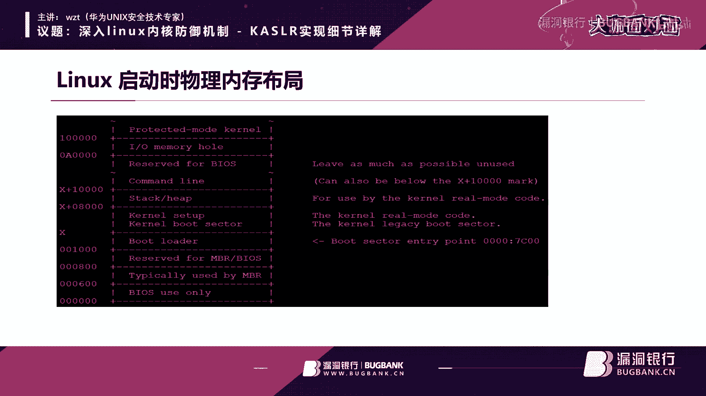
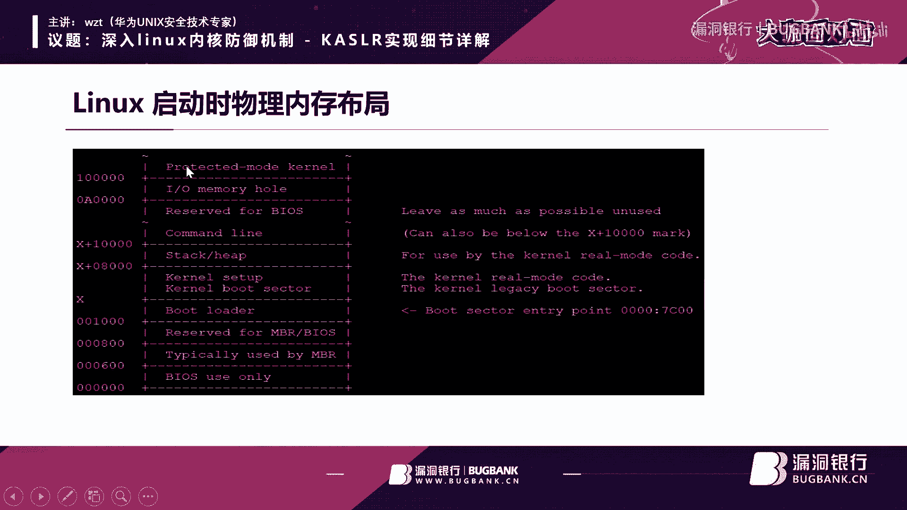

# 课程 P1：深入 Linux 内核防御机制 KASLR 实现细节详解 🛡️

在本节课中，我们将要学习 Linux 内核中一个重要的安全机制——内核地址空间布局随机化（KASLR）。我们将从基本概念、历史背景讲起，逐步深入到其实现原理、启动流程、符号重定位等关键技术细节，最后探讨其绕过方法。课程内容力求简单直白，让初学者能够看懂。

## 概述

KASLR 是 Kernel Address Space Layout Randomization 的缩写，即内核地址空间布局随机化。它是一种安全防御机制，旨在通过在内核加载时引入一个随机偏移，使得攻击者难以预测内核代码和数据的准确内存地址，从而增加利用内核漏洞的难度。

## KASLR 的历史背景

上一节我们介绍了 KASLR 的基本概念，本节中我们来看看它的发展历程。了解历史有助于我们理解这项技术为何以及如何出现。

KASLR 源于用户空间的地址随机化（ASLR）。按时间顺序来看：
*   **2003年**：第一个实现 ASLR 的通用操作系统是 OpenBSD，它因其极高的安全性而闻名。
*   **2005年**：Linux 在 2.6.12 版本中加入了用户态栈地址随机化功能。
*   **2007年**：Windows Vista 和 Mac OS 加强了 ASLR 功能。
*   **2009年**：NetBSD 加入了 ASLR。
*   **2011年**：iOS 4.3 开始加入 ASLR。
*   **2012年**：Solaris 操作系统加入了 ASLR。

随着用户层防护（如ASLR、DEP）的加强，攻击者的焦点转向了内核。内核漏洞相对较多，且早期缺乏类似防护。

*   **2007年**：Windows Vista 首次实现了内核层的 KASLR。
*   **2012年**：Mac OS X 10.8 和 iOS 6 加入了 KASLR。
*   **2014年**：Linux 在 3.14 内核版本中为 x86 架构加入了 KASLR，主要由 Google 团队贡献。
*   **2015年**：ARM 等架构的 KASLR 在 Linux 中实现。
*   **2017年**：NetBSD 加入了 KASLR。


值得注意的是，OpenBSD 实现 KASLR 的方式与众不同：它在每次启动时，随机地重新链接内核的各个目标文件（.o文件），从而改变函数间的相对位置，这比常见的基址偏移随机化更为复杂。


## Linux KASLR 初探

上一节我们回顾了历史，本节中我们来看看 Linux 中 KASLR 的实际表现。

在支持 KASLR 的 Linux 系统（如 4.18 内核）中，内核符号的地址在每次启动时都会变化。例如，进程创建函数 `do_fork` 的地址在两次启动后是不同的。

```bash
# 第一次启动后查看 do_fork 地址
cat /proc/kallsyms | grep do_fork
# 输出可能为：ffffffff8109b2c0 T do_fork


# 重启后再次查看
cat /proc/kallsyms | grep do_fork
# 输出可能变为：ffffffff8f09b2c0 T do_fork
```




地址变化的部分就是随机偏移。Linux 内核要求加载地址以 2MB 对齐，因此随机偏移的范围是有限的（例如 1024 种可能）。虽然范围不大，但在内核中猜错地址通常会导致系统崩溃，重启后偏移值又会改变，因此暴力破解依然困难。




可以通过在启动参数中添加 `nokaslr` 来关闭此功能。

## Linux 启动流程与 KASLR

上一节我们看到了 KASLR 的效果，本节中我们深入其实现，首先从内核启动流程开始。

KASLR 的实现与内核启动过程紧密相关。简化流程如下：

1.  **BIOS/UEFI**：加电自检，加载引导扇区代码到 `0x7C00` 地址执行。
2.  **实模式内核**：引导程序加载实模式下的内核代码，再由其加载保护模式下的内核代码（一个压缩的内核映像，如 `vmlinuz`）到内存中。
3.  **解压缩**：保护模式内核中的解压缩代码，将压缩的内核解压到内存中的一个**临时区域**。
4.  **随机化与重定位**：这是 KASLR 的核心。
    *   **选择随机地址**：内核通过 `e820` 内存映射表获取可用的物理内存区域，从中随机选择一个以 2MB 对齐的地址作为最终加载地址。传统固定加载地址是 16MB 处。
    *   **解析 ELF 与重定位**：解压后的内核是一个 ELF 格式文件。内核解析其程序头，将代码段（.text）和数据段（.data）**复制**到上一步选择的随机地址处。由于加载地址改变，内核中所有绝对地址引用都需要修正，这个过程称为**重定位**。重定位信息保存在一个特殊的段中。
5.  **跳转执行**：重定位完成后，跳转到新的随机地址处开始执行内核。

所以，KASLR 的两个关键步骤是：**选择随机加载地址**和**进行符号重定位**。


## 符号重定位与 PIE

上一节我们提到重定位是关键，本节中我们详细解释其原理和相关的编译技术。

为什么需要重定位？因为编译器在编译内核时，假设代码会加载到一个固定地址（如 16MB）。当实际加载地址改变后，所有指向绝对地址的指令（如调用函数、访问全局变量）都会指向错误的位置，导致内核无法运行。


重定位信息告诉内核：哪些地方存储的是需要修正的地址。内核在启动时读取这些信息，为每个地址加上随机偏移量（`delta = 随机地址 - 固定地址`），从而完成修正。

为了简化重定位工作，现代编译器支持生成**位置无关代码**。在 Linux 内核中，这通过编译选项 `-fPIE`（Position Independent Executable）实现。

`-fPIE` 如何工作？它将对绝对地址的访问，转换为相对于当前指令指针（PC）的访问。

例如，访问一个全局变量 `total_forks`：
*   **不使用 PIE**：代码中直接使用 `total_forks` 的绝对地址。`mov REG, [ABS_ADDR_of_total_forks]`
*   **使用 PIE**：代码先计算 `total_forks` 相对于当前 PC 的偏移。`lea REG, [RIP + OFFSET_to_total_forks]`；`mov REG, [REG]`

这样，无论代码加载到何处，`RIP + OFFSET` 总能计算出正确的地址。重定位时，只需要修正一个全局的偏移表，而不用遍历和修改大量指令中的绝对地址，效率更高，也是实现 KASLR 的基础。

内核构建过程中，会生成一个 `vmlinux.relocs` 文件，专门用于在 KASLR 启用时指导重定位。

## 如何绕过 KASLR

上一节我们学习了 KASLR 的防御原理，本节中我们看看攻击者可能从哪些角度尝试绕过它。

KASLR 并非无懈可击，其主要安全假设是：攻击者无法获知随机偏移值。因此，绕过方法的核心就是**信息泄露**。

以下是几种可能的信息泄露途径：

1.  **内核信息泄露漏洞**：这是最主要的方式。如果内核存在漏洞，能够将内核地址（如函数指针、数据结构地址）泄露给用户空间程序，攻击者就能计算出本次启动的随机偏移。
    *   **例如**：一个内核模块或系统调用错误地将内核指针通过 `copy_to_user` 返回。
2.  **启动日志泄露**：早期内核或配置不当的系统，可能会通过 `dmesg` 将内核地址打印到系统日志中。内核后来引入了 `kptr_restrict` 和 `dmesg_restrict` 等机制来限制此类泄露。
3.  **硬件侧信道攻击**：利用 CPU 微架构层面的漏洞（如 Meltdown, Spectre）来推测内核内存内容，从而泄露地址信息。
4.  **`/proc` 文件系统**：某些历史版本中，`/proc/[pid]/wchan` 等文件会直接显示内核地址，现已修复。

需要强调的是，KASLR 对于**远程攻击**的防护非常有效，因为远程攻击者通常难以触发精细的信息泄露。但对于已经具备本地代码执行能力的攻击者（本地提权），结合信息泄露漏洞来绕过 KASLR 是常见的攻击链环节。

## 总结

本节课中我们一起深入学习了 Linux 内核防御机制 KASLR。


我们首先了解了 KASLR 及其前身 ASLR 的发展历史，认识到它是随着攻击面从用户层转向内核层而发展起来的重要防护。我们通过实验观察到 KASLR 使内核符号地址在每次启动时都发生变化。


接着，我们剖析了其实现原理：内核在启动解压后，不再加载到固定地址，而是基于 `e820` 内存图随机选择一个对齐的地址。加载地址的改变要求对所有绝对地址引用进行**重定位**，而 `-fPIE` 编译选项生成的位置无关代码极大地便利了这一过程。

最后，我们讨论了 KASLR 的局限性。它的安全性依赖于随机偏移的保密性，因此任何能**泄露内核地址**的漏洞（软件漏洞或硬件侧信道）都可能被用来绕过 KASLR。这使得它成为纵深防御体系中坚实但非绝对的一环，需要与其他安全机制协同工作。


通过学习 KASLR，我们不仅掌握了一项具体的技术，更理解了现代操作系统安全中“增加攻击者不确定性”这一核心设计思想。