# P1：【录屏】源代码审查——第十四期大咖黑色镰刀分享 - 漏洞银行BUGBANK - BV13f4y147sf

啊，大家好，我是黑色镰刀。今天给大家带来的是关于源代码审查的一些。算是比较入门的基础。因为我相信大家对黑盒测试，也就是逆向工程周。呃，比较了解啊，掌握的也很多。但是对于原代码审查。

也就白合测试我相信大家应该很少有接触或者学习。今天呢大家来学习一下嗯比较重点啊，需要我们注意的要领，还有一些。呃，我们在审查过程中需要注意东西啊，最重要的是我们在源代码审查需要用到的三种思路。

这个是非常。比较重要的思路啊，算是核心。呃，我们若说若要善其事，必先利其器啊，我们首先要需要选择自呃适合自己的工具。

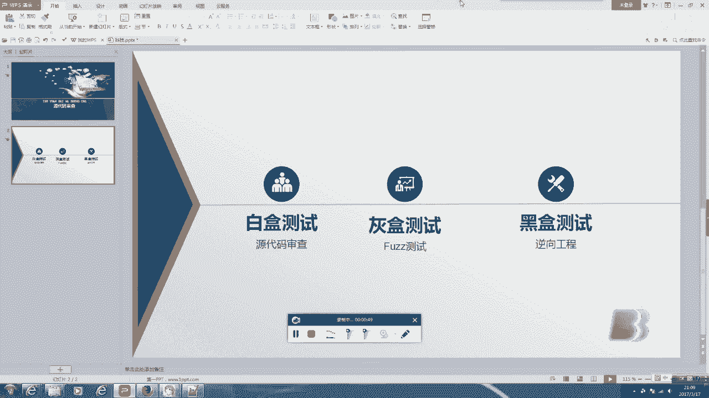

呃，对又。我们要进行的工作，也就是审核代码来说呢，我们需要的并不是说。啊，很复杂工具。比如说我现在给你们展示的这。DW嗯。对于DW来说，它更适合去编写hi time，它并不适合PHP。而对于我们来说。

DW又太过繁重。呃，Z就是一个非常适合编写PHP的一个工具。但是对于我们来说，我们并不是来编写，我们是去审查，而是去看，是去读。所以对于我们来说，我们应该去练去使用一些比较轻量化的工具。呃。

notote pad加加是我认为比较好，而且很多人也在用的一个审查工具。我可以给大家展示一下，这是我打开呃。一会儿我要审查的这个74smiss的一个代码，大家可以。可以给大家关掉，然后。😔，嗯。

大家可以感受一下。啊，可以看到它非常的轻量化，它打开速度极快，而且。也非常方便，它支持的不仅是PHP，还有APjava C等语言，啊，也非常广泛，是一个很好的开源编辑器。呃。

当然除了我们所需要的IDE之外，我们也需要啊一些其他工具。比如说很重要的是。😔，呃，漏洞查找工具啊，这种漏洞查找工具呢，它就相当于我们在黑盒色置里用的漏洞扫描工具。

大家应该知道AWYVS这种类似类似的这种扫描工具吧。啊。

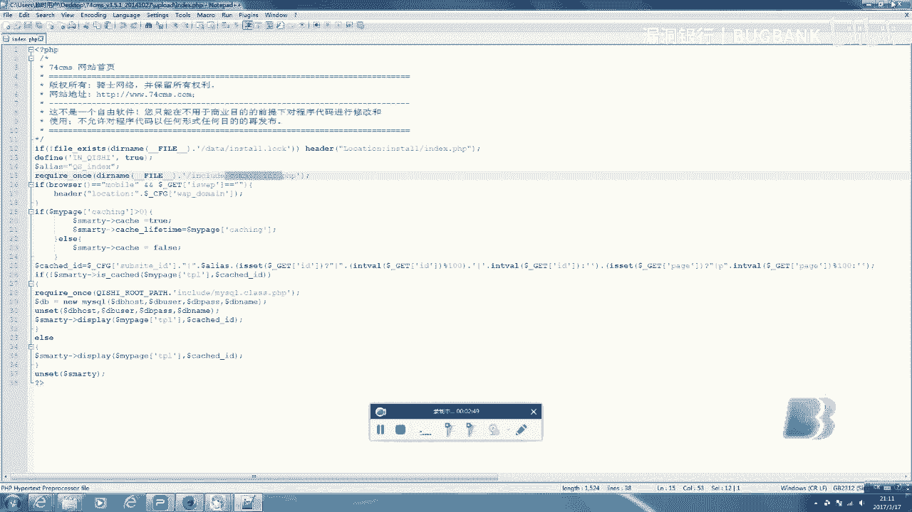

而我们的漏洞查找工具和黑盒测试中的AWYS是差不多的。呃，我们先看一下。呃，实际上这种工具也是还蛮多的啊，但是真正免费的很少。这个呢是我们。阿里云人们经常经常叫他法师是啊。

个人开发的一个工具我认为是非常好。呃，因为他是中国人嘛，所以他开发的工具更趋向于我们国人的使用。大家可以看到，这都是中文的，非常方便。呃，在我之前我有听说RIP。RIP呢IPS是一个非常。

棒的开源的工具，但有一点就它只是更新到了2014年，后来有了IIPS新版本，但是却要。呃，购买。呃，当然还有惠普开发的SCA啊，SCA也是一个很好的商业软件产品。但是既然说到商业那商业间。

那肯定是要付费的。呃，SAA是目前知识最多变成语言的审计软件，它知识的非常多。呃，我记得得有。呃，十几几十个。嗯，我们先来看一下这个。法制给我们。呃，编写的这个软件啊，我们现在新建一个项目。

我们我今天用的是1个74。3。5。1啊，用它来给大家演示一下。嗯。啊，这个有些慢吧。他然这个代码审计工具。呃，当然是要结合使用的。如果我们单纯的扫描的话，我其实个人是不推荐的。呃，E一啊。

也就是刚才说法师啊，他真名叫E1一一编写的这个软件。他。这个原理吧，大概就是说像查找关键字一样。啊。他会查找一些看可以呃，他会查找一些可能会发生漏洞的一些。呃，样子的代码就他就他就像搜寻这些代码。

然后找到这个之后。他就会。提示说这个可能是有漏洞，当然这个肯定是有误报的，他误报的是。

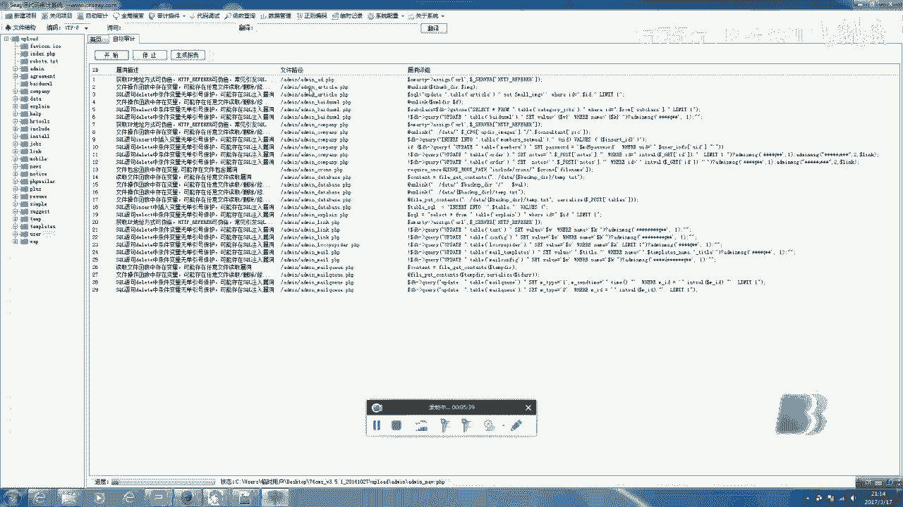

会严重，但是的确是能给我们参考。呃。这种方式我并不推荐啊，一会儿我们再来详细说说他的好和坏。好吧。让我们先避掉他。谢。😔，嗯，所以说这个。呃，就是。漏洞验证的问题。呃。

其实我并不是觉得漏洞验证对我们非常重要。因为漏洞验证就其实就是你发现漏洞要去利用它的一个过程。呃，这个更类似于我觉得大家应该更懂这个。因为这个类似于黑盒测试。呃。劳动验证的，一般我们所使用的工具也是。

大家常用的，别说BS啊，还有fire bug。呃，fire bug可能。大家应应该大家应该有听说吧，他是一个什么呢？他是一个。呃嗯。火狐的插件啊呃当然还有leaveHTP heart啊呃。我们来。😔。

啊，可以看到他这个扫描完了。491个呃数量还是比较庞大的，当然中间会有很多的误报。呃，比较多吧，他们看一个这个。呃，我们现在所使用的方法是我个人并不推荐的一个方法。呃，我一般管它叫纯藤摸瓜。

因为咱们是找到了一个危险的关键字，然后往上找。这个用专业的话来说，叫做敏感函数回溯参数过程。因为很多的函数会有比较。啊，就是关键字嘛特征。比如说此块要植入，我们就会有类似于。嗯。

st insert类似于啊这种吧，这些特征啊，包括什么。呃，叉F呃，忘了叫什么H叉F，还有HCHCI那些。😔，啊，那些比较。😔，常用了。一些容易产生漏洞的那些关键字啊。咱们先看一下这个。这个是说的是。

呃，可以看到他用。他获取了一个。Re some idea。呃，re IDD然后并。但是他这个rere ID它并没有做保护。呃，爷爷说我们是可以注入的。啊，这是很明显的一个漏洞。

其实啊这个漏洞我在之前看过。这个是很明显的，其实它也有做保护，但是这里它并没有使用运用。呃，接下来我呃一会儿我们会讲一个。因为我说的这个方法并不是很推荐你呃，咱们如果就这样单纯的说，我找到了啊这个。

是没有加任何保护啊，同样我们可以用po将它执行一些命令。嗯，因为呃你可以卡。呃，这种方法其实并不好，你看它可以底底下有判断，咱们可以通过这个判断来对它造成注入。但这种方法并不好。咱们虽然找的漏洞。

咱们却对整个Cmiss在。结构的了解不明确，而且我们并不知道这个C密大的是什么样的，咱们只是发现一个漏洞，这样并不是非常的好。呃，下面我们来在我们来深度。呃，去挖掘一下这个。

这个整个的s密我会带大家先去看一下，我们先看一下这个文件。

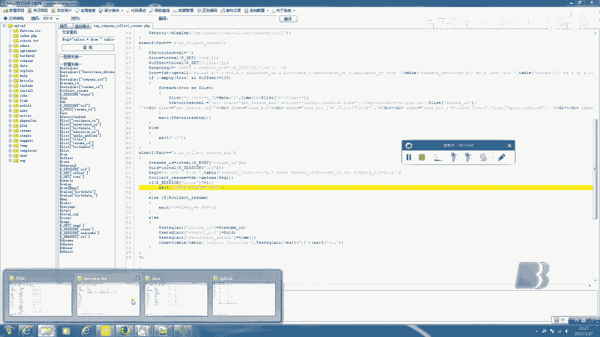

这就是整个文件。大家可以发现说呃这个实际上很多都是英文单词啊，比如说date。钢片这每一个都是。嗯。我们includinging包含包括啊这中文意思。一般我们比较重要的文件都会放到这里。

我们先打开看一个比较重要的文件，我先带大家来看一下，我们用notote pad打开。可以看到他。看这里嗯他是很明显的。这是一个非常重要的一个。嗯，文件它将呃他你看这里它实际上就是摆着。scar这个。😔。

嗯，的就是一个过滤。啊嗯。他这个会把我们传入的变量。过滤掉单也好，双也好，应该还斜杠啊，还有这个对，应该是有斜杠。呃，最基础的。然后这里可以看到是这里过滤的是什么？是一个叉SS跨站的。脚吻嗯。呃。

可以看这里是过滤了一些特殊符号，然后这里是一些关键字。嗯。这就是我们一些比较常见的，还可以看到他内用的是一个黑名单的方式就是。凡是列入的都不可以去输入。当然我其实个人觉得白名单会效果更好。

但然他这个已经非常严谨了。找了一个结渴。😔，啊，我们继续往下读。嗯我看有没有比较重要的。😔，啊，这个是刚才说的XXFF这个。这个有一个问题就是它是可以伪造IP的。我之前写过一张文章。

就是针对吉 cards等伪造IP这个事儿。因为。discard论坛。😔，它是可以爆破的，它利用的是什么？它是锁定IP1个IP只能去登录54。登录5次以上呢，它就会让你停止15分钟。

但实际上你可以不停的登陆5次还一次IP，然后伪装一次IP这样的话你就可以不断的爆破，总会错来密码的。呃，当然好就好了他对这个IP进行了一个。呃。一个过滤反过滤吧，就是。可以看到啊，如果IP不是。啊。

数字点数字点数字点，他就会。啊，否认。哎，为什么要这样呢？因为其实咱们可以通过IP去注入的。嗯，还好的是他防范了这一点。呃，我们接着往下读吧。好，我们可以看到这里这里也是一个值得关注的地方。呃。

square查询统一操作函数这个int啊这个我不太会读。嗯，大多数的sre语句执行都会经过这里。所以我们也要去关注这里有没有会不会它有没有过滤，还是很明显它过滤的比较严谨。嗯。这一下都是vesqui。

这个是最快语句查询。在这个威尔条件的拼接地方啊，我们可以看到这个都用了单引号。后来我们就。😔，这个还是比较长的。😔，呃，我们就读到这吧啊，这个就是比较重要的一个文件。咱们。呃。

咱们平时要去找一些呃呃我更喜欢叫动漫文件，也就是配置文件。我们可以搜索CONFG呃，这个实际上是英文。配置的算一个缩写。但是我不知道为什么，可能我的这个。我在这个下载这个sme并没有，我不知道是为什么。

😔，咱们先读一读这个。首页文件吧ind这是一个入口文件，大家应该都知道。就是首页我们可以先看到它的这第一行。先是判断。他是判断这个锁在不在，然后我可以看。如果没有这个。就是如果你是第一次打开的话。

它会让你去执行一个呃它会让你去执行这个安装程序。然后你会看到他是。引引进了啊引就是引入了这个com。呃，INC点PHP的这个文件，我去找一下，咱们挖掘漏洞，就是就了解它是一个跟进的过程。

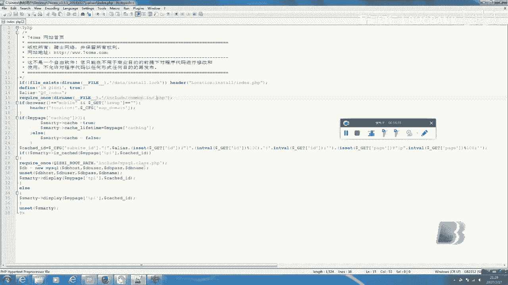

咱们跟进到这个这个文件。也就是这个。打开了。啊，你可以看到看这里他引用了这个CO。jo恩IFIG的这个。就是配置文件，但是我并没有找找到，我可以给大家看一看看。并没有这个文件，这个也是。啊。

这你看他用了这个文件来发来去过滤。嗯。这个。这个能。😔，呃，很简单，这个是他他引用的那个刚才我们看到的那个过滤，就也就那个common fun点PHP那个文件里的那个函数。然后对于这些cookie啊。

还有这个kit。pos都进行了过滤。啊，然后再往下的话，你会发现嗯。这里看他又引他又引了这么一个文件。啊，咱们继续跟进啊，咱们是一个跟进的过程，我们继续找。这里有些吵啊。😔，啊，好吧。系。好的。😔，好。

我们可以看到他。又引了另外一个文件啊，这个文件。我觉得呢就不太想深度，我可以给你们看一下这个文件我大致看了。😔，啊，在哪里？这文件它比较长，它就是一个。嗯。一个映射程序模板类啊。

我们如果继续向下跟进的话，它就会有回到ind的PHP点PHP的文件代码。啊。呃，具体的我也忘了在哪里呃，这个我们就读到这儿吧，因为这个。大致的结构。啊，也都这个框架也比较熟悉了。呃。

我就做一个示例来带大家来带再带大家来感受一下这个过程。剩下的也就像审计这个我刚才这个ind就PHP文件一样了，有一直往前跟进啊，把其他的功功能的文件呢也去读一下。呃。呃。

这个全我呃这个如果你是说要去学习源代码审计呢，你可以去选择一些比较小的程序。类似于开元中国啊中国开源，我忘了那个文章，开元中国还有嗯那那里面就有很多开源的PHB程小程序叫组件，然后再去慢慢的读大一点的。

呃，最后再提升到这种。非常大的sme。因为这么大的一个smiss读下来，当然还是需要时间的。呃，刚才我说的这个。这种方式它的确是效率很高。你会发现咱们读了半天，只读了一个indPHP，但是对于他来说。

他已经找到漏洞了。呃，他速度是很快的，真的我个人并不喜欢这种方式。这种跟适合说，你找着一个漏洞来补贴呃，一扔把漏洞银行一扔嗯。但是我觉得并没有。😔，太大的收获。如果你懂了整个程序框架的话。

你去找其他漏洞，你也会更。呃，了解更懂。对我们要呃应该做到是深入挖掘呃深入挖掘这个。嗯，一个sme。我们刚才已经说过呢是一个叫做。😔，敏感啊。还，一个叫做敏感函数回溯参数过程啊，比较装逼的一个名字。啊。

还有一个就是通读全文代码啊这个。这个通头权代码你要也是经验最重要。也说其实我好多地方也是自己做过站长，然后懂的。比如说打开这个啊整个一个程序目录，你就是要第一眼就能做到说我能看懂一些，对吧？

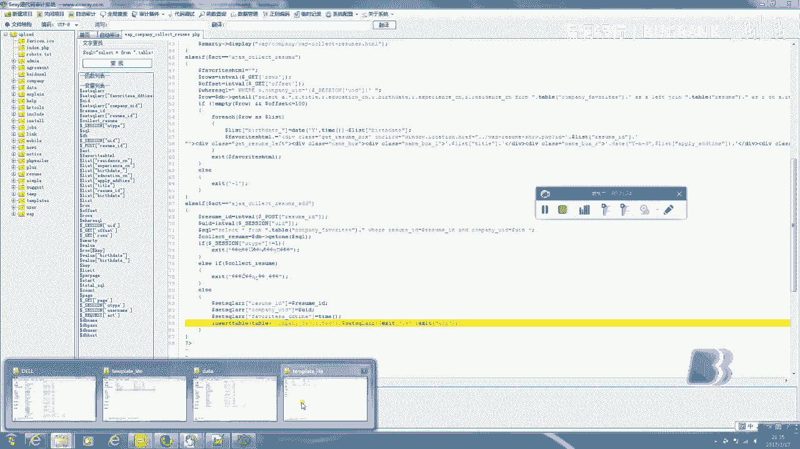

呃，大致的通过经验。能知道比较主要的文件在哪。呃，比如说我们应该都知道ATMNA是这个管理的。但还有很多其他的，比如说。呃，这些。他程序员都当啊，我们都应该知道，我们编程肯定都会对它进行分类和规整。

起名当然是有呃一定原因的。所以说他们就起的这个名字，你应该在磨练出经验之后就能做到眼一看啊，就能知道这么一个大概的我应该去看哪里，我应该去读哪里，比如说这里是安装文件，我们我们应该对吧？去读。呃。

这里也不多说了。😔，然后我呢。说另外一个比较重要的地方就是根据功能点定向审计。黑盒测试的人应该都啊大家都挺擅长黑盒测试的。呃，一般我们黑盒测试都会抓住一些点。嗯。比如说我们会制抓一些输入栏，对吧？

输入框，看看就是那些发表回复的地方，我们会看看有没有夸赞的脚本漏洞，对吧？还有一些机房看有没有注入，对吧？打个单引号，我们都会对这些。比较特殊的地方啊，去测试测试，去审计审计。当然这个方法当然是不限制。

当然不止限制于这个黑色测试，白色测试也是非常重要的。呃，对于。😔，白合测试来讲，我们去找这些功能的漏洞会更方便更简单。呃，因为我们能看到一些代码吗？我们能读懂这个程序要做什么，也能只好通过这个程序。

我们该怎么做，怎么利用这个漏洞。呃，我印象最深刻的是我以前看过一个找回密码功能的漏洞啊，我给大家看一下，我觉得很多人应该也知道这个漏洞。因为这个漏洞是微信啊腾讯微信出的。

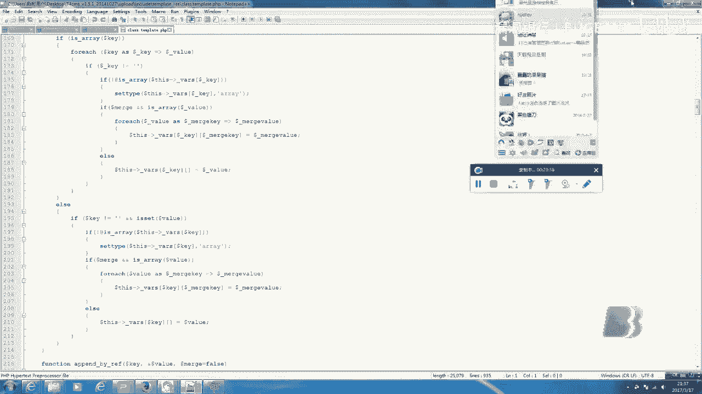

大家可以看一下啊。大家可以看嗯，我在乌云找的很多资料。来，我们可以看一下。呃，他这个就是说啊这里。忘了微信账号和密码，点开之后，他就会要求你输入输入手机号，然后重设的话，他就会给你发一个验证码。

而这个验证码是4位的，他呢也找到了照顾的方法。啊，他发现在。这个凤等于这个电话号码，这号码后码添加不为数字字符就可以绕过限制。所以呢他就利用这个去包破验证码。你看到他也是包破到了马化腾的微信号啊。

也是比常有意思的。应该也有很多人知道这个知名的漏洞。嗯。同样的，还有这种文件上传。其实我觉得文件上传就没有太大必要去说了，他应该也都也都应该也都知道。然我子。呃，就是。那个。😔，我员。😔，呃。

包括补天、漏洞银行都可以常常看到说。呃，文件上传呃，有关文章文件上传的漏洞就是。嗯。那个。就说说一个最简单的嘛，就是什么都可以上传上传，就按这个来说，任意文件上传。咱们就可以直接上传我们的代码了。

这也说实话，这个方面我真的不用多讲，我觉得各位黑盒测试对吧？我们平时提前用应该也都知道，但是我们。为什么说白鹤测试更喜欢这个呢？因为白鹤测试一眼就能看出来。所以说。诶。咱们白河测试可能听起来嗯。

原来马审核是一个非常难啊。呃，一说是源代码审核就过去膜拜。但其实源代码审核也许。

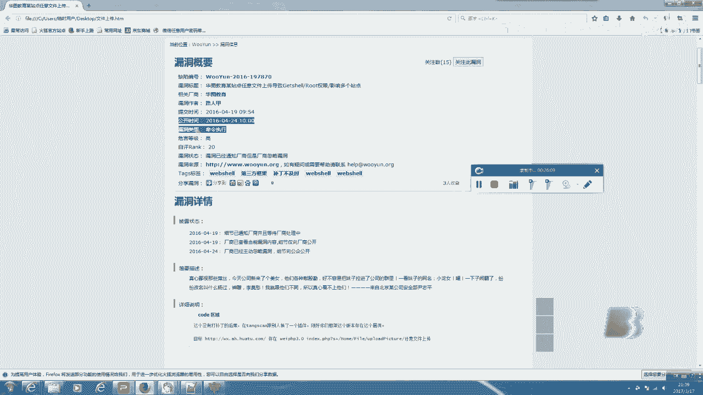

他真的也就并不难，他不仅不难还很简单。他们你说这个任意上传，也许你得试。但是原代码审核你只需要查看一下代码，你就会发现哦，这里没有过滤，这也是一个文件上传，这不仅难，反而更简单。

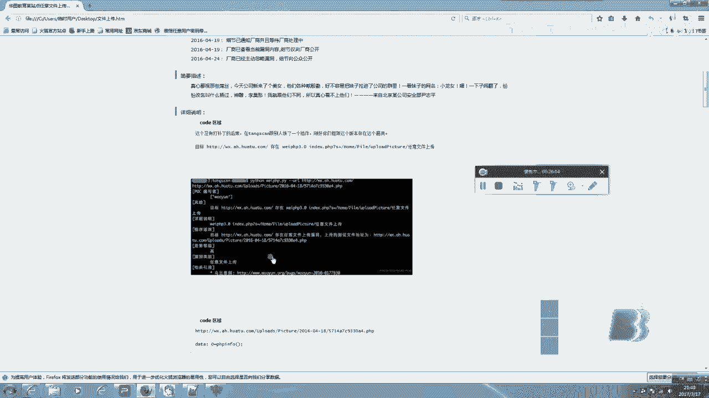

这一个。所以说啊，我真。😔，感觉白鹤四世不仅。不好不是不好，而且挺好的。😔，嗯。除了这些之外，还有很多重要的。地方别说。呃，在这个登录认证。

我们经常我们的认证方式都是基于cookie和session呃这个。我们平时也会用叉SS对吧？打一个cookies。当然呢很明显。啊，是一个错误，因为。cies子当然应该是有限制的。比如说。呃。

时间一长对吧？我们就会cookcicookie的失效，一刷新就可给你取消。当然这种漏洞也就大厂上会要了。小草场一般都不鸟你。类似的这种定功能点就不说了，因为很多地方都会有这种。😔，No洞。啊。

这个思路你要了解，就是你可以去通过。某个功能点。比如说。呃，我拿到了这个7474，也就7士Cmiss，我就去找他的一些比较重要的功能点去看啊。比如说我去看这个注册这个找回密码。

这里的代码去看它有没有错误。这很重要的。这个。这个。😔，知识。就是我说的就是那些比较基础的知识。比如说不管你是黑盒还是白盒，比如说我们拿squire来举例子。呃，不管是黑盒还是白盒，你一定要说。

因为很多人都说比如说。我之前听我的朋友说是面试其他人，然后他们问他们会不会sre注入，他们说会，但是一问squire注入的行成修补，然后一些过程他们就答不上来。对于我们来讲，我们最重要的不是学会利用。

不是学会看，不是学会挖掘，而是真正懂得这个产生。这边有点吵啊。好。这个。

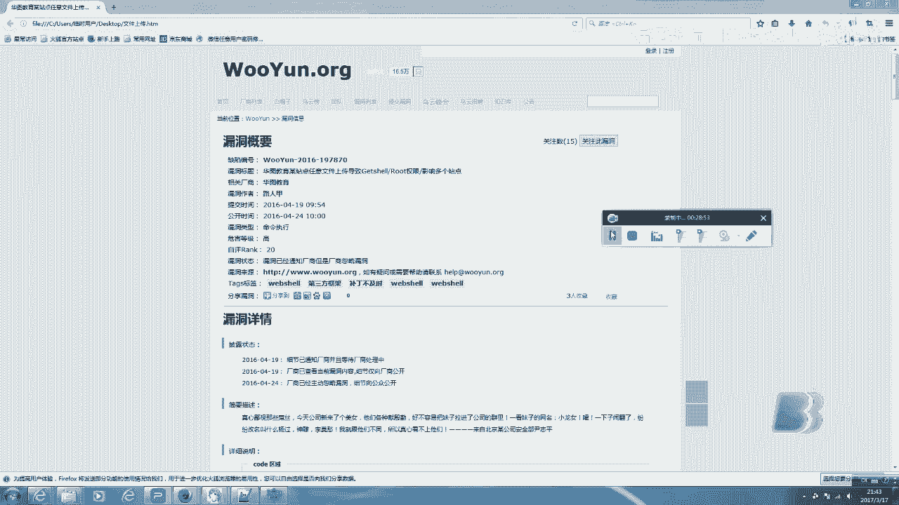

刚才我也给大家看了，说看这个。这样的工具你看可以看到它对square语句。这一些。😔，呃，比较敏感的函数这种搜索。啊，你不能说你看到这个，你就点进去啊，大约知道一下，你要知道这个字花。

你要真正去懂得这个它传输的过程，它是如何形成的。就像我说我并不推荐这种方式，因为你点开之后你并不懂得它整个架构。

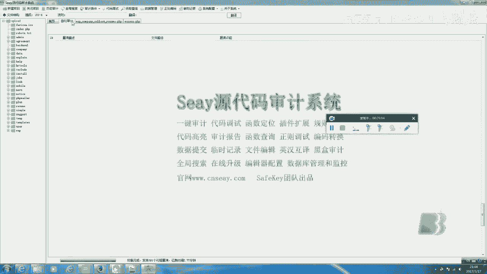

行呃，不仅是。说白盒测试黑盒测试也是极为重要的。你不能说你会用个square map，你就算是。知道磁块珠怎么用，你真正要我们真正要了解的是它如何形成的。我们是一个。我们是一个。

为什么我们说我们和那些脚本小子不同？因为脚本小子他只会利用，如果我们只懂得说去利用这个俗外入漏洞，那我们和小些脚本小子又有什么区别呢？我们重要就重要在于我们必须要懂得它如何形成。然后该如何修复。

我们要懂得整个过程啊，这就是我们说。

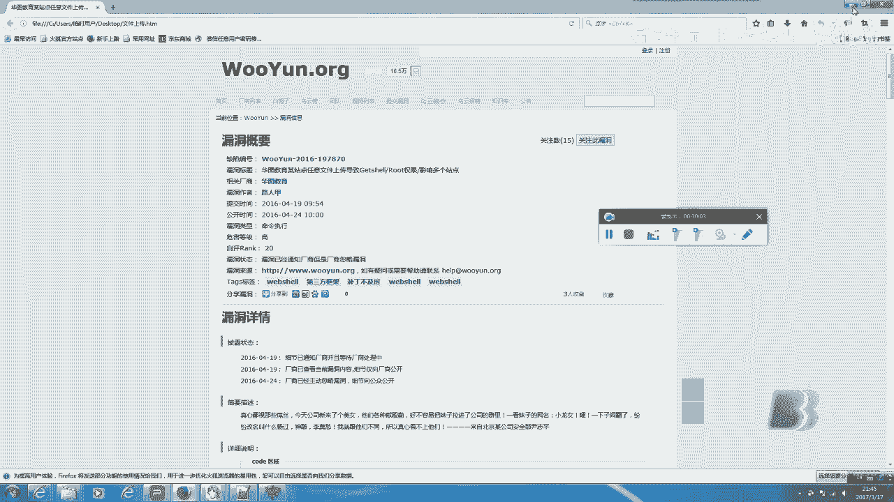

啊。我们呃。😔，和那些。😔，脚本小子不同之处啊。这个今天呢也就是给大家大概说了说这些关于白河测试的一些。比较基础吧，我因为我也不敢讲太深，呃，好多人都很很喜欢黑盒测试，但白盒的比较少是吧？啊。

大家也要多读一读代码，学一学PHP啊。嗯，也感谢大家对我的支持。今天的课也讲的差不多了。呃，那么我就给大家说到这里哈。大家有兴趣多再也去多多接触。也都看看其他人啊这个挖掘的经验对吧过程。好。

也感谢大家对我的支持。那我的讲课就到这里了，感谢。