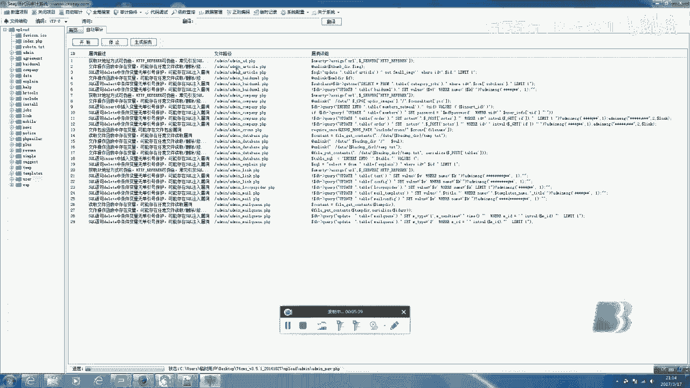
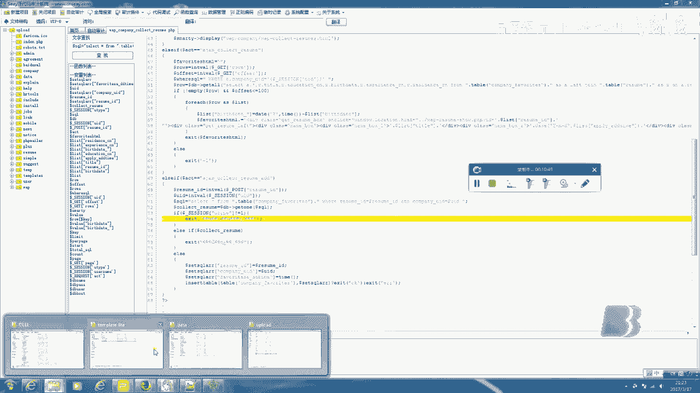
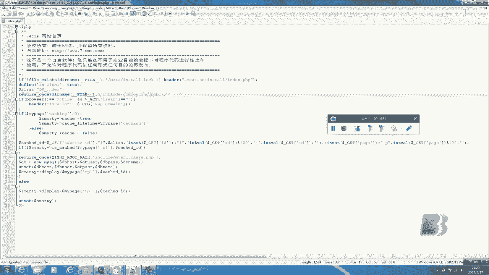
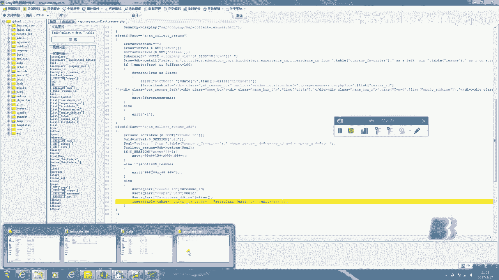
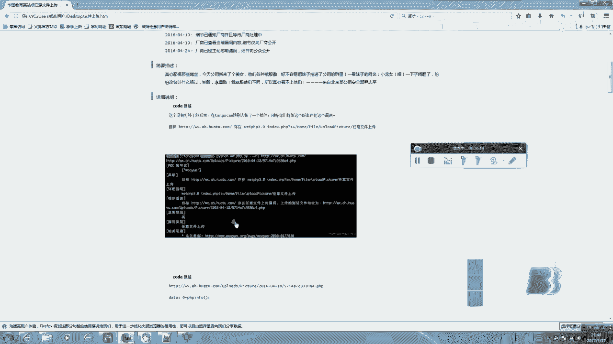

# 课程 P1：源代码审查入门教程 🛡️


在本节课中，我们将学习源代码审查（白盒测试）的基础知识。我们将了解它与黑盒测试的区别，掌握审查所需的工具，并学习三种核心的审查思路。课程将以一个名为“74cms”的PHP程序为例进行演示。

## 工具选择 🔧

上一节我们介绍了课程概述，本节中我们来看看进行源代码审查需要准备哪些工具。


进行代码审查工作，我们需要的并非功能复杂的开发工具。例如，DW更适合编写HTML，而不适合PHP。Zend Studio非常适合编写PHP，但我们的目的是审查和阅读代码，而非编写。因此，我们应该选择更轻量化的工具。

Notepad++ 是一个被广泛使用的优秀审查工具。它启动速度快，使用方便，并且支持PHP、Java、C等多种语言，是一款优秀的开源编辑器。

除了代码编辑器，我们还需要一些辅助工具。

以下是重要的漏洞查找工具，这类工具类似于黑盒测试中使用的漏洞扫描器（如AWVS）。



*   **EeSafe（法师）**：这是一款由国内开发者编写的工具，界面为中文，使用方便。
*   **RIPS**：这是一款非常棒的开源工具，但版本更新停留在2014年。其新版本需要付费。
*   **HP Fortify SCA**：这是一款优秀的商业软件，支持数十种编程语言，但需要付费。

## 演示：使用工具进行扫描 🔍

上一节我们介绍了审查工具，本节中我们来看看如何使用这些工具进行初步的代码扫描。

我们将使用EeSafe工具对“74cms v3.5.1”程序进行演示。这类代码审计工具的原理通常是查找可能引发漏洞的“危险关键字”或特征代码模式，例如SQL注入相关的 `mysql_query()` 或文件包含相关的 `include()`。

**注意**：这种方式会产生大量误报，并且我个人不推荐单纯依赖工具扫描。我们稍后会详细讨论它的优缺点。

扫描完成后，工具可能会报告数百个潜在问题。例如，它可能标记出以下代码存在SQL注入风险：



```php
$id = $_GET[‘id’];
$sql = “SELECT * FROM table WHERE id = $id”;
```

工具提示这里获取的 `id` 参数没有经过过滤，存在明显的注入漏洞。这种方法可以快速找到漏洞点，专业上称为 **敏感函数回溯参数**。

然而，这种方法存在弊端。虽然找到了漏洞，但审查者对整个程序的结构了解并不明确，不知道漏洞在整体业务中的上下文。这并非最佳的学习和实践方式。

## 思路一：通读全文代码 📖

上一节我们体验了工具扫描的快速与局限，本节中我们来看看第一种核心思路：通读全文代码。

接下来，我们将深入、系统地阅读“74cms”的源代码。首先，我们查看程序的整体目录结构。经验丰富的审查者能一眼看出关键文件所在。

例如：
*   `admin/` 通常是后台管理目录。
*   `install/` 是安装文件目录。
*   `include/` 或 `inc/` 通常包含核心函数和类库。

我们打开一个重要的公共函数文件 `common.inc.php`。通过阅读，我们可以发现其中定义了全局的输入过滤函数，例如对 `$_GET`、`$_POST`、`$_COOKIE` 进行过滤，防止XSS和SQL注入。它采用**黑名单**方式过滤特殊字符和关键字。



我们继续阅读入口文件 `index.php`。第一行代码会判断程序是否已安装。它会引入 (`include`) 配置文件 `config.inc.php` 和公共函数文件 `common.inc.php`。

审查代码是一个“跟进”的过程。我们看到 `index.php` 引入了 `common.inc.php`，而 `common.inc.php` 又可能引入其他类文件。我们需要跟随这些引用，逐步理清程序的执行流程和框架结构。

这种通读的方式需要时间和经验积累。建议初学者从开源中国等平台的小型PHP程序或组件开始阅读，逐步过渡到像“74cms”这样的大型系统。

## 思路二：根据功能点定向审计 🎯

上一节我们学习了通读代码的方法，本节中我们来看看第二种更高效的思路：根据功能点定向审计。

黑盒测试人员通常擅长此道，他们会关注登录框、搜索框、文件上传点等位置进行测试。在白盒测试中，这个方法同样适用且更为直接，因为我们可以直接阅读实现该功能的代码。



例如，审查“找回密码”功能。历史上，腾讯微信曾出现一个经典的漏洞：在找回密码时，系统向手机发送4位验证码，但验证逻辑存在缺陷，攻击者可以在手机号参数后添加非数字字符来绕过尝试次数限制，从而暴力破解验证码。

另一个常见功能点是**文件上传**。在黑盒测试中，我们可能需要尝试各种绕过技巧。而在白盒测试中，我们直接查看上传处理的代码，一眼就能判断是否存在过滤不严、未检查文件类型或后缀名等问题。例如，如果代码中缺少对文件类型的校验，就可能存在任意文件上传漏洞。

```php
// 存在漏洞的示例代码
$upload_file = $_FILES[‘file’][‘tmp_name’];
move_uploaded_file($upload_file, “./uploads/”. $_FILES[‘file’][‘name’]);
```

此外，像**登录认证**（基于Cookie/Session）、**支付流程**等功能点也是漏洞的高发区。通过定向审计这些关键功能，可以快速、有效地发现安全问题。


## 思路三：掌握漏洞原理与修复 🧠

上一节我们介绍了针对功能点的审计方法，本节中我们来看看第三种，也是最重要的思路：掌握漏洞的原理与修复。

这不仅适用于白盒测试，对黑盒测试也至关重要。我们不能仅仅满足于会使用工具利用漏洞（如用Sqlmap进行注入），更要理解漏洞是如何产生的。


以SQL注入为例，我们需要明白其根本原因是：**用户输入的数据被未经充分处理地拼接到了SQL查询语句中**。例如：



```php
// 漏洞形成
$query = “SELECT * FROM users WHERE id = “ . $_GET[‘id’];
// 修复方法：使用参数化查询（预处理语句）
$stmt = $pdo->prepare(“SELECT * FROM users WHERE id = ?”);
$stmt->execute([$_GET[‘id’]]);
```

我们要了解不同的数据库操作函数（如 `mysql_query()`、`mysqli_query()`、PDO）、过滤函数（如 `addslashes()`、`mysql_real_escape_string()`）的差异与局限性，以及如何正确地修复（如使用预处理语句）。

这与“脚本小子”的区别在于：我们不仅懂得利用漏洞，更懂得其成因、危害和正确的修补方案，从而具备从根本上发现和解决问题的能力。


## 总结 📝


本节课中，我们一起学习了源代码审查（白盒测试）的基础知识。

我们首先了解了适合代码审查的轻量化工具（如Notepad++）和辅助扫描工具（如EeSafe），并演示了工具扫描的优缺点。


接着，我们深入探讨了三种核心的审查思路：
1.  **通读全文代码**：系统性地阅读代码，理解程序整体框架和流程。
2.  **根据功能点定向审计**：针对登录、注册、上传、支付等关键功能进行重点代码审查。
3.  **掌握漏洞原理与修复**：深入理解漏洞（如SQL注入、XSS）的产生原因和修复方法，这是安全工程师的核心能力。

源代码审查并非遥不可及，它要求我们具备代码阅读能力、对常见漏洞原理的深刻理解，以及耐心和细心。建议从阅读小型开源项目开始，逐步积累经验。希望本课程能帮助你踏入白盒测试的大门。