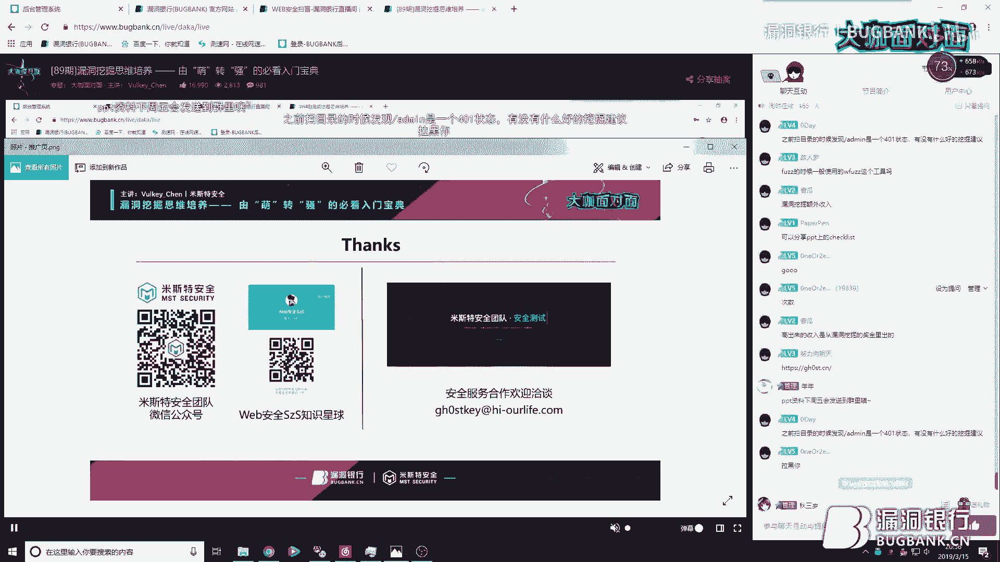

# 课程P1：漏洞挖掘思维培养 🎯

在本课程中，我们将跟随米斯特安全团队联合创始人Vulkey_Chen（K大咖）的分享，系统性地学习如何培养漏洞挖掘的思维。课程将从解析新手常见问题入手，逐步深入到实用的挖掘技巧、工具脚本的编写思路，旨在帮助初学者建立扎实的漏洞挖掘基础。

## 第一章：解析新手的思维与常见问题

上一节我们概述了课程目标，本节中我们来看看新手在入门漏洞挖掘时通常会遇到哪些思维误区和具体问题。

K大咖根据以往培训经验，总结了新手最常提出的三类问题：

1.  **求带心理**：在没有明确理由或目标的情况下，直接请求他人带领学习。
2.  **思路困惑**：不理解他人挖掘漏洞的思路来源，不明白为何自己想不到同样的方法，或不清楚某些绕过技术的原理。
3.  **概念混淆**：分不清“代码执行”和“命令执行”等基础安全概念的本质。

产生这些问题的原因主要有三点：

*   **基础不扎实**：学习过程可能被过度引导，导致思维固化，将安全行业特殊化，缺乏举一反三的能力。例如，将“代码执行”和“命令执行”拆解为“执行代码”和“执行命令”，再理解“代码”和“命令”的本质，就能更好地掌握相关漏洞原理。
*   **心态浮躁**：学到一点知识后容易自满，急于求成，在实际挖掘受挫时容易产生抱怨和低落情绪。
*   **急于求成**：希望快速获得成果，忽略了扎实学习和积累经验的过程。

## 第二章：漏洞挖掘的核心技巧

在分析了常见问题后，本节我们将重点探讨K大咖总结的实用漏洞挖掘技巧。

### 技巧一：漏洞挖掘等于信息搜集

K大咖认为，**漏洞挖掘 ≈ 信息搜集**。挖掘到的漏洞数量与获取的信息量成正比。

信息搜集主要包括以下几个方面：

*   **Whois查询**：获取域名注册商、联系人手机、邮箱、姓名等信息。
*   **Web指纹识别**：识别目标使用的**框架**、**CMS**、**脚本语言**（如PHP）和**容器**。识别框架/CMS有助于寻找历史漏洞或进行源码审计；识别脚本语言有助于判断版本特性、生成针对性字典。
*   **域名资产发现**：
    *   **同备案号查询**：通过网站底部的备案号，查询同一主体下的其他域名，扩大资产范围。
    *   **DNS枚举**：查找子域名解析记录。
    *   **搜索引擎收录**：利用搜索引擎语法（如`site:`）发现域名下的目录、文件等。
    *   **第三方平台接口**：利用各类网络空间测绘平台的API接口搜集资产。
    *   **SSL证书**：从证书中提取关联的域名。

### 技巧二：建立功能检查清单（Checklist）

面对大型网站无从下手时，一份按功能模块划分的检查清单至关重要。

以下是两个行业的通用业务模块及可能存在的问题示例：

*   **互联网行业**：
    *   **登录模块**：撞库攻击、验证码绕过、越权访问。
    *   **注册模块**：短信轰炸、用户枚举。
*   **P2P金融行业**：
    *   **充值模块**：金额篡改、请求重放。
    *   **提现模块**：越权操作、逻辑缺陷。

建议初学者先借鉴成熟的Checklist，在实践中对照学习未接触过的漏洞类型，然后根据自身测试习惯进行增删改，逐步形成个人化的检查列表。坚持按清单测试，能有效提高漏洞发现率。

### 技巧三：关注交互类与逻辑类漏洞

当前应重点关注两类漏洞：**交互类**和**逻辑类**。它们的共同优点是通常难以被WAF（Web应用防火墙）完全拦截。

*   **交互类漏洞**：需要用户交互才能触发的漏洞。
    *   **写入型CSRF**：诱使用户点击链接，从而修改其个人信息等。
    *   **读取型CSRF**：一个更广义的概念，涵盖了通过用户交互实现跨域读取信息的漏洞，例如：
        *   **JSONP跨域读取**
        *   **CORS跨域读取**
        *   **Flash跨域读取**
*   **逻辑类漏洞**：由于业务流程设计缺陷导致的漏洞。上手相对简单，通常只需使用Burp Suite等工具进行抓包、重放和参数修改即可测试，例如越权访问、薅羊毛等。

### 技巧四：深入案例分析与思路解析

以下是几个具体的漏洞挖掘案例，展示了如何应用上述技巧和思维。

**案例1：JSONP跨域读取漏洞**
发现一个带有`callback`参数的URL，其响应格式类似于`test({“user”:”data”})`。通过构造一个恶意页面，先定义`test`函数来接收数据，再通过`<script>`标签引用目标URL，当受害者（已登录状态）访问该页面时，攻击者就能跨域获取其敏感信息（如用户名、手机号）。

**案例2：业务逻辑漏洞（积分薅羊毛）**
一个APP分享链接给微信好友，好友点击后分享者积分+1（可兑换现金）。攻击思路：
1.  用A账号（APP）分享链接给B账号（微信）。
2.  B账号点击链接时抓包，找到使A账号积分增加的请求。
3.  分析该请求，删除Cookie等身份认证信息，仅保留必要的链接ID参数。
4.  批量获取大量分享链接ID，用脚本构造请求，实现给A账号批量增加积分。

**案例3：空白/错误页面的深入挖掘**
遇到404、503等错误页面不要轻易放弃。
1.  尝试端口扫描，发现开放的Web服务。
2.  如果已知站点使用JSP，则用JSP字典进行目录扫描。
3.  可能发现未授权的管理接口（如`room.jsp`），从而获得漏洞。

**案例4：参数模糊测试（Fuzzing）**
发现一个获取用户凭证的接口，响应为JSON格式但无参数。尝试添加`callback`参数未果。通过观察网站其他请求，发现参数均为大写字母。于是将常见的参数名（如`userid`, `login`）转换为大写后进行模糊测试，成功发现`LOGIN`参数存在越权访问漏洞。

**案例5：参数修改与删除测试**
*   **修改**：在请求中发现`${userPin}`占位符。推测后端会读取该变量值（与当前用户关联）。尝试将其替换为其他用户的用户名，成功越权修改信息。
*   **删除**：
    *   发现一个获取WiFi密码的请求，删除Cookie后仍能成功，存在未授权访问。
    *   发现修改手机号的请求，其`token`和`aid`参数做了校验。删除`token`后请求仍有效，但`aid`与用户绑定无法修改。此时可考虑结合读取型CSRF（如XSS）先获取受害者的`aid`，再组合利用，提升漏洞危害。

**总结**：漏洞挖掘需要**敢于思考和实践**。在遇到瓶颈时，多尝试“这里能不能改？”、“那里能不能删？”，保持耐心和细心。

## 第三章：DIY技术工具与脚本编写思路

掌握了核心技巧后，本节我们探讨如何通过编写工具和脚本来提升漏洞挖掘的效率和深度。

### 子域名处理与资产测绘工具

手工处理大量子域名效率低下。K大咖分享了自己开发的工具思路：
1.  **目标导入**：输入主域名。
2.  **解析与端口扫描**：将域名解析为IP，并对IP进行端口扫描（使用`nmap`）。
3.  **URL生成与探测**：根据开放端口（如80, 443）组合成URL，并发起请求。
4.  **信息提取**：从响应头中提取**框架**、**CMS**、**脚本语言**等信息。
5.  **网页截图**：辅助判断站点功能。
6.  **内网资产识别**：识别解析到内网IP的域名，这类资产在SSRF等漏洞利用中可能有奇效。
7.  **报告生成**：生成包含截图、链接、状态码、响应头的HTML报告，便于后续人工测试。

### 基于Burp Suite的字典搜集插件

介绍了一款由团队师傅开发的Burp插件，用于自动化搜集和整理字典。
*   **功能**：从Burp的Proxy历史记录中，自动提取**目录**、**文件名**、**参数名**，并存入数据库进行统计（出现频率）。
*   **配置**：
    *   数据库连接配置。
    *   黑白名单配置：可过滤掉`.js`, `.css`, `.jpg`等静态资源（黑名单），或只收集特定域名的数据（白名单）。
*   **目的**：长期运行后，可以从数据库中导出高频出现的目录和参数，形成高质量的个性化字典。

**核心思想重申**：漏洞挖掘在某种程度上就是**模糊测试**，测试对象无非是目录、文件、参数、请求头。拥有强大的字典和半自动化工具，能极大提升测试覆盖率和效率。

## 课程总结与问答精选

本节课我们一起学习了漏洞挖掘思维的培养方法。我们从剖析新手常见问题出发，强调了扎实基础和良好心态的重要性。随后，深入探讨了以**信息搜集**为核心、**功能Checklist**为指南、重点关注**交互与逻辑漏洞**的挖掘技巧，并通过多个案例解析了实战思路。最后，介绍了通过**DIY工具脚本**（如子域名测绘、字典搜集）来赋能挖洞过程的方法。

在后续的问答环节中，K大咖对一些关键问题进行了补充解答：

*   **关于SRC**：熟练后可以通过挖掘SRC漏洞获得可观收益，但持续学习至关重要。
*   **关于扫描器**：在未授权测试中，不建议使用主动扫描器，以免对目标业务造成影响或引发法律风险。
*   **关于学习**：推荐通过安全社区（如先知、安全客）、技术博客、高质量公开课持续学习新知识。
*   **关于心态**：避免总是自称“菜鸟”，这可能会形成消极的心理暗示。应保持自信，多交流，多实践。

最后，K大咖建议初学者注重基础，灵活运用搜索引擎，并在实践中不断总结和优化自己的方法论。漏洞挖掘既是技术活，也是耐心和细心的考验。