# P1：【录屏】漏洞挖掘的奇招-安全检测中的特殊案例分析与总结——大咖王骕 - 漏洞银行BUGBANK - BV1i64y1D7oa

。Yeah。Yeah。为知识而存，因技术而生，小伙伴们，大家晚上好，欢迎参加漏洞银行信息安全技术讲座大咖面对面第4期，我是今晚的主持人宁念。😊，今晚嘉宾是年纪不大。

挖洞经验却很丰富的大咖太子带来主题为漏洞挖掘的奇招安全监测中的特殊案例分析与总结的演讲。今晚太子会为大家分享自己挖洞生涯中那些特殊漏洞的奇思妙想和经验总结。本期直播分成三个环节，首先是太子的主题演讲。

接着行长问答环节留时间给大家提问，最后就是大咖赠书环节。太子会选出一位最认真听讲的观众，宋书黑客与画家，大家可以认真听讲，踊跃提问，争取机会。好，那规则就说到这里，下面有请太子开始今晚的讲座吧。

Yeah。嗯，各位挚爱漏洞银行亲爱的小伙伴们，大家好，我是本期漏洞银行大咖面对面的嘉宾。我的往来ID是coran prince。我的本名呢是王速。

今天我希望进行一起分享的主题是漏洞挖掘的奇招安全检测中的特殊案例分析与总解。😊，嗯，我目前就职于华宇繁星科技有限公司，我的职位是首席安全官CSO。同时我在湖南科技大学就读。在个人方面呢。

我可能是在百度新浪网易搜狗这些一些著名企业SRC中排名过前十。然后乌云三0领域中，我通过一些努力，其实了很多在安全领域，有着不同安全研究研究点的小伙伴们。

而我们公司目前呢主要是呃我主要负责旗下安全实验室的发展。实验室目前研究点，包括与安全零队的最新分析以及创新安全创新安全产品开发。创新安全呢，比如是硬件方面。

我司最近推出了车辆安全防护产品车保这是车内的提供了呃实时的漏洞防御。因为我们看到比如是一些特斯拉等等特斯拉等等新品牌的车辆遭到了破解，以及一些防止信息信息劫持。

然后等等还有信号等等问题的一些一个车保产品。另一方面呢在安全平台方面，我司推出了牛顿信息。全国方展示系统，这是一款可能是只是在某一个点上有一些突破的一个系统。

但最终呢它完成它很好的嵌入到了信息安全教育普及的一个体系中。目前在国家一些部门以及政府的一一一及一些高效的。😊，嗯讲授课评课程讲授中也使用了我们这套系统。然后所以呢可以看到。

作为对于技术追求只着追求的白帽子来说，在摄试测试中，我和我的团队都遇到了很多特殊的有趣的漏洞。这次演讲呢也是我们对过往安全检测中的特殊案例的发现和解决过程的一次分析和总结吧。😊。

子为大家在未来安全检测中另辟蹊径，找到陆茸挖掘的奇招，提供一份帮助。嗯，我想首先我想说奇招是什么？是大牛们的天赋之财吗？还是中彩票般的偶然？😡，首先我练了一份基本的齐招公式。希望呢能够以此为主线。

和大家一起分析不同奇招的真面目，以及不同奇招的来源。比如我有这样一句话，就是任渠哪得心如许，唯有源头活水来等等。我们看一下这是它的源头。这其中包括首先是包括运维加安全，是一份7招。

数据分析加安全是一份齐招。漏洞结合加安全，也是一份奇招。而积肋呢也会造成一份奇招。另一方面呢是豆腐渣工程的分析，加上安全，是一份奇招。最后呢是GTF加配套N档是一份奇招。嗯。

当然我这里只是罗列了一些最最突出的一些点。实际上呢奇招来源无数。我们也希望能够和大家在之后的PPT中深入探探讨吧。那具体这些公式应该怎么解读呢？其中有哪些因素构成了这些公式的奇巧之处。

请大家关注稍后我在一起分享中的案例和总结，一节分享结束后呢，期待与大家在QA环节，我们一同进行一个深入的交流，一起研究。第一个部分呢，首先我们来看一下公式运维加安全等于7兆。我们来看一个案例。

在一次RFI，也就是远程命令远程文件包含漏洞的利用中，我们找到了一个链接。当获许这个含有BUL参数的链BRL参数的链接时，我们使用呃大家可以看到这个BL就是很常见的，比如呃另一为URL跳转漏洞。

任一文件读取漏洞，都会看到这个URUL参数等等，就是很明显的一种一些提醒吧。然后我们尝试使用一个最安全的HPT点百度点com的一个文件的进行远程文件包含啊，百度啊大家都懂呃，是挺安全的。然后呃测试。

但是去其示我们页面不存在。那么也就是说我们这个文件包含现在当显日是失败的。然后我们如何进一步测试呢？我们是。形供这样一个想法，我们首先尝试了过往的一些渗透设施，一些绕过的思路。比如呢珍规当，比如。

我们遇到过这样的过滤方案，这样一个函数，通过srange replace这样一个函数呢，将原本的HTP或者HTPS访问请求替换为空变换为空no。然后这样的话造成对无法对外进行一个命令的请求请求的提供。

导致然后成功的呃然后进行了过滤。对于这样的文件呢，我对于这样的过过滤。我们通常会尝试自符编码呀，或者是一些其他形式来绕过开发者对输入字符串的过滤。然后也是尝试了过往的一些案例，一些一些数据库。

一些我们的漏洞数据库。然后尝试过后依然无法远程保案成过。你就是说我嗯我们这些这个思路可能是失败的。但是我们也确定了一个主要的研究点。那就是我们要研究如何呃我我们确定了绕过开发者做字符替换这一入手点。

作为我们的研究点了。然后我们开始了一个成员之间的头脑风头脑风暴。这时呢团队一位做运维的伙伴提出了这样一个想法。呃，这位成员是呢是做运运维的，他有运维一些呃大概有56年的经验。

然后也在一些呃国企进进行个共职，然后目前正在对我们安全团队中也在F也在和安全进行一个交融嘛。他提出了这样一个想法，可能呢是对访问的域名或IP地址进行了特殊处理嘛。比如说是呃可能将点等特殊符号进行了过滤。

嗯，然后因为我们知道在IP或者域名中呃，这个点号point是非常敏感的，很多时候呃通过他才能进行一个URL的识别。由此呢我们根据这样的一个思路吧。然后。

将要远程将要包含的远程文件所在的服务器IP地址转换为了值。最终呢我们通过看可以看到图文文档中的这样一个文PPT中这样一个形式。我们要原本的嗯百百度百度点com。百度点comT。进行了一个替换。

变成了一串。20001459789，然后加上robo点TST的一个呃1个URL。最终呢我们成功的完成了远程文件包含。也就是说我们成功的进行了漏洞的绕过。那么我们玩如何想出这个思路呢？在运维的测试中。呃。

在运维的测试以及及应应急检测中，为了提高效率以及存储，公司负责运维的伙伴们更喜欢将比如6加2。168152这127。0。0。1这样的本地或者内网或者内网的IP地址如换为1进制。

这样他可能在输输入以及存储上可能会更便捷一些。嗯，比如我们可以我们可以我们我们可以看一下，比如这个2130706433。这个正常是我们正常来执行一个拼拼拼命。😊。

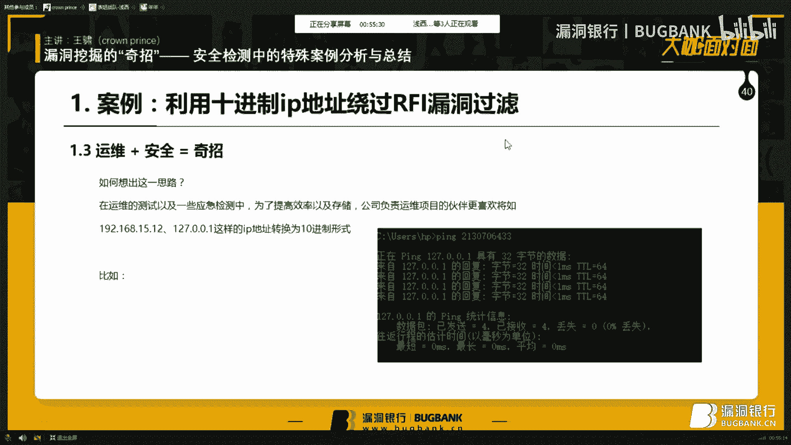

2170706433。嗯。我们背错了，所以就是说这这也告诉我们一个问题，需要认真的。对待渗透测试，然后2130706433哦，我看一下。213213070433706433哦。

我们看到成功的拼取了我们的本地IP地址。而之前那个2170呢也是拼了1个IP地址，说明通过这样的十进制的形式，可以对应到一个正一个专属的二进制。呃，专属的呃。

通过类似于五元组这样的五元组织五元组单项的这种形式的一个IP地址吧。然后。

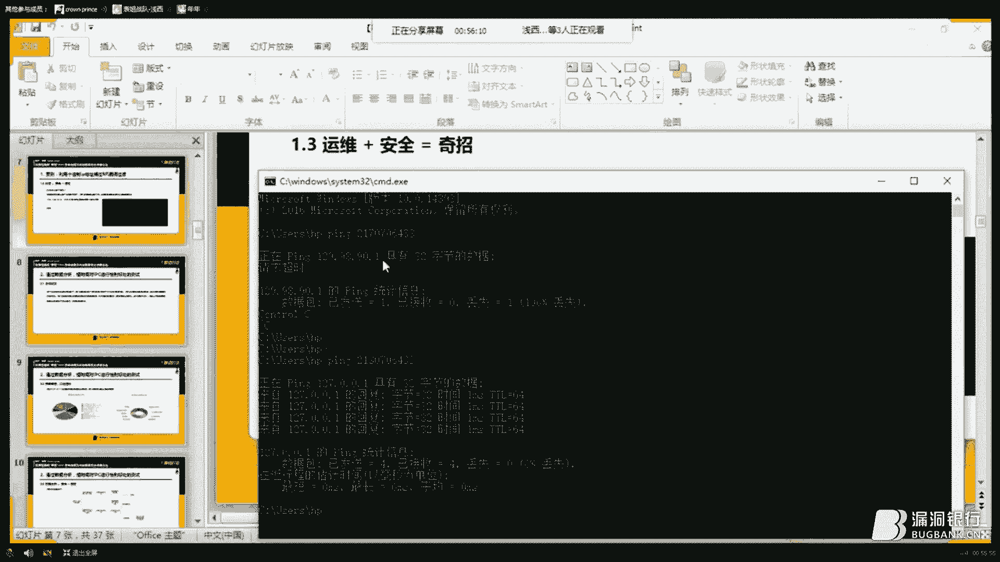

呃，所以所以呢通过这样的一个十进制的十进制的转换绕过，我们成功的绕过了开发者所执行的FI与。然后其实呢这里有另一种想法，在本次演讲最后，我会再次讲解这个漏洞。呃，基于目前呢通过运维与安全的一次结合。

我们构想出了一则启招。然后我们再来看第二个部分。对于乙方公司来说，天下故功为快不可。这句话虽然有些片面，但确实呢也是甲方选择乙方的因素之一。因为对于甲方来说，我需要你在最短时间完成最好最好的项目。

你完成的快。那么我认为你就是好的嗯这一次紧张的渗测试中，我们虽然是以常规的外部平台作为主线嘛。就是说我们主要都是去做外部测试以内网等等。但是我们需要额外对厂商放在外网的一批IPC进行安全检测。

IIPCIPC是网IP，就是网络摄像头的缩写。我们比如之前看到很多网络上曝光的IIPC摄像头的一些基于RTSP等这样的远程远程放远程的信息泄露和视频查看漏洞都是。I p c 即系外网嗯。异常配置引起的。

然后为了让为了在这次实IPC检测中，实验的花费更加有效，更好的呢在时间限制内完成任务，也让我们就是说体现的更加专业一些嘛。我们呢通过对。网络上披露的漏洞进行了一次数据采集。

利用这些现有资源结合摄像头的特征进行了数据分析。而我们梳理出了在安全检测事项后过程中中的应该重点特殊关注的漏洞。嗯，比如这样在分析了15到17近三年的互联网摄像头漏洞后，我们大致可以得出一个这样的结论。

我们可以看到我们分析中会涉及到各个漏洞在这三年中出现的比例，比如是15。2的端口匿名访问漏洞，以及外部状库攻击拒些服务以及一些其他漏洞，就是可能是呃IPC专属的一些嗯，比如说对固固件的一些分析了。

然后一然后会有这样的一些统计图。然后我们举个例子，比如呢嗯命令执行漏洞，也就是。漏洞。那么在IPC安全中占比最大。那么也就是说在同类厂商或者是说呃同一厂商中。

IPCIPC的安全漏洞是呃C漏洞是发生在IPC中是很敏感的。所以呢如果我们检测时更侧重于命令执行漏洞的就是模糊测试。但那么是我会效果更好的。比如我们去一个小时的入口令和一个小时的命令执行。

哪一个更合适呢，对吧？然后当然这只是片面的。呃，最终呢我们是会结合漏洞的危害，之后有个明明确的文档系数和和漏洞的这几年占比综合呢做出一份分析，做好做更好的一个分析。然后建立了比如说是这样的一份流程图吧。

我们可以看到，对于深侧重于IPC我们会更侧重于它主机类一端口检测。然后会执行一些入口令，进然后深入命令执行，然后基于命令执行时候呢，会同时测测一些拒绝服务漏洞。

所以很多时候呃IPC我们发也是在梳理过程中发现的IPC的拒绝服务中对命令执行的失败造间接造成的。然后呃以及一些提全等等。我们建立了我们的扫描器规则，最终呢通过合理的检测方案。

我们为厂商的众多摄像头进行了最优化的最优化的检测。然后也是很满意很为厂商提供了满一份满意的答卷吧。😊，嗯。😊，然后我想说，为什么我们敢这么做数据分析呢？这样我们就得谈到28定律了。😡。

28定律呢怎么说呢？28定律又名8020定律哦，也叫帕雷帕雷托法则。帕雷特定律帕雷特定律哦，可以叫英文名比较高大上一些。然后他比较直白的表述呢就是最省力的法则，最省力。我基于28定律有这样的两个理解。

理解一是在任何一组东西中，最重要的只占其中一小部分，又是20%。而其余其余80%，尽管它占比看似很大，它对于我们的需要来说确实次要的。另一个理解是呢，在总投入中总有20%入，可直接换来80%的收益。

而另外的80%投入可以让我们的投收益得到分之百，但是也仅有20%。那么在时间因素下，也许是20%的投入，是我们更加关注的。这样的两个理解是两个层次。但都解释28定律是有效性。之前在猪猪侠等等。

他们在物蜘蛛侠前辈们在物云上也有一些有过句域的说明。然后28定律率这样其实在我们生活中在渗度测试中已经有过很清晰的一些案例了。呃，比如重户攻击，大家可能会想到。

我们重户的时候经常会使用的是top500或者常用中文命的类型落口令，而不是大字典。很多时候我们并不是说看到一个确实验证端口，或者可以绕过验证端口，我们是想尝试一些常弱口令。而不是说我直接上几百G的。

或者甚至几泰币的那种大字典尝试一下重户了。所以呢。嗯，另呃所以呢这是二8定律在重攻击中的一个很好的体现。另一方面呢是早描细扫的规则。比如绝大多数的扫描器呢，会将主要漏洞放置于检测队列的前方。

比如思Q入入叉SXSS这样的漏洞。我们很少看到，比如说日些流漏扫描器，我第一个检测一种很特殊的DOS就远程。继续服务漏洞很少吧，一般都是会检测一些更常见的漏洞，然后进行进进行一个排序。

另一方面就是在我们这次渗透测试中的一个按应用了，它就是实际渗透测试中的途径梳理。嗯，G于28定律加上合理的数据分析，可以让安全检测之路的短期收益最大化去优化。所以呢这就是我今天要说的第二个渗透测试公式。

数据分析加安全等于渠道。而加上那些前呃名人的前辈们进行了一些定律和数学以及等等的综合，让数据分析更加完美，加上安全，那么就更是一份非常完美的火花，更是一份经典的奇招了。第三个环节，漏洞组合选。

我们经常会看到很多呃。嗯，很很连贯的一些深度测试环节，深度深度测试攻击，这也是在电影上的很成电影上很喜欢的一个过程。那实际渗度测试中呢，我们也有很多这样的很很连贯的一个漏洞组合吧。

比如我们来看这样的一个案例，有。😊，我们看到部分厂商使用的是同类的管理系统，比如说是10086哦等等这样的呃大大厂商，大的通讯互联网厂商，他们对各个省市。

比如上海、深圳、长春等等这样的城市都会有各自的平台，但是平台的系统架构都是很相似的。再一次试用测试中呢，我们也发现了厂商的网站群下，有两个类似的管理系统。他有这样同的登物地址，他们有很相似的登录地址。

其中一个呢是有验证码的，我们称之为系统2，不要为什么不要问我系统一和系统零是谁？我很想称来为系统2，因为它是我们很希望的一个目标，希望二一点更好一些吧。另一个呢是没有验证码的。我们好吧。

命名为统绝大多数情况下，我们会认为有验证码的系统2敏感度更更高，最会存放更重要的信息，这是开发者角度会去考虑一个问题。也是兵家预争之地。那我们要如何攻陷这个兵家御政之地呢？我们进行了这样的尝试。

通过状库，我们进入了系统一。在系统一的后台呢，当然虽然是一个简很很小的权限，但我们进入了后台。在后台中，我们找到了sco注入漏洞。经过sco注入漏洞。我们获取了该系统的账号密码。

这样的一个通用的管理员账号密码表。我们在在一个密码表中，账号密码表中找到了一个类似于仿佛是这个这套系统的通用的大权限账号密码。我们进行了破解。最后呢我们用这个成功的用这个通用的账号密码。

进入了我们真正很想攻入了系统2，就这样在拆东墙的时候，我们黑了西墙。这是一套漏用了双方双向，这是一套横横向路横向的。分开的漏洞的组合。接下来我们来看一次纵向的漏洞组合。嗯。

这是一个非常知名的呃开发开发教开发教育平台呃，编程教育平台。我们对他进行我们就和和对方的成呃，对方平台的管理人员进行沟通后，进行了一次测测容测试。我们找到了一个可以的叉SS点。

可以看到我们在我们很热心在叉SS的时候，顺便回答了对用户的问题。然后。在这次叉我们执用叉SS之后，我们可以看到了这样的注入效果并不是很明显。嗯，因为我们看到了并没有开始语句的。PSS语句的暴露。

而只而正常的执行了我们想要输入的文本。呃是不是插入失败了呢？不是脚本自我删除了。我在我们自己搭建的叉S平台上嗯。找到了这个叉S的请求这个对方携带ook请求我们的一个证明说我们可以这么这么分析嗯。

在我们叉S平台上确实受到了外部ook这份漏洞的成因我们推断是脚本执行一次之后自动删除了。叉S语句自身脱离了HML的因此我们可以成功的完成拿到ookie之于这么分析呢，我们要提起这份漏洞的来源了。

这份漏洞呢来源是我们实验室的一位叫做冯仓的大牛可能做前端的小伙伴们会听过他的名字，他是做他是做开发，做前端这方面的一个很强强的很强的朋友吧。然后他是是以一一个开发者的角度行了这次一个漏洞挖掘。

因为安全团队中有时候会手痒，说我也来做一次安全尝试一下。然后但是呢都分析到这里，我们不要高兴太了。因为如果是这样的话，我们标题就不是说漏洞组合也不是混合利用了。接下来呢我们就涉及到了第二个成功原因。😊。

私 fixation老度。首先呢我为我为大家引引申一下漏洞吧。那是绘画固定漏洞。我们直接说中文吧，绘画绘画固定漏洞。

出现该问题的主要原因是登录控制使用的固定使用固定的 ID就是我们常见的那个绘画I登录线已登录后的绘话ID是一样的。这样就使得攻击者可以简单的伪造一个绘画I又使用户使用该绘画I登录。

比如呢我们第一步呢会是这样常用登录过程中，第一步是这样的，通过给被攻击用户一个伪造的绘画I然后绘画I被攻击被攻击用户使用了该绘画I登录。安全研究者等到被攻击者被攻击用户登录后。

我们的这个绘话ID已成为登录状态。这时呢安全研究者安全检测者们伪造自己的请求，成功的访问的登录后的访问了被攻击者的登录后的资源，这样就结识了对方的身份了。这样呢我们可以看到。

虽然呃网上的开发者考虑到了叉SS做过了叉S，然后导致了我们的数据HPCon，然后使有我们叉S的获取并不完整。但因为结合非的。s fixation漏洞，我们成功的完发现只需要掌握了一个cookie。

就可以成功的登录到了登录到了被攻击者的呃账户权限上。因此我想说的是，当思扣注入漏洞以及叉S等典型漏漏洞不再容易挖掘时，漏洞结合不加安全，我也会成为一份奇招。未来的信息安全教程将仿佛一本功夫秘籍。

通过连接每一步招式，构造出属于各门各派的独家选法。这也就是我今天想分享的给大丫的第三则奇招公式吧。接下来我们再谈谈人生吧。😊，聊一聊那些难忘的那些年的渗斗测试瞬间吧。

我想大家在渗斗测试中经然会有这样的心理变化。一整天无限的测试，无限的挖掘都没有发现漏洞。然后到了很晚的时候发现了漏洞，然后很。😊，就看到了scool注满屏的红色，然后我也看到了叉无无耻的拦截。是的，嗯。

比如在school map等工具中，我们很多时候会遇到这样的一类scho注入检测慢连接受阻，查询到数据库后获取不到表面的深入信息。这时候我们一个思路呢是转换成手工测试。

另一个思路呢是也许我们可以停下脚步，仔细的端详一下当前的这些当前我们拥有的内容可以为我们带来的帮助。😊，比如呢在一次渗度测试中，我们通过了发现网站数据库的前缀，通过推断的前缀。

我们推断出了网站管理员系统的账号密码，它的一个格式和一一个主要主要架构。所以呢最终虽然没能进一步的深入思思Q输入漏洞。但因为推断出了账号密码，也让思Q注入，为我们提供了莫大的帮助。

成功的完成了我们安全检测。另一方面呢也是告诉我们一个问题，安全检测中我们要及时做笔记，及时截图保存，及时存储。们应该。未来这份数据就会成为一个重要的突破口。另一方面呢，大家也许都会认为路径泄露嘛。

这个没有什么，其可能都不会算是垄洞。在SRC中可能会有，但是也会被设置为DV。或者直接说吧，哎，几乎所有SRC的路径泄露都是零分或者一分的奖励积分，但是鸡肋也许会成为这份拳击大餐的重要组成。😡。

在对一个全黑白网站进行目录扫描时，我们找到了一个上传接口，全黑白网站可能是我们显示的一个术语。就是说因为我们发现很多嗯可能呃比如是基于VIP系统这样的封装的好的系统的管理员想要自行开发一些简易的。

没有外部媒体资源的，只是基于L源码的这些网站。然后所以呢他就会搭建一些系统，但这样系统往往是棘手的。因为他们的信息量小，每一次呢几乎都是做一个零类分析，很少会在网络上找到案例或者通用性漏洞。嗯。

果然呢这个漏洞不用想我们一。然后我们尝试了00阶段，然后或者这样的加入点7PPPG后缀名的组合，或者是用这样的字母写的一个组合均没有办法绕过均无法上传人一次一次看到不被允许的文件类型等等内容。

然后这时候呢我们思路是。😊，找到其他目录，看看是否有是否是目录的读写配置存在问题。因为这个很可因为是一个呃静态页面，它可能会在这些逻辑上进行一些特殊的构造吧。然后所以呢我们在尝试其压检测时。

找到了一个调试的用于小试的错误输出点。我们在这个页面上找到了一个路径线路，是一个比较复杂的路径，正常爬爬虫啊等等，可能是并不能获取的。😊，最终呢我们通过波er指定了上传路径，成功实现了漏洞的利用。

就是我们可以看到最后上上传成功，直接上传成功了。我们的我们的我。😊，嗯。一句话木马。然后呢，所以我想说的是因为。😡，也许隐隐含着一份奇招。这样不知不觉呢，我们可能已经讲了四个奇招了。

接下来我们再来看一下，面对于新技术，新局面会有什么样的奇招吧。我们看第五环节。大家都知道，每当新技术的推出，往往会引发一阵潮流。这时很多开发者希望抢占先机，获取商机。

但与此同时也可能带来了巨大的安全隐患。我们来看这样一份实际案例，在社区云下的任意文件下载漏洞利用。嗯，这里先简简单介绍一下社区云。

我们知道云有私有云和公有云这样最典型的两种社区云呢是一种基于私有云和公有云之间的特殊云形式。常见的应用，比如一家开发公司在内部跟办公网的同时，也为自己的合作伙伴们提供了一些对其云内网资云云内资源的访问。

或者一些外部的开发接口等等。然后这样呢我们就有这样的一个案例，在一次为一家和开发公司的自建社区云进行检测的时候，我们遇到了一个特殊的照过绕过对于任意文件下载漏洞拦截的案例。

那首先是一个很正常的一个一个链接ECS是云计算的缩写。然后的这个敏感文件。えん。嗯，然后。我们就遇到了一些很难的一些效果情况嘛。比如第一点是，无论我们增加几个回溯符号。

基金回溯都会得到大小不为零千字节的帕多的文件。对以我这里说的是千字节，也就是说不仅仅是几字节那种客户，可能是一些乱码文件等等。它可能是签字节的。比如说像我们的文件中包含的。

它我们现在当前文件中可以看到说它提示的是请输入正确的文件名，并且是随机增加的。也就是说它是随机增加了字符串的无用文件。而所以呢首先我们无法基于状态码进行判断，无法根据状态码的2404。

直接很简单的判断是否下任意文件下载成功。另一方另一方面呢就是导致了我们的呃呃我们需要对这个文件下及时下载这个下载过程中还要进行一个文件分析。是否是我们正确获取的一个pasword文件。另一方面呢。

我们很常用的用python或者手工测试的时候，我们下载之后下载之后均被网上拦截 server。😊，然后这样的情况我们该怎么办呢？我们想到了开发项目方的这样一句。认真的话，这是我们自己搭建的平台。

有很有自己的知识产权。😡，那么既然如此。作为自建云系统，在满足弹性服务及安全机制时，是否存在问题呢？我们尝试呢每次回溯后下载文件到本地，快速分析，再次回溯是否有可能是我们的访问被当做无意的测试。

正常的调动弹信服务的请求来处理的。因为我们知道弹信服务和防火墙的结合，是一个是和蓝截机术结合，需要一个很很强的一个逻辑和规则设定的。那么呢我们就提出了我们通过开发者角度构想可能是这个云是这样的一个形式。

因为就是基于一个个访问量的监控。因为我们知道可能社区对于社区云营来说，并不能造成极大的访问量。就是说如果我们去监控CPU的话，它的变化可能并不是很明显。但是在单位时间内。

我们访问量可以是可以做一个很好的记录的。比如说是在某一个时间段内，它是一个很很稳定的访问量。突然一个增大，我们可能是一个正常请求。但是如果在这个单位时间内，它它保持增大或者保持一个很访问量的高峰。

那么我们就会认为是一个恶意拦截了。所以呢我们会。😡，我们提出了这样一份构想。呃，如果我们在成功的在弹性服务机制内完成我们的文件下载分析，在攻击拦截机制之内设立一个sleep的等待。

是否可以做可以实现更好的一个到过呢？所以呢最终我们通过ESP，比如可能会使用C加加完成实现更好的一个执行效率，以及呢更准确的触碰云的弹性机制，保证了任意文件的成功下载与分析的接时间点。

最终我成功的实现了这次的绕过以任一下。第二个案例呢，我们再来看一下企业云吧在一些深度测试中呢，我们接入到这样一份项目。合作公司原本陆续分散到VPS上的外网网站集合，统一迁移到了合作伙伴的网站的云端。

因为合作伙伴呢为其提供了一份外网IP段列表以存放各类系统合作伙伴很好为他们想到了想的很周到。但是你同时呢我们也会考虑到，因为可能呃公司公司的负责人等等会想到今天我想上线1个OA系统。

明天我想上线1个ERP系统，造成了呃不断上线系统，他们属于分散的VPS等等情况，也为运维带来一个麻烦，所以这样的一个集中云，也许在为平时的运维及开发以及载均融等监控上带来一个便利。

但是安全造成了一些一定的隐患。😊，比如呢我们在一个服务器中找到了一个内部工作信息泄露。后来查看了更多数据。我们推测呢这是企业OA系统存放的短消息附带的图片服务器。比如企业OA系统可能会有一些短邮件功能。

然后会同事们之间会存放一些会发送一些图片。很好的是很幸运的是我们找到了这样一份数据，哦包含了一个呃有很重要的数据库的连接账号密码和一个方式，但不幸的是，我们要知道，因为有了更多的新IP地址。

原来的域名已经不能再使用了。所以呢如果说正常的渗透测试环境，我们会想到正我们可能最后的未来路要更费力，或者甚至是渗入测试渗透测试的路要在这里终止了。因为我们要想办法找到这个数据库服务器。

而如果这一服务器隐藏在隐蔽的C段中，那么在整个互联网中就可谓大海捞针了。但不要忘了我们处在云中。云的负载率好。效应计算也往也也许造成了企业外网信息的集中性。因此，虽然原本的服务器已经迁移了。

但是通过掌握了云的所有IP数据，我们进行了快速的扫描匹配，最终非常快的连接上了该服务器的新IP地址。所以呢我想说。新技术的出现也造成了开放者本身的急躁。😡，开发者对代码的不熟悉。

对机制的原理的不完全理解。😡，不少豆腐渣工程也由此出现了。😡，豆腐热拉工程也许外表化力，它有着很高的格局，很高的技术技术技术技术顶点。但加以认真的分析，加以安全者与开发者视角的转换。

比如我我通开发攻击者站在开发者的角度去揣测开发者的这设计思路以及问题。最终最终成功的完成了一些特殊的奇招构想。所以说了这么多，我想告诉大家的是，豆腐渣工程加分析加安全，也许这份奇招。您这尾声呢。

下面我给大家说一说最后的一个7招吧。很多时候我们接收到的是黑盒的适用测试项目，但真的只是黑盒吗？各类使用指南配套材料为我们提供了太多的帮助了。

比如在一次对这一款智能设备的远程管理端进行外部进行安全检测时，嗯，这是一个外部的远程管理端。我们并没有发现明显的安全漏洞嗯比。其实这样的外部端呢很多涉及的也是外部漏洞。如果能够找到外部源码。

那么一切就很清晰了。我们给厂商的报告中也能够很明很正直的正确的说明问题。😡，最终呢千辛万苦在收获颇丰，我们是辗转找到了这款设备对应的一个附带的光盘。所以呢成就了。

但最后依然我们可以使用它读提取了其中的固件进行了一个分析。在固件分析中，在固件分析中，当然我们涉及到了一些逆向密码破解加AP批命令的搜索等等的过过程。最终我们找到了外部端的源代码。

及成功的将白盒配盒测试转换成了一次白盒测试。我们看到固件逆向分析中得到了网站的co诉中面M文件，就index文主件文件以及一些GSDS以及一些可能甚至还有直接的网站打包的原版VIP文件等等。😊。

另一方面呢，我想提一下CTF。😡，CDF为我们提高了更高更深层次的视野。我们可以来看这样的一个案例，在第二届上海市大学生网络安全大赛上有这样的一道题目。我们访问访问一公主办方提供的data。呃。

主办方提供的网站，我们首先看到的是一个登录页面，然后通过复，通过对目录的复，我们找到了一个data的目录目录。通过类目录呢，我们可以看到网站网站的页面清晰的呈现在了我们眼前。

最终我们通过这个敏感的sden，又是sden目录。我们找到了一个主。它随放的过去cookie。通过呢对这个cookie的分析、大小分析以及内容分析。

我们找到了管理员可能的一个cookie几个cookie。最终呢我们成功的替换了成为了管理员身份。所以呢猎目录也许着很小的漏洞。但因为它叫黑盒测试上较为困难的数理网神架构的过程，大大的进行了简化。

从而清晰的把网站敏感文件呈现了给了我们，引发了之后修改cookie等一系列的漏洞。所以呃也许呃一份简单的文敏感信信息泄露只是一个起点，但却造成一系列的连锁反应。嗯，而比如在我们实验室的CF竞赛队中呢。

我们也会有这样的总结。比如HG的源代码泄露源代码泄露的泄露信息这个这个很简的T泄露了呃中的敏感目录通过敏感录进进行之深入文件泄露泄露一些敏感的文件名进行分析。

还有这个R源码泄露也也是BDR也是一个类似于的版本控制程序。也会得到些程序的泄露泄露等等这些信息泄露，甚至都能直接导致源代码甚至都是直接的源代码泄露的根源所在。😊，所以我想说，CTF与配套文档等于7周。

而CTF更是锻炼安全拥用者思维、知识深度优秀方式，期待与大家更多的就此交流。嗯，最后呢我们再回嗯回想到最初的，我们就回到最初的起点。然后大家应该知道SSRF漏洞。

SSSSSRF漏洞呢其实是很重要的一点是很重要一点呢是对额外的链接的一个访问。一些开发者呢会对传过来的URL参数进行正的匹配来过滤掉一些内网IP吧。比如采用如下这的形式。

我们看到会过滤到一些10段的172。😊，的一些IP地址以达到对IP对那那对ISSSSSIF漏洞的一个防御。但是对于这样的漏洞呢，攻击者会采用一些比如8进制格式。

比如00300开头开头或16进制0叉开头或10进制3232以及16进制是0叉0叉40开头开头的这样形式进行一个绕过。所以呢我想说的其实是可见奇交的来源也是很多的。嗯。其中的来源。众作嗯。

最后呢我想做一份总结吧，其实说了这么多，讲了这么多的奇招，我觉得并不是想让大家觉得呃奇，而是想与大家一起想要一些招。因为并不是每一个被苹果砸中的人都能成为牛顿。更不是每一个人都能被苹果砸中。

所谓奇招都源于安全研究者本身的积累，它的一个足够的深度，广度的积累和团队成员间的配合。因此，学科交叉加大的就是变加默契配合，等于奇招，比如我们学科交叉。我们之前提到过了运维的角度，开发的角度，嗯。

以及一些可能会是呃。呃，CT呃CTF上面的这样的一些竞赛的角度，学和交叉，学和与本与原本安全的交叉，以及大胆尝试。很多时候我们会看到丝钩中的满屏红色就会停下脚步了。但真的我们要停在这里，就这么放弃了吗？

再努力吧，也许你的想法可能是很离谱的，但静行尝试吧。也许你就是奇招的缔道者。另一方面的是经验。很多时候呢我我们说一个人成为大牛的步伐，很多时候就是因为缺乏还还聚离很多经验，大牛们只是玩的比较多了而已。

他们通过无数无数次的碰壁，无数次的感悟，也为过去的一个成功或者失败的经历，都会成为当前摄入所质下的一个非常好的一个呃呃突破口吧。😊，另一方面呢是莫喜的搭档。

我很感谢我我的我很感谢遇到了运装遇到了很多的前辈们，比如陆东你好。😊，就这次演讲机会。比如今天遇到了大这么多大家小伙伴本，可以在这次演讲之后，我们可以进行深入的交流。

比如我团队成员们、冯志仓以及呃神秘维I等等。很多可能大家我听过跟他们的名字名字的团队成员们，我们一起的一个配合，完成了一次又一次的技术分享。😊，所以呢呃技术分技术分享以及团团队之间的技术分享。

团队内部之间的技术分享，以及团队与团队之间的技术分享。比如我团队和未来的其他安全团队们之间的群能，能够促进当前安全领域的一个更加蓬勃的发展。也希望能够和大家一起。大胆尝试，在未来的路呢。

再走出更多的奇招吧。

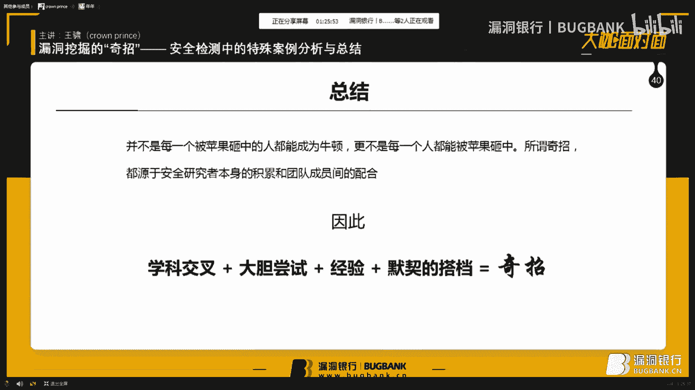

最后呢以上也就是我今天演讲的全部内容了，期待在未来与大家一起开辟蹊境，挖掘齐招，拓展安全之路。因为我的呃语速是有些快的，特别是遇到一些我觉得比较有感觉的点，我会突然加快速度，呃，可能会有些不信之后。

我们继续进行了解。今天呢我的演讲暂时到此结束了。感谢大家聆听。下面呢我们再次有请主持人。😊，嗯，好嘞，感谢太子王叔的精彩演讲。听了今晚的讲座，你遇到其他案例的时候，是不是心里多了点数呢？

或者还有什么困惑，有一题相关问题都可以提出。然太子会给予大家解答。那本环节结束之后，大咖会选出一位幸运观众送出技术书籍一本。那让我们把聊天室切换到问答区的板块，开始今晚的问题解答吧。😊。

对。嗯，玲天我是直接可以回答大家在问问答区的一每个问题了，是吗？还是对，已经可以开始了。😊，十进制是的呃是这是直接将每我们知道的那个IP正常IP地址是5元组的一个开头嘛。第一个一个第一个环节。

它是直接将每1个IP地址每个点每个点IPVC的每每一个每个构成每每个每个点都进行计算转换成为十进制。所以我将整个IP地址转换为一个十进制VPS呢是呃虚拟主机大家听过没？VPS虚拟主机等等。

这些都是一些那个呃互联网厂商为我们提供的一些系统嘛。当前的是虚拟主机PS未来就是云系统了。然后黑和白盒是什么这个测试我们可以这么想呃，当前我们面对的是一些哦这个测试我们直接举直接例子嘛。

商要求我们要求我们的测试是并没有不提供我们任何源代码，比如我当前需要比如我们当前平时会扫描一些漏洞等等，不是基于盲测试的，我们去自己去找链接自己去测试每一个漏洞，没有源代码。而白盒测试呢就是说。😊。

把它的源代码提供给我们了，我们通用过分析源代码，比如说PPT这个环节，我我们就是提取了网提取了网站的一个源代码。😡。

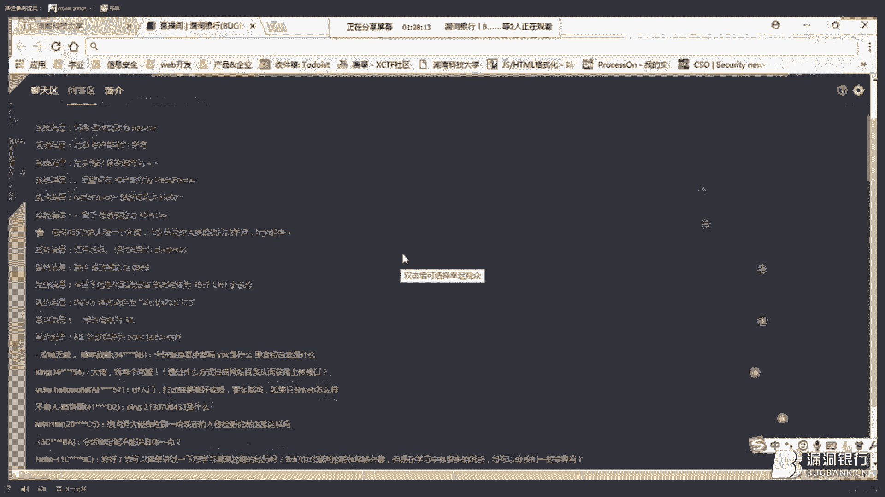

Yeah。哦，这个环节呃，比如常常给我们提供提供了一个呃fi strangerange replace这个函数这样一个函数。通过分析这个这个代码就是白盒测试。😊。

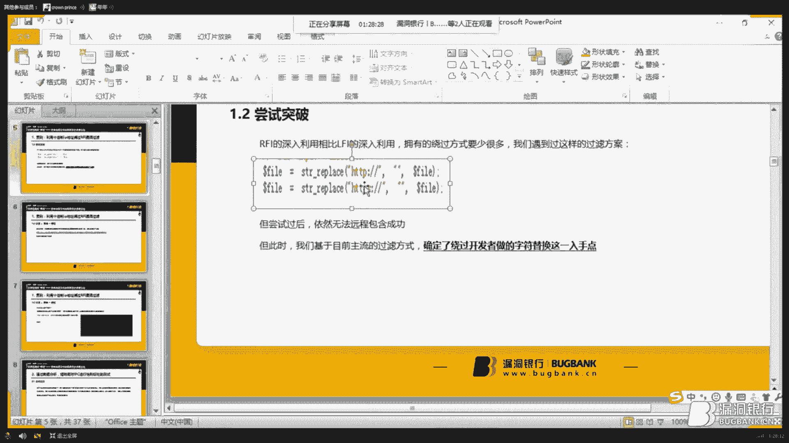

然后另一个问题，通过什么方式扫描网站目录，从而获得上传接口。😊，哎。呃，我们一般会呃一些方面吧，一方面是。呃，通过搜索引擎或者是或者是一些字写发重。另一方面呢就是其实是呃有有一些呃小技巧啊。

比如是物云等等过网公开的案例，我们可以看到一些就是收集到一些敏感的目录，勾掉自己字典，或者说比如我们搜索一些SRT漏洞的时候，我们并不是说呃直接去因为去如腾讯腾讯呢呃腾讯的域名太多了。

我们是直接是也是基于28定律，是直接去看一下腾讯过网案例，某一个域名，它可能或者是某一个呃某一个子目录等等。呃，敏感的敏感的问敏感的安全问题的，我们都会进我们是都通过曾经发生过漏洞的点。

我们去直接再进行一个深物挖掘。这是也是一些SRT漏洞小技巧吧。😊，然后CTF入门打CTF入要好成绩，要全能嘛？如果只会外部怎么样？呃，目前呢一个CTF一个情况是外部的人非常非常多。呃。

外外部的小伙伴们可能会。😊，嗯，然后但是去出原来打打杂项或者打二进制，然后这样的人会少一些。所以说可能是未来是二进制和杂项会吃向一些，但是外b也会是一个很重要的基础吧。如果只会外部呢。

我会推荐再学一下杂项。因为目前我看到很多大姐们都是说都是说我是外部和杂项的两两点的。然后也最好能够会一些了解至好是了解一些逆向等等方面逆向逆向，然后这样的知识。因为你需要和你的团队配合CTF上。

我们现在虽然有个人在在更多情况下都是的组队赛了。😊，然后评20132130730人吗？呃，我们直接看一个。嗯，您生你好，请问现在我可以看到我的屏幕分享吗？呃，可以看到。😊。

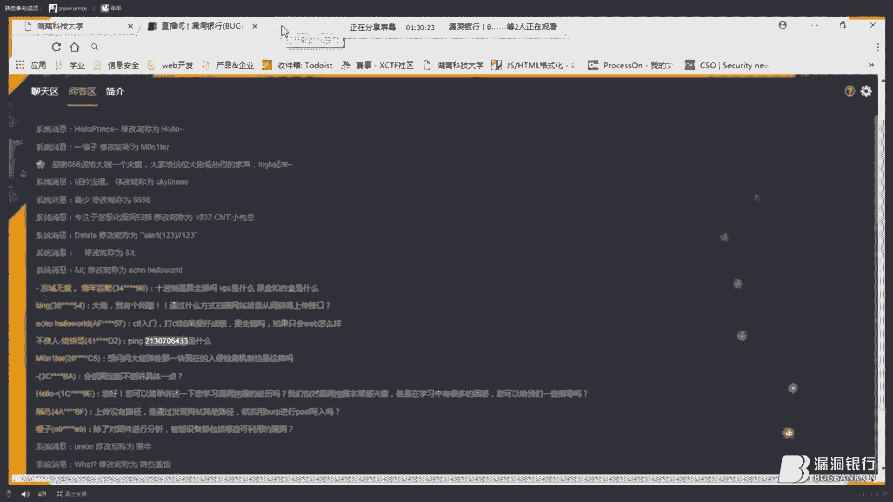

嗯，好的好的，我这里你可以直接看一个演示，然后。

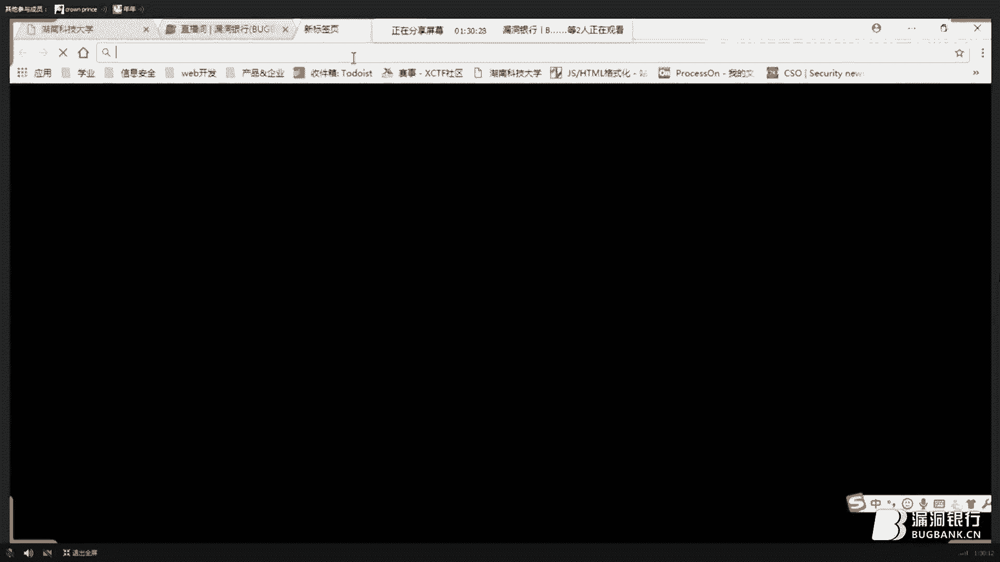

是直接基于网络公开平台的。はい。嗯。Okay。She。虽然目录比较多，但我的记忆力还是不错的。然后我们看我们21307633，其实是127。0。0。1以这个本地IP地址转换。

如果我们可以看到这个平台之后算法我们可以之后去体交流一下，因为它也是一些。😊，这一些就是一些数值的转换嘛，会涉及到。比如我们这里将127。021直接转换成为。是金制。没也看到微信示。比如百我们公司官网。

嗯。

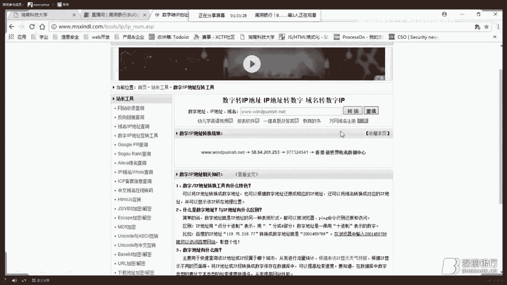

就是都是这样的，就是直通过直接转化由二进制，就是转化为十进制。但漏通案在案例中，我们主要解主要的应用点就是因为它通过十进制可以很巧妙的替换成原文原本格式格式化的IP地址使用的点点号这样特殊字符来完成一个绕过。

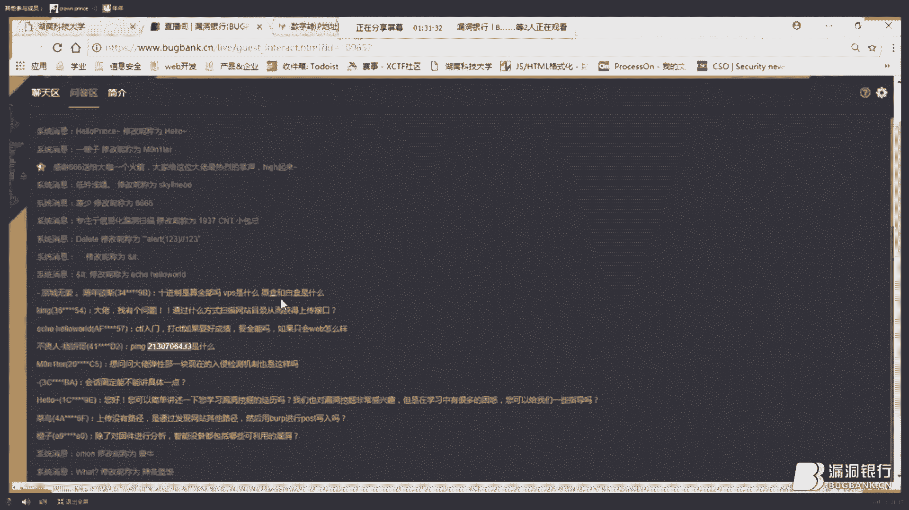

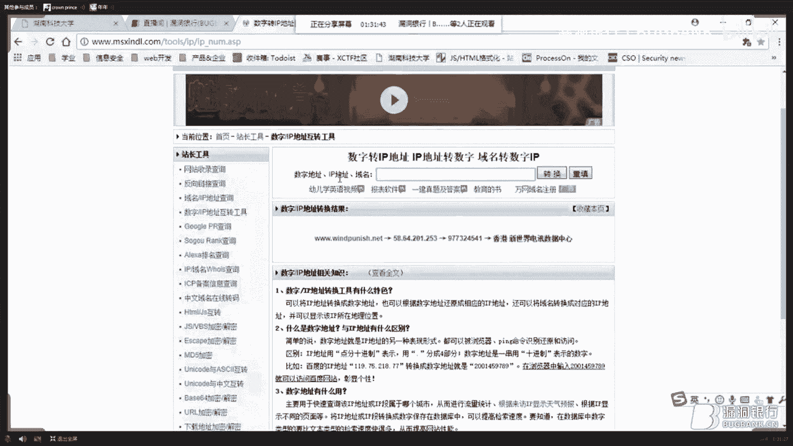

就是弹性那一块，现在入侵检测机制也是检入检入侵检测机制也是这样吗。呃，因为目前语云系统，比如开源的云系统，open tag这样的系统。😊，嗯，我们子战OPNSGASK这样系统，他们都是可以开源。

都很好的配置。所以我不能说大多数系统都是这样。我遇到过的一两个案例是这样的，因为很多厂商都想要云和安全的结合，但是目前还做的不是很好。但一些大厂商的话，它的云机制会更强一些。

然后所以话这样的案例其实会很少。😊，规划固定能不能讲具体一见嗯。嗯，我觉得会到固定的具知识呃，具体内容我在PPT里讲的应该还是还是比较清晰，它是一个基础定义嘛。如果之后想要自己的实际案力上。

我们可以去进行一下分析。因为基础知识它确实这个过程，主要利用的就是绘画呃CNID对于是不变的。😊，可以讲一下学习漏洞挖掘的经历嘛。嗯我觉得是这样的。嗯，因为漏漏洞挖掘的学习过程，我是嗯最开始的时候。

我是先我希望能够推荐先学习一下漏洞的实实际过程，并不是说直接去学习本质，说学一个思就要去学思cho的原理，而是先去学思先用先学会用工具，知道思是什么。因为你会在未然后直接可以去学一习直接进行一些实战。

或者是再进行一些CTF的结合。因为这样的情况下，你通过实战经历，你会遇到很多的你会直接的被被间接的直接的的被领悟到一些它的本质内容。比如说是我执行思个为什么我我执行了同样的代码去没有成功。

那么我就会自主的去百度它的原理等等。其实实战过程是也是一个自主学习过程。虽然当前知识点是零散的。但是在未来之会到很多帮助在思叉S等等这样的比如SP的top的top1的安全漏洞都已经学过之后，你。😊。

安全全安全整个体系已经有了自己一个了解之后，我就可以深入的学习原理了。这样的情况下，有了实战有原理可能会更好的结合了。然后同时要一定要学习编程语言，呃，一定要推荐第一门编程语言是C或者pyython。

然后。😊，上传没有路径，是通过发现网站其他路径，然后用po进行pos的pos写入嘛。设是的。因为可能因为这样的TMM代TML代码呃，只是为了临时的搭建使用的。所以很多时候我只是为了满足需要。

并没有对外提开发只是满足需要，并没有对外提供。所以他是没可能在当前目录没有设置一个而只而在他想要的目录进行作业权限。我们通过那个路径泄露找到了一个很敏很敏感的目录。

然后通过修修通过修改完成了以这次的提交。然后除了对固件分析，智能设备都包括哪些可利用的漏洞。嗯，一方面是。😊，是智能设备。首先我们讲一下IPC摄像头吧，IPC摄像头可以分为这样几个层次。嗯。

系统层系系统层，这是基于软件端的。第二层是驱动层，也或者是说固件层这两个可以并行的。第三层就是硬件层。基于系统层呢也其实目前的这些系统层，我们都可以说为直接是外部系统。

比如我们可以看到呃是某著某某康威视某华的著名是摄像头出现过的漏洞，他们都是呃基于外部我们我们其实是目前访问披露，都是基于外部端的。比如说入口令进入了远程的那种管理管理端口。

或者是通过摄像头独有的摄像头很常用的P协议。NVNVF协议这样的一些一些特殊漏洞，或者是说或者是SOVP或者协议这样的一些协议漏洞。基于外部端进行一个检测。这是基于系是基于系统层的而固件。😊。

固件层和驱动层的，比如是可以进行固件的逆向分析，或者是说嗯嗯嗯。或者是说一些呃基基于云端的，或者是一些中间中间人的攻击。然后另一方面呢就是硬件层，硬件层我们就是比较单一了。硬件的还可技术。

比如修改电路板，然后或者是找一些电路板的一些路。😊，一些其他其其他问题吧，这个之后我可能会。😊，嗯，会有会有一些这啊这方面的演讲，然后到时候也欢迎大家一起一起参一起参与进来。会关于智能设备的，然后。😊。

嗯，我的文章嗯我我首先可以大家大家可以关注我们实验室的公众号，或者加我个人的QQ。我稍后会把我自己会把这次的。😊，PPT我自己传到那个咱们漏洞银行的技术群技术群里。

然后也会在大家群里和大家进进行一下发言。然后大家可以加我QQ或者是看一下我们实验室的公众号会发一些我最近的公最新的文章，然后之因为目前可能会有些那案例可能是公开都是都是几个月之前的了。

所以之后的话可能就是我一点公开大家大家关注我之后也可以提前获取一些。然后大目前状库是怎么操作的。验证码这块怎么绕货，状库怎么攻击呢？

一方面是嗯首先是没无验证码状态无验证码状态我们是可能会是一些呃直接是拿字典去撞库。遇到问题呢可能就会是对我们的访问一个限制。

那么你可以提供一个IP池访问限制就是说可能会检测你比如同一时间内访100次访问我们网站，那你就是在壮库我们我们直接屏蔽个IP所以你需要需要改改一下IPIP吧。然后。😊，嗯。

我看到QQ博客那这个我们之后稍后我我分享一下Gub吧。因为我然后呃IPIP值的问题去绕过网站访问站一个访问拦截。另一方面呢是有验证码的情况。有验证码的情况呢，我们主要使用的技术是一种类似于验证码的分割。

因为比如我们常见的是验证码是一个图片嘛，我们会有一些呃会将这个图片进行会收集一个图片库，然后进行进行保存。像这些图片进行一个识别，最好保存所有的字母，比如说1234。

因为验证码是随机会有1234会一些字母等等，把所有的图片一个一个按照它的位置切割，然后把每一个验证码都的单独保存起来，然后最后保收集了一个验证码的库，然后进行一个识别，然后另一方面呢就是打码平台。

大家可能会听过会有专门的打码的平台为我们人工的这样的人打码平台成功率会很高。但是呃成功率很高，但是速度会慢一些。😊，然后这是目前状况的一些主要机制吧。然后一些滑动滑动解码的这些的话。

可能会有一些会可能会更深入一些。这个呃我们实是有专注这个，你之后让他写一个文章，他是专门做，会有这样验证码实验一块。那我我我了目前了解到这个层次，然后。😊，现在大型网站已经很难挖掘到常见漏洞了。

该如何突破自己，找到这些大型网站的突破口。嗯，目前大型网站漏洞，我们可以说一下SRC我认为这其实这个问题非常非常好，涉及涉及到了未来一个安全趋势的问题。😊，不仅仅是大型网站，已经当前已经很难挖掘漏洞了。

更是未来要想到大家我们会提到一些云安全的问题。云计算的情况下，云云云安全会强迫很多小厂商直接上线云端。届时呢云安全的管理商会直接将很多呃厂商，他一个云安全厂商可能会旗下有几几千万个网站。这样的情况下。

比如一次我比如一次心浪输野漏洞，或者是说呃STR2框架的漏洞出现的时候，我们可能会出现呃，我们之前可能会疯狂一啊报了一个零类，大家疯狂刷一页吧，不会再出现了。因为一旦这样的漏洞被发现了以后。

云云的安全响应机制会比很多时候可能会比人还快。😊，来自于云安全厂商，比如360云安全30云，然后腾讯云、百度云、阿里云，他们这样的安全工程师都会24小时坚守。

然后直接保直接对这样的零类漏洞进行一个解决修复的解决方案的推送。让每一个有管辖的一个安全管辖的一个网站都能够得到安全安全封锁。所以这一很难的一个点。所以我认为目前有可能有习一些点吧。

首先是呃一些代码上的问题。因为我们知道云安全的话，速度数据量很快，所以大家可以尝试学一些C加加C加加等等这样的底层语言，也许在不用像我们之前那个呃任意员下载漏洞绕过的问题。

就是说通过使用调换了C加加代替了th来写ESP来完成的。然后另一方面呢可能就是基于算法了。大家可能会看到国外一些安全原者已经在做了。就是说比如内网渗透，我们既然会涉及到一些预控的预控的扫描。那么。😊。

呃，就会涉及到一些呃算法，如何如何更快的梳理内网结构，那么就会涉及到那么它就会使用。比如DGS斯特拉或者是呃等等这样DS斯拉或或者克鲁斯卡2等等这样的一些算法。然后嗯。😊，有。将内网进行一个梳理。

然后完成一次嗯结合算法，结合新的更更深入的语言，完成新完成安全的一个呃完成安全的一个突破吧。所以呃可能是技术以及人的思想以及算法，这样一些很深层次的一些嗯一些基知知识，将会更快的融入到信息安全领域。

信息安全网络安全领域。😊，嗯，现在懂常见的外部漏洞原理，也能写简单的测试和利用脚本。但在实际漏洞中，哇觉得很吃力，感觉那些漏洞测试方法大家都知道感觉到了瓶感觉到了瓶颈，有什么学习建议有思路吗嗯。😊。

我觉得如果到了瓶静，嗯，有这样一句话吗。呃当觉得才华不够的时候，那么就来安静下现代读书吧。推荐将。😊，可以这样一个学习呃，推荐将乌云漏洞，首先将乌云漏洞公开漏洞全部看一遍，那全部看完之后。

再问问自己自己做了没有？也许我觉得这种情况大家都会说都会感觉到一份突破了。所以我公开我我可能以我现并没有全部看完，但至少我将乌云乌云9%以上的漏洞全部看过一遍了。然后包括一些CTF的体解也都会看过一遍。

然后所以我觉得像过往经历以及一些实践吧，会一些呃殊的点。其实我这里隐含了一些一些问题。我觉得呃这位朋友可以在可能会在呃看公开漏洞的时候，发现一些发现一些特殊的点。

这里是一些可能是就自己去阅读公开漏洞都会想到都会感悟到的一些点。然后。😊，看加固固定压力怎么判断它删掉了什么东西，痕迹是怎么看出来的呢？没太听懂哦，是这样的嗯。😊。

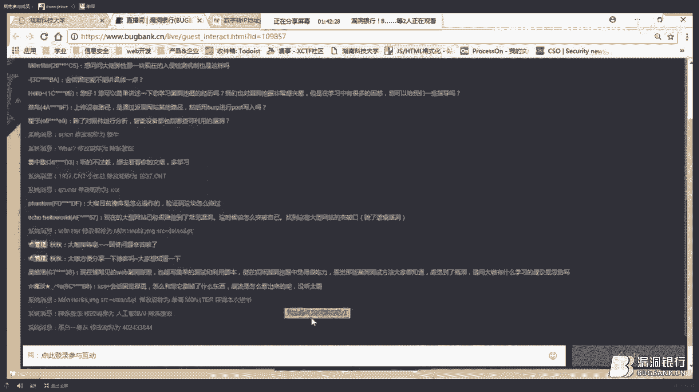

嗯。嗯。嗯，也也并不是没有看我们是因为正常我们去做叉S安全的时候，比如这里我们去做呃我们去叉SS之后，一般都会直接查看源码嘛，看一下有没有在当在前端页面中进行一个执行。因为都会在前端有个展示的。

我们是首先看到左半部分看到它的源码源码过程，我们并没有看到叉S语执行。正常情况下我们是可以在源码中看到比如说是一个一个一个监控号的匹配后这样语句，然后完成一个叉语执行。但是在这里我们并没有看到它的执行。

那么是不是我们就想是不是插入失败了。我们就去看一下自己的叉平台。然后我们看到了在叉S平台上有有过一次来自于这个这个平台的访问来自于这次的访问请求。然后我们就看到了这样的一个。😊，一个一一个痕迹，就是说。

那第一个。Yeah。然后我们看到了呃拆在对方的酷ook，虽然我们在前端没有看到叉的执行，但是在cook，但是在呃我们平台上看到了。😊，现在酷黑的访问请求。然后但是然后所以说我们推测。

因为这说开这是一个开发者做的一个渗透测试。所以我们可以很轻易的想到，就是说是小本的自我删除，在自自自己脱离盗墓节点。所以就是说自动执行了一次，但是会自我删除。😊。

嗯，然后。

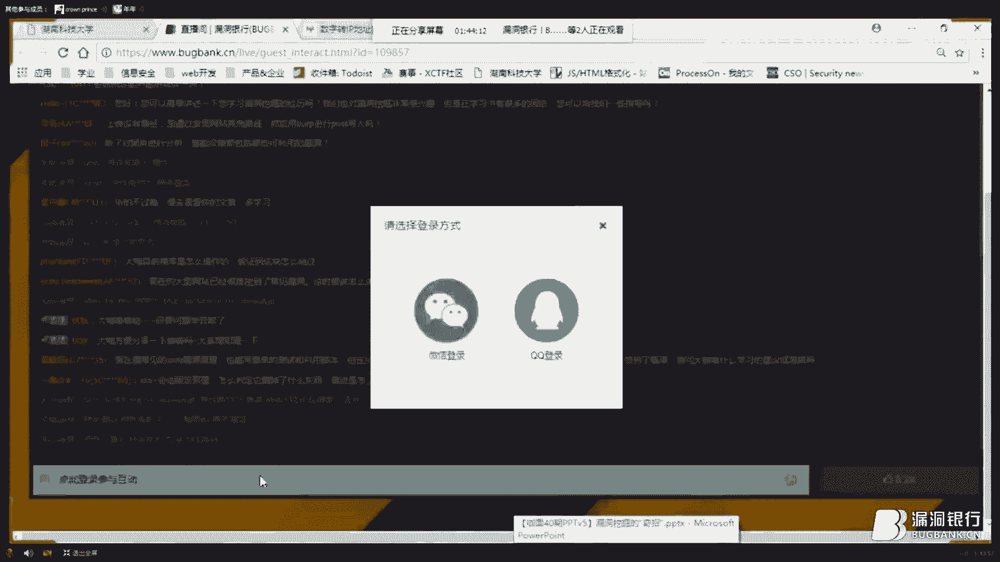

就是目前的出问题了。然后我再分享一下博客嘛嗯。😊，好的好的，那么我应该怎么我我之后也是在最后发PPT的时候，我把我的吉的 hub等等发发到群里吧。然后大家也可以加一下，欢迎大家关注我。

 followlow我名 followlow me。😊，嗯好，那规定的提问时间也差不多，感谢太子王叔的耐心解答。那太子，你现在需要用QQ登录一下我们的直播间。😊。

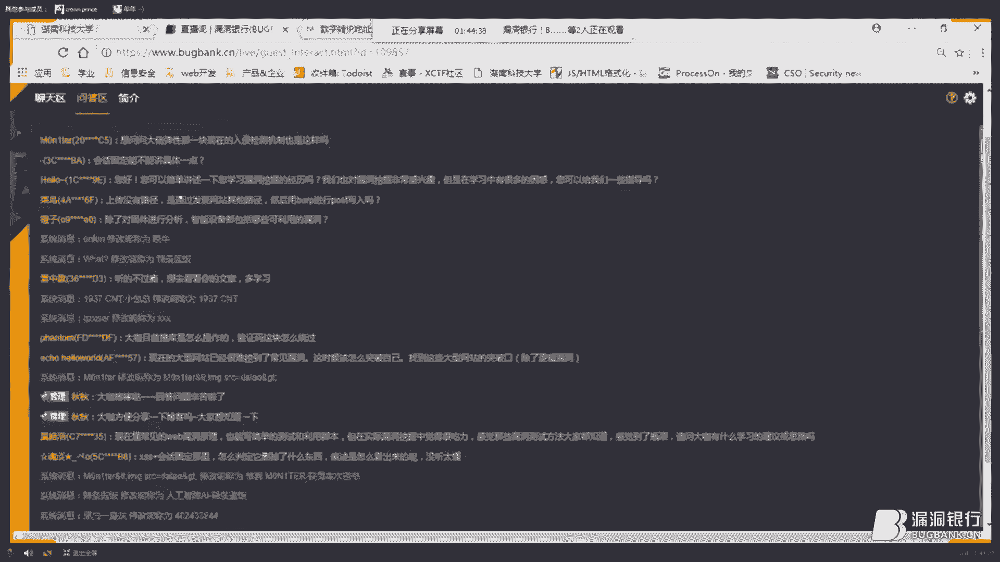

不是。对，然后我们就跑步进入最后的福利环节，大咖赠书。

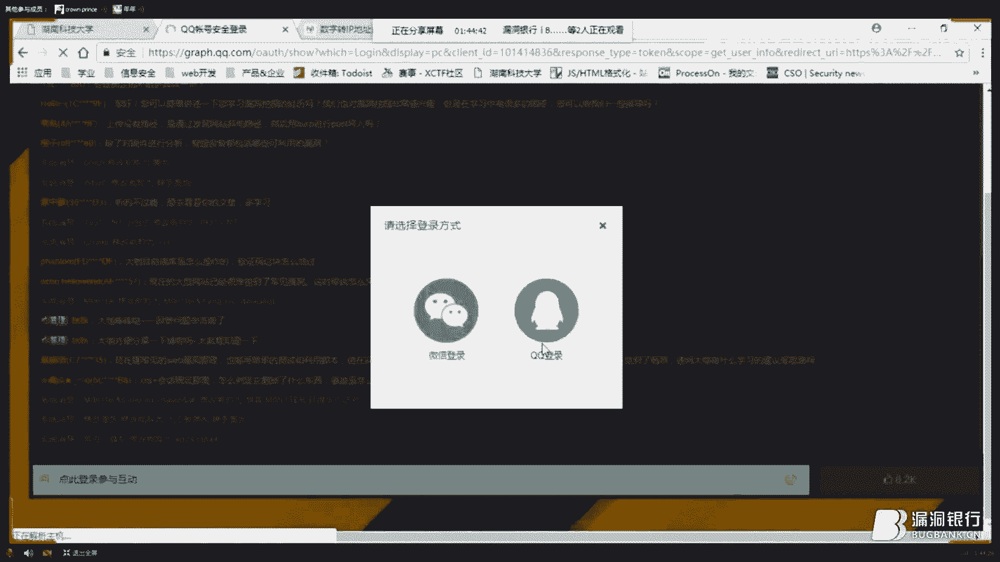

那本期嘉宾太子王素为大家讲解了他所经历的有趣的渗透测试的问题，以及破解这些问题的奇招。而黑客与画家呢是一本利益高远、内涵深刻的书籍，包含了书籍作者对待计算机领域的看法。

以及对突破墨守成规的思维定师的一些建议。那希望在发掘奇招的道路上，帮助大家如虎添翼。那现在就请太子王素，选出今晚最认真听讲的小伙伴送上这本黑客与画家。😊，那努力会有所回报的孩子可以选择了。O ok好。

嗯，我来看一下。我可想救救啊。😊，あ。嗯，最好是不要选秋秋表姐呀。嗯哦了解了解，哦，因为我这里可以看到管理员QQQ嘛，然后我看一下，我来选一位，嗯，我说问答去选吧，大家问答可能会那选。😊，嗯。

因为我我我是做我本身是做开发开发的，所以看到e个hellow world的时候，感觉特别新切。我就送给一个hello world这位小伙伴吧。😊，好，你可可以双击一下他的ID，然后在他选择进行关注。O。

恭喜你一lohello，我的同学。😊，好，OK我已经写完了。好，那恭喜这位dalehello world成为今莹今天的幸运观众。那恭喜你获得这本黑客与画家，希要你在弹窗留下正确的收货信息，我们会在国庆。

😊，国庆那个假期之后，将书籍寄给你。那到这里，本期大咖面对面也要和大家说再见，感谢太子的认真准备，也感谢小伙伴们的认真参与。😊。

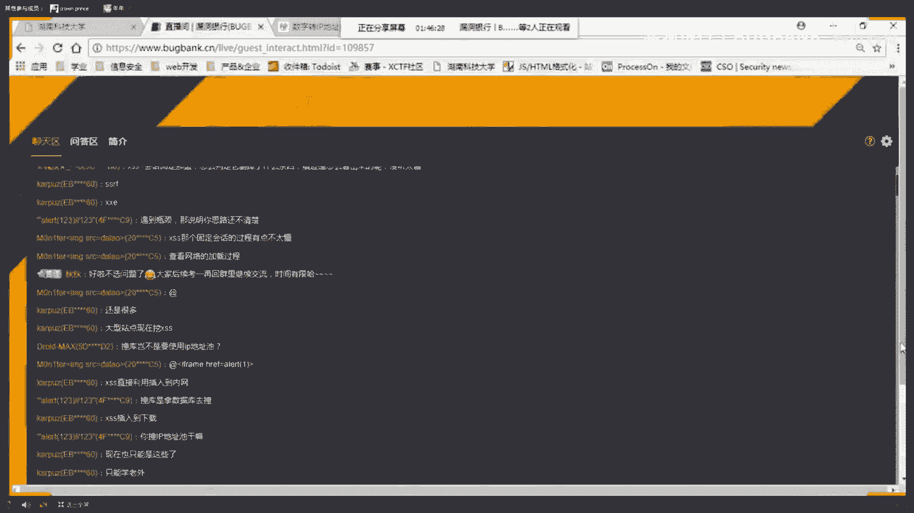

下周五，大咖面对面，因为恰逢国庆节假期，我们休息一周，国庆回来，我们继续嗨。那提前祝大家国庆节快乐。😊，本期大咖明那面直播到这里就结束了，大家可以感谢连念，感谢QQ大家再见。😊，大家辛苦了。嗯。

好的好的，最有没有，感谢其中机会，我们也会继续努力，之后西在和大家深入交流吧。😊。

Yeah。Yeah。