# 课程 P1：漏洞挖掘的奇招 - 安全检测中的特殊案例分析与总结 🎯

在本节课中，我们将跟随安全专家王骕（太子）的分享，学习他在漏洞挖掘实践中总结出的独特思路与“奇招”。课程将围绕多个真实案例，解析如何通过跨领域知识结合、数据分析、漏洞组合等非常规方法，在安全检测中另辟蹊径，发现和利用那些容易被忽视的漏洞。

---

## 概述：什么是“奇招”？🤔

奇招并非天赋或偶然，而是源于安全研究者深厚的知识积累、跨学科的视角以及团队间的默契配合。王骕总结了一个基础的“奇招公式”，作为本次分享的主线：
**奇招 = 学科交叉 + 大胆尝试 + 经验积累 + 默契配合**

具体而言，奇招可能来源于以下几个方向的结合：
*   运维 + 安全
*   数据分析 + 安全
*   漏洞组合 + 安全
*   “鸡肋”信息 + 安全
*   豆腐渣工程分析 + 安全
*   CTF与配套文档 + 安全

接下来，我们将通过具体案例来深入解读这些公式。

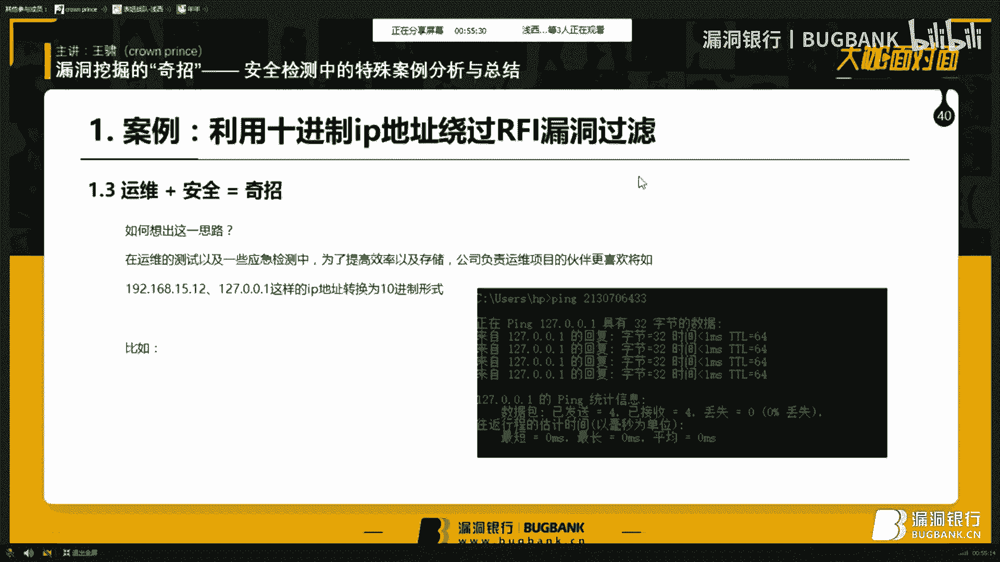

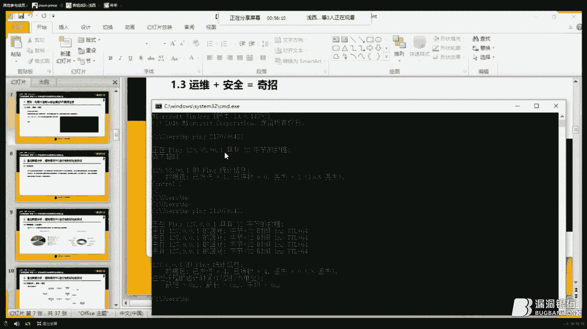

---

## 第一部分：运维视角带来的奇招 🔧 + 🛡️

上一节我们介绍了奇招的基本概念，本节中我们来看看如何将运维经验应用于安全测试，从而发现绕过防护的新思路。

在一次远程文件包含漏洞的测试中，发现目标对`http://`等协议字符串进行了过滤，常规的编码绕过方法均告失败。团队中一位拥有多年运维经验的成员提出了一个关键想法：目标可能对域名或IP地址中的点号`.`进行了特殊处理。

基于此思路，团队尝试将远程文件的IP地址从点分十进制格式转换为纯十进制格式。例如，将 `http://[某IP]/robots.txt` 转换为 `http://[十进制IP]/robots.txt`。

**核心绕过方法：**
```bash
# 将点分十进制IP转换为十进制
# 例如：127.0.0.1 转换为 2130706433
ping 2130706433
```
这个转换之所以有效，是因为在运维工作中，有时为了存储和输入的便捷，会将IP地址转换为十进制数值。许多系统在解析时，既能识别点分十进制格式，也能识别对应的十进制格式。利用这个特性，成功绕过了开发者对点号等特殊字符的过滤，实现了远程文件包含。

**过渡**：通过结合运维知识，我们绕过了字符过滤。接下来，我们看看如何利用数据分析，在时间紧迫的测试中最大化效率。

---

## 第二部分：数据分析驱动的检测策略 📊 + 🛡️

在需要对大量外部IPC摄像头进行安全检测，且时间有限的情况下，盲目测试效率低下。团队采用了数据分析的方法来优化检测策略。

以下是分析过程中的关键步骤：
1.  **数据采集**：收集了15年至17年互联网上公开的IPC摄像头漏洞数据。
2.  **统计分析**：对漏洞类型进行归类和分析，计算各类漏洞的占比。
3.  **制定策略**：发现“命令执行漏洞”在IPC漏洞中占比最大。因此，将测试重点优先放在命令执行漏洞的模糊测试上，而非弱口令爆破等，从而在单位时间内获得更高的检测收益。

这种方法背后的理论支撑是 **二八定律**。在安全测试中，80%的成果往往来自于20%的关键投入。例如：
*   **弱口令攻击**：通常使用top500常用口令而非超大字典。
*   **扫描器规则**：优先检测SQL注入、XSS等高危常见漏洞。

**核心公式：**
**数据分析 + 安全 = 奇招**
通过将前人的经验（定律）与数据分析结合，可以优化安全检测路径，使短期收益最大化。

**过渡**：数据分析帮助我们聚焦重点。而在复杂的系统环境中，单个漏洞可能不足以致命，但将它们组合起来会产生奇效。

---

## 第三部分：漏洞的组合与连锁反应 ⛓️

当SQL注入、XSS等典型漏洞难以单独挖掘时，将它们组合利用可能成为新的突破口。

### 案例一：横向漏洞组合（拆东墙，补西墙）
目标有两个相似的管理系统：系统A（无验证码）和系统B（有验证码，更敏感）。直接攻击系统B受阻。攻击路径如下：
1.  通过爆破进入系统A后台。
2.  在系统A后台发现一个SQL注入点。
3.  通过注入获取了该系统的一批通用管理员账号密码。
4.  用这批通用密码成功登录了真正目标——系统B。

### 案例二：纵向漏洞组合（XSS + 会话固定）
在一个编程教育平台发现一个XSS点，但利用时发现脚本执行一次后会自动删除，无法持续窃取Cookie。团队没有放弃，进一步分析发现了**会话固定漏洞**。
1.  **漏洞利用**：攻击者先获取一个自己的会话ID，并诱使用户使用此ID登录。
2.  **组合攻击**：即使用户因XSS防护未能泄露完整Cookie，但只要其使用了攻击者提供的会话ID登录，攻击者便可直接使用该ID访问用户已登录的账户。

**核心公式：**
**漏洞组合 + 安全 = 奇招**
未来的安全攻防如同组合拳，通过串联不同的“招式”，可以构造出强大的攻击链。

**过渡**：漏洞组合展现了思维的连贯性。有时，一些看似无用的“鸡肋”信息，也可能成为打开局面的钥匙。

---

## 第四部分：“鸡肋”信息的妙用 🍗

在渗透测试中，一些看似低危或无关紧要的信息，如果善加利用，可能带来意外收获。

### 案例一：路径泄露助力文件上传
在对一个“全黑白”静态网站测试时，发现一个上传点但无法绕过类型检查。目录扫描发现了一个调试页面，其中泄露了一个不常见的服务器绝对路径。
**利用过程**：通过修改上传请求，将文件路径指定到泄露出的目录，成功上传了Webshell。这是因为该静态网站在目标目录配置了可执行权限。

### 案例二：SQL注入的“副产品”
一次SQL注入未能直接获取数据，但返回信息中包含了数据库表前缀。通过该前缀，结合对目标系统架构的推断，成功猜解出了后台管理员账号密码的格式，从而完成了渗透。

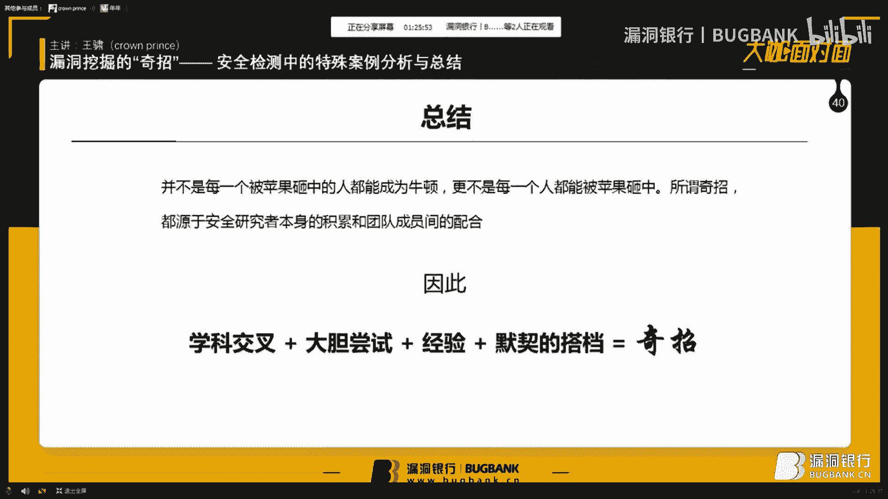


**核心要点**：
*   安全检测中要及时记录、截图，任何信息都可能成为未来的突破口。
*   不要轻视低危漏洞或信息泄露，它们可能是发起进一步攻击的跳板。

**过渡**：无论是利用“鸡肋”信息还是常规漏洞，我们面对的系统本身也可能存在设计缺陷。接下来，我们分析新技术浪潮下的“豆腐渣”工程。

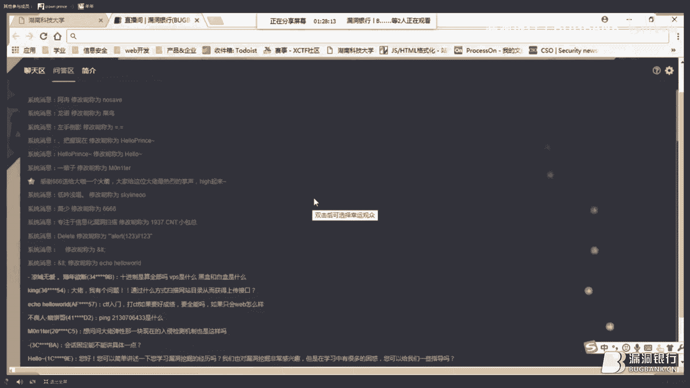


---

## 第五部分：分析新技术下的“豆腐渣”工程 🏗️

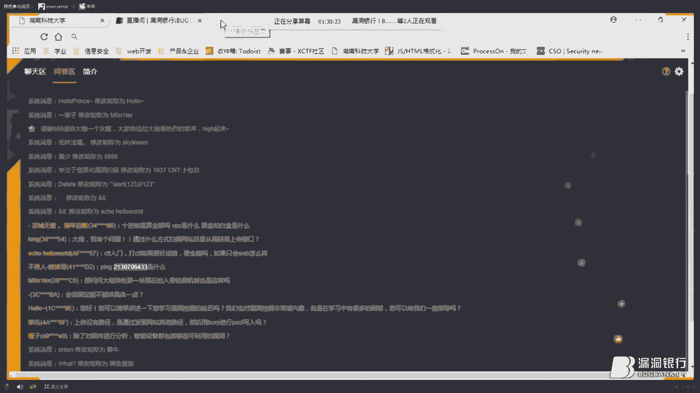


新技术的快速应用有时会催生对原理理解不透彻、匆忙上线的“豆腐渣”工程，这为安全检测提供了机会。

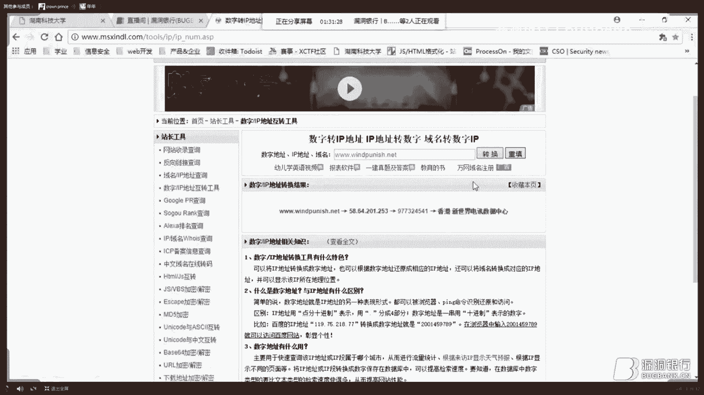


### 案例一：绕过社区云的弹性防护
在测试一个自建社区云的任意文件下载漏洞时，发现无论使用多少`../`回溯，返回的都是一个大小非零的垃圾文件，无法通过状态码简单判断是否成功。
**分析与绕过**：团队推测系统结合了弹性服务和WAF。攻击被识别后，弹性服务会返回伪造内容。解决方案是：在每次请求后增加一个`sleep`间隔，使请求频率保持在弹性服务的“正常”阈值内，同时使用C++编写高效脚本，在下载后快速分析文件内容，从而成功识别并下载了目标文件。

### 案例二：利用云的集中性定位目标
一个公司将分散的VPS迁移到云上。测试中在一个服务器上发现了数据库连接信息，但该服务器已迁移，域名失效。传统方法需大海捞针般寻找新IP。
**利用云的特性**：云环境使得企业外网资产相对集中。通过获取云服务商提供的IP段列表进行快速扫描，迅速定位到了数据库服务器的新IP地址。

**核心公式：**
**豆腐渣工程分析 + 安全 = 奇招**
站在开发者角度思考其设计思路和可能存在的盲点，往往能发现那些隐藏在光鲜外表下的安全隐患。

**过渡**：分析系统设计需要内外结合。有时，外部的一份配套文档就能让“黑盒”测试瞬间变得清晰。

---

## 第六部分：CTF与配套文档的启示 📄🏆

在所谓的“黑盒”测试中，配套文档、使用指南等往往能提供意想不到的帮助。

### 案例一：从智能设备光盘到白盒测试
对一款智能设备的远程Web管理端进行黑盒测试，未发现明显漏洞。团队辗转找到了设备附带的安装光盘，从中提取了固件。
**逆向分析**：对固件进行逆向分析，破解密码，最终找到了Web端的完整源代码，从而将测试转为白盒审计，高效地发现了问题。

### 案例二：CTF中的目录泄露连锁反应
在一次CTF比赛中，通过目录扫描发现`/data`目录，直接列出了网站源码结构。进而发现`/admin`目录，其中存放了过去的Cookie文件。通过分析这些Cookie，构造了管理员Cookie，成功提权。
**CTF的启示**：CTF中常见的`.git`泄露、`DS_Store`泄露、备份文件泄露等，在真实环境中同样存在，并可能引发一系列连锁漏洞。

**核心公式：**
**CTF与配套文档 + 安全 = 奇招**
CTF不仅是竞赛，更是锻炼安全思维、拓展知识深度的优秀方式。而配套文档常是理解系统、发现入口的捷径。

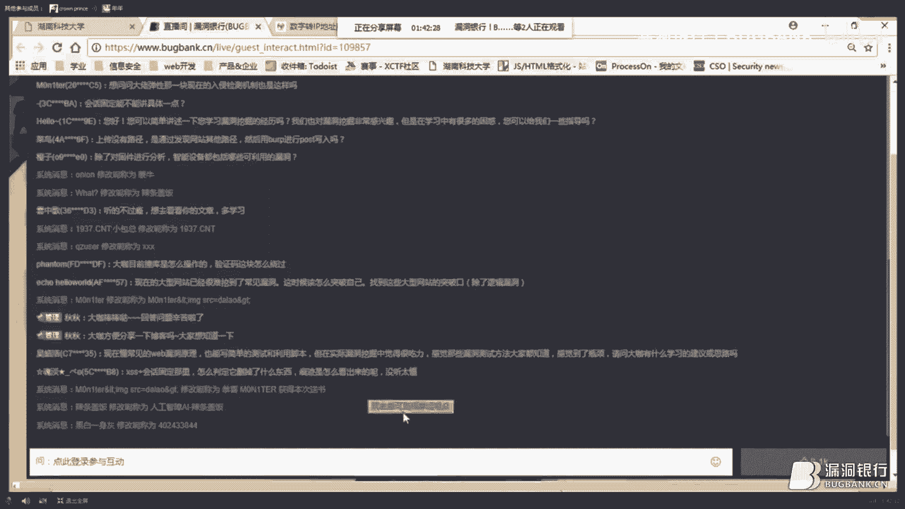

---

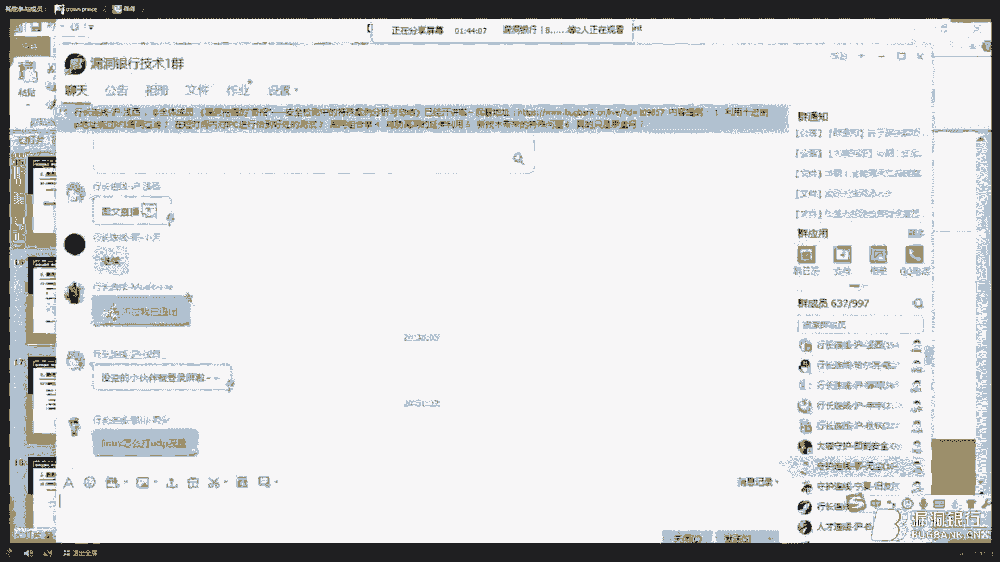

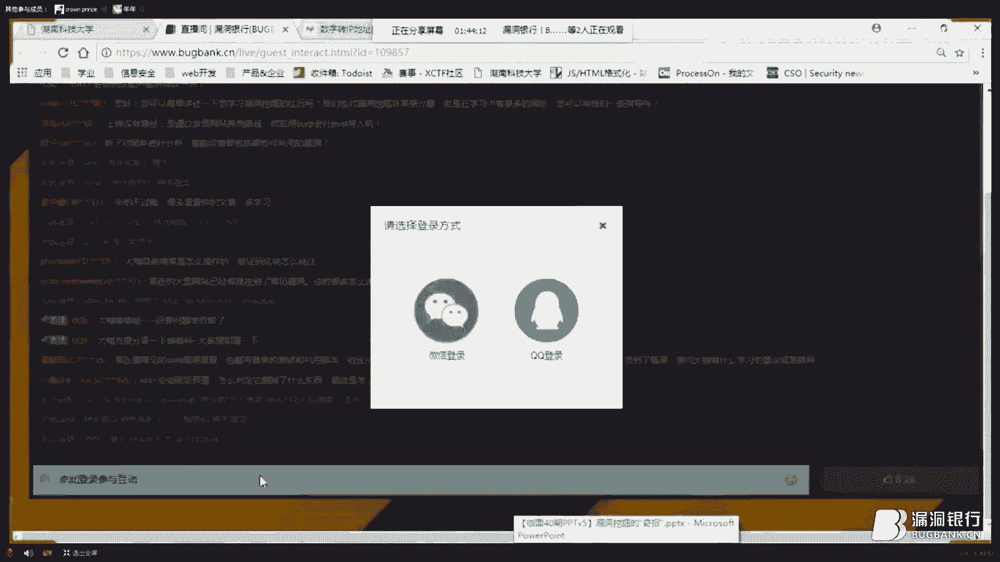

## 总结与展望 🌟


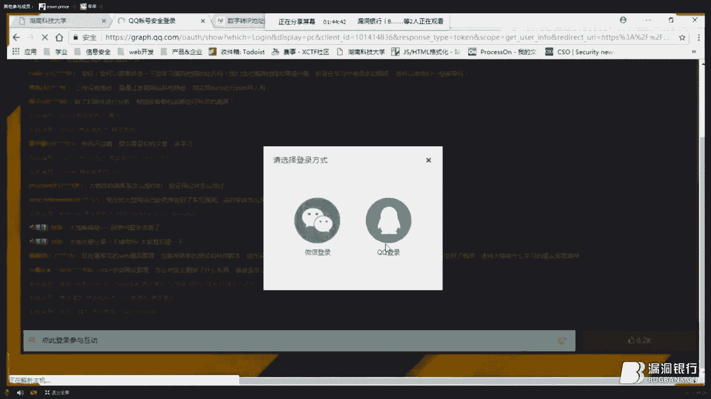

本节课我们一起学习了多种漏洞挖掘的“奇招”：

1.  **运维+安全**：利用十进制IP绕过过滤。
2.  **数据分析+安全**：应用二八定律，聚焦高效测试点。
3.  **漏洞组合+安全**：横向与纵向串联漏洞，形成攻击链。
4.  **“鸡肋”+安全**：重视并利用低危信息泄露。
5.  **豆腐渣工程分析+安全**：从开发者视角寻找设计缺陷。
6.  **CTF与配套文档+安全**：利用外部信息辅助黑盒测试。

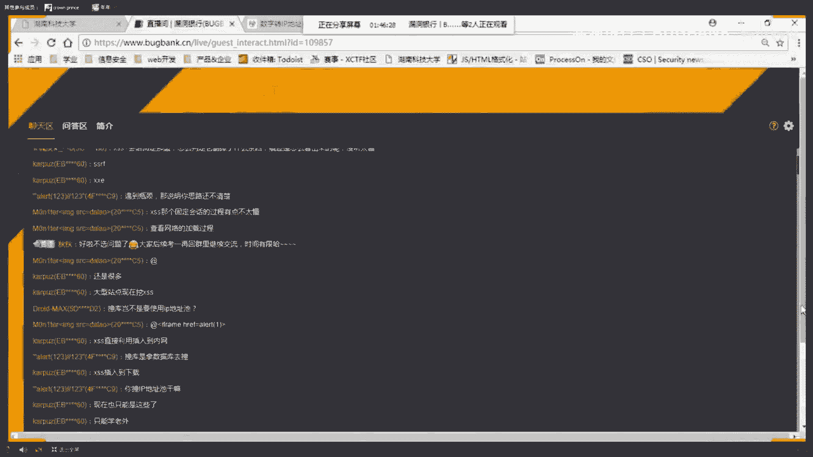


所有这些奇招都源于**深厚的积累**、**跨学科的视野**、**大胆的尝试**以及**团队的默契**。安全之路没有捷径，真正的“奇招”是建立在对基础技术的熟练掌握和不断拓展的思维边界之上。希望本次分享能为大家打开新的思路，在未来的安全研究中，勇于尝试，开辟属于自己的蹊径。