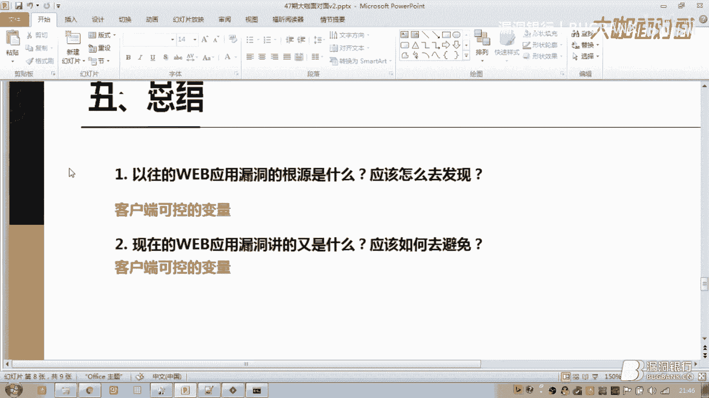
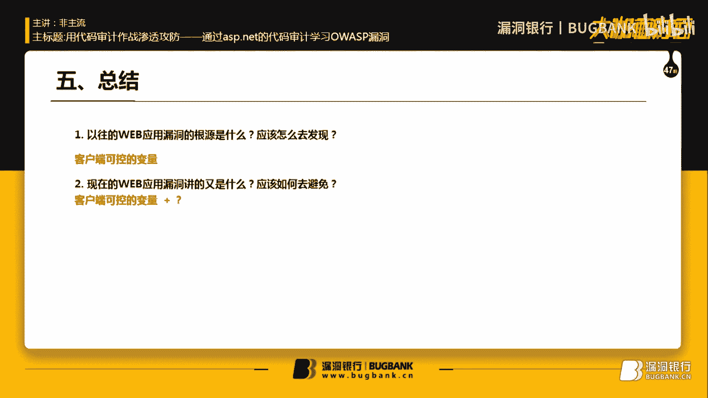
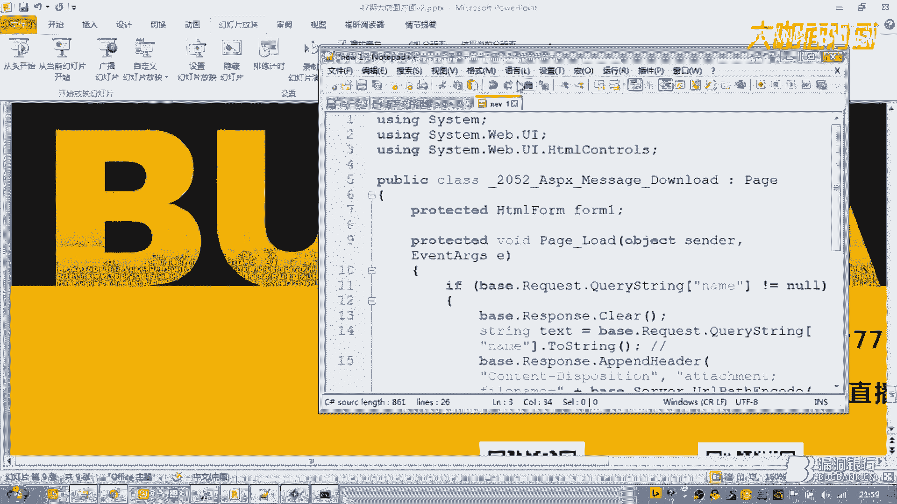
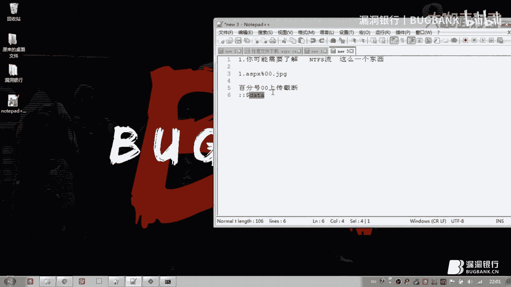
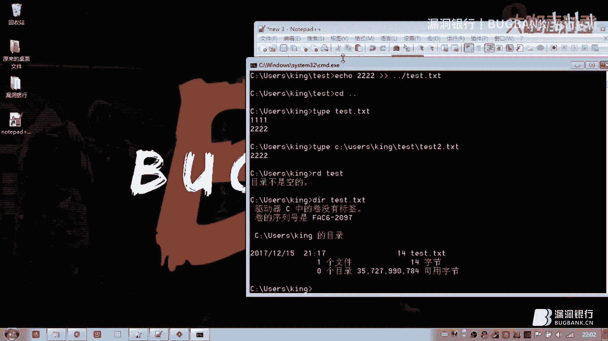
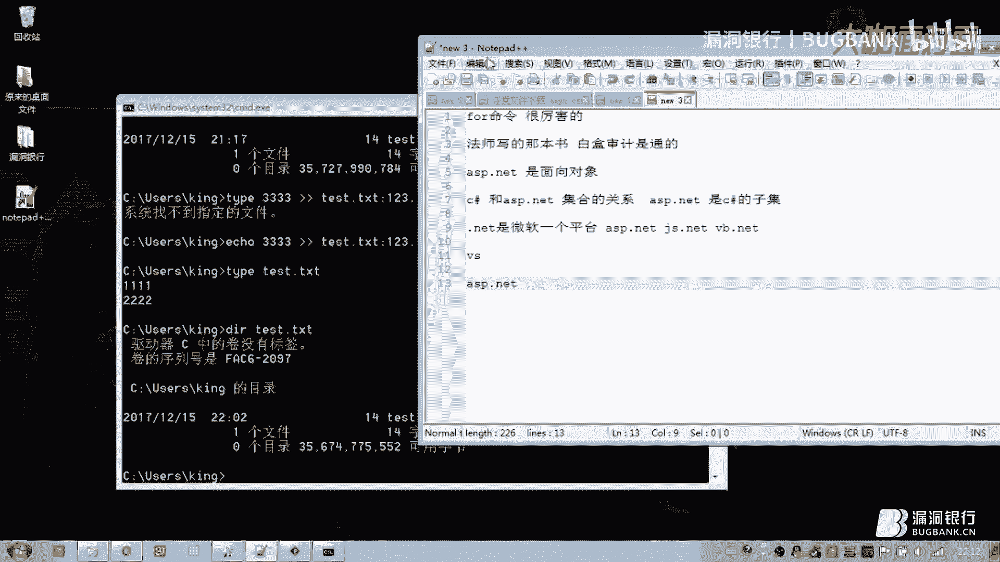
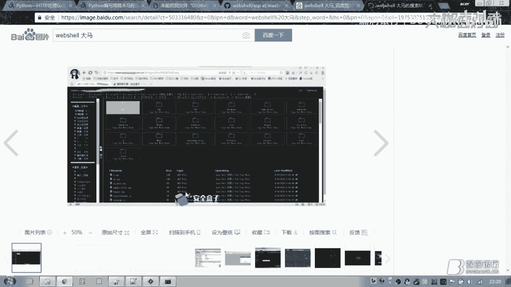
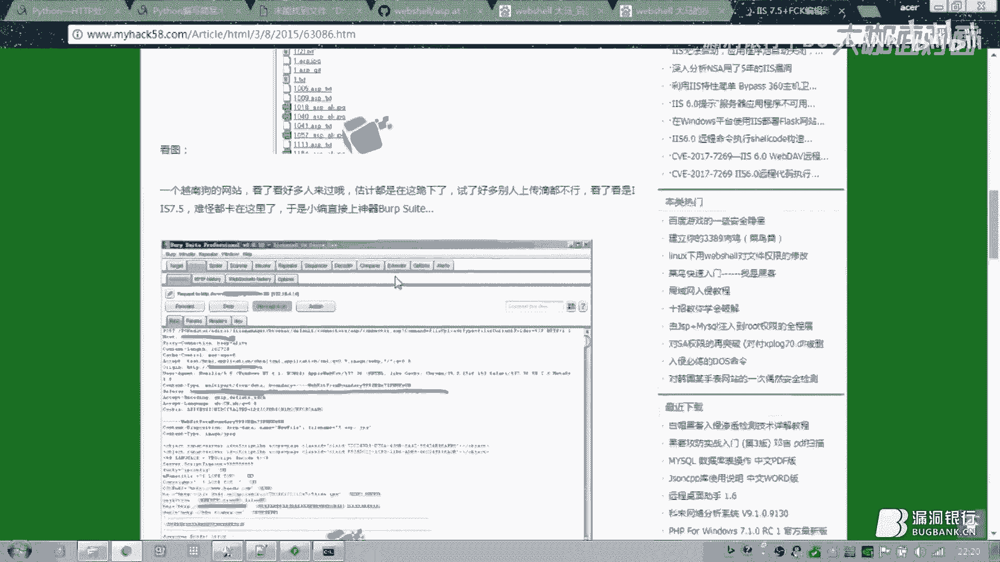
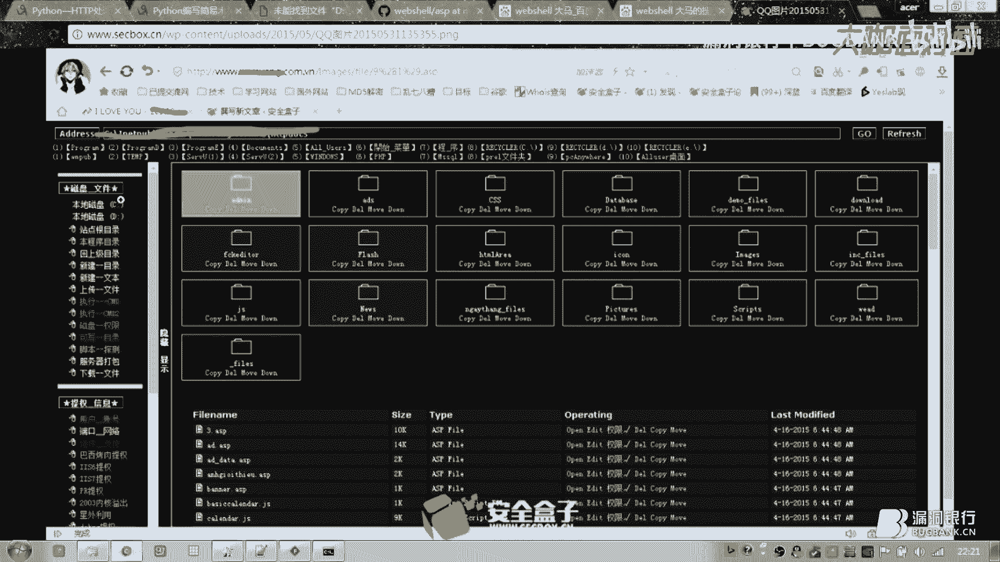
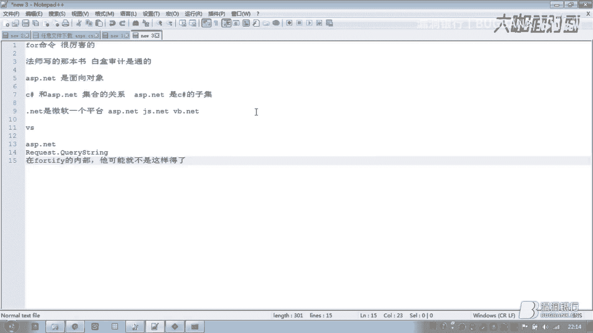

# 课程 P1：ASP.NET 代码审计与OWASP漏洞实战 🛡️


在本节课中，我们将学习如何通过审计ASP.NET应用程序的源代码来理解和发现常见的OWASP（开放Web应用程序安全项目）安全漏洞。我们将从SQL注入和任意文件下载这两个核心漏洞入手，分析其成因、利用方式以及修复方法，旨在帮助初学者建立基础的代码安全审计思维。

## 概述：什么是代码审计？

代码审计是一种白盒安全测试方法，指在拥有应用程序源代码的前提下，通过分析代码逻辑来发现潜在的安全缺陷。与黑盒测试（如渗透测试）不同，白盒审计能更深入地理解漏洞产生的根本原因。

上一节我们介绍了课程的整体目标，本节中我们来看看第一个核心漏洞：SQL注入。

## 一、SQL注入漏洞分析 🔍

SQL注入是一种将恶意SQL代码插入到应用程序的数据库查询中的攻击方式。其根本原因是程序未对用户输入进行充分的验证和过滤。

### 1.1 INSERT型注入

我们首先看一个向数据库插入数据时存在的注入漏洞。

以下是存在漏洞的ASP.NET页面代码关键部分：

```csharp
// 从名为 textBox1 的文本框中获取用户输入
string FREQ = textBox1.Text;
// 拼接SQL语句
string insert_freeeq = "insert into [表名] (考试上线) values ('" + FREQ + "')";
// 执行SQL语句
bool i = Z.ExecuteSql(insert_freeeq);
```

**漏洞成因分析：**
变量 `FREQ` 直接来自用户输入（`textBox1.Text`），在拼接SQL语句时未经过任何过滤或转义。攻击者可以在输入框中提交类似 `' or '1'='1` 的Payload来改变原SQL语句的逻辑。

**漏洞利用：**
攻击者可以构造输入，使最终的SQL语句变为：
```sql
insert into [表名] (考试上线) values ('' or '1'='1')
```
这可能导致数据异常插入或其他非预期行为。

### 1.2 SELECT型注入

查询数据时的注入更为常见。以下是一个查询功能的漏洞代码：

```csharp
// 从客户端获取多个参数
string 职号 = textBox2.Text; // 员工职号
string 单位 = DropDownList1.SelectedValue; // 选择单位
string 岗位 = DropDownList2.SelectedValue; // 员工岗位

// 动态拼接SQL查询语句
string sqlpoint = "SELECT * FROM 成绩表 WHERE 1=1 ";
if (!string.IsNullOrEmpty(职号)){
    sqlpoint += " AND 员工职号 = '" + 职号 + "'";
}
if (!string.IsNullOrEmpty(单位)){
    sqlpoint += " AND 单位 = '" + 单位 + "'";
}
// ... 执行查询 ...
```

**漏洞成因分析：**
参数 `职号`、`单位` 等同样直接来自客户端，并直接拼接到 `sqlpoint` 字符串中。程序虽然进行了非空判断，但没有对参数内容进行安全检查。

**漏洞利用：**
攻击者在“员工职号”输入框中提交 `' OR '1'='1`，可以使查询条件永远为真，从而泄露整张表的数据。由于页面没有显示详细的数据库错误信息，这通常是一个盲注漏洞，但依然可以使用 `sqlmap` 等工具进行自动化探测和利用。

### 1.3 SQL注入的修复方法

了解了成因，修复方法就变得清晰。核心原则是：**不要信任任何用户输入**。

以下是主要的修复策略：

1.  **参数化查询（推荐）**：这是最有效的方法。它使用参数占位符，将用户输入作为参数传递，而非字符串拼接，从而从根本上杜绝注入。
    ```csharp
    string sql = "SELECT * FROM Users WHERE Username = @username AND Password = @password";
    SqlCommand command = new SqlCommand(sql, connection);
    command.Parameters.AddWithValue("@username", userName);
    command.Parameters.AddWithValue("@password", password);
    ```
2.  **输入验证与过滤**：对输入进行严格的格式检查（如只允许数字、特定字符集）。但此方法不应作为唯一防线。
3.  **使用ORM框架**：如Entity Framework，它们通常内置了参数化查询机制。
4.  **最小权限原则**：数据库连接账户应仅具有必要的最小权限，避免使用 `sa` 等高级账户。

上一节我们深入探讨了SQL注入，本节中我们来看看另一类常见漏洞：文件操作漏洞。

## 二、文件操作漏洞：任意文件下载 📥

文件操作漏洞涉及对服务器文件系统的非法访问，其中任意文件下载允许攻击者读取服务器上的敏感文件。

### 2.1 漏洞代码示例

以下是一个存在缺陷的文件下载功能代码：

```csharp
// 通过GET请求获取文件名参数
string name = Request.QueryString["name"].ToString();
// 对文件名进行简单的解码和字符替换
string filePath = Server.UrlDecode(name).Replace("\"", "").Replace("\\\\", "\\");

// 检查文件是否存在
if (File.Exists(filePath)){
    // 设置响应头，触发文件下载
    Response.AddHeader("Content-Disposition", "attachment; filename=" + fileName);
    Response.WriteFile(filePath);
    Response.End();
}
```

**漏洞成因分析：**
程序直接从URL参数 `name` 中获取文件路径，仅做了去除双引号和双反斜杠的简单处理。攻击者可以通过目录遍历序列（如 `../`）来跳出程序设定的下载目录。

**漏洞利用：**
假设程序意图只允许下载 `upload/` 目录下的文件。攻击者可以构造如下请求：
```
/download.aspx?name=../../web.config
```
经过 `Server.UrlDecode` 解码后，`filePath` 的值变为 `../../web.config`。`File.Exists` 检查会尝试在服务器上寻找相对于当前目录上两级的 `web.config` 文件（通常是网站根目录下的配置文件）。如果文件存在，它将被下载给攻击者。

**危害：**
`web.config` 文件通常包含数据库连接字符串、API密钥等敏感信息，泄露此文件可能导致严重的安全事件。

### 2.2 任意文件下载的修复方法

修复此类漏洞的关键在于对文件路径进行严格的控制和校验。

以下是修复建议：

1.  **白名单验证**：只允许下载预先定义好的、安全的文件名列表。
    ```csharp
    List<string> allowedFiles = new List<string> { "report.pdf", "template.docx" };
    if (!allowedFiles.Contains(fileName)){
        return; // 拒绝请求
    }
    ```
2.  **限制目录**：将文件路径固定到特定安全目录，并拒绝任何包含 `..` 的路径。
    ```csharp
    string safeBaseDir = @"C:\app\uploads\";
    string fullPath = Path.GetFullPath(Path.Combine(safeBaseDir, fileName));
    // 确保最终路径仍在安全目录内
    if (!fullPath.StartsWith(safeBaseDir, StringComparison.OrdinalIgnoreCase)){
        throw new UnauthorizedAccessException();
    }
    ```
3.  **映射文件ID**：不直接使用文件名作为参数，而是使用数据库生成的唯一ID来映射真实文件。
4.  **权限控制**：确保Web服务器进程（如IIS应用程序池账户）对文件系统只有必要的最小读取权限。

## 三、未授权访问漏洞 🚫

未授权访问是指应用程序未验证用户身份或权限，就允许其访问特定功能或数据。

### 3.1 漏洞示例

在ASP.NET中，`Page_Load` 事件是页面加载时首先执行的代码。如果这里没有检查用户登录状态，就会导致未授权访问。




```csharp
protected void Page_Load(object sender, EventArgs e)
{
    // 缺失权限校验代码
    // 直接加载敏感数据或执行管理操作
    BindGridData(); // 例如：直接绑定用户列表数据
}
```

**修复方法：**
在 `Page_Load` 或相关事件处理程序的开始处，必须进行身份和权限校验。

```csharp
protected void Page_Load(object sender, EventArgs e)
{
    // 1. 检查用户是否登录（Session验证）
    if (Session["UserName"] == null)
    {
        Response.Redirect("Login.aspx"); // 跳转到登录页
        return;
    }

    // 2. 检查用户是否有此页面的访问权限（角色或权限点验证）
    string userRole = Session["UserRole"] as string;
    if (userRole != "Admin") // 假设只有Admin角色能访问
    {
        Response.Write("权限不足");
        Response.End();
        return;
    }

    // 3. 通过校验，执行正常业务逻辑
    BindGridData();
}
```
**核心要点：**
*   **使用Session而非Cookie**：Session数据存储在服务器端，比客户端存储的Cookie更安全，不易被篡改。
*   **垂直与水平权限检查**：
    *   **垂直越权**：检查用户角色（如普通用户 vs 管理员）。
    *   **水平越权**：检查用户是否只能操作属于自己的数据（如用户A不能修改用户B的资料）。

## 四、代码审计方法论与总结 🎯




### 4.1 如何进行白盒审计



1.  **定位危险函数/操作**：审计开始时，应搜索关键操作点：
    *   **数据库操作**：搜索 `ExecuteSql`、`new SqlCommand` 等字符串拼接查询的地方。
    *   **文件操作**：搜索 `File.Exists`、`File.ReadAllText`、`Response.WriteFile` 等，检查其参数是否用户可控。
    *   **用户输入获取**：搜索 `Request.QueryString`、`Request.Form`、`Request`（通用获取方式）。
2.  **跟踪数据流**：从用户输入点（如 `Request.QueryString["id"]`）开始，跟踪该变量如何被传递、处理，最终到达危险函数（如SQL查询、文件路径）。
3.  **检查过滤逻辑**：在数据流经的路径上，检查是否存在有效的过滤、验证或转义函数。常见的不足包括：
    *   仅在前端JavaScript验证。
    *   使用简单的字符串替换（如只过滤一次空格或引号）。
    *   黑名单过滤（容易被绕过）。
4.  **理解业务逻辑**：思考应用程序本应如何工作，寻找逻辑缺陷，如绕过支付流程、重复提交等。





### 4.2 漏洞根源与演变

*   **传统漏洞根源**：绝大多数Web漏洞（如SQL注入、XSS、文件包含）的根源都是**对客户端可控变量的处理不当**。这些变量未经过充分验证、过滤或安全编码，就被直接用于敏感操作。
*   **现代漏洞趋势**：OWASP Top 10也在演变。除了传统的代码层漏洞，现在更强调：
    *   **错误的安全配置**（如默认密码、暴露的调试页面）。
    *   **使用含有已知漏洞的组件**（如过期的框架、库）。
    *   **不足的日志和监控**（导致攻击无法被及时发现）。
    这要求安全人员不仅关注代码，还需关注整个应用生态和运维体系。

### 4.3 工具辅助

*   **静态代码分析工具（SAST）**：如Fortify、Checkmarx，可以自动化地扫描源代码中的潜在漏洞模式。但它们可能产生误报或漏报，需要人工复核。
*   **集成开发环境（IDE）**：如Visual Studio，其代码导航、查找引用功能，对于手动跟踪数据流非常有帮助。
*   **反编译工具**：对于ASP.NET，如果只能获得已编译的DLL文件，可以使用如 `ILSpy`、`dnSpy` 等工具进行反编译，查看近似源码。



## 总结

本节课中我们一起学习了通过ASP.NET代码审计来挖掘安全漏洞的实战方法：







1.  **SQL注入**：源于将未经验证的用户输入直接拼接到SQL语句中。修复方法是采用**参数化查询**。
2.  **任意文件下载**：源于将用户控制的参数直接作为文件路径使用。修复方法是进行**路径白名单校验**和**目录限制**。
3.  **未授权访问**：源于缺失对用户身份和权限的验证。修复方法是在关键操作前进行**Session检查**和**权限判断**。

代码审计的核心思想是 **“永不信任用户输入”** 和 **“最小权限原则”** 。作为一名安全人员或开发者，需要具备“找茬”的思维，以攻击者的视角审视每一行代码，假设所有输入都是恶意的，所有验证都是不充分的，从而构建出更健壮、更安全的应用程序。




记住，技术是一把双刃剑，将这些知识用于保护系统安全、进行授权测试和提升安全意识，才是正确的道路。