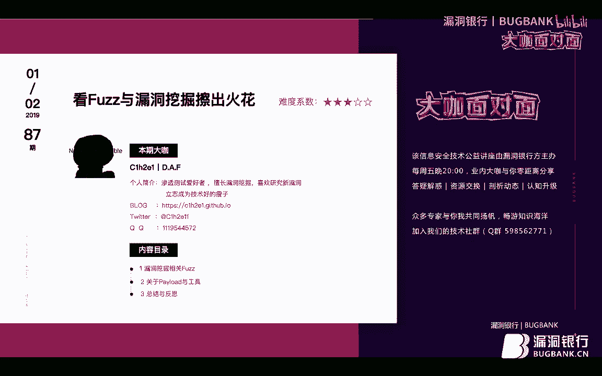
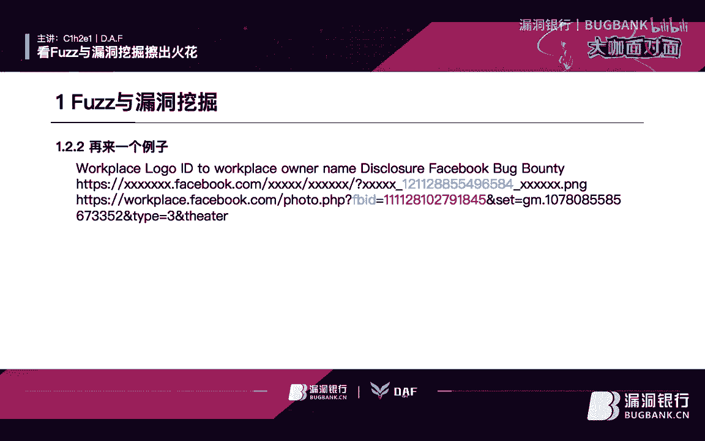
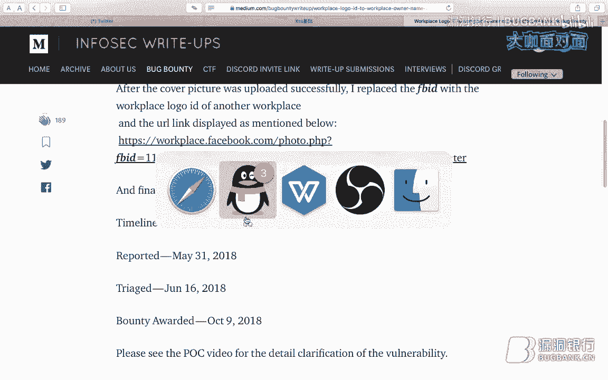
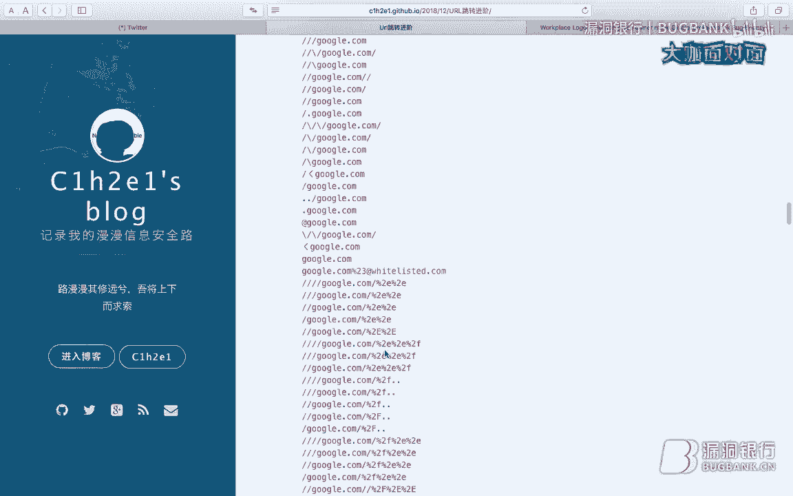
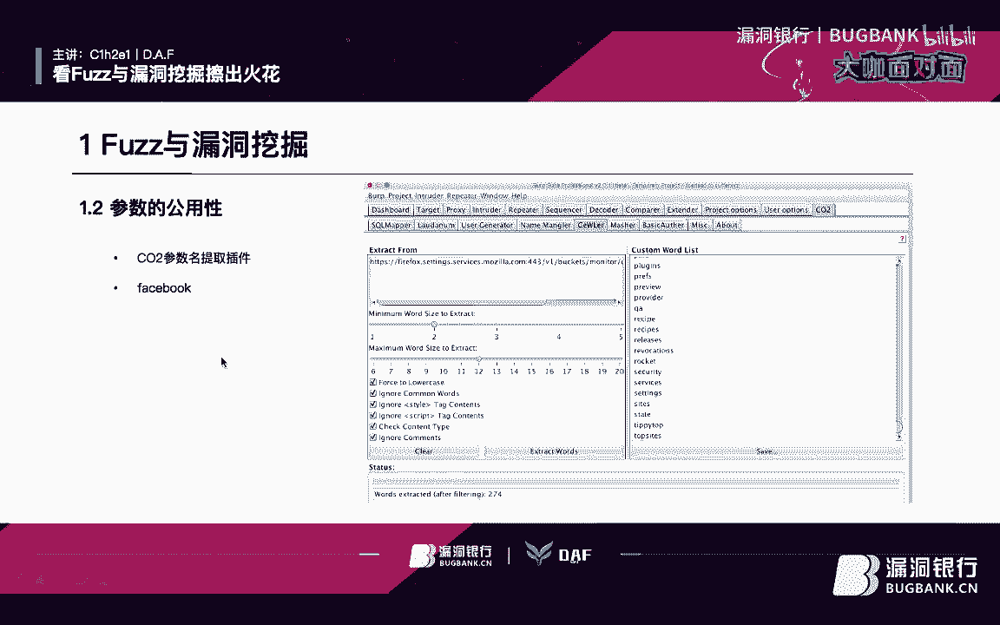
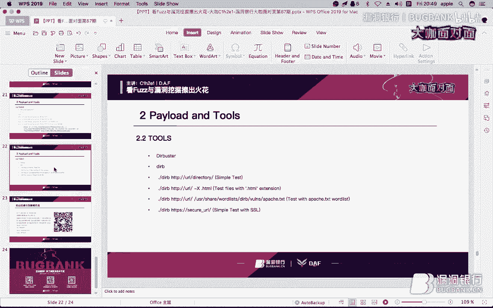
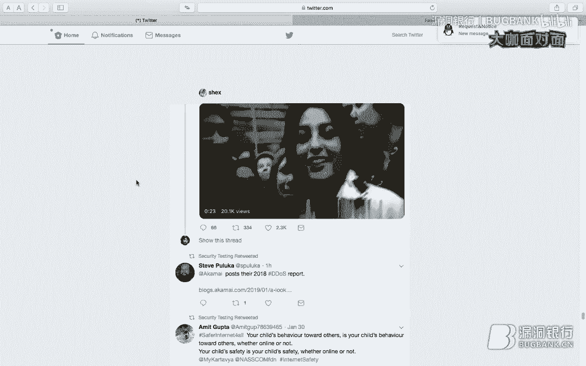
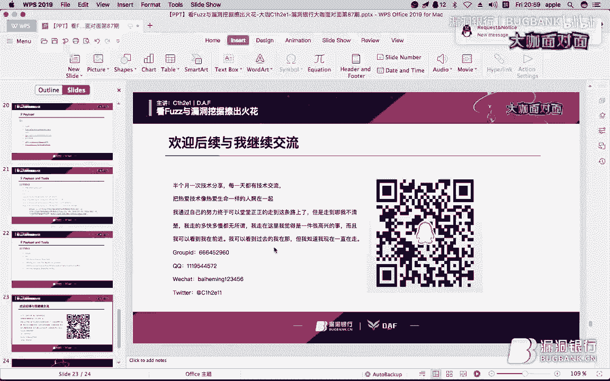
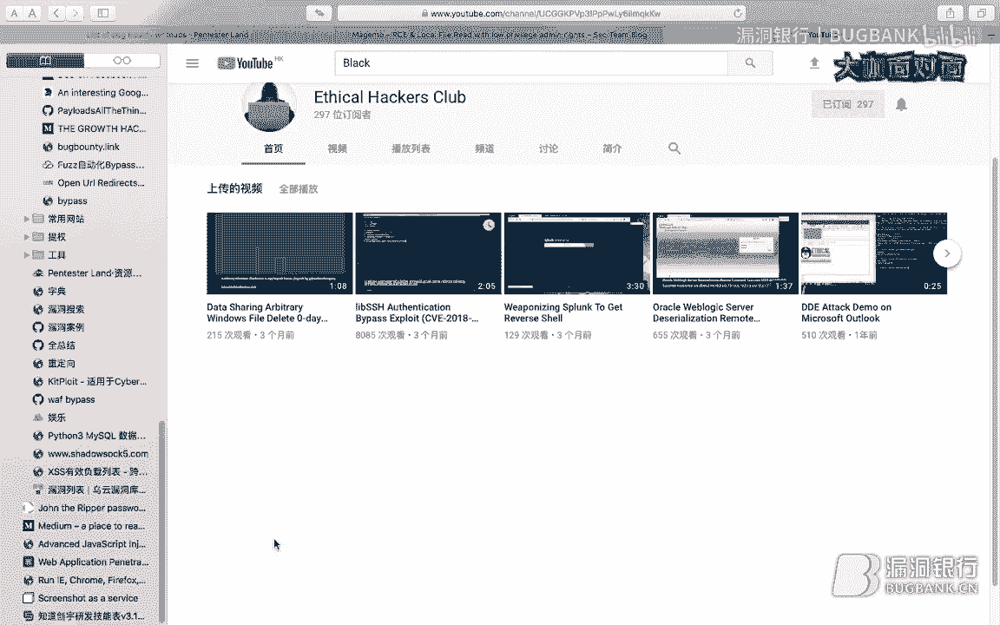

# P1：【录屏】看Fuzz与漏洞挖掘擦出火花-大咖C1h2e1-漏洞银行大咖面对面第87期 - 漏洞银行BUGBANK - BV1Lb411C73X

为知识而存，因技术而生，小伙伴友晚上好，欢迎参加第87期漏洞银行安全技术直播。打咖面对面，我是主持人秋秋。那今晚大咖是曾在68期咖面为我分享过文件上传姿势的衬衫。现在呢他是DNF团队的一员。

也在不断探究安全技术路上努力迈进。那今晚衬衫大咖要么分享议题式看fass与漏洞挖掘擦出的火花。那又是一个对他平日做渗透都有帮助的方向。感兴趣的话一定要仔细听啦。那欢迎各位观众伙伴登录直播间。

在聊天区进行讨论或提问。在大咖一讲完毕后，会有行长问答和福利环节。大家不不仅可以和大咖提问交流，还有机会获得大咖亲子挑选书籍外部攻防之业务安全实战指南。那事不宜迟，下面就请衬衫开始今天的分享吧。

OK各位小伙伴们，大家好，我是翠山。嗯，我的ID是CEH211我来自BAF团队。啊，今天我要给大家带来的议题是看发子与漏洞挖掘，擦出火花。啊，关于发子的话，我相信大家已经不陌生了。

这样的一个技术在多年以来啊就是一直在。😊，呃，不同的发展吧，在最早的时候是相对于软件比较多一点。然后后面我们到了呃售活测试方面也是变得越来越用处多。嗯。

那么今天我给大家带来一些呃比较有趣的关于漏洞挖掘方面的法子。

OK呃，我们团队的官网是DAFICC点ORG大家可以去访问一下官网，这里面有一些啊。东西啊OK啊，今天我们要讲的分别是呃这三个点。第一个是漏洞挖掘与发子，然后就是我们的配套的和工具。

还有我们的总结与反思。关于这几个东西我们都会去。呃，分开来讲吧，那么事不一时，我们就开始吧嗯。我们在讲这个之前，我们需要有一个核心思维。在我们的生活测试过程中也会有这样的一个核心思维。

大家有没有就是在有没有或者是在那个学校的时候听到老师讲一个就是核心素养，就是说我们要培养的是核心素养，而不是说这个这样的一个知识储备啊，这个东西其实大家可以每个人都能学会。

但这个核心思维的掌握是非常重要的。那么这个我们会有三个点啊，第一个就是我们的目录发子。关于它的话，我们主要是用这个也就可以理解为漏洞点的寻找啊，当我们有这样的一个漏洞点的时候。

我们才能会对这个漏洞进行一些利用，或者是进行深入的一些挖掘。那么这也就是我们最基本的一个核心思路。那么我们第二个就是我们的参数法子参数发子的话，也就是我们寻找可利用的参数啊。

类似于这种呃调试的或或者怎么样的一个就是乐权之类这样的一个。参数的一个寻找也是十分重要的一个。地地方。然后呢，第三个是我们的配到的发子，这里面我们涉及到的比较多的是bypass。

在很多时候我们在绕过的时候，会需要一些呃发子的攻击。这样的话我们会就是不用我们在手工去进行那样的。呃，绕过会很麻烦之类的。OK那么。我们带着个核心素养的话，我们进入我们今天的分享。啊。

第一点啊就是关于我们的敏感目录扫描嗯。大家有没有关有没有看到过这个人，他在twitter上面很火很火啊，他这个关于敏感目录的话，我们是有这个三个工具，一个是DR booster，还有W fast。

然后呢，还有一个DR search。在实际上我们使用过程中呢，用到比较多的是DR booster和W fast啊，就是我使用的过程中，这个可能很多人都喜欢用这个DR search置。

但是实际上嗯我现在用W fast是最多的这个少这个DR booster已经也越来越少了。因为就是。因为就是有各种各样不同的东西会。嗯，会变化嘛，所以用Wfa的话会。呃，图形没有用图形的。

是用Wfa的那个命令行界面啊，我这边一直在看弹幕，大家可以去提问。啊，这边呢是一个非常简单的一个案例，就是说他会去爆破每一个子域名，即使是403的页面。

大家在很多时候做子域名爆破之后打开一访问就可能是403的页面。这样的时候我们很多时候就看到它就觉得哎呀这个东西403了，那就没有必要再去弄了。但实际上我们403还是有可能会遇到很多东西。

比如说嗯一些敏感的呃文件或者说一些。接口之类的东西会泄露出来。这样的时候，比如说刚刚这个这个大佬的点get泄露，这样的时候。呃，点bit的泄露的话，也就可能大家可以去参考一下这个ge泄露这个东西啊。

然后呢，关于我们的这个东西啊，这这是一个就是类似于呃。就是广告词吧，the power of就是说它的一个能量是非常大的。我们在目录爆破中，就是在很早很早之前，也就是2017年就是我刚刚做技术的时候。

我看到过一个大佬，他就是呃比较就是那时候他是娱乐圈嘛，然后他那个就是呃挂那个黑夜，当时我觉得哎呀那个东西太厉害了，就什么样的人才能做到这样的东西。然后呢，我就一一直在就是跟他在交流。然后他跟我说。

他最喜欢就是在拿到一个站的时候用遇见这款工具去做一个目录爆破。这个时候我在后面的时候啊，我就就去就是后面才接到接触到这样的工具。一开始的时候用也用的不是一开始的时候也用的是那个遇见。但是这个。呃。

后面就。就是因为它那个扫描模式可能和我们的Darbuer是不太一样的，所以后面就使用了其他的多一点了。但是这款遇见也是十分呃经典的工具，它是我第一款，就是我用的第一个YY些工具，就是这个东西嗯。

就是比较有有意义的。那么我们继续啊，有人守夜神是吧？守页神我我也我我也。用过，但是是在工具包里面的，当时是O嗯，这个是我们的第一个漏洞案例叉SS这个的原文链接是这个啊，大家可以在其实土司上有人发过一个。

就是这个分享一个那个那个大佬的叉SS案例，就是这个东西。然后呢大家可以看一下。嗯，这里是用一个NIKTO大家NIKTO的话使用，我觉得就不用讲了。在咖里里面都自带了。

或者是你可以在那个其里的系统里自动安装就可以自己安装就可以了。嗯。大家都知道NIKTO这款工具是一款就是漏扫。但实际上它的重要功能是在于呃敏感目录的收集。当时我一开始了解它的时候。

也是因为它的这个敏感目录搜集敏感目录收集功能才了解它这款工具呢。然后呢它的使用的话就是NIKTO杠H。然后后面加入这个呃后面加上它的链接，那个那个域名，这样的话就可以去做一个攻做一个攻击扫描。嗯。

这个时候嗯他应该是我接触到的比较早的几款那个命令航工具。我是在呃有一本书叫卡ly呃高级信用测试吧。那本书当时呃那个是那是我买的，应该是第三本书啊，当时我接触到第三本信息安全相关的书籍。

然后那本书上就是讲了N家KTO这款工具。然后我在实战中也用了它一思。但是我没明白这个OSVDB才发现，后面才知道这是一个漏洞库，我一开始以为是就是它的一个类似于编号这样的东西。那么。

这个东西它有什么一个功能呢？呃，我们其他东西先不看它这里面有一个呃。这样的t be interesting这什么意思？就是说呃我们就可以理解为它是做了一个目录包破了。它的功能和DRbu一样。

但是实际上这边它使用了NIKTO那如果使用DR其实效果也是一样的。啊，那么他访问这个链接之后发现是返回了一个那这样的话呃就很难再继续了，对吧？就看到一个这样的一个空返回值。

很多人就觉得这个东西就就是包括我也一样，就是觉得这样东西啊，他是不是就是一个空页面的，那没有必要再继续了。那么。我们后面呃这个大佬做了一个。攻击啊，用W发做了一个子W杠W这里面加载了这样的一个字典啊。

这就是那个DRB的那个最就是平时爆破就用那个字典嗯，嗯杠杠H杠杠杠HH它这里限制了什么呢？限制了我们的返回包的整个包体大小，这个杠杠HH，然后这里面它是把所有的返回包为53的。

也就是最就是整个返回包大小为53的那个包都给过滤掉了，只留下这个就是53以外的，然后呢，这边用这个配用这个做那个字典。然后这是URL，它这里面把这个这这个位置fa子当我们后面讲W发的时候。

大家都能理解这是这个位置为什么要用它这个东西写fa子，其实这就是我们在。呃，bip里面的那个变量，就是bib里面的那个变量，就是这个意思啊，然后呢sp叉SS这就是很简单的叉SS pay out。

而这个漏洞，它体现的也就是我们的核心素养的第一个和第二个就是我们的目录目录点的寻找和我们的。呃，目录点的寻找和我们的那个呃可利用参数的寻找。然后。经过爆破之后，发现了这样的一个item参数。

在ite参数之后，我们可以看到，然后把就是把这个ite参数传进去这个值之后，发现有一个叉SS，这就是类似于调试接口或者是怎么样的一个东西去泄露出来了，就是没有关闭，没有关闭。

或者是它就专门留在那里做测试用的。那么。嗯。这就是我们的呃黑点叉SS这第一个漏洞案例啊，其实整体上这个案例来说的话还是十分的呃有趣。但是我们在实际应用过程中也是能挖到的。

因为它这个思路在呃国外很多地方都算是比较比较简单的。它因为它没有做更多的那些呃其他的东西，就只有一个那两次的一个爆破。OK那么我们继续关于我们的参数功能性。这里面的话。我们要讲一个呃工具，这个是CO2。

大家如果呃用per水比较多的话，可以在这个第三方插件里面。找到那个CO2这个工具。CO2这款工具的话也是十分的好用。它有一个呃circle map，它那个里那里面可以做什么？

可以直直接就是调调好那个circle map和pyython之后，可以直接一键就是去跑自动化的跑circle，可以去根据你的那些需求去跑。然后呢，这边他用的是一个 coololer。

这个 coololer。当时他在那个他官方演讲的时候，是那个他是black ahead让大家可以去看一下那个。我我不知道是哪一年啊，大家可以去看一下那个他有一个演讲。当时他演讲的时候是没有做这个演示的。

然后呢，我为了找这个，就是一开始我依稀记得看过一个视频，然后呢，在youtube上在那个其他地方好多地方找了一下，才找到这个库er使用。它其实是大家直接在这个返回包里面右键嗯。

右键之后就有一个那个发送到这个库er里面，然后我们进行一个这样的一个参数提取，这样的话就能把我们的所有参数都提取出来。那么我们在。剩下的过程中就可以把这些参数作为我们的可利用参数的一个发子。

就刚刚这个如果之前有个ite，那肯定就是方便很多，就不用跑这么多了，对吧？然后呢。嗯。这就是一个比较有用的东西。那么我们这种参数功能性的话是在什么时候比较有用呢？啊。

我们后面会有一个facebook案的facebook的案例，也就是是1月份哎，是应该是1月份刚出的。咱们继续吧啊，这个首先先举一个例子，这是我本人的案例啊，就是当时嗯。一次授源测试，然后呢。

目标有6个的有业务的子域名是有6个，然后呢用COR做了一个参数提提取。然后这个时候我们发现有一个回电函数。等一下，我把这个。有一个回调函数，也就是这样下划线CB下划线。

这个时候呢呃我我就在想啊这个位置可不可以做一个J3P截持。然后呢，在主站的时候，它它是一个金融金融贷。然后呢，我在主站的时候发现它是。呃，有很多地方是用jason来传他的，就这边大家可以以看到。

就我打码打的比较严重，因为这里面有有一些。啊，这个是没有，这个是没有测略账号，测略账号的时候会有很大一个特别特别多的敏感数据返回来。嗯，就是这个时候他会返回一段jason的数据来给给给你。

但是他没有带co back这样的回绝函数。那那怎么办呢？我们就尝试往上面加，这个时候我用到了key师他那个fa子的字典，嗯，然后fa子一下没发现这个。Q百个函数就没找到，然后呢，没办法。

然后我加了一个这个。可以。这个然后呢我把这个参数往上试了一下，一发现哎，可以，这就是一个参数共能性。在这个子域名，它也用到这个参数。那那这个子域名它也有可能用到这个参数。所以说哎鼠标就是这样的一个东西。

嗯，那么我们就完成了这样的一次JCP岩时攻击，你运气到那儿了，他就该来了，对吧？嗯，再来一个案例，这个是从通过一个照片啊，就是当时嗯。这个案例是在youtube上，大家有大家可以在pen land上。

这个这个是一个非常好的一个地方，它写的很短很短啊，这个外套它写的很短嗯。

就是你看啊。嗯，这这边就是介绍什么的，然后呢。这边他写的一个有一个事件，这东西大家。这个POC的话，大家可以自己看一下，一会儿。这里面有这个POC啊，2018年的打扰了。

它这里边有个POC大家可以看下这视频，然后呢。这个东西。

啊，再切回到PPT，我们就继续。他这个有什么东西呢？有一个这样的一个地址，这个就是你的那个。呃，任意一个人的就是一个一个地址，就能他有一个那个logo ID就是说就类似于他每个公司的一个头像。

就比如说啊露露银行，他们这个头像，就比如说拿这个东西来举例，就是这个东西，他有一个ID你把它复制下来才发现有这样一个东西，就是叉叉叉叉叉杠，然后呢，这这样一段数字，然后杠怎么叉叉叉叉叉点PNG。然后呢。

你把这一段数字复制下来，然后到你自己的那个自己的一个地方，就是他这个work那个workplace workplace，他这边有一个。photo，然后呢有1个FBID你这个时候把这个去填进去，然后呢。

你你再去等一两秒钟，就是访问这个链接，然后一两秒钟之后。就会有一个呃那个就是这个公司，就比如说bug bank，他的那个数据返回我返回给你，这样的话就完成了越权查看这个所有者姓名的一个这样的一个漏洞嗯。

这样的话这个思路。在很多时候我们也可以去用到。就比如说月权月权的时候吧，我们可以尝试在嗯在老参数里面。在老参数里面去提取出来一些就是这些老页面里提取出来参数，然后呢在参数没有的时候加参数。

在参数有的时候改参数，这样的话。我们也可以去导致一些I one嗯。OK那么还有一个这个scle注入。关于这个搜cle注入的话，大家可以去。嗯，看一下我们33期大咖，他的那个关于搜。

他这个嗯大家大家可以直接在那个漏go银行的直播间里，等一会儿退出去可以看一下嗯，他的一个。核心思想就是体现了我们的。嗯体现了一个配料的一个发子，它通过字符串的一个拼接，然后呢会有不一样的配料的生成。

这样的话有不一样的配料的生成，再再配合那个request库，这样的话就完成了呃这样的一次去绕过的一个尝试。只要只有通过这样大量的发子才能有时候可能会。有有这样的几个配套的，成功的去绕过他那个wauff。

啊，继续这边是我们的URL跳转。大家有嗯看过爱春秋的一篇文章，是也是关于URL跳转，大家可以去搜一下，我这边就不多做介绍了，是大黄表格的。啊。

是文蔚表哥的那其实都是他一个人哈那啊这个XSR这个是这个和SSRF的话，也有时候也会遇到一起。那么这个东西它是一个参数的一个发子。嗯，我们可以看到这里面。😊，这里面是我自己去那个乌云的案例上面。

把一就是把那个老啊老漏洞全都给扒拉下来，然后把把那个他这边的参数都给复制下，都是弄了一遍。然后呢，把这个做了一个整理。然后后面我会给大家把字典分享出去的这个东西我们有时候他有这样的一个页面的时候。

我们就可以尝试添加一些字典。然后呢。添加一些字典的时候，它这个参数是吧？我给你做了白名单限制，那这个参数我可能预留下来，但没有用，就有可能导致这样的一个漏洞。其实这就是可利用参数的一个发字。

那么有的时候我们啊这个可利用参数啊，你跑了一遍，你跑到什么东西，对吧？那么我们尝试这个东西，这也就是我们的bypa，关于这个bypass的话，也是有很多很多的payout的。这里面是参数。

然后这里面是嗯。可以尝试绕过的，他的姿势也很多，我也有讲过一期专门的去讲过一期关于这个SSRF的。他这边基本上都差不多的一个意思。就是大家可以看一下这这些东西也是能早这些绕过的就是。

不是它配料的不是很多，但是也能去啊，大家可以也可以用这个东西，用这个东西和一些那个特殊字符串。然后呢再加上你的链接去做一个发子，也可能导致一些那个呃生成的一些。就也可能导致一些那个漏洞出现。

那么这两个也就体现了我们的核心素养的第二个和我们核心素养的第三个啊，也就是我们的。呃，参数的可利用参数的一个寻找，这边就是可利用参数。然后这边就是参数的一个bypass。

就是你把这个东西能运用到才是真的，就相当于什么呢？我我们能把做题的嗯某一道题交给你。但是你能把这个题，就是在考试的时候，他可能不出原题，对吧？有的时候改个数，不是就是呃把这个东西用到实践中啊。

才是真正的比较关键的点。那么还有一个发子就是后缀名法子。这个东西的话，我相信大家也遇到过很多，就是。它的作用也比较大。有的时候吧，我们在那个测一些。呃，就比如测一些那种文件上传的时候。

我们可以去用这样的一个字典去发自它的那个允许上传的后缀名。然后呢，它有可能会有一些漏网的，就黑名单的时候有漏网的。然后呢，他白名单的时候可能就没有了。那如果没有的话，就可能再去去试一些其他的东西。那么。

这就是我们的后缀名发子。嗯，我们的后缀名发子其实还有很多用处。比如说那种。嗯，再举个例子，就就有的时候呃再举个案例，在这边我没显，就是说嗯我在挖交易所的时候，挖了一个什么呢？他那边就是。呃。

文件名它你上传之后，它那个命名规则特别简单，就可能就是110011002。但是它可能支接上传很多种格式，你可以去用这个用这个发子和你这个数字去跑一遍，就有可能跑出来一些敏感文件。OK然后呢。

我们还有1个CLFCRLCRLF的一个发子这款呃这就不是这个CLCRLF呢，它有很多的作用嗯。呃，包括有一些UR跳转叉SS嗯，任意的cookie的那个。就任意的cookie的存储都有可能。

那么我们在这个CCRLF。的那个发作用的话，我们。其实也就是这个。配到的这边的。首先我们讲一下什么是CRLF。比如说有这样的页面啊。

get test demon点PPURL等于HTTPSCEHRE点github点IO啊，这个是我的公客地址。哎呀，我真不要脸的，我OK啊这样有这样的一个请求包啊，请求包发过去之后呢。

然后它返回来这样的一个数值。它这边返回来我们的。😊，URL呃返回了一个这个location，他做了一个就写错了，他这不应该是200啊，然后呢。😊，这个时候我们就可以尝试去注入一个嗯。

才注入了一个换行回车，这什么意思呢？因为我们的location在这里，对吧？我们可以尝试啊，就是如果这个返回包可以控制的时候，我们就。如如果这是你的呃这样的一个文文档的话，你就可以用一个换行，对吧？

你就可以用换行或说这样的话把它做一个这样的东西，你就可以这个东西是你添加上的对吧？你就可以尝试去添加这样的一个东西，看能不能换行回撤之后，把这个东西就是注入进来了。这里面就是你后面插入的东西。

这也就是我们这个配套的，它能带来的东西。这个大家能够理解吗？就是这个是我们的CRLF啊，CRCRLF漏洞啊，就是我们的货阳会车的一个。的到这些东西。那我们这这里面它能够用的配料的。

它其实可以就是其实平常和我们能能注入一样。就是说比如说有这样的啊禁禁置的，然后呢，有这种就是关于配料的。因为它后面可能会去绕过。那个就就比如说我们在就肯定会有一些可能要绕过的地方。

比如说他这面就限制着你不能sp的标签，不能这个料的时候，或者是不能往里面注入东西的时候，我们可以尝试做一些绕过的bypas。那这样的话就就有这样的一个啊，哎呀，这诱到我博客的飞烟时间，我怎么这么不要脸。

哎呀，没有关系，我还是想再来一遍，这里面有这样的一个CRLF这里面就是那个配料的啊。啊，继续。那么这一个漏洞之后啊，我们要讲。叉SS1。7啊，关于叉SS，我们要讲的是一个叉SSfather，这个是我。

第一次去呃推带上面学到的第一个技术。因为当时我看了一篇文章，然后呢说啊这是国外好多这样的比较有用的技术，我第一个搜的就是发子。然后呢，当时这款工具。啊，chse father当时刚出来第一天。

很多呃国外的人一直转那个东西，就一直一直在转，大家知道吗？就是就一直在呃转转转发那一条twitter。然后呢，我看到之后就。嗯，就就就把那个工具去记了下来，然后我就尝试用了一下。

我发现这种工具它其实就是别人就是一个轮子嘛，就是一个嗯把b suit那个几个功能去弄一遍。其实只只是把那个功能实现的方法改了，然后呢做了一个比较。比较黑客的页面，然后呢弄一个比较黑客的名字。

它其实就这样了，他其实也不是怎么特别。厉害就是。啊，OK就这样。然后呢，这个。XSSfa的链接，这里面有它就是它是一个就就是1个HTMR文件。我们在那个本地搭一下就行。我这个搭了之后啊，课后推荐啊。

那肯定第一个就是呃我的那个推特。大然你关注一下，我基本上就把所有大佬都关注了。因为我每天都会呃转他们的推特啊。真不要脸的回事啊，继续啊，这个东西的话它有很多运行方法。

比如说这种呃去把那个运行结果打印出来，有的是执行。然后呢，运行结果打印出来和执行。然后还有第三个就是请求他能去给你去绕过一些浏览器的那个filter限制。这样的话，我们在有一些东西的时候也可以去尝试。

就比如说你有一些特比较稀奇的标签，很难很难遇到的时候，我们就可以尝试去做一些呃绕过这个filter。那么。这个他的发子的话，我们这这边是他就是默认生出来的结果。

我们可以看到这边是我们的嗯执行的CO配料的，我们就al一就可以了啊。然后呢，这边是桑性，你看这边他有这个嗯。标签。实践，然后等等等等这样的东西。

我们就直接就他就是一个bbeute那个是最后面那个fok FOYK好像是那个对最后一个就是他那个不有那个呃爆破的时候，不有攻击方式选择嘛？就是最后一个东西。OK那么。关于我们的发子的一个漏洞挖掘的话。

我们这边就是这样的几个漏洞。然后呢，我们要讲的是配料的。关于这个配料的话，我自己有一个配有一个字典啊，字典我没有同步到github，但是。因为我。拿了好多人呢，对吧？😊，大家都知道这我我非常不要脸。

大家这事已经大家知道。okK继续啊这个东西。😊，我找了很很多很多比比大佬的东西，然后我还恬不知耻的要了很多大佬的东西。就比如说这个啊这个字典是爱尔兰的一个大佬，当时他在推推上发了一个。

大家要多去做目录爆破，然后呢，我又恬不知耻的说你能给我你的字典嘛？他说他就哎呀就觉得哎这孩子是不是傻呢，那就就那就给他吧，然后就把字典给我了，就是这样的一个东西我拿到了，然后呢。

把这些东西做了一个整合整合之后，我后面会分享的，大家大大家那个不要着急，然后呢，整合之后呢，再把其他人的字典。哎呀。😊，一弄，然后呢再一整理再自己是吧？我自己就写了两个SSF和这个URY跳转的这两个。

然后呢，哎一个字典就达到成功了。这这样的话我就可以出去说吧哎，我自己有一个字典就非常厉害，好多人在用，嗯，这样的话就是完全不一样，两个等级的对吧？嗯。😊，然后呢，我们的配料的我们有fasBB。

这是第一个我接触到的字典。然后呢啊对，没错，就是这样。然后呢 list大家也可以做这这这个是也是比较好的字典。然后很多很多字典，大家可以去关注我的githubE哎呦我的天哪这一部广告太厉害了啊。

CHRE然后呢这就是刚刚那个大字典啊BL4DE然后呢它的字典大家可以直接关注下giub就可以非常厉害它是嗯怎么说呢？在特上很活跃，经常会做一些奇怪事情。比如说嗯在半夜的时候会发一些推特比如什么啊。

今天玩到什么都洞了啊，就这样就是然后呢还有一些这个啊关于这个的配料的，大家也可以去看一下。嗯，就这有很多的字典大家都可以一会一会儿我会把PPT上的那个链接都发出去啊。然后呢还有这个关于我们的工具。

我们在后面的时候不可能就只用或者说不可能就只用一款工具是吧？那最好用的发字音工具是什么呢？W啊。😊，就是我喜欢用，它就最好用。这个东西就是你你得有这个心理，对吧？你要知道你最你喜欢用就最好用的。那么。

😊，我们要讲一下Wfa这款工具嗯，PIPstoreWfa啊，这样就直接去安装一下就可以了。你在卡里里面自带了，大家可以去。嗯我这边。算了，我就还还切回直播间。嗯。你在咖里里面自己带了一个大约发子。

大家可以去呃或者是直接在那个那个那个那个官网上安装下也可以。嗯，他这款工具的话。使用又那个使用我就不说了，大家就那个那个呃帮助他的那些东西我们都不说了。然后呢，就直接要这样的话，就直直接这样的话就可以。

然后不是直接讲那个使用就可以了啊，我们讲最基本的就是每个都需要的W funds杠Z就是用fi来去导入配到的。我们这边用了一个字典，就是这个东西，这个字典啊。

root桌面发DICT点KST这个是我们的字典。然后呢我们这几个这四条命令，它的唯一作用就是去爆破我们的。这个URLtest目录里面的一个东西。那么。

有这样1个DICT点TST然后呢URL就是我们的那个域名，比如说HTPS啊是吧？巴个半点CN，然后呢t的目录，然后斜杠fa子这个为什么要有大写呢？这就是W发子一个特有的功能，就是说把它设置为变量。

就用它做大写，就就大写它啊，然后这款工具的话，在国内外有很多各种各样的叫程么？我觉得我讲的是最差的那种，大家就可以去看看呃比较好的在那个。youtu吧嗯。好像是hager one有有有这样的一个教学吧。

我刚啊。我也忘了，我看的是应该是文章。我我一会儿把那个文章发出来，我收藏了。你你我这东西收藏很多，我的双字甲基本上。大家都懂啊，嗯Wfa杠Z file，然后呢，这个时候是一个链接。

就是那个这个这个时候是一个字典，基本上这每一个都有这个东，每一个都有这样的一个加载字典的一个东西。然后呢，有就是这样的一个东西就不变了。那么我们变的什么呢？后面的这个限制的一个东西，为什么会有限制呢？

我们在实战过程中的话啊，这字典你要一一爆破的时候，一爆破就能成百上千，成千上万，成万上亿成亿上。10亿乘以10亿上百亿这种特别特别多字典是吧？你这个字典那么多，你这眼睛你也不是那个。六小龄童，是不是？

然后呢，你你也没有人家的开花的本领，就是所以你也不能说就是一直在盯着那个东西，对吧？所以你必须需要一个filter。这个filter的话是由呃很多HC啊，刚刚我们的HH也一样也也是一样的。

HSHW我们也会一个一一介绍的嗯。我们先讲HHHH的话是我这边没写，但是它是一个整个返回包大小，就是我们返回包的整个大小。而HC的呃HW的话是我们返回包的，就是呃除了头部信息以外的返回内容大小。

大家能理解吗？然后呢，这个是杠HC就是我们的响应码，我们把404取除，我们实际上在呃发子的时候是404403400，我一般都这样去弄。因为400的时候，很多时候你那个字典呢，他整理那个人就不要连。

他就像往上加一些特别特别就是一看就从别人这复制过来的符号，这个时候你要是不删的话，他就有可能有400，对吧？因为我经常遇到这样的情况。因为我那字典的时候就有很多是400，所以那个就他那个符号就是不支持。

所以就导致这样的一个东西。那么杠HS这里面是限制返回内容，但是它是最有效的一个东西。但是我不太。推荐用这个为什么呢？因为大家就是这样的话可能会影响一些速度。如果你能有的话，你就可以尽量去用那用那种东西。

那我们D boost基于什么呢？啊，后面我们讲啊，但是算了，我先讲会有前几秒钟运行的时候，会有一个呃正在测试它的基准线的一个东西。然后我们测试基准线的之后，它就会可以开始给你做爆破。

这样的时候我们的链接的时候，如果也加上一个基准线，就是用画括号，就比如说就这个发子对吧？然后呢，我们可以在后面加一个东西，一个画括号，然后呢，比如说我们有一个就是not放的一个链接，我们就叫NO吧。

然后呢，这样它就是一个base line，就是我们的基准线，如果说这个返回的啊，它是它是正经的那它那那就正经，就如果他返回不正经，那就不会用不正经，就这个意思，就是说如果有这样的一个东西的话。

那它是非常有用的，就不用我们再去觉得这样的什么HC啊这样。磨唧唧的东西就没有用了。那实际上我们用的b斯line是。啊，比较多的，然后呢是Wfa啊，关于这个Wfa的话，然后其是我们的一个整个命运介绍啊。

整个就是这个是一个。是我比较比较成型的啊，Wfa杠C杠C呢在很多工具里面都有这样的功能，对吧？就是给你整个色儿，就是怕你看不清你眼睛。花了眼睛就是要看不清了，可能就是这样的一个东西。

就怕你眼睛就是就是你自己也看着也不舒服啥的，就是有对比录什么的，对吧？所以用杠C杠C之后呢，杠C加载一个字典，然后file。😊，fi之后呢，root document mar robot哎。

这个一看就电影看多了，大家有没有看过黑客军团的，今年会有第4集，2019年会有第4集杠Z fell。第二个，为什么它会有两个杠Z呢？这就是加载两个字典，大家大家能理解吗？加载两个字典，然后呢。Fao。

然在这个时候大家能理解什么叫fi嘛？就是从从过这个文件的时候，那有的时候。它是不会那个呃不可以不用这个fi，可以用range等等等等，各种各样。它的配料都很很多的这个Wfa工具有很多很多种用法。

就是咱们就是我啊不能咱们我用到的基本上只是最low的，然后呢root document啊还是这个字典就加来两遍，然后呢杠HS杠HS刚刚我们讲过了，是限制我们的返回内容，然后呢。

意外的就是把这个这个返回内容，还有这个返回内容inquire就是通过了这个东西可以给限制出来。然后呢，杠D杠D什么意思呢？就是杠data就是我们在circle注入的时候。

会会就是circle map跑的时候也会有用用到杠D对吧？嗯，就是我们的po上去的数据。这个时候我们看有一个发子，这就是我们的第一个变量，对吧？你看到这边我们也用的这个，但是我们有1个FUZ2Z。

这就是我们的第二个变量的命名规则。可以加也可以，不用加，他可以大加单也好也可以，应该是这个。W法那我们比如说有5个变量的时候，那就是FUZZ然后呢。

FUZ1ZFUZ2ZFUZ3ZFUZ4ZFUZ5Z就是这样的一个东西，大家就是一共这样的话会设置5个变量，然后呢，这就是呃我想说的东西，然后呢，这边是一个目标地址，它这边没有没有变量的时候了，所以那个。

就这样。那个gobuster那个也好用，在logo银行那个群，它就是记术群，有人发过这个回台继讯啊。关于我们DR boostster，它的爆破方式是什么呢？是逐级爆破，就是先爆破出来这个目录了。

就第一层目录，我们第一层目录A。他把A爆破出来了，然后呢，爆破了一会儿之后呢，他又爆破出来个B，这样的话爆破出来两个目录，然后再去进行这个目录的爆破，把A爆破，就是A里面可能有一个C。这里面很有D。

就是这样的一个一个目录，一个目录的分开包括啊。然后呢，DR booster它是一个DR booster和DRB是类似的，但是它俩差的也是比较大的。嗯，光字典的数量就不一样，它这个是可以去生。

它是可以生成，可以用各种各样的方法可以用枚举等等等。还有各种各样的那个方式，它是一个途径，这是GOI的这是没有GOI的这是这个命令行的。我们用就用DR都DDRB。然后呢这样的一个东西就其实这这就这样。

然后呢去爆破，他就会先去给你做一个呃基准线的一个使用基基准线的一个东西，然后呢把基准线弄好之后，他会它会去做一个。后面的逐级爆破，然后呢，但是他这个有哪一点好，就是爆破的更细。

那我们就可能遇遇见或者用其他的一些东西，它是怎么样的？他是就直接给你规定一个，对吧？ADMI N。然后就等等等等，就是直接插了。然后呢这样一个目录，比如说我们的。老嘅。点ASP对吧？

它可能就直接这样的一个这样的一个页面。对吧你可能需要大量的字典，对吧？那这样的话就比较麻烦了。而我们DIer和它就不一样，对吧？那个就是DRbuster不一样，积极又向上啊。

这这这个是在我同学的1个QQ空间里看到的。啊，DRB啊DRB这个上上面它有一个它后面还有一个杠X大写的X这个功能是什么呢？

去去就是只去爆破后者名为点ATML的这就是呃有的时候我们会遇到那种就是只是PHP站的对吧？有一些只P只是PHP站的，就是点ATML啊，它只限制了就是杠X之后。

就就是我们只爆破点ATML可能还有那种点ASP的对吧？它的它就可能会爆破那种。那但是它不爆破了。为什么呢？因为你他妈这个解释器不支持啊，对不起，骂人了，是吧？😊，嗯。就是真确不支持啊。

然后呢DIRB啊HTPUL然后这里面这样的话会加载一个字典，然后后面就直接跟着那个节奏路径就可以相对路径也可以。然后呢，DRB然后呢，HTBS这个用HTBS的话，我觉得这这屁用没有。

但是我写上为什么就占个地方，他当时你要不占地方的话，我可能这些就就讲太快了，就讲完了，对吧？大家能理解我吗？OK那么我们再次做一个总结。😊，回归到我们的。核心思想。

那我们最后逃了半天也没逃出来我们这三个点，我们所有的一切都基于我们的核心素养。我们只要把这三个点能够去理解它，然后应用它使用它呃一个意思是么呃，应用它啊。用好它对吧？就是我们能够去发掘到更多更多的漏洞。

所以我们在呃生测试过程中的话，要用更开放的眼光，更就是怎么说就是。更加细致的一个攻击。然后呢。我们只要把这三点对吧？是应用到实战过程中会扩展出。会扩展出各种各样的。会可展是各种各样的那种漏洞。是这样。

你如果要是遇到这种后缀名，任意后缀都是200的话，他可就是就是你先去用这个Wfa子的Wfa子这个杠HH或者是杠HS，他肯定就你就比如说。

啊，你就拿我博客来演力吧，这样正好就这这来我太厉害了啊，这个就一看就是自己人才这样。你看这个时候是不是notote found对吧？那如果你想爆破爆破他的时候，你可以这样，你就比如说这有1个404。

对吧？notote found，你就把这个finot found复制弄弄弄成我们的这个这个这啊就弄成我们的这个HS这个参数，然后呢把这个点去替换上去。😊，对吧你替换上去之后呢。你再去爆破的时候。

你比如说我爆破到12。对吧然后拆一下这技术，然后报不出来这样的一个目录的时候，它的返回内容和这个是完全不一样的。他的返回内容和这个是完全不一样的。然后呢，就也也也就可以去做这样的一个做这样的一个爆破了。

但能理解吗？就就是看这个返回内容，对吧？OK然后呢总结一下，就是我们在。说次这过容的话，开放的啊，如果内容不变。这就是内容不变的。你你如果这个目目录包括内容，就是你正确正常的返回内容和错误的返回内容。

就是内容不变的话，那是什么东西？那那是假的吧？兄弟，就是你就这你你的意思是是说就是正常的返回页面和这个错误的返回页面是返回成一样的东西。那你那。那那还报括个啥呢，对吧嗯。😊，O嗯。这就是。

我们今天的呃这样的一次技术分享。好，拜拜，晚安，那这个继续啊。这个我广告没打呢，我这还有一个广告没打呢，我这我这么不要脸人能只打一个广告吗？啊，等一下啊，这个呃关于我啊我会有半个月一次技术分享。

每天都有一个技术交流和每天有twitter的一个实时推送啊，这个我们想把一些像呃热爱技术。😊，啊，把热爱技术，像热爱生命的人一一样的人聚在一起，然后每天不睡觉去做技术研究。然后呢，哎别别来，先等会儿啊。

等会儿先我讲完啊啊。这个是这个是一个说唱歌手，对吧？这是一个说唱歌手马思维他说的话，就昨天晚上我在群里发的一个鸡汤，就是说我通过自己努力，终于堂堂正正走上这条路。但是走到哪儿，我不清楚我走多快。哎呀。

慢点啊，我走的多快都慢都无所谓。我走在这条路上，走走在这里，我觉得是一件高兴很高兴的事，而且我看到了我在前行，我可以看到过去的我在那，但我知道我现在一直在走，这就是我现我现在的状态。

我就希望人生如果每一时间都能保持这样的状态。那。😊，这才是完美人生。然后呢，这这里是我们的渗透测试的一个渗渗透交群的一个二维码。哎呀哎呀。😊，我感觉要成网红了。然后呢，我们没我们是没有任何收费。

我们每天会有这样技技术交流。然后我们会有每半个月一次的技术分享都是我讲，因为没人愿意讲嗯，然后我们讲过的议题有什么关于叉SS的SSRF的URL跳转各种各样的东西去bypas的。

然后新收集的一些各种各样的知识我们都讲过。然后我的QQ啊，3个19544572。然后我的微信啊，白鹤明12345695。😊，我的名字对啊，然后呢我的推特CEHR111啊。

这个这个我推特我比较喜想让大家关注我一下，因为我觉得。一个网红怎么可能没有一个自己这样的一个微类似于这样的一个东西。

然后呢，我推特上也有我自己的非常帅的照片，大家可以去欣赏一下，这是我推特。嗯，好的。😊。

那感谢车衫大咖的分享，所以大家对发s技术的应用，应该有了新的认识和了解吧。嗯，那下面我们要来到行长问答环节，大家有什么想要问车衫大咖的呢？可以集中提问那大咖会直接和大家互动。同时呢在稍后的福利环节。

大家也会在聊天区里面出迷信观众，所以大家抓紧机会来开始提问吧，提问提问可以可以提问了，可以提问了啊，O呃，先看来福表格的啊，这来福表格这刚刚说完了，然后呢就是零的啊，有的fa子会跳转到固定页面怎么办？

他你你是说哪个发子，就说目目目录名的发子嘛，有的时候我们会跳染到固定页面，这是目录名的发子嘛，这个目录名关于这个的时候那还是一样的，你你还是做一个呃的限制就可以了。然后呢有时候跑一些字典就被限制的。

这个你需要代理词TOR等等等等等等，这样就可以。然后呢。😊，内容不变的状态码也会变吧。状态内容不变，状态妈也会变的吧，状态码能看出吗？它这个你你你可以你W发都有这样的功能啊，就就刚刚那个杠HC和杠。

和那个杠杠那个呃或者用base line就都可以。我就我个人比较推荐用base line。但是如果要有有那样的话，就是有一个基准线，你起码知道哪个东西是报不出来了，对吧？就是哪个东西没报出来，对吧？

然后大佬平时发做什么样的发质思路，常见的目录参数，发质点以及发子中的一些线程或者发质绕过等思路，实际上我在。呃，上司的过程的话。多用的就是一些呃关于参数的会比较多一点。然后就是关于目录的。

我最做的最多的就是目录发子了。因为我拿到很多子域名的时候，你就包括你你自己一样拿到很多子域名的时候。你是。很基本上80%都是那种403或者怎么样的。就是80%都403或者等等等等怎么样的。

那就其实就觉得这种没没什么特别特别大的作用。但是你要是就是你一定要相信就是说有东有有那些马上要来的东西等待着你，对吧？就我前几天挖福特的时候，我一开始我觉得啊这个挖国外，我第一次挖，我绝对挖不到的洞。

然后呢，就然后我古我用那个。先做了一个目录发子，然后呢找到了一个那个1个GSP的文件，然后GSP文件，然后找到了一个那个它的一个debug调试的一个地方，然后呢找到了一个调试地方，然后就啊是吧？

然后就后面深入了我就不说了啊。好开心的今天，我的天哪，我要成网红了。😊，啊，我最最近的研究什么东西？就刚刚那个外是提问的，就是这这一段时间在嗯看案例，看比较看案例看比较多的就是那种。啊。

比较比较比较多的那种就是什么呢嗯。吸漏洞吧还是偏向于吸漏洞。因为我。越来越觉得挖那些传统的东西吃力。就因你就是怎么说，你挖传统东西钉就是一直挖的话，你真的会烦。你就去年我一个暑假。

我叉SS谈了特别特别多窗，你挖到后面你就哎呀这个就挖烦了，你就觉得这东这漏洞的话没意思了，你就想挖下新漏洞，你就你就比如说我啊，我的博客写那个啊，对吧？叉S呃测试那个他的那个。

关于那个叉S search的话，这也是比较新的漏洞，是以以色列的一个大学。他们的一个论文。当时现在就包括现在你在网上找的话，也只有这么。

啊，也只有这么七八篇能有用的文章，我我我也有我也有发过那个。那个就一篇关于关于这样的一个东西，他嗯。就就是关于那种新漏洞的话，还是我一直就是在学习。然后呢。啊，利用发子对YSRC有没有什么比较好的帮助？

这个其实本来我是想放一个那个呃百度的一个案例，那是那是那个那是那个那个文位表格小秘圈的。然后我觉得这不太好我后就没放他那个当时是1个SSF嗯测到一个点，它是什么呢？就是他那个是一个什么思路呢？

呃呃先做了一个目录的发子，然后呢，找到了一个check点JSP然后呢找到check点JSP之后呢，往上面去加参数，这和刚刚那个 hidden叉SS是。一一模一样的，然后加参数之后呢，它会有很多那种。

就是。呃，呃他加单入之后就会。就直接就SSF了嘛，就没有什么可以说的了，就是特别特别简单的一个东西。😊。

啊，关于发子的学习文章，这个嗯我我给大家找一下，我我我我我这边收藏特别特别多。嗯，比比比如说这个。你就在上面搜发子，你就一搜的话，就有很多关于这样的文章。麦上很多好好的文章，你看。

然后就是推特上也有很多，其实大家可以去怎么搜呢？就是先关注我啊，先关注我是比较重要的。你可以这样就是先关注我之后，你有一个那个。呃，关注我的人啊关注我的人也比较厉害，他们既然能关注我。

肯定是智商肯定是非常高的。比较好的就是叉SS配套的。大家可以关注一下那个那个叉SS配套的，然后就是还有一个发子，就就搜发子就可以。然后呢在youtube上。😊，大家可以去。嗯，我自己有一个。

我老看了一个演讲视频，但是我那个是sme。这个的话我再给大家看一下black hat。他们的演讲确实是非常好，我很多我很多，就比如说我那个几个SSF或者怎么样的。

我那天的chS search上都是在这个black hat上他们的议题基础上，就这个比如说这个就是这个时间性攻击呃，这个测到攻击。他这个东西的基础上，我再去提取。

然后呢再去找他的PPT他在他PPT上找各种各样的东西，蜡笔小新，我看很多，我我我就是因为闲着没事的时候就会看一看，就没有意思嘛。就因为我还年轻。我我我现在刚。16岁我还没有没没有到那种特别老的境界。

然后呢，还有那种大家比较比如果关注比较多的话，是pen test land。他那边的话会有很多的。每周这个啊这个信这很多。他这个嗯你比如说随便点开一期，我这我基本上我每篇博客的来源很多都是这样的东西。

你比如说这个RFA这个。这个是它它这会有教程，然后会有一些工具，还有视频，然后呢会有各种各样的东西。你还有PPT呀等等等等等等的，还有what up我看的比较多的是这个 up它这里面的话。

从2019到20022012啊，都有，你就看呗，这个东西你没事，你就看俩，没事，你就看俩，就这这是吃啥的，就跟吃干果一样，你多吃点干果对身体好，你知道吧？就是我我不是就什么玩吃干果就是这个这个漏洞。

就你多看点，你就一个一个看，你就也没没有没有意思，对吧？你比如说你就突然有一天我想看CE了，你就搜索一下呗，就一搜E对？搜CE漏洞全都挑起来是吧？你你再一个一个看它有很多比较优秀的。你就这种嗯。

读取是吧，再找一个。这种SSTI的等等各种各样的东西。你去做这样的东西的嗯。就是越多案例越看看的案例越多，你挖出来越有思路，你就觉得。嗯。步履不什么如履，不觉如履，什么玩意儿我也不太好。

我以为我以为全班倒数第一倒数第倒数第一，那这个也没有关系，其实这个不太重要。嗯，然后关于技术的话。大家可以关注几个人啊，我我这关注的都什么东西呀，我的天哪啊，black hat还有一个这个。嗯。

这这个是酷 blue，他们这边是也是一个类似于演讲东西，然后还有这个。呃，漏洞场金的一个纰露。不是我我就用的是麦克，他们不是黑苹果，他这个呃logo小尼P6，还有haer one。😊，然后呢。还有这个。

这个是比较比较厉害的，他们也有很多的零类公布。然后哎还有一个值得一提，这但是他最近这这一段时间没有一个那个发发的视频了，我感觉他们可能凉了，这个是这这个大家可以关注一下。然后还有一个推特上面有一个这个。

被骗几十万，那个是谁爸爸来搜一下那个就可以。这个这个比较简单，我一下就四0关注了，我成网红了这。那个m robotbot，我找一下他啊，他也会发很多的领类，发林类比较多的应该是他，但是他比较娱乐。

他就是经到处骂，你知道吧？他谁都骂他有的时候哎我还可以点赞，我。Nng。他叫什么名字，我也忘了。当然。自己是在我的关注里找一下吧，我我经常给他点赞，你就找就要找就行了。基本上我给老给他点赞的话。

这种不是疯了，就是智商比较比比较比较感人的嗯。然后就是多看一些国外的博客和那种文章嘛，然后漏洞裤，国内外的漏洞库，然后还有那种各种各样的all in one还ch straight，他那边都写的很好。

然后呢。

嗯，你基本上只要关注了我，你就能把各种各样的股就是比较大的事儿都都给关注掉了。你就记住就行了，你就关注我推特就行了。然后呢。还有什么要聊的吗？好，那大家还有没有问题要问的？英语不好，其实我英语也不太好。

但是我用了呃翻译，然后呢，还有那种你多学呗，我假期我我我我英语写的很多，我我我在用英语写博客嘛，但是我用语写的博课。😊，真的看不懂，我自己都看不懂，但是没有办法，我只能用一些其他的东西，就是辅助的东西。

你比如说我现在就一直想学语法的话，你就在那个U图上搜一下那些教英语的人，他们的也很那什么也也教的很好。嗯，chrome它其实自带那个不够翻译吗？啊。对对对，它那个是有的，点一下就好。

我也有经常用那个功能，很好用。然后啊介绍一下我团队，我团队太强了，这秦老板的都黑，不是说错了嗯。😊，你这团队的话嗯。呃，怎么说呢？我们都比较我们的人心比较齐啊，做事都比较有意思的。就是一帮啊怎么说呢？

一帮有志青年对吧？聚在一起，没事，就是一直发一些奇怪图片，然后呢等等等等等这样。😊，那要么我们进入下一个环节。好啊好，那你进行下一个团下一个环节。

请大家如果后面还有比较呃有这样的问题的话，可以在天山大咖群里面，或者说找上大咖再交流。好吧。然后我们下面进入到今晚的福利环节，是老规矩给大家一些知识冲建的机会。

今晚我们要送出一本书是山大咖亲自挑选的外部攻防之业务安全实战指南，拿衬衫给说来为什么送这本书呢？因为就是越挖越觉得吧，那传统lo洞，你挖不到了。然后呢，你看这本书，一看这本书，他书皮是红色红色过年了嘛。

就是喜庆，就喜庆这本书书皮上有一个那个他我现在就拿着这本书，他特别喜庆。然后呢，他他他因为因为等会啊，嗯因为他是颜色挑树的嘛。对，这这是比较比较比较比较简单的一点。还有第二点就是说什么呢？

因为我政治课看他被抓了。然后我对这本书印象特别深。但是我们班主任他就是特别这个人特别特别强，他经。看那一个监控，然后我就不太我然后我就被抓了，被抓之后呢，就就说开始说我这说我就不行。

你就说我我觉得就就就反正就就一直揪我就对了。然后我就记特别深。然后呢，这本书的话其实说正经啊说正经的就是说。呃，在咱们渗透测试过程中的话，越来越多的那种老漏洞。你就比如说现在大厂的话。

你可能挖的就只有那种比较就是CSF逻辑漏洞啊等等等等，这样偏这样漏洞多一点。而我们现在更注重的是业务安全。当我们的嗯业务的范围越来越广的时候，我们就需要有更多的这样的书籍去进行学习。

所以我这本书当时是我们团队的crazy表格推荐给我的。他说这样的话，挖逻辑漏洞会好很多。嗯，然后呢我我们当时是我和嗯print表哥，还有crazy表格。嗯。然后还有我们几就他们几个表哥。

我们一起去一一起去买这本书。然后我这本书我买的还比较便宜。我当时我还赚了，然后呢，哎这这没有这没有什么原因啊，就是嗯关于我们的这本书的目录的话，我想说就是他写的东西特别的嗯特别特别的细，包括我们很多。

就是在。嗯，我们很别的书上没有的东西都写的比较多一点，因为它更符合我们的业务这一块，你越熟越越多的这种。呃，就是什么书，外部安全外部攻防之业务安全实战指南，就是你有越读这样的书去。嗯。

去学习这种业务业务这边的话，你就会有更多的机会去挖到这样业务这边漏洞。你就比如说你可能啊比如说我这本啊serv不注入攻击防御啊，攻击与防攻攻击与防攻击与防御啊，这本书的话。

你就觉得就是他可能看完你就可能去挖一些注入。但是。不能说注入少吧，但我我今天刚今天早上去刚刚看到的一本11一句话，什么呢？就是说赛购注入嗯。在2019年还是有这个可能的。我。

就不找他那个人那是一个女的发的，我记我没关注那女的，因为我觉得她长得不好看，就没关注她。啊，就这样。嗯，好的，嗯，这个原因讲解的非常久，我也听到很多故事。好，那大看你这边来选一个幸运观众吧。好。

看今天谁跟你这个演员比较好，或者说你比较看重他，你就把书送给他。好好好，在名字边上点一下，说个幸运就可以。大大家大家说下话，我我大家说句话，我选一个选选一个人我好紧张，我现在不要紧张。

选书这个是非常轻松愉快的事情。😊，看一下啊。14这这个然后我把这个我给你发过去。他的直播间的ID叫什么？名字叫什么？民国粤北。宰相。对，他发了他发了好多，就其他人全在刷屏啊，我靠。😊，好的，行。

那恭喜今晚的幸运观众是林国。岳北宰相获得今晚的这本证书。那直播后就是你可以来联系我兑奖，或者说在直播间留下联系方式也可以。好吧，那没有拿到数小伙伴也不要不要难过，我们让每次直播都会送出一本书。

所以大家只要多多关注直播，多个大咖互动，就有机会拿到这个这个福利。好吧，那个感感谢衬大他演讲，今天晚我们直播来到我声啦。那希望这些内容大家有所帮助。那大家今后可以多多关注衬衫大咖。

那也可以嗯屏幕上就传那改联系方式嘛，可以去嗯加他好友或加他群都可以。也感谢小伴们的支持。那如果你觉得大咖讲的很棒，想跟他一样来直接分享的话，可以找我来报名。大咖面对面试一个展示白毛风采的舞台。

不具年龄不畏自历。只要你有好技术内容，不限形式，主动来找我吧。那如果想进漏多银行的群交流的话，可以点一下我们这个直播间页面底部的加群链接。然后群里面会发那个直播的通知啊。

也可以有大家找到嗯一起交流的小伙伴。那今晚的直播内容就要到此结束了。那春衫还有什么想要说的吗？啊？祝大家新年快乐，恭喜发财啊，在2020。😊，在201。192019年的时候，大家能够挖到更多的漏洞啊。

能够技术更技术更进步。OK好了，好的，那感谢陈生大看祝福。那这个祝福讲的比较全了。我觉得我也没有什么好说的，就给大家说一声新年快乐吧。那看完今天的直播，我们就开心过大年，我们要年后再见啦。

感谢大家踊跃参与。那大咖面对面，周五8点见，我们下一期再约吧。拜拜拜拜拜嗯，辛苦衬衫。嗯，你这边可以断直播的推流了。OK ok谢谢刘谢谢总。嗯嗯，也感谢各位观注。😊。

🎼次 は日がら け の 君密と の 時間。🎼そろそろ 終わり にしよう、この 愛 ちぎる なまとり の 一だ。🎼るでしょう？🎼ほな あの 時 の こ。🎼くさ？🎼ねた？

🎼うな 時間 この 糸 敷き分 だけ 太い。🎼しタくしクタくペをかいて テントンテントン遊びましょう しクタしクタく積んで開いて テントンテントン 全中たねほれた糸がささよ。🎼き。🎼きそ？🎼おび？

🎼んてことな。🎼少しく。🎼一こ。🎼你着一的。🎼一见。🎼きかも な。🎼すごし安。

