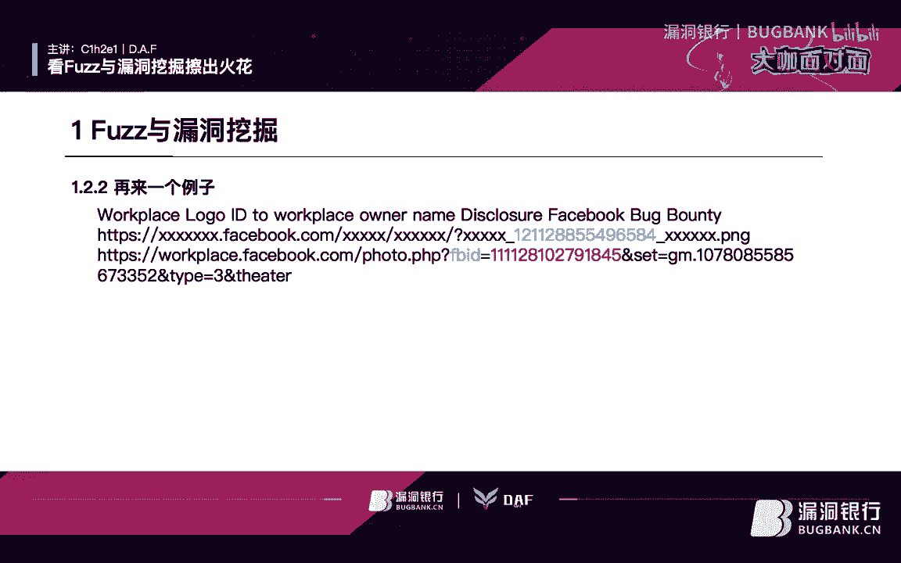
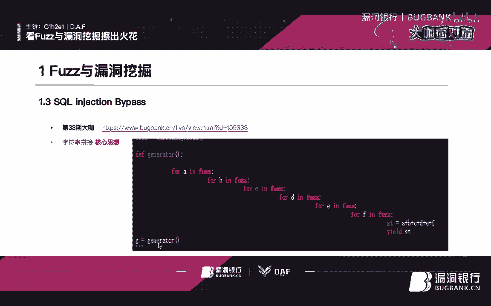
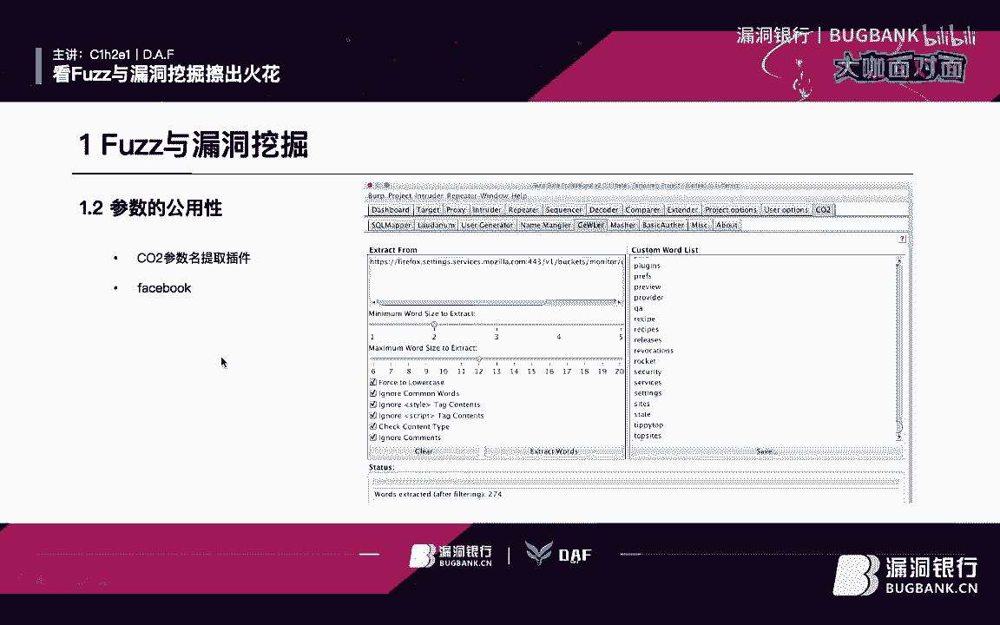
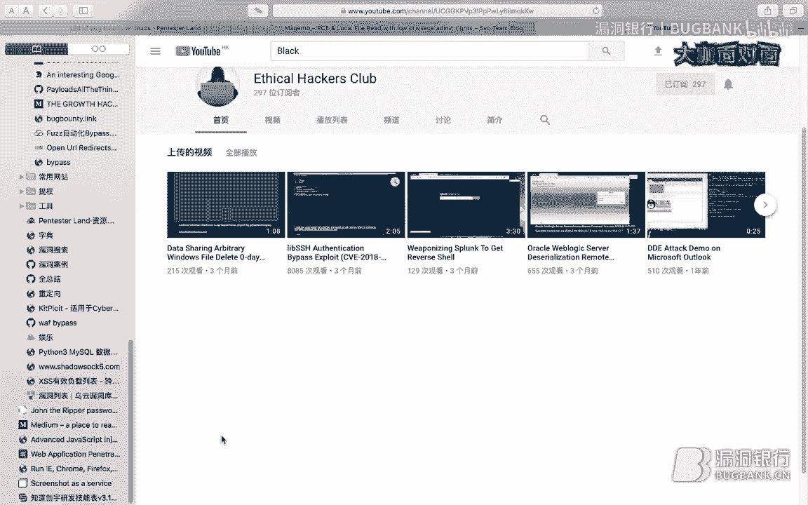

# 课程 P1：Fuzz技术与漏洞挖掘实战教程 🎯

在本课程中，我们将学习如何将Fuzz（模糊测试）技术应用于漏洞挖掘。我们将探讨核心思维、实用工具和具体案例，帮助你理解并掌握这一在渗透测试中极具价值的方向。

## 概述

Fuzz技术是一种通过向目标系统输入大量、非预期的随机数据，并观察其反应来发现潜在漏洞的方法。它在软件测试和安全研究领域已发展多年，如今在渗透测试中的应用也日益广泛。本节课将聚焦于漏洞挖掘场景下的Fuzz技术应用。

## 核心思维：漏洞挖掘的“核心素养” 💡

在深入学习具体技术前，我们需要建立一个核心思维框架。这类似于“核心素养”，它比单纯的知识储备更重要，决定了你能否灵活运用技术。这个框架包含三个关键点：

1.  **目录Fuzz**：核心是寻找潜在的漏洞入口点。只有先找到可能存在问题的目录，才能进行后续的深入利用和挖掘。
2.  **参数Fuzz**：核心是寻找可利用的参数。例如，寻找用于调试、权限控制等可能引发漏洞（如越权）的参数。
3.  **Payload Fuzz**：核心是绕过（Bypass）各种限制。在许多情况下，手工绕过非常繁琐，而通过Fuzz生成大量Payload进行测试则高效得多。

掌握以上三点，并将其应用于实践，是有效挖掘漏洞的关键。接下来，我们将带着这个核心素养，进入具体的技术分享。

## 一、敏感目录扫描与Fuzz

以下是进行敏感目录扫描时常用的几款工具：

*   **DirBuster**：一款经典的目录爆破工具。
*   **Wfuzz**：功能强大的Web应用Fuzz工具，命令行界面非常高效。
*   **DirSearch**：另一款流行的目录扫描工具。

在实际使用中，`Wfuzz` 和 `DirBuster` 应用较多。`DirSearch` 虽然很多人喜欢，但作者个人更倾向于使用 `Wfuzz` 的命令行界面。

### 案例一：Hidden XSS漏洞

这是一个经典的案例，展示了目录与参数Fuzz的结合。

*   **原文链接**：可在相关安全论坛找到该案例分享。
*   **工具使用**：案例中使用了 `Nikto` 工具。虽然 `Nikto` 常被视作漏洞扫描器，但其重要功能之一是**敏感目录收集**。使用命令 `nikto -h <url>` 即可开始扫描。
*   **漏洞发现过程**：
    1.  访问目标链接，返回一个空的响应，看似无法继续。
    2.  利用 `Wfuzz` 进行子域名爆破，并使用 `--hh` 参数过滤掉整个响应包大小为特定值（如53字节）的结果，从而排除无关页面。
    3.  在URL中使用 `FUZZ` 关键字作为变量位置，配合字典进行Fuzz。
    4.  最终爆破发现了一个 `item` 参数，向其传入值后，触发了一个XSS漏洞。这可能是遗留的调试接口未关闭所致。

这个案例完美体现了核心素养的前两点：**目录点的寻找**和**可利用参数的寻找**。

## 二、参数功能性与Fuzz

参数Fuzz旨在发现那些具有特定功能、可能被利用的参数。

### 工具推荐：CO2

如果你使用Burp Suite，可以在其扩展商店中找到 `CO2` 工具包。它非常实用，例如其 `SQLMapper` 模块可以配置后自动化运行SQL注入测试。此外，它包含的 `Param Miner` 功能（通过右键请求包发送到该模块）可以自动从响应中提取参数，这些参数可作为后续Fuzz的输入，极大地提高了效率。

### 案例二：JSONP劫持

这是作者本人的一个实战案例。

1.  **背景**：在一次授权测试中，目标有6个业务子域名。
2.  **参数提取**：使用工具对其中一个子域名进行参数提取，发现了一个回调函数参数（如 `_cb_`）。
3.  **思路延伸**：主站是一个金融站点，发现其多处使用JSON传输数据，但并未携带 `callback` 参数。
4.  **Fuzz应用**：尝试使用 `Wfuzz` 加载常见回调函数字典，在主站相关接口上添加参数进行Fuzz。
5.  **漏洞触发**：成功发现某个参数可用，从而实现了JSONP劫持攻击。

这个案例说明了**参数功能性**的利用：在一个子域名发现的参数，可能在另一个子域名或主站同样有效。

### 案例三：Facebook越权查看

这是一个来自外部分享的简短案例。

1.  **现象**：每个公司的头像都有一个独立的ID，形如 `xxx-数字-xxx.png`。
2.  **Fuzz思路**：在用户自己的 `workplace` 区域，有一个上传照片的接口包含 `fb_id` 参数。
3.  **攻击**：将其他公司的头像ID填入自己的 `fb_id` 参数并访问，稍等片刻后，服务端错误地将该公司所有者的信息返回，造成越权。

这个思路可以迁移：在测试越权时，可以尝试从老页面提取参数，在新页面或接口中“无参数时加参数，有参数时改参数”，可能发现未预期的漏洞。

### 其他参数Fuzz场景

*   **SQL注入**：通过字符串拼接生成大量不同的Payload，配合脚本进行Fuzz，以绕过WAF。
*   **URL跳转 & SSRF**：收集历史漏洞中的常见跳转参数（如 `url`, `redirect`, `link` 等），整理成字典。当遇到可能有白名单校验的参数时，尝试Fuzz这些“被允许但未使用”的参数，可能发现漏洞。对于SSRF，可以Fuzz各种协议、特殊字符和绕过技巧。

**后缀名Fuzz** 在文件上传等场景中非常有用，用于探测黑名单遗漏或解析特性。例如，在挖掘某交易所漏洞时，通过Fuzz上传文件的后缀名，结合简单的命名规则，可能发现服务器上遗留的敏感文件。

**CRLF注入Fuzz**：CRLF（回车换行）注入可用于构造HTTP响应头，实现XSS、URL跳转等。Fuzz的重点在于尝试注入 `\r\n` 以及后续的各种Payload，以绕过可能的过滤。

## 三、Payload Fuzz与工具使用

### 工具：XSS-Freak

这是一个基于浏览器的XSS Fuzz工具，本质上是将Burp Suite的Intruder功能部分实现并包装。它提供多种测试模式，例如打印执行结果、直接执行代码，甚至尝试绕过浏览器的XSS过滤器（Filter）。当你需要测试一些特殊标签或绕过机制时，这类工具很有帮助。

### Fuzz字典的积累

有效的Fuzz离不开高质量的字典。作者通过整合多位安全研究者的公开字典，并结合自身经验（如专门整理的SSRF和URL跳转字典），形成了自己的字典库。积累字典的途径包括关注GitHub上的安全项目、研究人员的分享等。

### 核心工具详解：Wfuzz

`Wfuzz` 被认为是最好用的Fuzz工具之一（主观但实用）。在Kali Linux中已预装，也可通过 `pip install wfuzz` 安装。

**基本使用与过滤**：Fuzz会产生大量结果，必须使用过滤器（Filter）来聚焦。
*   `-hh`：按**整个HTTP响应包的大小**过滤。
*   `-hw`：按**HTTP响应体（Body）的大小**过滤。
*   `-hc`：按**HTTP状态码**过滤（例如排除404、403）。
*   `-hs`：按**HTTP响应内容中的特定字符串**过滤。

**基准线（Baseline）技术**：更推荐的方法是使用基准线。在URL中用一个已知不存在的路径（如 `{FUZZ}/notfound`）作为基准，`Wfuzz` 会先测试它，并将此响应作为基准，后续只显示与基准不同的结果。命令示例：`wfuzz -c -z file,/path/to/dict.txt --hc 404 https://target.com/FUZZ`

**多参数Fuzz**：`Wfuzz` 支持多个变量。使用 `FUZZ`, `FUZ2Z`, `FUZ3Z`... 来定义多个Fuzz点。命令示例：`wfuzz -c -z file,dict1.txt -z file,dict2.txt -d "param1=FUZZ&param2=FUZ2Z" https://target.com/endpoint`

### 对比工具：DirBuster / Dirb

*   **DirBuster**：采用**逐级爆破**策略。先爆破出第一层目录（如A、B），再分别爆破A目录和B目录下的内容。这种方式扫描更细致。
*   **Dirb**：更直接，使用字典进行爆破。可以通过 `-X` 参数指定只爆破特定后缀（如 `.html`）。

## 总结与反思 🔄

本节课我们一起学习了Fuzz技术在漏洞挖掘中的应用。我们始终围绕三个核心素养展开：

1.  **目录Fuzz**：寻找攻击入口。
2.  **参数Fuzz**：寻找可利用的“把手”。
3.  **Payload Fuzz**：绕过最终防线。

在渗透测试中，需要以更开放、更细致的眼光进行探测。将上述三点核心思维应用到实战中，能演化出多种漏洞挖掘方法。例如，当遇到任意后缀都返回200状态码的情况时，可以利用 `Wfuzz` 的 `-hh` 或 `-hs` 过滤器，将正常“Not Found”页面的特征（如特定字符串或长度）设为过滤条件，从而精准地找出那些返回内容不同的有效路径。

最后记住，**保持学习，多看国外优质博客、漏洞平台（如HackerOne、PentesterLand）的案例和Black Hat等安全会议的演讲，不断积累和更新自己的知识库与字典，是技术进阶的不二法门**。