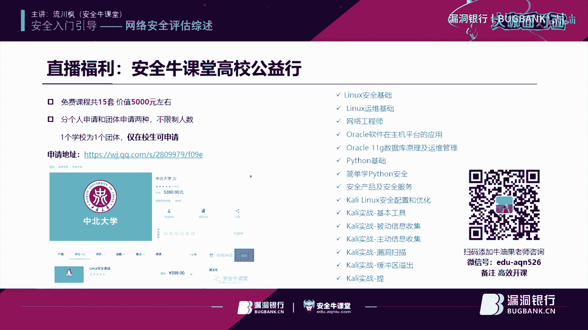

# P1：【录屏】网络安全评估综述-大咖流川枫-漏洞银行大咖面对面第80期 - 漏洞银行BUGBANK - BV18t411m73L

为知识而存，因提手而生。小朋们晚上好。欢迎参加第8期漏洞银行安全技术直播。大咖面对面。我是陈秋秋。那不知不觉，我们大咖面对面已经迎来第8期了，真的由衷感谢各位观众伙伴们的知识和陪伴。

也感谢每一位大咖的新劳付出。那今晚我们请到的是国安天下的金牌合作讲师。刘川风老师做客直播间，与我们分享一个大家都有必要了解的话题，网络安全评估。刘老师在IT息息安全行业与风险管理也有十年的经验。

那今天除了演讲基定内容之外，他也非常乐意和大家分享他的安全从业个人经验，而且刘老师的演讲内容编排以向生动有趣通俗易懂，还特别有几个互动环节，谢谢大家参与。所以欢迎大家登录直播间。

在听讲过程中积极交流和提问。😊，那今晚还会有重磅的直播福利哦。由于本次直播是和安全牛课堂合作开办，那今晚会给大家送出安全牛课堂15套课程的免费学习机会，课程价值接近5000元。

获取方法会在直播的尾声公布。另外呢今晚还会抽取三位吸引观众，赠予由安全牛出版的书籍精选即刊100篇。那这本书外面是买不到的哦。大家一定听到最后来想办法获取它。好，那今晚直播马上就要开始了。啊。

大家晚上好，相信刚才那个通过简单的一个介绍啊，大家。对我也有一个简单的了解啊，大家啊叫我刘老师就行啊，我姓刘。然后呢，目前呢在某外资金融集团啊从事信息安全风险控制的工作。然后呢，在啊IT信息安全领域啊。

从事将近近十0年的。工作，然后呢拥有这些啊相关的一些信息安全行业的一些证书啊，我不仅我不是那种单纯的只会讲我们的。死的知识点啊，我会结合我的工作实践啊，然后去让大家更加深入的了解我想要去讲的内容。OK。

好，那我们就正式开始。那今天呢其实我们是一个安全入门的引导，然后去讲网络安全的评估综述。那么主要啊分为。

三个章节。那么第一个章节呢是常见的安全威胁。那第二个章节呢是系统安全性评估OK那么第三个章节呢是渗透测试的执行。OK那么我们先讲啊第一个章节强见安全威胁。

那通过常见安全威胁这一章节的介绍呢啊希望给大家就是说啊通过简短一个介绍，让大家简单的认识到我们有哪些常见的一些安全威胁与漏洞。啊，那么首先讲啊我们有什么主机漏洞，对不对？

这是我们最常见的那个那个一种漏洞。那我们经常会看到啊我们的服务器，或者哪怕就是我们最简单的我们自己家里用的这个windows电脑，对不对？它也会经常会推一些补丁啊，会打一些漏洞啊，就是由于。

我们啊我们的OS就操作系统。那它呢其实本质上也是一个大型的应用程序。啊，不知道大家听过没有？其实啊有一个理论说是理论上按理论上有个规律，每。1千0行至少1000行代码里面至少要会有一个bug。

那么像微软操这样的一个windows操作系统，它其实也是一个应用程序，它只不过是一个超大型的应用程序而已。那么它里面有成千万啊百万上千万行的代码。

那么它里面可想而知有多少bugOK那么就算它正式上线了啊，推出来，比如说现在最新的win10，对不对？window10，它还会有很多没有发现的这个软件的或者操作系统的漏洞。那么。按照刚才所讲的这个规律。

它里面还有很多骆洞没有发现。那么这时候我们就。出现了主机漏洞OK。那么。尤其对于我们啊尤其对于我们的操作系统，就是我们的线上服务器的操作系统。比如说啊windows2012啊这些服务器版本的操作系统。

那么如果你管理员啊，没有一个啊安全的配置的一个概念的话，那么让服务器都处于一个默认配置当中的话，那么很有可能啊由于这些默认的安全的配置导致啊我们的系统处于主机漏洞的威胁之下啊，我举个自简单例子，比如说。

呃，你在你们公司的这个一台外部服务器上面安装了一个新的搜索系统，windows202012。但是呢。你没有去对你的服务器做hardenening啊，hardenening我们称为加固。你没有去做加固。

ok。那么你没有做加固的话，它采用的是默认配置。那默认配置呢，比如说你的用你的windows的这个账户里面有一个gues的账户。这guess账户呢有不需要使用，它是一个访客账户。

但你又没有禁用它没有禁用它。那么黑客呢它可以尝试利用gues的账户啊，利用word密码能够。先访问到你这个操作系统。啊，黑客呢他能利用那你这个一个主机漏洞。那么这个主机漏洞呢，就像老师刚才所讲所讲的啊。

这也是我们日常生活中所常见的一个漏洞，一个配置的失误。那么你有一个ges的账户，有一个啊访客的账户，那你没有禁用，他利用访客账户能够登到你的系统，然后再利用一些其他漏洞啊。

去去去上传we shell或者上传等其他的一些木马文件，然后去进行提全啊，最后呢夺取你的服务器的访问的权限。这样的话。啊，就造成由于这么一个主机漏洞啊，造成。啊，未经访问未经授权的远程的登录。

所以自定义配置啊，就像这里所写的自定义配置啊，很重要。OK如果未经评估。啊，如果未经评估，可能会在主机中留下缺陷。那评估呢我们在第二章节会讲到，就是我们首先啊需要去做什么安全性评估，发现有哪些主机漏洞。

然后去弥补这些漏洞，那么就是要去自定义配置。那么啊。自定义配置什么意思呢？就是你要设置一个安全的基线。那么你可以简单基线是什么呢？基线就是一个best line是最低的安全的标准。就像我刚才所说。

你们你们企业有一外部服务器，那你的外部服务器，它最低的安全标准什么样子呢？你就按照你们公司的这个安全的需求。那么你配置先安装一个windows的啊windows2012操作系统，然后按照你的外部服务。

然后再去做安全的加固，等所有的安全措施都配完之后，然后对它做一个镜像，那么这个镜像就是一个基线，那么将来你再采购新的外部服务器的时候，你可以参照这个安全基线，啊。

去参照你的原先自定义的认为最安全的配置去安装你的新的服务器。这样的话有个参照，这样才能让后续新的服务器能达到你们公司最低的安全需求O。那这是主机漏洞。好，接来讲软件漏洞啊。将软件漏洞。

那他这里呢提到了很多的。呃，软件漏洞或者说是一些啊针对软件漏洞进行攻击的一些方式。那么我先不介绍这些软件漏洞啊，然后呢我想让大家自己先先先回忆一下，或者大家知不知道。啊，大家知不知道就是。

常见的最常见的三种啊，由于软件开发的。漏洞。而导致的攻击是哪三种攻击？有一个同学我看回答出一个那个答案，缓冲区一出社刻注入。对，还有呢最后一个呢。已经有同学啊回答出两个了啊，还有一个就是XSS。

关咗咗频控节。啊哦，我发现我们同学真的是。果然，正如之前跟秋秋了解的一样啊，就是。我们同学里面真的是高手如云啊。Alsoso入云啊，当然有些同学并不一定说并并没有回答到这三个答案里面中一个。

但是也回答出了其他的相关的软件，相关的漏洞啊，我说的是最常见的什么漏洞O那么最常见的啊，这里我再强调一下，最常见的三种啊，由于软件开发的。15而造啊软件开发的漏洞而造成的最常见的三种啊。

应用程序攻击的手段啊，第一个是跨脚本攻击。第二个设会注入。第三个缓冲区移除OK。那么大家知道这三种攻击的手段，为什么我要把它放到一起讲吗？因为这三种最常见的应用程序攻击的手段，他们引起。

这三种攻击的原因都是同一个，都是由于什么啊？都是由于缺乏对用户输入的验证。OK。那么由于引起的原因都是同一个，那么解决的方案呢也都是同一个，就是增强对用户输入的验证。那么增强对用户输入的验证啊。

我们可以在啊比如说在啊外部前端用户登录的表单那里，对不对？我们可以去利用javascript，或者是利用HTML5它的架构，对不对？做一些用户输入的验证，但是这就够了吗？当然不行，为什么？

大听过大家听过bm suit嘛，对不对？有玩过bm suit的都知道bm suit可以做。啊，做截段攻击，它可以绕过你前端的脚本语言，javascript的那个客啊客户端的本机的检测。对不对？

就像有同学说的，本机教研可以绕过。那么这时候我们怎么样才是一个啊去预防这三种最常见的用程序攻击的。啊，手段的最佳的实践呢，那就是除了在客户端要做一层啊用户输入验证之外，那么在我们的服务端。

在我们的服务器端还要去做二次验证。ok。这是一个最佳实践。对Bump shoot。好，接下来再讲这个软件漏洞。那我们PPT里面提到软件漏洞有什么？灵日漏洞。什么叫灵日漏洞啊？就是说哎这个漏洞刚刚被发现。

那么供应商还没有发布相应的补丁啊。那么它的影响力通常会被放大，并且必有并且具有持续性。比如说现在说啊微软啊windows10，它有一个0日漏洞那如果这个日漏洞，那windows的供应商。

也就是我们的微软还没有发布相应的补丁的时候，这个漏洞，它的POC叫pro of concept，就是它的验证的脚本或者验证的这个思路或者验证的这个这个这个一些应用的利用这个漏洞的程序被人发布到公网上的话。

那么。任何一个稍微有点计算基础的人，都能去通过相应的搜索的手段搜到，就是说啊运行着windows10的这些电脑，然后去利用这样的漏洞去攻破别人的电脑。那可想而知啊，这种零日漏洞，它的威胁啊是非常大的。

还有不合理的输入处理就是就如老师刚才所讲的。啊，不合理的输入处理就没有做输入的验证，对不对？还有不合理的错误处理，玻璃错误不合理的错误处理，什么意思啊？就是说啊。大家在做渗透测试的时候。

尤其做外部渗透测试的时候。对不对？那你不知道。哎，你你你你你不就说这个网站呢，你不知道他过多的信息。这时候呢我去登录他的一个页面，比如说我就访问，就或是他留言留言板或者他的登录的表单。

我就是不按常理出牌。说白了就是那他让我比如说要输入我的一个名字，都是啊数字和字母的组合，我就输入特殊符号。或者说他让我输入的参数，比如说购物车啊，电子商务网站购物车我去。啊，我去。我去下单，按常理。

那你购物车一般正常情况下。你肯定是输入。正值就大于零的值大于等于一的值。那我不按常理输入，我输入-一又会怎么样呢？我输入-100会怎么样呢？啊，这些都是渗透的思路，大家知道吧？就像有同学说的报错注入。

对，包括 serverer注入啊，就是这是一个思路，懂了吗？对，就是说像刚才我说的那种，比如购物车，那它理论上让你输入购物车的那个呃，比如说购购买的这个东西的数量，你如果输入一个负值。

那么这是一个错误的输入，但是啊你的应用程序，如果没有事先做好编码，没有对这种错误。用户输入的错误进行啊预见性进行一个预见性的错误的处理，没有写这样的一个代码。那么可能用程序会崩溃，崩溃的时候。

他可能会直接显示一些敏感信息给攻击者。那么攻击者呢可以看到啊，你这个。报错信息里面的一些你的敏感信息。比如说你的后台数据库的版本，甚至是你的一些网站的配置文件等等。OK那么。还有资源耗尽，对不对？

资源耗尽呢，你就可以理解为比如像doss攻击，对不对啊，或者像我们缓冲器一出，那它它缓冲一出，它有一个。作用就是啊利用溢出的字符啊去让我的应用程序崩溃，最终造成系统崩溃，造成资源的耗尽。

那么这也是资源耗尽攻击的一种方式。还有一种叫静态条件攻击。什么叫静态条件攻击。你比如说像有一些网站啊，比如像有些网站，那你登录的时候，比如说我现在有个贴贴吧，那么你你注册了一个用户，那么你登录。

那么你登录时候，你看到121登录成功之后，它欢迎某某某，欢迎你你看到呢120121里面你的UID就你用你的用户ID它显示为比如说1万，那证明你是第1万个用户，这时候如果啊网站的这个。啊。

编写的代码的人员，他没有足够的安全的意识，他不会啊他不了解静态条件攻击。那么。我把我的URL地址里面的user IDD用户的ID我改为一，我再敲我回车，这时候会出现什么情况啊，这时候我为什么改为一？

首先我讲一下，因为一一般都是管理员第一个用户嘛，肯定是管理员的账号。那如果啊这个网站的。编码的那个就是程序员，他不了解静态条件攻击，他没有在用户切换身份的时候，对用户的身份进行重新验证的话。

那么如果网站啊就是说暴露在静态条件攻击的这个漏洞下面，下面的话，我刚才在120里面，我把我的UID1万改为一的话，我再重新敲个回车。这时候他就会提示说啊，管理员administrator，欢迎你。对。

也称为垂直月权啊，就大概这么一个意思。那这个攻击叫做静态条件攻击。为什么叫做静态条件攻击啊？因为理论上我切换到管理员的身份，再去访问这个论坛，他肯定啊发现我切换了一个身份。

肯定要先验证我的管理员的这个身份，让我输入管理员的用密码，这个登录的界面，但是由于程序员没有安全编码的一个实践啊，没有安全编码的一个意识，他缺乏啊对这么一个用户的一个身份的一个重新的验证。

导致啊静态条件攻击的发生。还有内存漏洞，就是会利用内存溢出或者越权造成了相应的漏洞，比如内存泄露啊，很溢出啊，什么指针啊，整数溢出等等等等啊。那老师刚才只是抛砖引玉啊，这些都是。

最常见最常见的很古老的啊，很古老的很常见的最最最最常见的。就甚至是不值一提的啊这种应用程序工具的方式。但是啊我希望大家如果还有不理解的话，回头自己啊。再多去啊，查一下网上相关的资料，永远记住一句话。

没有任何人能够啊，我看到我们的这个漏洞银行，我看到那个我们的漏洞银行里面有很多期的直播啊，有很多的有很多的大咖，对不对？每一期都会给你讲这个溢出那个一那个攻击。

但是没有任何人能够帮你把所有的东西全部讲清楚，全部让他记在你脑子里，记住你最好的老师并不是这些。课堂上的老师，你最好的老师永远是百度谷歌，这些搜索引擎是你自己，你要有任何不懂的东西啊。

你都需要自己去主动的查资料，去看网上相关的文章，这才是一个正确的一个学习的方式，知道吧？ok。呃，有同学问内存溢出的原因。那是一说原因就像上面所讲的呀。内生一出，那可以有哪些？啊。

工应的方式造成内存的溢出呢啊比如说比如说缓冲区溢出。对不对？比如说缓冲区一出，比如说像什么什么什么DLL注入，包括像利用啊。利用一些其他的相关的攻击的方式。比如说。举个最简单的例子。

比如说像你你要做啊doss攻击，拒绝服务攻击。那么你往这个网站不断的去发送一个提交去po去提交你的访问的请求。然后最终它的内存让它内存耗尽，内存溢出，那也是一种内存溢出的方式啊，有很多种OK。对。

还是那句话啊，师傅领进门修行靠个人就是这个意思啊，大家千万一定要记住这一点啊，学安全。学安全就是这样的，就说你选择了安全行业，那就要做好持苦的准备啊，就要做好吃苦的准备。因为做安全的话。

你不仅需要开发也懂，运维也懂，数据库也要懂。啊，安全管理也要懂，事故响应也要懂，甚至forensic取证也要懂啊，包括我们的什么基础设施架构，网络都要懂，而且每个都要精都要比做网络的，要精通网络。

比做开发的，精通开发，比做运维的精通运维。OK那么。但有同学会说，那我付出这么多努力，为了什么？为什么？那你去看看现在市场上啊安全从业人员的薪资，你就知道为什么了，对不对？OK。

DLL注入就是其实就是啊就是说可以回头再去查一下啊，去去百度一下，看一下它是针对DLL的一种注入的一种方式啊。对啊，呃，有同学说可以不断的发送请求，因为有过滤规则嘛。

重复的IP多多次同一时间访问我就封掉，我可以用不同的路机来访问啊，对不对？那接下来讲什么啊？第三个漏洞，加密漏洞。什么叫加密漏洞啊？就是说一些加密的方案并不安全，或者在游的时间并啊变得并不安全。

那么我们在十个加课程里面有密码学者章节会讲到啊有哪些加密的算法，然后哪些算法是安全的，哪些算法是不安全的每个算法的特点。O那么举个最简的例子，那你比如说像sh算法啊，ush算法MD5对不对？

MD5SHA杠1对不对？这个是一致的被破解的加密算法啊，不不s sorry sorry，我我说的不太对啊，我刚才描述的有点不太对啊，sh不是加密，我只是说这个算法被破解了。

O那你比如说像d算法DS或者3d啊d算法d算法就是是个对称加密算法，但是它已经被破解了啊，包括RC4算法也已经被破解了。那所以说我们需要用现在什么最安全的对称加密算法AS算法，对不对？

O那么你比如说你的系统啊，你的通信，你现在还在用RC4算法或者是像d这样的一个算法，那么由于这个算法本身已经被破解了，已经不安全了，那么会造成你的加密漏洞O。包括执行不力的方案，也会揭示一些缺陷。

比如说啊现在很多网站会用HGB对不对？那HPPS呢啊。我们s家里面都会讲到啊，我们s家里面都会讲到它的工作的原理。那基于SSLTLS安全套电自层。啊，安全套接自成协议对不对？

衍生出来的一个we部安全传输的一个协议。那么你一个网站，比如淘宝，它要发布HGEBS的网站的话，他要在他的官网上去放置数字证书，对不对？如果我的数字证书啊，不是数字签证，是数字证书啊。

数字证书里面包含了数字签名和。Hsh值包括什么我们这个网站的。还是运用的那个。运算的算法，数字签名，还有这个网站的所有人的一个一个证明的一个资料啊等等。包括最重要的什么诉证书里面包含了网站的公钥啊。

这些都是密码学里面的概念啊。OK那么我举个例子，比如说哎你这个证书都过期了，你把这个证书放到你的官网上。我比如说像淘宝。对不对？这不快双十一了吗？淘宝如果他的管理员比较马大哈。他的证书啊都过期了。

他都没有去去这个证书。结果这时候大家去访问淘宝，双十一哪天访问淘宝会出现什么会出现什么界面啊，会出现一个大家有时候经常会看到的一个界面。就是说当前访问网站的证书不受信任，是否给于访问，会有这么一个报警。

啊，有时候有些用户就直接把它关掉了。为什么会做报警啊？因为他的数字证书过期了啊，这也是一种执行不力的方案揭示的一种证书的漏洞。OK。包括不合理的密钥管理会引起漏洞，对不对啊？

数字证书里面包括了你的公钥啊，公钥是由淘宝这个网站管理的那淘宝这个网站它得有一个对应的私钥啊啊，这都是密码学里面的一个概念。那私钥淘宝这个网站它得保存好。如果他就简单的放在外部服务器上。

甚至这个目录能够公开，让所有人都能访问。那么你这个网站跟任何人的HTPS的绘画，就基本上是大白于天下，基本上就是全部是明文的，懂了吗？这是不合理的密钥管理引起的假密漏洞。OK。

接下来讲什么网络架构的漏洞啊，什么叫网络架构的漏洞啊，我举个最简单的例子，那很多公司对不对？现在都有防火墙，那防火墙有好几种架构，现在像银行，对对像我们所在的金融机构，肯定至少是三层架构。

什么叫三层架构，至少有三道防火墙，隔开四个网络，从最外围到最里层，这是三道防火墙隔开的四个网络，分别是什么网络呢？从最外到最里，分别是英特网。外部DMZ这内部DMZ Z和我的内部网络。

为什么要把我的内部网络和in特网中间要隔开2个DMZ这啊啊，大家知道为什么吗？就是由于我的内部网络放在我的数据库服务器，放在我最核心的数据。那你每经过一道物理防火墙的时候，都得开相应的规则，懂了吗？

这样的话就加大了英特网能够访问我内网，攻破我内网的一个难度啊，这叫三层防火墙的一个架构啊，这也是我们学家里面的内容。OK那么典型的一个网络架构设计的漏洞。比如说一个小的公司，那他也买了一个防火墙。

这时候老板问这个网络管理员说。啊，我们现在要要要部署这个网络啊，要部署一个网站，对不对？我们公司要部署一个网络，你来设置一个架构。结果这个网络管理员他如果没有安全的一个基础的知识。那他就买一道防火枪。

买一个物理防火枪，然后把英特网和内部网络隔开。然后呢，他的内部网络里面不仅放着他的公司的办公的电脑，数据服务器，还放着他的对外提供服务的外部服务器。那这样的话，英特网和你的内部网络之间只隔了一道防火枪。

那这时候会出现什么一个问题啊？这就出现了网络设计架构的一个漏洞，出现一个什么问题啊？我的内网没有和我的提供公网服务的这些服务器做隔离，这样的话会导致什么问题？比如说英特网用户他透过防火墙。

通过相应的规则，访问你的外部服务器的时候，这不就越过了这个防火墙吗？但如果你的外部服务器有漏洞。他攻破了你的外部服务器之后，你的外部服务器和你的内网，比如说你内部办公的电脑，你财务的电脑啊。

老板的CEO的电脑啊，对不对？大老板的领导都在一个局域网里面，这时候他可以这台外部服务器作为跳板去进一步攻击你的内网懂了吗？这就是一个网络架构设计的漏洞。我们接下来看啊，我看有同学在问问题啊。对。

物理隔局安全呢叫air gap，这也是个目前很流行的概念。就是说你要想让两个网络完全隔离，先从物理上完全隔离，这叫air gap啊。air gap这是这科学家里面的概念OK。啊，对。

防火墙老实来墙防火墙一般是硬年防火墙啊，当然也可以部署软件防火墙，像微软的啊微软的那个那个叫什么SA软件防火墙。就是说无所谓硬件防火软件防火墙功能实用功能都一样的。

OK那么有同学提到wafwa叫web application firewall啊，叫应用程序防火墙。它专门是部署在网站上的，专门防护网站的防火墙。跟老师刚才所说的那个传统异常防火墙并不是一个东西OK。

对，庞站啊庞站也是一个入侵的思路啊，庞站也是一个很很很坚硬的一个入侵的思路啊。可以这么理解吧，有点像庞站入侵。庞站入侵其实最经典的意思就是说比如说啊比如说。你现在去攻破淘宝。淘宝都是安全。顶尖的大牛。

找的都是安全顶尖大牛，攻破不了淘宝怎么办？哎，你发现淘宝它那个服务器是放在阿里云上面，那他那个放在阿里云一片区域上，一片虚拟机上面，你就去买那个同样的一片虚拟机的区域，你去攻破。

我我老师这里老师这里只是举例啊，并不是教大家做坏事。我只是举个例子啊，只是举例啊啊，我先讲清楚啊，这时候呢你公布不了淘宝，那么你去租赁淘宝它这个网站所在阿里云上面的同样一块或者相近位置的一个服务器。

再或者在一个局网里面的一个服务器。啊，你去攻破那个服务器上面的网站，是个小的网站，可能小的公司的网站。你把它攻破之后作为跳板。因为它跟淘宝的服务器是在一个局网嘛，然后再去攻破淘宝的服务器，这样会更快。

这个叫庞战入侵啊啊，跟刚才老师讲概点有点类似，但不是一个东西啊。对，当然我这只是一个思路啊，做渗透测试就是思路很重要。啊，因为你能想到安全专家也能想到。

那淘宝不可能把他的服务器跟其他公司的服务器放在一个局网的。懂了吗？系。接下来讲什么账户的漏洞啊，就是账户配置漏洞。那老师刚才讲过，对不对？我们安全分很多类别啊，有做房控制。

有做啊在外资企业里面叫IMident access management叫什么房控制。就就就防控这生命管理，这是一个专门的一个岗位或者一个部门。啊。或者一个团队。那账户漏洞就属于IM里面的一部分。

它也属于安全OK那么它处为管理你们公司所有的访问权限的控制。那如果你没有进你没有对你的。用户访问的权限做严格的一个访问的身份的控制。比如说没有金融游客账户啊，没有设置密码，强制过期。

没有设置复杂的密码等等，都会造成相应的账户的漏洞。我举个最简单的例子，比如说你没有设置强密码的策略。没有通过计手段去实现强密码策略。那比如说我们公司每个人电脑都可以任意设置。后来。

那老板的电脑如果设置为123456，对不对？啊，因为老板一般年纪都会比较大，很懒，他设为123456，对不对？他的电脑。哪天如果出差丢了。如果丢了，别人捡到了开机密码，就是123456一下就登进去了。

能后看到你们公司的财务报表啊，如果是个上市公司，能看到还未披露的财务报表啊，哈看到看到看到你们的工资单，看到你们的公司的客户信息等等。那你们你们这个公司基本上离破产也就不远了，好吧，OK。那。

就是由于那为什么公司很有可能会破产呢？就是由于123456这个密码，就是由于你的安全管理员没有实施。抢密码策略没有去堵住你的账户漏洞。就这么很小的一件事情，懂了吗？OK。啊，有同学问CDN是吧？啊。

我再看一下，我也不太记得了啊啊。叫SSDN软件定义网络嘛，CDN是什么？然后是是是电信的一个一个一个东西啊。你接下来讲啊，继续讲。操作漏洞。操作漏洞就是什么啊识别漏洞。就说未经培训的用户。啊。

缺乏对关键业务的一个规划啊，系统蔓延。就是说操作啊，在我们这个风险管理的那个。She。啊，这边就是啊对就代理负债均衡OK。像其实这些问题，那有可能以前我知道。对不对？但是我毕竟不是硬盘。

我不可能这个东西记住，我就。忘不掉人都有记忆曲线，都会忘掉的。所以说为什么我建议大家，我从开课一开始我就告诉大家。最好的老师是是什么？是百度谷歌，你有不会的，或者说你已经淡忘了的东西，你就自己去查资料。

像刚才那个问题，CDN是什么？我就直接把它原话复制粘贴到百度里面一查。对不对？你要有的答案就应有尽有都有了啊，所以说啊要养成这个习惯啊，做技术尤其做安全，必须要养成这种习惯，好吧。

OK当然那个无所谓什么搜索引擎了啊。啊，在风险管理啊在风险管理这么一个一个领域里面。那么专门有一个风险叫操作风险。操作风险啊。包含了运营、运维，包括人员这方面的很多漏洞。啊，形成由于操作风险型的漏洞。

叫做操作漏洞。比如说人的原因啊，没有良好的啊计算机安全的习惯，或者说缺乏对关键业务流程规划等等，都会造成相应的操作漏洞。其实大家记住啊，人永远是最大的漏洞。记住这句话。啊，就是说。经过研究发现。啊。

百分之就说。就是成功发生啊重大漏洞、重大攻击的这些事件里面。啊，60%甚至70%以上都是由。内部人员引起的有内鬼，或者说内部人员恶意攻击。都是人为的啊。并不是外部。啊，说是有什么漏洞。

而造成或者引起的啊。好，接下来就是说一个。练习问答互动。其实说是练习问答互动，其实我更希望是一个自我思考的一个问题。我希望大家看这个问题啊，因为时间有限，我也不会就是说再去啊问大家，就是说你的解答什么。

但我希望大家看这个问题。他说比如说现在有个公司叫develop啊develop tech公司。那有人要求你来评估这个公司漏洞。比如说你现在就是这个公司的。网络管理员。安全管理员。

那你的老板要求评估你们自己公司漏洞。那么要看这个任务，你需要确定现在会影响你业务的常见的漏洞是哪些，然后出一份漏洞评估的报告。在这之前。那么你首先要做的什么？你自己想一想，我这里给大家一个提示啊。

就是大家就课后自己去想一想。因为我们刚刚讲完了识别漏洞嘛。你最关键的是什么？大家知道吗？最关键的是业务这两个字。啊，一定要了解这一点。啊，我相信这里有些已经工作的同学啊，已经有有些同学已经工作了啊。

就说你做安全的目的什么呢？是为了为业务保驾护航。公司最挣钱的是什么？是业务。一个公司存在的目的什么？是为了挣钱，懂了吗？公司靠什么挣钱，靠业务挣钱。那你做安全是为了什么？为了保障业务的。安全运行。

所以你首先要了解你所在对，就像有同学所说的，你所在公司的业务是什么？一个银行跟一个生产。矿泉水的一个公司，他的安全的需求肯定不一样。首先你要了解你的业务是什么，在根据的业务分析有哪些漏洞。

然后下一步去让管理层知道现在有哪些漏洞，然后根据他的风险偏好来决定怎么处理这些漏洞。啊，最终啊去接受风险也好啊，降低风险也好啊，或者说转移风险也好啊，各种各样的方式。啊，这才是做风险管理的一个思路。

好吧。O好，刚才讲完了识别漏洞啊，我们简单的啊介绍了一下，就是说识别漏洞有哪些漏洞。接下来讲找出漏洞。我知道有哪些漏洞，我怎么把它找出来呢，对不对？我可以通过安全评估的方式，那么可以通过漏洞评估的方式。

安全性评估的方式去找出相应的漏洞。安全评估呢有一些技巧，比如说审核的基线，什么叫基限。还记得吗？啊，老师刚才今天。刚才讲过的什么叫极限best line？最低的。安全需求叫基限。大家还记得吗？

那你自己安装一个web操作系统，那安装一个windows的啊，安装一个web应用程序服务器，安装完操作系统，安装完web应用程序之后。你按照你的公司的安全的需求，那对你的服务器，对你的应用程序做加固。

做加固之后你大家做一个镜像，这个镜像就是基线。将来你可以通过基线的对比。来发现你的服器的异常。比如说一开始啊你的一台服务器按照基线配置好了，上线了，就果你发现这个服务器，你怀疑遭受了攻击。

这时候你把这个服务器拿下来和你的基线做对比。你会发现，比如说你的C盘stem32下面有个文件，系统文件啊，你的应用程序是不会更改它了。但这个系统文件原来只有10K，现在变成了10兆，那么很显然。

这个文件很有可能。系统文件遭受了替换，被黑客遭受了篡改，这就是通过基线对比，去发现问题，发现漏洞，去做安全性评估的一个技巧。OK那么还有什么审核代码啊，去做代码的审核，代码的安全的审核，包括确定攻击面。

什么叫攻击面，就是可能会攻击你的那个漏洞。比如说我的ges的账户，我的访客账户啊，我不需要使用，但是我没有借用它，这可能就是对你的服务器形成攻击的一个攻击面。你要确定所有的攻击面，才能。

知道可能有哪些漏洞会被人利用，被攻击。这时候。我把所有的漏洞全部找出来，把漏洞都堵上，才能让黑客没有任何攻击的这个渠道来攻击你。而我们需要做安全架构的审核。对唔对？啊，去做安全架构的审核，去做啊。

像刚才所谓的网络架构的审核，就属于安全架构审核的一部分。还有审核安全的设计，就你的安全方案是我满足组织的需求。那还是那句话，首先你要了解你的业务需求。啊，根据业务需求判断，不管是甲方还是乙呃。

就是自己公司给出来，还是乙方winnder啊，供应商给你的安全解决方案，你这要看是否满足我的需求。首先它的功能得满足你的需求。其次，它的安全的架构设计啊，符合公司的安全的标准OK。那接下来找漏洞。

刚才讲过安全性评估有这么一些技巧，有一些方式，可以通过基线，可以通过代码的审核，可以通过确理工具面等等来做安全性评估这些技巧。但是我具体评估的时候，那又有哪些工具可以使用呢啊。

这里可以看到各种各样的工具漏洞扫描器啊，像us对不对？常见的端构扫描器MappAPP scan协议分析仪玩要。对不对？TCP dump指纹识别工具，比如像原来linux自带的finger操命令。

就是当然这个指纹它是直译过来的啊，为什么会有指纹识别工具？大家知道原来linux里面unux里面自带一个很古老的命令，叫做finger命令。finger中文翻译过来叫做指纹。

但是他原本的finer这个英文的意思。就它没什么含义，它这个是个命令finer，它的命令就是能够去识别网络上的主机的操作系统，包括它上面操作系统的一些运行的服务的信息。ok。那么这就是指纹识别的工具。

OK。还有网络枚举器，比如说映射网络的逻辑结构，比如bum suit或者一些相应的软件，像甚至Mapp都可以爬或一些爬虫的程序，都可以爬你的网站的逻辑结构，包括密码破解器啊，包括。像美杜莎啊。Hja。

就是暴力密码破解的工具，包括bmsuit，有暴力破解备份的工具啊，备份的工具最简单，你备份的工具，你可以利用微软自带的一些备份的一些工具啊，具体什么命令我也忘了啊，叫什什么什么B。什么什么。

反正里面带backup这个字样啊，带这样的一个缩写字，就备用工具有很多种了，你可以用过专业的工具，可以用过windows，比如自带的工具做备份或者数据库自带工具去进行备份蜜罐啊，什么叫蜜罐啊。

这个蜜罐可不是非洲的那个平头哥，他指的是他指的是我故意把一台。看似是我的正常运行的一个外部应用程序啊，外b服务器。我把里面的这个重要的数据全部删掉，把它放到公网上。然后我也不做任何的安全的加固。

这样的话。这样的话啊，我把它放到公网上的时候，黑客就可以过来攻击他。那么我在密罐这个时我在。什么是密罐呢？秘罐？就是我刚才所说的，我故意放到公网上供黑客来攻击的。

并且没有做任何加固的一个一个应用应用程序系统。那么黑客来攻击他的时候，我在这个系统就是所谓的密罐上面，我去开启详尽的一个日志记录的功能。那么黑客过来攻击成功之后，我再去收集这样的日志。

我看黑客是怎么样一步一步去攻击，最终得夺取我的服务器的权限的。从而我知道。别人怎么攻，我才知道怎么防才怎么样才知知道我该怎么样去防护我的外部应用程序，知道吧？还有漏洞扫描的类型。

漏洞扫描类型呢就是说啊其实做安全评估。那么从技术手段来讲，最主要的安全评估手段就是做渗透测试或漏洞扫描，那漏洞扫描或渗透测试，那它是技术评估的一个最常见的一个手段去做渗透测试的一个手段。

最终他要出一个啊漏扫的报告，漏洞扫描报告或者说渗透测试的报告，那么漏洞扫描具有哪些类型呢？比如说有无线漏洞扫描的工具，对不对？像卡里它里面自带的aircrack，对不对？包括凭证的扫描对不对？

去去做啊凭证的扫描去去扫描你的就可以做在线的密码暴力破解，比如说hidr，对不对？包括非凭证的扫描，从普通用户的角度扫描等等啊，这个大家简单看下就行。啊。

还有一个误检误检就是错误的被确定为漏洞了某些东西。什么意思啊？就是说举个例子，比如说某一天你扫到说我的网站开放了52啊5424端口。那你不知道这个端口是干嘛的，你就把它封掉了。那这时候有用户反馈啊。

网站啊工作不正常了啊，原来这是一个误报啊，是一个误报。因为这个端口的确是网站在使用的。O就是这个意思啊，接下来是一些评估漏洞的准则啊，老师也不一一细讲啊，大家简单看一下啊。有同学这个问题问的很好。

那你密官方的公网上。如果黑客把日志删了怎么办？那你可以把日志远程的传过来呀，实时的传过来呀。大家听过。有些机密单位，他那个日志是怎么保存的吗？他担心黑客做完了，他担心黑客啊，做完了渗透之后。

攻破了你的网站之后。再去删日志，擦出他的脚印。你知道他怎么做吗？啊，有些保密单位，他是把这个日志打印出来的。啊，就说你这个服务器啊。他的日志一旦生成，是立即传到一个单独锁在一个房间里的打印机上面去的。

然后里面有准备好了很厚的纸张，然后他会实时的把这日志打出来。这样的话，你黑客再怎么牛，你是进不到这个房间去撕毁或者烧毁这个纸质的日志的OK。好。那接下来找出漏洞，有一些相关的练习。

我希望大家看一下自己课后去练习一下。如果你没玩过的话，试一下，通过w sha去抓包。看看你能抓到什么包，看一看你抓到的包里面的协，利用oneshop这个自带的协议分析的作用。去看一下你这个包里面。啊。

是哪些内容？OK。第二个就是说通过比如说像MBACA啊，或者像现目前主流的一些漏洞扫描的工具啊，去对你的windows server进行漏洞扫描。但是这里我讲一句，真正的黑客攻击的时候。

它会尽量使用轻量级的轻量级的工具。甚至是就是windowslinux这种自带的这种就很常见的工具，就越常见的越轻量级的这种工具。越会容易被黑客去使用，用来去收集信息，他宁可多花点精力结合各种工具去使用。

他也不会说一次性的使用这种大型的扫描工具，像nsense或者MBSA去对你的server进行扫描。为什么？那肯定有人会问，哎，像我ns像这种商业的工具。我对你的windows操作系统做一次完整扫描。

他能出一个完整的报告，你把你所有的漏动展示给我看，是没错，但是。管理员也会受到报警，因为这种工具它的动作比较大，很容易触发报警，懂了吧？哎，这是一个经验啊。好，这时候再讲。第三章节啊，执行渗透测试啊。

执行渗透测试就是刚才讲过第一章节讲过识别有哪些漏洞。第二章节就是说我们怎么去识别漏洞，通过做安全评估，讲了一些安全评估的技巧和准则。那么这时候呢第三章节就是具体讲一些执行渗透测试的一些技巧啊。

执行渗透测试的一些一些一些事例啊，给大家看一下那渗透测试啊，相信啊我们这里听众很多都是白帽子，大学生啊，听说那我也不需要多讲渗透测试是什么了吧，对不对？一听名字就知道渗透测试呢也有很多的技巧。

老师刚才已经讲了一些实际工作，实际中的技巧。对不对？有同学问国内访问，国内的外部服务器和国外访问，国内的外服务器有权限区别，有没有防问规则，当然访问规则了，对不对？长城防火墙对不对？这就是访问规则了。

对对，防长城防火墙，这就是这是一个访问规则。啊，你为什么访问不了？谷歌，你为什么反问不了不了facebook？啊，这就是国家层面的防律规则。好。渗透测试的技巧有侦查，有初步利用，有权限扩大，有跳板。

有维持。很多种。对不对？跳板就刚才有同学说的庞站攻击，权扩大就是提权侦查就是所谓的踩点收集信息。啊，跟我们刚才所说的一个知识点相关，大家还记得吗？就老师说。应用程序攻击的漏洞里面有一个说不正呃。

就是说错误处理。如果一这个应用程序管理员没有及时呃没有就是说足够的编码的安全的编码的是编码的一个意识，他不会正确的处理用户的这个错误输入。那么可以被黑客用来利用。对不对？

去最大可能的收集你的这个目标的信息OK。啊，这个批啊回头我可以问一下老师啊。那这里我就正式回答大家一个问题，我相信有很多同学在问。一开始有同学在问，包括很多同学一开始像我原来也有这样的一个疑惑。

深度测试的一个基本思路是什么？啊，这里我给大家讲一下，简单的讲一下，我以web渗透测试为例，我以web攻击为例。啊，我以外国公击为例。首先我要讲的是在渗透测试。在你攻破一个网站。

攻破一个应用程序的这个过程中。在一次成功的攻破啊，在一次成功的渗透测试的这个实践当中，70%甚至80%甚至90%以上的时间都在干嘛？都在踩点，就是所谓的收集信息。那收集信息的技巧我还讲过了。

没有哪个黑客会傻到。啊，除非你是自己部门企业内部的测试，没有哪个黑客啊，真正傻到，他会去利用那种nsus这种大型的漏洞扫描工具去扫的。要不然一般公司的这个防火墙早就报警，早就把你给封掉了啊。

早就来被茶水表了。一般他会利用各种各样的小的那种工具m。啊，M mapAPP scan啊等等。包括很种古老的工具或者新的工具，这种轻量级的被动上面的工具去扫。从而收集你的网络的各种信息。

包括他自己会尝试去看你有没有错误的啊错误的输入的。错误输入处理的这么一个机制。他会自己。比如说购物车，就像我才所说的，他出个-100，或者说他看有没有接到条件攻击等等。他会通过各种方式啊来看啊。

来看你页面会不会返回一些报错，会会出现一些异常，能给他足够多的信息。等你把所有的信息都收集完了之后。我举个最简单的例子，比如说你发现一个网站啊。啊，我现在就以外b网站攻击为例啊，比如你发一个网站。

你想要公布这个网站，对不对？它有前台，网站一般有前台，有后台，那后台是用来干嘛的？往前台发布新闻的，对不对？那么我把这个域名，比如说放到遇见这类工具里面，它专门扫后台的啊，我可以扫到后台的这个地址。

扫后台的地址呢，一访问，那肯定需要就是一个登录的界面，很简单，让你说用密密码，这个你怎么办？像早期这购的方式，你可以通过明小子阿D等这种工种各种各样的工具啊，你去暴力破解。

或者通过现在一些目前的相应的工具，或者通过社工的其他anyway，不管各种各样的手段，你能得到他的后台的一个账户，用户名和密码。然后你用这个用户密码登录进了后台。OK登录进到后台，这就是初步利用。啊。

当然前面70%甚至80%甚至90%以上时间都在侦查，去找后台的信息，去找他的这个漏洞。因为你登录进后台，有个毛线用啊，因为你大部分登进去可能都是普通的。可能都是普通的一些账户，没有毛线用的，你知道吗？

没有用的。你大部分时间都在侦查你侦查什么啊？比如说我在他UR1里面，我随便输入一个错误的参数，超过了他这个输入的限制，它会报错，提示后台的这个ip patchch的版本，比如说是5。0。

这时候你会发现哦，ad现在都升级到10。0了啊，5。0它有什么漏洞，你再去百度搜ip5。0有什么漏洞啊，再去发现网上利用ip patchch5。0的漏洞的一些验证包，你把这个包先下载下来，然后。干嘛啊。

去扫后台，然后暴力破解，得到他的密码或者通过其他市用个人手段得到他的密码之后进入后台进入后台，你只是一个普通用户，你没有超级管理员，就算你有超级管理员，你只只是一个后台的管理员。的用户。

你没有得到服务器的访问权限，这时候怎么办怎么办哦，你可以。利用后台后台一般都是干嘛的？一般往前台发布新闻发布链接的，可以往服务器上传东西的。你可以利用上传的接口去上传。刚才所谓的比如说ip5。

0的验证的。利用这个漏洞的验证的这个程序，或者是你的木马或者web shell。我们一般称为web shellweb shell就是专门针对web的木马文件。成为码web shell。

我不管你通过各种技巧，通过各种方式在利用各种其他漏洞，把we shell上传到服务器之后，这是最主要的最终的目的。把web shell串成个服务器之后。

你再从浏览器从外围去访web shell的一个绝对路径。这时候你会看到这个web shell里面啊这种web shell就是网页版的木马，能看到里面各种各样的功能。

最主要你要利用它的一个什么功能提全的功能，把你当前的这个用户。提全成为一个超级管理员用户，或者是在当前的系统里面去创建一个管理员账号，把它加到管理员组。

这时候你在利用这个管理员账号去开通你的这台web网站所在的服务器的3389或者其他相应的一个远程房问的接口。这时候这台服务器才真正的被你控制。这台服务器被你控制了，你就完成了这台web服务器的渗透。

那接下来你仅限于对这台 web部服务器做渗透吗？当然不是，那你可以把你的脚印擦掉啊，把你的后门什么都留着啊，把它隐蔽起来。将来用用它作为你的肉机，或者是恰好你发现它扫你扫C段啊，你扫它的局网。

你恰好发现哎它同网段竟然还有淘宝的一台服务器。好啊，你再利用这台服务器作为跳板再去。尝试去对淘宝的服肌发动攻击，然后再去渗透淘宝的服务梯，再利用同样的方式。懂了吗？啊，这叫跳板。ok。

那你比如说公最终你得到了淘宝的这台服务器或者更重要的一台服务器的访问权限之后啊，你都要干嘛？你不如说我事情做完了就留在那里了。当然不是你要干嘛，你要擦脚印，你要把你脚印擦掉。

然后把你的后门悄悄的隐藏起来，然后把你的端口暂时的比如说隐蔽起来，先关掉啊，至少你要保证把你的脚印擦掉，你做的事事情都不要留下任何的痕迹，把你做过的事情的日志都删掉，然后留一个后门。

等下次你想要再来访问这台服务器的时候，再偷偷摸摸的利用你留到这个后门访问进去，这才是一个完整的啊，web渗透测试的一个思路，这就是思路。啊，你们不是在问思路吗？这就是思路。你只有做过你才知道。

你可以拿一个虚拟机，你自己去下载一个网站，一个一个呃开源的网站，一个论坛程序。你装在自己虚拟机里面，你再利用这些渗透的这个思路，自己利用各种工具，利用网上一些文章自己去尝试攻破好吗？OK。

当然现在主流的啊以前外部渗透很火的，前几年当然现在也很火，对不对？但是现在啊你也会看到像前几年的报告，对不对？像阿里啊，像阿里巴巴，对不对？像我们的那个。淘宝每年双十一对吧？

他都会出出用户消费的一个报告。比如像前几年，像去年双十一的报告是说，发现啊双十一当天这个下单的这个用户啊，60%以上都通过手机移动终端进行下单的OK那么也就是说。我们现在不仅要关注外部安全。

还要更多的关注到什么移动终端，移动设备安全，这也是一种渗透测试的一个专门的东西。那么它就涉及到比如说安卓。对不对？涉及到这种移动嵌入式的操作系统。等等。我举个最简单例子，比如说以前你访问网网银。

你一般都是在电脑打开网银访问，现在不是吧，现在有很多种手段，我可以下载比如手机银行的APP。我还有电话银行，我还有微信银行，我会关注这个银行的微信公众端。对不对？很多种手段。现在外部安全。虽然也很重要。

但并不是当然我觉得也蛮主流的，但是现在越来越多的这个趋势是转向。就是我们在金融集团内部也逐渐的在强调这一点，要注更多的注意力，要转向移动设备安全。啊，包括移动设备安全。

因为用户的这个消费习惯逐渐转移到我们的平板电脑，我们的ipad，我们的手机上面就是移动安全，就是移动安全。那它涉及到很多相关的东西，比如说安卓。啊，比如说javascript。比如说wifi对不对？

因为移动设备都用wifi的呀。懂了吗？Okay。😊，那有同学问具体怎么学啊，有有同学问具体怎么学啊，那大家都知道看到这个右下角安全牛课堂了吗？安全牛课堂。那么安全牛课堂里面啊有很多各种各样的课程。啊。

大家可以到里面去找javascript安全，安卓开发安全等等啊。来去找相应的课程，好吧，OK。那深度测试，那从常规意义上来讲。啊，渗透测试。或者说常规意义上的这个测试，它主要分为。啊，常规意义上来讲。

测试可以分为黑盒测试，白盒测试。黑盒测试呢，比如说你现在新开到一个网站啊，或者说有一个啊应用程序，对不对？那么你从外围。去测试它的功能，而不去看它的代码，这叫黑有测试。啊，什么叫白盒测试？

白河测试就是你把这个产品像一个盒子一样，你把它打开，大白于天下。你要去看到它每一条代码的这个执行的脉络。OK那么这叫白盒测试，要去分析每一行代码。灰盒测试就是黑盒测试，白盒测试结合起来，这试一种手段。

大家做个测试都知道啊，渗度测试的工具。那老师刚才讲过一些具体的渗度测试的工具。当然工具的类型按照工具类型来分的话，还有一些比如说框架利用的工具，比如说strs to对不对？利用的工具，数据清除的工具。

信息隐藏的工具啊，比如说加密的工具，对不对？就属于信息隐藏的工具，社交工程的工具。我举个最简单例子，像你正常的一个手机就可以做社交工程的工具。所以工程学工具的工具什么意思啊？我拿一个电话，我打电话给你。

我仿称我仿冒，我是银行的工作人员。然后我说我们银行系统正在升级，请提供您的网银的用户名密码。对不对？如果是个老人或者说没有安全足够的安全意识的人，他就把我把他的网银的用户密码给我了。

把他银行卡号和支付取款密码给我了，对不对？ok压力测试器啊。对不对？也有相应的一些工具。OK。接下来呢是一些什么实施生动设计的准则啊，大家看一下啊，一些最佳实践啊，指导大家的工作和实践啊。对。

同学提到mate split啊，也是一个之前前几年很很主流啊很主流的一个漏洞，利用的框架一个工具。对。啊，沙盒是什么，对不对？沙河你就理解为一个一个一个sbox，就是一个很封闭的一个箱子啊，就是说。

应用程序都锁死在这里面。他就算比如说在蔓延，他要去利用去去利用去去去访问其他他不能访问一些系统文件。它被锁在的盒子里边，它逃不出去的那沙核桃也就是说这个。你想把这个恶意的程序或者。病毒锁在这盒子里。

不让他逃出去去访问你的系统文件，感染你的系统文件。那他逃出去了，这叫杀河逃逸O。那接下来呢有个练习啊叫实诗渗透测试，对不对？那大家呢我觉得大家直接看这里就行了。那这里呢老师呢。

就是说结合我们s加啊secre加那个直播课里面的一些啊直播课里面所讲的一些实验的内容啊，给大家做了一个简单介绍，有哪些渗透测试的一些一些一些有哪些常见的渗透测试的一些实例啊，一些事例。

比如像这里我通过srcle map。这条语句。去攻破一个数据库。比如说DN头毒，我通过。啊、命令行注入攻击的方式往我本地的。DNS解析文件hos文件去做注入，实现DNS投毒。ok。

比如说bomsuit的阶段，我可以在我本地的浏览器。把他的房子代理设为我本地的bsuit。在我post，在我提交一个网页访问的请求的时候，就请求被bumsuit拦下来做截断。

然后我可以找出我提交的这个表单里面的字段值去修改这个值。再重新提交绕过前端web前端加sscriptt或者前，或者像其他的一些前用户前端脚本的客户端的验证的一些限制。对，00阶段也是一种。

但这里的演示的图不是00阶段啊。我举个这两个例子，你现在运行的bm suit，你把它作为你网易房的代理。你在淘宝上，你去提交这个订单的时候。对不对？提交订单的时候呢。他那个购物购物的数量。他最多是0。

他不能变为负数。如有通过截断。哎，我把这个请求截下来，我把这个提交的这个购物车的数，我我比方我买一台电脑，它的购物的数量改为-100，我把这个value改为-100，我再重新提交。

这时候如果这个网站没有对这个错误进行正确的处理。他不仅啊。会把这台电脑成功的下单，而且还会。返还给我100台电脑的钱，返回我的账户的余额。啊。诶。还有wifi的破解，这是利用卡里里面的。啊。

airair crack套件啊包含了air dump。Bao含 river。啊，用卡里。啊，利用卡里里面的这些无线破解的工具，去搜寻开启了WPS功能的wifi信号。然后利用river命令去。

破解WPS密码，最终可以看到WPS的聘码是4个01304。得到这个密码之后，我能破解出W就是这个开启WPS的这个无线路由，我们叫APX point。他的。WPA加密的密码，从而成功的破解它的无线网络。

OK接下来是一些思考。我希望这些练习呢做一些大家自我思考的一些练习，就是说自己想一下啊，比如说你使用过或计划使用哪些漏洞屏工具来评估组织的安全性。你认为在你组织中执行渗透测试是否有价值，为什么有或没有？

说到底还是那句话。就是你自己要想一想。你自己要想一想。你最关键的业务是什么？你做安全的目的是什么？这里呢我希望。啊，这里我希望。啊，大家经常。自己。除。想一想问自己两个问题。首先第一。你多久啊。

没有说因为。你多久没有说因为啊专注于一个技术，就为了钻研这个安全的技术。而一直转移到深夜。都舍不得睡觉了。啊，你应该先问自己，扪心自问，先问自己这第一个问题。啊，第二个问题。就说你要问自己。

我学习安全的目的是什么？我将来我想做安全，我想做到什么程度？比如说三年后。我想在安全安全领域，在我们公司做到什么程度？5年后我想做到什么程度？十0年后我想做到什么程度？我想做什么？啊，我想做到什么程度？

我想站在哪个高度？ok。大家仔细想一想啊，这两个问题。好。行，接下来是答疑时间啊，大家有什么问题啊，大家有什么问题可以现在开始问了啊。其实呢我还有很多东西。啊，需要跟大家分享。但是呢时间有限啊。

真的是时间有限。我要跟大家讲，我给大家讲三天，我我说句实话，我跟大家讲三天三夜我都讲不完。真的，因为安全本身东西都很多，在讲我的工作经验啊，在在在分享好多东西。最主要呢。就是。因为我来自于安全流课堂。

那我是安全流课堂的s科学家的讲师，sec科学家是美国的一个国际通用的啊信息安全行业的一个专业的基本的。偏重于信息安全技术的一个国际。通用的一个信息安全的一个金牌认证啊，和CSSPC上是齐名的。

而且他更偏重于心息安全技术，适用于刚参加工作或者是大学生。我就是科学家的讲师。那刚才我只是抛砖引玉，讲到了ski学家里面一点点皮毛的内容。如果大家想要更加深入了解，可以去了解一下s家认证。

了解一下古安的s学家培训啊。谷安的s家s学家都是我讲，大家如果我讲的觉得我讲的还行啊，大家可以去了解一下啊，双十一也有很多活动。另外呢我们古安安全流课堂，也有很多的专业的课程。啊。

请了很多各种各样的大牛讲自己专业的领域录制了很多视频。那可能一个视频也就大家平时吃一顿饭的钱，也就两三0三四百啊。所以我希望大家。永远记住那句话，对自己的投资永远是最有价值的回报率最高的投资。啊。

另外呢今天呢其实啊老师已经给大家拓享讲了很多东西了。啊，银特才讲了很多东西了，本来预计其实是8点40就结束的啊，但是我还是希望尽量给大家多讲一点啊。大家如果信任我觉得我讲的挺好啊。

可以去了解一下我们古玩天下的培训。OK那么现在呢大家还有一些其他的问题。啊。啊，可以可以可以可以随时问啊，我都会尽量每个问题都会回答大家。Yeah。好，我就只看提问。然后我从我看到第一个问题开始回答。

如果有漏掉的，没有问，没有我回答出来的问题啊，大家回头回头再问啊，可以在后面再补问。啊，O。那我看到第一个说linux需要考证书吗？啊，linux它更偏重于实践啊，如果你真的非要考的话啊。

有啊red hat认证HCEHCA等等。我觉得它并不是一个专门的像scra家或者CSST或者sA这种专业的安全的认。所以说看自己。另方面有有同学在问，想问一下安全管理岗懂技术要到哪个层面。

至少要懂到scra加这个层面啊，为什么建议大家考s加，你拥有scra家认证？才代表你不管做管理也好，做技术也好，才代表你懂了信息安全所要求的技术的方方面面。你拥有了做信息安全的技术的能力OK。诶。

有同学啊，就说你你学史科学家通过这么一个国际金牌认证啊，去学习信息安全的技术的。一个完整通过这个一个完整的框架架构去学习新强全的技术。再结合我们安全流课堂里面的，比如说咖里，比如说suit。

比如说max voice，包括s map等各种各样的工具，包括安卓开发javascript安全HTM5安全等各种各样的。各个行业的大咖啊，他自己录制的专业的视频，能够以学代练，以考代学。

真正的让自己也能成为一个安全技术的大牛。OK大二了，有同学问大二了，学校到现在还没有关于安全的课程，我应该如何自学，先自学什么啊，你可以先通过cr家这么一个认证，对不对？系统化的去。

了解一下信息安全的技术，先提升自己的一个技术能力。然后再结合安全流课堂上的那些实间的课程，自己或者是自己去网上搜文章啊，但是那样会稍微慢一点啊，当然也可以自己完全可以自己到网上搜文章啊，去找技术博客。

自己搭虚拟机，自己去玩OK。先自学，至少lininux你要学好网络对不对？安全各方面得看你主要从事哪方面的工作，你对哪方面感兴趣，知道吧？然后呢呃这个单身不单身，这个还真的很难回答啊。

这个看个人跟安全没关系啊，有什么好的书，对不对？很简单，你去看亚马逊。这种。安全类的书籍排名前十，你把它都买回来，全部看一遍。我相信你现在会有质的飞跃。OK加密与解密这个书怎么样啊，我觉得蛮好。

但是像s克家里面专门有密码学这一章节。啊，我经常跟同学讲，就说你只要了解哪些基本的算法，对不对？PKI要基础是架构对称非对称加密hash。然后哪个安全哪个不安全，了解这一层面就行了。

我们毕竟不是研究所研究院的，不需要了解算法的具体的内容。因为毕竟你不是做研究的，我们是做安全的，是要让他来为企业为业务保驾护航的，所以没必要买特别深入的书啊，我原来也买过一本，但结果发现真的很难看下去。

因为它里面有很多数学的算法，没必要O。那么内存溢出的原因啊，对不对？刚才讲过了，对不对？CDN啊有同学啊CDN有同学解释过了，对不对？负载均衡啊。现对。ok。啊啊，刚才有老师提醒我说。

这个我勾选只看提问的话，是精选的问题啊，我先回答这个是精选的问题啊，回头我再翻一下聊天记录，看看还有没有会漏掉的问题啊。说有同学问现对新升学安全，大家都先开视频，但是也没一个明确规划。

但是第一步怎么发展啊，正如老师刚才所讲的，我相信也已经回答大家了。你可以先考一个像科学加这种基本的一个认证啊，然后考一个国际认证。然后因为它是能够系统化的提纲线领的，来把你的所有质点都归纳总结起来。啊。

先让你对安全有个。一个一个一个提纲挈领的一个了解，并且还能让你有一个国际认证。接下来具体的某一种操作，你可以结合自己的实践，结合比如网上那些视频自己去练，去提高自己的实践操作能力。OK。

并且s个家里面也有。哦，也有实操啊，老师也会在此刻加。直播课里面会给大家讲我近十年的。各种啊渗透测试，包括安全管理，包括风险风控、信息安全风险控制的经验。啊，就是security加。对。

就这位同学打出来的啊，security加，它是一个美国的一个美国一个中立的第三方机构颁布的一个国际认证。那么新的网站的思路我就被老师讲过了，怎么判断漏报误报啊，这个自己去深入了解就能看出来了啊。诶。

有些高密的代理昨天还好用啊，这个代理每天都在变的呀，你要得每每天在换啊，就是高密的代理啊，这个地址每天今天能用，明天不能用，这都很正常。移动安全移动安全，你最好先学一个移动开发的语言。

比如安卓开发IOS开发像wift这的语言等等。然后再去学一些script这些啊移动中端会用到的脚本语言，先了解它的开发，再去了解它的安全，再结合像s加这种认证，对不对？去了解安全的漏洞，威胁安全的评估。

安全的管理安全的实践。然后自己再去尝试啊，就应该这么学O如何理解被动式外的扫描。什么叫被动式被动式就是nces那种是主动的我主动的很有可能会触发你的防条的报警，主动的去把你的所有的网站全部扒一遍。

把漏洞全部扫出扫出来生成漏洞那个生成那个漏洞报告，这叫主动扫描什么叫被动式被动式就是我静悄悄的。用一句话说怎么说的，来个叫。我就静静的看着你不说话。懂了吗？我就静静的听你这个网络上这个包在说什么。

我不说话。这叫被动式扫描OK。呃，有同学问s科学家多少章节，一共6个章节啊，有那个安全威胁一漏洞，有声能测试，有安全管理，有业务连续性，有安全的管理，有管理。有测试，有技术，有管理、方方面面。

有业务连续性啊，它涵盖了安全的方方面面，但是更偏重侧向于信息技术啊。大家如果有进步的感兴趣的，可以回头待会儿加我们古玩老师的微信去详细咨询啊。因为双十一现在有很大的优惠。

就对高校学生好像有有有1000块钱的什么什么什么。奖学金啊还是什么啊？大家回头去问一下啊。啊。有有同学问有没有题库，我明确的告诉你，没有，他只有模拟题。如果像国内的某些认证，我不说具体的名字，说有题库。

考试的时候都一模一样的题目的话，那就不能叫国际认证了，就不能体现它的含金量了。CSSPCar是科学家这种都没有题库的。你考试的时候不会基本上见不到原题的。ok。好，如呃能破解WP2加密吗呃。

大家听过暴力破解吗？暴力破解可以。只不过他耗边的时间比较长。针对wifi来讲，不管WPWPAWPR都可以破解啊。OK浏览器中处理session有哪些机制？处理session的话。

比如说HTPS它怎么出接session啊，临时绘画密钥有这么一种机制啊，这是比较常见的。就是说我这本次绘画绘画完了，这密钥就丢了啊，就失效了，95分钟的有效。7。啊，这是处理筛选的一种安全的机制。

能分享安全合规检查方案资料，那等保很适合你OK包括安国内就是看等保，国外看S2G001OK。我想问问，现在学习渗透以后作为安全行业到底做些什么啊？如果你喜欢渗透，你现在学渗透以后你的安全行业你做什么。

你做。叫做什么？这在企业里面最趴。叫什么叫应用程序安全。叫应用程序安全。说白了你是做技术的。为什么我刚才第二个问题，我在问大家，我说你要扪心自问，问两个问题。第二个问题我问的什么？我问的问题是说。

你现在对什么感兴趣，你三年之后做安全想做到什么程度，5年之后想做到什么程度？十年之后想做到什么程度？为什么要这么问？这是跟你的职业发展息息相关的？你喜欢做渗透，你就喜欢做技术。

你觉得十年之后你还想做渗透，还想做技术，你觉得那时候你还有精力。行，你就专门做渗透测试。因为你就是适合他的人，但你觉得我想走国内的标准的路线。前几年先学个s科学家，先把技术。打打牢靠。5年或7年。

最晚十0年之后，我转安全管理，我下面带人。在管理搞。这时候前几年你要先考水位佳。先去学渗透。后年。去学合规，去看等堡。去学S2701去制定安全的策略，懂了吗？可。呃。

我们的那个古安有s加的那个那个那个微信群的，公开群可以把它到时候把它拉进去啊。问一下那个古玩的老师，回头。待会儿那个回头答疑课结束，会有古玩的老师联系方式啊，大家扫码。回头如果对此科家感兴趣。

可以去咨询我们古玩的。老师啊，我是我只负责讲课OK。那么现在学习渗透以后啊作为安全行业到底多什？还是有啊，还有是研究生继续研究好，还是本科毕业出来好。这种问题我相信。不要说老师了。

你随便马路上拉一个大妈。拉一个老年人，你问他研究生好还是本科好？他肯定说研究生好，学历当然越高越好。懂了吗？如果有能力有精历，学历越高越好。在中国。啊，你如果做不到360招的某些人说只有高中学历。

还能被360招进去。那些人的技术，你没有那种技术能力的话。啊，你如果只是个普通人的话。在中国这种大环境下啊，学历是越高越好的。你可以去看一下像那个外资银行。都是985院校的啊。都是研究生。

华为现在应届生虽然不招了，大家知道吗？啊，就连华为之前都是应届生，只招研究生的。着啦。那你不用担心啊，说我可能我大专。或者我已经毕业了啊，或者说我我我以前基础没打好，没关系。文凭不够，证书凑。懂了吗？

文凭不够，证书凑，记住我这句话啊。文明不够，证书凑。做安全就是这样的，做技术就是这样的。文凭不够，证书臭。你如果你觉得你的文凭不是985，不是顶尖院校，那你就考sp加考CSP你拥有这些含金量的证书。

再结合你的工作实践，再工作过几年，你也能进五百强外企啊，也能进五百强OK。什么是域名劫持？啊，什么是域名劫持？啊，一名其是简单讲一下，就是说比如说我去做DNS投毒，对不对啊？我把3W点淘宝点com。

它解析到一个赌博网站。这样的话，别人访问淘宝域名，就会跳转到赌博的网站，这叫域名劫持，好了吧？O安全牛有等报的课程啊，回头去咨询一下安全牛的老师。如果没有不会编程的话，怎么入门渗透呢？啊。

先学python完全可以自学。大家听过职责分离吗？这是安全的一个规则。没有人说我什么岗位都做过的。因为大家听过职识分离，在一个公司不可能让你既做开发，又做运维，又做数据库管理员，不可能的。

你肯定要有你的薄弱的地方，你就自学。懂了吗？向老师之前是做运维厨身的，开发我就是自学。有同学是不是问s加的这个接受程度啊，s加。在国内现在正在广泛的被接受，因为他在去年才正式推出了中文考试。

之前只有日语葡萄牙语和英语，虽然它是一个全球广泛的认证，在全球认啊全球。啊，70多个国家都有沈科瑞家的证书的颁布。但之前由于在国内它只有英文考试啊，现在由于推测中文，现在他正在被广泛的接受。

所以大家现在考试一个很好的时机。内网渗透有哪些方面需要学习，那渗透吗？对不对？内网渗透啊，内网渗透嘛就是渗透哪些学习的东西啊，比如说啊恶软件啊，比如说什么防病毒啊，防游软件啊，包括外部渗透啊等等。

很多方面得看你具体想。点啊，因为我没考过国内人才，大家可以看到我一开始介绍。我没有一个认证是国内认证，全部是国外认证，全部是国际认证。什么叫国际认证呢？就是说我去国外也能求职。

因为国际认证是全球都通用的。包括中国okK。那么渗透过程中有哪些常用的漏洞扫描的工具啊，刚才老师讲过，对不对？渗透思路知道渗透思度，但实战感觉还是不行怎么办？那就继续实战。OK只能说明你实战的还不够。

所以我刚才大家再回到我刚才问的。让大家扪心自问的两个问题。第一个问题，大家还记得什么问题吗？我说你自己问一下自己，你有多久没有因为兴趣爱好。熬夜。学习做渗透，做测试。做比如内网渗透或者研究安全技术。

看安全的博客，自己去搭虚拟机去熬到深夜了。上一次是什么时候，或者你有没有过，或者上一次是什么时候，老师只记得我以前。前几年我研究，比如说wifi。啊，那那段时间我对无线破解特别感兴趣。我晚上都不睡觉的。

我就要把这个密码破解出来，我晚上就是每天晚上弄到两三点，第二天早上正常八九点爬起来上班。对不对？但是现在你让我讲无限安全，我信手拈来。对不对？有哪些安全架构的措施，我都不用看课件。对不对？你要想有回报。

你就要有付出。O。好，inux有哪些跟windows不一样的端口啊，端口其实基本上都一样的啊。ok什么证书需要在工作之前考是科略加这个证书和CSSBCa并列称为。啊，国际十大金牌安全认证。

但是科学家更偏安全的技术，所以更加适合。工作之前考更加适合刚参加工作，或者还在大学里的学生。好OK我的学习历程很也比较坎坷。啊，我我也是我以前考这些证书的时候，我有时候睡到半夜。睡醒了，凌晨4点。

我睡醒了，我爬起来继续看书，然后看到早上8点，然后爬起来去上班，都有过的啊。很苦的。所以我一开始说了，做安全要做好持苦的准备。但是。你自己去看一下现在的招聘网站，看一下安全行业的薪资。

去看一下身边人安全安全的薪资，跟做其他的IT的，或者做PM或者做其他行业的安全薪资对比一下，你就知道你值不值得这些付出了。OK。编程能力对渗透真的很重要啊真的很重要。呃，这种怎么说呢？

买的文凭就是说我不管你文凭什么得到的，你真的要至少。学到了东西。好吧。啊，编程能力对渗透，尤其对渗透这一方真的很重要。啊。既不是开发，也不是测试。啊，没有关系。没有关系，那就自己去学。

谁都是这样自学过来的。啊，广东不重视安全吗？广东非常重视安全，我敢保证像我们金融集团在广东。我们金融集团虽然我不太方便透露是哪个金融集团，但是世界五百强。外资金融集团。啊，在广广东就是应用安全。

包括防控及生的管理这个团队在广东有很大一部分人啊。这得看你进什么单位了啊。就做房控气生备管理，就管权县这一块，上百号人就在广东。这只是管你的权限。只是IT安全下面的一小分支。啊。

OK漏洞挖掘能从哪方面学？那漏洞挖掘呢？那你可以先通过随科家这种认证，提纲挈立的，去把所有信息安全的技术全部过一遍。啊，然后侧重呢了解一些。通过老师的讲课，了解一些生活测试的技巧。

包括一些其他的漏洞挖掘的技巧。我会讲我的工作的实践，我自己的实践，然后自己再去网上找一些相关的文章就是博客。啊，结合。自己的实践搭去你去玩一下，你就记住了。所谓就是说好记情不如烂笔头，多动动手啊。

印象会更深O。SCICN是吗？IC不是一个那个非正性加品算法嘛。啊。这回头可以自己再去查一下啊。啊，线上地铁怎么利用这个百度一下就知道了啊，这是一个很古老的漏洞啊，好几年前的了。

对XS反射型和动形的区别怎么认识啊？这个我们首个学家会讲到OK啊，叉SS啊跨200公击主要有两种类型，一个是反射型，还一个是存储型，动型比较少见啊动型比较少见OK。嗯。好，这时候我呃只看提问，我取消掉。

我再看看其他同学的一些问题啊，有没有漏掉了。如何搭靶机，很显然去下一个Vm player或 virtualtbox种开源的聚焦软件。啊，然后在里面装一个咖里啊，咖里渗透测试的一个。套件就专门。

集成了各种各样的主流的渗透测试工具的一个渗透测试的一个操作系统。啊，然后呢安全牛课堂有卡利的使用的一些工具。对，或者用dooc都行啊，无所谓啊。啊，或者去下载一些靶机环境都可以。当然自己做好心理准备啊。

像咖里这种是开源的。你如果下载一些已经给你配置好的把机，很有可能有木马啊，这个自己看看好，好吧。女生29、转座信息安全怎么准备啊？这个问题我觉得很。就是我的第一反应就是很扎心啊，这问题很扎心。唔揸先。

当年我很多人也有这样的困惑，我看很多论坛、安全技术论坛，很多人都会有这样的困惑。甚至我也会有这样的困惑。因为我以前是做运维的。我做安全的时候，我也想我没有开发，我没有测试的。经验我怎么办？

或者年龄越越来越大。包括我做培训的时候，我做是科家培训的时候。包括面授会的时候，很多同学说他现在甚至孩子都有了30多岁，他比你还要晚。他说我转信息安全，现在怎么办？怎么办？

就像我我就记得原来啊有一个论坛上面有人问。说我30岁了，我现在转做IT。才开我30岁了，我才开始学编程还来得及吗？下面的回答。有很多经典的回答，我印象最深，归结下来，总结精辟下来的一些思想啊。

归结下来的几句话就是。当你想做一件事情的时候，你任何时候起步都不晚。只要你现在还没。死亡你现在还没就是说躺进棺材，你现在想做任何事情都不晚，因为那是你自己想做的事情。只要你对他感兴趣。

只要你觉得他对你有意义，那就去做。你只要做好了这个决定，你现在转行做信息安全。不要刻意提你29或者怎么样，任何时候都不管，还有人31岁才开始学编程的，还有人35岁转行去做IT呢，那又怎么样呢？没什么。

没什么的。相信你之前也做一些累积。那你如果想要快捷一点的话，就像老师刚才所说的，通过这一些认证。证明你的实力。另外一方面，他能帮你把所有的知识点，所有的信息安全技术的这些知检全部过一遍。

还能彰显你自己的实力，推到企业面前。啊，另外自己想要真正有一些实操的经验，自己拿靶机去试去玩。可以吧啊，有同学说我说的鸡汤比较多啊啊，因为。我相信这里有很多是年轻的学生。啊。

但是这个我还是要真的我还是要讲，因为年轻的时候呢。可能想不到这么多啊，等你在工作几年之后。这时候你会越来越困惑的，有些人最怕年纪大了，你还只会做渗透，你不知道自己要的是什么啊。对。

有的有些同学还是比较理解我的，就是。所谓思路很重要，就像你做渗透一样，你没有一个对自己的安全职业规划的这个思路。或者有时候有这些很莫名其妙的这些。困惑的话。有时候会走很多弯路，我不希望大家走弯路。好。

什么证书需要工作时间考一下沈个瑞佳，我觉得很适合。啊。工作刚工作或者工作之前的同学。因为我已经工作十年了嘛，对。我以前走过很少很多弯路，所以我不希望大家再走我的弯路，好吧。O。比较牛的黑客博客很多啊。

比如说以前我看到过那个那个K8，听过吗？反正很多自己搜啊。新手入门新手入门的话，推荐的书，就像老师刚才所讲，scer加的讲义也是新手入门的推荐的书，对不对？或者是。亚马逊你就搜网络安全或者安全这一类别。

排名前十，销量前十的书，你把它全买回来。好吧，我相信你看完之后绝对感觉不一样。自学编程难吗？你觉得难他就难，你觉得不难他就不难。啊，但是记住一句话就是说。就说如果你有心趣做一件事情，什么事都不是难事啊。

好。linux哪些书入门，这个我必须推荐一下啊，因为我当初就从这两本书里面受益鸟哥的linux私房菜非常棒。linux入门书啊，这是一个台湾的。台湾的lininux专家出的一本书。

鸟喝的lininux私房菜。ok。😊，学科学家认证的话，一般学习的话啊啊一两个月吧，上课的话只需要就是说八节课啊，而且晚上上课不耽误工作啊。谁会家之后要进行哪一步呢？谁回家之后就自己去实践啊。

然后再去进阶啊，考CICA啊CICSP啊。知道吧。那ski加更加适合于初学者，因为他更偏信息安全的技术，或者更加适适合于从事信息安全技术的从业者OK。啊。哲个家现在考试是501的版本。

401已经淘汰了啊，他也是一直与时俱进的啊。对，像CCIE这种刷题就能过了啊。但是。安全的认证并不是这样，尤其是含金量高的认证。英语差没影响啊。英语差的话，10个人家照考。因为1个家现在国内有中文。

有中文版本，有中文考试，也是去年刚推出来的。啊，WPR的wifi当然能破解了。啊，没有不能破解的wifi好吧。docker怎么用？这回头自己去看一下。

lininux里面就就它就像lininux里面那个虚拟机一样啊。C际R认证的话，学习的话嗯就是说只要嗯大概。八节课啊三个礼拜左右。啊，全国都有考点啊全国都有考点，各个城市都有考点。

具体的是科加考试相关的咨询的问题，回头添加我们安全牛的武安的武安安全牛老师的微信啊，待会儿会有扫码，大家添加一下啊。好吧，行，大家如果没有其他的相关的问题的话，那啊老师这里答疑就今天天就先到这里啊。

就如我刚才所讲的，大家如果认可我今天抛砖引玉所讲的s科家这一点皮毛。啊，如果认可我讲的这些东西啊，那么可以扫描这个二维码，再去详细的了解这个认证。因为神科学家就是我讲的O。

那那个我们再次感谢今天刘老师的一个讲解和非常细致的一个问题解答。那大家今天表现非常踊跃，真的超棒的那下面我们就要来到今晚的福利环节了。今天我们有两个福利。那首先先介绍一下。

我们今天呃最重磅的福利就是我们有安全牛课堂，高校公益型的课程免费学习机会，那这里先简单介绍这套课程。这个是安全牛课堂发起的在线教育高校生免费学习公益活动。那这套课程呢，它结合高校的课程体系。

为高校同学们提供完整的基础和进阶课程，会用来解决传统教育是社会需求脱节的问题。那内容涵盖非常广泛。大家看一下这个PPT右边的list，一共是有15套课程价值5000元左右。

那今天呢我们直播的观众伙伴们就可以免费获得这套课程。那只有一个条件，就是需要你是在校的学生。😊，然后我们这边。把那个申请地址的链接给大家发一下。

同时也大家可以去扫码加一下屏幕上的嗯古玩的牛油果老师的微信。然后去咨询。那这边大家可能知道之前嗯古玩这边安全流课堂这边对这套课程的要求是一是大学生。但今天在我们直播的话，大家如果是中专或者是专科的学生。

也都可以申请这套课程。算是我们直播的一个特别的一个优待吧。所以大家可以去呃如果有满足这个条件，是中专或本科或专科的学生的话，大家可以去填一下这个申请地址，然后也加一下我们牛优国老师的微信。

然后方便大家去了解这个报名课程的审核进度。然后如果大家不是这个呃这个学生的话呢，也可以加老师的微信，然后保持联系。那之后可能等那个大家年龄到了，就可以报这个课了。因为我今天也问了安全流康这边。

他们的用意，其实也是担心如果大家年纪太轻，学的这个内容可能会嗯误入歧途啊什么的。所以这边有一个在校生的一个门槛，也希望大家可以理解。反正这个是安全的课堂的一个公益活动。大家只要嗯满足条件的，可以申请。

并不限名额。好吧，然后下面我们讲一下，今天第二个福利，就是我们要抽选三位幸运观众来赠送由安全牛出版的书籍，网络安全管理者必读精选100篇。那要么我们老规矩还是凭缘分，就是我这边发一个下划线。

然后大家哪下划线下面跟的前三名，就是拿我们这个书的人怎么样，就是纯看缘分了。好吧，李老师这样抽就行了。对我觉得这样挺公平的呀。行，那我这边就聊天就直接打个下划线，然后后面接着三个人就是那个。吸观注好吧。

好，我这边已经打了，我这边看一下啊。一个什么叫花颜醉人，第二位叫AEOLUS。第三位叫那个BJDSJ好吧，那这三位小伙伴，我把你的ID在直播间再发一下。你们在今晚直播之后可以。联系我这边兑讲好吗？

那刘老师，您这边还有没有什么想要跟大家呃传达的？

啊，因为我看到有同学说。他虽然工作了，但也想有享受这样的优惠。现在我们的玩的安全的课堂那。除了有高效公益型之外，那么双十一之前有各种各样的优惠券，有各种各样的活动啊，大家可以咨询我们的牛油果老师。啊。

有各种各样的优惠券。然后像安全牛课堂里面的课种课程啊啊。都有很大的优惠啊，而且他平时本来就不贵啊，就如我刚才所说，像比如说呃一个卡里的课程，一套 suit的课程，可能也就你一顿饭的钱。

但是我相信绝对带给你的收益啊，不止这一顿饭OK。嗯，好的。也很感谢今天刘老师的一个辛劳的付出，分享内容非常充实，也解答家很多问题。那希望大家能够觉得收获多多。那今后也请大家可以多多关注呃。

安全流课堂国玩学院和刘双峰老师的其他课程。那再次感谢安全流课堂的特别支持。如果大家想要进一步了解他们的话，可以直接现在还是可以扫码，加刘跃国老师的微信沟通。好吧，那当然也感谢大家踊跃参与。

那大咖面对面是一个传播知识技术，展现白方风采的舞台。不训年龄不会自历。如果你也想和刘老师一样登台来分享，可以来找我报名，加入我们的大咖天团，还能参加大咖年度活动，解叫大咖伙伴。

获得更多的多银行的福利优待。那如果大家想回顾呃本期视频的话，我们是有录播的那大家可以关注官网更新或者群体的通知。如果你想继续交流或关注直播，也可以点击我们直播页面底部的加群链接。😊。

那这里特别也说一下，我们2018年的路银行年度活动也已经要发车了。大家关注群里的公告，我们会有好几次活动，可以给大家来参加，会有更多的福利啊，不置书，还有周边啊、礼物啊什么的啊。

我们年度活动是一个比较嗨的一个活动。然后我们2019年路洞银行将在19年举办金帽子首届网络安全公益盛典啊，大家也可以关注一下，到我们首页了解信息。好，那今天的直播到这里就跟大家说再见了。

那下面是我们例行的听歌时间啦，小伙伴们，我跟大家说再见了。你倒是给俺说下再见吧。😊，嗯。啊，最后我再说一句吧，就是说希望大家就是白尺竿头更进一步啊，将来都可以成为安全大牛。

通过老师所分享的这个微博的这一点经验，希望能给大家带来哪怕那么一丁点帮助啊，也希望大家越来越好。好，谢谢大家。嗯，好，也再次感谢刘老师的分享。好，那今天我们直播就到这里啦，我们下麦啦，大家拜拜。

