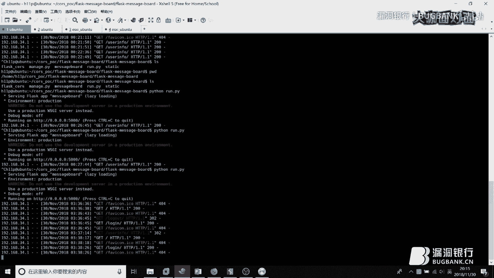
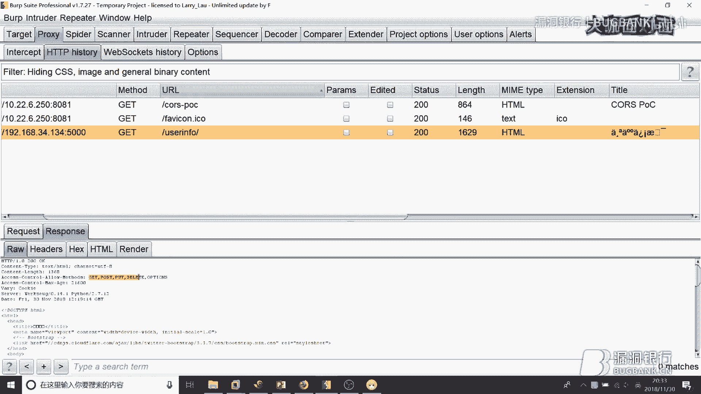
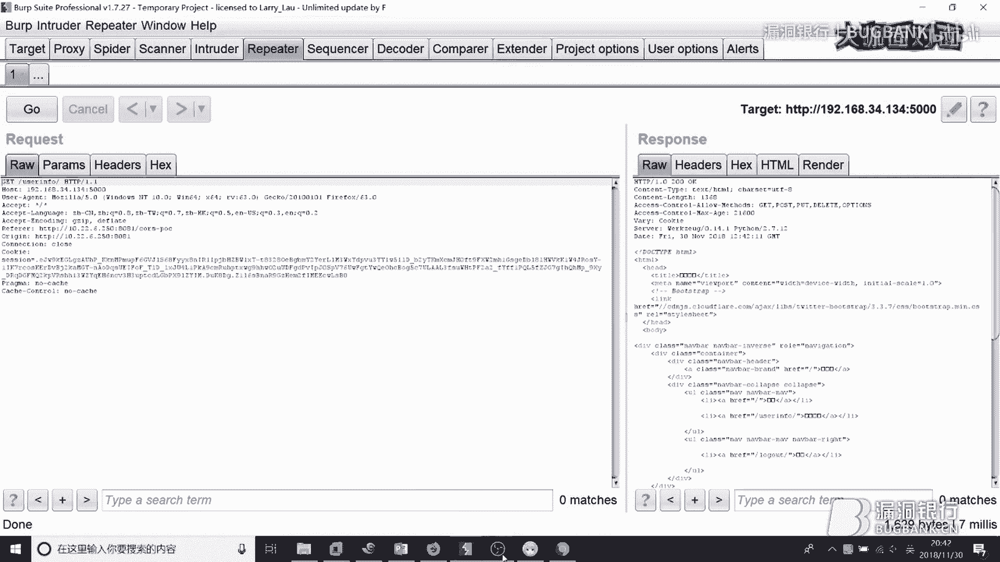
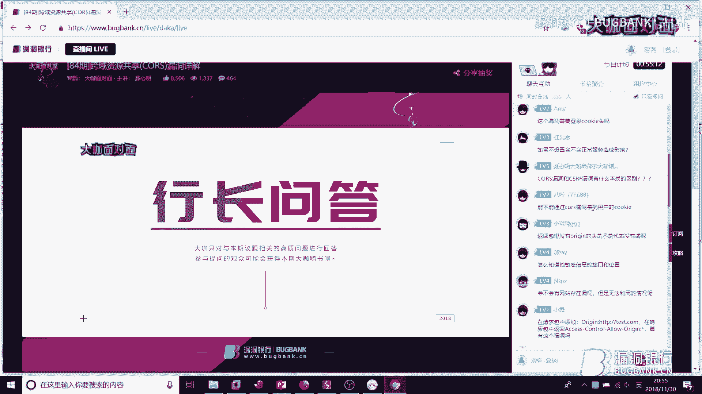

# 课程 P1：跨域资源共享(CORS)漏洞详解 🎯

在本节课中，我们将要学习跨域资源共享（CORS）漏洞的原理、利用方式以及防御方法。CORS漏洞是一种可能导致用户隐私信息泄露的安全问题，理解它对于Web安全至关重要。


## 概述

CORS是一种允许网页从不同域（源）请求资源的机制。然而，如果配置不当，攻击者可以利用此机制窃取用户的敏感数据。本节课将详细解析CORS漏洞，并通过实例演示其利用过程。

---

## 1. 浏览器同源策略 🔒

上一节我们介绍了课程主题，本节中我们来看看浏览器同源策略。同源策略是浏览器的一项核心安全策略，它限制了一个源（协议、域名、端口）的文档或脚本如何与另一个源的资源进行交互。

以下是同源策略的判定规则：
*   两个URL的**协议**、**域名**和**端口**必须完全相同，才被视为同源。
*   例如，`https://example.com/page1` 和 `https://example.com/page2` 是同源的（仅路径不同）。
*   而 `https://example.com` 和 `http://example.com` 是不同源的（协议不同）。
*   `https://example.com` 和 `https://api.example.com` 也是不同源的（域名不同）。

随着HTML5的发展，同源策略有所放宽，从而催生了两种主流的跨域方法。

---




## 2. 两种跨域方法 🌉


上一节我们了解了同源策略的限制，本节中我们来看看两种实现跨域请求的方法。


以下是两种主要的跨域技术：
1.  **JSONP (JSON with Padding)**：一种利用 `<script>` 标签的 `src` 属性可以跨域的特性来获取数据的老方法。它只能发起GET请求。
    ```javascript
    // 动态创建script标签，src指向跨域接口
    var script = document.createElement('script');
    script.src = 'http://other-domain.com/api?callback=handleData';
    document.body.appendChild(script);
    // 定义回调函数处理返回的数据
    function handleData(data) {
        console.log(data);
    }
    ```
2.  **CORS (Cross-Origin Resource Sharing)**：一种由W3C标准定义的、更现代和强大的跨域解决方案。它允许服务器声明哪些源可以访问其资源，并支持多种HTTP方法（如GET, POST, PUT等）。

---

## 3. CORS的安全问题 ⚠️

上一节我们介绍了跨域的方法，本节中我们来看看CORS机制可能引发的安全问题。

CORS通过HTTP头部字段进行控制。当一个网页（源A）向另一个域（源B）发起跨域请求时，浏览器会自动在请求头中添加 `Origin` 字段，表明请求来自哪个源。

服务器在响应中会包含 `Access-Control-Allow-Origin` (ACAO) 头部，其值指定了允许访问该资源的源。如果配置不当，就会产生漏洞。

**漏洞产生的核心条件是**：
*   服务器返回的 `Access-Control-Allow-Origin` 头部的值，**依赖于客户端发来的 `Origin` 头部的值**，并且未进行严格校验（例如，直接反射 `Origin` 值或使用宽松的正则匹配）。
*   同时，服务器返回的 `Access-Control-Allow-Credentials` (ACAC) 头部值为 `true`。这表示允许浏览器在跨域请求中携带Cookie等认证信息。

当这两个条件同时满足时，攻击者可以构造一个恶意网页，诱骗已登录目标网站的用户访问。该恶意网页会向目标网站的敏感接口发起跨域请求，由于服务器错误地信任了攻击者提供的 `Origin` 并允许携带凭证，导致用户的敏感数据被窃取。

---

## 4. CORS漏洞利用过程 🎣

上一节我们明确了漏洞产生的条件，本节中我们通过一个演示来直观了解其利用过程。




以下是攻击的典型步骤：
1.  **受害者登录**：用户正常登录到存在CORS配置漏洞的网站（例如 `https://vulnerable-site.com`）。
2.  **诱导点击**：攻击者通过钓鱼邮件、论坛帖子等方式，诱使用户点击一个指向攻击者控制的恶意网站的链接。
3.  **发起恶意请求**：用户浏览器加载恶意网页，该页面中的JavaScript代码会向 `https://vulnerable-site.com` 的敏感API（如 `/api/user/profile`）发起跨域AJAX请求。
4.  **服务器错误响应**：由于漏洞存在，服务器检查请求中的 `Origin`（例如 `https://evil-site.com`）后，在响应头中错误地设置了 `Access-Control-Allow-Origin: https://evil-site.com` 和 `Access-Control-Allow-Credentials: true`。
5.  **数据窃取**：浏览器收到响应后，因为ACAO头匹配，允许恶意页面的JavaScript读取完整的响应内容（其中包含用户的敏感信息）。攻击者随后可将这些数据回传到自己的服务器。

**关键点**：如果服务器没有返回正确的ACAO头，浏览器会阻止前端JavaScript读取响应，即使数据包已经成功返回。

---




## 5. 实战与漏洞挖掘 🔍


上一节我们演示了攻击流程，本节中我们来看看如何在实战中发现和利用这类漏洞。

以下是一些漏洞挖掘的技巧和常见存在点：
*   **检测方法**：使用代理工具（如Burp Suite）。在代理中设置一个自定义的 `Origin` 请求头（例如 `http://attacker.com`），然后浏览目标网站或应用。在历史记录中筛选查看哪些请求的响应头中包含了 `Access-Control-Allow-Origin`，并检查其值是否与你设置的 `Origin` 值匹配（或为通配符 `*`）且 `Access-Control-Allow-Credentials` 为 `true`。
*   **常见漏洞点**：
    1.  **互联网厂商的API接口**，如地图、支付、社交等开放API。
    2.  **聊天/即时通讯程序的API接口**。
    3.  **移动APP的后端接口**（需通过抓包或逆向分析找到接口）。
    4.  **新兴领域如区块链厂商的接口**，其安全防护可能相对薄弱。
*   **高级利用技巧**：有时服务器会校验 `Referer` 头。攻击者可能需要结合目标站点的XSS漏洞来绕过 `Referer` 检查，从而成功利用CORS漏洞。
*   **特殊案例：`null` 源**：CORS规范允许 `Origin` 为 `null`，通常来自本地文件或沙盒iframe。如果服务器配置为允许 `null` 源（`Access-Control-Allow-Origin: null`）并允许凭证，也可能被利用。

---

## 6. CORS漏洞的防御 🛡️

上一节我们探讨了如何攻击，本节中我们来看看如何从开发角度进行防御。

以下是防御CORS漏洞的最佳实践：
1.  **严格校验 `Origin` 头**：不要在服务器端简单反射客户端传来的 `Origin` 值。应维护一个可信源的白名单，并在校验时进行精确匹配。
2.  **避免使用通配符 `*`**：除非资源完全公开，否则尽量不要将 `Access-Control-Allow-Origin` 设置为 `*`。
3.  **谨慎设置 `Access-Control-Allow-Credentials`**：除非必要，不要将其设置为 `true`。如果ACAO为 `*`，则浏览器根本不允许ACAC为 `true`，这是一个安全限制。
4.  **减少允许的方法**：通过 `Access-Control-Allow-Methods` 头部，只开放必要的HTTP方法（如仅GET和POST）。
5.  **使用其他安全措施**：对于敏感操作，始终使用CSRF Token。虽然CORS漏洞可能用于读取包含Token的页面，但结合其他防护层能增加攻击难度。




---

## 总结

本节课中我们一起学习了跨域资源共享（CORS）漏洞的完整知识体系。我们从**浏览器同源策略**的基础讲起，了解了**JSONP和CORS**两种跨域方案。我们重点剖析了**CORS漏洞产生的核心原理**——服务器对 `Origin` 头的校验不当以及错误地允许携带凭证。通过演示，我们清晰看到了**漏洞的利用过程**。最后，我们探讨了在**实战中挖掘**此类漏洞的方法，并给出了关键的**防御建议**。


理解并正确配置CORS是构建安全Web应用的重要一环。希望本教程能帮助你识别和防范此类风险。