# P1：100期录屏_x264 - 漏洞银行BUGBANK - BV1q4411y71Q

(音效)。

为知识而存，因技术而生。

小伙伴们晚上好，欢迎大家来到漏洞银行Hackshow直播间，参加第100期大咖面对面，我是今晚的主持人Fancy，今晚我们就要迎来WebSafe团队直播月的精彩收官啦，同时为了庆贺咖面喜提100期。

今晚来看直播的小伙伴，将有机会获得漏洞银行送出的小礼物，可能还会看到秋秋小姐姐带来的精彩节目哦，第100期啦，接下来的日子里我们会再接再厉，百尺竿头更进一步，也祝愿安全圈能越来越好，百花齐放百家争鸣。

也祝愿小伙伴们今后挖洞都能百发百中，并与心爱的人百年好合，今晚将要直播分享的柴明月下毒被梁大咖，有多年的安全学习经验，擅长开发基于Python的各类安全工具。

以及权战 爬虫 数学建模 数据挖掘等相关开发，熟悉Python Java TypeScript等多种语言或框架，提前透露一下，今晚大咖还准备了精彩的实战演示，感兴趣的话一定要认真听到最后哦。

另外 大家登陆直播间后可以在聊天区发言，听讲过程中有任何疑问都可以随时提出，在之后的行长问答环节，柴明大咖会挑选高质量的提问来进行解答，积极参与的小伙伴还有机会获得大咖赠书，逆向工程核心原理。

好了 下面我们就有请柴明大咖开始今天的直播分享吧，大家欢迎，大家好 我是来自W3B safe团队的柴明，今天由我来讲解XSS Fuzz的艺术，我主要从事安全 权战 算法与数据科学的相关开发。

在本节课中我主要讲解XSS Fuzz的实现流程，和XSS Strike的源码分析，然后源码分析这块我不会一行一行去讲，因为内容实在是比较多，我语速可能会稍微快一点，没听清的地方可以留在问答环节来问我。

我希望在本节课后大家都能开发属于自己的XSS Fuzz工具，还有根据自己的需求去修改XSS Strike源码，然后这是今天的内容，首先讲一下什么是Fuzz，Fuzz技术在渗透测试中的应用十分广泛。

它是一种懒惰且暴力的软件测试技术，它的实现形式主要是向目标发送随机，或者精心构造的数据来触发非常规的反馈，我来举个例子，这是BruteXS在自带的一份字典文件，然后其中数据是作者整理出来的常见配料。

每个配料都是精心构造的，然后通过这个文件即可轻松的挖掘过滤不严格的站点，这是XSS Strike针对这个源码，我这边之前跑了一份源码。

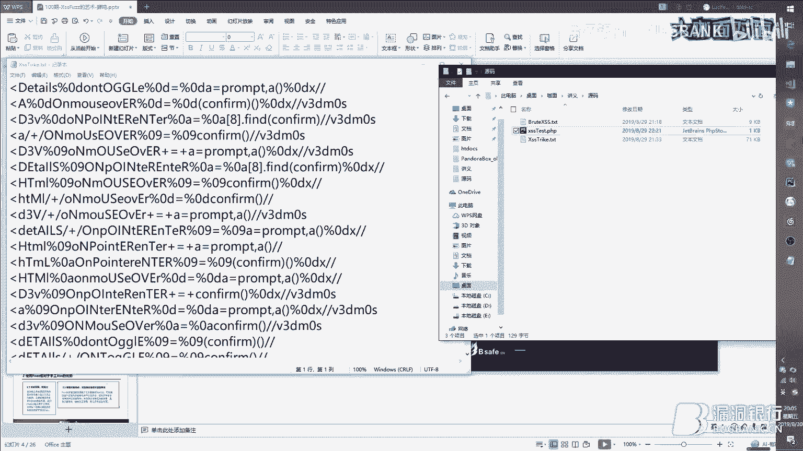

这是XSS Strike针对这份后端源码生成的配料，你可以看到它十分智能，它这个参数的反馈地址在这边，然后它的配料的构造，它就很智能的构造了一个DOM节点出来，然后前面这种，它在属性里面。

它在A标签的属性里面，它就生成了这种，它会自动把第一个双引号闭合掉，然后后面构造事件来触发，可以看到它的生成器十分智能。

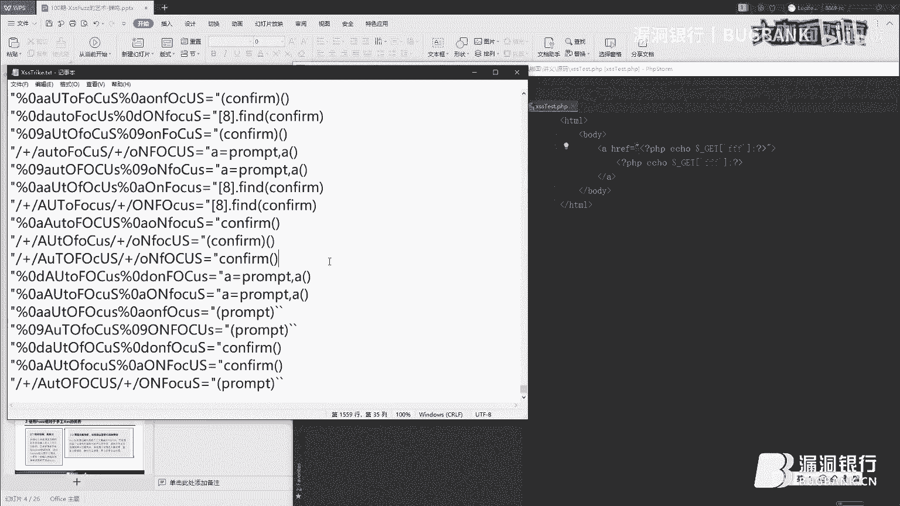

所以我们后续会分析这个工具的源码，然后说这种基础懒惰是因为它是一个自动化的过程，我们不需要手工去测试，只需要关注和分析它的触发异常的部分，这种方式的暴力体现在它的测试速度和测试的数据量。

使用Fold相对于手工拆SSD的优势，我们可以看到这种方式测试的数据量非常大，它每次生成一次配料都有七十几个K，我们手工测试的话肯定是测试不了七十一个K的数据的，它非常大，它的测试范围大规模大。

很多潜在的配料套路都是相对固定的，就像之前我们说的Brewed XSS这种，它有很常规的配料就这种东西，这种我们手动再去花时间检测那是不划算的，省下了手工成本，而且覆盖可能性多可以检测出意想不到的异常。

我们现在来说一下常规XSSFuzz工具的大体检测流程，它首先先发起一个请求，然后在请求中的参数是填入常规值，为了避免引起注意而导致的参数不输出，这一步分析反馈结果对输入限量检测。

就是分析之前这个发起请求的返回结果之中的表单，就是找一些form什么的这些name作为参数，这个WARF检测包括了使用敏感字符，短时间内多次的访问，疯狂的向参数内填写危险的关键字。

然后快速发包引起WARF注意，然后来检测返回中的WARF一些信息，比如说Banner，Headers里面一些信息，它有一些特征，检测输入限量中潜在注入点，这步就是在之前分析输入限量的基础上。

找到潜在注入点，对XFS工具来说，潜在注入点就是在页面中返回的输入限量，前面这一块，前面我们之前讲的这一块都只是一个信息收集，下面这一块才是真正的生成加检测，对注入点一个个检测。

首先先开一个Payload，开一个生成Payload的线程，然后每次生成一个Payload就会加入一个对列，然后再开一个线程池，从对列中批量去取Payload，然后进行测试。

一般生成Payload和测试同时发生的，为了提高效率，合力分配测试速度，这个分的情况，如果就是有WAF，依据WAF什么的合力，调控这个检测速度，为了规避检测，WAF不针对访问速度进行检测。

就像我们刚刚留言图说的，生成器线程和多个检测线程是同时协作的，对吧，这个是生成器线程，这是检测的线程池，互相协作同时进行，它针对访问速度进行检测时，和刚刚不同的是，虽然生成器线程还是一个独立的线程。

但是检测时并不是一个线程池，而是一个循环，检测完一个Payload之后delay一下，它会延迟个一段时间，才会进行下一次检测，通常验证Payload是否生效，主要采用的是字幕串模糊比较。

这种方式一般速度很快，但是特别容易发生误报，你不清楚到底是执行还是没执行，它只是说是看你返回的结果有没有被过滤掉，然后另一种方式是用Selenium模块，配合浏览器的driver电脑浏览器。

监听一些行为，比如说弹窗啊修改title啊，因为这种方式它本质就是一个控制浏览器，所以不会存在误报，只要这种行为监听到，那么它一定会发生，跟用户自己手动去开没有任何区别的，然后这边是关于可注入点的确定。

首先提取输入向量并填充正常值，然后记录其所在的位置，然后记录位置的方式是使用chart path，或者说从第几个字母开始，最好是结合两种方式一起来定位位置，同时还要记录所在的tag，然后所在地的类型。

比如说是在js内还是在tag内，还是在注释里面，这种东西后期配料生成就依靠它了，它怎么去生成配料的，生成配料的用什么规则，它有多少配料，都是依靠前面这些信息收集的，我们现在来稍微介绍一下。

ChartXtrack的大体架构，我们可以看到ChartXtrack，生成的配料的针对性强，然后结构很复杂，综合比较起来的话，这个工具是十分优秀的，是一款比较好用的chartXtrack工具。

具体的我就不示范了，我们这节课主要就是讲，它的原码和生成原理，就希望大家结束之后，能去自己写一款chartXtrack工具，或者说是能针对这些东西来修改，针对自己的目标来修改这个工具。

然后它是一款python写的工具，它的主要功能包括配料的生成，Waft探测 全站爬行什么的，这边是get地址，你们可以磕下下一下，它有chartXtrack的大体架构吧，参数处理，它有四种检测模式。

它对输入参数使用的是argument path pool，整体运行逻辑把控在这个文件中，chartXtrack。py，主要的运行文件中，四个模式分别是，单一的fuzz模式和用户提供配料的爆破模式。

还有scan扫描模式，这种爬行模式，其中这个scan模式，我们待会会详细重点讲解，它包括了之前我们这些留言人图，这些逻辑它都包括在scan模式内，一个基本的chartXtrack结构就是这样。

我们现在稍微讲一下四个模式，首先是单一fuzz模式，它的主要功能是探测filters和wav，为了规避检测，这个作者，他设置的时间很长，他可能长到十多分钟这样，十多分钟半个小时都是有可能的。

所以我们可以手动在，有个config文件或者是脚本文件里面做设置，或者说加入，一个看一下，加入-d这个选项，他去减少这个，把这个delay设成一秒，右边这一块是作者wikia上面摘下来的用法。

他使用这个模式就是-u后面加这个链接，然后--这个参数就行了，然后是爆破模式，如果filters的参数为default，那么就会用config文件中的默认payload，这个默认payload的其实。

虽然不是很多，但是他非常全。

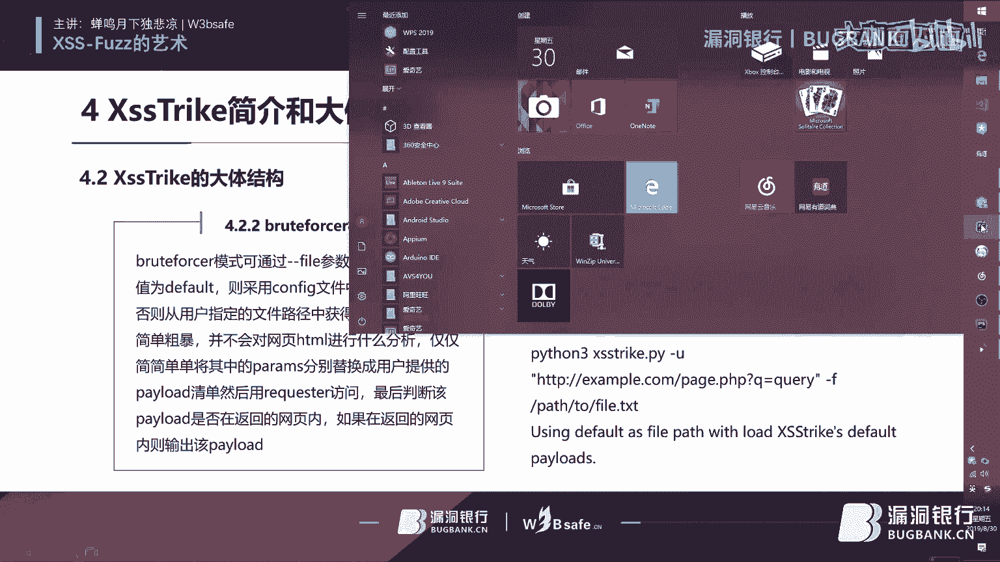

我要退一下了我好卡。

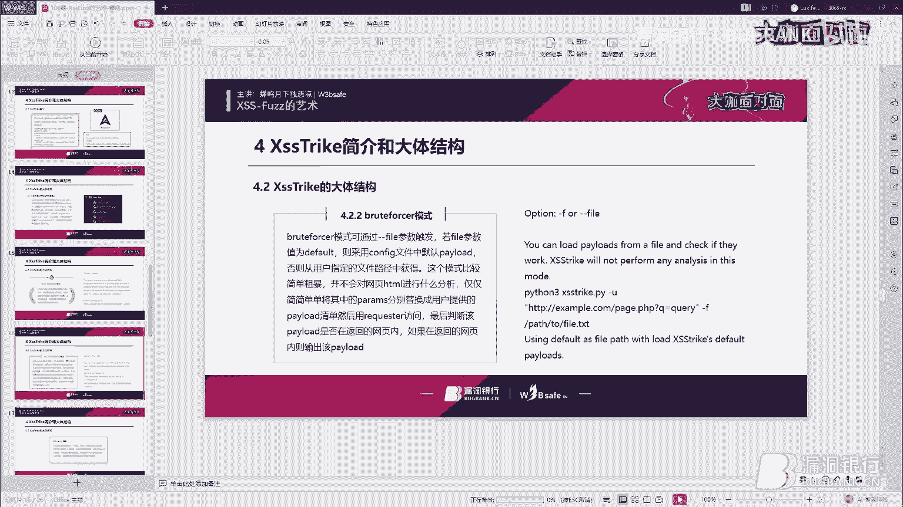

在核心文件的，这里面他有一些默认payload，这些payload他不是很多，但是他一些绕过，这些东西都是精心构造的，所以挺好的。

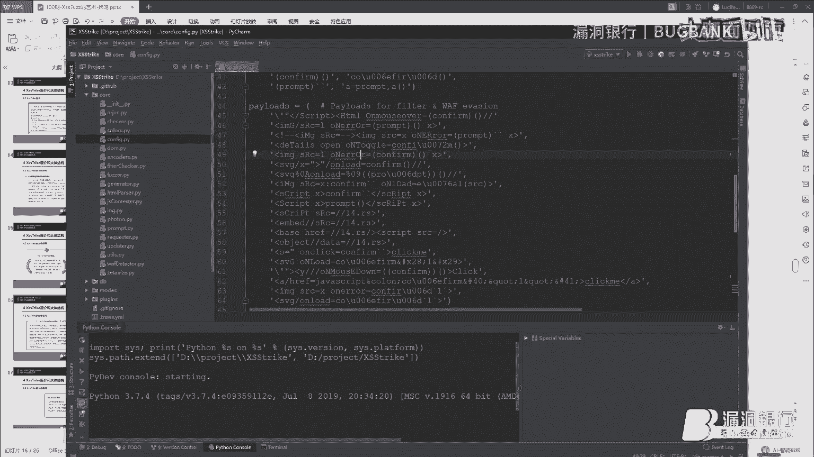

是量不够大，我觉得一般我们还是手动去设置，自己的这些payload好了，然后我们讲Scan模式，Scan模式我会重点去讲，它包括了完整的filling过程，它的作用包括诸如点检测。

返回博尔顿的检测和智能生成，断病检测，如果不触发其他模式的话，它是自动开启的，爬行模式没什么好讲，它就是一个爬虫，然后用户可以设置爬行深度，爬到链接之后，和Scan模式操作基本一样，你可以看到它这个。

-u然后加上这个参数，它就可以进爬行模式了，-l是深度嘛，然后-u-l是爬行范围，就是爬行链接，我们下面结合流程图分析一下源码吧，先大致过一遍查一下它的track的流程控制，这个很简单，我不会细讲。

我在源码上写了很多注释，如果客户想要的话，我可以分享出来，我到时候我想一下，这张流程图和源码，我打包一下发出来好吧，这是那个主文件。

它主要是控制流程和处理一些参数，可以看到这边是引一些包，然后这个包就是让文字输出带颜色，我觉得这个挺好用的，一般我们工具都是平淡无奇，就是一个白色文字输出，然后Banner输出。

接下来是Argument Path Code处理，处理所有你输入的参数，比如说代理设置超时这种东西，然后这边是开始做一些逻辑操作，如果刚刚header设置但是留空的话，它会调用Prompt参数。

调用系统默认编辑器来让用户编辑header，如果用户编辑完之后把它关掉，它就会自动往下执行，这个东西是用来充当跨脚本的全局变量，将这个definitions。json载入全局。

它的内容就是一些CVE的描述，信息和判断方式，在DB的definitions。json看一下，看见没有全是一些漏洞和漏洞详情，漏洞一些，对都是这种东西，可以自己再往里加的，从这边开始读入Payload。

如果-f参数是default的话，那么就载入config文件中的Payload，如果是default的话，就载入核心文件的配置文件的Payload，就是我们刚给你展示的那一份。

不然的话就把用户提供的文件路径，给先读进来，readers先把它读进来，然后再去除一些空部分，最后转换成list，然后一些更新啊，如果使用了-f参数的话，就开启了single first模式。

就是单一的first模式，用来判断Waft类型，找到最佳delay时间，这个逻辑啊，否则的话就，就开这个爆破模式，不选择parsing模式和指定set文件的话，就开这个爆破模式，就进入这个。

再不及就开这个scan模式，scan模式是最重要的，然后它之前有几个参数设置，如果使用了scape DOM的话，可以跳过查找DOM节点这个过程，然后find是否是查找输入项量。

如果不用这个find参数的话，它就只会用你URL中这些项量，scape为跳过确认，它这个每次这个模式下，查找到就是它觉得一个payload生效了，就会问你是否要进行，下一个payload去验证。

如果加了scape参数的话，就不会问你，它直接会验证下去，这是parsing模式，这个没什么好讲的。

这边是对目标发行请求，它是由核心文件的request。py实现的，这个request封装了request库，进行了一次封装。

我们现在来看一下整体怎么写的，它先前面做一些配置，然后后面又sleep了个delay秒，然后判断是否有UA，如果UA在这个header里面的话，如果不在header里面的话。

那就使用这三个UA中随机的一个，你们可以自己去往里添UA，自己有什么感兴趣的UA就往里添，三个中的随便一个，如果这个UA等于$，为什么UA会等于$，因为我们之前用户不提供headers的话。

它就会使用config文件中的默认headers，我们看一下config文件中的默认headers，怎么写的，对config文件中的默认headers，这个UA就是个$。

所以如果用户不提供headers的话，它就会使用这三个headers中的任意一个，然后就后面就是普通的输出，这三个是分情况发包，是get还是json还是post，json的话要转一下，转成post。

如果请求失败了，这边之前如果一报异常，请求失败了的话，它就会认为是被UA拦截了，它就会sleep个十分钟，再进行下一次测试，觉得这个时间太长了，可以自己去设置，或者说是改一下，读一下config也行。

然后这边。

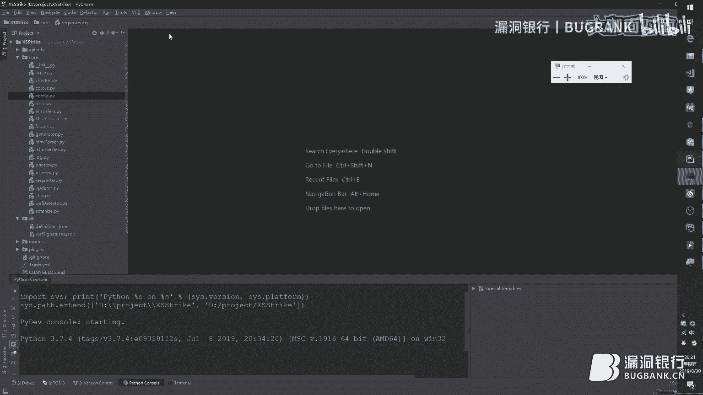

这其实是个可选的操作，加上scape DOM的话，就会跳过这一步，这一步的功能就是，对Boreal DOM进行检测，然后输出，我们按照。

来看这个DOM怎么写的。

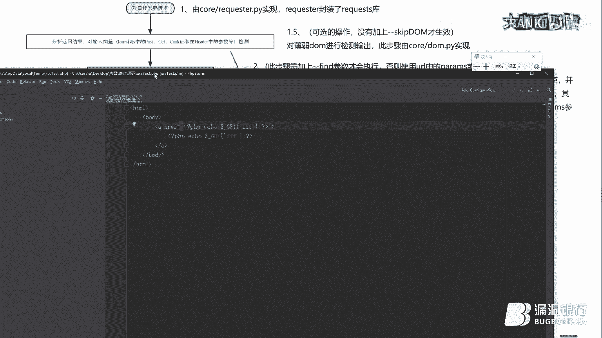

DOM。py这边，source是可操控的数据来源，所谓可操控数据来源，就是满足这些，政策表达式，比如说document。uil，或者是document。uil这种，这种就是。

政策表达式的js语句的返回的数据，是用户可以控制的，就是用户可以控制这里面数据，对吧，然后syncs为执行这些，可操控的数据的方式，如果js的函数满足syncs政策表达式，那么这个函数中的内容。

就可能被当做js去执行，这样就非常危险，这样这部是提取页面中的，Javascript代码，然后后面就进行分析，先是以每一行作为分割，先是以每一行作为分割，然后对每一行用var进行分割。

所以说基本上每个字符的开头，都是变量名对吧，然后用这个政策表达式来提取，变量名，它政策表达式就是，满足Javascript变量名的规则，变量名只能以，小写的a到z，或者大写的a到z，或者$符下方线开头。

它不能以数字，它不能以数字开头，它就会提取变量名，后续这些代码的大致意思，我这边标注的挺详细的，我不会详细去说，这个有点复杂，它的大概意思就是，如果变量名的值是可操控的，在变量名下的值是可操控的。

而且满足变量名在，Sync满足的政策表达式内，政策的函数内，那么JS被视为危险DOM，我们来测试一下，按照我们刚刚讲的规则来测试一下，写一段带这个，写一段薄弱DOM来测试一下，对吧，这绝对足够薄弱。

就我们刚刚说的，这个Source是可操控的数据来源，这个变量名，这个Source它复制了给AA，然后并且这个AA在，可操控的数据方式里面，在这个里面，在Sync里面，所以说这段东西应该会。

被这个标注为薄弱DOM，我来跑一下，这里已经开始检测了，这一步就是对薄弱DOM进行检测，highlight表示被注意到的，就是重点，然后往下一步走，这个时候highlight已经被执行完了。

然后我们再来测试一下，这个时候，我们再来测试一下，这个时候，这个时候就已经检测完了，来看一下它的值，它居然是空。

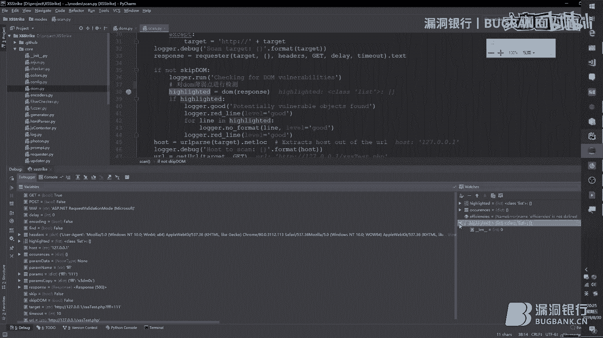

有点尴尬，应该是我之前创建错文件了，重新来一次，果然没有了，没有了，我们重新开始吧。

创一个prp文件，然后名字叫charsetest好了，然后写了个body，里面是script构建薄弱DOM，先y-a-a=，document。ur，然后evl-a-a，就这一段应该可以了。

我们来测试一下，把参数填进去，它是-u，然后行的，没问题，charsetest。prp，它说找到了薄弱点，但是它并没有输出，来看它里面的值，它所谓标记的点的值，我一看到这个值，就是我们之前写的两行js。

就这两行，var什么什么，然后evl什么什么，就因为看到这些乱码，是它给它标的在终端中要显示颜色，所以它可能看起来有点乱，我们现在把它输出一下吧，我估计这一行输出函数，它哪里有bug，来输出一下。

重新跑一次，对吧，是不是我们刚刚写的两行带薄弱的，它检测出来了，然后这个WARF DETECTOR。

我就不细讲了，后面FIRTH用不到，但是这个模块很好用，到时候自己去开发工具的话，可以直接拿过来用，它就是用我们之前讲的流程图，那些行为触发WARF，比如说状态码，后面会依据比如说状态码。

然后跳转页面地址，还有关键字页面内容一些东西，然后它会对每个可能的WARF进行综合评分，满足这些信息越多，就比如说状态码，页面跳转地址这些东西，满足的信息越多，它的得分越高，然后后面会返回得分最高。

那个WARF的名字，我们来打开，打开WARF库来看一下，它这些WARF收集的非常全面，然后包括这整个模块。

我们可以拿过去直接用，如果自己写工具的话，没有必要自己再去造这个轮子了，看这些WARF信息它都有，比如说有code配置，headers里面页面关键字，它有些headers里面关键字，这种样子。

如果使用find参数的话，它会寻找页面中的潜在注入点，然后否则的话只会用URL中的参数，或者pos中的参数，它主要就是用核心库中的，argun。py去实现的，主要实现方式就是查找。

input中的name值，input表单中的name值，所有name值就会被当作，潜在chart的注入点，现在来看一下，分析一下argun怎么实现的。

就是查找潜在注入点，我们首先看到一个正则，这个正则的意思就是，提取name等于号之后的东西，它有可能是单一号，有可能是双一号，反正提取两个引号之间的东西，就是这个name的值，然后。

它所有这种提取来的值之后，它会把这些值和config文件中的，这个参数这些东西去合并，这个东西我给大家打开看一下，这些东西就是作者整理出来的，常用参数名，它可能不会出现在页面中，但是它可能其实有。

它就会把页面中提取出来的，names和这些参数名，合并成一个新的列表，然后去一个一个用check这个函数，来做测试，看它是否输出，然后如果输出的话，它就是潜在注入点，就看哪些参数会，哪些参数提供的值。

会在返回值中，如果对这个参数提交的东西，它在返回值中的话，这就是个潜在注入点，然后其中被检测出的参数。

有后续的核心文件中的html parser，提取记录，它会提取记录输出的位置信息，这个位置信息是待会儿，给生成器，依照这些位置信息去，更智能的生成，看一下html parser。

它是，我们不去读它原码，这东西也是能套过来用，它原码我也写了一些注释，你们想知道原理的话，下课可以去看，然后我就看它实现的结果，它会提取其中哪些信息，它是在scan里面实现的，models。scan。

然后就是这个，这个就是提取的结果，我们来写一下，带注入点的parser文件吧，只要盖个几行就行了，这边我想加个什么，加个a标签吧，a标签，到辅获区get中的fff，然后封号之后必核。

然后中间我再插一个反射点好了，getfff参数，必核掉，这就有两个反射点，一个是在a标签的参数里面，另外一个是在，这个直接在html中，来重新跑一下这个，看一下它的生成是什么，它的输出是什么。

就是它会获取什么位置信息，之前DOM检测，应该是检测不到的，我把之前Boradom删掉了，对没有，没检测到，然后也说没有WARF，对fff参数进行检测，这边已经检测完了。

主要是用这个htmlparser进行检测，这是检测的结果，我们来看结果值，对吧，它是不是检测到两个位置存在反射点，存在潜在注入点，第一个是29，position是29，表示从第29个字母开始。

我们来看一下，这边是不是差不多29，应该是少两个，因为它中间会做一些处理，它会对对对是27，对的，它会少两个位置，然后第二个点就是，第47个，然后它是在html里面，对吧，差不多第47吧。

然后它是在html，直接在html里面，没有在什么元素内做什么属性啊，这种东西，第一个是不是在元素内当属性，然后它有些详情，比如第一个反射点，它在A标签里面，然后它的类型是value。

它当做的是value不是name，在这个什么什么等于什么什么，这个后面东西叫value，它是在value内，然后它的name值是href，对吧，是href，它都提取出来了，这个实现的挺完善的。

其中这些值的含义就是这样，位置，先是位置，然后冒号，就是一个字典，它的k就是位置，它的value是另一个字典，然后其中position，就是跟刚刚位置一样，context是它在哪里。

它有可能是script，在js里面，或者在html中，就像我们之前这个例子一样，它在html中，或者是comment，comment就在注释里面，它被注释所包裹的，然后attribute就是。

之前我们说的，这个例子中的参数，它是作为参数的，在这里面就算参数，details是这个参数才有的，它在哪个标签，比如标签名，在这个例子里面的话，这个标签名就是a，在这里，就是a，然后type的话。

是反馈所在标签中的位置，我们刚刚说过，code的话，代表了包裹元素的符号，比如说单影号，双影号，或者说是反扩号，反影号，对吧，这个例子中，它是以双影号，把我们的反射点所包含的，所以这个例子中。

它检测出的，这个code就是双影号，后面没什么好讲的，就这个bad tag，它如果是被a标签，它如果是被style标签，或者是template标签，这种textarea什么的包裹的话，这些东西。

它就会算bad tag，在这些bad tag里面，我们这些只是没有办法，直接解析为html的，它可能会解析成css，或者说是解析成成文本，我们构造css的话，要先把之前的bad tag，先给避和掉。

好卡。

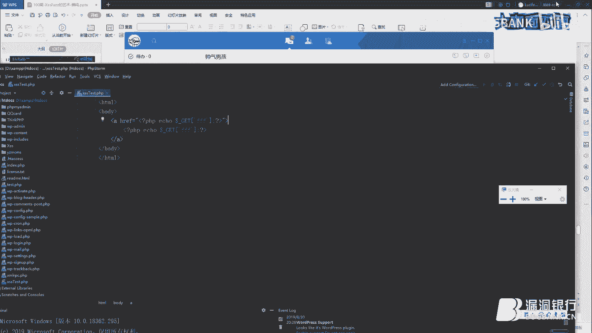

然后这部分讲完了，我们接下来讲，下面一块内容，这一块比较多，然后我就下一页去讲了，然后提取位置信息之后，就我们刚刚的那个，html pattern模块，先提取了位置信息。

然后需要对environment，进行评分操作，这个评分操作蛮重要的，也是为了后面的payload。

生成做铺垫，什么叫environment，environment就是根据context的判断，我们之前说的context，它可能是我看一下，context它可能在属性内，它可能是直接摞在html里面。

根据context进行判断，然后用来避和表达式的，比如说这个符号，如果context，如果environment是这个符号的话，那说明这个，这个点是在注释里面，然后如果是这个符号的话，在js里面。

这样的话就是在html里面，然后将所有的environment，就是这些东西，作为payload加入检查，然后用返回的内容，和原拼接内容对比做评分，我们来跑一下试一下，跑到这里好了。

对这边这一步开始执行，这个failtales checker，就是对environment进行打分，这一步执行完了，这一步执行完了，我们加到，加到监视器里面去看它值吧，是不是给打分出来了。

一个score，刚刚没有的，刚刚看到这个结构里面，并没有这个score，它并没有分数，它现在打了个分数，它针对这个大一号，小一号和双一号进行打分，我们可以看到，我们没有写任何filters。

政策过滤什么的都没有，所以它这些三个符号都是满分，没有进行任何过滤，我们现在来稍微写个，简简单单政策替换，我们也不写什么filters了，我们就替换一下，我想想，监控号单一号好了，双一号我们留着做对比。

这边只要加一行，然后也是过滤get中的fff参数，它等于一个prg，正在被它试替换，构造一个正在被它试，先过滤个单一号，然后大于小一号监控号，然后再替换成空，它的源是get，然后fff。

最后把prp避离掉了，这个时候我们就所有ff中，输出的单一号和监控号，都会替换成空，就把这些东西都过滤掉，我们来看一下，再次打分它打什么分，对吧，我们刚刚的这两个符号都是满分，我们现在过滤掉之后。

它就是90分了，然后这个双一号的话，它还是满分，我们刚刚并没有对双一号进行过滤，我们看它只过滤了单一号和大于小一号，就是监控号，然后这个check check。

它并不会进行多线程处理，它只是生成完一个参数的配料之后，它先生成完再进行测试，它是这个样子的，然后一次性只能测试一个参数，Chest Strike的攻击验证方式是依赖这个，这个嗯，我也不太会读的库啊。

来查一下吧，之前查过现在还是不会读，很尴尬，算了不管了，还蛮常用的就是模糊比较，用了模糊比较的，两个字不串的相似程度，我的鼠标都卡呀。

来试一下先from，然后，就比如说AAA，再加个A吧，AAB，对吧，它两个有一点不一样，它75分，如果完全一样，它就是满分，对吧。

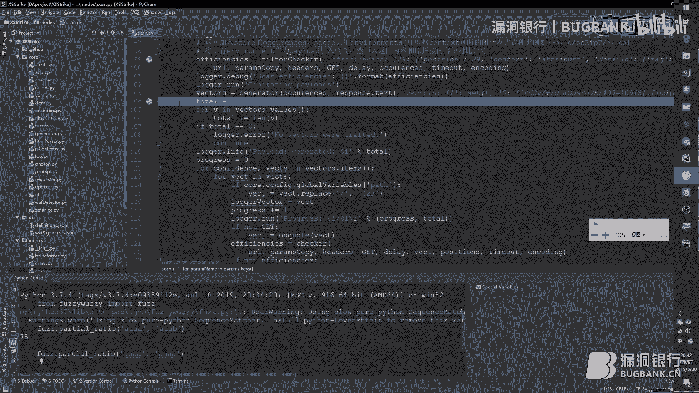

就是模糊比较，它会依据两个字不串的相似程度来打分，这边是生成器源吧，呃这边生成模块应该叫，生成器是很大的，这是预处理，它使用生成算法之前预处理，我这边打了一份html文件。

不是html就是浏览器可以打开的文件，来讲一下，它这些东西预处理其实还是，呃内容都是在config文件里面去。

我来讲一下干嘛用的，不是这个，就之前BitTag我解释过，只要在这个标签里面的话，它就不会被当成，DOM文本去解析，它就会当成比如说，CSSS这种丑闻本，这种都是有可能的，然后在text标签的话。

就是常用的html标签，JFelix作者给的解释就是，可以用在JS函数和breaker之间，这个breaker就是，用来闭合之前的函数的，然后这是JS的function，JS函数。

用的这两个之间就是这个，就是，分号，然后这个LFelix就可以用在，呃大余号之前，而这个EFelix是用在，event handlers和functions之间，这个那就相当于用的等于号两边。

我们等下会细讲，这些东西到底在，生成器中有什么用，然后这个Felix就是用来，代替空格的，他编码了一下，有type空格回车和加号，这个event handlers就是，他到时候生成payload的话。

他用这东西去填充的，这个details标签，他可以用在被下拉这个event，这个事件，然后第三位或者details，HTML A标签的话，他可以使用on point enter，就是当鼠标进入的时候。

这个事件去构造XSS，然后A标签HTML第三位，是也可以on mouse over，functions他就是一个JS functions，去获得一个弹窗，这个就是弹窗，也没什么好说的。

那就是之前准备工作，我们等一下生成器中，就直接会用这些编量名了。

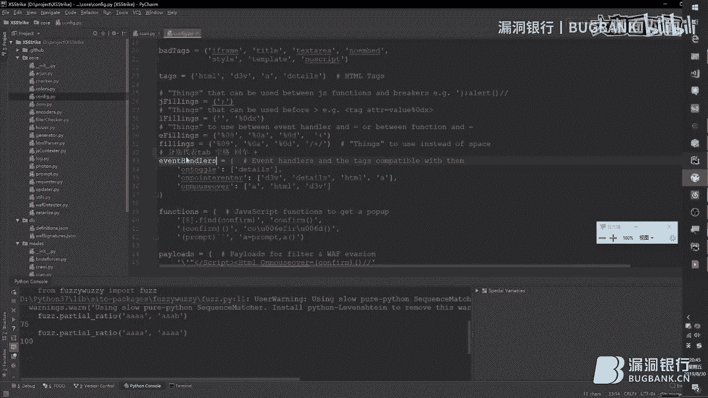

然后还有一个生成模块，他这个模块就是，先定义了个breakers，breakers就是用来，避和之前的bad tag的，就是比如说你在一个styles里面，你写任何东西，他应该都是被当成CSS。

所以你需要构造一个避和，先把它避和掉，所以breakers就是这个，这整个就是一个，HTML的避和标签，然后如果text等于第三位，或者A标签的话，那么byte等于XSS checker。

所谓XSS checker，就是一个正常字幕串。

我们来看一下，这里也是可以改的一个部分，对XSS checker是这个东西，他这个软件中，所有的正常字幕串，他不是实时生成的，他是就用的定死的，你们可以自己改一下，因为他太好去识别了，最好改的时候。

长度跟他一样，然后按照以下的排列组合，顺序排列组合，去生成配料的数字，vectors等于就是结果，等于breaker，breaker就是这个，之前把它避和掉，然后再加上大于号，就是构造一个新的标签。

构造一个新的标签，大于号就加上标签名，这个所谓的R函数，就是一个随机函数，就是随机几位的字幕大小写，小写改成大写，再加上Fillings，Fillings就是代替空格用的，然后R event。

就是随机大小写的，event handlers，我们刚刚说过，event handlers就是这些东西。

这个。

这些，他会随机大小写，然后再加上能放在，等于号两边做分割的东西，再加上一个function，就我们刚刚说的弹窗函数，再加上L fillings，加上and，一般这个and就是，大于号，它特殊情况的话。

它可能会是，比如说注释，再加上byte，结合一下之前，我们随便找的生成，它就会生成类似这种东西，就我们刚刚说的，这个大于号，然后details这个标签，就是我们刚刚这个type。

然后加上fillings，这个东西，百分号0D，再加上，这个，这个标签允许的事件，我来看下这个标签，是不是这个标签，你看这标签允许哪个事件，是不是允许这个事件，这两个其实是一样的，只是随机了一些大小写。

然后又加上，等于号两边，允许的分割字符，对吧，是能放在等于号两边的，是这个e fillings，是不是百分号0D，是两个百分号0D，它分割了一下，然后再是能触发弹窗的，Gesture函数，a等于。

就是这个函数，然后再百分号0D，分割了一下，百分号0Dx，然后就是ans，它没有加bytes，bytes这个情况下是空，因为它不属于text，或者第三位或者一标签，这两个用来给生成器，调用的函数讲完了。

我们现在讲下生成器流程，这个生成器流程比较复杂，我只会讲一部分，如果说自己需要改的话，或者说需要详细去了解，它具体怎么运作的话，可以自己去看一下，反正流程图最后会发，它先处理化了一个vectors。

它是用来存储，最后的payload结果，它有11个set，这个vectors结构是一个list，它list中它有11个空的set，组成的一个dict，然后case分别是，它不是list它是dict。

case分别是1~11，这个case越大的话，它的payload的执行的可能性越高，所以它优先case大的payload，它去尝试，当context是HTML的话，它会将env加入这个，就是。

我们刚刚生成的，我们刚刚那个例子，它就是在HTML这个，反馈点的情况下，它就生成的，所以它的env就是这个，如果当前反馈点的，biotag飞空的话，那么这就是个复制操作了，就把这个biotag复制给。

一个变量名叫biotag，然后大约号屏风为码分的话，将大约号加入env，就是用来闭合标签的，然后将之前复制传递给生成函数，就是这所有生成的东西，包括之前在config文件里面的东西，那些变量。

它都复制给这个生成函数，它都复制给这个生成函数，就是我们刚刚之前讲的，这个生成函数，这个函数，它就生成一组配料的，你注意到这边，它生成出来不是一个配料，它是一组配料的，因为这些都是变量。

它变量和变量之间的值，两两组合，不是两两组合，就是组合起来，以各种方式排列组合，它会生成一组变量，然后将结果加入vector时，这是context是html的情况，如果context为属性的情况。

就像我们之前说的那个，好像把它关了，对吧。

就我们刚刚说这个情况。

这个时候context还是属性，它是属性，它是属性的情况下。

它就判断，如果大一号和code，code就是包裹它的符号。

这个时候code就是双一号，这个时候code是双一号，包裹它的符号是满分的话。

那么就做和html一样的操作，什么叫做html一样的操作，就是先这个，这不判断不是吧，就先按着加入这个，然后一套生成，生成下来的结果加入vector9，如果code的得分是满分的话。

就以这个规则和fairlinks进行组合，然后vectors等于先把前面一个code给避和掉。

先把第一个这个东西给避和掉，然后再加上fairlinks，加上r-autofocus。

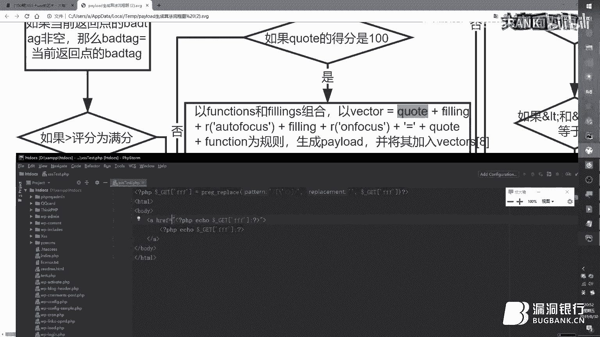

这个autofocus的意思，它就是一个属性，一个标签加入这个属性的话，整个页面处理化的时候，它会把焦点给它，它会这个标签会被聚焦，然后再加上fairlinks，加上r-unfocus这个时间。

是当这个标签被聚焦的时候，它就会触发后面这个function，对吧，就是我们之前说的弹窗，所以只要这个页面一加的话，就会触发这个弹窗，如果这个配套的生效的话，如果code的分数等于90分的话。

那么它就先是反斜杠，先把这个code注视一下，转移一下，然后再加fairlinks，加上我们之前说的这个autofocus，先把它聚焦掉，然后再加上这个focus的事件，再加r-focus7。

然后其实其他的都差不多，是一套操作，都差不多，只是说是情况不一样，它进行分类讨论而已，还是依赖于这个函数，行，我之后就不细讲了，这些东西。

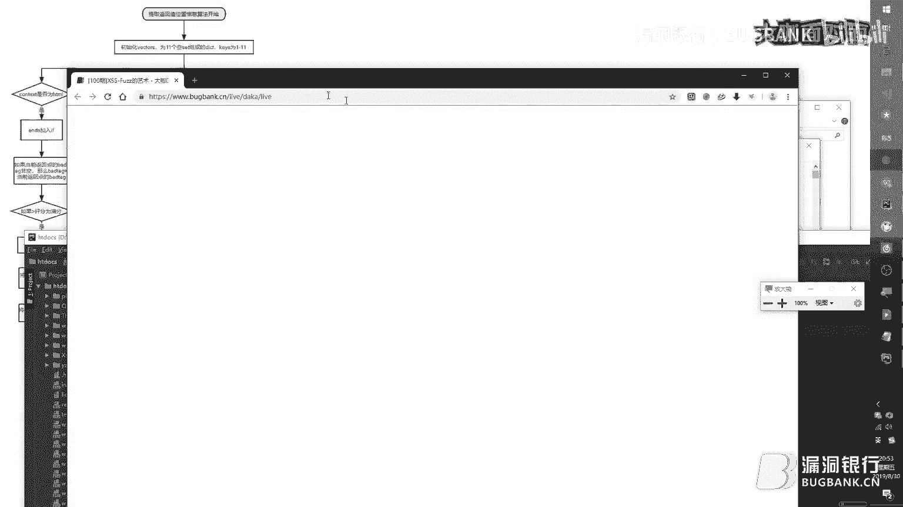

我会发出来，你们自己看就行了，它没有什么难度，它就是很复杂而已。

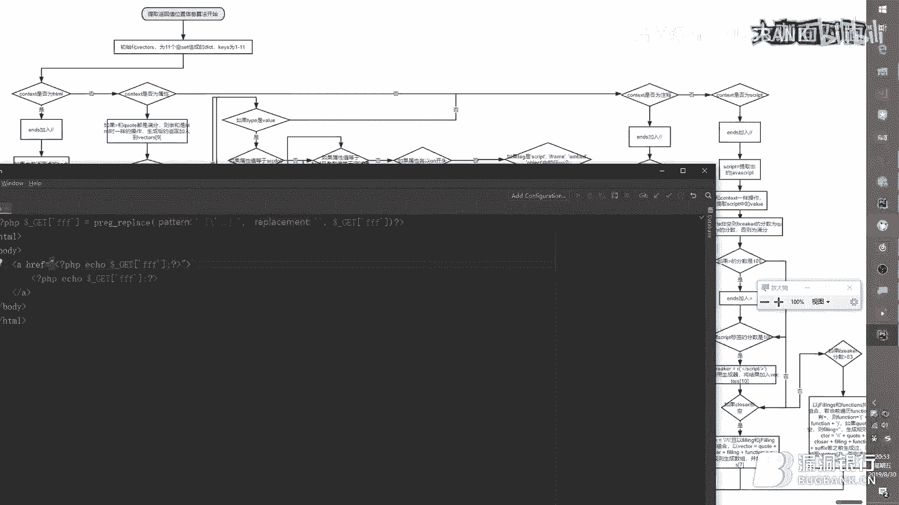

免得视频我在这边放一下，然后今天要讲的就是这些，我公布下原因方式吧，如果有什么讲的不知道的地方，欢迎交流指正，然后各位大佬带带我呀。

对吧，行，我讲完了，好的，那非常感谢柴鸣大咖充实，详细又生动的讲解，辛苦啦，认真听讲的小伙伴们，可能还有一些疑问，想向大咖请教，下面我们就进入行长问答的环节，大家现在可以继续在聊天区里，发送问题。

柴鸣大咖会选择高质量的提问，来进行解答，进行聊天互动，还有机会在稍后的福利环节中，获得大咖赠书，逆向工程核心原理，那现在我们就请柴鸣大咖，勾选一下直播间的直看提问选项，来查看和解答大家的问题吧。

柴鸣大咖你这边可以开始了，好的，什么叫把某个标签中能使用的，on事件全都列出来，他那个配置文件中。

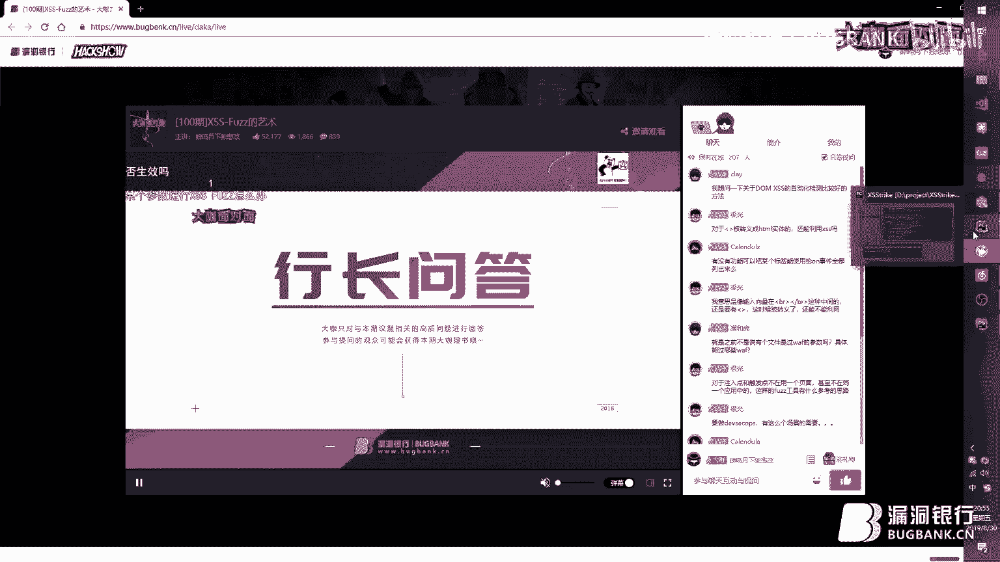

他有去让你给地方让你去写某个标签，他能用哪些on事件，比如说你自己有某个新标签的话，你可以自己去添加一些时间，比如说有个on，on fuck的对吧，你可以去添加2333，那现在这个2333标签。

如果出现在网页里面的话，他检测到不是他检测到，就是生成的时候，他会生成2333标签，然后把这个on fuck的事件添加上去。

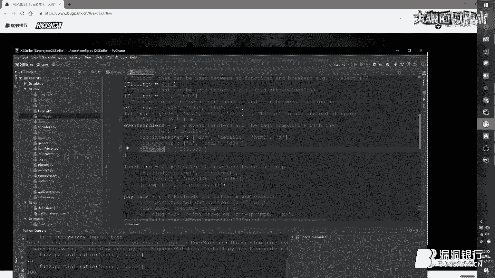

哦他不是过wav的参数，他只是能检测wav，他还没有过wav这个功能，因为实在是没有必要写这个功能，因为wav更新很快，不停的去更新这个wav配置文件，这有点有点复杂，过wav都还得手工去过。

这个我还真没研究。

我现在看下这个办法，爬行模式，哎我觉得他是根据href这种参数去过的，去去去爬行的，因为我看到有详细的去检测，他是在表单里面是get还是什么，这种东西。

你就用ail或是pose，pose的包他以json表示，然后把这个参数去列出来，然后等于什么的，等于你自己任意字符，他就会检测到他有这个参数，然后他就会进行force，他会先进行一个信息收集。

然后再根据收集到的信息，再去生成payload，行今天就这样吧，好的好的，我们今天现在已经快9点了，长明大咖讲了一个小时，上次一个小时也非常的辛苦，那看大家问的也差不多了，今天答疑环节就先到这边。

如果大家之后还有问题，可以私下再做交流，非常感谢长明大咖耐心的解答，那下面我们就进行下一个环节，也就是大家最期待的赠书环节，本期赠书是长明大咖精心挑选的，逆向工程核心原理，大咖你能不能简单的说说。

为什么想送这本书呢，因为他名字好听啊，对吧而且封面贼好看不觉得吗，名字好听而且封面好看，没想到大咖还是外貌协会，行行行好的好的，那么今晚谁会是那个被大咖选中的幸运的小孩呢。

长明大咖请你选择一位幸运观众吧，我现在也要选一个名字比较好听的，好的你看选名字好听，不知道还有几号，哪个，我怎么点了没反应，你说一下他的ID我这边来选也可以，好像是八万啊，八万是吗，80000，对。

好的，是叫千山飞木雪是吗，对，果然是名字很好听的一位小伙伴，给你设为幸运观众，好的那恭喜这位直播间ID为千山飞木雪，ID是80000的小伙伴，你将获得对应的大咖赠书，请你根据直播间提示留下你的联系方式。

或者在直播后私聊我们运营小姐姐进行对讲，我发现每次一到这个送书的环节，大家就格外的热情啊，为了不辜负大家的热情，现在我们就正式解锁今晚直播的第一个福利彩蛋，当当当当为了庆祝咖面一百七成就达成。

今晚除了大咖赠书以外，我们还另外给大家准备了小礼物，两份漏洞银行新款周边，没错是两份哦，今晚我们准备了double双倍的快乐，那现在我们就要再选出两位幸运的小伙伴来获得这份惊喜。

陈铭表哥那个我选一个你选一个你看行吗，行啊行啊，OK那那个我先来吧，大家现在可以多发发弹幕，我来看看谁嘴最甜行吧，大家该说什么心里都有数吧，我选一个发表情包最骚的。

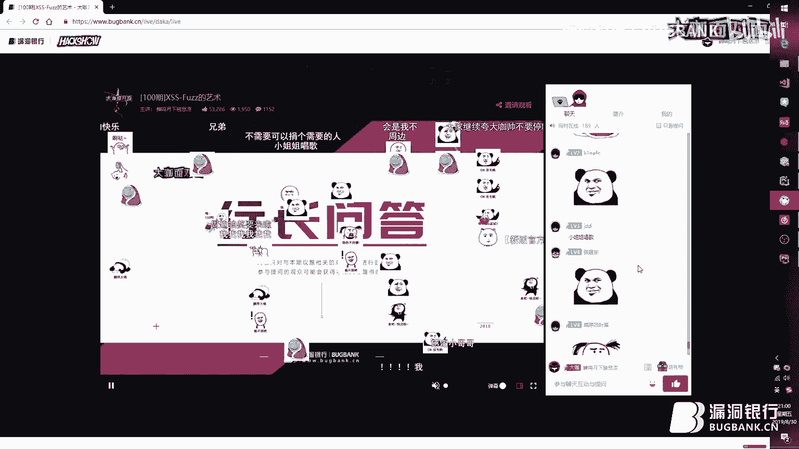

啊那表情包最骚的，你们赶快发你们赶快发。

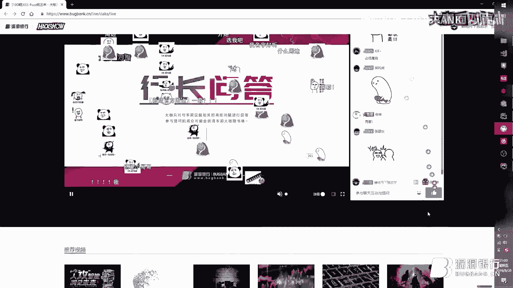

我要选一个说话最好听的大家赶紧夸我，没有人夸我，让我来看一看，有一个人发了一个弹幕，括号最骚表情包，就他就他就他我喜欢，真的假的，真的真的真的真的吗，行那那就那就他吧，我看看是谁啊，最骚表情包。

他叫他叫他叫，啊对93077，行我给他选一家幸运观众，大家稍等一下，我们这边选一家幸运观众，啊这样我们请那个年年和秋秋表姐帮忙选一家幸运观众，然后大家稍安勿躁，我这边我还没有选。

我可以再选一位幸运的小伙伴来送他礼物，大家还有一个宝贵的机会，大家抓紧，为什么我看到有一个人刷了很多年念最漂亮，今天主持人是Fancy，在干什么，那就不要给他，行不给他肯定不给，我看到有一个。

有一位小伙伴说，一眼就在茫茫的弹幕中一眼看中了一位小伙伴说，范菲小姐姐声音真好听，行吧我也就不纠结了，我我就相中你了好吗，ID叫他的名字叫李姓庄B，ID是89361。

那恭喜这位直播间ID为89361的小伙伴，你成功打动了Fancy表姐的芳心，小嘴抹了蜜似的好吗，就决定送你了，记得留下你的联系方式或者私聊我们队长哦，那恭喜以上两位小伙伴。

你们被大咖和我翻牌成为了今晚的幸运观众，你们将获得漏洞银行最新款的周边套装，包含一枚钥匙扣和一张精美的鼠标垫，记得留下你的联系方式，我们会在之后联系你们进行对讲，好了，亲爱的观众伙伴们。

今天禅明大咖的技术分享就先到这边就结束了，最后禅明大咖，你还有什么话想对我们直播间的小伙伴们说吗，我想说希望安全圈越来越好，然后大家挖洞姿势越来越骚，谢谢大家，好的好的，很实在的祝福。

那再次感谢禅明大咖的用心准备和精彩演讲，一如既往，本期直播录屏会在下周五发布，想回顾本期内容的小伙伴，请关注我们官网更新或群内通知，感谢每一位观众的支持，谢谢你们一直以来的陪伴与守候。

如果你也想像大咖一样直播分享，就快来找我们报名吧，大咖面对面是一个展示白貌风采，和分享技术知识的舞台，这里不拒年龄不为资历，只要你有才华感分享，我们都欢迎，好了，大咖面对面周五8点见。

今天的技术分享就暂时到这边了，禅明大咖你最后跟观众们道个别吧，好大家拜拜，嗯好的，再次感谢大咖，但是呢小伙伴们先商安物燥，不要离开，今天为了庆祝咖面喜提100期，我们稍后还有更加重磅的，惊喜福利掉落。

其实呢，我们还有一份周边礼物没有送出，留到现在，就是为了感谢，陪伴我们到最后的忠实观众们，你们都是真爱粉，谢谢大家，此外，还有我们人美歌甜，腰细腿长的秋秋小姐姐，给大家准备了一首动听的歌曲。

要给大家直播演唱，最后的一份礼物，也将由秋秋表姐来送出，我们现在先让产品大咖下麦休息吧，我们这边需要切换一下推流，请大家稍微等几分钟。

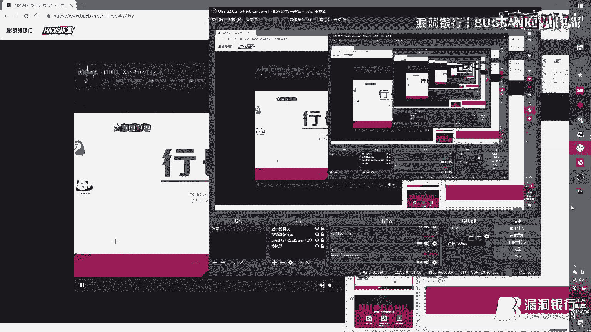

小伙伴们晚上好，我是秋秋，我以秋秋的身份，也再次感谢今天来我们大咖面对面，直播分享第100期，XSS FAST艺术的产品师傅，然后也感谢我们，也是一个非常甜美的粉丝表姐，那现在技术内容写出之后呢。

我们就要进入下一个正题，就是给大家约定好的，今天要给大家带来一点，小小的不一样的彩蛋，因为今天的，是我们漏洞银行大咖面对面，这个技术栏目举办的第100期，那走过这么长时间，能够这么成功地举办这么多期。

也离不开每位小伙伴的支持，有你们的喜爱和每周的来观看，才让我们不断地有信心，也有能力去持续地，请到优秀大咖来登台展示，所以今天就特别准备了一首歌给大家，然后我就想到，最好能跟今天大咖有点关系嘛。

然后我们大咖叫蝉鸣蝉鸣，我就想着有一首歌好像提到过，抓住一只蝉，所以就选了五月天的如烟，那希望大家能够喜欢，我坐在窗前望着窗外，回忆漫天，生命是华丽所觉，时间是贼偷走一切，几岁的那一年，抓住那只蝉。

以为能抓住夏天，十七岁的那年，吻过它的脸，就以为和它能永远，有没有那么一种永远，永远不改变，拥抱过的美丽都再也不破碎，让仙君岁月不能再点上洒烟，让生离和死别都遥远，有谁能听见，我坐在窗前转过头看。

谁在沉睡，那一张苍老的脸，好像是我紧闭双眼，曾经是爱我的和陌生爱的，都围绕在我身边，带不走的那些遗憾和眷恋，就化成最后一滴泪，有没有那么一滴眼泪，能洗掉后悔，化成大雨降落在回不去的街。

再给我一次机会将故事改写，放弃了他余生的一句抱歉，有没有那么一个世界，永远不天黑，星星太阳万物都听我的指挥，月亮不芒着圆却沉淡不走远，树梢静静拥抱着树叶，有谁能听见，感谢大家。

感谢大家花时间逛完还听我唱歌，也特别感谢每一位刚才展示过的大咖们，有没有那么一个世界，想走后会认识谁，有没有那么一个玫瑰，永远不凋谢，永远骄傲和完美永远不妥协，为何人生最后会像一张纸线。

还不如一片花瓣很轻易鲜艳，有没有那么一张书签，停止那一天，最单纯的笑脸和最美那一面，书包里面装满了蛋糕和汽水，双眼只有五彩和弧线，让我们无法无天，有没有那么一首诗篇，找不到指点。

青春永远定居在我们的岁月，男孩和女孩都有吉他和五弦，向往人间的互通只有甜美，有没有那么一个明天，重头过一遍，让我再次感受曾挥霍的昨天，无论生存或生活我都不浪费，不让故事这么的后悔，有谁能听见。

我不要告别，我坐在床前，看着指尖不回如烟，好的，谢谢大家，那选这首歌也是有寓意的，就是歌曲里面提到了非常多次的疑问，对不对？其实我相信我们只要有大家的陪伴。

永远都会实现我们的一些愿景，我们永远都可以保持我们的年轻的经历，然后大家也可以收获爱情，收获友谊，然后永远都可以有一个美好的世界，对，然后我们也不想和大家告别，所以希望大家能够在听完这首歌之后呢。

能够感到开心快乐，而不是觉得会有遗憾，然后再次感谢我们的蝉鸣大咖，那这里秋秋唱完歌也不会就，这么轻易地下麦，对不对？也要有一点小礼物送给大家，那所以这边Fancy表姐安排我，再抽出一位幸运观众。

来送出一份漏洞银行这次周边的礼包，看看啊，我们抽一个幸运观众嘛，然后怎么抽呢？我也没有想好怎么抽，要不我现在就随机点一个吧，好吧随机点一个，我闭着眼睛随机点一个，我数到三我睁眼看到谁就是谁，3，2，1。

嘿，我看到这个叫Duang Zuo的这个人，Duang Zuo，直播间ID 90429，好，那就恭喜这位叫Duang Zuo，全拼的小伙伴获得我们今天的第三份，大咖面对面第100期。

额外送出的周边礼品啦，那请我们的小姐姐们帮忙设计一下幸运观众，那总之今天非常感谢大家这么捧场，看的小伙伴也挺多的，那也非常感动我们漏洞银行的这个，技术直播走到了第100期，感谢每一位来分享过大咖。

感谢大家的支持，有你们的存在，我们才可以一直坚持一直坚守，也感谢每一位来帮助我们做这个直播技术人员，请大家除了看到我们在幕前的主持小姐姐和大咖之外，我们幕后还有一个很庞大的团队来支持我们。

做这样一个公益分享的事情，这里也特别感谢我们每次负责审核议题的，渗透部门的技术表哥，他们会对每个大咖准备的议题，从提纲到PPT到我们的视讲的录屏，都会严格的去筛选，来给大家甄选出好内容。

包括提出很多修改建议，也感谢开发我们这个直播间的，开发技术表哥，他们会对每一次我们技术直播的一个稳定，还有观看的流畅体验，做不断的优化，所以小伙伴们，也不要忘记其他的在帮助我们的，那个工作人员。

同时也要感谢每一位，随手帮助我们分享过我们这个技术直播的，这个小伙伴，可能在我们能看到或看不到的地方，我相信可能大咖和你的团队有关，你会帮忙转发，那你的每一次转发，其实都在帮助我们这一个直播。

让更多人知道，也让我们这个直播能有更多的一个积累，去邀请更厉害的人来分享，这其实是一个正向的循环，我觉得直播做好了，也能帮助大家找到更好的大咖，来做更好的技术分享，所以由衷的也希望，未来的大咖面对面。

可以越来越好，那也争取给大家找到更多，更优秀的人才的一个展示，再次呼吁所有想要来分享的小伙伴，都可以来私聊我们的运营小姐姐，我们常年，不说24小时在线，至少12小时肯定是在线的，都可以找我们主动的报名。

然后来参与我们的这个分享，我们一个纯公益的活动，也是想帮助大家都获得成长和促进，好了那今天的话就说到这里了，再次非常感谢大家的今天的一个参与，总之希望我们长期耕耘，这一个活动能够让圈内小伙伴。

有更多新的知识面的拓展，大咖面的面定位就是让大家，能够收获到新的知识，因为我们不是一个系列，我们也不是什么培训，我们就是一期一期单独的，找不同领域的厉害的人来做，他们擅长的分享。

所以是给大家做一个知识面的拓展的，这里也再次给大家，安利一下我们这个活动的基调，我们不是培训，我们真的是给大家，就纯粹的做分享，希望能够做成，安学圈的一个标志吧，或者成为安学圈的一个TED，一样的感觉。

再次感谢大家支持，我们下周五直播再见啦，小伙伴们晚安啦，拜拜，嗯，嗯，嗯，蜥蜴，(CC字幕製作：貝爾)，(CC字幕製作：貝爾)，(CC字幕製作：貝爾)，(CC字幕製作：貝爾)，(CC字幕製作：貝爾)。

(CC字幕製作：貝爾)，(CC字幕製作：貝爾)，(CC字幕製作：貝爾)，(CC字幕製作：貝爾)，(CC字幕製作：貝爾)，(CC字幕製作：貝爾)，(CC字幕製作：貝爾)，(CC字幕製作：貝爾)。

(CC字幕製作：貝爾)，(CC字幕製作：貝爾)，(CC字幕製作：貝爾)。

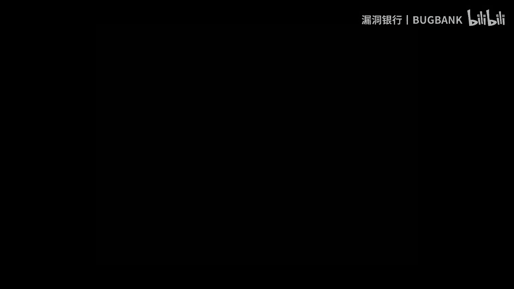

(CC字幕製作：貝爾)，(CC字幕製作：貝爾)，(CC字幕製作：貝爾)，(CC字幕製作：貝爾)，謝謝觀看，请不吝点赞 订阅 转发 打赏支持明镜与点点栏目。

