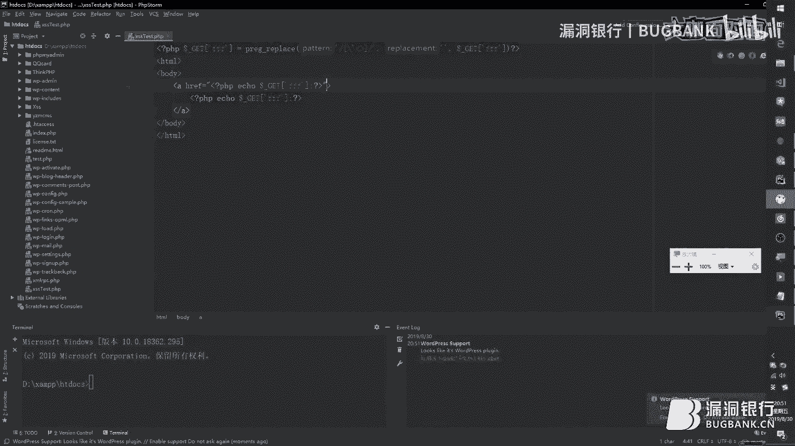

# 课程 P1：XSS Fuzz 的艺术 🎯

在本节课中，我们将学习什么是Fuzz技术，以及它在XSS漏洞挖掘中的应用。我们将重点分析一款名为XSS Strike的工具，了解其核心架构、工作流程和源码实现。课程目标是让大家能够理解XSS Fuzz的原理，并具备开发或修改此类工具的能力。

---

## 什么是Fuzz？🤔

Fuzz技术是一种在渗透测试中广泛应用的自动化软件测试方法。它的核心思想是向目标系统发送大量随机或精心构造的数据，以触发非预期的、异常的反馈。

**公式**：`Fuzz = 自动化 + 大量（随机/精心构造的）输入数据`

它是一种“懒惰”且“暴力”的技术。
*   **懒惰**：因为它是一个自动化过程，测试者无需手工测试每个点，只需关注和分析工具发现的异常。
*   **暴力**：体现在其测试速度和测试数据量上，能够在短时间内覆盖海量的测试用例。

与手工测试相比，Fuzz工具的优势非常明显：
*   **测试范围广**：能测试数万甚至数十万个Payload，远超手工能力。
*   **效率高**：省去了重复的手工测试成本。
*   **发现意外漏洞**：许多潜在的漏洞模式是固定的，Fuzz可以系统性地覆盖这些模式，甚至发现意想不到的绕过方式。

上一节我们介绍了Fuzz的基本概念，本节中我们来看看常规XSS Fuzz工具的具体工作流程。

---

## XSS Fuzz 工具的一般流程 🔄

一个典型的XSS Fuzz工具通常遵循以下步骤：

1.  **发起初始请求与信息收集**：
    *   向目标URL发起请求，并在参数中填入正常值（如`test`），目的是让参数值能够正常反射回页面中，以便后续分析。
    *   分析返回的HTML页面，寻找所有可能的用户输入点（输入向量）。这包括URL参数、POST参数以及页面表单（Form）中的字段。

2.  **WAF探测**：
    *   通过发送包含敏感字符的请求、短时间内高频访问等方式，试探目标是否存在WAF（Web应用防火墙）。
    *   根据返回的状态码、响应头（Headers）或页面内容中的特征（如`cloudflare`、`waf`等关键词）来判断WAF类型。

3.  **识别潜在注入点**：
    *   在第一步收集到的输入向量基础上，确认哪些参数的值会被输出到返回页面的特定位置。这些位置就是潜在的XSS注入点。

4.  **Payload生成与测试（核心阶段）**：
    *   开启一个Payload生成器线程，根据注入点的上下文信息（如在HTML标签内、在JavaScript代码中、在属性值里等）智能生成测试Payload。
    *   将生成的Payload放入一个队列。
    *   开启一个线程池，从队列中取出Payload并发起测试请求。

5.  **结果验证**：
    *   **字符串模糊匹配**：比较返回页面中是否包含我们提交的Payload（或其特征）。这种方法速度快，但容易误报。
    *   **浏览器引擎验证（如Selenium）**：通过控制无头浏览器，监听弹窗、页面标题修改等实际行为。这种方法无误报，但速度较慢。

6.  **智能调节**：
    *   如果探测到存在WAF，工具会合理控制请求频率（例如加入延迟），以避免被屏蔽。

了解了通用流程后，我们接下来聚焦于今天要分析的强大工具——XSS Strike。

---

## XSS Strike 工具架构概览 🏗️

XSS Strike是一款用Python编写的优秀XSS Fuzz工具。它的特点是生成的Payload针对性强、结构复杂，能智能适应注入点的上下文环境。

**代码**：项目地址 `https://github.com/s0md3v/XSStrike`

它的主要功能模块包括：
*   Payload生成器
*   WAF探测
*   全站爬虫
*   四种检测模式

其核心代码结构如下：
*   `xsstrike.py`：主程序文件，负责参数处理和整体运行逻辑控制。
*   `core/`：核心模块目录，包含`config.py`（配置）、`dom.py`（DOM分析）、`generator.py`（Payload生成）等。

XSS Strike提供了四种操作模式，我们将逐一简要介绍。

以下是四种模式的说明：

1.  **单一Fuzz模式**：主要用于探测WAF类型和寻找合适的请求延迟时间。使用`-u`指定URL，`--fuzzer`参数开启。
2.  **爆破模式**：使用用户提供的或内置的Payload字典进行测试。使用`-u`和`-f`参数（指定Payload文件）。
3.  **扫描模式**：**这是最核心和强大的模式**。它集成了完整的Fuzz流程：信息收集、WAF探测、注入点识别、智能Payload生成和验证。如果不指定其他模式，默认开启此模式。
4.  **爬行模式**：一个内置爬虫，可以爬取指定深度的页面链接，并对每个链接执行扫描模式的操作。使用`-u`、`-l`（深度）和`--crawl`参数。

接下来，我们将结合源码和流程图，深入剖析扫描模式的工作流程。

---

## 源码流程分析（扫描模式）🔍

我们不会逐行阅读代码，而是跟踪其关键的执行逻辑。主控流程在`xsstrike.py`中。

### 1. 初始化和参数处理
工具首先导入模块，处理用户输入的命令行参数（如代理、超时、Headers等）。

### 2. 发起请求与DOM分析
通过封装的`request.py`向目标发起请求。如果使用了`--skip-dom`参数，则跳过DOM薄弱点分析。`dom.py`模块会分析页面中的JavaScript代码，寻找“可控数据源”流入“危险函数”（如`eval()`）的路径，标记为薄弱DOM节点。

### 3. WAF探测
`waf.py`模块被调用。它通过发送特征请求，根据响应状态码、跳转、页面内容关键字等对已知WAF特征进行匹配和评分，返回可能性最高的WAF名称。这个模块非常完善，可以直接集成到自己的工具中。

### 4. 查找输入向量
如果使用了`--find`参数，工具会使用`core/arjun.py`模块在页面中搜索所有`<input>`标签的`name`属性值，并与内置的常见参数名列表合并，形成待测试的参数列表。否则，只测试URL或POST中已有的参数。

### 5. 注入点定位与上下文分析
这是智能Payload生成的基础。`core/htmlParser.py`模块会对每个参数进行测试，确定其值在返回页面中的精确位置和上下文环境。

它会记录以下关键信息：
*   `position`：反射点在页面中的字符索引位置。
*   `context`：反射点所在上下文，如`html`、`attribute`（属性）、`script`（JS代码）、`comment`（注释）。
*   `details`：详细信息。例如在属性中，会记录标签名（`tag`）、属性类型（`type`，如`value`或`name`）。
*   `quote`：包裹反射点的符号，如单引号`‘`、双引号`“`或反引号。
*   `badTag`：如果反射点位于``），然后再构造后续的XSS Payload。

生成的Payload会被分类并赋予一个`case`值，`case`值越高代表成功率可能越高，工具会优先尝试。

### 8. 多线程测试与验证
生成器不断生成Payload放入队列，线程池从中取出并进行测试。验证方式主要依赖模糊匹配。如果用户没有使用`--skip`参数，当工具认为某个Payload可能生效时，会暂停并询问用户是否进行基于浏览器的二次验证。

通过以上流程，XSS Strike实现了高度自动化和智能化的XSS漏洞挖掘。

---

## 总结与收获 📚

本节课中我们一起学习了XSS Fuzz技术的核心思想与完整工作流程。我们以XSS Strike工具为例，深入分析了其架构设计、四种模式以及最核心的扫描模式是如何一步步完成信息收集、上下文分析、智能Payload生成和漏洞验证的。

关键要点回顾：
1.  **Fuzz本质**：自动化、大规模输入测试。
2.  **核心流程**：信息收集 -> WAF探测 -> 注入点定位 -> 上下文分析 -> 智能生成 -> 多线程测试。
3.  **XSS Strike亮点**：智能的上下文感知Payload生成、完善的WAF识别库、模块化设计便于集成和修改。

希望本课程能帮助你理解XSS Fuzz工具的内部原理，并为你开发自己的工具或定制化修改现有工具（如XSS Strike）打下坚实的基础。记住，工具是思想的延伸，理解原理才能更好地利用和创新。