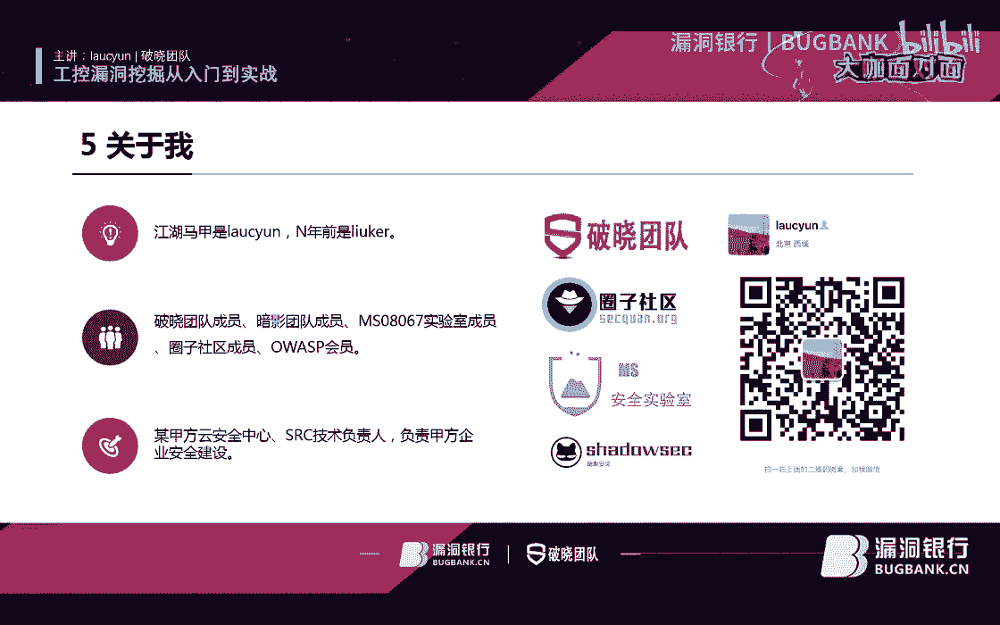

# P1：101录屏_x264 - 漏洞银行BUGBANK - BV15J411P77f

Yeah。

为知识而存，因集事而生。小伴晚上好，欢迎参加第101期漏洞银行安全技术直播大咖面对面。我是持秋秋。那今晚将进行直播分享的是一位对公共安全有着深厚经验的大咖刘政权。它的主要研究方向是工业控制协议分析。

网络流量分析与建模工业控制系统漏洞挖掘。同时他也是破小团队成员暗影团队成员MS08067实验室成员圈子社区成员SP会员。那身兼多重社会身份的证券大咖，将在今晚为我们分享自己对公共安全漏洞挖掘的独家解读。

带你从入门到实战从工业控制系统的安全开始，兼秘工业控制协议安全分析，及分享一些常用的公共安全漏洞挖掘方法。今天的内容难度四颗星充实有料。感兴趣小伙伴们千万记得天到最后，不要错过证券大咖充实的干货分享哦。

议题内容演讲完后，会有集中问答交流环节。大咖会针对大家提出问题进行解答。问答环节后，还有直播福利等你获取。大咖会选的一名幸运观众送出他亲听一本书籍。姚教授的工业控制网络安全技术实践。

祝大家对工业控制这块领域更上一层楼。那好了，下面就请证券大咖派进天分享吧。

我们我今天主要是讲33块内容吧，就是第一个肯定是呃可能在座的就是在厅内很多朋友就是对公共安全，这不是特别的了解。然后我就稍微介绍一下，接着就是介绍就是一些公共协议。然后这些公共协议里面，他就是由。嗯。

脆弱性分析对他做一些个脆弱性分析吧。然后最后我们就是嗯介绍一些常用的公共漏洞挖掘的一些方法嗯。最后的最后我们做个总结。OK我们。先说公共安全，什么是公共安全？嗯，再说公共安全之前，我嗯我们先讲一个。

讲一些典型的安全事件嗯。10年的震亡事件，估计大家都听说过，这是很典型很典型的一个公共安全的一个事件。然后接着就是15年的乌克兰电网，那个重病毒的事件，在是这个17年大家都深有体会吧。

包括现在可能很多的电脑也有中这个病毒了。接着就是18年，然后欧洲废水那个处理服务器被那个恶鱼蓝件中入侵了。然后他的HMI服务器是CPU是拖垮了的。嗯。

4月份是由4家美国的苏去管道公司遭到了那个供应链的攻击。接着就是6月份，这个三一重工这个事件嗯，我相信很多人在当时看新闻嗯都有所了解。然后接着是8月份那个台积电，台积电这个事情当时还闹得挺大的。

就是嗯有3座42寸的那个盐金船，就是遭到病毒的入侵。所以说他的经济损失嗯。我从网上查的资料应该是11。5个亿，估摸着是这么一个事件。然后是19年3月份那个委内拉委内内拉那个大规模的停电事件。

这个这个事件就是好像反反复复已经好几次了吧，然后就是7月份这个是美国纽约就是停电4个小时，那个是不是伊朗干的，这个事情就是不太确切。但是呢，反正就是。是一个公共安全的事件。然后接下来我们就来看一下。

就是说嗯这是一。个两个统计图第一我们先看左边这个左边这个应该是一个全球那个公共安全事件的一个统计。嗯，我们可以发现啊，就是这几年那个出现的公共安全事件就是最稳步的一个增长。

你看成10年的39到18年的320，相当于增长了大概是3八倍。嗯，涨了8倍。然后呢，我们再看右边这张图，这是什么一张图呢？这是遭受遭受攻攻击比例最高的，就是10个国家。

就是公控公控里面就是像他们的公控工业控制系统遭受攻击最高的10个国家。所以说。这几年啊就是说对公公共系统的攻击，就是嗯给企业给给给企业带来了很大的损失。所以说嗯公共安全也就是比较越来越突出这个问题。

然后我们。讲了两个讲了8个78个那个公共典型的一个公共事件。然后我们讲了一些统计的数据。然后我们接下来就是讲。工业控制系统。那么嗯我不知道大家对工业控制系统是不是了解哈嗯工业控制系统它是这么一个东西。

就是有各种自动化控制的组件以及嗯实时就是进行数据采集啊，监测的过程控制组件共同构成一个确保那个工业基础设施自动化运行固能控制以及监控的一个系统是很大的一个系统。然后呢，它包括了哪些东西呢？

像我们像PPT也列了，像有有DCS啊，有PLC有TU还有IED就是等等等等的，就是有各种那种组件组成的。嗯，然后我们看右右边这张图啊，这是一个很典型的一个嗯工业控制网络。

那我们先看下面它应该最下面是一个控制系统的一个网络像它有DTU有PLC。有的人对类的。一些。一些设备，然后再往上一层，它是有那个过程控制和监控网络，像那个有sca达系统啊服务器，有scada服务器。

然后接着他网上它就是一个企业网络了。嗯，在企业网络里面，我们都知道他的邮件啊，web和那个ERP那些业务都是需要与互联网相连的。嗯而那个MES的话，它是以下面的那个过程控制网络相连的。

所以说他要通过这去去获取生产过程中的各种数据啊，并且下达下达那种生产任务。所以说现在有很多那种病毒，都是通过这个途径，就是这个通道进入了那个企业的网络企业网络里面，包括进入到过程控制网络。

最后可能还进入到那个控制系统的一个网络里面。之所以说嗯这个这个这么一个问题，就是说一本基本上所以说是工业控制里面的一个主要的一个威胁吧。嗯。讲了工业控制系统。

那我们就是这接下来就是聊一聊什么是那个工业控制系公共安全。嗯，我参考的是一个国外的美国的一个一个标准，它叫IES62443。它对工业控制系统的一个定义吧。它包含了下面这几部分。

一个是它肯定是要保护系统所保护系统所采取的采取的一些措施。然后建立和维护保护系统的措施所得到的一些系统状态。接着就是能够免疫对系统自眼的一个非法所。被授权访问和那个非授权或者意外的变更后破坏一个损害。

它能够对他进行保护。然后基于计算机的能力，能够保证非授权人员或者系统既无法修改软件及其数据也无法访问系统功能，却保证了授权人员的和系统不被阻止。

最后一个就是防止对公公共系统的非法或者有害的入侵和干扰其正常或计划的一个操作吧。嗯，最后我们就是讲完了这个公共系统，它这些一些一些。那个那个对他的一个就是。嗯，定义吧也不叫定义，就是一个概括。

然后呢嗯我接下来就介绍就是公共安全为什么就是说嗯比较难做，它其实有一些特殊性。嗯，我们成就是。从那个从四个角度来说吧，第一个角度肯定是从网页网络通信协议嗯，公共系统里面它采都是一些私有的协议。

像每个厂商他采集的协议都不一样。像那个莫迪康他的mo8是西门子是S7，然后30是3420的协议。然后反正等等等等之类的吧。然后。😔，他的要求就是系统稳定的一些，他的要求是特别高的，就是。

就就就可以这么说嘛，就是网络安全造成网络安全造成了误报就等成一攻击。所以说你可想而知，他是对他的稳定性的要求有多高。然后他的运行环境是不跟那个不一样的。嗯，公共系统运行环境是相对落后啊，大家都知道嗯。

工业控制系统一般的是不可能用5年或者是多少年就废弃了，这不可能肯定是10年以上，10年20年这种。所以说现在大部分工商还是用的是那个。是那个嗯windows叉P系统的，包括更有甚者还是03系统都有可能。

所以说他就是系统应行环境不同，然后他的安全安全防护要求高，因为你是不可能嗯，大部分你应该是不能通过补丁来解决那个安全问题。人家工厂也不同意你去打什么补丁之类的。嗯，像很多工厂，他有他有病毒就有病毒。

我也就就这样了。然后呢，我也不会打什么补丁，人家就是求稳。😔，求稳他也不会是求安全。之后后面我们再继续讲。然后。😔，讲了这个，最后我们就是来对比一下公控安全和产统安全到底有什么区别呢？

首先就是要说到就是。对比，那我们肯定是成信息安全的三个三个属性，那个机密性、完整性和可用性。三个属性。在传统安全里面说，它的优先顺序是嗯机密性，然后完整性、可用性。然后在工业控制系统呢。

它肯定是可用性、完整性和那个机密性。所以说正因为这个原因导致就是工业控制系统，它是以可用性为第一安全需求。然后传统安全是以机密性为第一安全需求。所以说正因为这么一个差异啊。

导致他成防护目标呀、网络架构啊，数据传输，然后应行环境物理环境以防护的一个技术到管理维护都是有很多的差异性的。嗯，我接着我们就对这7个点，我稍微讲一讲，就不讲太多。这个。具体的其实网上都有相应的资料。

我先说一下这个防护目标。防护目标首先我们说公共安全，它是在不利的条件下维护生产系统功能的正常运行，正常可用。然后呢，还要确保信息实施下达下发，然后防还要防范外部或内部的一个网络攻击啊。

传统安全是相确不一样了。你看在它是要在不利的条件下不出现，保证不出现信息泄露啊。然后呢保护信息资产的一个完整性。然后基本上就不考虑那种什么实时性了，实时产地的一个实时性了。然后。

同时他也他他也是防护外部和内部的一个网络工具。然后从网络架构来说，公共安全它的网络是特别复杂的。像有多种网络混合，包括什么有线啊、无线啊、无线通信啊、无线电啊，还有移动通信等等等等等。

各种然后传统安全其实相对简单，就是要么就是嗯有线或者无线之类的。然后然后就是嗯还有就是像公共安全，它的那个通讯协议复杂呀，包括很多的就是专有的是友协议啊，刚才我说了就是举的那些例子，等会我们具体再讲。

然后。还有一个都是设备。嗯，我们传统传统安全里面一些设备就是要主机啊或者一些防护的一些设备啊。那个公共安全，它有像刚才我们说了，有PLC啊，有sda，有DCS，有ITU各种不一样的设备。

各种各各样的就种类特别多。如要说你要对它的一个资产探查或资产管理的话，是非常的麻烦。然后接着就是数据传输了。数据传输像公共安全。他因为他对稳定性要求，然后对实时性要求特别高，所以说它不能出现那种延时。

所以说导致一个问题，什么问题，就是说你的数据传输是基本上是不加密的，然后传统安全是恰恰相反，他就是对那种实时性啊要求也没那么高。所以说基本上咱们也知道就是加密传输的。然后从应雄环境来说。

刚才也讲了一点点，就是说像公放安前它的网络是相对隔离，它是基本上不连外网的。然后操作系统也老呀，很少也不能打补丁也很少打补丁，然后基本上也不装那种杀毒软件等等之类的。然后嗯所以说它的安全漏洞较多。

所以攻击面也更广了。像操作安全的话，它网络和互联网是相通的。所以说它那个操作系统也行，然后也可以频繁的更新补丁，杀毒软件也是标配。所以说它的漏洞是相对较少的较晚，所以说它的攻击面肯定是更少了。嗯。

物理环境的话就不说了，肯定是工业环境的要求更高了，像什么湿度啊，温度啊，肯定是要在集时或者积高温或者说积低温的情况下进行那个呃穿完前，咱们就是像供主中一样供着它，就是有个专门的一个机房去供着一下。

所以说这也是很大的一个区别。然后还说一个它一个物理环境还有一个区别，就是说像公控里面就是也没有什么专有的机房，所以说也没有监控，所以说像有一些地方有些工厂他也是出入也是不需要登记的。

那穿的完全就是不一样了，就是有监控，也有都出入都需要登记的。嗯，防护技术的话防护技术嗯比较多。就是像有硬件，有有软件啊，硬件的话，所以说遇到一些嗯嗯像物也就是说刚才说的我们说的一些物理环境，你要去防丝。

还有防潮等等的一些因素，你得考虑。然后呢嗯散热的话，咱们就是工控里面大很多设备，它是没有咱门的风散的。所以说它设的是基本上考那种嗯铝铜啊等等设备自身的一个散热。然后就是说延时就是说你一个防火墙。

你可能不能出现延时了。嗯，然后因为刚才我们讲了，他就是实时性要高，所以说也不可能出现延时，所以说它的延时一般是在100微秒以下。然后那个传统的一般是在毫秒级以上了，或者以下或者以上都可以的。然后嗯。

硬件的话，你还得去深度识别那个公共协议。这传统的基本上TTPIP那些协议就O就OK了。然后。最后我们说一下那个管理维护那个区别，像管理制度不完善呀，甚至像公安前，他管理制度不完善啊，公一些嗯嗯缺失啊。

然后也缺乏那种专业的技术人员。所以说设备还有一个点就是设备他依赖的是那种供货商。供应商提就是供提供商嘛举个很简单的例子，就是我今年处理了我一个螺射病毒中，就是一个中毒事件。然后呢。

他们第一时间找的不是安全公司，找的是供货供应商。然后呢，我们过去之后，我们给他排查出问题了，然后所有的锅都是供应商背。所以说这也是很大的一个区别。嗯。6。OK那这两者的区别我就讲到这了。

然后什么是公共安全，我也讲到这儿。然后我们接下来讲什么呢？讲成讲协议了，我不知道大家有没有之前有没有对公共安全，就是公共协议有所了解的呃。😊，有了解的也没事，咱们继续再重新就是看一看了解一下。

然后我嗯看PPT上哈，我们就是列举了一些常见的一个公共协议。嗯，前不久有人在群里问我就是公共的五大协议是啥？我说也没这个定义吧，五大协议。要因为我让我去评五大协议的话，我想应该是第一个mod了。

因为森用的是最多的。然后第二个应该是OBC然后就EC然后得西门子的S7然最后一个是因为我让我评的话，我估计我就评这5个了。嗯，然后我们看到上面应该有14个公共协议。嗯，可能大家很多都没见过。

但是有些肯能见过，像听过mod肯定是听过的mod最常见的公共协议了。😊，西门子的S7协议，然后是net，然后是DP33欧姆龙f然后G翼的翼的协议嗯，好像目前国内研究出来的好像不多，但是能识别出来。

但研究出来就深度解析出来的，应该是不多的。然后30的协议嗯，我这近有个朋友在研究那个30的C好像哇好几个楼洞来了。然后那个ECEC他的家族特别大，像什么104A61850等等反正特别大庞大的。

后最后C应该是大部分厂都是都都有1个PC服务器的。然后我们说一下，就是挑几个简单的挑挑我们就说第一个和第二个，我们先说modtorva嗯。

modtorva它是嗯嗯莫莫迪康这个公司发明的一个串一个C际上使用的一个串新的一个通行协议了。因为它是以简单，然后健壮开放，且不需要特殊特许的一个授权的一个特点。所以说成为嗯。

通用的一个工业控制通工业工业协议。然后就我们说S7S7，我们我们今天讲只讲那个S西门子的那个PC的协议，就是S7协议。S7协议它分为好几种。的。接下来我们再讲。然后我们现在S7S7。

我们也叫step7同一协议，它是西门子的一个私有协议。目前晚上嗯。我要下个虽然减了一部分，但是很多都解错了的，有一大部分是他是解析错误了的。然后呢嗯嗯像S另外1个S7plus也基本上就是有人有研究过。

就是嗯但是也不太完善。所以说基本上咱们研究它基本上是考那个理向啊，然后去考，就是各种就通过就是呃等会我们讲一个实例，就讲一个未知的一个公共协议。你看看我们是怎么去分析它的嗯，OK。

接下来我们看我做了一个统计哈。我对就是国内的一些PLC的一些通信协议做了一个统计。嗯，这里我。嗯，应该是找了7款PLC，因为板回来应该是我找了总个是10款。然后那个PPT返回来问题，我改成了7款。

然后我们先看那个南大奥志南大奥志他用的比较广泛，像什么铁路啊交通铁路交通然矿业冶金石油石化的之类的。然后他主要的协议就是摩TCP。然后永恒他永恒恒，他是台湾的1个PLC。

他是高性能一个中小型或微型PLC。然后。u。好像我没写那个因为那个那个那个领域哈，然后他有两种协议，一个是FATEK，然后一个是modtor buss，然后。😊，何力石大家都知道。

国内的比较大型的一个那个自动化厂商，合力石和浙大中控两家。然后我们看合力合力石，他是用冶晶啊建材呀，勤工交通电力啊等等等等些行业。然后它是modTCP协议和那个IEC60870-104协议。

然后我们看安控的。安控的它主要是用于城市供水，然后水处理一些协议嗯。所以说他的那个协议应该是modTCP或那个DP3。然后台达是台湾的一家，然后他是伊斯net的IP。然后和modtor。

然后分为也是台湾的，它是mod tP和那个 VIGORTCP或者UP。然后最大中控就是modtor tP我们可以看到。基本上就是以modtorbi为主了。所以说我们先讲modtorbi协议。呃。

烟的协议网上的资料也挺多的，所以说我简单就是快速的过一下。嗯，他是。嗯，是莫的钢公司1979年啊发明的一个通信协议，它的目的就是采用一根三角线嗯，实现多个设备之间的一个网络通信。然后随着mod的发展。

其实它可以通过呃传输传输传输媒介进行通信了，包括三角线啊、无线通信啊、光纤啊、光纤，然后以太网啊，所以说等等等等等。所以说这样就可以轻松的实现不同厂商家的控制设备之间的一个通信了。嗯，目前来说嗯。

modtorbi也有三个版本，就是说modtor bus ask和modPmod uRTU来我们看右边这个图啊。呃，我们也可以看到，先先看右边这个图的左边，它是一个modbu tCP的1个OSI模型。

我们可以看到它是称数据链入程，它是一个串口串口的模式，它是有一个组成两种模式，然后在应用层，它是一个mod bus是mod bus协议的一个呃一个mod bus协议层吧。

然后我们看TCPTCP它是首先是网卡成了，然后像嗯。然后TCPI然后mod tCP然后最后就形成一个mod bus协议。然后所以说大家以后说mod bus协议哈，mod bus协议它其实分为两种。

一个是modO。它的上一层是mod就是叫下一层，下一层是O，然后呢一个是 tP，然后他俩里面是包了一个mod bus协议。那我们看这个结构哈，我们看这个图。😊，这个图我们可以看到，其实。

这个绿色的部分就是mod协议啦，像有国罗马 code和date，然后像ITU的话，它有那个校验值RC然后它有一个呃从设备的一个I这个就是一个modmod的一个协议结构。然后我们看那个mod的个协议结构。

它首先肯定有一个传输够协长度，然后一个呃单元端叫单元I吧。中文方译一个叫un ID然后所以说mod也就是我们绿色的这个部分这一部分。M。嗯，像有f code，有date。

所以说其实mod的协议它只有两部分，两部分或者是两部分可以认为是两部分，一个是公能版，一个数据。😊，嗯，可以这么认为啊，但是有些不一样的功能版，它的结构又不一样了。所以说这个我们不继续讲。

然后我们看右边这张表啊，它是modwise协议的一个呃功能版常用的一些功能版。😊，下0一嘛，就是读线圈的状态，然后02它是。都去输入的一个状态。然后我们看17码。17这个是116镜子哈，16镜制编码。

不是那个1镜子哈，是17，它它是那个读写视叉计算器。然后这5A应该是没没没列出来。5A是1个斯耐德PLC专用的一个功能嘛。😊，等会我们具体来讲这个东西。然后在这里我要重点讲一个就是比较有用的。

就是08功能嘛，就是叫。诊断码叫08，然后08功程码里面它有很多的指码，像0101它是重启通讯选象，然后04它是强制监听模式，嗯，监听的一个模式。然后意3它是返回艺术错误的一个计数器。

所以说我一说到这个大家就是嗯上算环漏洞或者说做协议分father或者协议分析的人一看到这个眼睛就亮了吧，我就不需要多说了吧。O。我们接下来讲那个讲mod bus90码。因为mod bus其他工众码。

其实网上的资料太多了，就也就是所以说大家轻身一查就能查得到。那我们讲一个不一样的，就是90码，90码是啥呢？它是一个嗯我我们可以看先先先看这啊。😊，我们先看先看这一边，就是红框里面的。

我们看到FUNCUFUNC是什么意思？就是分割性code就是功能码。然后它的制符是unit，然后是施耐德括号施耐德，这是什么东西？其实它是一个施耐德一个专有施耐德的一个协议，它是。嗯。

我们我们叫的把他官方，我查了一下都掉。叫叫他叫UMAS协议。然后。他所以说我们可以看到在Y下载它显示是unit施耐括号客弧施耐德。然后。嗯UMAS协议它是耐PLC进行配置或监控的一个专用协议。

而且网上基本上也没啥资料的。我当初为了分析这个协议，就是主要是成这几个方面，一个是嗯流量我们是用去抓包，然后就去进行分析。然后德的1个PLC固件嗯。

通过逆向来获取跟那个UMA协议相关的一个一个一个相关的一些文一个函数。然后我们去再解析出来它是这么一个结构。最后就是就是反正就是通过。嗯，各种手段结果就整出这么一个结构来。这是那个呃UMAS。协议嗯。

我们可以看到，首先这个分型 code这个分型 code是mod bus的啊，它是固定的是5A。然后接下来有两个字节，嗯，我通知叫他叫UMAS code，就是嗯。😊，嗯，UMAS的那个功能码，但是呢。

这两位不一定两位，有的情况下就是有的情况下，他前面这就是嗯我们这在所哈，这是第一个字节是第二个字节。我们第二个字节的话，有的时候情况下是那个绘画D。然后呢嗯然后第三个字节才是功程码。但是嗯因为。😊。

通常情况下，那个第二个直接会RD都是000，就是有些很多这个功能买它的是000。所以说嗯我就把它归放在一块了。然后最后就是一个 payload的，就是da。

然后嗯da就是一个da就像跟那个mod bus一样，da这么一个结构。嗯，这是我整理的一个嗯嗯UUMAS协议的一个功能码。像01它是建立连接，然后02是读取那个PLCID然后03是那个读取项目信息。

然后接着我们可以看到那个像40和4140和4140是stop pLC不不star的PLC，然后41是stop pC启停那个PLC这两个功能码，包括什么上载上传算传嗯，公业里面可能叫上载啊。

然后下载呃请求算载请求下载，请求请求下载下载，然后下载完成。嗯，这么一个。呃，这么一个一个一个一个功能码，个反正就是功功能码比较多，包这也不是最完全的，肯定是还有一些我没解到的。

所以说呃大家如果说感兴趣的，可以去试试去尝试一下怎么解。😊，然后。我们讲一个举一个例子来讲啊，不在讲例子之前，我们先说一个这个东西。嗯，我们要肯定给公共安全做安全，肯定。有一个东西。必不可免的。

就说肯定会遇到的就是这场死别。那么就是说我们怎么去识别你的设备，然后他的资产信息，然后指纹信息提取出来的指纹信息。嗯，网上就是像莫迪康杠in点NSS我我因为有我用的是就是那个n map那个工具去检测的。

所以说网上也有这个这个脚本是。嗯，我是基于网上那个版本改了改改了一些东西的。嗯，所以说嗯这个这个这个地址打码的哈，因为是互联网地址，嗯，我不能公开的，然后端口是50啊。😊，嗯。

mod的那个协议的那个默认端口是502啊。然后你可以看到，就是说我们可以识别出来像他的那个嗯厂商啊，然后它的CPU模块的类型啊，然后嗯固件就是固件版本啊，然后那个嗯项目信息啊等等的之类的。嗯。

有一个地方挺有用的，我不知道嗯在厅内有没有做公共安全的同学啊。嗯嗯。像那个固件版本其实很有用的。嗯，因为你假如说你所有一个工厂里面有很多那种PLC的话，假如说今天嗯CNVD发了一个发了一个公漏洞公告。

说那个莫力刊的模款是就是BMXP342020这个设备。嗯，在V2。6的固件版本，包括V2。6的固件版本存在这个漏存在某某漏洞。那么。我要。我这个工厂我要立马知道哪些哪些PLC是这个版本，是是这个固件。

我要去进行更升升级更新的。所以说这个固件版本是挺好的，其实也挺重要的。OK那我们接下来就是讲那个车轮性分析，就是做一些分析啊。呃，我们可以看到这这个是一个请求啊。

你看我们看到他那个呃目标地目标端口是502，然后然后我们可以看这个结构，简dta是00000300。我们看刚才我们回忆一下03功能满足啥，是读起项目信息。OK这个就是刚才是请求，这个是响应。

我们看到就是说。我没我用颜色已经标注出来了哈，就是用嗯嗯每个。这个结构每每个字节代表什么意思？我都用颜色已经标注出来了，像5A功能码OK那没毛病了。然后00F1的话，它是啥呀？它是叫叫返回叫返回码。

如果说是00F1的话，就表示成功。如果说00FD的话，就表示错误。我目前我知道就这两个一个成功是00FE，然后00FD是错误。那么接下来9个之间我也不知道啥意思，我也不没研究出来他是啥意思。

然后接着还是重复的9个之间。😊，然后现接下来就是一个。嗯，修改时间像020C3B0C0101D107。那这个。这个怎么看出来就是时间呢？我们从后往前看，我们先看那个。嗯，D107。

我因为我们知道在那个在那个。工控里面大部分的设备就是说因为它是进入B叉 box，然后它的那个字节是高低高低交换的哈，就低位的低位在。😊，低位在前，高位在后，所以说它是B107。解说人是啥？是2014。

然后01是1月，然后011哈ABCD的1是14，然后0C是12时，3B是59分，0C是12秒。然后所以说他的修改时间是2014年1月14号，然后是12点59分12秒。😊，重复，然后接着重复这个时间。

然后接下来08003，有人可能不知道了，它就是一个项目的一个版本号。然后000呃，喂我也不知道啥意思。然后08它是一个项目名称的一个就是后面这一串的一个一个项目名称，一个长度。

然后说后面就是50766F6A65637400。我们可以看右边这个就看右边这个就知道了，它是project的，就是一个项目名词呢。所以说。通过你发送003000就可以获取到你的那个project信息。

所以说。嗯，这知识也不需要什么验证，所以说很轻易就获取到。然后我们接下来就讲一个那个。讲一个认人闹过的。嗯，我们可以看先看这个哈，先看这个先看PPT，然后我们可以看到他。😊。

根据刚才我们就是讲的这个结构，它是41功能码是啥？是stop那个PLC8，然后B8是啥？B8是1个绘画ID，然后FF00就是固定的一个值了。然后我因为我们绘画I它是B8。那么就是两位。

所以说他有256种情况，所以说我们只需要去便利它就可以去stop这个PLC。然后。因为当时我没没有那个我图没找到哈，我我用了那个SASma一个图嗯，感谢SSma啊，那个蒋总感谢蒋总。😊。

然后接下来我们讲就是讲西门子了哈。是不是有人那个嗯那个那个个那个那个想了解西门子协议了嗯，我我们先说就是西门子，我这把它归成三类。

就是说像S72340他因为这些早期的那个PLC他用的通信协议是S7协议S7COMM叫S7我忘记这个咋多了哈，就是S7COMM协议。然后呢，在S7-1200，就是1200版本那个如果说他的过版本是小V3。

0以下，我包括3。0，它是采采取了早期的那个S7plus协议的😊，然后呢，S7杠1500的话，他是。包括S71200。嗯，4。0版本以上的。就是4。0以上的一个版本，然后包括就是嗯S71500。

它采用的是最新的加密的一个嗯S7plus协议。嗯，这里我说一个东西，就是说其实在S7嗯。S71200V3。0和S71200V4。0，为什么他后面就是带了就是带有加密的一个同一协议？

其实这个阶段就是那个10年的那个正网事件发生导致的。所以说西门子公司对它进行加固，也就是我们后面看到的S71200的V4。0版本和S71500的S那个S7plus协议这个协议就是带有加密的。嗯。

我们接下来看那个S7S7协议，就是说我。我这里给出了一些东西哈，像那个我们看左边这样图啊，就是说它是S7，首先我们从上往下看，它是S7的1个OSI模型。我们先从我们前面的就是不看了。

我们只从TTP往下看，下面就是那个TPKT协议，然后是那个COTP协议，然后接下来就是S7协议了。然后S7它分为就是我们看到的它分为2块，一个是尔，然后一个是呃一个是参数，一个是头一个参数。嗯。

我们可以看右尾哈。看右边看右边这个一个图，我们先用TCP，然后TCP它分为头TTP头那个TTP那个配的，也就是TPPK1个PDU。然后接下来TK层的话，它是也是同样也是有一个头，然后呢。

那个COTP的1个PDU接下TP它分为三部分。有的时候分分两部分哈，就是看不同的应用场景了。然后像有头啊有参数啊，有那个S7的PDU啊，然后S7的话也是分三部分请求的话就是有些请求是分两部分。

有些请求分三部分的。然后响应的话大部分都是三部分像那个嗯有投，然后参数数据。嗯。这里就是因为S7协议太复杂了，就是说我们就是感兴趣者的同学可以去这个网址。

就是说因为我的S7协议就是嗯那个完全就是解解出来了，也可以给大家看一下。

这这就是像那个S7各种的各种的功能码干嘛的都已经解出来，有感兴趣的同学可以去这里看一看。

嗯，接下来同样也是我们先讲一个识别，然后。下午我写的一个脚本叫S7那个这这个脚本，然后我们识能识别出什么结果呢？像那个那个modmodel就是模块类型，然后是嗯系统名称，然后是那个模块模块一个串号。

然后等就是。那个包括那个序列号都能识别出来。这个我们就快速的讲一讲。来我们看一个月圈访问一个图案，一个一个一个视频。这个应该是。116年做了一个视频。这是一个公击脚本。

然后我们就是对PLC进行拼OK同能。现在就是发送攻击脚本，这个攻击脚本是一个。我看看是不是听到有个声音。不大的一个一个声音，我们可看到。我我们再仔细看看啊。诶。你可以看到它本来其实这个灯是绿色的。

就是在乱的状态。然后现在它是top，但是呢那个键它还是存在那个乱的一个状态。所以说物理开关还一轮数一站。而我们在那个工程师站看到的效果，一人还在运行的一个状态。

就是它那个PLC还在运起这个效果就是我们当初就是公司模拟那个正网事件的一个一个一个一个一个一个实验。一个模型反正平台。OKS7我讲的比较快，因为有些东西就是说嗯就是讲完介绍完了之后，大家可以去。

就是我已经给出链接了，大家可以去了解。因为关一个S7协议就是能讲好几天。因为它里面太复杂了，就是各种各样的情况都有。所以说我就不细讲，感兴趣的就是再去了解，我只是大概讲了讲，然后。呃。

这里我们讲一个就是怎么去分析那个工就像那种私有的未资的一些工工业协议。像我举个例子，就是以那个资道中控1个DCS像那个。嗯，我们知道知道公控，他是我我在官网上找到就只有这三款哈。

ECS100ECS700，然后GX300XP。然后大家都知道这大公控在那个嗯国内就是工业设施用的特别多，像那个核电、电力石油石化。

天然气然后化工交通运输、轨道交通都其实大部分都光都用了那个制造中控的DCS系统呢，是特别广。那我们先看两个VI效的一个截图啊。嗯，我们先先先先呃，这这一这里是一个请求和一个响应。

那么我们首先因为我们在在做公共协议识别的时候，其实我们早期就是嗯。就是111几年14年15年那会儿就是说嗯去识别一个公共协议。那会儿我们公共安全产商。有一个很low的一个方法，就是写跟档口匹配。

因为公共他那个工业协议它一般都用的是那个默认默认端口，像那个mod bus502S74102。所以说我们那会儿的一个操作就是用那个默认端口去识别公共协议。同样我们按照这个套路来。

第一步我们可以看到他的端口是那。12288。这是他一个默认端口，然后呢。我还整出一个那个呃关键字，就是特殊就是特殊值。嗯，特殊指向那个前面请求，它是有5343616574，它是SCnet。

然后响应它是SC net007。这是两个。两两个那个识别的方法。然后我们讲一个就是说它的结构，你看我们给出了一个。OK我们看像这个我们像我们乘d一层F1坡析的话，像我们可以看到01的话。

它是一个协议标志。然后0C1是一个尾号类型，然后00，然后豹文序号是1146，然后尾号字段是08，然后000，然后标特殊特征标志是04，然后这个是没啥，然后那尾号表所在的序号，然后这个是一个数据。

然后后面就是那个SS net，然后是这个应该是0000100这那个请求里面会带有的。那么这个是什么东西呢？我我们对照就是说因为我们去去抓包的时候，我们其实已经对到了那个嗯日志，就是操作日志。

然后我们三条我们对应的日志分别是444、56，像3949，它对应的是44。嗯，我们可以看到这这个日志操作是将尾号LIE030。一点PV，然后括弧D1209页位乘1。000改成20。000。

这么一个那那么在这个协议，刚才我们一直找说那个那各种各个字节，它代表的啥意思，那我们怎么跟他对应起来呢？我们看那个位号表哈，因为在大中控它有一个位号表，像那个我们先看。他那个OI10301是在哪是在这？

是。D1009页尾是在141。那么我们可看到这里位号表所入的序号，也就是他喽。就它0B0B是多少？11，然后魔录是啥？C1我对应起来了，跟那个问号表对应起来了。所以说我们知道的C一是魔录。

然后我们知道微号表是0B，然后我们就可以找出它这这条。11这条是干嘛的，然后。数据的话，20我们用那个浮点数16进制的个转换器转换一下，20转成那个浮点数是41A0，也就是000。

然后也就是说000A041了。OK完美的对上了，是不是？😊，总结一下，然后像A是什么？A次协议的一固定标志，然后B是什么？是位号类型，然后CC是微字的，然后报名序号各种我们就整理出来了。

OK这是一个至少中控的1个DCS最后。最后因为我们讲协议讲了挺长时间了，我们最后就是那个公共协议的。我们刚才我们一开始就是跟秋秋聊的时候，就是说最开始我们说嗯。

mod bus它的门槛比较就是不是不是mod公共安全的门槛比较高，高哪高端那些设备你买不起太贵了。所以说我现在。😊，整理了一些像mod协议的一些模拟。然后像西门子S7协议的一个模拟一个模拟工具。

然后A104点3等等这一些模拟工具。然后像但是这模拟工具也不是万能的哈，有些功能也是没有的，像modmod和 scan，它其实它拟的几个功能嘛，有些功能版是没有模拟出来的。嗯。

我对那些反真字源做了一个归纳，也就在这里感兴趣的同学可以记录下来，就是说这对你就是说节省了一个去整理的一个时间了。😊，像这个就是一个mod sky了，然后接着就是这个应该是那个SN7kind。

然后demo，然后接着一个就是最后1个OPCDAOBCUA的一个环境叫KEP eX。这么一个东西。OK我们刚才讲了很多那种协议。嗯，像。😔，像mod协议S7协议，然后就是1个DCS的一个私有的协议。

所以说这很多很多很很多种的协议。但是呢其实都靠了一个经验慢慢就摸索吧，反正就是这是一个很很。😔，很累的一个过程的。好了，那接下来我们讲的协议，接下来我们就介绍一些进入订舱部分。

就是介绍一些公共漏洞的一些挖掘的方法。嗯，说到挖掘方法，我们第一个想法肯定是白白合指是灰合是实和那个黑盒之是白灰黑。嗯，我们先说白盒吧，白盒就是就相当于代码审计嘛，像采用的工具有ITSITS4。

然后SPLINT那些工具。但是呢。缺点是啥呢？太复杂了，而且原来完有些东西，你像那个代码审计那个工具，其实有些并不完美了，然后耗时耗力又好嗯。又费时费力又费成本，所以说这是明显的一个缺点。

然后会合的话就是其实。😔，他覆盖面是比较广的，但是呢。嗯。有个缺点就是他其实也需要一些逆向的供底的那我们看那个。嗯，黑盒测试黑盒测试也就通我们通常讲的就是那个手工测试。然后那个自动化测识。

也就是说fa则。然后他优点是任何情况下合适的方法就是。有效，然后可以重现缺点缺点肯定也有，就是你不知道啥时候结束，啥时候停止，你也不知道，所以说只能就是去一个经验的积累吧。然后。

我们讲就是像那个网络攻击的一个方法，就是说有有的时候像像通过网络重放呀、严帝的欺骗啊等等之类的，就就也能做一个漏洞的一个攻击，然后能挖掘出漏洞来，这也是方法，像严帝的欺骗，就构造那个虚假的地址啊。

冒充合法的一个设备发送报纹。然后像。暴纹泛滥，像D6S，然后像重放等等之类的。然后网络探查，网络探查就是跟之前协议分析可能相关了。然后机型报纹，构造一些机型的爆放，就这个可能就跟发的有关了。

就是观察就是主机或者网络的一个崩溃的状态。然后我们现在接下来就是讲第一个就是呃漏洞挖掘的方法，就是向工业控制协工业公共协议的一个法则。其实我把它整理出来就分为6个部分，一个是目标识别。

然后第二个就是那个识别输入。然后第三个是生成模糊数据测试数据。第四个就是那个执行模糊测试数据。这第五个就是监视异常。然后第六个是检测可用可利用的一个漏洞。那么具体的是哪些呢？我们来看一下。

像第一个确认那个。确认目标的一个识别，像确认或者检测一个公控协，它的一个工作的一个协议，了了解它是不是存在已知或者位置的一个已知的一个漏动或者分析。首先你你得对你的目标清楚信息达断清楚。

达成情况信息书集等等之类的。然后第二个就是你得明确这个协这个协议的一个工作原理。所以说协议你是逃不过的，是不是然后网络分层啊，然后接入的设备一个方式。第三个就是研究协议的一个格式。

然后按卓逻辑快拆分的个字段，然后确定自当的数据类型。然后做字段做逻辑快进行发的一个数据集的一个补充或者完善。然后第四个就是研究协议应应用的收发包一个模式，然后利用组装好的一个发进行那个呃原理性探测扫描。

然后扫描出扫描前针对协议的应用选择适当的监控方法，然后扫描过程实时监控分析。那最后就是根据你的结果去看这是不是存在问题，如果存在问题，有什么问题，然后进行下一步分析，最后分析出一个它是不是一个漏洞。

大概就是这么6个步骤吧。然后我们讲个案例啊。讲一个案例像，我们可以看到左边。左边它是一个那个loc white的AB的1个PLC。J。嗯，应该是1400啊，它是1个1400。

然后我们也可以看到嗯右边这里面它其实它现在的状态是运行状态是呃正在运行。然后呢，它的梯形图也是完整的。你看这这些梯形图都是完整的，然后它的状态是那个。嗯，正在运行。然后。

我没看他因为因为那个脚本我没没拿出来哈，那个我们我只给大家看一个那个。就是攻击的一个过程，一个那个数据包。然后我们可以看到。我们这里有很多填充了很多那种0000000字节的那个每一层每一层。

然后前面有好多好多好多层都是伊斯兰的IP协议。然后这个就是我们可以看到在下面啊，就是在呃，因为起作用的就是这一串。然后我们可以看到在第三位呃，第四位它是那个18FF的话。

那么它就可以通过呃端口44818发送到那个PLC它可以导致那个PLC重新闪电。然后进行那个故障状态，一个清除线有提醒逻辑，就是你可以看到现在它状态是那个故障的一个状态，然后它还在逻提醒图已经没有了。嗯。

我们当初测试的时候，就是说其实我们也是一步一步来。然后呢，嗯像我们一开始发的就是这个，但是呢没有处罚。他其实有个还有个条件，就是前面他在填充。至少24个空制键才能导致那个崩溃。他其实。嗯。

说白了它就是一个导入你那个嗯内存溢出，然后导了一个崩溃。然后最后起到一个作用，就是这么一个眼理。你可以看到他的状态已经是已经fi failed，然后他听形图已经没了，跟之前的对比，他就是之前我为。

看到他是绿绿的，然后这里啥也没了，空了。所以说他就是这么就就啥也没了。嗯，这是发子啊，我讲讲的可能比较简单，因为大家对发子都比较了解。然后呢，我们现在就讲一个方法，就是固定逆向。嗯。

我不知道有没有同学接触，有没有朋友接触过逆向哈，因为。嗯，逆向功底还是要比较深的。然后是对案金这一些功底也比较深的。嗯，那我们开始讲，就是那个固件的一个逆向。嗯，固件逆向的话，其实它分为三个过程吧。

应为我我我觉得应该是。呃呃呃，两个三三个两三个过程吧，现在肯定首先肯定是固件识别和解压，然后在固建了一个镜量分析。嗯，为什么我在这之前我还是想讲一个，就是固件逆向分析，它为什么就是有用呢？

因为嗯固件逆向分析它是在不对嵌入式系统进行实际的运行的一个情况下，通过对固件文件的一个逆向分析解析，然后分析固件中的一个代码的模块调用关系或者代码内容。

从而发现那个嵌入式系统可能存在的一些漏洞或者后门啊等等的一一个手段吧。所以说从从这一段介绍来说，我们就知道那个固件立向很厉害吧。是不是？所以说。首先我们。我们来看固件识别和解压。

我们可以借绍一些纯熟的工具，像b外壳和别T呃，右边它是一个对照图啊，也对照表这个大家自己看嗯。然后呢，像对。我在这里再说一个，就是对那种无法解识别或者解压的固件，我们还有什么方法呢？像。嗯。

第一个我们想使用文件文件分析工具啊，然后获取固件印象文件的一些数基本的数据类型啊。然后我们就是可以去进一步就是去把它的那个投头改。然后使用字物串打印工具，提取文件中所包含的那个明文字段。

寻找是否有引导状载程序以及操作系统的一些内核信息，然后使用十六进制转存储工具，然后分析是为了对齐固件。嗯，文件空间分段放入了联系填空字节。然后我们就是有可能文件的系统的一个标识就在它的后面。

所以说最后一个方法就是文件系统有可能使用非标准的一个特殊符。那么发现这种可疑的特殊符，我们就可以尝试去替换这种标准的一个特殊符务，然后我们尝试解压。然后。这是一个经验积累一过程。所以说这是靠经验的。

所以说大家可以多试试。嗯，郭建郭建，然后接下来就是那个呃计量分析。我们进量风析主要其实嗯这固件解压之后，我们就是其实对常用的漏洞入口进行静态分析啊，包括密码或者开始的服务或者端口维配置文件。

像常用的方法其实有了什么事，我也也出来试过。像第一个传是提系文件中所包含的明码字段是否存在硬编码。然后第二个就是发掘固件的一个关联性，包括分析固件的一个作者库使用目录结构，然后配置文件等等等等一些。

一些关键字，然后定制的一些那个。嗯，默认的一些密码。然后第三个就是对案例字可执行的文件进行反复别分析。这个等会我们讲，然后借用一些存储像IDA然后那个 dragonragon那个人龙。

然后cap store等等一些工具。然后对特定的一些嵌入系统进行。我们肯定第一个肯定是对那个登录模块进行反馈一遍分析，获取那个登录密码哈息算法。那么我们又意到个问题，你获取到的那个密码可能是一个哈希值。

那怎么办呢？如果说发现包含密码哈希的一个文件，那我们可以考虑用GR，然后那个HS等一些工具进行暴力破解。也就是这两个这个帅帅的一个头，然后这个一个钥匙的HS和那个GR这两个工具进行一个暴力破解。

可能还有一些其他工具，像那个呃卡下面有一些有还有一些挺好用的一些工具，就是也可以也可以用来。那我们讲了那个库件分析，我固件识别要解压。然后那那个镜量镜态分析。然后我们现在讲一个库件立项的一个案例。

这个案例比较经典，然后呢可能有点难度，然后大家就是不懂的，就是仔细听哈。嗯，我们选择的这个对象是啥呢？是施耐德昆腾PLC然后它是NOE711的1个1个一个1个以太网卡的一个模块，也就是这个这玩意。

这货就这个东西。是不是看起来小小的，但哎长得感觉挺帅的，是不是？😊，然后我们按照刚才我们讲的一个方法，首先就是通过Brack来确定就该文件的一个压缩类型一下以识别。像我们Bwe它然后我们可以看到。

我们发现他的类型是Z。dlablab类型的，然后我们尝试进行解压一下。BY杠1进行固定一个解压。我们可以解压出，像在我们可以发现它解压出了一个文件。提取出了那这个dlab一个要缩文件。

解压解压后我会看到在这。有一个文件名叫3825的一个存储。嗯，一个一个文件，然后。他为什么叫385呢？也就是他的那个嗯升级包的一个起始位置来命名的，就是385，然后他对应就是385。

OK我们现在已经识别出这个物件了，然后并且解压出来了。我们得到文件385。那么下一步我们怎么办呢？OK我们继续往下看。我们首先我们去通过去去删我这个文件去，我们可以看到一些像进行发现有固件的一些路径啊。

路径名或者操作系就是像那个像那个翻一些3W root等一些特殊的一些文件名。这个图我们截全啊，其实还有很多钱，包括嗯我们可以就是去就是可以得到那个操作系统的版本，它是2。5版本，它操作系统。

然后它甚至它那个符号表，它是0X301174。所以说。根据我们得到的信息，首先我们知道他操作性的是visa works那个2。5版本的。然后我们后面就可以结合visa box的一些嗯官方文档。

然后进行下一步的一个逆场分析。然后我们说一下这个符号表地址，它是有什么用呢？嗯，符号表它其实我们可以用来修复嗯返汇变代码中的一些函数名，就是等会儿也有用啊。嗯，我们先跟他大家说这两个东西都有用。

那我们现在看。嗯，我们。嗯，拿到这个文件，然后我们下面就是要呃用那个IDA去分析。那么但是分析之前，我们肯定要知道那个我们现在所固建的1个CPU架构。所以说我们用B杠A这么一个命令像沙巴博那个小海象末。

就是指默的那个东西，然后显示出来，我们可以看到就是。嗯，他的那个嗯PCPU架构，它是power PCC big安。嗯，也就PPC这么一个结构。所以说我们在IDA里面。

我们选择呃呃处理器或者说CPA架构的时候，我们就选择PPC这么一个架构。像选择这我们就选择PPC。然后接下来就是说。呃，要你选择那个rome的一个呃加载地址，那个呃输入文件的一个加载地址。

我们先默认以零来为为数为。进行测试。进行分析。然后我们可以看到哈，我们以这么一个情况下去的话嗯。😊，可以看到他就是自动识别出来那个函数名啊。就是特别少，就是稀收了那么几个吧，就是这里有几个，这里有几个。

也就是这么几个。那是什么原因呢？嗯。这是什么原因导致的呢？因为不可能这只有这么几个文件这么大一个固件，只有这么几个函数，这肯定是不对劲的一个东西。那我们。嗯。

我们先来看一个就是那个pro PCC的一个计就是一个计算器的一个说明一张表，我们看到。我们先来看那个R一。IE它其实IE计算器它其实一个站的一个指针。然后呢，R3。我们在看那个R3计算器的话，它是一个。

安装计算器，它是其实就是一个嗯那个第一个参数。第一个参数是所以说我们现在回到的那个就是我们刚才打就是用IDA打开的那个那个那个I那个后编代码，我们可以在这里看到一段。想。呃，其实这段啥意思呢？就是其实。

😮，我先就是先把转的地址设为0叉100004个0嘛，1万。然后呢，将第一个参数F3计算器的值设为0差0，然后随着。在站上开辟0XE0个字节的空间，跳转到当前地址0X就是加0X。

也就是刚才我们的尾号就是呃符号表就是呃ECD34那个0X不是不是不是那个哈，就是这里。ECD34要加加这么一个，然后跳到了这里，就最后也就是说0X000ECD94最后得到这么一个地址。然后我们根据。😔。

那个。呃，V叉 works的官方文档哈对内存的一个呃布局的一个描述。我们可以知道那个站的初始化。嗯，是那个USUSUSR。INATUSI就是用户初始化的一个函数在初始化的一个占的。

所以说嗯us in那个函数，其实它就是那个。它是引导就是系统引导后运行的第一个函数。再结合刚才我们分析的这一段这一段代码，我们可以说我们基本上可以确定的是第一个跳转的地，就是第一个跳转的地址。

也就是us in这个函数地址。所以说对照刚才那个布局图。呃，初始化站的地址同时也是固件内存加载地址啊，因此，RE计算器指向的0X1000，也就是我们所需要的一个固件加载地址。所以说根据。

这里我们把他的加载地址改成0X1100000，嗯，下面同样也是，然后我们就。得到了这么一个，我们可以现在可以发现它的那个函数有很多了，就识别出很多了。就是像现在嗯这里应该没显示来，应该大概有。

有好几千8000多个吧，反正挺很多个。呃函数。所以说。都已经全部识别出来了。所以说看他的那个。然后这里有有一个东西，就是可能比较比较比较麻烦的一个东西。

然后再结合就是是那个因为刚才就是因为我们要去去用一个脚本去去自动加。因为这些函数就是这些就是我们刚才识别出来这些东西啊，这些东西它是符号表都没有修复。所以说我们要去进一步修复。

也就是说我们需要刚才我们利用的东西两个值，也就是这一个是内函数的内存地址，0XEFF058。然后一个就是函数名所在一个内存地址。嗯。在讲这个之前哦，因为那个VR works的。

它就是有一个比较特殊的一个东西，就是说。他的字节排序，他有独特的一个格式啊。他是以16个静子为一组，前面四个字节，他说函数名的一个内审地址，然后后面四个字节，它是函数的一个内审位置，然后以另外四个字节。

数据的一个特征字节，一个数据加上那个四个字节0X00结尾。所以说。是这么一个结构，是116个16个字节为一组。所以说嗯我们通过就是可以去。刚才我们就是得到这两个地址，然后我们最后就是嗯。就计算出来。

其实我们是要得到了一个。另外也就在这，我们一个加载地址，它就是就是嗯0X301164。然后另外一个地址是0就最后结束的位置就是0X32930A4。嗯，可能可能这里讲的，就是可能不是那么通畅啊。

回头就大家有问题在私底下问，然后我们可以得到那个就是通过这个脚本去修复去去去通过那个去修复这个这一串。我们最后得到了就是我可以看到。这里所有的函数不是像刚才一样SUB什么什什么开头的。

现在都是一个函数名，OK都已经非常清楚的显示出来。所以说这里所有前面一些工作都是一个预处理的工作。所以说现在我们就可以接下来就是做一些分析了。前面可能就是比较比较比较痛苦啊，就是各种各种就是处理啊。

易处理啊，反正就是比较麻烦。然后接下来刚才我们也讲了，就固件分析。我们嗯他家的就是去分析那个函数登录的一些信息啊。然后我们现在就是。嗯。我们分析一个函函数叫loinus aD那个调用。因为在us。

然后后面它调用了us aP in，然后最后他调用了lo aD的呃，反正就是各种附叫调用。然后我们最后在那个。lastst used AD的调用这个函数里面我没发现。这这些玩意儿像那个一些用户名啊。

一些密码。所以说基于固建一个逆向分析一个漏洞挖掘，其实它可以发现一些隐藏比较深的一些呃软件的后门的一些漏洞啊，所以说它是。哎，怎么说呀，还还是比较通用的一个方法，虽然比较难啊，但是。😊，嗯。

他它也是一个不归路哈。所以说在公控公共领域里面，所以说承就是承认时数量比较庞大，一些嵌入系统。所以说这些系统大陆是采用固件的设计的方法来来更新。所以说多数的固件只能就是直解压，只压缩了，没有加密。

所以说。多数的固件采用了，而且多数固件采用的是V works，所以说感兴趣的同学可以试一试，包括去了解Vwork的一些指令啊，些节震器啊等等之类的。所以说对你做公共安全，一个漏洞挖掘还是比较有用的。

最后就是。嗯公共安全漏洞的一个做一个总结。嗯，两句话很简单，两句话，一个是fa子很重要。但是fa子很重要呢，你对协议的理解更重要。就是说你得去理解协议，然后去根据协议的特征，你去进行fa子。

然后逆向是基础，真正的基础。然后。😊，即二定这的协议的立项，协议要用了立项，然后固件也要用了立项去分析后门，这都是很重要的一些东西。然后。最后最后最后最后最后我们总结一下，用一先首先。

这应该是一个态应该应该是一个态度或者一个是。嗯，对想学公共安全的人来说，这应该是一个态度或者一个思维吧。也就是首先第一个肯定是认清现实。因为IT那些东西，安全技术很多并不适合公共领域。嗯。

所以说咱们的态度应该是要转变出来的。然后最后用一个那个一个验士说的一句话，工业互联网安全，也就是公共安全，它姓公不姓王，这个是一个思维的一个转变哈。嗯。最后最后的最后我基本上讲了这，因为现在。

做公共这么多年了，因为34年15年了，就是一直在做公共安全。然后前不久我已经现在是在甲方做安全企业建设了。所以说我想就是通过我就是把我之前一些积累，就是分享给大家对一些小入门学公共安全的同学。

就是有一些有一些帮助吧，包括感兴趣的同学可以跟我聊产品，因为我对产品更熟悉。因为之前我是包括我带产品类，包括个产品形态就是怎么去做一个产品，怎么产品思维啊，包括现在一些产公共的一些产品是怎么做的。

所以说我比较了解。所以说想学的同学都可以试底下都可以找我感谢我们权哥的分享。那权哥讲的非常多也非常细致，大家也在直播间也赞不绝口，说学到很多。那下面我们就进入到跟权哥的一个互动交流环节。

权哥可以喝口水啊，稍微休息一下，刚讲的很辛苦。那大家如果对今天我们全大咖讲内。

有疑惑或者说听不懂的地方，或者说想要其他探讨的，都可以在聊天室里面发出来。那权哥会对大家问题进行一些解答。然后权哥你可以挑一些，你觉得比较合适问题来解答。呃。

90码90码它是那个model bus的一个一个子码。也就是说这个码嗯像国内很多那个PLC他现在用的是model buss，但其实他可能就是。嗯，如果说有些厂商他可能就是用了一些自己的一些功能版。

像嗯模拟看的他90码，90就是他在90就是用mod包了一层皮。然后其实下面他用了实现了各种这些各种东西，他是借用mod bus那么一个通讯协议。知道吧？是这么一个意思。

然后有人说就是n map可以识别啊，可以识别。嗯，现在能识别挺多的。我我之前也做了很多的积累。嗯，如果是有的朋友需要的话，我可以都把这些东西都给你们，都都没问题了。😊，有些人问的是问题很深奥啊。😊。

逆向固建能干吗？逆向以后能干吗？这个。😊，我只能这么说吧，能挖就漏洞。然后那个固件固件那个那像的那个其实有一个自动化的工具，那个小黑猪的那个一个工具就是。回头我们发链接给你们。他自己说挺好用的。嗯。

大家可以去试验一下。协议攻击是有哪些防屋者方协议攻击的话。像怎么说？😔，因为。解决方方案的话，你可以去识别出来你这个攻击的一些行为。然后通过你这个如果说他是一个恶意的行为的话，其实你可以对他进行阻断。

但是呢。公控现场里面有很少用主端的产品，所以说很矛盾。只能说做一个其实。可以，现在大部分人做的还是以追溯追溯为主。然后嗯通过学习，然后形成一个基线，然后根据这个基线进行一个识别告警。还是以靠近为主。

所以说现在防护还是比较少的，因为大家也不敢玩，玩用防护比较危险。

好的，那今天因为内容也比咱们比较高，然后小白也说的很对，可能要自己玩过才可更好交流嘛。所以我们问答家，今天要么就先告一段落。大家如果后续想要跟大咖再保持交流的话，可以现在加一下大咖的微信。

然后可以备注一下，这要是看直播了解到的嘛。然后有机会可以继续保持交流。那我们再次感谢正券大咖的分享和问题的解答。那小伙伴们应该也都是有所获。那下面我们进入到我们直播的下一个环节，就大家可能也比较期待的。

就是我们的大咖赠书环节今天正权大咖要送出一本他亲自挑选的姚教授的工业控制网络安全技术与实践这本书。

那赠书之前可以请郑权说一下，为什么想不送这本书吗？呃，我不知道大家认不认识姚教授哈，姚宇那个东北大学地厅的那个教授负责人，所以说他这本书说应该说是。不能说第一本吧。

应该说我觉得比较好的一本就是对公控关于控制系统那个安全一个介绍介绍还是比较全面的。就是说如果对一些想入门或者想学习，想了解的，就是别觉得公共安全很高大上。如果说然后就轻而易举去进入了。

我觉得应该先知彼知己，然后市政的路航，我就这么觉得了。那下面就请郑券来选择一名幸运观众吧，我选这个吧，你你选了谁嗯，那个KAYSEN下划线湖。恭喜这位叫K森湖的小伙伴。

恭喜你获得这本嗯工业控制网络安全技术实践。那这边请你到直播间的我的用户信箱处查看中奖通知，然后根据提示留下联系方式，也可以在直播后私信我进行兑奖。啊，今天我们的呃直播内容到这里就即将迎来尾声。

那由衷感谢证券大咖，准备了这样一次分享，感谢您的用心准备。那希望小伙伴们观看本次内容，也能都有所收获。如果大家想要回顾今天晚上的内容，我们会在下周五发布今天的录屏，请关注我们的官网更新和群里通知。

那今后也欢迎大家多多关注证券大咖和他背后的这么多团队和好兄弟们。如果你也想像大咖一样来公益的所展示分享，欢迎找到我们报名，大咖面的面试跟展是白茂风采和传播技术的舞台，不惧年龄不畏资历。

只要你有才华敢分享，都可以来登台展示。那当然如果你觉得暂时还没有资历当大咖，我们也鼓励你成为一名知识布道者，可以把我们这一档直播分享给更多身边人，让他们来参与和学习。感谢每有小伙伴的支持。

那如果想进一步交流或关注直播，可以在本页面底部找到交流群。好。那今晚直播内容就要到此结束啦，感谢小伙伴们的踊跃参与。大咖面对面，周五8点见，我们下周再约吧。

If theres one thing to be tall， the dreamss are made to be called and friends can never。

Doesn't matter how long it been。 I know yellow is jump in。Because we don't know how to quit。

Let's start riot。🎼爱的。🎼的来眼。🎼爱る。🎼He， who stops， won't get。🎼F wants play like the top one。😊，🎼听了。

🎼Sp take it。🎼Take7。🎼一比抗。We are the chain。🎼ど有。🎼Welcome to。🎼谁。We are fire like。

