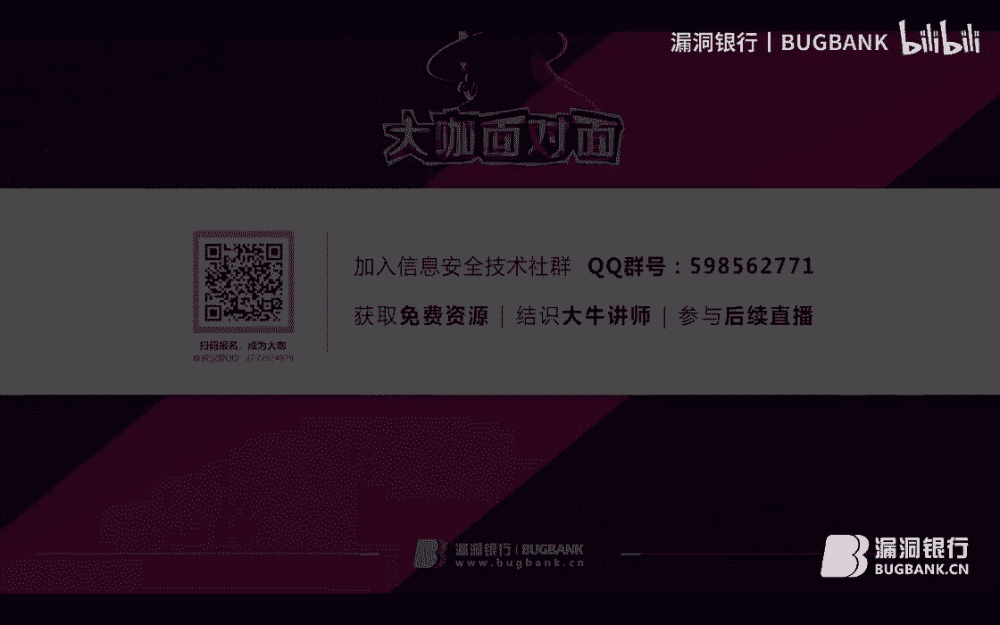
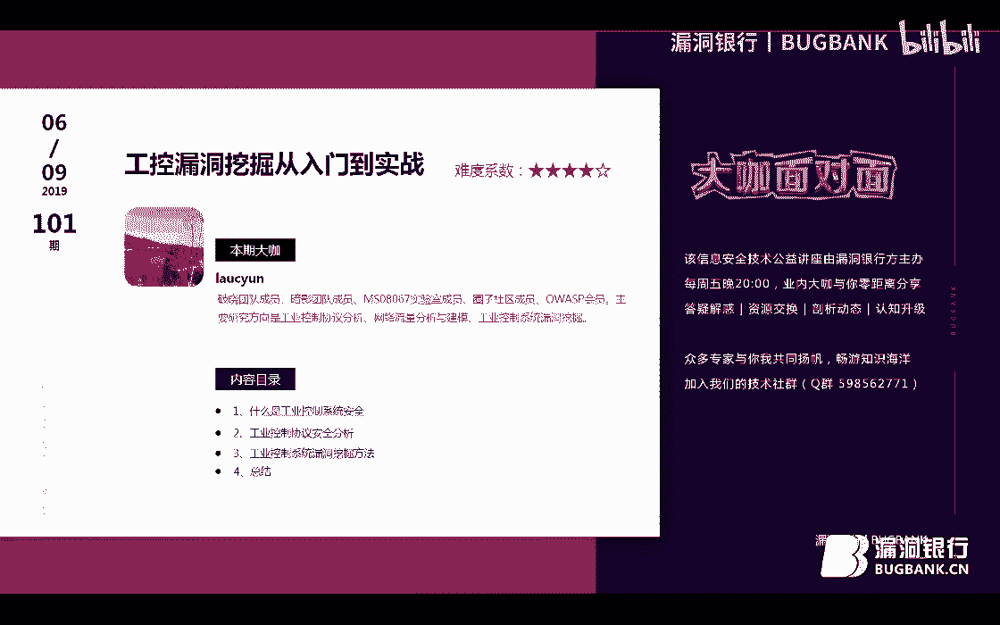
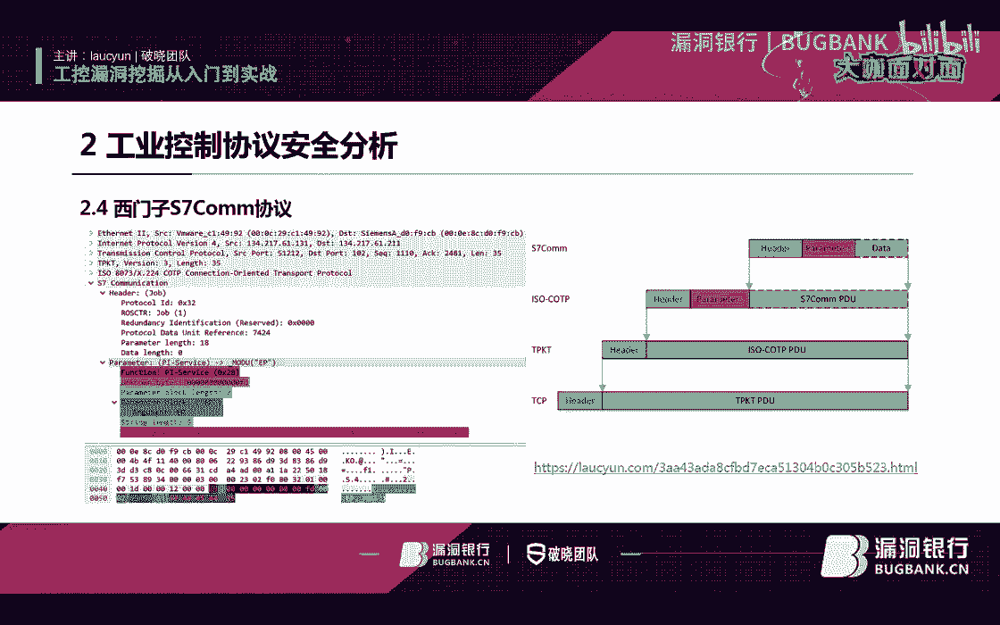
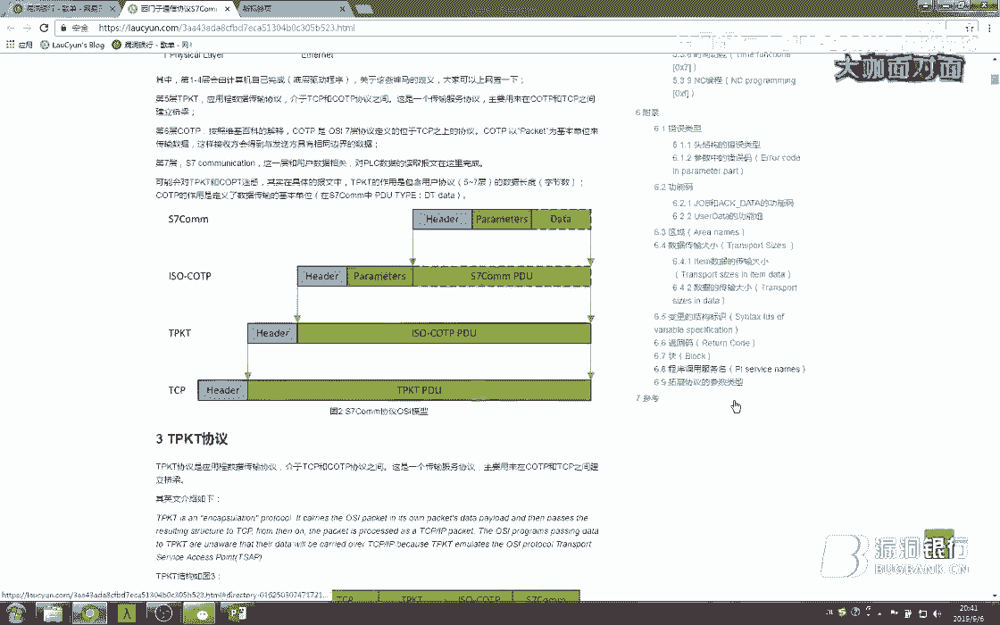
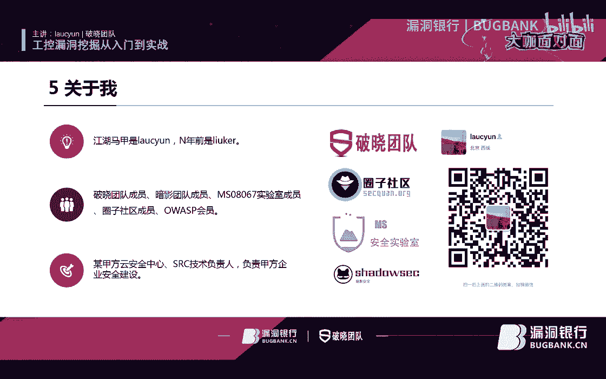
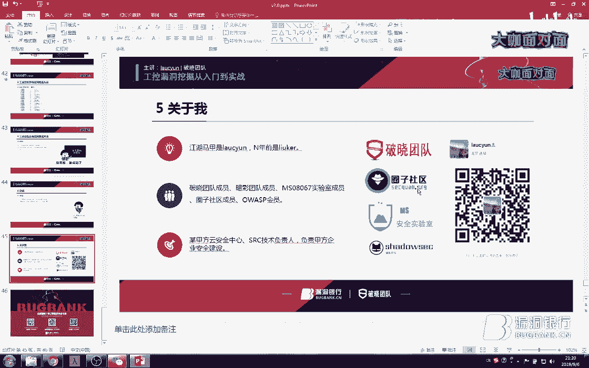
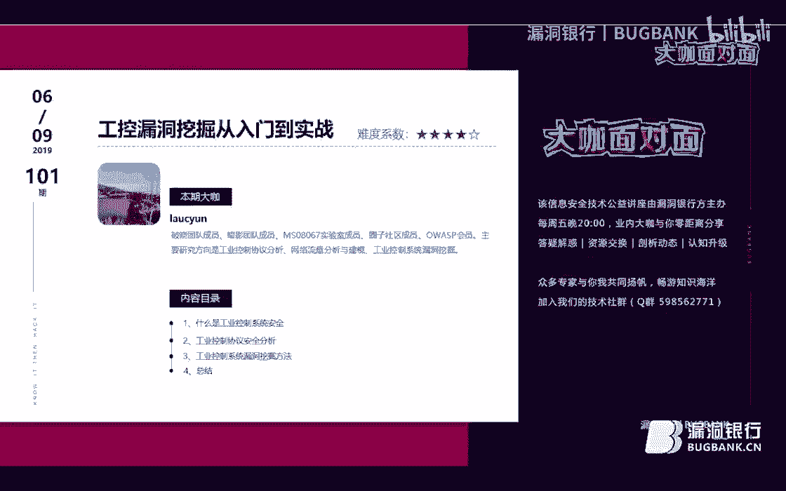

# 课程 P1：工控安全入门与漏洞挖掘实战 🛡️💻

在本课程中，我们将跟随刘政权老师的分享，系统性地学习工业控制系统安全的基础知识、核心协议分析以及常见的漏洞挖掘方法。课程内容从工控安全概述开始，逐步深入到协议分析和实战技巧，旨在为初学者构建一个清晰的学习路径。

## 概述：什么是工控安全？🏭

在开始具体学习之前，我们首先需要了解什么是工业控制系统安全。工控安全是指保护工业基础设施自动化运行、控制及监控的系统，使其免受非法访问、破坏或干扰。近年来，针对工控系统的攻击事件频发，其安全重要性日益凸显。

上一节我们概述了工控安全的重要性，本节中我们来看看一些典型的安全事件，以理解其现实威胁。

以下是历史上一些重大的工控安全事件：
*   **2010年**：震网病毒事件。
*   **2015年**：乌克兰电网遭恶意软件攻击事件。
*   **2017年**：WannaCry勒索病毒全球爆发。
*   **2018年**：欧洲废水处理服务器遭入侵；美国四家输油管道公司遭供应链攻击。
*   **2018年**：三一重工遭遇网络安全事件；台积电生产线遭病毒入侵，造成重大经济损失。
*   **2019年**：委内瑞拉大规模停电事件；美国纽约部分地区停电事件。

统计数据显示，全球工控安全事件数量持续增长，遭受攻击的国家分布广泛，这表明工控安全已成为一个全球性的突出挑战。

## 工业控制系统架构 🏗️

了解了威胁现状后，我们需要认识被保护的对象本身。工业控制系统是一个由各种自动化控制组件构成的复杂系统，用于确保工业基础设施的自动化运行、控制及监控。

一个典型的工控网络通常分为三层：
1.  **控制网络层**：包含PLC、RTU、IED等现场设备。
2.  **过程监控层**：包含SCADA服务器、HMI等，负责监控和控制生产过程。
3.  **企业信息层**：包含ERP、Web服务器等，与互联网相连。病毒常通过此层渗透至下层网络。

工控安全的核心定义在于保护系统免受未授权访问或破坏，确保其操作的连续性和计划性。

## 工控安全与传统信息安全的区别 🔄

工控安全有其特殊性，与传统IT安全存在显著差异。理解这些差异是制定有效防护策略的基础。

两者的核心区别源于对信息安全三要素（CIA）的优先级排序不同：
*   **传统安全**：优先级为 **机密性 > 完整性 > 可用性**。
*   **工控安全**：优先级为 **可用性 > 完整性 > 机密性**。

这种根本差异导致了在多个方面的不同：
*   **防护目标**：工控确保生产连续；传统安全防止信息泄露。
*   **网络架构**：工控网络复杂，含私有协议；传统网络相对标准。
*   **运行环境**：工控系统老旧、难更新补丁；传统系统更新频繁。
*   **物理环境**：工控环境恶劣；传统环境有专用机房。
*   **防护技术**：工控要求实时性（延时<100微秒），协议识别需深度解析。
*   **管理维护**：工控依赖供应商，制度可能不完善；传统安全有专业团队。

## 核心工控协议分析 📡

协议是工控系统的“语言”，要进行安全分析和漏洞挖掘，必须理解这些协议。本节我们将介绍几种常见的工控协议。

常见的工控协议包括 Modbus、西门子S7、OPC UA、EtherNet/IP、DNP3、欧姆龙FINS、GE的EGD协议、三菱的MC协议、IEC 104/61850等。

### Modbus 协议
Modbus 是莫迪康公司发明的串行通信协议，因其简单、开放而成为通用工业协议。它主要有两种传输模式：
*   **Modbus RTU/ASCII**：基于串行链路。
*   **Modbus TCP**：基于以太网，在TCP层上封装Modbus协议帧。

一个Modbus TCP帧结构可简化为：`[MBAP Header][Function Code][Data]`。其中，Function Code（功能码）定义了操作类型，例如：
*   `0x01`：读线圈状态
*   `0x03`：读保持寄存器
*   `0x08`：诊断（包含子功能码，可用于故障排查和测试）
*   `0x5A`：施耐德PLC专用功能码（UMAS协议）

### 西门子 S7 协议
S7协议是西门子PLC的私有通信协议，结构复杂。其通信栈可概括为：`TCP -> TPKT -> COTP -> S7 Communication`。S7协议报文通常包含头部、参数和数据区。不同系列的PLC（如S7-300/400， S7-1200/1500）采用的协议版本和加密情况不同。

### 协议分析方法实战
对于未知的私有协议（如国内某DCS系统协议），可以按以下步骤进行分析：
1.  **识别默认端口**：例如 `12288`。
2.  **寻找特征值**：在请求/响应报文中寻找固定字符串，如 `SCnet`。
3.  **关联业务日志**：将抓取的数据包与系统操作日志进行对比。
4.  **解析字段含义**：通过反复测试和关联，确定报文中各字段对应的业务含义（如功能码、位号、数据值等）。

## 工控漏洞挖掘方法 ⚒️

掌握了协议基础后，我们就可以进入漏洞挖掘的实战环节。工控漏洞挖掘主要借鉴以下几种方法。

### 模糊测试
模糊测试是向目标系统输入大量异常、畸形或随机数据，并监控其异常反应以发现漏洞的方法。

工控协议模糊测试的一般步骤为：
1.  **目标识别**：确定目标协议和设备。
2.  **协议分析**：深入研究协议格式、字段和数据类型。
3.  **测试用例生成**：基于协议规范生成畸形测试数据。
4.  **执行与监控**：发送测试数据并监控设备状态（如崩溃、重启）。
5.  **异常分析**：分析监控结果，判断是否发现潜在漏洞。

例如，通过对某品牌PLC的EtherNet/IP协议发送特定构造的畸形报文（在特定偏移位置填充`0x18FF`等数据），可导致PLC故障停机，其梯形图逻辑被清除。

### 固件逆向分析
固件逆向分析是在不实际运行设备的情况下，通过逆向工程分析固件文件，以发现漏洞或后门。

固件逆向的主要流程如下：
1.  **固件提取与解包**：使用 `binwalk`、`7z` 等工具识别和解压固件。
2.  **静态分析**：
    *   搜索硬编码密码、敏感信息。
    *   分析文件系统结构、配置文件。
    *   使用反汇编工具（如IDA Pro）分析关键二进制文件（如登录认证模块）。
3.  **动态分析**：在模拟环境中运行固件，进行动态调试。

**案例分析（施耐德PLC固件）**：
1.  使用 `binwalk` 识别固件为 `gzip` 压缩格式并解压。
2.  使用 `strings` 命令查找关键信息，发现操作系统为 `VxWorks 2.5` 并定位符号表地址。
3.  使用IDA Pro加载固件，根据CPU架构（PowerPC）和VxWorks内存布局知识，正确设置加载基址（如 `0x1000000`）。
4.  利用符号表地址信息，编写脚本修复IDA中的函数名，使逆向代码可读性大大增强。
5.  在清晰的逆向代码中，分析关键函数（如 `loginusrAdd`）的调用关系，可能发现硬编码凭证或认证逻辑漏洞。

## 工具与资源 🧰

工欲善其事，必先利其器。以下是一些用于工控安全学习和研究的模拟环境与工具，可以帮助我们在无需真实昂贵设备的情况下进行练习。

以下是常用的工控协议仿真工具：
*   **Modbus**：Modbus Slave/Simulator
*   **西门子 S7**：S7-PLCSIM, Snap7
*   **IEC 104**：开源测试工具
*   **OPC**：KEPServerEX（模拟OPC DA/UA服务器）

## 总结与思维转变 💡

本节课我们一起学习了工控安全从基础概念到漏洞挖掘实战的完整知识框架。

我们来回顾一下核心要点：
*   **协议是基础**：深入理解工控协议（如Modbus, S7）是进行分析和测试的前提。
*   **Fuzzing有效但依赖协议理解**：成功的模糊测试建立在深厚的协议分析功底之上。
*   **逆向工程是深层挖掘的关键**：固件逆向能够发现隐藏较深的后门和逻辑漏洞。

最后，对于想进入工控安全领域的学习者，需要建立两个重要认知：
1.  **认清现实**：许多传统IT安全技术并不完全适用于工控领域，需要转变思路，优先保障系统的可用性和稳定性。
2.  **思维转变**：工业互联网安全姓“工”不姓“网”，必须紧密结合工业生产的实际场景和需求来思考安全问题。

希望本课程能为你打开工控安全学习的大门。实践出真知，建议结合提供的工具和模拟环境进行动手练习，逐步积累经验。