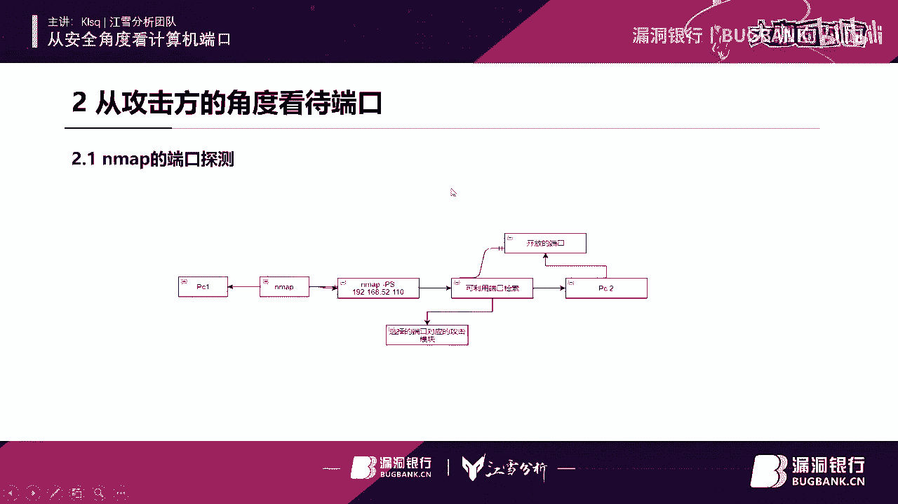
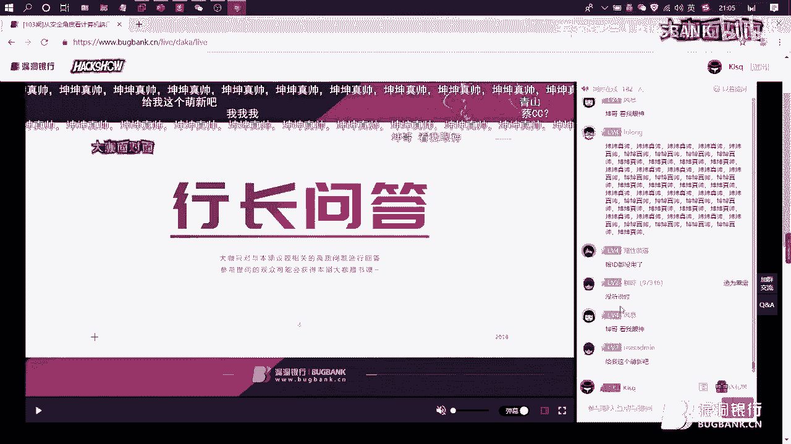

# P1：103期-从安全角度看计算机端口_x264 - 漏洞银行BUGBANK - BV1nE411q7h5

(音樂)。

為知識而存，因技術而生，小夥伴們晚上好，歡迎大家來到漏洞銀行，Hackshow直播間，參加第103期，大咖面對面，我是今晚的主持人Fancy，今晚將要直播分享的，KLSQ坤坤大咖。

是江雪分析團隊的聯合創始人，有著多年的信息安全學習經驗，目前主要的研究方向，是計算機端口安全，提前劇透一下，今晚大咖還準備了精彩的實戰演示，感興趣的話一定要認真聽到最後，另外大家登錄直播間後。

可以在聊天區進行發言討論，聽講過程中有任何疑問，都可以隨時提出，在之後的問答環節裡，坤坤大咖會挑選高質量的提問，來進行解答，積極參與的小夥伴，還有機會獲得大咖贈書。

MetaSploit滲透測試魔鬼訓練營，好了 下面我們就有請坤坤大咖。

開始今天的直播分享吧，大家歡迎，首先非常感謝各位大哥，抽出時間來看小弟，在這裡給大家分享本次直播議題，從安全角度看待計算機端口，這個計算機端口嘛，首先你要知道，端口安全本身目的，為什麼重視端口安全。

還有從攻擊方的角度看待端口安全，未來的發展與挑戰，關於端口防護的開發設想，第一個主要是讓大家產生對端口的興趣，第二個就是從攻擊方的角度，來看待整個計算機的端口，是產生什麼的威脅性。

還有這個計算機端口的未來發展，和未來的影響，對吧，還有是關於防守方，技術機計算機端口開發的設想，等，然後首先是為什麼重視計算機端口，首先呢計算機端口，主要分為三大板塊嘛，主要是。

公認端口 註冊端口 動態 私有端口，主要是這三個，首先他們三個呢主要是基於UDP，還有TCP等相關協議進行傳輸的，當然主要基於TCP UDP這兩個協議，他們一共呢TCP有6萬多個端口。

然後UDP也有6萬多個，然後整個端口加起來就等於13萬個端口，但是13萬個端口，咱們不可能一個個把這些端口的劃分，但你微軟官方的那些端口追悼庫，它也是不怎麼詳細的，有一些未知端口。

所以呢我把一些未知端口呢設為一些，不安全端口，還有一些未知端口，安全端口等，但是首先是為什麼把安全端口搞為那個，公認端口呢，因為安全端口嘛，很有可能被利用的風險，比如說端口反彈，還有一些各種利用之類的。

比如說8080，8080這個端口主要是用於網站的傳輸協議，就比如說你打開百度，百度它給你返回一個，比如說一個搜索的界面，就等於直接訪問它的80端口，所以它呈現的就是80端口對吧，只是它那個瀏覽器。

它沒有加載那個80端口的那個，冒號對吧，還有就是未知端口，未知端口主要是動態和私有端口，私有端口主要是一些，嗯自己認為的，還有一些隨時可能改變的，就是未知端口，但未知端口和安全的端口。

不安全的端口都有被利用的風險，比如說不安全端口，不安全端口主要是註冊端口，端口呢也是不安全的，就等於這些端口嘛沒有什麼安全性，即使是安全端口，你也會被利用，就比如公認的8080。

8080可以使用端口反彈，下面是整個一些端口的話，比如說比如說木馬，破門，病毒漏洞，應用程序，WEB這些東西都是有可能被威脅的，比如說安全端口不安全端口，他都會這些東西他都佔用了，比如說後面的維持訪問。

深度測試後期嘛，後門你要知道後門也是需要端口的，木馬也是需要端口，應用程序也需要端口，比如說某個騰的那個QQ，他也是需要一些端口的支持，比如說協議的支持，還有就是SMPQ這個協議，還有WEB。

WEB也需要TCP三次撥鎖，然後TCP三次撥鎖呢，還有一些更廣的東西也是需要端口來做的，還有漏洞，漏洞大家比較熟悉，經常熬夜那個漏洞付現，對吧，漏洞付現呢，也是需要利用端口的，然後進行付現的時候。

你需要彈射SHA這個東西，你如果投資SHA這個東西也是需要端口來進行相互訪問的，對吧，比如說傳播，傳播還有回訪，繪畫之類的都是需要。

但在下面的從西方這個角度看的GNG端口也會給大家實例展示一下這個漏洞的使用端口和不安全的危害和病毒，病毒首先就是先給大家扯一下這個，嗯，端口轉發，端口轉發呢，這個比較好理解，所以我把它搞了一個流程圖。

當然這個流程圖呢，主要是一個群組嘛，很簡單理解一個群組發佈一個公告，這個公告呢，是比如說這個群組要發紅包了，發紅包呢，比如說在今晚八點發紅包，這個群員他直接就轉發了各個群，就比如說，嗯，大家快來。

來一起進入這個群搶紅包，然後直接讓第二個人收到，這個人收到的再轉發到第三個人，這個流程圖就等於是端口轉發，很好理解，下面就是不安全端口的威脅性，勒索病毒大家都知道，比如說有限之蘭，有限之蘭這個病毒。

他只用是使用一些，嗯，45端口45端口，你如果開啟了這個端口呢，你開一開機就可以直接被中毒，當然如果你實現這個中毒原理的話，其實也很簡單，就說你病毒中就等於這個是有限之蘭病毒，然後他使用的利用端口。

然後進行掃描，如果有的話，就直接就直接那個什麼，直接就感染了，對吧，然後感染之後就在各種公司內部網前內部網進行傳播，然後呢，導致你整個學校機房都開始感染，比如說自動圖。

如果你關閉了這個病毒所利用的端口呢，他進不會進行訪問，因為你病毒本身他這個主要是一個驅動嘛，你這個驅動，他掃描你專機，掃描整個使用Windows計算機是否開啟了45這個端口，你如果開啟了45這個端口呢。

那直接就進這個流程一直往下走，但你進如果傳播的話，如果你開防火牆和不開防火牆，其實這個都沒區別，因為你這個他使用的端口你沒有進，他還是可以直接把你電腦黑掉，然後進行傳播。

讓你傳播的話就直接使用了那個TTP協議，TTP協議他也是包含端口嘛，因為端口這個東西我們把它比如說你上門，就比如說今晚我上我去你家串門，然後呢，你把門開了是不是，那我直接可以進去，如果你把門關了。

那怎麼進去翻牆翻窗，但是你把牆把窗比喻成門也是可以的，因為都可以進去吧，那就等於都是端口端口的定義，但端口這個東西在，硬件方面只要有那些接口，還有SP接口來進行代替，比如說串行端口和端口鏡像這些東西。

但端口鏡像主要是你在公司服務器配置的話，會利用到這個端口鏡像保障企業內部安全對吧，這等於你使用垃圾病毒，垃圾病毒他就是需要TTP協議，然後應用層運輸層網絡層聯絡層，那運輸層就需要TTP。

因為TTP的話垃圾病毒需要來回傳輸東西是吧，比如說加密，然後把你這個整個瀏覽器，整個瀏覽器訪問第一個頁面改為他這個支付頁面，這個支付頁面就等於那個，我記得前幾個月吧，有個病毒叫狹惘病毒。

狹惘病毒他這個東西作者比較有良心還是什麼，因為呢，他也是垃圾病毒，但是他這個影響力感覺不是很廣，咱們國內目前沒有，然後他使用的就是DNS劫持，你訪問一個網站，他直接給你訪問一個這個網址嘛。

這個網址就是他你向他支付的頁面這個網址，然後網絡層，網絡層主要是IP，他當時就拿那個狹惘病毒為例，但你永恆之藍，他應該是不會記錄你IP的，雖然你給了他錢，他也有可能不會幫你解解掉，因為他不知道你是誰。

就算你用戶一個個找你也找不到，你也翻不了，還有LPLP這個就扯不上，對不對，這個IP主要是，如果想到再有一次他把那些戰亂地區的那些感染計算機全部公開了出來，然後公開出來，但他就會有對應的IP。

現在IP表，然後就是各種密鑰什麼形成就完了，接下來就是木馬嘛，木馬就是1999年冰河木馬誕生了，但在1999年之內，國內應該沒有什麼比較高端的木馬來經傳播使用，然後之後呢，冰河木馬在1999年誕生了。

這當然這時候在一些當時年代嘛，19年不會有什麼重視安全的設想，安全的設想應該是在零幾年的時候才開始提出的，然後冰河木馬它主要是這個東西，這個東西就等於當時我在小學的時候玩過這個相關的東西。

比如說灰鴿子熊貓燒香，灰鴿子我玩的比較多，因為這是這個工具吧，一個木馬工具是我第一個接觸的黑鴿工具，感覺當時感覺這個工具非常高端，大氣簡潔是吧，大家應該都有用過，當時我在小學幫一個某林嘛。

他當時那個ID叫某林，我幫他測試軟件，他當時直接給我發了一個，他這個木馬所生存的一些病毒，然後之後我點了好多次，他那邊應該會有一些鼠標記錄等等，但他直接就可以記錄了我這個東西。

我記得他當時給我發了一件郵件，比如說hello，他利用hello來進行搞的話，也是需要運輸程，運輸程也是扯到TTP UDP協議，然後扯到TTP UDP協議之後呢，也會直接扯到計算機端口嘛。

就等於你網絡安全所有的東西，都是需要計算機端口來進行支持的，因為他是以上版的，下面這個就是整個全部繪畫的流程，首先呢我們把它比如說當時那個某林，這個就比如當時的我，當時他直接給我發來信息的應該是。

他直接採用了SMP這個協議，然後直接通過應用程序聊天這個，這個協議是發給了我，然後他利用的端口應該也是，比較高的一些端口，比如說當時用的是801端口，或者是一些80801端口，還有45389這些端口。

但當時我不知道這些端口這個東西，我也不知道這個是幹嘛的，這就是他的服務，全部存回，他給我發了一個驅動，然後驅動呢他直接給我，反映到我，然後通過端口，如果端口開，他這邊就是返回到一些，肉機端口失敗。

你如果關的話，他應該直接就可以拿取到我的SAR，直接採取把我當成肉機了，我電腦當時我電腦應該是四台肉機，我感覺，但他已經應該形成了後期的維持訪問，我也不知道，反正到時候我那時候直接重裝了。

然後首先木馬經過的過程是防火牆，如果防火牆開的話，還能直接返回到PC，返回到PC一個請求包，請求包這個請求包嘛，防火牆不接受，就等於防火牆的比如說一個端口，這個防火牆他不接受。

然後木馬製作者直接就返回到一個，錯誤信息就等於說報錯了，不能實現，如果是關的話，那直接就等於進入下一個部隸層，就等於我直接被控制了，對吧，第二個是這個熊貓燒香，熊貓燒香這個木馬。

我個人當時在小學的時候玩得比較火，因為熊貓燒香，他這個木馬非常可愛，對吧，一個熊貓擺在這裡，比當時的所有木馬還有蠕蟲，這些病毒都挺好看的，就比如說近一年爆發那個永恆之藍。

還有俠盜和什麼想哭之類的東西都比較好看，還有就是灰鴿子，灰鴿子他也是需要計算機端口的，首先灰鴿子你給他進入那個什麼，鼠標記錄鍵盤記錄和顯示屏顯示，還有一些攻擊之類關機，比如說來回發放請求。

來回發放請求也是需要計算機端口的支持，也是需要一些比如說聊天，聊天協議，聊天協議也是扯到TDP UDP，他們兩個東西，這兩個東西去往上之後，就是端口，是吧，對於所有軟件都是基於計算機端口來進行的。

如果把這個端口開的話，那你比較不安全，如果關的話會比較安全一點，還有就是漏洞，漏洞利用這個話題比較遠，首先這個漏洞利用扯到零幾年或者一幾年，一幾年最火的漏洞應該還是MS。

MS07 018 016之類的東西，016這個漏洞主要攻擊上了2000多的應該沒問題，但攻擊現在的一些計算機系統有點吃力有點困難，然後呢，比如說近幾年出現的一些漏洞利用。

比如說C1 20190708或者201711882，這些漏洞利用模塊都挺好的，還有漏洞利用漏洞，這兩個我是感覺比較好的，接下來講完這個東西以後，我會給大家演示這個201711882這個漏洞是怎麼去建立。

和後期維持訪問的，是吧，當後期維持訪問這個，當你已經拿到他的shower是吧，你拿到了他的shower，那你後期的維持訪問那就沒什麼問題，是吧，首先就是整個漏洞利用的整個過程嘛，對吧。

首先你開始利用這個漏洞模塊，在VSF上漏洞利用這個模塊之後呢，他會告訴你一個IP，IP你會扯到Nmap，Nmap之後也會講，然後呢，就會扯到端口，端口的設置。

當然C1 200708主要是針對了389這個端口，如果是關的話，那直接攻擊失敗了，對吧，如果是開的話，直接藍屏或者拿去上，但為什麼加個GUNHOME呢，因為這個漏洞嘛，不怎麼穩定，事實上會有可能。

比如說直接藍屏或者攻擊失敗，接下來是微博片，微博呢，主要是211端口吧，211端口一旦開放就會讓攻擊者通過211端口直接提前完全控制服務器，然後完全控制服務器之後呢，就是把你這個服務器當成肉雞。

這個威脅挺大的，還有221端口的開放可能造成攻擊方利用字眼撥破，管理員帳號密碼的形式直接進入管理後台，增加相關方面的威脅性，如果增加了這個，如果你把前面這兩個端口或者前三個展示的端口全部關閉的話。

那你這個網站應該是比較安全的，不會存在端口方面的一些入侵，當然端口很多很多嘛，不可能全部都關閉，那有一些端口是可以利用的，把一些可以利用的端口全部關閉就可以了，還有很多很多都可以使用端口進行利用。

還有端口一些的威脅，比如說3182，3182就是代理的默認端口，如果開啟了這個端口呢，攻擊方就可以直接進入企業內網和企業員工一起去喝茶了，這個東西是吧，比如說你在寫PPT嘛。

你手機屏幕直接給你彈出一個聊天框，但你當時的應該會比較懵逼，是不是你也不知道接下來會發生什麼，是吧，現在給大家演示一下。

MAP端口檢測，嗯。

現在假如說我是攻擊方，至於IP的話，應該當在做那個信息收集的時候，嗯，應該，哎呀，這是信息收集的時候，應該知道他所用的端口了對吧，比如說我現在這個靶機的端口是20230114，20230114嘛。

這個嗯我所利用的這個模塊嘛，你使用什麼端口都無所謂，都可以實現都可以付現對吧，首先咱們提供一下咱們這個MSF，MSF很棒，很強大，嗯，稍等，咱們就拿11882來做演示，就感覺就可以了，挺好的，嗯。

之後呢，就直接搜索一下對應的模塊，我應該添加了，先利用這個模塊吧，嗯，OK，好啊，嗯，設置一下密碼設置點之後，再設置一下攻擊端口，配攻擊IP，攻擊IP比較刺激，嗯，嗯，被靶機的IP設置成功。

然後就是設置端口，嗯，他這個默認的就是私人端口嗎，私人端口的直播跟剛剛一樣，端口反彈嗎，端口反彈，私人端口直接返回到咱們這個8080，對吧，8080端口，8080端口，這個是8080端口。

然後直接返回到，反彈到咱們私人端口，接下來就是攻擊嘛，看一下，然後直接就利用一下咱們這個，看一下，這個LOLMU模塊，嗯，應該是這樣的，2017，11，882，py文件，跟一個C，在，引號，搜索失誤。

yes，對啊，嗯，嗯，嗯，嗯，嗯，嗯，嗯，嗯，嗯，嗯，嗯，嗯，嗯，嗯，嗯，嗯，嗯，首先呢，這個就是一個他的那個漏洞生成文檔，通過上面的程式命令，來直接生成的這個文檔嘛，但這個文檔是攻擊方來生成的。

然後發給，嗯，目標目標呢，如果直接運行這個文檔的話，那直接就可以在這裡彈出他的那個空檯窗口和直接查看他已經控制人數收集，或者建立之後的維持訪問的，所以他利用的就是怎麼這個他們動物上面講這個動物反彈。

通過80當口，反正到44當口，是吧，所以這個東西呢，就等於等於說你漏洞6模塊，他們利用，呃，W微博，他們兩個都是需要利用當口的，對於當口安全這個東西，範圍還是非常廣的，對吧，那我們進行下一環節，首先。

這在真實環境當中，你需要利用的是map當當過探測，但當過探測呢，主要是檢索可利用的端口和開放的端口，還有選擇當口對應的攻擊模塊，比如說本次他就等於真實環境，真實環境所開放的當口。

比如說應該會開放8080，44和一些未知的，還有更高端的一些端口都會開放，不可能像一些比較一些大型的安全公司，比如說普通公司服務器，只開放了一些端口，但你普通用戶應該開放的端口比較多一些。

不可能只全部關閉，是吧，然後可檢索可利用的端口之後呢，就會選擇端口所進行下一步的攻擊利用，選擇下一步的攻擊利用模塊，比如說CM模塊，這樣來快就等於就是，就等於0708，1182，1182呢。

本次所利用的就是1182這個漏洞利用模塊，他使用的就是44 8080這些端口，還有389是0708所使用的，那0708這個，他這個比較容易，但是主要是，不穩定，相相對於1182來開始進行實驗的話。

感覺1182比較穩定，還有就是利用模塊嘛，可利用的端口，然後進行漏洞利用模塊的篩選，還有可利用的端口，然後本次那個1182他使用的就是端口反彈，從8080反彈到44，攻擊利用模塊所使用的端口。

然後建立繪畫維持訪問後面打開，然後進行下一步的一些操作，比如說你已經獲取了他的命題，45的所有信息，並且可以進行一些輸入的一些命令，之後比如說你直接上去把你這個，整個C盤給格式化都是可以的。

還有後期的維持訪問，可以如果你已經進入他這個，已經完全控制這個計算機了，你直接可以把你所需要的端口全部打開對吧，然後並且建立一些繪畫，和他一起聊聊天，吃個水之類的，或者直接把，然後加固一下你的後門。

比如說打開你的後門，輸入一些你的木馬，比如說丁和，還有一些你自己寫的一些木馬都是可以的，還有後期的維持訪問，維持訪問主要是，你把這個端口開了基本上就沒問題，然後再修改一下註冊表，基本上可以完事了。

然後主要是前期準備吧，前期準備主要是信息收集階段，然後附近朋友的提醒，然後生活習慣，早點睡覺及工作的時間，比如說早上開機，然後你早上，睡晚了，然後他十點鐘就要去上班，他十點鐘上班的時候。

他計算機是關著的，當然你不可能在他關著的同時，你把他計算機黑了對吧，之後就是附近朋友提醒和生活習慣，然後進下一步就是中期發育，中期發育主要是開啟開始構思，你要攻擊的目標，還有慢不失態。

慢不失態主要是獲取可利用的端口，如果慢不失態獲取可利用端口不行的話，那直接可以選擇端午教桌，比如說檢索可利用的端口，然後就達成你所達到的目標，比如說進塔的目錄，C盤格式化都是可以的，或者就是無法使用。

如果端午教桌，不可以使用，可以使用一些釣魚郵件，其他漏洞都是可以的，或者你直接利用上次的端午反彈，端午反彈主要是他那個漏洞利用模塊，所進行編寫的，你自己也是可以進行編寫，還有就是後期的維持訪問。

那後期的維持訪問，你的那個數據流是可能會被他記錄的，說你某層的那些加入球，或者某山的那些加入球，他都是有個上影和下影速度的，比如說你在普通用戶，他在看一些視頻，他那個上影和下影的數據流會比較大。

但你如果啥也沒幹，就盯著你電腦屏幕擺在那裡，你上影速度都那麼大的話，那你應該可能是被量了，對吧，或者直接變成肉雞了，所以有可能，所以叫猥瑣一點，不要浪，你如果數據流了，那麼他龐大，是不是。

那他直接就可以發現你這個計算機有問題了，然後你註冊表修改，还有开放未来和实际可以使用的端口，或者以可监守可利用的端口，选举可利用的端口码来经营后期的那些进行尝试，对吧。

还有注射表的修改和开放未来可使用的端口，或者进各种和其他的利用，对吧，然后和非正常发育主要是木马和呃钓鱼油舰的时候，男钓鱼油舰和木马。

而这两个就是比较通用的嗯嗯钓鱼油舰主要是你把你的那个发生发生者的那些信息改之后，那应该可以成真的，对吧，和木马木马主要是你说使用的开放端口开放端口呢，然后就可以进行下一步修改注射表修改。

输入表人就可以进后期的更多的操作，对吧，所以这个就是非正常的防御，但这么的发育作者你直接进入你的这个后直接利用的那个工具模块直接就可以达到目的的或许是对吧。

那你木马也是可以通知比你利用的模块比较简单一点，接下来就是端口未来发展的挑战，当口吗，所以就是捆绑在温德斯平台上，那在其他那可和琳娜两家基本上基本上不同用，比如说你在温多斯爆发的漏洞。

在马克和林宁和是他们两家基本上不会说干扰了，如果是他们两家的系统有一些漏洞，病毒针对他们两个系统所制作的，那绝对不会威胁到温多斯平台，除非他可以把你们都是平台加进去的三个系统一起一起整是吧。

主要是温多斯和端口他们两个是相互捆绑下去了，比如说现在有十个人当中有八个人都是温多斯系统，基本上很少人都是，嗯，琳娜还有马克他们两个系统的，是吧，基本上占了使用率的60%，呃，目前主要是有很多威胁威胁。

有些垃圾病毒遮遮，他们研究这个端口比我们这些小菜鸡研究端口更深一些，他们的研究就是怎么利用这个端口这个端口可以开放哪些，然后端口这个这个概念嘛，在他们那边比较是成熟的。

在我们这基本上我们只是一些理解之类的，但温多斯随着温多斯那个系统的广大普及端口和温多斯，他们这个东西是绑在一起的，所以你温多斯下来的人越多，端口的威胁越来越大，或者就是呢，咱们那个后期那个微软。

他把这个端口概念也完全改了，是不是，而接下来就是关于端口的防务和开发设想，防务的开发设想主要是对外欺骗，然后对外欺骗这个已经有厂商在做，比如说某期某期的那个他们那个防务应该也是需要这个东西。

也是这个原理吧，但他不是针对端口来做的，他只是来欺骗攻击方攻击方用nmap直接扫描，你你服务器的一些端口的话，基本上是扫不到了，但有可能是他开放了，你这边没有出现而已，是不是他吧。

主要就是说有一个这个是，嗯，目标这个是攻击方，攻击方他主要是进入nmap那个扫描，然后这些是嗯目标目标，他在他服务器的本身就搭设一个秘惯，秘惯呢，主要是欺骗欺骗攻击方，然后产生虚假端口虚假端口呢。

然后比如说你有389389这个端口呢，主要是攻击方，他肯定会想到利用的模块和利用的一些相关的攻击驱动是吧，然后直接攻击他感觉非常简单，所以他一般直接就会直接攻击，然后你秘惯直接记录下来。

收集可以进行反查，那你反查的话，咱们个人的小白帽是不可能，直接整的对吧，那如果他攻击方如果用的是嗯，公开的一些跳板或者一些之类的，应该咱们找不到，咱们没有这种资源，如果他是自己搭建的一些跳板。

那应该我们是可以直接找到的对吧，然后反查的话，就是报纸上面说了这两个东西，一个是自己处理，一个是报案，报案，人家警方他就有很多资源的，比如说你骂个信息，你骂个信息已经被记录了。

直接找这个相关的那个制作厂商，这是可以的，直接就可以发，搞到你这个攻击方的所有信息，或者你攻击方是在网吧里进行的，但在网吧里进行的话，网吧里有摄像头，还有一些身份证，除非他在一些黑网吧。

那黑网吧一些防护不可能那么先进，都可能被记录了，如果他使用的一些社会工程之类的东西，咱们也是很难找到的，是吧，还有就是自动拦截型，自动拦截型，他主要是靠这个驱动，但这个东西，呃。

我们这个联合团队也在在制作研究这个东西，但这个驱动主要是这个自动拦截，他所有的东西都包括在这个驱动里面，这个驱动主要包括检测能力，判断能力，数据集体识别，自我保护，学习能力，呃，学习能力呢。

主要是记录所有你用户本身所打开的所运行的所有软件嘛，比如说你这个软件，他开放了一些安全软件和安全软件，然后你直接把这个判断能力加进去，还有检测能力，然后还有一些特征码识别，学习能力。

但学习能力主要是通过你前面两个检测能力判断能力，数据识别，他们三个一起加起来，现在这个学习能力，让你学习能力越强，那就等于你自我保护能力就越强大，嗯，驱动也是包括自我保护的，你看自我保护为什么写在这里。

因为自我保护驱动嘛，一个软件，把剑嘛，比如说这把剑，他是盾的，盾的，他没有一国一地，防防御力也没有很多，但就比如说你如果一把比较锋利的一些宝剑，几乎一刀就可以把所有东西给砍断。

这就等于勒索病毒和咱们这个驱动，这个驱动的能力越大，就等于这个勒索病毒的威胁力越小，因为你一起一些废话软件吧，废话软件，他使用的一些驱动嘛，都比较都比较一些高端。

他可以直接把你计算机所安装的一些防护程序，直接给杀掉，但一些国内和国外的一些大厂商的大厂商的一些驱动是杀不了的，除非他自己就是这个开发人员，他理解这个理解驱动的原理，或者怎么绕过都是可以的，比如三某嘛。

他们那个驱动就是可以绕过对吧，不过需要付了，好像然后这就是整个驱动，这个自动蓝天行主要这个概念主要是驱动来形成的来，随着这个各种力都是都是通过驱动来进行学习，比如说数据及识别数据及他主要包括嗯特征吧。

还有一些，他自己记录了一些东西来进行进行学习，而数据及判断能力，检测能力和自我保护都形成了学能力，所以他主要的就是学能力和驱动，这两个东西是非常重要的，但他家有兴趣了，可以自己开发一下。

然后本次就那个演讲完事了，呃如果有相关问题，比如说当款的一些问题可以联系到我这个微信，或者扫描咱们我们讲语分析的那个团队二维码加一些群，当然这个官网还在制作，没有正上线会在20年春节之前正上线。

但我微信是一天嗯几个小时在线的，大家可以随便来solo我，感谢坤坤大咖，内容非常的充实，顺动，辛苦啦，那相信我们刚刚认真听讲的小伙伴们可能还会有一些问题想要向大家请教，下面就进入我们的行长问答环节。

大家可以继续在聊天区里发送问题，坤坤大咖会选择一些高质量的问题来解答，那进行聊天互动呢，还有机会在稍后的福利环节中获得大咖特殊metasploit渗透测试魔鬼训练营。

那现在就请坤坤大咖打开直播间勾选一下聊天区上方有一个只看提问的按钮，勾选一下这个按钮就可以查看和解答大家的问题，你有看到我们聊天区上面有右上角那边有一个小方框勾选题，只看提问，你把它选一下。

然后就可以看到我们帮你筛选出来的一些问题，首先我在这里看到一个提问就是那个，嗯我看一下，第一个提问就是扫描不清楚怎么办，未知的端口，呃未知的端口主要是你自己的定义，当然你知道这个端口是怎么用的。

还有一些，当然这些未知端口嘛，未知端口首先咱们都不知道这个端口是怎么用的，所以一般情况下我们用的都是不安全的和威胁端口安全的口证，但所以这个问题的扫描不出来。

你可以使用一些不安全的安全的来进一些端口的反弹之类的也是可以的对吧，还有就是不知道什么是端口，什么是端口呢，主要是你可以理解为它是一个门嘛，它是一个门大门，一个人进入一个门之后，如果这个门是关着。

那这个人就直接进不去，如果是开着的，那直接就可以进去了，对吧，你可以你直接把端口理解为一扇门就可以了，端口的危害主要是一些漏洞层次，一些漏洞和一些病毒不满，维持那个，嗯维持访问之类的都会有这些端口。

端口的涉及就等于你web你访问直接建立一个连接的话也是需要端口的，比如说8080端口的配合和8080的配合，还有一些各种各样的协议配合都是需要端口来实现的，还有就是空如也的一些提问，嗯。

未知端口关闭会怎么样，未知端口关闭呢主要是不会怎么样，当然会看你那个软件有没有，有没有那个涉及到这些未知端口吧对吧，如果你软件涉及到未知端口的话，那你软件有一些相关的，相关的一些功能无法起到作用是吧。

所以这个就是只为这端口关闭和不关闭，只有些你如果不常用的端口关闭的也是没有什么用的，可以也是也是可以起到一些防务作用，还有就是嗯，通过端口渗透来控制逻辑，端口渗透嘛主要是我先回答你这个端口。

木马灰鸽子灰鸽子他来回进行访问，就需要经端口来进行传播是吧，或者进行连接会话你端口，端口你已经知道对方的IP对吧和目标了，那你如果直接渗透控制逻辑的话那你需要建立维持访问。

维持访问的话也是基于端口来渗透测试控制逻辑，是吧还有你在后期的维持访问，建立的也是你端口的相关连接对吧，所以这个问题你想要的样子基本上完全可以实现，有什么问题可以加我微信咱们两个一起聊聊是吧，嗯。

但是如果占用了这些端口，如果占用了这些端口的话两个端口占用嘛就比如说咱们那个，嗯比如IP这个东西拦截的话，你两个端口占用那你肯定会造成，BIP的抓包不可能实现对吧，所以占用了这些端口的话。

那基本上会影响一些端口的无法，功能无法实现是吧，基本上完全可以搞完全可以嗯整这个东西的，有方法了过端口的防御，并找出真实的端口利用的真实的，这个主要是盲猜看你对计算机端口的理解有多少。

但我基本上都是盲猜的盲撞，我看我会用哪个漏洞里有母块我就直接用哪个，对吧基本上就完事了嗯真实的端口利用呢，真实的端口主要是真实的端口主要是你一个是，对吧你一个是你说你首先要一个个是排除一和排除二。

如果你你检测8080这个端口呢，他一般都是开着的还有8080，首先看你看你那个目标的本身是什么性质，不是说普通用户普通用户才一般把这两个，装备一般都是开着的说四字，然后还有更高的比如说666。

或者555，这装口是很高的越高的装口才越不会关闭除非他把所有的装口都关闭了，嗯，基本上就完事没事，嗯还有要提问的吗，嗯大家还有什么问题要问吗，如果大家没有什么问题的话，那我们今天的问答环节就先到这边。

因为我们今天时间也比较有限，如果大家之后还有问题也可以再跟我们加我们大咖的微信进行交流吗，嗯坤坤大咖你要不再把你的那个二维码放一下给大家看一下，然后大家可以跟你交流一下。

嗯那如果大家还有问题可以私下在交流也可以，也可以加一下我们漏洞银行的群来进行跟小伙伴们交流，非常感谢坤坤大咖耐心的解答，那接下来我们就进行下一个环节吧，也就是大家最期待的赠书环节。

本期的赠书是坤坤大咖精心挑选的Metasploit渗透测试魔鬼训练营，大咖你能简单的说说为什么想送这本书吗，因为Metasploit这个漏洞利用程序。

这个软件吧它是行业里比较排名靠前的一些安全审计软件对吧，所以然后本次所利用的一些攻击模块，和攻击的那些漏洞模块利用都是通过这个软件来进行审计工具来进行实现的。

然后这个主要是可以让大家更深度的感受到Metasploit，给大家带来一些东西比如说带一些威胁性和安全性，但它的安全性呢主要是让更多人知道，这些端口都是还有一些漏洞利用模块都是需要大家来记载的。

是吧然后它这个appare每次在推特一些都会更新一下，比如说0708它直接每月都会更新，更新一些更高的一些或者未来会产生的一些漏洞利用模块，它都是会实时更新的。

然后虽然在一些平常的一些使用中也会接触到API，比如说你在面试的时候人家面试官也会考到你API，这个东西是否熟练对不对，都是所以这个这本书还是比较有用的，作者所描述的东西更加有记录性吧。

好的好的感谢昆昆大咖，那看来这本书确实是对大家很有帮助的一本书，但是呢因为今天直播间的小伙伴挺多，但是只有一位幸运的小伙伴能够获得这本书，那么今晚谁会是那个被选中的幸运的孩子呢。

昆昆大咖请你现在就在直播间里选择一位幸运观众，并将他选为幸运吧，嗯，你看看选一个你喜欢的，可以我很帅我知道我非常帅，嗯，金三，咱们这本书大家基本上都看过，咱们把机会留给那个没有看过的人吧，是不是。

咱们随便选几个，我可以咱们选，蔡cc可以，蔡cc吗，选蔡cc，好的好的，那恭喜这位直播间id为蔡cc的小伙伴，你获得了大咖的青睐，恭喜你你将获得对应的大咖赠书，请你根据直播间的提示留下你的联系方式。

或者在直播后私聊我进行对讲，好了亲爱的观众朋友们。

今天昆昆大咖的技术分享就到这里了，谢谢昆昆大咖了。

最后大咖还有什么话想对我们直播间的小伙伴们说的吗，端口这个问题嘛，国内没有什么团队去研究这个东西，但是我们这个转移分析嘛，我们直接，直接把我们以前那个定位，转换成咱们那个端口安全的定位。

嗯，这种蓝结型这个开发设想是我们那个，经营分析和一些其他团队一起来做的，这个驱动还有整个软件，整个软件呢基本上基本上驱动已经完成，过半了那如果大家还是想，去参与开发，一些问题也是可以直接加入到直接加入。

直接加我微信并且有两个人，参与开发的人和一个，团队团队人来进行，推荐基本上是完全没问题的，这个这种蓝结型感觉，比前面这个要好，因为这个东西所有东西都是通过，驱动来判断还有软件。

自身所在的功能比如说蓝牙更新，切菠菜之类的也是可以，比较有技术性的功能都是可以实现的，也非常感谢参与到联合开发团队的一些，成员比如说破晓，还有k哥k神之类的也，希望更多人来更多人来参加。

我们这个项目的开发和，咱们那个项目的内侧之类的。

好的好的，那今天整场直播下来还是非常顺利，也非常感谢所有小伙伴们的支持，那最后再次感谢我们昆昆大咖的，用心准备和精彩的演讲非常感谢，你的慷慨的分享精神那也希望，大家能多多支持kmsq。

和他的江雪分析团队，那一如既往本期直播录屏会在下。

周五发布想回顾本期内容的小伙伴，请关注我们官网更新或群内通知，也感谢每一位观众的支持，谢谢大家一直以来的陪伴与守候，那我们就先到这里了，希望大家能够多多支持我们的直播，也希望大家能够多多支持我们的直播。

也希望大家能够多多支持我们的直播，也希望大家能够多多支持我们的直播，也希望大家能够多多支持我们的直播，也希望大家能够多多支持我们的直播，也希望大家能够多多支持我们的直播。

也希望大家能够多多支持我们的直播，也希望大家能够多多支持我们的直播，也希望大家能够多多支持我们的直播，也希望大家能够多多支持我们的直播，也希望大家能够多多支持我们的直播。

也希望大家能够多多支持我们的直播，也希望大家能够多多支持我们的直播，也希望大家能够多多支持我们的直播，也希望大家能够多多支持我们的直播，也希望大家能够多多支持我们的直播。

也希望大家能够多多支持我们的直播，也希望大家能够多多支持我们的直播，也希望大家能够多多支持我们的直播，也希望大家能够多多支持我们的直播，也希望大家能够多多支持我们的直播。

也希望大家能够多多支持我们的直播，也希望大家能够多多支持我们的直播，也希望大家能够多多支持我们的直播，也希望大家能够多多支持我们的直播，也希望大家能够多多支持我们的直播。

也希望大家能够多多支持我们的直播，也希望大家能够多多支持我们的直播，也希望大家能够多多支持我们的直播，也希望大家能够多多支持我们的直播，也希望大家能够多多支持我们的直播。

也希望大家能够多多支持我们的直播，也希望大家能够多多支持我们的直播，也希望大家能够多多支持我们的直播，也希望大家能够多多支持我们的直播，也希望大家能够多多支持我们的直播。

也希望大家能够多多支持我们的直播，也希望大家能够多多支持我们的直播，也希望大家能够多多支持我们的直播，也希望大家能够多多支持我们的直播，也希望大家能够多多支持我们的直播。

也希望大家能够多多支持我们的直播，也希望大家能够多多支持我们的直播，也希望大家能够多多支持我们的直播，也希望大家能够多多支持我们的直播。

也希望大家能够多多支持我们的直播，也希望大家能够多多支持我们的直播，也希望大家能够多多支持我们的直播，也希望大家能够多多支持我们的直播。

