# 课程 P1：PHP代码审计实战入门教程 🛡️


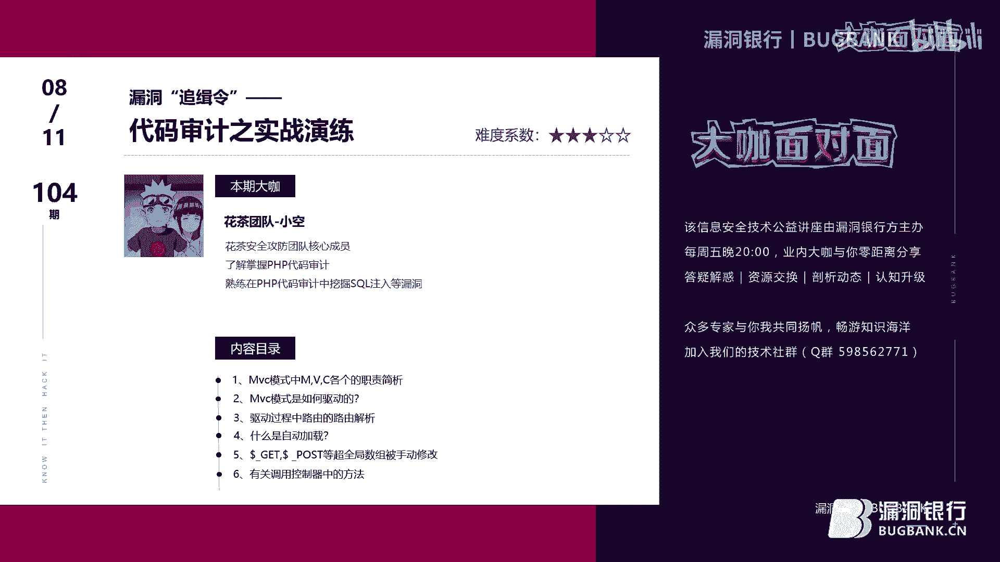

在本节课中，我们将学习PHP代码审计的基础知识，并通过一个实战案例，了解如何从零开始分析一个基于MVC模式的PHP程序，挖掘其中的SQL注入漏洞。我们将从理解MVC架构和程序路由开始，逐步深入到具体的漏洞点分析。

## 什么是代码审计？

代码审计，顾名思义，就是对源代码的安全性进行检查。与黑盒测试不同，审计者可以直接阅读源代码，从而更深入地理解漏洞原理、熟悉开发流程和功能调用。通过审计，可以有效地挖掘漏洞并积累安全经验。

常用的代码审计方法主要有两种：
*   **通读全文**：从头到尾阅读所有代码。这种方法耗时较长，可能大部分代码与目标漏洞无关，但有助于全面把控程序逻辑，积累丰富的经验。
*   **回溯敏感函数**：根据已知的敏感函数列表（如执行SQL查询、文件操作、命令执行的函数），在代码中搜索，并逆向追踪用户输入数据到该函数的过程，检查是否有充分的安全过滤。

对于初学者，建议从一些老旧（如2014-2016年）或小型的、未被广泛公开审计过的程序开始练习，这样更容易获得成就感并理解经典漏洞的成因。

## MVC模式解析

现代PHP程序广泛采用MVC（Model-View-Controller）设计模式。理解MVC是审计这类程序的基础。

*   **Model（模型）**：负责与数据库交互，处理数据的增删改查。
*   **View（视图）**：负责展示数据，通常是HTML页面。
*   **Controller（控制器）**：作为模型和视图之间的桥梁，处理用户请求，调用模型获取数据，再传递给视图进行展示。

用户直接访问的是控制器。一个典型的MVC程序是单入口的，即所有请求都通过一个入口文件（如 `index.php`）进入，再由该文件根据路由规则，分发到对应的控制器和方法。

以下是一个简化的MVC驱动流程：
```php
// index.php (单入口)
// -> 路由解析
// -> 调用对应的 Controller
// -> Controller 调用 Model 处理数据
// -> Controller 将数据传递给 View
// -> View 渲染输出给用户
```

## 实战演练：代码通读与路由分析

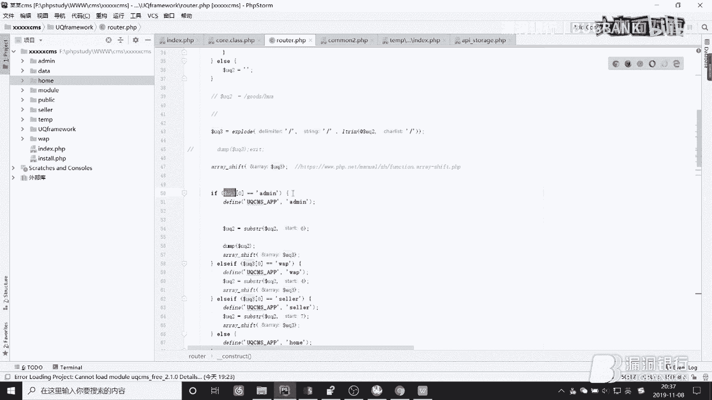

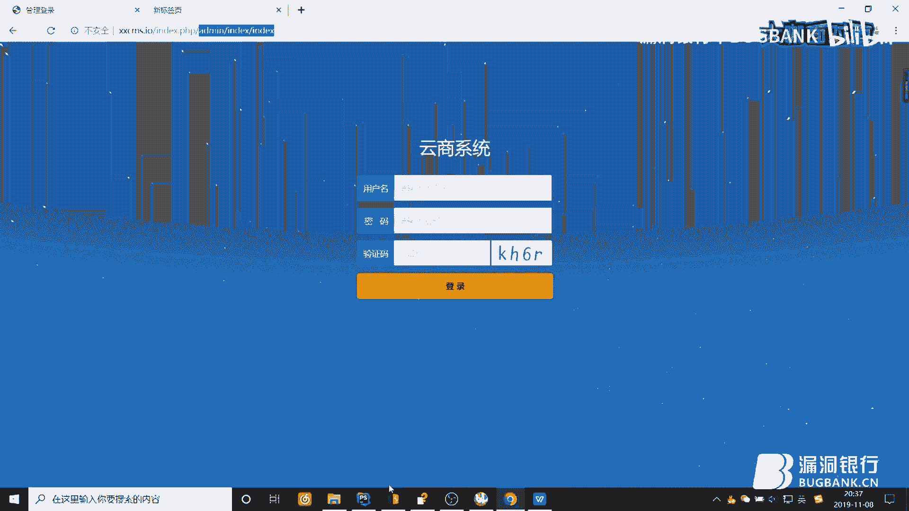

我们选取一个由个人开发的小型PHP程序作为审计目标。首先，我们需要通读代码，理解其运行流程，特别是路由机制。

### 第一步：定位入口与初始化

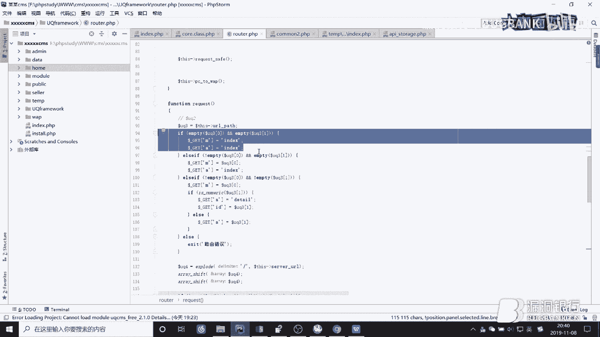

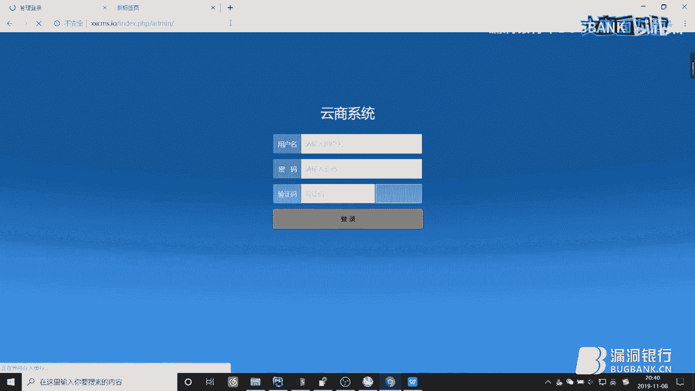

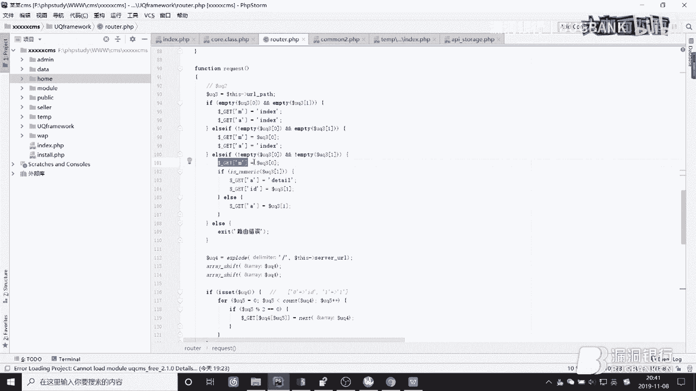


程序入口是 `index.php`。初始阶段，代码会定义一些常量、设置时区、编码等。关键的一点是，程序会定义一个常量（如 `IN_UQ`）来防止文件被直接访问，确保所有请求都必须通过这个单入口文件进入。

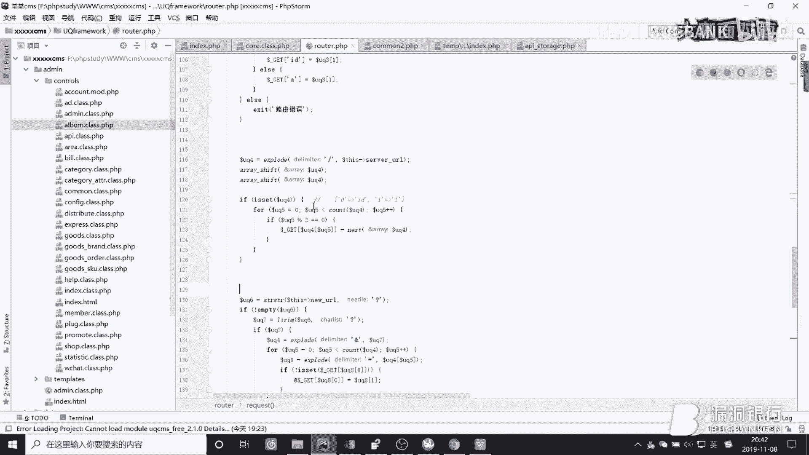

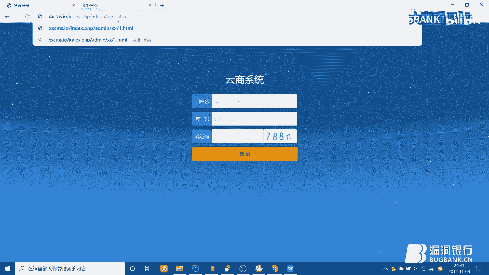

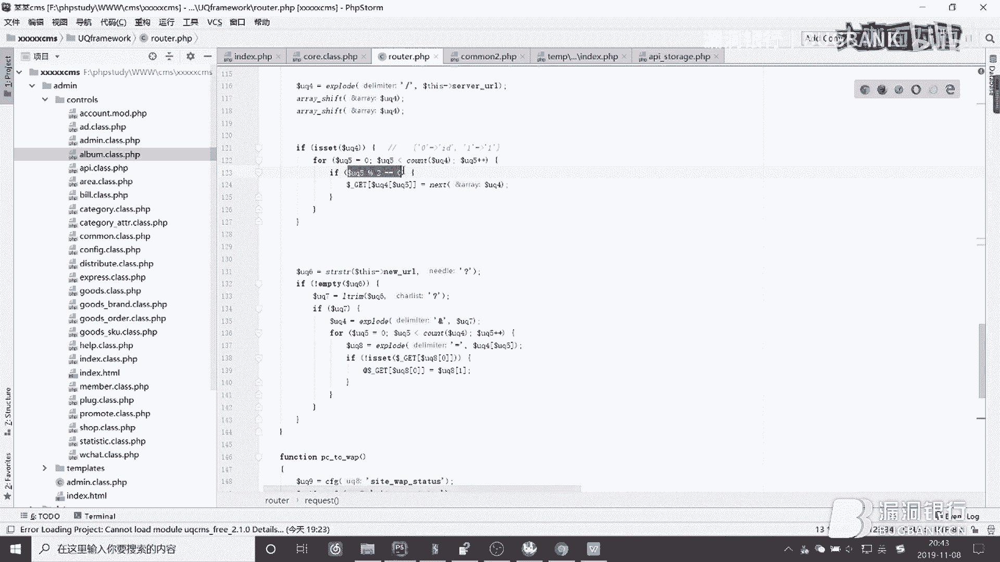

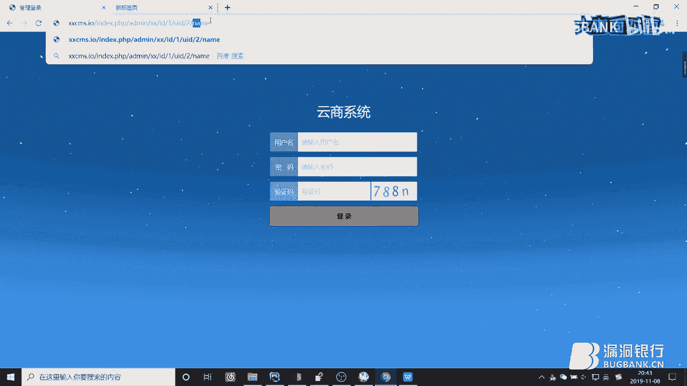

### 第二步：分析路由机制

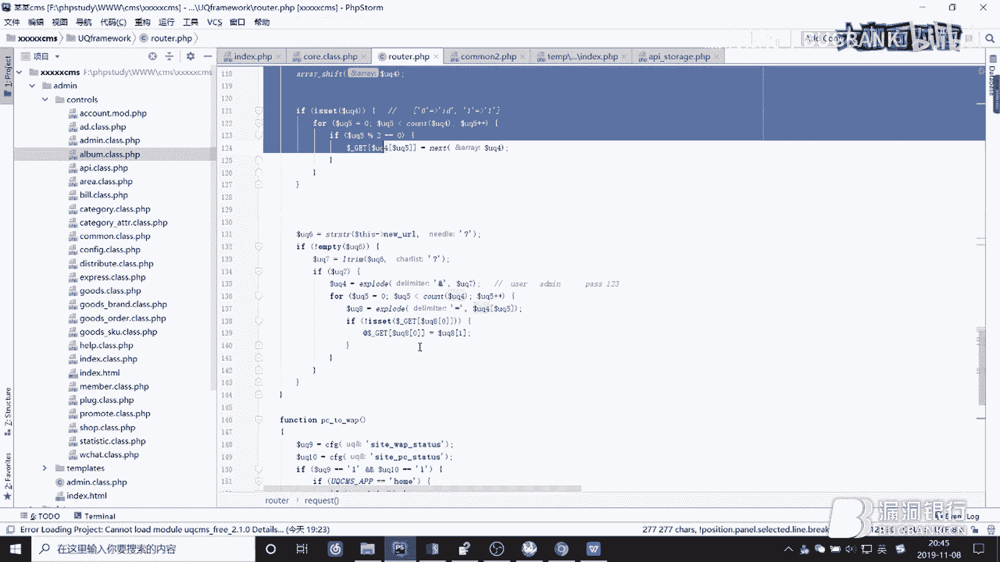

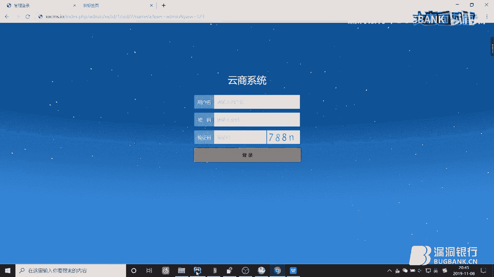

路由是理解程序如何将URL映射到具体控制器和方法的关键。在我们的目标程序中，路由解析过程大致如下：

1.  获取用户请求的URL路径。
2.  根据斜杠 `/` 将路径分割成数组。
3.  数组的第一个元素通常用于判断访问哪个模块（如前台 `home`、后台 `admin`）。
4.  后续元素分别对应控制器名 `$m` 和方法名 `$a`。
5.  程序会根据模块、控制器、方法的信息，动态包含对应的类文件并实例化调用。

例如，一个访问 `http://target.com/index.php/admin/user/edit` 的请求，可能会被解析为：
*   模块：`admin`
*   控制器：`user`
*   方法：`edit`
*   最终会尝试加载并执行 `/admin/controller/user.php` 文件中的 `edit` 方法。

同时，程序会对 `$_GET` 参数进行重写和过滤，例如检查参数值是否只包含允许的字符（数字、字母、下划线、等号），这增加了通过GET请求进行SQL注入的难度。

### 第三步：理解数据流与安全过滤

在控制器中，程序通过自定义函数（如 `P()`）来获取用户输入（`$_POST`, `$_GET`, `$_COOKIE`）。这个函数通常会包含类型检查和过滤逻辑。

**核心关注点**：需要仔细查看这个输入处理函数。例如，函数可能对字符串调用 `htmlspecialchars()` 来防御XSS，但**这个函数默认不转义单引号 `'`**。如果后续SQL查询使用了单引号包裹变量，而输入数据没有经过 `addslashes()` 或类似函数处理，就可能存在SQL注入漏洞。

```php
// 示例：可能存在缺陷的输入处理
function P($input) {
    // 默认过滤，仅防XSS，不转义单引号
    $filtered = htmlspecialchars($input, ENT_QUOTES);
    // 注意：ENT_QUOTES 会转义双引号和单引号，但有些自定义函数可能只用默认参数(不转义单引号)
    // 或者像下面这样，根本没有转义：
    // $filtered = $input;
    return $filtered;
}
```

## 漏洞挖掘：SQL注入实例分析

通过通读，我们了解了程序框架。现在可以有针对性地查看控制器中的具体方法。

### 漏洞点一：未过滤的模型调用

在某个控制器方法中，我们发现如下代码：

```php
public function someAction() {
    $country = P($_POST['country']); // 使用P函数获取，可能未过滤单引号
    $province = P($_POST['province']);
    $city = P($_POST['city']);
    
    $data = $this->model->get_cn($country, $province, $city);
    // ...
}
```

跟进 `model->get_cn` 方法：

```php
public function get_cn($c, $p, $city) {
    // 直接拼接用户输入到SQL语句中，且没有用单引号包裹！
    $sql = "SELECT * FROM region WHERE country='{$c}' AND province='{$p}' AND city='{$city}'";
    return $this->db->getAll($sql); // 执行查询
}
```

**漏洞成因**：
1.  `P()` 函数可能未对输入中的单引号进行转义。
2.  `get_cn` 方法直接将三个变量拼接进SQL字符串。
3.  拼接时，变量 `$city` 在SQL语句中**没有被单引号包裹**（假设这是开发者的疏忽），导致攻击者可以逃逸出字符串限制，注入任意SQL代码。
4.  程序底层执行SQL查询时，如果出错，会将错误信息直接 `echo` 输出，这支持报错注入。

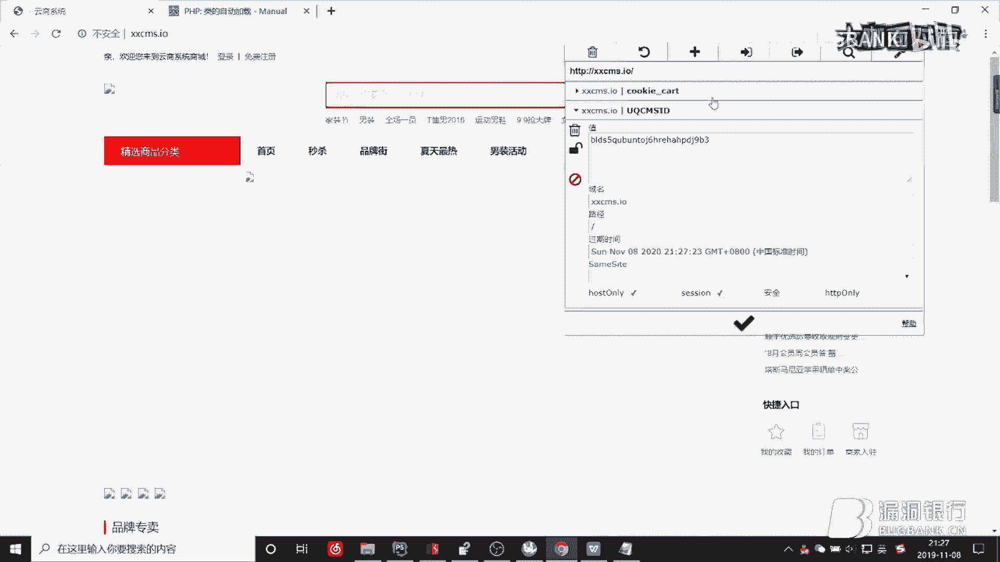

### 漏洞点二：Cookie中的注入

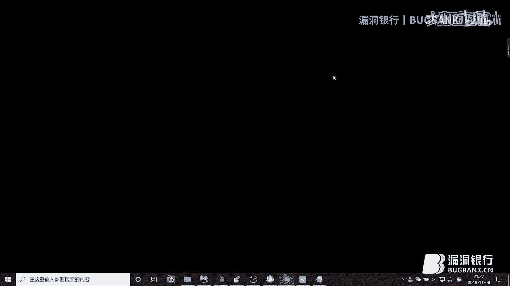

在另一个处理购物车的方法中：

```php
public function cart() {
    if (!$uid) { // 用户未登录
        $cart_id = $this->model->cookie_get('cart'); // 从Cookie中获取值
        $where = "cart_id='{$cart_id}'"; // 直接拼接进SQL
        $info = $this->db->getOne($where);
    }
    // ...
}
```

**漏洞成因**：
1.  `cookie_get` 方法直接从 `$_COOKIE` 中取值，全局代码显示未对Cookie内容做过滤。
2.  获取到的 `$cart_id` 被直接拼接进SQL语句的字符串中（这次有单引号包裹）。
3.  由于Cookie值完全可控且未过滤单引号，攻击者可以伪造Cookie进行SQL注入。

### 漏洞验证

对于漏洞点二，我们可以构造一个包含单引号和注入语句的Cookie：
```
Cookie: cart=1' AND updatexml(1,concat(0x7e,(SELECT user())),1)--+
```
访问购物车页面，程序在拼接SQL执行时会出错，并将数据库错误信息（包含查询结果）打印到页面上，从而证实漏洞存在。

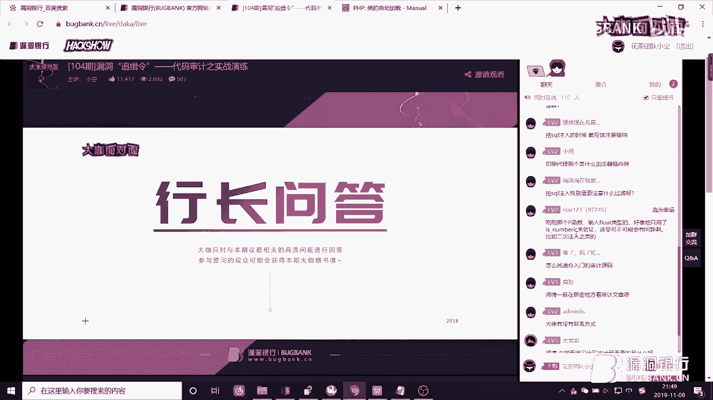


## 总结与拓展

本节课中我们一起学习了PHP代码审计的基本流程：

1.  **理解目标**：首先认识代码审计和MVC模式。
2.  **通读框架**：从单入口文件入手，分析程序的路由机制、初始化流程和全局过滤函数。
3.  **追踪数据流**：关注用户输入（GET、POST、COOKIE）如何被获取、处理，并最终流向敏感函数（如SQL查询）。
4.  **定位漏洞**：重点寻找那些将用户输入**直接拼接**到SQL语句中，且拼接点**缺少有效过滤**（特别是单引号转义）或**缺少边界符**（如单引号）的地方。
5.  **思考绕过**：即使有过滤，也要考虑是否可能存在编码绕过、二次注入等高级技巧。

审计时不要只盯着SQL注入，也应注意文件上传、命令执行、逻辑漏洞等。对于MVC程序，还要关注权限验证是否在基类控制器中全局生效，是否存在控制器漏掉了继承从而绕过了验证。

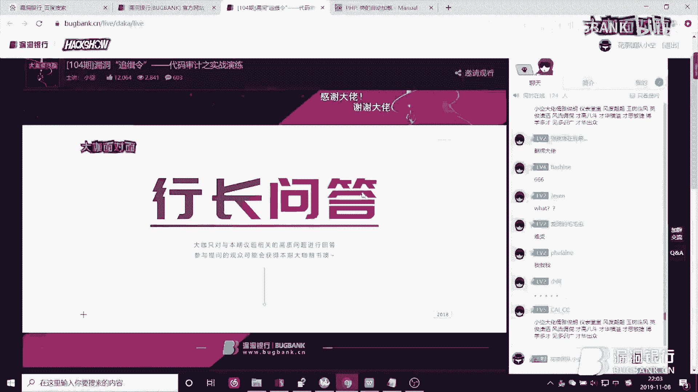

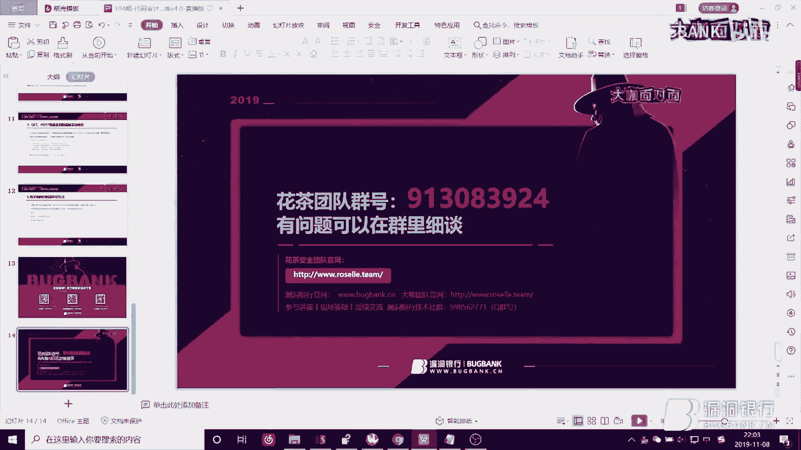

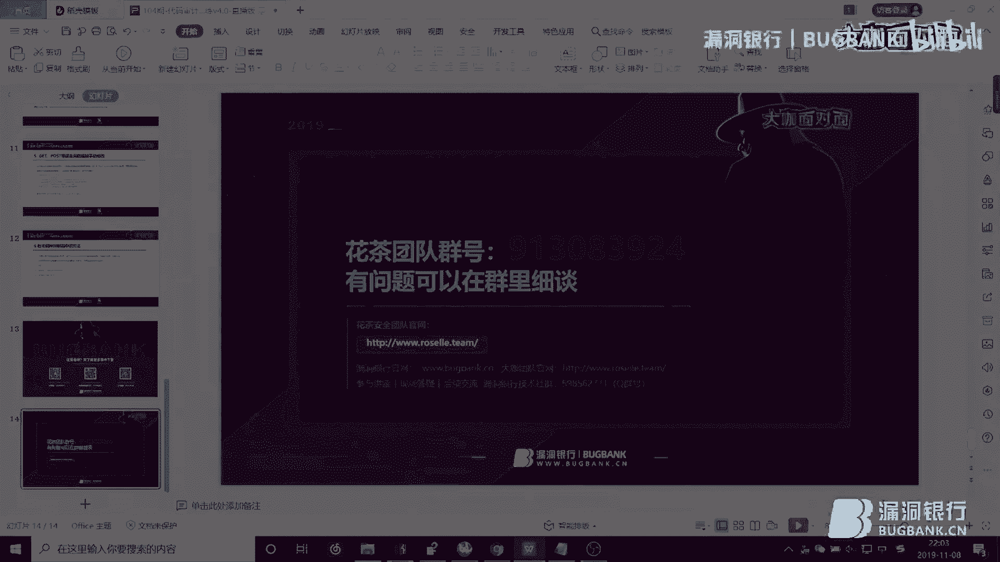


**给初学者的建议**：扎实的PHP语法基础（尤其是面向对象编程）是代码审计的基石。多阅读优秀的审计文章和经典漏洞分析，积累经验模式和敏感函数知识。从中小型程序开始实践，逐步挑战更复杂的系统。