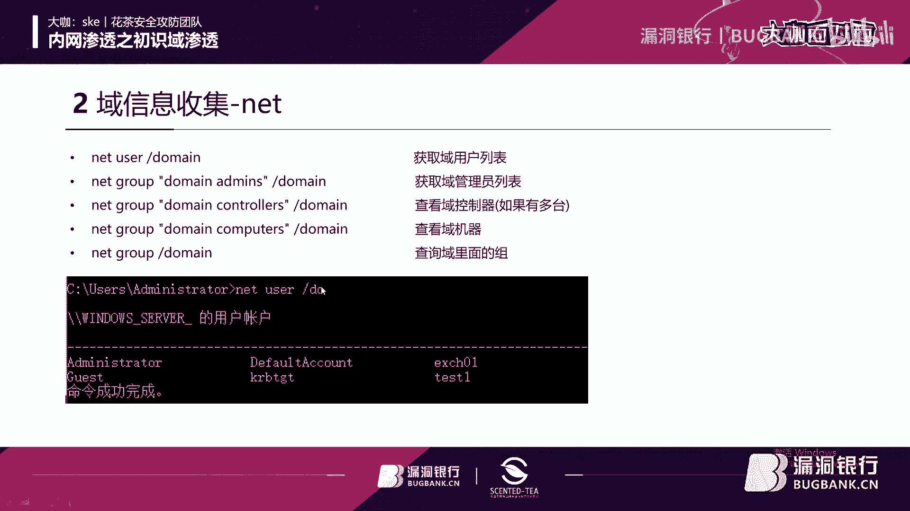
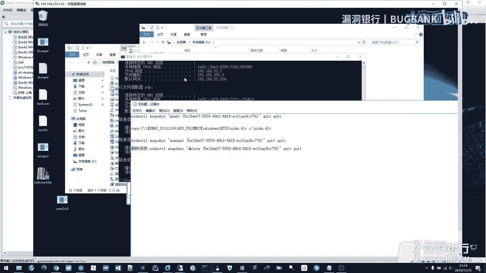

# 课程 P1：初识域渗透 v2.0 🏰


在本节课中，我们将要学习内网渗透的基础知识，特别是关于“域”环境的核心概念。我们将了解什么是域、域渗透的基本流程以及相关的关键术语，为后续深入学习打下基础。


## 概述


欢迎参加第105期漏洞银行安全技术直播“大咖面对面”。本次课程的主题是“初识域渗透”。我们将从一个简单的比喻开始，逐步深入到技术细节。


## 什么是域？🌐


上一节我们介绍了课程主题，本节中我们来看看“域”到底是什么。


可以将“域”理解为一个大型公司的内部网络。在这个网络中，有一台核心服务器（域控制器）负责管理所有员工的电脑（域成员）账户和权限。这就像公司的人事部，掌握着所有员工的档案和门禁卡权限。





**核心公式**：
```
域环境 = 域控制器 (DC) + 域成员 (Client) + 活动目录 (AD)
```


## 域渗透的基本目标 🎯


理解了域的概念后，我们来看看渗透测试人员在域环境中的主要目标。


简单来说，最终目标是获取**域控制器**的最高控制权，即成为“域管理员”。一旦获得此权限，就意味着可以控制整个域内的所有计算机和资源。


以下是渗透测试中常见的几个阶段性目标：
*   **获取本地管理员权限**：控制单台计算机。
*   **获取域普通用户权限**：能够以域用户身份登录域内其他机器。
*   **权限提升**：从普通用户提升为域管理员。
*   **横向移动**：从已控制的机器，向域内其他机器扩散控制权。
*   **持久化**：在目标系统中留下后门，保证长期控制。


## 核心概念与术语 📖


为了顺利进行后续学习，我们需要掌握一些关键术语。以下是域渗透中必须了解的基本概念：


*   **活动目录 (AD)**：域控制器上用于存储所有网络对象（用户、组、计算机、策略）的数据库服务。它是域的“大脑”。
*   **域控制器 (DC)**：运行活动目录服务的服务器，负责域内所有认证和管理工作。
*   **域成员**：加入域并接受域控制器管理的计算机。
*   **组策略 (GPO)**：域控制器下发给域成员的统一配置和管理策略，如密码策略、软件安装等。
*   **信任关系**：不同域之间建立的桥梁，允许一个域的用户访问另一个域的资源。


## 一个简单的渗透流程示例 🔄


现在，让我们将上述概念串联起来，看一个简化的攻击流程示例。


假设攻击者已经通过某种方式（如钓鱼邮件）进入内网，并控制了一台普通的域成员计算机。


**基本流程代码描述**：
```plaintext
1. 信息收集 (Information Gathering)
   -> 执行命令：`net view /domain` 查看域名称
   -> 执行命令：`net group “domain computers” /domain` 查看域内计算机


2. 权限提升 (Privilege Escalation)
   -> 在本地计算机寻找漏洞，从普通用户提权为本地管理员。


3. 凭证窃取 (Credential Theft)
   -> 转储内存中的密码哈希：使用工具如 Mimikatz
   -> 代码示例（概念）：`sekurlsa::logonpasswords`




4. 横向移动 (Lateral Movement)
   -> 利用窃取的凭证，尝试登录域内其他计算机。
   -> 例如使用：`psexec \\目标IP -u 域用户 -p 密码 cmd`


5. 定位域管理员 (Find Domain Admin)
   -> 寻找域管理员登录的机器，并设法控制它。


6. 攻击域控制器 (Attack Domain Controller)
   -> 利用获取的高权限，最终攻陷域控制器。
```


这个过程清晰地展示了攻击者如何一步步从边缘位置渗透到网络核心。


## 总结


本节课中我们一起学习了域渗透的基础知识。我们首先将“域”类比为公司的管理体系，理解了域控制器、活动目录等核心组件的作用。然后，我们明确了域渗透的终极目标是获取域控制器的最高权限，并梳理了达成此目标可能经历的步骤，如信息收集、权限提升和横向移动。最后，通过一个简化的流程示例，我们将这些概念和步骤串联起来，形成了一个初步的认知框架。掌握这些基础知识是后续学习具体渗透技术和工具的前提。