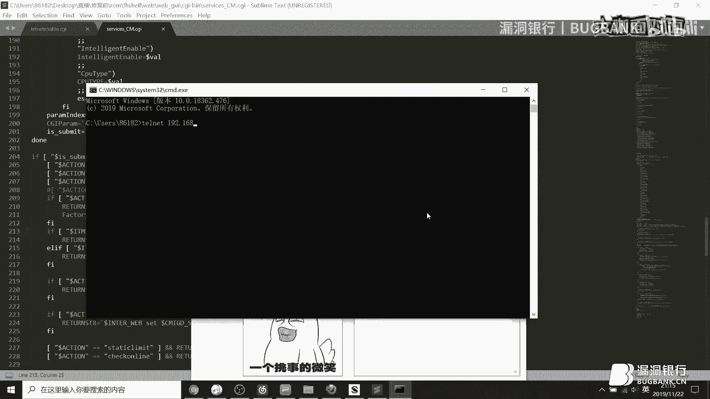

# 课程P1：边界IoT漏洞挖掘精要 🛡️💻


在本课程中，我们将学习物联网（IoT）漏洞挖掘的核心概念、技术方向、经典案例，并通过一个边界网关的实战演示，深入理解IoT设备的安全风险与挖掘方法。

---

## 概述 📋

物联网（IoT）是互联网的延伸和扩展，它将各种信息传感设备与传统网络结合，实现万物互联。IoT设备依赖于网络，但又可以独立运行。本节课将系统介绍IoT的概念、分类、安全威胁、漏洞挖掘技术，并通过案例分析，帮助初学者掌握IoT安全研究的基本方法。

---

## 一、IoT概念与分类 🌐

上一节我们概述了课程内容，本节中我们来看看IoT的基本概念和主要分类。

IoT是“Internet of Things”的缩写，即物联网。它是在互联网基础上延伸和扩展的网络，通过将各种信息传感设备与传统互联网结合，实现在任何时间、任何地点对万物的连接与控制。

IoT设备依赖于网络进行远程控制，例如通过手机APP操控家中的智能设备。同时，它也可以独立于网络运行，例如使用专用的物联网协议遥控器进行本地控制。

目前，IoT主要分为以下四大类：

*   **私有物联网**：面向单一机构内部提供服务，例如学校的水卡和饭卡系统。
*   **公有物联网**：向公众提供服务，例如街边的智能贩卖机。
*   **社区物联网**：向一个关联的社区或机构群体提供服务，例如小区内的智能路灯和门禁系统。
*   **混合物联网**：上述多种类型的集合，由统一的运维实体进行管控。

在民生领域，我们日常接触的IoT设备主要包括以下几类：

*   **智能设备**：如智能机器人、农业无人机、智能灭蚊灯等。
*   **智慧城市**：如智能路灯、交通信号灯、智能地图系统等。
*   **智慧家庭**：如智能音箱、智能家电等。
*   **边界设备**：如路由器、视频监控、智能网关等暴露在接入网络的设备。

---

## 二、IoT安全威胁与漏洞挖掘方向 🔓

了解了IoT的基本分类后，本节我们将探讨IoT面临的安全威胁以及漏洞挖掘的主要技术方向。

### IoT安全威胁汇总

IoT设备的安全威胁可以从多个层面进行分析：

1.  **物理层面**：
    *   固件提取难度（如芯片加密、防拆解）。
    *   调试接口的加密与解密。
    *   电磁攻击。

2.  **协议层面**：
    *   端口和无线电通信协议的安全问题。
    *   通信协议加密被破解（例如Wi-Fi密码破解）。
    *   身份认证绕过、硬编码后门、身份欺骗等。

3.  **二进制层面**：
    *   缓冲区溢出漏洞。
    *   逻辑缺陷导致的拒绝服务（DoS）。

4.  **应用/服务层面**：
    *   Web服务漏洞（如路由器管理界面）。
    *   基础应用漏洞（如FTP、SNMP服务）。

5.  **外部威胁**：
    *   DNS劫持。
    *   网络嗅探。

### 漏洞挖掘技术方向与要点

要对IoT设备进行漏洞挖掘，首先需要搭建相应的研究环境。

以下是需要准备的核心环境与工具：

*   **交叉编译环境**：用于运行和调试从不同架构（如ARM, MIPS）的IoT设备中提取的二进制文件。
    *   公式：`编译环境（Host） -> 目标二进制（Target Architecture）`
*   **虚拟机系统**：用于模拟和运行IoT设备的固件，特别是在没有真实设备时。
*   **固件提取与审计工具**：
    *   **IDA Pro**：用于反汇编和逆向分析二进制文件。
    *   **Binwalk**：用于固件解包和分析。
    *   **Firmware Analysis Toolkit (FAT)**：集成了多种固件解包工具。
    *   **GDB**：用于动态调试。
    *   文本编辑器（如Notepad++）：用于审计脚本文件（如CGI、PHP）。

在无线协议审计方面，常用的工具有：

*   **ATF (Attify Framework)** / **ZBF (ZigBee Framework)**：用于抓包、重放ZigBee协议。
*   **HackRF**：专业的软件定义无线电（SDR）工具，支持审计蓝牙、ZigBee、Z-Wave、NFC等多种无线协议。
*   **Ubertooth** / **BlueZ**：用于蓝牙协议的嗅探与分析。
*   **Proxmark3**：用于分析和攻击RFID/NFC卡片（如门禁卡、水卡）。

---

## 三、IoT架构与攻击面分析 🎯

上一节我们介绍了挖掘所需的工具，本节我们来分析IoT的常见架构和对应的攻击面。

### 常见物联网架构

一个典型的IoT系统（如智能家居）通常包含以下五个部分：

1.  **传感器**：感知物理世界信息（如摄像头、温度传感器）。
2.  **执行器**：接收指令并执行物理操作（如智能开关、电机）。
3.  **网关**：负责收集传感器数据、转发控制命令，是本地设备与外部网络的中枢。它通常具备多种网络接口（如Wi-Fi、ZigBee）。
4.  **云平台**：提供远程访问、数据存储和分析服务。
5.  **用户终端**：如手机APP、电脑客户端，为用户提供控制界面。

数据流示例：用户通过APP发送“打开客厅灯”指令 -> 指令经云平台转发至家庭网关 -> 网关通过ZigBee协议将指令发送给智能灯泡（执行器）-> 灯亮。

### 网络层攻击面

针对IoT网络层，攻击者主要关注以下几个面：

*   **管理界面**：设备本地的Web管理界面、SSH/Telnet服务。
*   **云服务界面**：厂商提供的云端管理平台。
*   **移动应用程序**：手机APP本身及其与云端/设备的通信协议。
*   **无线通信协议**：如ZigBee、蓝牙、Z-Wave等短距离无线协议。
*   **各种API接口**：设备或云服务暴露的各类数据接口。

攻击方式可归纳为两类：

1.  **小范围无线网络协议攻击**：
    *   **方向**：蓝牙未授权访问、无线数据重放、协议解密。
    *   **案例**：攻击者监听智能门锁的ZigBee开锁指令并重放，实现非法开锁。
2.  **大范围网络协议攻击**：
    *   **方向**：在上一类基础上，增加了对传统网络（如Wi-Fi、以太网）和云服务的攻击。
    *   **案例**：通过漏洞入侵IoT云平台，越权绑定他人设备，进而控制其家中所有智能设备。

---

## 四、漏洞挖掘核心与经典案例 📖

本节我们将聚焦漏洞挖掘的核心思想，并通过几个经典案例加深理解。

### 漏洞挖掘的三个核心方面

无论漏洞类型如何，其本质都离不开以下三点：


1.  **输入**：找到用户可控的数据输入点。
2.  **输出**：观察输入数据经过系统处理后产生的输出结果。
3.  **数据流**：跟踪数据从输入到输出的整个处理流程，寻找逻辑缺陷。

**核心思想**：**可控性**。攻击者需要找到能够影响系统行为或数据的地方。


### 高价值漏洞类型

在IoT漏洞挖掘中，以下几类漏洞价值较高：


*   **未授权访问**：无需认证即可访问敏感功能或接口。例如，Telnet端口默认开放且无需密码。
*   **信息泄露**：可获取账号密码、配置文件等敏感信息。例如，通过任意文件下载漏洞获取`/etc/passwd`。
*   **命令注入**：在Web界面或参数中注入操作系统命令并执行。
*   **二进制漏洞**：如栈溢出、堆溢出、格式化字符串漏洞。
*   **权限绕过与后门**：登录逻辑缺陷、硬编码的后门账户或调试接口。
*   **无线协议重放**：捕获无线控制指令并重放，实现未授权操作。


### 经典案例分析


以下是几个历史上著名的IoT漏洞案例：


1.  **华为路由器UPnP命令注入 (CVE-2017-17215)**：
    *   **漏洞点**：UPnP服务（端口37215）在处理`<NewDownloadURL>`标签时，未对用户输入进行过滤，直接拼接进系统命令中执行。
    *   **POC关键代码**：
        ```xml
        <NewDownloadURL>;telnetd -l /bin/sh -p 9999;</NewDownloadURL>
        ```
    *   **本质**：输入验证缺失导致命令注入。


2.  **打印机未授权访问与命令执行**：
    *   **漏洞点**：打印机开放的9100端口（打印服务协议）未对提交的PJL（打印机作业语言）命令进行权限校验和隔离。
    *   **攻击流程**：
        1.  扫描发现开放9100端口的打印机。
        2.  通过PJL命令读取打印机文件系统，找到可写目录。
        3.  写入恶意脚本，并利用打印机重启机制执行脚本。
        4.  脚本反弹Shell，获取root权限。
    *   **演示代码**（耗尽纸张的DoS）：
        ```python
        import socket
        printer_ip = "192.168.1.100"
        port = 9100
        s = socket.socket(socket.AF_INET, socket.SOCK_STREAM)
        s.connect((printer_ip, port))
        # 循环发送打印“hack”的指令，耗尽纸张
        while True:
            s.send(b"\x1B%-12345X@PJL\n@PJL SET COPIES=1\n@PJL ENTER LANGUAGE=PCL\n...hack...\n\x1B%-12345X")
        s.close()
        ```


3.  **某型号光猫未授权到RCE**：
    *   **漏洞链**：
        1.  **未授权信息泄露**：Web接口`/ajax.cgi?func=get_basic_info`未做权限验证，直接返回设备配置文件内容，包含管理员密码。
        2.  **后台命令注入**：登录后台后，`/do_cgi`接口对`ip`参数未做过滤，直接拼接执行，导致命令注入。
    *   **利用过程**：未授权获取密码 -> 登录后台 -> 通过命令注入获取Shell。




---


## 五、边界网关实战演示 🧪


理论结合实践，本节我们将对一个真实的边界网关设备（家用光猫）进行漏洞挖掘实战演示。


**目标设备**：某型号家用光猫（边界网关）。
**演示漏洞**：远程命令执行、开启Telnet服务、任意文件下载、用户密码修改。


### 漏洞1：远程命令执行


*   **漏洞文件**：`/cgi-bin/telnet.cgi` (一个Shell脚本编写的CGI程序)。
*   **漏洞分析**：
    1.  脚本通过POST接收参数`input_cmd`。
    2.  未对`input_cmd`做任何过滤，直接将其写入一个临时脚本文件。
    3.  执行该临时脚本文件，并将输出结果返回。
*   **攻击模拟**：
    1.  构造POST请求，`input_cmd=ifconfig`。
    2.  发送请求，成功执行`ifconfig`命令并返回网络配置信息。
*   **关键代码段（修复前）**：
    ```bash
    # 从POST数据中提取input_cmd参数的值
    INPUT_CMD=$(echo "$POST_DATA" | grep -oE 'input_cmd=[^&]*' | cut -d= -f2)
    # 将命令写入文件并执行
    echo "$INPUT_CMD" > /tmp/telnet_input.sh
    chmod +x /tmp/telnet_input.sh
    /tmp/telnet_input.sh > /tmp/telnet_output.log 2>&1
    ```


### 漏洞2：开启Telnet服务


*   **漏洞文件**：`/cgi-bin/telnet.cgi` 或 `/cgi-bin/service.cgi`。
*   **漏洞分析**：通过Web接口传入特定参数（如`telnet_enable=1`），即可直接开启设备的Telnet服务（端口23），通常无需权限验证或验证可绕过。
*   **攻击模拟**：发送请求开启Telnet，然后用`telnet`客户端连接，获得设备命令行访问权限。

### 漏洞3：任意文件下载


*   **漏洞文件**：`/cgi-bin/download.cgi`。
*   **漏洞分析**：`download_path`参数用户可控，程序会将该参数指定的路径文件打包并供用户下载，未对路径进行限制。
*   **攻击模拟**：构造请求，`download_path=/etc/passwd`，成功下载系统密码文件。

### 漏洞4：用户密码修改

*   **漏洞文件**：`/cgi-bin/password.cgi`。
*   **漏洞分析**：
    1.  GET请求时，该接口直接返回当前用户名和密码（明文或哈希）。
    2.  POST请求时，接受`password`参数，直接修改配置文件中的密码字段，无旧密码验证。
*   **攻击模拟**：
    1.  GET请求获取当前密码。
    2.  POST请求将密码修改为攻击者设定的值。
    3.  使用新密码登录设备管理界面。

### 修复方案

以**远程命令执行**漏洞为例，厂商修复时增加了权限校验：

*   **修复后代码关键添加**：
    ```bash
    # 检查特定的“钥匙”文件是否存在，若不存在则退出，不执行命令
    if [ ! -f /var/run/security_key ] || [ ! -f /var/run/factory_mode ]; then
        echo "Access Denied"
        exit 1
    fi
    ```
    *这段代码试图通过检查特定文件来限制命令执行功能的访问，但若攻击者能找到方法创建或影响这些文件，则防护可能失效。*

---

## 六、总结与答疑 🎓

本节课中我们一起学习了IoT漏洞挖掘的完整知识体系。

### 课程总结

1.  **IoT概念**：物联网是万物互联的网络，兼具网络依赖与独立运行特性。
2.  **安全威胁**：涵盖物理、协议、二进制、应用、外部等多个层面。
3.  **挖掘准备**：需要搭建交叉编译、虚拟机环境，并熟悉IDA、Binwalk、无线审计工具等。
4.  **攻击面**：重点关管理界面、云服务、无线协议、API接口。
5.  **挖掘核心**：围绕**输入、输出、数据流**，寻找**可控点**。
6.  **漏洞类型**：优先关注未授权访问、信息泄露、命令注入等高危漏洞。
7.  **实战流程**：通常从Web等网络层入手（难度较低），再深入协议层、二进制层（难度较高）。

### 答疑精选

*   **问：如何防御ZigBee的PD（Packet Delivery）冲突攻击？**
    *   **答**：ZigBee是开放协议。主要依赖厂商在应用层增加加密、身份认证等安全机制来缓解。
*   **问：找不到固件的运行内存（RAM）地址怎么办？**
    *   **答**：需要从提取的固件中手动分析、定位。不同设备差异大，需耐心逆向。
*   **问：汇编语言怎么学？**
    *   **答**：从基础指令集开始，结合简单程序逆向分析，多动手实践。初期理解即可，编写利用代码（EXP）时需要更深入的知识。
*   **问：调试后门一般怎么找？**
    *   **答**：可通过逆向分析二进制文件，寻找硬编码的密码、非常规的调试命令（如`*#0000#`）或未公开的管理接口。


---


**致谢**：感谢花茶安全团队的分享，以及漏洞银行提供的交流平台。希望本教程能帮助你踏入IoT安全研究的大门。万物互联，安全先行。